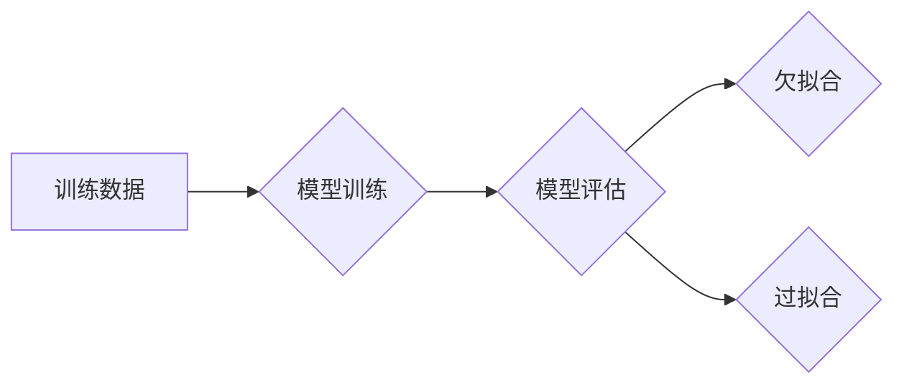

## 关键词：欠拟合、机器学习、模型训练、过拟合、泛化能力、特征工程

## 1. 背景介绍

在机器学习领域，我们致力于训练模型以从数据中学习规律，并能够对新数据进行准确预测。然而，模型训练并非总是顺利的。有时，模型的表现远低于预期，即使在训练数据上也无法达到理想效果。这种现象被称为**欠拟合 (Underfitting)**。

欠拟合是指模型学习能力不足，无法捕捉数据中的复杂模式和关系。简单来说，模型过于简单，无法准确地反映数据本身的特性。

## 2. 核心概念与联系

欠拟合与过拟合 (Overfitting) 是机器学习中两个常见的问题，它们是模型复杂度与训练数据大小之间的平衡问题。

**Mermaid 流程图:**



**核心概念原理和架构:**

* **训练数据:** 机器学习模型的训练基础，包含了已知输入和输出的样本数据。
* **模型训练:** 通过算法调整模型参数，使模型能够从训练数据中学习规律。
* **模型评估:** 使用测试数据评估模型的性能，判断模型是否能够泛化到未知数据。
* **欠拟合:** 模型学习能力不足，无法准确地拟合训练数据，导致在训练数据和测试数据上的表现都较差。
* **过拟合:** 模型过于复杂，过度拟合训练数据，导致在训练数据上表现良好，但在测试数据上的表现却很差。

## 3. 核心算法原理 & 具体操作步骤

### 3.1  算法原理概述

欠拟合通常是由于模型过于简单，无法捕捉数据中的复杂模式和关系。解决欠拟合的方法主要有以下几种：

* **增加模型复杂度:** 增加模型的层数、节点数量或其他参数，使模型能够学习更复杂的模式。
* **增加训练数据:** 更多的训练数据可以帮助模型更好地理解数据分布和规律。
* **改进特征工程:** 通过选择更合适的特征或组合特征，可以提高模型的学习能力。
* **正则化:** 通过添加惩罚项到损失函数中，可以防止模型过拟合，同时也能提高模型的泛化能力。

### 3.2  算法步骤详解

1. **数据预处理:** 对训练数据进行清洗、转换和特征工程，以提高模型的学习效率。
2. **模型选择:** 选择合适的模型类型，例如线性回归、决策树、支持向量机等。
3. **模型训练:** 使用训练数据训练模型，调整模型参数以最小化损失函数。
4. **模型评估:** 使用测试数据评估模型的性能，例如准确率、召回率、F1-score等。
5. **模型调优:** 根据模型评估结果，调整模型参数、增加训练数据或改进特征工程，以提高模型的性能。

### 3.3  算法优缺点

**优点:**

* 容易理解和实现。
* 计算成本较低。

**缺点:**

* 学习能力有限，难以捕捉复杂模式。
* 容易出现欠拟合问题。

### 3.4  算法应用领域

欠拟合问题普遍存在于各种机器学习应用场景中，例如：

* **分类问题:** 当模型无法准确区分不同类别的数据时，可能出现欠拟合问题。
* **回归问题:** 当模型无法准确预测连续值时，可能出现欠拟合问题。
* **聚类问题:** 当模型无法将数据正确地聚类时，可能出现欠拟合问题。

## 4. 数学模型和公式 & 详细讲解 & 举例说明

### 4.1  数学模型构建

欠拟合问题可以用一个简单的线性回归模型来举例说明。假设我们有一个数据集，其中包含房屋面积和房屋价格的信息。如果我们使用一个线性模型来拟合这些数据，那么模型的输出将是一个关于房屋面积的线性函数。

如果数据中存在非线性关系，那么线性模型将无法准确地拟合这些数据，从而导致欠拟合问题。

### 4.2  公式推导过程

线性回归模型的数学公式如下：

$$y = w_0 + w_1x$$

其中：

* $y$ 是预测值
* $x$ 是输入特征
* $w_0$ 和 $w_1$ 是模型参数

模型的目标是找到最佳的 $w_0$ 和 $w_1$ 值，使得模型的预测值与实际值之间的误差最小。

### 4.3  案例分析与讲解

假设我们有一个数据集，其中包含以下房屋面积和房屋价格的信息：

| 房屋面积 (平方米) | 房屋价格 (万元) |
|---|---|
| 50 | 100 |
| 100 | 200 |
| 150 | 300 |
| 200 | 400 |

如果我们使用线性回归模型来拟合这些数据，那么模型的预测值将是一个关于房屋面积的线性函数。

然而，如果我们观察这些数据，我们会发现数据点呈现出一种非线性趋势。因此，使用线性模型来拟合这些数据会导致欠拟合问题。

## 5. 项目实践：代码实例和详细解释说明

### 5.1  开发环境搭建

本项目使用 Python 语言和 scikit-learn 库进行实现。

**依赖库:**

```python
pip install scikit-learn numpy matplotlib
```

### 5.2  源代码详细实现

```python
import numpy as np
from sklearn.linear_model import LinearRegression
from sklearn.model_selection import train_test_split
import matplotlib.pyplot as plt

# 生成示例数据
np.random.seed(0)
X = np.random.rand(100, 1) * 10
y = 2 * X**2 + np.random.randn(100, 1)

# 将数据划分为训练集和测试集
X_train, X_test, y_train, y_test = train_test_split(X, y, test_size=0.2, random_state=42)

# 创建线性回归模型
model = LinearRegression()

# 训练模型
model.fit(X_train, y_train)

# 预测测试集数据
y_pred = model.predict(X_test)

# 绘制训练数据和预测结果
plt.scatter(X_train, y_train, color='blue', label='训练数据')
plt.plot(X_test, y_pred, color='red', label='预测结果')
plt.xlabel('房屋面积 (平方米)')
plt.ylabel('房屋价格 (万元)')
plt.legend()
plt.show()
```

### 5.3  代码解读与分析

* 首先，我们生成了一些示例数据，其中包含房屋面积和房屋价格的信息。
* 然后，我们将数据划分为训练集和测试集。
* 接下来，我们创建了一个线性回归模型，并使用训练数据训练模型。
* 训练完成后，我们使用模型预测测试集数据。
* 最后，我们绘制了训练数据和预测结果的图表，以直观地观察模型的性能。

### 5.4  运行结果展示

运行代码后，我们会得到一个图表，其中显示了训练数据和预测结果。

从图表中可以看出，线性模型无法准确地拟合数据，导致欠拟合问题。

## 6. 实际应用场景

欠拟合问题在实际应用场景中非常常见。例如：

* **医疗诊断:** 如果一个模型无法准确区分健康和疾病状态，可能导致误诊。
* **金融预测:** 如果一个模型无法准确预测股票价格或客户信用风险，可能导致投资损失或贷款风险。
* **图像识别:** 如果一个模型无法准确识别图像中的物体，可能导致图像搜索结果不准确。

## 7. 工具和资源推荐

### 7.1  学习资源推荐

* **书籍:**
    * 《机器学习》 - 周志华
    * 《深入理解机器学习》 -  李航
* **在线课程:**
    * Coursera: Machine Learning by Andrew Ng
    * edX: Artificial Intelligence by Columbia University

### 7.2  开发工具推荐

* **Python:** 
    * scikit-learn
    * TensorFlow
    * PyTorch

### 7.3  相关论文推荐

* **The Bias-Variance Tradeoff** - Vapnik, V. N. (1998)
* **Regularization and the Bias-Variance Tradeoff** - Hastie, T., Tibshirani, R., & Friedman, J. (2009)

## 8. 总结：未来发展趋势与挑战

### 8.1  研究成果总结

欠拟合问题是机器学习中一个重要的挑战，它与模型复杂度、训练数据大小和特征工程密切相关。通过增加模型复杂度、增加训练数据、改进特征工程和使用正则化技术，我们可以有效地解决欠拟合问题。

### 8.2  未来发展趋势

未来，随着机器学习技术的不断发展，解决欠拟合问题的方法将会更加丰富和完善。例如，深度学习模型的出现，为解决复杂模式的学习提供了新的可能性。

### 8.3  面临的挑战

尽管已经取得了一些进展，但解决欠拟合问题仍然面临着一些挑战，例如：

* 如何在增加模型复杂度和防止过拟合之间找到平衡点。
* 如何有效地选择和组合特征，以提高模型的学习能力。
* 如何利用更丰富的训练数据，例如文本数据、图像数据和视频数据，来解决更复杂的欠拟合问题。

### 8.4  研究展望

未来，研究人员将继续探索新的方法来解决欠拟合问题，并将其应用于更广泛的领域。

## 9. 附录：常见问题与解答

**问题 1:** 如何判断模型是否出现欠拟合？

**答案:** 

* 模型在训练数据和测试数据上的性能都较差。
* 模型的学习曲线比较平坦，即训练误差和测试误差都比较稳定，没有明显的下降趋势。

**问题 2:** 如何解决欠拟合问题？

**答案:**

* 增加模型复杂度。
* 增加训练数据。
* 改进特征工程。
* 使用正则化技术。


作者：禅与计算机程序设计艺术 / Zen and the Art of Computer Programming 
