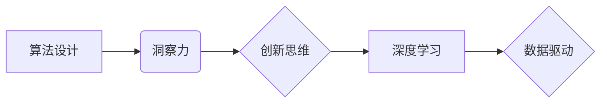

## 洞见的力量：从反思到创新

> 关键词：人工智能、深度学习、算法设计、创新思维、洞察力、数据分析、机器学习

### 1. 背景介绍

在当今数据爆炸的时代，信息量呈指数级增长，人类面临着前所未有的信息处理挑战。如何从海量数据中提取有价值的洞察力，并将其转化为创新驱动力的关键在于人工智能（AI）技术的不断发展。AI，特别是深度学习，赋予了计算机以模拟人类学习和推理的能力，为我们提供了强大的工具，帮助我们洞察数据背后的隐藏规律，激发新的创意和解决方案。

然而，AI技术的应用并非一蹴而就。仅仅拥有强大的计算能力和海量数据还不够，更需要的是深刻的理解和洞察力。我们需要反思传统的思维模式，跳出固有的框架，才能真正发挥AI技术的潜力，将其转化为推动社会进步的创新力量。

### 2. 核心概念与联系

**2.1 算法设计与洞察力**

算法是AI的核心驱动力，它决定了AI模型如何学习和处理数据。优秀的算法设计不仅需要强大的数学基础和编程能力，更需要对问题本质的深刻理解和洞察力。

**2.2 深度学习与数据驱动**

深度学习是一种基于多层神经网络的机器学习方法，它能够从复杂的数据中自动提取特征，并学习复杂的模式。深度学习的成功离不开海量数据的支持，数据驱动是深度学习的核心原则。

**2.3 创新思维与洞察力**

创新思维是人类区别于其他物种的关键能力，它让我们能够从现有知识和经验中跳跃出新的思考模式，产生新的想法和解决方案。洞察力是创新思维的基础，它指对事物本质的深刻理解和透彻的认识。

**2.4  核心概念关系图**



### 3. 核心算法原理 & 具体操作步骤

**3.1 算法原理概述**

本文将重点介绍深度学习中的卷积神经网络（CNN）算法，它在图像识别、物体检测等领域取得了显著的成果。CNN算法的核心思想是利用卷积操作提取图像特征，并通过多层神经网络进行特征学习和分类。

**3.2 算法步骤详解**

1. **输入图像:** 将图像数据作为输入，每个像素点对应一个数值。
2. **卷积层:** 使用多个卷积核对图像进行卷积操作，提取图像局部特征。卷积核是具有特定权重的过滤器，通过滑动在图像上，计算每个位置的卷积结果。
3. **激活函数:** 将卷积层的输出通过激活函数进行非线性变换，引入非线性因素，提高模型的表达能力。常见的激活函数包括ReLU、Sigmoid等。
4. **池化层:** 对卷积层的输出进行池化操作，例如最大池化，减少特征图的大小，提高模型的鲁棒性。
5. **全连接层:** 将池化层的输出连接到全连接层，进行特征融合和分类。全连接层将每个特征映射到多个类别，并通过softmax函数输出每个类别的概率。
6. **输出结果:** 根据输出概率，预测图像的类别。

**3.3 算法优缺点**

**优点:**

* 能够自动提取图像特征，无需人工特征工程。
* 表现能力强，在图像识别、物体检测等任务中取得了优异的性能。
* 鲁棒性好，对图像的旋转、缩放、平移等变换具有较强的适应性。

**缺点:**

* 训练数据量大，需要大量的标注数据。
* 计算量大，训练时间长。
* 可解释性差，难以理解模型的决策过程。

**3.4 算法应用领域**

CNN算法广泛应用于图像识别、物体检测、图像分类、人脸识别、医疗影像分析等领域。

### 4. 数学模型和公式 & 详细讲解 & 举例说明

**4.1 数学模型构建**

CNN算法的核心是卷积操作和激活函数。卷积操作可以表示为以下公式：

$$
y(i,j) = \sum_{m=0}^{M-1} \sum_{n=0}^{N-1} x(i+m,j+n) * w(m,n)
$$

其中：

* $y(i,j)$ 是卷积层的输出值。
* $x(i+m,j+n)$ 是输入图像的像素值。
* $w(m,n)$ 是卷积核的权重。
* $M$ 和 $N$ 是卷积核的大小。

**4.2 公式推导过程**

卷积操作本质上是将卷积核滑动在图像上，计算每个位置的加权和。卷积核的权重决定了它对图像特征的敏感度。通过多个卷积核，可以提取图像的不同层次的特征。

**4.3 案例分析与讲解**

假设我们有一个3x3的图像，以及一个3x3的卷积核。卷积操作的过程如下：

1. 将卷积核滑动到图像的左上角位置。
2. 计算卷积核与图像对应位置像素值的加权和。
3. 将结果作为卷积层的输出值。
4. 将卷积核滑动到图像的下一个位置，重复步骤2和3。
5. 直到卷积核滑动到图像的最后一行最后一列。

### 5. 项目实践：代码实例和详细解释说明

**5.1 开发环境搭建**

使用Python语言和深度学习框架TensorFlow或PyTorch搭建开发环境。

**5.2 源代码详细实现**

```python
import tensorflow as tf

# 定义卷积神经网络模型
model = tf.keras.models.Sequential([
    tf.keras.layers.Conv2D(32, (3, 3), activation='relu', input_shape=(28, 28, 1)),
    tf.keras.layers.MaxPooling2D((2, 2)),
    tf.keras.layers.Conv2D(64, (3, 3), activation='relu'),
    tf.keras.layers.MaxPooling2D((2, 2)),
    tf.keras.layers.Flatten(),
    tf.keras.layers.Dense(10, activation='softmax')
])

# 编译模型
model.compile(optimizer='adam',
              loss='sparse_categorical_crossentropy',
              metrics=['accuracy'])

# 训练模型
model.fit(x_train, y_train, epochs=10)

# 评估模型
loss, accuracy = model.evaluate(x_test, y_test)
print('Test loss:', loss)
print('Test accuracy:', accuracy)
```

**5.3 代码解读与分析**

代码定义了一个简单的卷积神经网络模型，包含两层卷积层、两层池化层、一层全连接层和softmax输出层。模型使用Adam优化器、交叉熵损失函数和准确率作为评估指标。

**5.4 运行结果展示**

训练完成后，模型可以用于预测新的图像类别。

### 6. 实际应用场景

CNN算法在图像识别、物体检测、图像分类等领域有着广泛的应用场景。

**6.1 图像识别**

CNN算法可以用于识别图像中的物体，例如人脸、车辆、动物等。

**6.2 物体检测**

CNN算法可以用于检测图像中多个物体的位置和类别。

**6.3 图像分类**

CNN算法可以用于将图像分类到不同的类别，例如风景、人物、建筑等。

**6.4 未来应用展望**

随着深度学习技术的不断发展，CNN算法的应用场景将会更加广泛，例如：

* 自动驾驶
* 医疗诊断
* 监控系统
* 机器人视觉

### 7. 工具和资源推荐

**7.1 学习资源推荐**

* 深度学习书籍：
    * 《深度学习》
    * 《动手学深度学习》
* 在线课程：
    * Coursera深度学习课程
    * Udacity深度学习课程

**7.2 开发工具推荐**

* 深度学习框架：
    * TensorFlow
    * PyTorch
* 图像处理库：
    * OpenCV
    * Pillow

**7.3 相关论文推荐**

* 《ImageNet Classification with Deep Convolutional Neural Networks》
* 《AlexNet》
* 《VGGNet》

### 8. 总结：未来发展趋势与挑战

**8.1 研究成果总结**

CNN算法在图像识别、物体检测等领域取得了显著的成果，推动了人工智能技术的快速发展。

**8.2 未来发展趋势**

* 模型效率提升：研究更轻量级的CNN模型，降低计算成本和内存消耗。
* 迁移学习：利用预训练模型，减少训练数据量和时间。
* 增强学习：结合强化学习，使CNN模型能够自主学习和适应新的环境。

**8.3 面临的挑战**

* 数据标注问题：高质量的标注数据是深度学习模型训练的基础，但数据标注成本高昂。
* 可解释性问题：CNN模型的决策过程难以理解，缺乏透明度。
* 伦理问题：深度学习模型可能存在偏见和歧视，需要关注其伦理问题。

**8.4 研究展望**

未来，我们将继续探索CNN算法的潜力，解决其面临的挑战，推动人工智能技术在更多领域得到应用。

### 9. 附录：常见问题与解答

**9.1 如何选择合适的卷积核大小？**

卷积核大小的选择取决于图像分辨率和特征提取的层次。较小的卷积核可以提取局部特征，较大的卷积核可以提取全局特征。

**9.2 如何避免过拟合？**

过拟合是指模型在训练数据上表现良好，但在测试数据上表现差。可以使用正则化技术、数据增强、Dropout等方法来避免过拟合。

**9.3 如何评估CNN模型的性能？**

可以使用准确率、召回率、F1-score等指标来评估CNN模型的性能。


作者：禅与计算机程序设计艺术 / Zen and the Art of Computer Programming 
