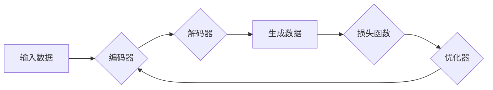

## 生成式AI的未来发展路径

> 关键词：生成式AI、Transformer模型、文本生成、图像生成、多模态生成、伦理问题、安全问题、未来趋势

## 1. 背景介绍

近年来，人工智能领域取得了令人瞩目的进展，其中生成式AI作为一类重要的应用，展现出强大的潜力，正在深刻地改变着我们与世界交互的方式。生成式AI能够根据输入的文本、图像或其他数据，生成新的、原创的内容，例如文本、图像、音频、视频等。

从早期基于规则的生成模型到如今的深度学习驱动的生成式AI，技术发展迅速。2017年，OpenAI发布了GPT（Generative Pre-trained Transformer）模型，标志着生成式AI进入了一个新的时代。GPT模型基于Transformer架构，能够学习和理解复杂的语言模式，并生成高质量的文本内容。此后，一系列基于Transformer的生成式AI模型相继问世，例如BERT、T5、LaMDA等，在自然语言处理、机器翻译、文本摘要等领域取得了突破性的进展。

除了文本生成，图像生成领域也取得了显著的突破。2022年，OpenAI发布了DALL-E 2模型，能够根据文本描述生成逼真的图像。其他图像生成模型，例如Stable Diffusion、Midjourney等，也展现出强大的生成能力，为艺术创作、设计领域提供了新的可能性。

## 2. 核心概念与联系

### 2.1 生成式AI的核心概念

生成式AI的核心概念是学习数据分布，并根据学习到的分布生成新的数据。

* **数据分布:** 指的是数据集中所有数据点的概率分布。生成式AI的目标是学习到数据的潜在结构和规律，从而能够生成符合该分布的新数据。
* **生成模型:** 指的是能够根据学习到的数据分布生成新数据的模型。

### 2.2 生成式AI的架构

生成式AI模型通常由以下几个部分组成：

* **编码器:** 将输入数据编码成一个低维的表示向量。
* **解码器:** 根据编码向量生成新的数据。
* **损失函数:** 用于衡量生成数据与真实数据的差异。
* **优化器:** 用于更新模型参数，使损失函数最小化。

**Mermaid 流程图**



### 2.3 生成式AI与其他AI技术的联系

生成式AI与其他AI技术密切相关，例如：

* **监督学习:** 生成式AI模型可以利用监督学习的原理进行训练，例如使用真实文本数据训练文本生成模型。
* **无监督学习:** 生成式AI模型也可以利用无监督学习的原理进行训练，例如使用文本数据进行聚类或降维，学习到文本的潜在结构。
* **强化学习:** 强化学习可以用于优化生成式AI模型的生成质量，例如使用奖励机制训练模型生成更符合用户期望的文本或图像。

## 3. 核心算法原理 & 具体操作步骤

### 3.1 算法原理概述

生成式AI的核心算法是**生成对抗网络（GAN）**。GAN由两个神经网络组成：生成器和鉴别器。

* **生成器:** 负责生成新的数据，例如文本、图像等。
* **鉴别器:** 负责判断数据是否为真实数据或生成数据。

GAN通过对抗训练的方式进行学习。生成器试图生成逼真的数据，而鉴别器试图区分真实数据和生成数据。两者相互竞争，最终生成器能够生成与真实数据相似的样本。

### 3.2 算法步骤详解

1. **初始化:** 生成器和鉴别器模型的初始参数。
2. **生成器训练:** 生成器根据随机噪声输入生成数据样本。
3. **鉴别器训练:** 鉴别器对真实数据和生成数据样本进行判别，并根据判别结果更新参数。
4. **评估:** 计算生成器生成的样本与真实样本的差异，例如使用感知器损失函数。
5. **更新:** 根据评估结果更新生成器参数。
6. **重复:** 重复步骤2-5，直到生成器生成的样本质量达到预定标准。

### 3.3 算法优缺点

**优点:**

* 可以生成高质量的样本，例如逼真的图像、流畅的文本等。
* 能够学习到数据的复杂分布，生成多样化的样本。

**缺点:**

* 训练过程比较复杂，需要大量的计算资源和时间。
* 容易出现模式崩溃问题，即生成器生成的数据过于单一或重复。
* 难以评估生成数据的质量，需要依赖人工判断或其他指标。

### 3.4 算法应用领域

* **图像生成:** 生成逼真的图像、艺术作品、产品设计等。
* **文本生成:** 生成高质量的文本内容，例如文章、故事、对话等。
* **音频生成:** 生成逼真的语音、音乐、音效等。
* **视频生成:** 生成逼真的视频片段、动画等。
* **数据增强:** 生成新的训练数据，提高机器学习模型的性能。

## 4. 数学模型和公式 & 详细讲解 & 举例说明

### 4.1 数学模型构建

GAN模型的数学模型主要包括生成器G和鉴别器D的损失函数。

* **生成器损失函数:** 

$$
L_G(G, D) = E_{x \sim p_{data}(x)}[log(1 - D(G(z)))]
$$

其中，$x$是真实数据样本，$z$是随机噪声向量，$p_{data}(x)$是真实数据分布。

* **鉴别器损失函数:**

$$
L_D(D, G) = E_{x \sim p_{data}(x)}[log(D(x))] + E_{z \sim p_z(z)}[log(1 - D(G(z)))]
$$

其中，$p_z(z)$是噪声分布。

### 4.2 公式推导过程

生成器损失函数的目标是最大化鉴别器对生成数据的判别错误率。鉴别器损失函数的目标是最大化对真实数据的判别正确率，同时最小化对生成数据的判别错误率。

### 4.3 案例分析与讲解

假设我们训练一个生成图像的GAN模型。生成器会从随机噪声向量中生成图像，而鉴别器会判断图像是否为真实图像或生成图像。

训练过程中，生成器会不断尝试生成更逼真的图像，而鉴别器会不断学习识别真实图像和生成图像的特征。最终，生成器能够生成与真实图像相似的图像。

## 5. 项目实践：代码实例和详细解释说明

### 5.1 开发环境搭建

* Python 3.7+
* TensorFlow/PyTorch
* CUDA (可选)

### 5.2 源代码详细实现

```python
# 生成器模型
class Generator(nn.Module):
    def __init__(self):
        super(Generator, self).__init__()
        # 定义生成器网络结构
        #...

    def forward(self, z):
        # 生成图像
        #...

# 鉴别器模型
class Discriminator(nn.Module):
    def __init__(self):
        super(Discriminator, self).__init__()
        # 定义鉴别器网络结构
        #...

    def forward(self, x):
        # 判断图像是否为真实图像
        #...

# 训练GAN模型
def train(generator, discriminator, dataloader, epochs):
    #...

# 生成图像
def generate_image(generator, z):
    #...
```

### 5.3 代码解读与分析

* 生成器模型负责从随机噪声向量生成图像。
* 鉴别器模型负责判断图像是否为真实图像或生成图像。
* 训练函数使用对抗训练的方式训练生成器和鉴别器模型。
* 生成图像函数使用训练好的生成器模型生成图像。

### 5.4 运行结果展示

* 可视化生成图像，展示生成器模型的生成效果。

## 6. 实际应用场景

### 6.1 文本生成

* **内容创作:** 生成新闻文章、博客文章、小说等。
* **聊天机器人:** 生成自然语言对话，提高用户体验。
* **代码生成:** 根据自然语言描述生成代码。

### 6.2 图像生成

* **艺术创作:** 生成独特的艺术作品，例如绘画、雕塑等。
* **产品设计:** 生成产品原型，加速设计流程。
* **图像修复:** 修复损坏的图像，恢复图像细节。

### 6.3 多模态生成

* **视频生成:** 根据文本描述生成视频，例如电影预告片、教学视频等。
* **音频生成:** 生成逼真的语音、音乐、音效等。
* **虚拟现实:** 生成虚拟场景，增强用户沉浸体验。

### 6.4 未来应用展望

* **个性化内容生成:** 根据用户的喜好生成个性化的内容，例如新闻推荐、个性化广告等。
* **自动创意设计:** 利用生成式AI辅助创意设计，例如服装设计、建筑设计等。
* **虚拟助手:** 生成更智能、更自然的虚拟助手，例如智能家居助手、个人助理等。

## 7. 工具和资源推荐

### 7.1 学习资源推荐

* **书籍:**
    * 《Deep Learning》 by Ian Goodfellow, Yoshua Bengio, and Aaron Courville
    * 《Generative Deep Learning》 by David Foster
* **在线课程:**
    * Coursera: Deep Learning Specialization
    * Udacity: Deep Learning Nanodegree
* **博客和网站:**
    * OpenAI Blog
    * Distill.pub
    * Towards Data Science

### 7.2 开发工具推荐

* **TensorFlow:** 开源深度学习框架，支持GPU加速。
* **PyTorch:** 开源深度学习框架，灵活易用。
* **Hugging Face Transformers:** 提供预训练的Transformer模型，方便进行文本生成任务。

### 7.3 相关论文推荐

* **Generative Adversarial Networks** by Ian Goodfellow et al. (2014)
* **Attention Is All You Need** by Ashish Vaswani et al. (2017)
* **DALL-E: Creating Images from Text** by OpenAI (2021)

## 8. 总结：未来发展趋势与挑战

### 8.1 研究成果总结

生成式AI技术取得了显著的进展，能够生成高质量的文本、图像、音频等内容。

### 8.2 未来发展趋势

* **模型规模和能力提升:** 模型规模将继续扩大，模型能力将进一步提升，能够生成更复杂、更逼真的内容。
* **多模态生成发展:** 多模态生成将成为未来发展趋势，例如文本-图像、文本-音频、图像-视频等多模态内容的生成。
* **个性化生成:** 生成式AI将更加个性化，能够根据用户的喜好生成定制化的内容。
* **伦理和安全问题:** 随着生成式AI技术的进步，伦理和安全问题将更加突出，需要加强研究和监管。

### 8.3 面临的挑战

* **数据获取和标注:** 生成式AI模型需要大量的训练数据，数据获取和标注成本较高。
* **模型训练效率:** 生成式AI模型训练时间长，计算资源消耗大。
* **生成内容的质量和多样性:** 生成内容的质量和多样性仍然存在提升空间。
* **伦理和安全问题:** 生成式AI技术可能被用于生成虚假信息、恶意内容等，需要加强伦理和安全方面的研究和监管。

### 8.4 研究展望

未来，生成式AI技术将继续发展，在更多领域发挥重要作用。需要加强基础研究，解决技术难题，并关注伦理和安全问题，确保生成式AI技术能够安全、健康地发展。

## 9. 附录：常见问题与解答

* **什么是生成式AI？**

生成式AI是指能够根据输入数据生成新数据的AI模型。

* **生成式AI有哪些应用场景？**

生成式AI的应用场景非常广泛，例如文本生成