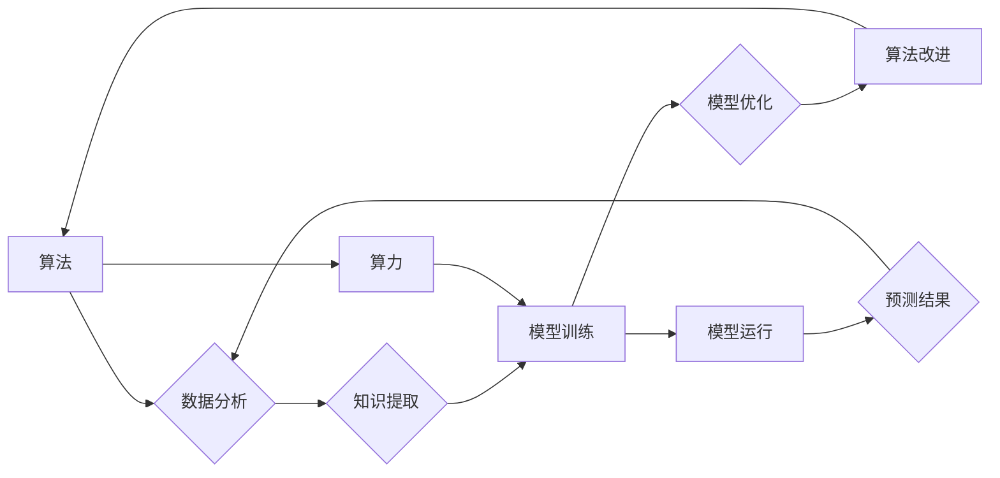

## 算法、算力与大数据：AI的三驾马车

> 关键词：人工智能、算法、算力、大数据、机器学习、深度学习、模型训练

### 1. 背景介绍

人工智能（AI）近年来发展迅速，已渗透到各个领域，从自动驾驶到医疗诊断，从个性化推荐到金融风险控制，AI技术的应用正在改变着我们的生活。然而，AI的发展并非一蹴而就，它离不开三大核心要素：算法、算力和数据。这三者相互依存，共同推动着AI技术的进步。

**1.1 算法：AI的思维引擎**

算法是AI的核心，它决定了AI模型的学习能力、推理能力和决策能力。不同的算法适用于不同的任务，例如，用于图像识别的卷积神经网络（CNN）与用于自然语言处理（NLP）的循环神经网络（RNN）有着不同的结构和工作机制。

**1.2 算力：AI的能量源泉**

算力是AI训练和运行模型所需的计算资源。随着AI模型规模的不断扩大，对算力的需求也越来越高。高性能计算集群、GPU加速和云计算等技术为AI的发展提供了强大的算力支撑。

**1.3 大数据：AI的营养来源**

数据是AI模型训练和学习的基础。海量的数据可以帮助AI模型学习更复杂的模式和规律，从而提高其准确性和泛化能力。

### 2. 核心概念与联系

算法、算力和数据相互关联，共同构成了AI的三驾马车。

**2.1 算法驱动数据分析**

算法通过对数据的分析和处理，提取出有价值的信息和知识。例如，机器学习算法可以从海量用户数据中学习用户行为模式，从而为个性化推荐提供支持。

**2.2 算力加速算法执行**

算力为算法的执行提供动力。强大的算力可以加速算法的训练和运行速度，从而缩短AI模型的开发周期。

**2.3 数据驱动算法优化**

数据是算法训练和优化的基础。通过不断训练和优化，AI算法可以不断提高其性能和准确性。

**Mermaid 流程图**



### 3. 核心算法原理 & 具体操作步骤

**3.1 算法原理概述**

机器学习算法是一种能够从数据中学习并不断改进的算法。它通过训练模型，使模型能够从数据中识别出模式和规律，从而进行预测或分类。常见的机器学习算法包括：

* **监督学习:** 利用标记数据训练模型，例如分类和回归问题。
* **无监督学习:** 利用未标记数据发现数据中的隐藏结构，例如聚类和降维。
* **强化学习:** 通过试错学习，使模型在特定环境中获得最大奖励。

**3.2 算法步骤详解**

以监督学习为例，其基本步骤如下：

1. **数据收集和预处理:** 收集相关数据并进行清洗、转换和特征工程等预处理操作。
2. **模型选择:** 根据具体任务选择合适的机器学习模型。
3. **模型训练:** 利用训练数据训练模型，调整模型参数，使模型能够准确地预测或分类。
4. **模型评估:** 利用测试数据评估模型的性能，例如准确率、召回率和F1-score等指标。
5. **模型调优:** 根据评估结果，调整模型参数或选择其他模型，进一步提高模型性能。
6. **模型部署:** 将训练好的模型部署到实际应用场景中。

**3.3 算法优缺点**

不同的机器学习算法各有优缺点，需要根据具体任务选择合适的算法。例如，决策树算法易于理解和解释，但其泛化能力较弱；支持向量机（SVM）算法具有较好的泛化能力，但其训练时间较长。

**3.4 算法应用领域**

机器学习算法广泛应用于各个领域，例如：

* **图像识别:** 人脸识别、物体检测、图像分类等。
* **自然语言处理:** 文本分类、情感分析、机器翻译等。
* **推荐系统:** 商品推荐、内容推荐、用户画像等。
* **金融风险控制:** 欺诈检测、信用评分、风险评估等。

### 4. 数学模型和公式 & 详细讲解 & 举例说明

**4.1 数学模型构建**

机器学习算法通常基于数学模型构建。例如，线性回归模型假设数据之间存在线性关系，其数学模型可以表示为：

$$y = w_0 + w_1x_1 + w_2x_2 +... + w_nx_n + \epsilon$$

其中：

* $y$ 是预测值
* $w_0, w_1, w_2,..., w_n$ 是模型参数
* $x_1, x_2,..., x_n$ 是输入特征
* $\epsilon$ 是误差项

**4.2 公式推导过程**

模型参数的学习过程通常通过最小化损失函数来实现。损失函数衡量模型预测值与真实值的差异。例如，均方误差（MSE）损失函数可以表示为：

$$L = \frac{1}{n}\sum_{i=1}^{n}(y_i - \hat{y}_i)^2$$

其中：

* $n$ 是样本数量
* $y_i$ 是真实值
* $\hat{y}_i$ 是模型预测值

通过梯度下降算法等优化算法，不断调整模型参数，使损失函数最小化。

**4.3 案例分析与讲解**

例如，在图像分类任务中，可以使用卷积神经网络（CNN）模型。CNN模型通过卷积层、池化层和全连接层等结构，学习图像特征，并进行分类。

### 5. 项目实践：代码实例和详细解释说明

**5.1 开发环境搭建**

使用Python语言和相关的机器学习库，例如TensorFlow、PyTorch等，搭建开发环境。

**5.2 源代码详细实现**

使用Python代码实现一个简单的线性回归模型，并进行训练和预测。

```python
import numpy as np
from sklearn.linear_model import LinearRegression

# 生成样本数据
X = np.array([[1], [2], [3], [4], [5]])
y = np.array([2, 4, 5, 4, 5])

# 创建线性回归模型
model = LinearRegression()

# 训练模型
model.fit(X, y)

# 预测新数据
new_data = np.array([[6]])
prediction = model.predict(new_data)

# 打印预测结果
print(prediction)
```

**5.3 代码解读与分析**

代码首先生成样本数据，然后创建线性回归模型。使用`fit()`方法训练模型，并将训练好的模型用于预测新数据。

**5.4 运行结果展示**

运行代码后，会输出预测结果，例如：

```
[5.6]
```

### 6. 实际应用场景

**6.1 医疗诊断**

AI算法可以分析患者的医疗影像数据，辅助医生进行疾病诊断。例如，深度学习算法可以用于识别肺癌、乳腺癌等疾病。

**6.2 金融风险控制**

AI算法可以分析客户的金融数据，识别潜在的欺诈行为和风险。例如，机器学习算法可以用于检测信用卡欺诈和信用评分。

**6.3 自动驾驶**

AI算法可以分析车辆周围的环境信息，帮助车辆自动驾驶。例如，深度学习算法可以用于识别道路标线、交通信号灯和行人。

**6.4 未来应用展望**

AI技术的发展将带来更多新的应用场景，例如：

* **个性化教育:** 根据学生的学习情况，提供个性化的学习方案。
* **智能制造:** 利用AI算法优化生产流程，提高生产效率。
* **精准农业:** 利用AI算法分析土壤和作物数据，提高农业生产效率。

### 7. 工具和资源推荐

**7.1 学习资源推荐**

* **在线课程:** Coursera、edX、Udacity等平台提供丰富的AI课程。
* **书籍:** 《深度学习》、《机器学习实战》等书籍是学习AI的基础教材。
* **开源项目:** TensorFlow、PyTorch等开源项目提供了丰富的学习资源和实践案例。

**7.2 开发工具推荐**

* **Python:** Python是AI开发的常用语言。
* **TensorFlow:** TensorFlow是一个开源的机器学习框架。
* **PyTorch:** PyTorch是一个开源的深度学习框架。
* **Jupyter Notebook:** Jupyter Notebook是一个交互式编程环境，方便进行AI开发和实验。

**7.3 相关论文推荐**

* **《ImageNet Classification with Deep Convolutional Neural Networks》**
* **《Attention Is All You Need》**
* **《Generative Adversarial Networks》**

### 8. 总结：未来发展趋势与挑战

**8.1 研究成果总结**

近年来，AI技术取得了长足的进步，在各个领域都取得了显著的应用成果。例如，图像识别、自然语言处理、语音识别等领域都取得了突破性进展。

**8.2 未来发展趋势**

未来，AI技术将朝着以下方向发展：

* **更强大的算力:** 随着硬件技术的进步，AI模型将变得更加强大，能够处理更复杂的任务。
* **更丰富的算法:** 新的算法将不断涌现，提高AI模型的性能和效率。
* **更广泛的应用:** AI技术将应用到更多领域，改变我们的生活方式。

**8.3 面临的挑战**

AI技术的发展也面临着一些挑战，例如：

* **数据安全和隐私:** AI模型的训练需要大量数据，如何保护数据安全和隐私是一个重要问题。
* **算法偏见:** AI算法可能存在偏见，导致不公平的结果。
* **伦理问题:** AI技术的应用可能引发一些伦理问题，例如人工智能的责任和义务。

**8.4 研究展望**

未来，我们需要继续加强对AI技术的研发和应用，同时也要关注AI技术的伦理和社会影响，确保AI技术能够造福人类。

### 9. 附录：常见问题与解答

**9.1 什么是机器学习？**

机器学习是一种人工智能技术，它通过训练模型，使模型能够从数据中学习并不断改进。

**9.2 什么是深度学习？**

深度学习是一种机器学习的子领域，它使用多层神经网络来学习数据特征。

**9.3 如何选择合适的机器学习算法？**

选择合适的机器学习算法需要根据具体任务和数据特点进行选择。

**9.4 如何评估机器学习模型的性能？**

可以使用准确率、召回率、F1-score等指标来评估机器学习模型的性能。


作者：禅与计算机程序设计艺术 / Zen and the Art of Computer Programming 
