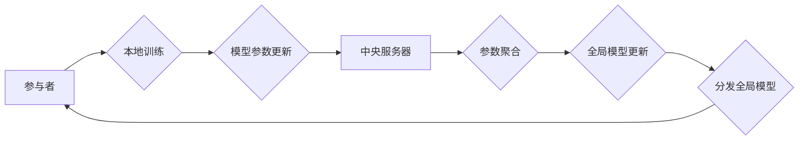

## 关键词：联邦学习、模型训练、数据隐私、分布式学习、机器学习

## 1. 背景介绍

在当今数据驱动时代，机器学习模型的训练离不开海量数据。然而，数据往往分散在不同的机构或设备上，例如手机、医院、银行等，直接将这些数据集中到一个中心进行训练会引发严重的隐私泄露和安全风险。联邦学习 (Federated Learning, FL) 应运而生，它是一种分布式机器学习方法，旨在训练全局模型而无需将原始数据传输到中央服务器。

联邦学习的核心思想是将模型参数在参与者之间进行迭代更新。每个参与者在本地对自己的数据进行训练，并仅将模型参数的更新发送到中央服务器。中央服务器将所有参与者的参数更新聚合起来，更新全局模型，然后将更新后的全局模型分发给所有参与者。如此循环往复，最终训练出一个能够在所有参与者数据上表现良好的全局模型。

## 2. 核心概念与联系

### 2.1 参与者

参与者是指拥有数据并参与模型训练的个体或机构。例如，在手机应用场景中，参与者就是使用该应用的用户；在医疗领域，参与者可能是不同的医院。

### 2.2 模型参数

模型参数是机器学习模型的核心，决定了模型的学习能力。在联邦学习中，模型参数会通过参与者之间进行迭代更新。

### 2.3 中央服务器

中央服务器是联邦学习系统中的协调中心，负责接收参与者的模型参数更新，聚合更新，更新全局模型，并将更新后的全局模型分发给参与者。

### 2.4 全局模型

全局模型是联邦学习最终训练的目标，它是在所有参与者数据上进行训练的模型，能够在所有参与者数据上表现良好。

**联邦学习架构流程图**



## 3. 核心算法原理 & 具体操作步骤

### 3.1 算法原理概述

联邦学习的核心算法是基于梯度下降的迭代更新算法。每个参与者在本地对自己的数据进行梯度下降训练，并计算出模型参数的梯度。然后，参与者将模型参数的梯度发送到中央服务器。中央服务器将所有参与者的梯度聚合起来，更新全局模型的参数。最后，中央服务器将更新后的全局模型分发给所有参与者。

### 3.2 算法步骤详解

1. **初始化:** 中央服务器将一个初始的全局模型参数分配给所有参与者。
2. **本地训练:** 每个参与者在本地对自己的数据进行训练，并计算出模型参数的梯度。
3. **参数更新:** 每个参与者将模型参数的梯度发送到中央服务器。
4. **参数聚合:** 中央服务器将所有参与者的梯度聚合起来，更新全局模型的参数。
5. **模型分发:** 中央服务器将更新后的全局模型分发给所有参与者。
6. **重复步骤2-5:** 重复上述步骤，直到模型收敛或达到预设的训练轮数。

### 3.3 算法优缺点

**优点:**

* **数据隐私保护:** 数据无需离开参与者的设备，有效保护数据隐私。
* **数据分散利用:** 可以利用分散在不同机构或设备上的数据进行训练，提高模型的泛化能力。
* **模型可定制:** 每个参与者可以根据自己的数据特点对模型进行定制化训练。

**缺点:**

* **通信成本:** 参与者需要频繁地将模型参数更新发送到中央服务器，可能会导致通信成本较高。
* **模型性能:** 由于每个参与者的数据分布可能不同，模型训练的性能可能会受到影响。
* **安全风险:** 中央服务器可能会成为攻击的目标，需要采取相应的安全措施。

### 3.4 算法应用领域

联邦学习在各个领域都有广泛的应用，例如：

* **移动设备:** 在手机上训练语音识别、图像识别等模型，保护用户隐私。
* **医疗保健:** 在多个医院之间训练疾病诊断模型，提高诊断准确率。
* **金融服务:** 在多个银行之间训练欺诈检测模型，降低金融风险。

## 4. 数学模型和公式 & 详细讲解 & 举例说明

### 4.1 数学模型构建

假设我们有一个包含 $n$ 个参与者的联邦学习系统，每个参与者 $i$ 拥有自己的数据集 $D_i$。我们的目标是训练一个全局模型 $w^*$，它能够在所有参与者的数据上表现良好。

我们可以使用以下数学模型来表示联邦学习的过程：

* **本地模型更新:** 每个参与者 $i$ 在本地对自己的数据 $D_i$ 进行训练，并更新模型参数 $w_i$：

$$w_i^{t+1} = w_i^t - \eta \nabla_w L(w_i^t, D_i)$$

其中，$\eta$ 是学习率，$L(w_i^t, D_i)$ 是参与者 $i$ 在当前模型参数 $w_i^t$ 下在数据集 $D_i$ 上的损失函数。

* **全局模型更新:** 中央服务器将所有参与者的模型参数更新 $w_i^{t+1} - w_i^t$ 聚合起来，更新全局模型参数 $w^*$:

$$w^*_{t+1} = \text{aggregate}(w_1^{t+1} - w_1^t, w_2^{t+1} - w_2^t,..., w_n^{t+1} - w_n^t)$$

其中，$\text{aggregate}$ 是参数聚合函数，常用的聚合函数包括平均聚合和加权平均聚合。

### 4.2 公式推导过程

联邦学习的目标是找到一个全局模型参数 $w^*$，它能够最小化所有参与者的数据上的损失函数。我们可以使用梯度下降算法来实现这个目标。

在每个迭代步骤中，每个参与者 $i$ 在本地对自己的数据 $D_i$ 进行梯度下降训练，并更新模型参数 $w_i$。然后，中央服务器将所有参与者的模型参数更新聚合起来，更新全局模型参数 $w^*$。

重复上述步骤，直到模型收敛或达到预设的训练轮数。

### 4.3 案例分析与讲解

假设我们有一个包含两个参与者的联邦学习系统，每个参与者拥有自己的图像数据集。我们的目标是训练一个图像分类模型。

在第一个迭代步骤中，每个参与者 $i$ 在本地对自己的数据 $D_i$ 进行训练，并计算出模型参数 $w_i$ 的梯度。然后，中央服务器将两个参与者的梯度聚合起来，更新全局模型参数 $w^*$。

在第二个迭代步骤中，每个参与者 $i$ 在本地对自己的数据 $D_i$ 进行训练，并使用更新后的全局模型参数 $w^*$ 进行训练。然后，中央服务器将两个参与者的梯度聚合起来，更新全局模型参数 $w^*$。

重复上述步骤，直到模型收敛或达到预设的训练轮数。

## 5. 项目实践：代码实例和详细解释说明

### 5.1 开发环境搭建

为了演示联邦学习的原理，我们可以使用 TensorFlow Federated (TFF) 库进行代码实现。TFF 是一个开源的联邦学习框架，提供了丰富的工具和资源，可以方便地进行联邦学习模型的开发和训练。

**依赖安装:**

```bash
pip install tensorflow tensorflow-federated
```

### 5.2 源代码详细实现

```python
import tensorflow as tf
import tensorflow_federated as tff

# 定义联邦学习模型
model = tff.learning.build_federated_averaging_process(
    model_fn=lambda: tf.keras.Sequential([
        tf.keras.layers.Dense(10, activation='relu'),
        tf.keras.layers.Dense(1)
    ]),
    client_optimizer_fn=lambda: tf.keras.optimizers.SGD(learning_rate=0.1)
)

# 定义联邦学习训练过程
def train_and_evaluate(model, train_data, eval_data):
    # 训练模型
    state = model.initialize()
    for _ in range(10):
        state, metrics = model.next(state, train_data)
    # 评估模型
    loss, accuracy = model.evaluate(state, eval_data)
    return loss, accuracy

# 模拟参与者数据
train_data = [
    tf.random.normal((100, 10)),
    tf.random.normal((100, 10))
]
eval_data = [
    tf.random.normal((100, 10)),
    tf.random.normal((100, 10))
]

# 训练联邦学习模型
loss, accuracy = train_and_evaluate(model, train_data, eval_data)
print(f"Loss: {loss}, Accuracy: {accuracy}")
```

### 5.3 代码解读与分析

这段代码演示了如何使用 TFF 库进行联邦学习模型的训练。

首先，我们定义了一个联邦学习模型，该模型使用 Keras 库构建，并使用 Federated Averaging 算法进行训练。

然后，我们定义了一个训练和评估函数，该函数接受模型、训练数据和评估数据作为输入，并返回训练后的模型损失和准确率。

最后，我们模拟了两个参与者的数据，并使用训练和评估函数训练了联邦学习模型。

### 5.4 运行结果展示

运行这段代码后，会输出训练后的模型损失和准确率。

## 6. 实际应用场景

### 6.1 手机语音识别

在手机语音识别应用中，每个用户的手机数据都是独立的，无法直接共享。使用联邦学习可以训练一个全局语音识别模型，而无需将用户的语音数据传输到中央服务器。

### 6.2 医疗诊断

在医疗诊断领域，每个医院拥有自己的患者数据，这些数据是敏感的医疗信息。使用联邦学习可以训练一个全局疾病诊断模型，而无需将患者数据共享到中央服务器。

### 6.3 金融欺诈检测

在金融领域，每个银行拥有自己的交易数据，这些数据是重要的商业机密。使用联邦学习可以训练一个全局欺诈检测模型，而无需将交易数据共享到中央服务器。

### 6.4 未来应用展望

联邦学习在未来将有更广泛的应用场景，例如：

* **个性化推荐:** 训练个性化推荐模型，而无需共享用户的隐私数据。
* **自动驾驶:** 训练自动驾驶模型，利用来自不同车辆的数据进行训练。
* **工业控制:** 训练工业控制模型，提高生产效率和安全性。

## 7. 工具和资源推荐

### 7.1 学习资源推荐

* **TensorFlow Federated (TFF):** https://www.tensorflow.org/federated
* **PySyft:** https://www.openmined.org/
* **Papers with Code:** https://paperswithcode.com/task/federated-learning

### 7.2 开发工具推荐

* **TensorFlow:** https://www.tensorflow.org/
* **PyTorch:** https://pytorch.org/
* **JAX:** https://jax.readthedocs.io/

### 7.3 相关论文推荐

* **Federated Learning: Strategies for Improving Communication Efficiency**
* **Communication-Efficient Learning of Deep Networks from Decentralized Data**
* **On the Robustness of Federated Learning**

## 8. 总结：未来发展趋势与挑战

### 8.1 研究成果总结

联邦学习近年来取得了显著的进展，已经成为机器学习领域的研究热点。

### 8.2 未来发展趋势

* **提高通信效率:** 减少模型参数更新的通信量，降低通信成本。
* **增强模型鲁棒性