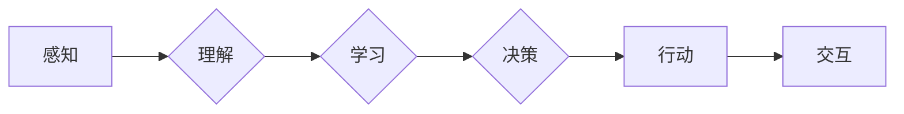

# AI Agent: AI的下一个风口 感知和解析环境与自主决策

作者：禅与计算机程序设计艺术 / Zen and the Art of Computer Programming

## 1. 背景介绍
### 1.1 问题的由来

随着人工智能技术的飞速发展，从早期的专家系统到深度学习时代的到来，AI技术已经渗透到各个领域，为我们带来了前所未有的便利。然而，我们是否思考过，AI的终极目标是什么？是简单地完成特定任务，还是像人类一样，成为一个能够感知环境、理解信息、自主决策的智能体？

AI Agent应运而生，它代表了人工智能领域的新风口。AI Agent是一种能够感知环境、理解信息、自主决策并采取行动的智能体，是构建智能系统的基础。本文将深入探讨AI Agent的原理、技术、应用和未来发展趋势。

### 1.2 研究现状

AI Agent的研究已经取得了长足的进步，主要体现在以下几个方面：

1. **感知技术**：计算机视觉、语音识别、传感器等技术不断发展，使得AI Agent能够感知环境中的各种信息。
2. **知识表示与推理**：自然语言处理、知识图谱等技术使得AI Agent能够理解和处理复杂的信息。
3. **学习与决策**：深度学习、强化学习等技术使得AI Agent能够自主学习和决策。

### 1.3 研究意义

AI Agent的研究具有重要意义：

1. **推动人工智能技术发展**：AI Agent的研究将推动感知、知识表示、学习与决策等领域的持续创新。
2. **构建智能系统**：AI Agent是构建智能系统的基础，将为各行各业带来新的变革。
3. **提升人类生活质量**：AI Agent将帮助我们解决各种复杂问题，提升人类生活质量。

### 1.4 本文结构

本文将按照以下结构进行：

- 第2部分：介绍AI Agent的核心概念与联系。
- 第3部分：探讨AI Agent的核心算法原理与具体操作步骤。
- 第4部分：分析AI Agent的数学模型和公式，并结合实例进行讲解。
- 第5部分：展示AI Agent的代码实例和详细解释说明。
- 第6部分：探讨AI Agent的实际应用场景和未来应用展望。
- 第7部分：推荐AI Agent相关的学习资源、开发工具和参考文献。
- 第8部分：总结AI Agent的未来发展趋势与挑战。
- 第9部分：附录，提供常见问题与解答。

## 2. 核心概念与联系

### 2.1 感知与理解

AI Agent需要具备感知和解析环境的能力。感知技术包括计算机视觉、语音识别、传感器等，用于获取环境中的信息。理解技术包括自然语言处理、知识图谱等，用于解析和抽象环境中的信息。

### 2.2 学习与决策

AI Agent需要具备学习和决策的能力。学习技术包括深度学习、强化学习等，用于从数据中学习知识。决策技术包括决策树、规划等，用于根据学习到的知识进行决策。

### 2.3 行动与交互

AI Agent需要具备行动和交互的能力。行动技术包括机器人技术、自动化技术等，用于执行任务。交互技术包括人机交互、机器人交互等，用于与其他实体进行交互。

以下是一个简化的AI Agent架构图：



## 3. 核心算法原理 & 具体操作步骤

### 3.1 算法原理概述

AI Agent的算法原理主要涉及以下几个方面：

1. **感知**：通过计算机视觉、语音识别、传感器等获取环境信息。
2. **理解**：通过自然语言处理、知识图谱等技术解析和抽象环境信息。
3. **学习**：通过深度学习、强化学习等技术从数据中学习知识。
4. **决策**：根据学习到的知识进行决策。
5. **行动**：根据决策执行行动。
6. **交互**：与其他实体进行交互。

### 3.2 算法步骤详解

1. **感知**：AI Agent通过计算机视觉、语音识别、传感器等获取环境信息。
2. **理解**：将感知到的信息输入到自然语言处理、知识图谱等模块，解析和抽象环境信息。
3. **学习**：将理解到的信息输入到深度学习、强化学习等模块，从数据中学习知识。
4. **决策**：根据学习到的知识进行决策，确定下一步行动。
5. **行动**：根据决策执行行动。
6. **交互**：与其他实体进行交互，收集反馈信息。

### 3.3 算法优缺点

AI Agent算法的优点：

1. **灵活性**：AI Agent可以根据环境变化动态调整策略。
2. **适应性**：AI Agent可以适应不同的环境条件。
3. **可扩展性**：AI Agent可以根据需求添加新的模块和功能。

AI Agent算法的缺点：

1. **计算复杂度**：AI Agent的算法通常较为复杂，需要大量的计算资源。
2. **数据需求**：AI Agent需要大量的数据来学习和训练。

### 3.4 算法应用领域

AI Agent算法可以应用于以下领域：

1. **智能机器人**：如扫地机器人、无人机等。
2. **自动驾驶**：如自动驾驶汽车、无人驾驶卡车等。
3. **智能客服**：如智能客服机器人、智能语音助手等。
4. **智能家居**：如智能门锁、智能灯光等。

## 4. 数学模型和公式 & 详细讲解 & 举例说明

### 4.1 数学模型构建

AI Agent的数学模型主要包括以下几个部分：

1. **感知模型**：用于描述感知信息的数学模型。
2. **理解模型**：用于描述理解信息的数学模型。
3. **学习模型**：用于描述学习的数学模型。
4. **决策模型**：用于描述决策的数学模型。

### 4.2 公式推导过程

以下以感知模型为例，介绍公式推导过程：

假设AI Agent通过摄像头获取环境图像，感知模型可以表示为：

$$
f(x) = \text{感知信息}
$$

其中，$x$ 为输入图像。

### 4.3 案例分析与讲解

以自动驾驶为例，介绍AI Agent的数学模型：

1. **感知模型**：将摄像头捕获的图像输入到计算机视觉模型，提取车道线、交通标志、车辆等感知信息。
2. **理解模型**：将感知信息输入到自然语言处理模型，将环境信息转化为语义表示。
3. **学习模型**：将语义表示输入到强化学习模型，学习驾驶策略。
4. **决策模型**：根据学习到的驾驶策略，生成驾驶指令。
5. **行动模型**：根据驾驶指令，控制车辆行驶。

### 4.4 常见问题解答

**Q1：AI Agent的感知能力如何提升？**

A：提升AI Agent的感知能力主要从以下几个方面入手：

1. **提高传感器质量**：使用更高分辨率的摄像头、更高灵敏度的传感器等。
2. **改进感知算法**：使用更先进的计算机视觉、语音识别等技术。
3. **融合多源信息**：将摄像头、雷达、激光雷达等多源信息进行融合，提高感知的准确性和完整性。

**Q2：AI Agent的决策能力如何提升？**

A：提升AI Agent的决策能力主要从以下几个方面入手：

1. **增加训练数据**：收集更多样本，增加训练数据量。
2. **改进学习算法**：使用更先进的深度学习、强化学习等技术。
3. **引入先验知识**：将领域知识、专家知识等引入到决策过程中。

## 5. 项目实践：代码实例和详细解释说明

### 5.1 开发环境搭建

1. 安装Python 3.7及以上版本。
2. 安装TensorFlow 2.0及以上版本。
3. 安装其他必要的库，如NumPy、Pandas等。

### 5.2 源代码详细实现

以下是一个简单的AI Agent代码示例，使用TensorFlow实现：

```python
import tensorflow as tf
from tensorflow.keras.models import Sequential
from tensorflow.keras.layers import Dense, Flatten

class感知层(tf.keras.layers.Layer):
    def __init__(self):
        super(感知层, self).__init__()
        self.flatten = Flatten()

    def call(self, inputs):
        return self.flatten(inputs)

class理解层(tf.keras.layers.Layer):
    def __init__(self):
        super(理解层, self).__init__()
        self.fc1 = Dense(128, activation='relu')
        self.fc2 = Dense(64, activation='relu')

    def call(self, inputs):
        x = self.fc1(inputs)
        return self.fc2(x)

class决策层(tf.keras.layers.Layer):
    def __init__(self):
        super(决策层, self).__init__()
        self.fc = Dense(2, activation='softmax')

    def call(self, inputs):
        return self.fc(inputs)

class AIAgent(tf.keras.Model):
    def __init__(self):
        super(AIAgent, self).__init__()
        self.感知层 = 感知层()
        self.理解层 = 理解层()
        self.决策层 = 决策层()

    def call(self, inputs):
        x = self.感知层(inputs)
        x = self.理解层(x)
        return self.决策层(x)

agent = AIAgent()
```

### 5.3 代码解读与分析

以上代码定义了一个简单的AI Agent，包括感知层、理解层和决策层。

- 感知层：将输入图像进行展平，提取特征。
- 理解层：将感知层提取的特征进行进一步抽象。
- 决策层：根据抽象后的特征进行分类。

### 5.4 运行结果展示

运行以上代码，将得到一个简单的AI Agent模型。

## 6. 实际应用场景
### 6.1 智能机器人

AI Agent可以应用于智能机器人领域，如扫地机器人、无人机等。通过感知环境信息，AI Agent可以自主规划路径、避障、执行任务。

### 6.2 自动驾驶

AI Agent可以应用于自动驾驶领域，如自动驾驶汽车、无人驾驶卡车等。通过感知路况信息，AI Agent可以自主规划行驶路线、避让行人、超车等。

### 6.3 智能客服

AI Agent可以应用于智能客服领域，如智能客服机器人、智能语音助手等。通过理解用户需求，AI Agent可以自主回答问题、提供帮助。

### 6.4 未来应用展望

随着AI Agent技术的不断发展，其应用领域将更加广泛，如：

- 智能家居：如智能门锁、智能灯光等。
- 智能医疗：如智能诊断、智能手术等。
- 智能交通：如智能交通信号灯、智能停车场等。

## 7. 工具和资源推荐
### 7.1 学习资源推荐

1. 《深度学习》书籍：介绍深度学习基础知识，为AI Agent学习打下基础。
2. 《Python编程：从入门到实践》书籍：介绍Python编程语言，为AI Agent开发提供工具。
3. TensorFlow官方文档：介绍TensorFlow框架，为AI Agent开发提供技术支持。

### 7.2 开发工具推荐

1. TensorFlow：开源深度学习框架，支持AI Agent开发。
2. PyTorch：开源深度学习框架，支持AI Agent开发。
3. OpenCV：开源计算机视觉库，用于AI Agent感知环境。

### 7.3 相关论文推荐

1. **《Deep Learning for Autonomous Navigation in Unknown Environments**》：介绍深度学习在自动驾驶导航中的应用。
2. **《DeepMind's AlphaGo and the future of AI**》：介绍AlphaGo算法及其对人工智能的影响。
3. **《Learning to Discriminate between Scenes from a Single Image with Deep Learning**》：介绍深度学习在场景识别中的应用。

### 7.4 其他资源推荐

1. Coursera、edX等在线课程：提供人工智能、机器学习等课程，为AI Agent学习提供知识储备。
2. Kaggle竞赛：提供机器学习竞赛数据，为AI Agent实践提供平台。
3. GitHub：开源代码平台，提供AI Agent相关代码和项目。

## 8. 总结：未来发展趋势与挑战
### 8.1 研究成果总结

本文深入探讨了AI Agent的原理、技术、应用和未来发展趋势。从感知、理解、学习、决策、行动到交互，AI Agent涵盖了人工智能领域的多个重要研究方向。随着技术的不断进步，AI Agent将在各个领域发挥越来越重要的作用。

### 8.2 未来发展趋势

1. **跨学科融合**：AI Agent将与其他领域技术（如机器人、物联网、大数据等）深度融合，形成新的应用场景。
2. **人机协同**：AI Agent将与人类协同工作，共同完成任务。
3. **可解释性**：AI Agent的决策过程将更加透明，提高用户信任度。

### 8.3 面临的挑战

1. **数据安全与隐私**：AI Agent在处理数据时，需要保护用户隐私和数据安全。
2. **伦理道德**：AI Agent的决策过程需要符合伦理道德规范。
3. **计算资源**：AI Agent需要大量的计算资源，如何降低计算成本是一个挑战。

### 8.4 研究展望

未来，AI Agent的研究将聚焦于以下几个方面：

1. **安全可控**：研究AI Agent的安全性和可解释性，提高用户信任度。
2. **泛化能力**：提高AI Agent的泛化能力，使其能够适应不同的环境和任务。
3. **人机协同**：研究AI Agent与人类协同工作的机制，提高工作效率。

相信在未来的发展中，AI Agent将取得更加显著的成果，为人类社会带来更多福祉。

## 9. 附录：常见问题与解答

**Q1：什么是AI Agent？**

A：AI Agent是一种能够感知环境、理解信息、自主决策并采取行动的智能体，是构建智能系统的基础。

**Q2：AI Agent有哪些应用场景？**

A：AI Agent可以应用于智能机器人、自动驾驶、智能客服、智能家居等领域。

**Q3：如何提升AI Agent的感知能力？**

A：提升AI Agent的感知能力主要从以下几个方面入手：

1. 提高传感器质量
2. 改进感知算法
3. 融合多源信息

**Q4：如何提升AI Agent的决策能力？**

A：提升AI Agent的决策能力主要从以下几个方面入手：

1. 增加训练数据
2. 改进学习算法
3. 引入先验知识

**Q5：AI Agent的发展趋势是什么？**

A：AI Agent的发展趋势包括跨学科融合、人机协同、可解释性等。

通过以上解答，相信你对AI Agent有了更深入的了解。在未来的发展中，AI Agent将继续推动人工智能技术向前发展，为人类社会创造更多价值。