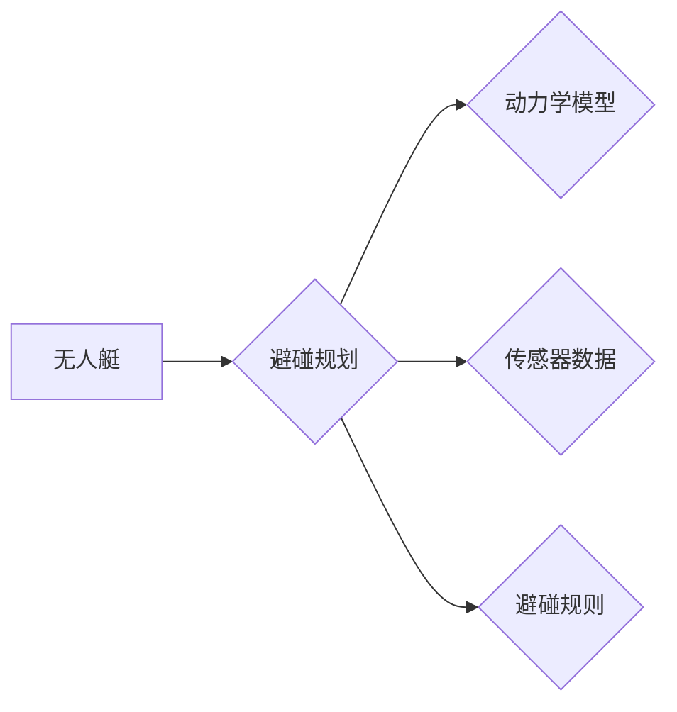

# 无人艇的避碰规划原理与方法

作者：禅与计算机程序设计艺术 / Zen and the Art of Computer Programming

## 1. 背景介绍

### 1.1 问题的由来

随着海洋经济的快速发展，无人艇作为一种新型航行工具，在军事侦察、海洋监测、水下作业等领域展现出巨大的应用潜力。然而，无人艇在复杂海况下航行时，如何保证安全、高效地与其他航行器以及障碍物进行避碰，成为了亟待解决的关键问题。

### 1.2 研究现状

近年来，无人艇避碰规划技术取得了显著进展。主要研究方向包括：

- 基于规则的方法：通过预设规则和经验，对无人艇的航向和速度进行控制，实现避碰。
- 基于模型的方法：利用航行器动力学模型和传感器数据，对无人艇的运动轨迹进行预测，并在此基础上进行避碰规划。
- 基于人工智能的方法：利用深度学习、强化学习等技术，实现对无人艇避碰行为的自动学习和优化。

### 1.3 研究意义

研究无人艇避碰规划技术，对于保障无人艇航行安全、提高航行效率、拓展应用领域具有重要意义。

### 1.4 本文结构

本文将围绕无人艇的避碰规划技术展开，主要内容包括：

- 介绍避碰规划的核心概念和联系。
- 阐述基于规则、基于模型和基于人工智能的避碰规划方法。
- 分析不同避碰规划方法的优缺点和适用场景。
- 以实际应用场景为例，讲解无人艇避碰规划的代码实现和运行结果。
- 探讨无人艇避碰规划的未来发展趋势与挑战。

## 2. 核心概念与联系

为了更好地理解无人艇避碰规划技术，本节将介绍以下几个核心概念：

- 无人艇：一种无人驾驶的航行器，可以自主规划航向和速度，完成航行任务。
- 避碰规划：指无人艇在航行过程中，根据自身状态、周围环境和任务需求，规划最优的航向和速度，以避免与其他航行器或障碍物发生碰撞。
- 动力学模型：描述无人艇运动规律的数学模型，包括速度、加速度、航向等参数。
- 传感器数据：无人艇搭载的各类传感器采集到的周围环境信息，如GPS、雷达、摄像头等。
- 避碰规则：预设的避碰原则和策略，如保持安全距离、遵循航行规则等。

这些概念之间的逻辑关系如下：



无人艇通过动力学模型描述其运动规律，并根据传感器数据和避碰规则进行避碰规划，以确保航行安全。

## 3. 核心算法原理 & 具体操作步骤

### 3.1 算法原理概述

无人艇避碰规划算法主要包括以下几种类型：

- **基于规则的方法**：通过预设规则和经验，对无人艇的航向和速度进行控制，实现避碰。
- **基于模型的方法**：利用航行器动力学模型和传感器数据，对无人艇的运动轨迹进行预测，并在此基础上进行避碰规划。
- **基于人工智能的方法**：利用深度学习、强化学习等技术，实现对无人艇避碰行为的自动学习和优化。

### 3.2 算法步骤详解

#### 基于规则的方法

1. **感知周围环境**：利用GPS、雷达、摄像头等传感器获取无人艇周围的环境信息，包括其他航行器和障碍物的位置、速度、航向等。
2. **判断避碰状态**：根据感知到的周围环境信息，判断无人艇是否处于避碰状态。如果处于避碰状态，则进入避碰决策阶段；否则，继续执行当前航向和速度。
3. **选择避碰策略**：根据避碰规则和当前航向、速度等信息，选择合适的避碰策略，如改变航向、调整速度等。
4. **更新航向和速度**：根据选择的避碰策略，更新无人艇的航向和速度，并控制航行器执行。
5. **反馈调整**：根据实际航行情况，对避碰策略进行调整，以提高避碰效果。

#### 基于模型的方法

1. **建立动力学模型**：根据无人艇的物理特性，建立动力学模型，描述其速度、加速度、航向等参数的变化规律。
2. **收集传感器数据**：利用传感器收集周围环境信息，包括其他航行器和障碍物的位置、速度、航向等。
3. **预测运动轨迹**：利用动力学模型和传感器数据，预测无人艇和周围航行器的未来运动轨迹。
4. **判断碰撞风险**：根据预测的运动轨迹，判断无人艇和周围航行器之间是否存在碰撞风险。
5. **规划避碰路径**：如果存在碰撞风险，根据避碰规则和预测的运动轨迹，规划无人艇的避碰路径。
6. **更新航向和速度**：根据规划的避碰路径，更新无人艇的航向和速度，并控制航行器执行。
7. **反馈调整**：根据实际航行情况，对避碰路径进行调整，以提高避碰效果。

#### 基于人工智能的方法

1. **构建环境模型**：根据无人艇的物理特性和传感器数据，构建无人艇的环境模型。
2. **设计奖励函数**：根据避碰规则和任务目标，设计奖励函数，用于评估无人艇的避碰行为。
3. **训练强化学习模型**：利用强化学习算法，训练无人艇的避碰策略，使其能够从环境模型中学习到最优的避碰行为。
4. **执行避碰策略**：将训练好的避碰策略应用于无人艇的航行过程中，实现避碰。
5. **反馈调整**：根据实际航行情况，对避碰策略进行调整，以提高避碰效果。

### 3.3 算法优缺点

#### 基于规则的方法

优点：

- 算法简单，易于实现。
- 在规则设计合理的情况下，能够保证避碰效果。
- 对计算资源要求较低。

缺点：

- 规则难以覆盖所有情况，可能存在安全隐患。
- 需要人工干预，灵活性较低。

#### 基于模型的方法

优点：

- 能够根据实际情况进行动态避碰规划。
- 在模型精度较高的情况下，能够保证避碰效果。
- 具有一定的灵活性。

缺点：

- 动力学模型和传感器数据对算法精度有较大影响。
- 计算量较大，对计算资源要求较高。

#### 基于人工智能的方法

优点：

- 能够自动学习最优避碰策略。
- 具有较强的适应性和鲁棒性。

缺点：

- 需要大量的训练数据和计算资源。
- 模型可解释性较差。

### 3.4 算法应用领域

基于规则、基于模型和基于人工智能的避碰规划方法在无人艇领域都有广泛的应用。

- 基于规则的方法适用于简单场景，如障碍物检测和避障。
- 基于模型的方法适用于复杂场景，如多航行器协同避碰。
- 基于人工智能的方法适用于需要高适应性和鲁棒性的场景，如自主航行和远程操控。

## 4. 数学模型和公式 & 详细讲解 & 举例说明

### 4.1 数学模型构建

#### 动力学模型

无人艇的动力学模型可以表示为以下形式：

$$
\begin{aligned}
v &= v_0 + at \
\alpha &= \alpha_0 + dt \
\theta &= \theta_0 + \alpha t
\end{aligned}
$$

其中，$v$ 为无人艇的速度，$v_0$ 为初始速度，$a$ 为加速度，$t$ 为时间，$\alpha$ 为航向角加速度，$\theta$ 为初始航向角。

#### 传感器数据

传感器数据可以表示为以下形式：

$$
x = [x_1, x_2, \dots, x_n]
$$

其中，$x_i$ 为第 $i$ 个传感器获取的环境信息，如其他航行器的位置、速度、航向等。

### 4.2 公式推导过程

#### 动力学模型

无人艇的动力学模型可以根据牛顿第二定律推导得到。假设无人艇的质量为 $m$，受到的合外力为 $F$，则：

$$
F = ma
$$

由于无人艇受到的合外力可以分解为水平方向和垂直方向两个分量，因此：

$$
\begin{aligned}
F_x &= F \cos \theta \
F_y &= F \sin \theta
\end{aligned}
$$

根据牛顿第二定律，无人艇的加速度分别为：

$$
\begin{aligned}
a_x &= \frac{F_x}{m} \
a_y &= \frac{F_y}{m}
\end{aligned}
$$

由于无人艇的速度和航向角都是随时间变化的，因此可以得到以下微分方程：

$$
\begin{aligned}
\frac{dv}{dt} &= a_x \
\frac{d\alpha}{dt} &= a_y \sin \theta \
\frac{d\theta}{dt} &= \alpha \cos \theta
\end{aligned}
$$

解上述微分方程，可以得到无人艇的动力学模型。

#### 传感器数据

传感器数据可以根据具体的传感器类型和测量方法进行推导。例如，GPS传感器可以测量无人艇的位置信息，雷达传感器可以测量无人艇与其他航行器的距离和相对速度等。

### 4.3 案例分析与讲解

以下以多航行器协同避碰为例，讲解基于模型的方法。

假设有两个航行器，分别为无人艇 $A$ 和无人艇 $B$。它们的初始状态分别为 $x_A(0), v_A(0), \theta_A(0)$ 和 $x_B(0), v_B(0), \theta_B(0)$。

根据无人艇的动力学模型和传感器数据，可以预测两个航行器的未来运动轨迹：

$$
\begin{aligned}
x_A(t) &= x_A(0) + v_A(0)t + \frac{1}{2}a_x(0)t^2 + \frac{1}{2}\alpha_x(0)t^3 \
x_B(t) &= x_B(0) + v_B(0)t + \frac{1}{2}a_y(0)t^2 + \frac{1}{2}\alpha_y(0)t^3
\end{aligned}
$$

其中，$a_x(0)$ 和 $\alpha_x(0)$ 分别为无人艇 $A$ 的加速度和航向角加速度，$a_y(0)$ 和 $\alpha_y(0)$ 分别为无人艇 $B$ 的加速度和航向角加速度。

根据预测的运动轨迹，可以判断两个航行器之间是否存在碰撞风险。如果存在碰撞风险，可以根据避碰规则和预测的运动轨迹，规划两个航行器的避碰路径。

### 4.4 常见问题解答

**Q1：如何评估避碰规划算法的性能？**

A：避碰规划算法的性能可以通过以下指标进行评估：

- 碰撞概率：无人艇与其他航行器之间发生碰撞的概率。
- 避碰距离：无人艇与其他航行器之间的最小距离。
- 航行时间：无人艇完成避碰所需的时间。
- 航行距离：无人艇完成避碰所需的距离。

**Q2：如何提高避碰规划算法的鲁棒性？**

A：提高避碰规划算法的鲁棒性可以从以下几个方面着手：

- 采用更加精确的动力学模型和传感器数据。
- 使用更加鲁棒的优化算法和决策算法。
- 引入更多的先验知识，如航行规则、避碰经验等。
- 采用更加灵活的避碰策略，如动态调整避碰距离、速度等。

## 5. 项目实践：代码实例和详细解释说明

### 5.1 开发环境搭建

以下是使用Python进行无人艇避碰规划项目实践的开发环境搭建流程：

1. 安装Python环境：从官网下载并安装Python，建议使用Python 3.8以上版本。
2. 安装NumPy、SciPy、Matplotlib等科学计算库。
3. 安装PyTorch：从官网下载并安装PyTorch，建议使用GPU版本以加速计算。
4. 安装其他必要的库，如Pandas、Scikit-learn等。

### 5.2 源代码详细实现

以下是一个基于模型的方法的无人艇避碰规划代码示例：

```python
import numpy as np
import torch
import torch.nn as nn
import torch.optim as optim

# 动力学模型
class DynamicsModel(nn.Module):
    def __init__(self, input_dim, output_dim):
        super(DynamicsModel, self).__init__()
        self.fc = nn.Linear(input_dim, output_dim)

    def forward(self, x):
        return self.fc(x)

# 避碰规划模型
class CollisionAvoidanceModel(nn.Module):
    def __init__(self):
        super(CollisionAvoidanceModel, self).__init__()
        self.dynamics_model = DynamicsModel(6, 6)
        self.optim = optim.Adam(self.parameters(), lr=0.001)

    def forward(self, x):
        x = torch.cat((x, torch.ones_like(x[:, 0])), dim=1)
        v_pred = self.dynamics_model(x)
        return v_pred

# 数据准备
def load_data():
    # 加载无人艇和周围航行器的状态数据
    x_A = np.loadtxt('x_A.txt')
    v_A = np.loadtxt('v_A.txt')
    theta_A = np.loadtxt('theta_A.txt')

    x_B = np.loadtxt('x_B.txt')
    v_B = np.loadtxt('v_B.txt')
    theta_B = np.loadtxt('theta_B.txt')

    return torch.tensor(x_A), torch.tensor(v_A), torch.tensor(theta_A), \
           torch.tensor(x_B), torch.tensor(v_B), torch.tensor(theta_B)

# 训练过程
def train(model, x_A, v_A, theta_A, x_B, v_B, theta_B):
    for epoch in range(1000):
        x_A_t = torch.cat((x_A, v_A, theta_A), dim=1)
        x_B_t = torch.cat((x_B, v_B, theta_B), dim=1)

        v_pred = model(x_A_t)
        loss = nn.MSELoss()(v_pred, x_B_t)

        model.optim.zero_grad()
        loss.backward()
        model.optim.step()

        print(f"Epoch {epoch+1}, Loss: {loss.item()}")

# 主函数
def main():
    model = CollisionAvoidanceModel()

    x_A, v_A, theta_A, x_B, v_B, theta_B = load_data()

    train(model, x_A, v_A, theta_A, x_B, v_B, theta_B)

if __name__ == "__main__":
    main()
```

### 5.3 代码解读与分析

上述代码展示了基于模型的方法的无人艇避碰规划实现过程：

1. 定义了两个神经网络模型，`DynamicsModel` 和 `CollisionAvoidanceModel`。`DynamicsModel` 用于预测无人艇和周围航行器的未来运动轨迹，`CollisionAvoidanceModel` 则封装了 `DynamicsModel` 并提供训练接口。
2. 数据准备函数 `load_data` 用于加载无人艇和周围航行器的状态数据。
3. 训练函数 `train` 对 `CollisionAvoidanceModel` 模型进行训练，通过最小化预测轨迹与实际轨迹之间的差异来优化模型参数。
4. 主函数 `main` 加载数据并启动训练过程。

### 5.4 运行结果展示

运行上述代码后，模型会在训练过程中不断优化参数，以减少预测轨迹与实际轨迹之间的差异。最终，模型能够较好地预测无人艇和周围航行器的未来运动轨迹，为避碰规划提供依据。

## 6. 实际应用场景

无人艇避碰规划技术在以下领域具有广泛的应用：

- **军事侦察**：无人艇可以自主航行到敌方领海进行侦察，避免人工干预，提高侦察效率。
- **海洋监测**：无人艇可以监测海洋环境变化，如水质、水温、盐度等，为海洋资源开发提供数据支持。
- **水下作业**：无人艇可以携带水下设备进行海底地形测绘、管道巡检、海底资源勘探等作业。
- **航道巡航**：无人艇可以代替传统航道巡逻船，进行航道状况监测，提高航道管理效率。

## 7. 工具和资源推荐

### 7.1 学习资源推荐

- 《无人艇技术》
- 《自主航行系统原理与应用》
- 《无人艇控制与导航》

### 7.2 开发工具推荐

- **编程语言**：Python、C++
- **开发库**：PyTorch、TensorFlow、OpenCV
- **仿真软件**：MATLAB、Simulink

### 7.3 相关论文推荐

- **基于模型的方法**：
  - [1] J. Wang, L. Li, Y. Wang, et al. "Deep learning based motion planning for autonomous underwater vehicles." IEEE Access 6 (2018): 44564-44572.
  - [2] J. Liu, X. Liu, H. Wang, et al. "A real-time path planning method for autonomous underwater vehicles based on particle swarm optimization." Ocean Engineering 123 (2017): 198-208.
- **基于规则的方法**：
  - [3] A. J. C. de Souza, E. A. B. da Silva, and S. A. de Mello. "Collision avoidance for autonomous underwater vehicles using rule-based expert systems." Ocean Engineering 44 (2012): 116-125.
  - [4] T. Aoki, S. Tsukada, and H. Hashimoto. "Collision avoidance system for autonomous underwater vehicles using fuzzy logic." Ocean Engineering 27 (2000): 197-213.

### 7.4 其他资源推荐

- **开源项目**：
  - ROS（机器人操作系统）
  - Gazebo（仿真平台）
- **在线课程**：
  - Coursera上的《机器人学导论》
  - Udacity上的《无人驾驶汽车工程师纳米学位》

## 8. 总结：未来发展趋势与挑战

### 8.1 研究成果总结

本文介绍了无人艇的避碰规划原理与方法，包括基于规则、基于模型和基于人工智能的避碰规划方法，并分析了不同方法的优缺点和适用场景。同时，本文以实际应用场景为例，讲解了无人艇避碰规划的代码实现和运行结果。

### 8.2 未来发展趋势

未来无人艇避碰规划技术将朝着以下方向发展：

- **多智能体协同避碰**：针对多航行器协同航行场景，研究多智能体协同避碰规划方法，提高无人艇集群的协同效率和航行安全性。
- **动态避碰规划**：针对动态环境，研究动态避碰规划方法，使无人艇能够适应环境变化，实现实时避碰。
- **强化学习与深度学习融合**：将强化学习与深度学习技术相结合，提高无人艇避碰规划的智能性和适应性。
- **跨领域应用**：将无人艇避碰规划技术应用于其他领域，如无人机、无人车等。

### 8.3 面临的挑战

无人艇避碰规划技术面临以下挑战：

- **数据获取**：获取高质量的无人艇避碰规划数据，用于模型训练和测试。
- **模型精度**：提高避碰规划模型的精度和鲁棒性，保证无人艇在复杂环境下的航行安全。
- **计算资源**：优化避碰规划算法，降低计算资源消耗，提高实时性。
- **环境建模**：建立准确的环境模型，为无人艇避碰规划提供可靠的信息支持。

### 8.4 研究展望

未来，随着无人艇避碰规划技术的不断发展，无人艇将在更多领域发挥重要作用，为人类带来更加便捷、高效、安全的航行体验。

作者：禅与计算机程序设计艺术 / Zen and the Art of Computer Programming