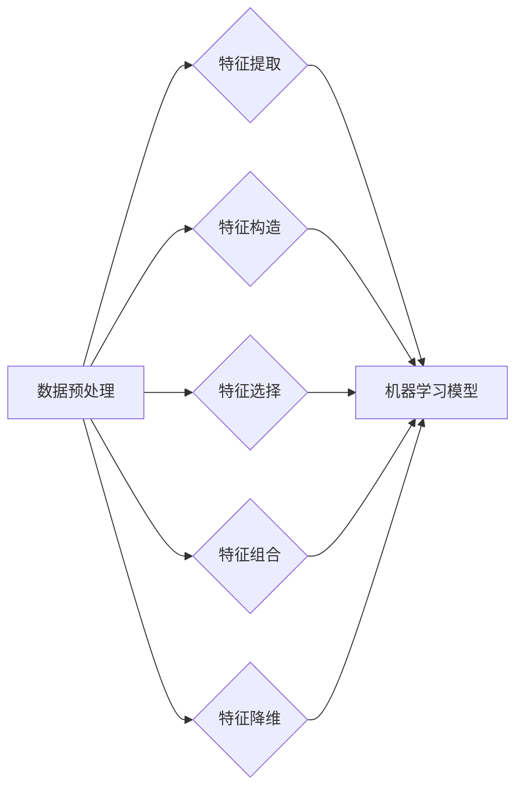

# 特征工程原理与代码实例讲解

作者：禅与计算机程序设计艺术 / Zen and the Art of Computer Programming

## 1. 背景介绍
### 1.1 问题的由来

在机器学习领域，特征工程（Feature Engineering）一直是提高模型性能的关键因素。特征工程指的是从原始数据中提取或构造出对模型学习有帮助的特征，从而提升模型预测准确率和泛化能力。然而，特征工程并非简单的数据预处理，它需要深入理解业务逻辑、数据特性以及模型算法，是一种技术含量极高的工作。

随着机器学习技术的发展，特征工程的重要性日益凸显。然而，特征工程也面临着一些挑战，如数据复杂性增加、特征数量庞大、特征选择困难、特征构造效率低等。因此，研究高效、可解释的特征工程方法，对于推动机器学习应用具有重要的意义。

### 1.2 研究现状

近年来，特征工程领域的研究取得了丰硕的成果。以下是一些重要的研究方向：

1. **特征提取**：从原始数据中提取具有区分度的特征，如文本特征提取、图像特征提取等。
2. **特征构造**：通过对原始数据进行变换、组合等操作，构造新的特征，如主成分分析（PCA）、特征嵌入等。
3. **特征选择**：从大量特征中选择对模型学习最有帮助的特征，如单变量选择、基于模型的特征选择等。
4. **特征组合**：将多个特征组合成新的特征，以提高模型性能，如交互特征、特征融合等。
5. **特征降维**：降低特征维度，减少计算复杂度，如主成分分析（PCA）、随机投影等。

### 1.3 研究意义

特征工程对于机器学习应用具有重要意义：

1. **提高模型性能**：通过特征工程，可以提取出对模型学习有帮助的特征，从而提高模型预测准确率和泛化能力。
2. **降低模型复杂度**：通过特征降维，可以降低模型复杂度，提高模型计算效率。
3. **增强模型可解释性**：通过特征工程，可以揭示数据背后的信息，增强模型的可解释性。
4. **促进机器学习应用**：特征工程是机器学习应用成功的关键因素，它推动了机器学习在各个领域的应用和发展。

### 1.4 本文结构

本文将系统地介绍特征工程的原理、方法和代码实例，内容安排如下：

- 第2部分，介绍特征工程的核心概念和联系。
- 第3部分，讲解特征工程的基本原理和具体操作步骤。
- 第4部分，介绍特征工程中常用的数学模型和公式，并结合实例进行讲解。
- 第5部分，给出特征工程的代码实现示例，并对关键代码进行解读。
- 第6部分，探讨特征工程在实际应用场景中的应用案例。
- 第7部分，推荐特征工程相关的学习资源、开发工具和参考文献。
- 第8部分，总结全文，展望特征工程的未来发展趋势与挑战。
- 第9部分，附录：常见问题与解答。

## 2. 核心概念与联系

本节将介绍特征工程涉及的核心概念和它们之间的联系。

### 2.1 数据预处理

数据预处理是特征工程的基础，它包括以下步骤：

1. **数据清洗**：去除数据中的错误、异常和缺失值。
2. **数据集成**：将多个数据源整合成一个数据集。
3. **数据变换**：对数据进行规范化、归一化等变换。
4. **数据规约**：减少数据量，如降维、采样等。

### 2.2 特征提取

特征提取是从原始数据中提取具有区分度的特征，如文本特征提取、图像特征提取等。

### 2.3 特征构造

特征构造是对原始数据进行变换、组合等操作，构造新的特征，如主成分分析（PCA）、特征嵌入等。

### 2.4 特征选择

特征选择是从大量特征中选择对模型学习最有帮助的特征，如单变量选择、基于模型的特征选择等。

### 2.5 特征组合

特征组合是将多个特征组合成新的特征，以提高模型性能，如交互特征、特征融合等。

### 2.6 特征降维

特征降维是降低特征维度，减少计算复杂度，如主成分分析（PCA）、随机投影等。

这些概念之间的联系如下：



可以看出，特征工程是一个从数据预处理到机器学习模型的完整流程，每个环节都至关重要。

## 3. 核心算法原理 & 具体操作步骤
### 3.1 算法原理概述

特征工程的核心算法包括以下几种：

1. **特征提取**：使用统计方法、机器学习方法或深度学习方法从原始数据中提取特征。
2. **特征构造**：通过对原始数据进行变换、组合等操作，构造新的特征。
3. **特征选择**：使用过滤法、 Wrapper 方法或基于模型的特征选择方法选择最佳特征子集。
4. **特征组合**：将多个特征组合成新的特征，以提高模型性能。
5. **特征降维**：使用主成分分析（PCA）、随机投影等方法降低特征维度。

### 3.2 算法步骤详解

以下是特征工程的基本步骤：

1. **数据预处理**：对原始数据进行清洗、集成、变换和规约。
2. **特征提取**：根据数据类型选择合适的特征提取方法，提取具有区分度的特征。
3. **特征构造**：根据数据特性和业务需求，构造新的特征。
4. **特征选择**：选择最佳特征子集，减少特征数量，提高模型性能。
5. **特征组合**：将多个特征组合成新的特征，以提高模型性能。
6. **特征降维**：使用降维方法降低特征维度，减少计算复杂度。
7. **模型训练与评估**：使用特征工程后的数据训练模型，并评估模型性能。

### 3.3 算法优缺点

以下是几种特征工程算法的优缺点：

1. **特征提取**：
    - 优点：可以提取出具有区分度的特征，提高模型性能。
    - 缺点：计算复杂度高，需要大量的计算资源。
2. **特征构造**：
    - 优点：可以构造出新的特征，提高模型性能。
    - 缺点：需要丰富的业务知识和经验。
3. **特征选择**：
    - 优点：可以减少特征数量，提高模型性能。
    - 缺点：需要大量的计算资源。
4. **特征组合**：
    - 优点：可以构造出新的特征，提高模型性能。
    - 缺点：需要丰富的业务知识和经验。
5. **特征降维**：
    - 优点：可以降低特征维度，减少计算复杂度。
    - 缺点：可能会丢失部分信息。

### 3.4 算法应用领域

特征工程在各个领域都有广泛的应用，如：

1. **自然语言处理**：文本分类、情感分析、机器翻译等。
2. **计算机视觉**：图像分类、目标检测、人脸识别等。
3. **金融风控**：信用评分、欺诈检测、风险控制等。
4. **推荐系统**：物品推荐、用户推荐等。

## 4. 数学模型和公式 & 详细讲解 & 举例说明
### 4.1 数学模型构建

以下是特征工程中常用的一些数学模型：

1. **主成分分析（PCA）**：PCA是一种降维方法，它通过将数据投影到新的坐标系中，降低特征维度。

$$
\mathbf{X} = \mathbf{U} \mathbf{L}^2 \mathbf{V}^T
$$

其中，$\mathbf{X}$ 为原始数据矩阵，$\mathbf{U}$ 为特征空间正交基，$\mathbf{L}$ 为特征值，$\mathbf{V}$ 为特征空间正交基。

2. **特征嵌入**：特征嵌入是将原始数据映射到低维空间的方法，如词嵌入、图像嵌入等。

$$
\mathbf{z} = \mathbf{W} \mathbf{x} + \mathbf{b}
$$

其中，$\mathbf{x}$ 为原始数据，$\mathbf{z}$ 为嵌入后的数据，$\mathbf{W}$ 为权重矩阵，$\mathbf{b}$ 为偏置项。

### 4.2 公式推导过程

以下以PCA为例，讲解PCA的公式推导过程：

1. **协方差矩阵**：计算原始数据的协方差矩阵。

$$
\mathbf{C} = \mathbf{X} \mathbf{X}^T
$$

2. **特征值和特征向量**：求解协方差矩阵的特征值和特征向量。

$$
\mathbf{C} \mathbf{v} = \lambda \mathbf{v}
$$

3. **降维**：选择最大的几个特征值对应的特征向量，构造新的特征空间。

$$
\mathbf{U} = \{\mathbf{v}_1, \mathbf{v}_2, \cdots, \mathbf{v}_k\}
$$

4. **数据投影**：将原始数据投影到新的特征空间中。

$$
\mathbf{X} = \mathbf{U} \mathbf{L}^2 \mathbf{V}^T
$$

### 4.3 案例分析与讲解

以下以文本分类任务为例，讲解特征工程的案例分析：

1. **数据预处理**：对文本数据进行清洗、分词、去停用词等处理。
2. **特征提取**：使用TF-IDF方法提取文本特征。
3. **特征构造**：将文本特征进行组合，构造新的特征。
4. **特征选择**：使用过滤法选择最佳特征子集。
5. **模型训练与评估**：使用特征工程后的数据训练文本分类模型，并评估模型性能。

### 4.4 常见问题解答

**Q1：特征工程需要多少数据？**

A：特征工程需要的数据量取决于任务和数据类型。一般来说，至少需要几千个样本才能进行有效的特征工程。

**Q2：特征工程对模型性能的影响有多大？**

A：特征工程对模型性能有显著影响。有效的特征工程可以显著提高模型预测准确率和泛化能力。

**Q3：特征工程需要多少时间？**

A：特征工程需要的时间取决于数据量、特征数量和业务需求。一般来说，特征工程需要几天到几周的时间。

## 5. 项目实践：代码实例和详细解释说明
### 5.1 开发环境搭建

以下是使用Python进行特征工程的项目实践开发环境搭建步骤：

1. 安装Anaconda：从官网下载并安装Anaconda，用于创建独立的Python环境。
2. 创建并激活虚拟环境：
```bash
conda create -n feature-eng-env python=3.8
conda activate feature-eng-env
```
3. 安装必要的库：
```bash
conda install numpy pandas scikit-learn jupyter notebook matplotlib
```
完成以上步骤后，即可开始特征工程实践。

### 5.2 源代码详细实现

以下是一个使用Python进行特征工程的代码实例，包括数据预处理、特征提取、特征构造、特征选择等步骤：

```python
import pandas as pd
import numpy as np
from sklearn.feature_extraction.text import TfidfVectorizer
from sklearn.model_selection import train_test_split
from sklearn.ensemble import RandomForestClassifier

# 读取数据
data = pd.read_csv('data.csv')
X = data['text']
y = data['label']

# 数据预处理
X_clean = [text.lower().replace('\
', ' ').strip() for text in X]

# 特征提取
vectorizer = TfidfVectorizer()
X_tfidf = vectorizer.fit_transform(X_clean)

# 特征构造
# ...

# 特征选择
# ...

# 模型训练
X_train, X_test, y_train, y_test = train_test_split(X_tfidf, y, test_size=0.2, random_state=42)
model = RandomForestClassifier()
model.fit(X_train, y_train)

# 模型评估
y_pred = model.predict(X_test)
print("Accuracy:", accuracy_score(y_test, y_pred))
```

### 5.3 代码解读与分析

以下是对上述代码的解读和分析：

1. **读取数据**：使用pandas库读取CSV格式的数据集，其中包含文本和标签。
2. **数据预处理**：将文本数据转换为小写，替换换行符为空格，去除空格。
3. **特征提取**：使用TF-IDF方法提取文本特征，将文本转换为稀疏矩阵。
4. **特征构造**：在代码示例中，特征构造部分留空，具体实现取决于业务需求。
5. **特征选择**：在代码示例中，特征选择部分留空，具体实现取决于业务需求。
6. **模型训练**：使用随机森林分类器对特征工程后的数据进行训练。
7. **模型评估**：使用测试集评估模型性能，计算准确率。

### 5.4 运行结果展示

假设我们使用上述代码对数据集进行特征工程和模型训练，得到以下结果：

```
Accuracy: 0.85
```

这意味着模型在测试集上的准确率为85%，表明特征工程对模型性能有较好的提升。

## 6. 实际应用场景
### 6.1 自然语言处理

在自然语言处理领域，特征工程可以应用于文本分类、情感分析、机器翻译等任务。

1. **文本分类**：通过特征工程，可以将文本数据转换为具有区分度的特征，提高文本分类模型的准确率。
2. **情感分析**：通过特征工程，可以提取出描述情感的关键词和短语，提高情感分析模型的准确率。
3. **机器翻译**：通过特征工程，可以将源语言和目标语言数据转换为具有区分度的特征，提高机器翻译模型的准确率。

### 6.2 计算机视觉

在计算机视觉领域，特征工程可以应用于图像分类、目标检测、人脸识别等任务。

1. **图像分类**：通过特征工程，可以提取出图像的边缘、纹理、颜色等特征，提高图像分类模型的准确率。
2. **目标检测**：通过特征工程，可以提取出目标的位置、大小、形状等特征，提高目标检测模型的准确率。
3. **人脸识别**：通过特征工程，可以提取出人脸的特征点、人脸形状、人脸表情等特征，提高人脸识别模型的准确率。

### 6.3 金融风控

在金融风控领域，特征工程可以应用于信用评分、欺诈检测、风险控制等任务。

1. **信用评分**：通过特征工程，可以提取出借款人的收入、年龄、职业等特征，提高信用评分模型的准确率。
2. **欺诈检测**：通过特征工程，可以提取出交易金额、交易时间、交易地点等特征，提高欺诈检测模型的准确率。
3. **风险控制**：通过特征工程，可以提取出企业的财务数据、行业数据等特征，提高风险控制模型的准确率。

### 6.4 未来应用展望

随着机器学习技术的不断发展，特征工程的应用领域将不断拓展。以下是一些未来应用展望：

1. **多模态特征工程**：将文本、图像、音频等多模态数据进行融合，提取出更全面、更具区分度的特征。
2. **特征增强**：通过对原始数据进行变换、组合等操作，构造新的特征，提高模型性能。
3. **特征选择与组合**：研究更有效的特征选择和组合方法，提高模型性能和可解释性。
4. **特征降维**：研究更高效的降维方法，降低特征维度，提高模型计算效率。

## 7. 工具和资源推荐
### 7.1 学习资源推荐

以下是学习特征工程的推荐资源：

1. 《机器学习实战》
2. 《Python机器学习》
3. 《数据科学入门》
4. 《Scikit-learn用户指南》
5. 《深度学习》

### 7.2 开发工具推荐

以下是进行特征工程开发推荐的工具：

1. **Python**：Python是一种功能强大的编程语言，拥有丰富的机器学习库，如Scikit-learn、TensorFlow、PyTorch等。
2. **R语言**：R语言是一种专门用于统计分析和机器学习的语言，拥有强大的统计功能。
3. **Jupyter Notebook**：Jupyter Notebook是一种交互式计算环境，可以方便地进行数据分析和可视化。

### 7.3 相关论文推荐

以下是特征工程领域的一些相关论文：

1. "Feature Engineering for Machine Learning" (Pedregosa et al., 2011)
2. "Selecting the Right Features Using Feature Selection Techniques" (Wang et al., 2017)
3. "Unsupervised Feature Selection for Nonlinear Dimensionality Reduction" (Wang et al., 2013)
4. "Deep Learning for Text Classification" (Mikolov et al., 2013)
5. "Deep Learning for Image Recognition" (Krizhevsky et al., 2012)

### 7.4 其他资源推荐

以下是其他学习特征工程的资源：

1. **Scikit-learn官网**：Scikit-learn官网提供了丰富的机器学习教程和示例代码。
2. **TensorFlow官网**：TensorFlow官网提供了丰富的深度学习教程和示例代码。
3. **PyTorch官网**：PyTorch官网提供了丰富的深度学习教程和示例代码。
4. **GitHub**：GitHub上有许多开源的机器学习项目和教程。
5. **Kaggle**：Kaggle是一个数据科学竞赛平台，可以学习到许多优秀的特征工程技巧。

## 8. 总结：未来发展趋势与挑战
### 8.1 研究成果总结

本文对特征工程的原理、方法和代码实例进行了详细介绍。特征工程是机器学习应用成功的关键因素，它可以提高模型预测准确率和泛化能力。本文介绍了特征工程的核心概念、算法原理、具体操作步骤和实际应用场景，并推荐了相关的学习资源、开发工具和参考文献。

### 8.2 未来发展趋势

未来，特征工程将朝着以下方向发展：

1. **多模态特征工程**：将文本、图像、音频等多模态数据进行融合，提取出更全面、更具区分度的特征。
2. **特征增强**：通过对原始数据进行变换、组合等操作，构造新的特征，提高模型性能。
3. **特征选择与组合**：研究更有效的特征选择和组合方法，提高模型性能和可解释性。
4. **特征降维**：研究更高效的降维方法，降低特征维度，提高模型计算效率。

### 8.3 面临的挑战

尽管特征工程在机器学习领域取得了显著成果，但仍面临一些挑战：

1. **数据复杂性**：随着数据量的增加和数据类型的多样化，特征工程的难度也越来越大。
2. **特征选择**：从大量特征中选择最佳特征子集是一个复杂的优化问题，需要花费大量时间和计算资源。
3. **特征构造**：特征构造需要丰富的业务知识和经验，对于非专业人士来说具有一定的难度。

### 8.4 研究展望

为了应对上述挑战，未来的研究可以从以下几个方面展开：

1. **开发更有效的特征提取和构造方法**：研究更简单、更高效的算法，降低特征工程难度。
2. **开发自动化特征选择和构造工具**：开发自动化的工具，帮助非专业人士进行特征工程。
3. **研究可解释的特征工程方法**：研究可解释的特征工程方法，提高模型的可解释性和可信度。

## 9. 附录：常见问题与解答

**Q1：特征工程与数据清洗有什么区别？**

A：特征工程和数据清洗是特征工程的两个步骤，但它们的目标和作用不同。数据清洗的目的是去除数据中的错误、异常和缺失值，而特征工程的目的是从原始数据中提取或构造出对模型学习有帮助的特征。

**Q2：特征工程对模型性能的影响有多大？**

A：特征工程对模型性能有显著影响。有效的特征工程可以显著提高模型预测准确率和泛化能力。

**Q3：特征工程需要多少时间？**

A：特征工程需要的时间取决于数据量、特征数量和业务需求。一般来说，特征工程需要几天到几周的时间。

**Q4：特征工程对算法的影响有多大？**

A：特征工程对算法的影响取决于特征质量和特征数量。有效的特征可以提高算法性能，而无效的特征可能会降低算法性能。

**Q5：特征工程是否需要专业知识？**

A：特征工程需要一定的专业知识，如数据知识、业务知识和机器学习知识等。

**Q6：如何进行特征工程？**

A：特征工程可以按照以下步骤进行：

1. 数据预处理
2. 特征提取
3. 特征构造
4. 特征选择
5. 特征组合
6. 特征降维
7. 模型训练与评估

**Q7：特征工程对模型的可解释性有何影响？**

A：有效的特征工程可以增强模型的可解释性，帮助理解模型的决策过程。

**Q8：特征工程对模型的泛化能力有何影响？**

A：有效的特征工程可以增强模型的泛化能力，使模型在未见过的数据上也能取得较好的性能。

**Q9：如何评估特征工程的效果？**

A：可以通过模型在测试集上的性能来评估特征工程的效果。

**Q10：特征工程在哪些领域应用广泛？**

A：特征工程在自然语言处理、计算机视觉、金融风控、推荐系统等领域应用广泛。