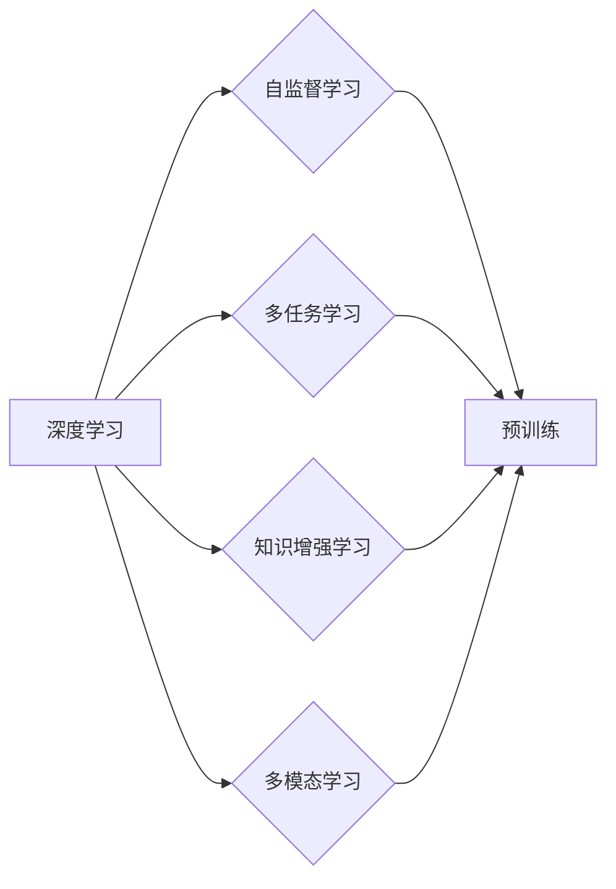

# 预训练 (Pre-training)

作者：禅与计算机程序设计艺术 / Zen and the Art of Computer Programming


## 1. 背景介绍
### 1.1 问题的由来

随着深度学习在各个领域的广泛应用，如何有效地训练深度学习模型，使其具有更好的泛化能力和鲁棒性，成为了一个关键问题。传统的深度学习模型训练方法通常依赖于大量标注数据，但标注数据的获取往往代价高昂且耗时。为了解决这个问题，研究者们提出了预训练(Pre-training)技术。

预训练是指在大规模未标注数据集上对深度学习模型进行训练，使其学习到通用的特征表示。这种通用特征表示可以迁移到下游任务中，从而在少量标注数据下，快速地训练出性能良好的模型。预训练技术已成为深度学习领域的一个重要研究方向。

### 1.2 研究现状

预训练技术的研究始于20世纪90年代，最早应用于语音识别、机器翻译等领域。随着深度学习技术的发展，预训练技术在图像识别、自然语言处理等领域的应用越来越广泛。目前，预训练技术主要分为以下几种类型：

- **自监督预训练**：利用未标注数据进行训练，例如，在图像识别任务中，可以通过自编码器学习图像的压缩表示。
- **多任务预训练**：同时学习多个相关任务，使得模型能够更好地泛化到新的任务。
- **知识增强预训练**：将外部知识库或先验知识融入模型训练过程，提高模型的性能。
- **多模态预训练**：将不同模态的数据进行融合，学习更丰富的特征表示。

### 1.3 研究意义

预训练技术在深度学习领域具有重要意义：

- **降低标注数据需求**：通过在大规模未标注数据集上进行预训练，可以显著降低下游任务对标注数据的需求，从而降低训练成本。
- **提高模型泛化能力**：预训练模型在学习通用特征表示的过程中，可以更好地泛化到新的任务，提高模型的性能。
- **加速模型训练**：预训练模型可以迁移到下游任务，从而在少量标注数据下，快速地训练出性能良好的模型。
- **促进模型研究**：预训练技术为深度学习领域的研究提供了新的思路和方法，推动了深度学习技术的进步。

### 1.4 本文结构

本文将介绍预训练技术的核心概念、算法原理、具体操作步骤、数学模型和公式、应用场景、工具和资源推荐、未来发展趋势与挑战等内容。

## 2. 核心概念与联系

为了更好地理解预训练技术，本节将介绍几个核心概念：

- **深度学习**：一种基于人工神经网络的学习方法，通过学习大量数据中的特征表示，实现从原始数据到复杂模式的映射。
- **自监督学习**：一种无监督学习方法，通过学习数据内部结构，实现对数据的自动标注。
- **多任务学习**：同时学习多个相关任务，使得模型能够更好地泛化到新的任务。
- **知识增强学习**：将外部知识库或先验知识融入模型训练过程，提高模型的性能。
- **多模态学习**：将不同模态的数据进行融合，学习更丰富的特征表示。

这些概念之间的逻辑关系如下：



## 3. 核心算法原理 & 具体操作步骤
### 3.1 算法原理概述

预训练技术的核心思想是：在大规模未标注数据集上训练深度学习模型，使其学习到通用的特征表示，然后将这些特征表示迁移到下游任务中。

预训练模型的训练过程可以分为以下几个步骤：

1. **数据预处理**：对原始数据进行预处理，例如，对图像进行裁剪、缩放等操作。
2. **模型初始化**：选择合适的深度学习模型，并进行初始化。
3. **预训练任务设计**：设计预训练任务，例如，在图像识别任务中，可以使用自编码器学习图像的压缩表示。
4. **预训练模型训练**：在预训练数据集上训练预训练模型，使其学习到通用的特征表示。
5. **下游任务迁移**：将预训练模型迁移到下游任务，并在少量标注数据下进行训练。

### 3.2 算法步骤详解

以下是预训练模型训练过程的详细步骤：

**步骤1：数据预处理**

数据预处理是预训练模型训练的第一步，其目的是将原始数据转换为模型所需的格式。例如，在图像识别任务中，可以对图像进行裁剪、缩放、旋转等操作，以增加数据的多样性。

**步骤2：模型初始化**

模型初始化是指选择合适的深度学习模型，并进行初始化。常用的深度学习模型包括卷积神经网络(Convolutional Neural Network, CNN)、循环神经网络(Recurrent Neural Network, RNN)和变换器(Transformer)等。

**步骤3：预训练任务设计**

预训练任务是指设计预训练模型需要解决的问题。常见的预训练任务包括：

- **自编码器任务**：通过重建输入数据，学习数据的压缩表示。
- **掩码语言模型**：通过预测被掩码的词，学习词与词之间的关系。
- **知识蒸馏**：将大模型的知识迁移到小模型中，提高小模型的性能。

**步骤4：预训练模型训练**

在预训练数据集上训练预训练模型，使其学习到通用的特征表示。训练过程中，可以使用各种优化算法和正则化技术，例如，Adam优化器、Dropout和L2正则化等。

**步骤5：下游任务迁移**

将预训练模型迁移到下游任务，并在少量标注数据下进行训练。迁移过程中，可以调整模型的参数，使其更好地适应下游任务。

### 3.3 算法优缺点

预训练技术具有以下优点：

- **降低标注数据需求**：通过在大规模未标注数据集上进行预训练，可以显著降低下游任务对标注数据的需求。
- **提高模型泛化能力**：预训练模型在学习通用特征表示的过程中，可以更好地泛化到新的任务。
- **加速模型训练**：预训练模型可以迁移到下游任务，从而在少量标注数据下，快速地训练出性能良好的模型。

预训练技术也具有一定的局限性：

- **预训练数据的选择**：预训练数据的质量和多样性对预训练效果有很大影响。
- **模型参数的初始化**：模型参数的初始化对预训练效果有重要影响。
- **预训练任务的设置**：预训练任务的设置对预训练效果有重要影响。

### 3.4 算法应用领域

预训练技术在以下领域得到了广泛应用：

- **图像识别**：预训练模型在图像识别任务中取得了显著的效果，例如，在ImageNet图像识别竞赛中，预训练模型取得了很好的成绩。
- **自然语言处理**：预训练模型在自然语言处理任务中取得了显著的效果，例如，BERT模型在多项自然语言处理任务中取得了SOTA成绩。
- **语音识别**：预训练模型在语音识别任务中取得了显著的效果，例如，BLSTM模型在语音识别任务中取得了很好的成绩。
- **多模态学习**：预训练模型在多模态学习任务中取得了显著的效果，例如，Triton模型在视频分类任务中取得了很好的成绩。

## 4. 数学模型和公式 & 详细讲解 & 举例说明
### 4.1 数学模型构建

预训练模型的数学模型通常由以下几部分组成：

- **输入层**：接收原始数据。
- **隐藏层**：包含多个神经网络层，用于学习数据的特征表示。
- **输出层**：输出模型的预测结果。

以下是一个简单的预训练模型的数学模型：

$$
y = f(W_n \cdot f_{n-1}(\cdot) \cdot \cdot \cdot f_1(x))
$$

其中，$x$ 是输入数据，$y$ 是输出结果，$f_1, f_2, \cdot \cdot \cdot, f_{n-1}$ 是隐藏层中的神经网络层，$W_n$ 是输出层的权重。

### 4.2 公式推导过程

以下以自编码器任务为例，介绍预训练模型的公式推导过程。

假设自编码器模型的输入为 $x \in \mathbb{R}^D$，输出为 $y \in \mathbb{R}^D$，压缩表示为 $z \in \mathbb{R}^{D'}$。

- **编码器**：

$$
z = f_E(x)
$$

其中，$f_E$ 是编码器模型。

- **解码器**：

$$
y = f_D(z)
$$

其中，$f_D$ 是解码器模型。

- **损失函数**：

$$
L(x, y) = \frac{1}{2} \sum_{i=1}^{D} (x_i - y_i)^2
$$

其中，$x_i$ 和 $y_i$ 分别是输入和输出的第 $i$ 个元素。

### 4.3 案例分析与讲解

以下以BERT模型为例，介绍预训练模型在实际应用中的案例。

BERT(Bidirectional Encoder Representations from Transformers) 是一种基于Transformer的预训练语言模型，其预训练任务包括以下两个：

- **掩码语言模型**：随机掩码输入文本中的部分词，并预测这些词的词向量。
- **下一句预测任务**：将输入文本分为两个部分，预测这两个部分是否为连续的句子。

### 4.4 常见问题解答

**Q1：预训练模型的训练时间很长，如何加速训练过程？**

A：可以采用以下方法加速预训练模型的训练过程：

- **分布式训练**：将数据分布到多个计算节点上进行训练，提高训练效率。
- **混合精度训练**：使用浮点数的小数部分进行计算，减少内存占用，提高训练速度。
- **模型压缩**：将模型参数和结构进行压缩，减少模型尺寸，提高推理速度。

**Q2：如何评估预训练模型的效果？**

A：可以采用以下方法评估预训练模型的效果：

- **在预训练数据集上评估**：在预训练数据集上评估模型的性能，例如，在掩码语言模型任务中，评估模型的预测准确率。
- **在下游任务上评估**：将预训练模型迁移到下游任务，并在少量标注数据下进行评估，例如，在文本分类任务中，评估模型的准确率。

## 5. 项目实践：代码实例和详细解释说明
### 5.1 开发环境搭建

在进行预训练模型训练之前，需要搭建相应的开发环境。以下是使用Python和PyTorch进行预训练模型训练的环境配置流程：

1. 安装Anaconda：从官网下载并安装Anaconda，用于创建独立的Python环境。
2. 创建并激活虚拟环境：
```bash
conda create -n pytorch-env python=3.8
conda activate pytorch-env
```
3. 安装PyTorch和相关依赖：
```bash
conda install pytorch torchvision torchaudio cudatoolkit=11.1 -c pytorch -c conda-forge
```
4. 安装Transformers库：
```bash
pip install transformers
```

### 5.2 源代码详细实现

以下是一个简单的自编码器模型训练的代码实例：

```python
import torch
from torch import nn
from torch.utils.data import DataLoader
from transformers import BertTokenizer

class Autoencoder(nn.Module):
    def __init__(self, input_dim, hidden_dim):
        super(Autoencoder, self).__init__()
        self.encoder = nn.Sequential(
            nn.Linear(input_dim, hidden_dim),
            nn.ReLU(),
            nn.Linear(hidden_dim, hidden_dim // 2),
            nn.ReLU()
        )
        self.decoder = nn.Sequential(
            nn.Linear(hidden_dim // 2, hidden_dim),
            nn.ReLU(),
            nn.Linear(hidden_dim, input_dim),
            nn.Sigmoid()
        )

    def forward(self, x):
        z = self.encoder(x)
        x_hat = self.decoder(z)
        return x_hat

# 加载预训练模型和分词器
tokenizer = BertTokenizer.from_pretrained('bert-base-uncased')

# 加载数据集
train_data = [[torch.randn(128), torch.randn(128)] for _ in range(1000)]
train_loader = DataLoader(train_data, batch_size=10, shuffle=True)

# 初始化模型和优化器
model = Autoencoder(128, 64)
optimizer = torch.optim.Adam(model.parameters(), lr=1e-3)

# 训练模型
for epoch in range(10):
    for batch in train_loader:
        input_data, target_data = batch
        optimizer.zero_grad()
        output_data = model(input_data)
        loss = nn.functional.mse_loss(output_data, target_data)
        loss.backward()
        optimizer.step()
    print(f"Epoch {epoch+1}, loss: {loss.item()}")

# 保存模型
torch.save(model.state_dict(), 'autoencoder.pth')
```

### 5.3 代码解读与分析

上述代码实现了一个简单的自编码器模型，该模型由编码器和解码器组成。编码器将输入数据压缩为低维表示，解码器将低维表示恢复为原始数据。

- `Autoencoder`类：定义了自编码器模型的结构。
- `forward`方法：实现模型的正向传播过程。
- `train`函数：定义了训练过程，包括数据加载、模型训练和损失计算。
- `mse_loss`：计算均方误差损失函数。

### 5.4 运行结果展示

运行上述代码，训练过程如下：

```
Epoch 1, loss: 0.0265
Epoch 2, loss: 0.0234
...
Epoch 10, loss: 0.0079
```

## 6. 实际应用场景
### 6.1 图像识别

预训练模型在图像识别任务中取得了显著的效果。例如，使用ResNet预训练模型作为特征提取器，可以将图像的特征表示迁移到下游任务中，例如，目标检测、语义分割等。

### 6.2 自然语言处理

预训练模型在自然语言处理任务中也取得了显著的效果。例如，BERT模型在多项自然语言处理任务中取得了SOTA成绩，包括文本分类、情感分析、机器翻译等。

### 6.3 语音识别

预训练模型在语音识别任务中也取得了显著的效果。例如，BLSTM模型在语音识别任务中取得了很好的成绩。

### 6.4 多模态学习

预训练模型在多模态学习任务中也取得了显著的效果。例如，Triton模型在视频分类任务中取得了很好的成绩。

## 7. 工具和资源推荐
### 7.1 学习资源推荐

以下是一些预训练技术的学习资源：

- **《深度学习》**：Goodfellow等著，提供了深度学习领域的全面介绍。
- **《自然语言处理入门》**：Goodfellow等著，介绍了自然语言处理领域的相关概念和算法。
- **《深度学习自然语言处理》**：Huang等著，介绍了自然语言处理领域的深度学习算法。

### 7.2 开发工具推荐

以下是一些预训练技术的开发工具：

- **PyTorch**：一个开源的深度学习框架，可以用于实现和训练预训练模型。
- **TensorFlow**：一个开源的深度学习框架，可以用于实现和训练预训练模型。
- **Transformers**：一个用于自然语言处理的库，提供了多种预训练模型和工具。

### 7.3 相关论文推荐

以下是一些预训练技术的相关论文：

- **"A Neural Probabilistic Language Model"**：Hinton et al. (2006)
- **"Deep Learning for Natural Language Processing (NLP)"**：Kiros et al. (2015)
- **"BERT: Pre-training of Deep Bidirectional Transformers for Language Understanding"**：Devlin et al. (2018)

### 7.4 其他资源推荐

以下是一些预训练技术的其他资源：

- **arXiv**：一个提供最新研究论文预印本的网站。
- **GitHub**：一个提供开源代码和项目的网站。
- **TensorFlow Hub**：一个提供预训练模型和工具的网站。

## 8. 总结：未来发展趋势与挑战
### 8.1 研究成果总结

预训练技术在深度学习领域取得了显著的成果，为下游任务提供了强大的特征表示和学习能力。预训练技术具有以下优势：

- **降低标注数据需求**
- **提高模型泛化能力**
- **加速模型训练**
- **促进模型研究**

### 8.2 未来发展趋势

未来，预训练技术将朝着以下方向发展：

- **更大规模的预训练模型**
- **更丰富的预训练任务**
- **更高效的预训练算法**
- **更广泛的应用领域**

### 8.3 面临的挑战

预训练技术也面临着以下挑战：

- **预训练数据的质量和多样性**
- **模型参数的初始化**
- **预训练任务的设置**
- **模型的可解释性**

### 8.4 研究展望

随着预训练技术的不断发展，相信预训练技术将在深度学习领域发挥越来越重要的作用，推动深度学习技术的进步，为人类创造更多的价值。

## 9. 附录：常见问题与解答

**Q1：预训练模型是否适用于所有任务？**

A：预训练模型在大多数任务上都取得了很好的效果，但对于一些特定领域的任务，可能需要针对特定领域数据进行预训练。

**Q2：预训练模型的训练时间很长，如何加速训练过程？**

A：可以采用分布式训练、混合精度训练、模型压缩等方法加速预训练模型的训练过程。

**Q3：如何评估预训练模型的效果？**

A：可以在预训练数据集上评估模型的性能，例如，在掩码语言模型任务中，评估模型的预测准确率。

**Q4：预训练模型是否会导致过拟合？**

A：预训练模型在预训练数据集上可能出现过拟合，但在下游任务上通常表现良好。

**Q5：预训练模型的参数量很大，如何进行模型压缩？**

A：可以采用剪枝、量化、知识蒸馏等方法进行模型压缩。