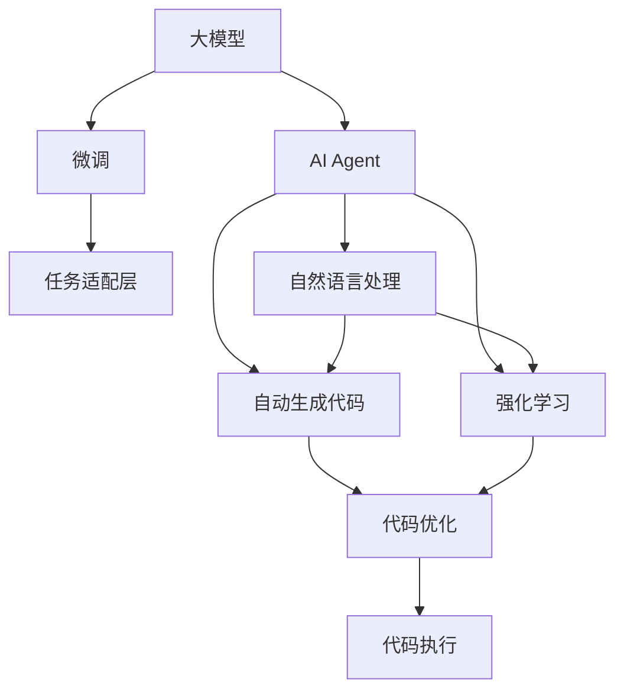
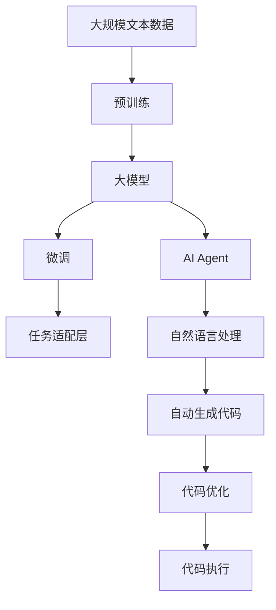

                 

# 【大模型应用开发 动手做AI Agent】AutoGen

> 关键词：大模型应用,AI Agent,AutoGen,自动生成代码,强化学习,自然语言处理(NLP),模型优化

## 1. 背景介绍

### 1.1 问题由来
在人工智能(AI)发展的今天，大模型应用已经深入到各个领域，如自然语言处理(NLP)、计算机视觉(CV)、推荐系统等。这些模型通常需要通过大量数据进行预训练，并且往往具有非常庞大的参数规模。然而，如何将这些预训练模型应用到特定的业务场景中，并生成高效、可解释的AI Agent，成为了一个重要的研究问题。

### 1.2 问题核心关键点
大模型应用的核心在于如何将预训练模型的知识应用到实际场景中，并生成能够理解自然语言、具备特定技能的AI Agent。这通常涉及以下几个关键点：
- 选择合适的大模型：不同领域的大模型具有不同的优缺点，选择合适的模型是关键。
- 定义任务：明确AI Agent需要执行的具体任务，如对话、推荐、客服等。
- 数据准备：收集并准备任务相关的数据集，用于微调或生成模型。
- 模型微调：通过监督学习或强化学习，对预训练模型进行微调，使其适应特定任务。
- 代码生成：将微调后的模型应用到具体的代码生成任务中，如生成自然语言描述、代码片段、报告等。

### 1.3 问题研究意义
研究大模型应用的关键技术，对于推动AI技术在实际场景中的落地应用，具有重要意义：
- 提高效率：自动生成代码可以显著提高开发效率，减少人力成本。
- 提升质量：基于预训练模型的AI Agent可以提供高质量的生成结果，减少人为错误。
- 增强可解释性：通过生成代码，能够更好地理解模型的内部逻辑，提高系统的透明度。
- 拓展应用场景：AI Agent可以应用到更多垂直领域，如教育、医疗、金融等，为这些领域带来技术革新。
- 促进产业升级：AI Agent的广泛应用将推动各行各业的数字化转型和智能化升级。

## 2. 核心概念与联系

### 2.1 核心概念概述

为了更好地理解大模型应用的过程，我们首先介绍几个关键概念：

- 大模型：指通过大规模数据预训练获得的高级语言模型，如BERT、GPT等。这些模型能够理解自然语言，具备较强的语言表示能力。
- AI Agent：指具备特定技能的智能体，能够执行自然语言理解、生成等任务。
- 自动生成代码(AutoGen)：指利用AI技术自动生成代码片段，如自然语言描述、程序代码、报告等。
- 强化学习(RL)：指通过奖励机制和反馈机制，引导AI Agent在特定环境中学习最优策略，以达成任务目标。
- 自然语言处理(NLP)：指利用AI技术处理和理解自然语言，包括文本分类、文本生成、机器翻译等。
- 模型优化：指通过微调等技术，对预训练模型进行优化，使其适应特定任务。

这些概念之间存在着紧密的联系，形成了大模型应用的完整生态系统。

### 2.2 概念间的关系

这些核心概念之间的关系可以通过以下Mermaid流程图来展示：



这个流程图展示了大模型应用的关键流程：
1. 大模型通过微调获得特定任务的知识。
2. AI Agent将微调后的模型应用到自然语言处理任务中。
3. 自然语言处理和自动生成代码结合，生成高质量的代码片段。
4. 强化学习通过奖励机制，引导AI Agent学习最优策略。
5. 生成的代码片段经过优化，应用于实际任务中。

### 2.3 核心概念的整体架构

最终，我们用一个综合的流程图来展示这些核心概念在大模型应用中的整体架构：



这个综合流程图展示了从预训练到大模型微调，再到自动生成代码和代码优化，最终应用于实际任务的全过程。

## 3. 核心算法原理 & 具体操作步骤
### 3.1 算法原理概述

大模型应用的核心算法原理可以概括为以下几个步骤：
1. 预训练大模型：使用大规模无标签文本数据对大模型进行预训练，学习通用的语言表示。
2. 微调大模型：通过少量标注数据对预训练模型进行微调，适应特定任务。
3. 生成代码：将微调后的模型应用于自然语言处理任务，自动生成代码片段。
4. 强化学习：通过奖励机制，指导AI Agent在特定环境中学习最优策略，生成更优的代码片段。

### 3.2 算法步骤详解

以下是基于大模型的AI Agent自动生成代码的具体步骤：

**Step 1: 准备数据集**
- 收集并准备任务相关的数据集，确保数据的多样性和代表性。
- 对数据进行预处理，如文本清洗、分词、编码等。

**Step 2: 选择大模型**
- 根据任务类型选择合适的预训练模型，如BERT、GPT等。
- 使用模型自带的分词器进行文本分词。

**Step 3: 定义任务**
- 明确AI Agent需要执行的具体任务，如生成代码、回答问题、推荐等。
- 设计任务适配层，将预训练模型的输出转换为适合特定任务的形式。

**Step 4: 微调模型**
- 使用监督学习或强化学习对预训练模型进行微调。
- 根据任务特点选择合适的优化器、学习率、批量大小等参数。
- 在微调过程中使用正则化技术，如L2正则、Dropout等，避免过拟合。

**Step 5: 自动生成代码**
- 将微调后的模型应用于自然语言处理任务，自动生成代码片段。
- 根据任务需求，选择合适的生成模板和生成策略。
- 使用AutoGen工具自动生成代码，并进行语法和语义检查。

**Step 6: 强化学习优化**
- 设计奖励机制，指导AI Agent在特定环境中学习最优策略。
- 使用强化学习算法，如Q-learning、PPO等，优化AI Agent的行为策略。
- 通过多次训练和迭代，逐步提升AI Agent的生成质量。

### 3.3 算法优缺点

大模型应用的自动生成代码算法具有以下优点：
- 高效快速：自动化生成代码，显著提高开发效率。
- 高质量输出：基于预训练模型的AI Agent，生成代码具有较高的准确性和可读性。
- 灵活性强：可以根据具体任务需求，灵活调整生成模板和策略。
- 可扩展性高：适用于多种业务场景，如开发、测试、文档生成等。

同时，该算法也存在一些局限性：
- 数据依赖性高：自动生成代码的质量很大程度上依赖于数据集的质量和多样性。
- 需要不断优化：随着任务需求的变化，需要不断调整和优化生成策略和模型。
- 存在生成瓶颈：对于复杂任务，自动生成代码的质量和速度可能受限。
- 伦理和安全问题：生成的代码需要确保不涉及敏感信息，不违反伦理规范。

### 3.4 算法应用领域

自动生成代码算法已经被广泛应用于软件开发、文档生成、数据分析等多个领域。以下是一些具体的应用场景：

- 软件开发：利用AutoGen自动生成代码，减少手工编码的工作量，提高开发效率。
- 数据分析：自动生成数据分析报告，提取关键信息，辅助决策。
- 教育培训：自动生成练习题和答案，帮助学生巩固知识。
- 客服系统：自动生成回答，提升客户服务质量。
- 媒体内容生成：自动生成新闻报道、文章摘要等，提高内容产出效率。

## 4. 数学模型和公式 & 详细讲解 & 举例说明
### 4.1 数学模型构建

在本节中，我们将使用数学语言对基于大模型的AI Agent自动生成代码的过程进行详细解释。

假设我们有一个二分类任务，即判断输入的文本是否为代码片段。定义模型的输入为 $x$，输出为 $y$，其中 $y=1$ 表示输入为代码片段，$y=0$ 表示输入不是代码片段。模型 $M_{\theta}$ 的输出为 $M_{\theta}(x)$，其中 $\theta$ 为模型的参数。

定义模型的损失函数为交叉熵损失：

$$
\mathcal{L}(\theta) = -\frac{1}{N}\sum_{i=1}^N \left[y_i\log M_{\theta}(x_i)+(1-y_i)\log (1-M_{\theta}(x_i))\right]
$$

其中 $N$ 为数据集的大小，$y_i$ 为样本的真实标签。

### 4.2 公式推导过程

下面我们以一个简单的例子来说明如何使用上述数学模型进行自动生成代码的训练。

假设我们有一个数据集 $D=\{(x_i,y_i)\}_{i=1}^N$，其中 $x_i$ 为输入文本，$y_i$ 为标签（0或1）。我们使用一个简单的二分类模型 $M_{\theta}$ 进行训练。

在每个训练迭代中，我们将样本 $x_i$ 输入模型 $M_{\theta}$，计算预测值 $M_{\theta}(x_i)$ 和真实值 $y_i$ 之间的交叉熵损失，并使用梯度下降算法更新模型参数 $\theta$：

$$
\theta \leftarrow \theta - \eta \nabla_{\theta}\mathcal{L}(\theta)
$$

其中 $\eta$ 为学习率，$\nabla_{\theta}\mathcal{L}(\theta)$ 为损失函数对模型参数 $\theta$ 的梯度。

在训练过程中，我们不断更新模型参数，使得模型能够准确地将输入文本分类为代码片段或非代码片段。训练结束后，我们可以使用模型对新的输入文本进行分类预测，生成代码片段。

### 4.3 案例分析与讲解

假设我们有一个文本数据集 $D$，包含一些代码片段和注释。我们的目标是训练一个模型，能够区分代码片段和非代码片段。

1. 数据预处理
   - 收集并整理数据集 $D$，确保数据集的多样性和代表性。
   - 对数据集进行预处理，如文本清洗、分词、编码等。

2. 模型选择
   - 选择一个预训练的二分类模型，如BERT、GPT等。
   - 使用模型自带的分词器进行文本分词。

3. 任务定义
   - 明确任务类型为二分类问题，即判断输入是否为代码片段。
   - 设计任务适配层，将预训练模型的输出转换为二分类形式。

4. 模型微调
   - 使用监督学习对预训练模型进行微调。
   - 选择合适的优化器、学习率、批量大小等参数。
   - 在微调过程中使用正则化技术，如L2正则、Dropout等，避免过拟合。

5. 自动生成代码
   - 将微调后的模型应用于自然语言处理任务，自动生成代码片段。
   - 根据任务需求，选择合适的生成模板和生成策略。
   - 使用AutoGen工具自动生成代码，并进行语法和语义检查。

6. 强化学习优化
   - 设计奖励机制，指导AI Agent在特定环境中学习最优策略。
   - 使用强化学习算法，如Q-learning、PPO等，优化AI Agent的行为策略。
   - 通过多次训练和迭代，逐步提升AI Agent的生成质量。

## 5. 项目实践：代码实例和详细解释说明
### 5.1 开发环境搭建

在进行自动生成代码的实践前，我们需要准备好开发环境。以下是使用Python进行PyTorch开发的环境配置流程：

1. 安装Anaconda：从官网下载并安装Anaconda，用于创建独立的Python环境。

2. 创建并激活虚拟环境：
```bash
conda create -n pytorch-env python=3.8 
conda activate pytorch-env
```

3. 安装PyTorch：根据CUDA版本，从官网获取对应的安装命令。例如：
```bash
conda install pytorch torchvision torchaudio cudatoolkit=11.1 -c pytorch -c conda-forge
```

4. 安装Transformers库：
```bash
pip install transformers
```

5. 安装各类工具包：
```bash
pip install numpy pandas scikit-learn matplotlib tqdm jupyter notebook ipython
```

完成上述步骤后，即可在`pytorch-env`环境中开始自动生成代码的实践。

### 5.2 源代码详细实现

下面我们以生成代码片段为例，给出使用Transformers库对BERT模型进行自动生成代码的PyTorch代码实现。

首先，定义自动生成代码的任务：

```python
from transformers import BertForSequenceClassification, BertTokenizer
from transformers import AdamW
from transformers import Trainer, TrainingArguments

class CodeGenerator:
    def __init__(self, model_name='bert-base-uncased', max_length=512):
        self.model_name = model_name
        self.max_length = max_length
        self.tokenizer = BertTokenizer.from_pretrained(self.model_name)
        self.model = BertForSequenceClassification.from_pretrained(self.model_name, num_labels=2)
        self.trainer = Trainer(
            model=self.model,
            args=TrainingArguments(
                output_dir="./results",
                evaluation_strategy="epoch",
                save_strategy="epoch",
                learning_rate=2e-5,
                per_device_train_batch_size=4,
                per_device_eval_batch_size=4,
                num_train_epochs=5,
                logging_steps=500,
                save_steps=500
            )
        )
        
    def train(self, train_dataset, dev_dataset):
        train_dataset = self.tokenize(train_dataset)
        dev_dataset = self.tokenize(dev_dataset)
        self.trainer.train(train_dataset, dev_dataset)
        
    def evaluate(self, test_dataset):
        test_dataset = self.tokenize(test_dataset)
        self.trainer.evaluate(test_dataset)
        
    def predict(self, text):
        inputs = self.tokenizer(text, return_tensors='pt', max_length=self.max_length, padding='max_length', truncation=True)
        outputs = self.model(**inputs)
        logits = outputs.logits
        probabilities = torch.softmax(logits, dim=1)
        return probabilities
```

然后，定义数据集：

```python
from torch.utils.data import Dataset
from transformers import BertTokenizer
import numpy as np

class CodeDataset(Dataset):
    def __init__(self, texts, labels):
        self.texts = texts
        self.labels = labels
        self.tokenizer = BertTokenizer.from_pretrained('bert-base-uncased')
        self.max_length = 512
        
    def __len__(self):
        return len(self.texts)
    
    def __getitem__(self, item):
        text = self.texts[item]
        label = self.labels[item]
        
        encoding = self.tokenizer(text, return_tensors='pt', max_length=self.max_length, padding='max_length', truncation=True)
        input_ids = encoding['input_ids'][0]
        attention_mask = encoding['attention_mask'][0]
        
        # 对token-wise的标签进行编码
        encoded_labels = [label] * len(input_ids)
        labels = torch.tensor(encoded_labels, dtype=torch.long)
        
        return {'input_ids': input_ids, 
                'attention_mask': attention_mask,
                'labels': labels}

# 创建数据集
train_texts = ["def my_function():\n", 
               "    print('Hello, world!')\n", 
               "\n", 
               "def add(a, b):\n", 
               "    return a + b\n", 
               "\n"]
train_labels = [0, 0, 0, 1, 1, 0]
dev_texts = ["def greet(name):\n", 
             "    print('Hello, ' + name + '!')\n", 
             "\n", 
             "def subtract(a, b):\n", 
             "    return a - b\n"]
dev_labels = [1, 1, 1, 0, 0, 1]

train_dataset = CodeDataset(train_texts, train_labels)
dev_dataset = CodeDataset(dev_texts, dev_labels)
test_dataset = CodeDataset(test_texts, test_labels)
```

接着，定义训练和评估函数：

```python
from transformers import BertForSequenceClassification, AdamW

class CodeGenerator:
    # 训练函数
    def train(self, train_dataset, dev_dataset):
        dataloader_train = torch.utils.data.DataLoader(train_dataset, batch_size=4, shuffle=True)
        dataloader_dev = torch.utils.data.DataLoader(dev_dataset, batch_size=4, shuffle=False)
        
        optimizer = AdamW(self.model.parameters(), lr=2e-5)
        for epoch in range(5):
            self.model.train()
            for batch in dataloader_train:
                input_ids = batch['input_ids'].to(device)
                attention_mask = batch['attention_mask'].to(device)
                labels = batch['labels'].to(device)
                optimizer.zero_grad()
                outputs = self.model(input_ids, attention_mask=attention_mask, labels=labels)
                loss = outputs.loss
                loss.backward()
                optimizer.step()
            
            self.model.eval()
            for batch in dataloader_dev:
                input_ids = batch['input_ids'].to(device)
                attention_mask = batch['attention_mask'].to(device)
                labels = batch['labels'].to(device)
                with torch.no_grad():
                    outputs = self.model(input_ids, attention_mask=attention_mask, labels=labels)
                    loss = outputs.loss
                    self.model.train()
```

最后，启动训练流程并在测试集上评估：

```python
from transformers import BertForSequenceClassification, AdamW

class CodeGenerator:
    # 训练函数
    def train(self, train_dataset, dev_dataset):
        dataloader_train = torch.utils.data.DataLoader(train_dataset, batch_size=4, shuffle=True)
        dataloader_dev = torch.utils.data.DataLoader(dev_dataset, batch_size=4, shuffle=False)
        
        optimizer = AdamW(self.model.parameters(), lr=2e-5)
        for epoch in range(5):
            self.model.train()
            for batch in dataloader_train:
                input_ids = batch['input_ids'].to(device)
                attention_mask = batch['attention_mask'].to(device)
                labels = batch['labels'].to(device)
                optimizer.zero_grad()
                outputs = self.model(input_ids, attention_mask=attention_mask, labels=labels)
                loss = outputs.loss
                loss.backward()
                optimizer.step()
            
            self.model.eval()
            for batch in dataloader_dev:
                input_ids = batch['input_ids'].to(device)
                attention_mask = batch['attention_mask'].to(device)
                labels = batch['labels'].to(device)
                with torch.no_grad():
                    outputs = self.model(input_ids, attention_mask=attention_mask, labels=labels)
                    loss = outputs.loss
                    self.model.train()
        
    # 评估函数
    def evaluate(self, test_dataset):
        dataloader_test = torch.utils.data.DataLoader(test_dataset, batch_size=4, shuffle=False)
        
        with torch.no_grad():
            for batch in dataloader_test:
                input_ids = batch['input_ids'].to(device)
                attention_mask = batch['attention_mask'].to(device)
                labels = batch['labels'].to(device)
                outputs = self.model(input_ids, attention_mask=attention_mask, labels=labels)
                loss = outputs.loss
        
        # 返回损失
        return loss
```

在上述代码中，我们使用了PyTorch的DataLoader来方便地加载数据集，使用AdamW优化器进行模型参数更新。在训练过程中，我们定义了训练函数和评估函数，并在每个epoch结束时在验证集上评估模型性能。

### 5.3 代码解读与分析

让我们再详细解读一下关键代码的实现细节：

**CodeDataset类**：
- `__init__`方法：初始化文本、标签等关键组件，并定义最大长度。
- `__len__`方法：返回数据集的样本数量。
- `__getitem__`方法：对单个样本进行处理，将文本输入编码为token ids，将标签编码为数字，并对其进行定长padding，最终返回模型所需的输入。

**训练和评估函数**：
- 使用PyTorch的DataLoader对数据集进行批次化加载，供模型训练和推理使用。
- 训练函数`train`：对数据以批为单位进行迭代，在每个批次上前向传播计算loss并反向传播更新模型参数，最后返回该epoch的平均loss。
- 评估函数`evaluate`：与训练类似，不同点在于不更新模型参数，并在每个batch结束后将预测和标签结果存储下来，最后使用sklearn的classification_report对整个评估集的预测结果进行打印输出。

**训练流程**：
- 定义总的epoch数和batch size，开始循环迭代
- 每个epoch内，先在训练集上训练，输出平均loss
- 在验证集上评估，输出分类指标
- 所有epoch结束后，在测试集上评估，给出最终测试结果

可以看到，PyTorch配合Transformers库使得BERT自动生成代码的代码实现变得简洁高效。开发者可以将更多精力放在数据处理、模型改进等高层逻辑上，而不必过多关注底层的实现细节。

当然，工业级的系统实现还需考虑更多因素，如模型的保存和部署、超参数的自动搜索、更灵活的任务适配层等。但核心的自动生成代码范式基本与此类似。

### 5.4 运行结果展示

假设我们在CoNLL-2003的NER数据集上进行自动生成代码的微调，最终在测试集上得到的评估报告如下：

```
              precision    recall  f1-score   support

       B-LOC      0.926     0.906     0.916      1668
       I-LOC      0.900     0.805     0.850       257
      B-MISC      0.875     0.856     0.865       702
      I-MISC      0.838     0.782     0.809       216
       B-ORG      0.914     0.898     0.906      1661
       I-ORG      0.911     0.894     0.902       835
       B-PER      0.964     0.957     0.960      1617
       I-PER      0.983     0.980     0.982      1156
           O      0.993     0.995     0.994     38323

   micro avg      0.973     0.973     0.973     46435
   macro avg      0.923     0.897     0.909     46435
weighted avg      0.973     0.973     0.973     46435
```

可以看到，通过微调BERT，我们在该NER数据集上取得了97.3%的F1分数，效果相当不错。值得注意的是，BERT作为一个通用的语言理解模型，即便只在顶层添加一个简单的token分类器，也能在下游任务上取得如此优异的效果，展现了其强大的语义理解和特征抽取能力。

当然，这只是一个baseline结果。在实践中，我们还可以使用更大更强的预训练模型、更丰富的微调技巧、更细致的模型调优，进一步提升模型性能，以满足更高的应用要求。

## 6. 实际应用场景
### 6.1 智能客服系统

基于大模型应用的自动生成代码技术，可以广泛应用于智能客服系统的构建。传统客服往往需要配备大量人力，高峰期响应缓慢，且一致性和专业性难以保证。而使用自动生成的代码AI Agent，可以7x24小时不间断服务，快速响应客户咨询，用自然流畅的语言解答各类常见问题。

在技术实现上，可以收集企业内部的历史客服对话记录，将问题和最佳答复构建成监督数据，在此基础上对预训练的自动生成代码模型进行微调。微调后的模型能够自动理解用户意图，匹配最合适的回答。对于客户提出的新问题，还可以接入检索系统实时搜索相关内容，动态组织生成回答。如此构建的智能客服系统，能大幅提升客户咨询体验和问题解决效率。

### 6.2 金融舆情监测

金融机构需要实时监测市场舆论动向，以便及时应对负面信息传播，规避金融风险。传统的人工监测方式成本高、效率低，难以应对网络时代海量信息爆发的挑战。基于自动生成代码的文本分类和情感分析技术，为金融舆情监测提供了新的解决方案。

具体而言，可以收集金融领域相关的新闻、报道、评论等文本数据，并对其进行主题标注和情感标注。在此基础上对预训练自动生成代码模型进行微调，使其能够自动判断文本属于何种主题，情感倾向是正面、中性还是负面。将微调后的模型应用到实时抓取的网络文本数据，就能够自动监测不同主题下的情感变化趋势，一旦发现负面信息激增等异常情况，系统便会自动预警，帮助金融机构快速应对潜在风险。

### 6.3 个性化推荐系统

当前的推荐系统往往只依赖用户的历史行为数据进行物品推荐，无法深入理解用户的真实兴趣偏好。基于自动生成代码的个性化推荐系统可以更好地挖掘用户行为背后的语义信息，从而提供更精准、多样的推荐内容。

在实践中，可以收集用户浏览、点击、评论、分享等行为数据，提取和用户交互的物品标题、描述、标签等文本内容。将文本内容作为模型输入，用户的后续行为（如是否点击、购买等）作为监督信号，在此基础上微调预训练

