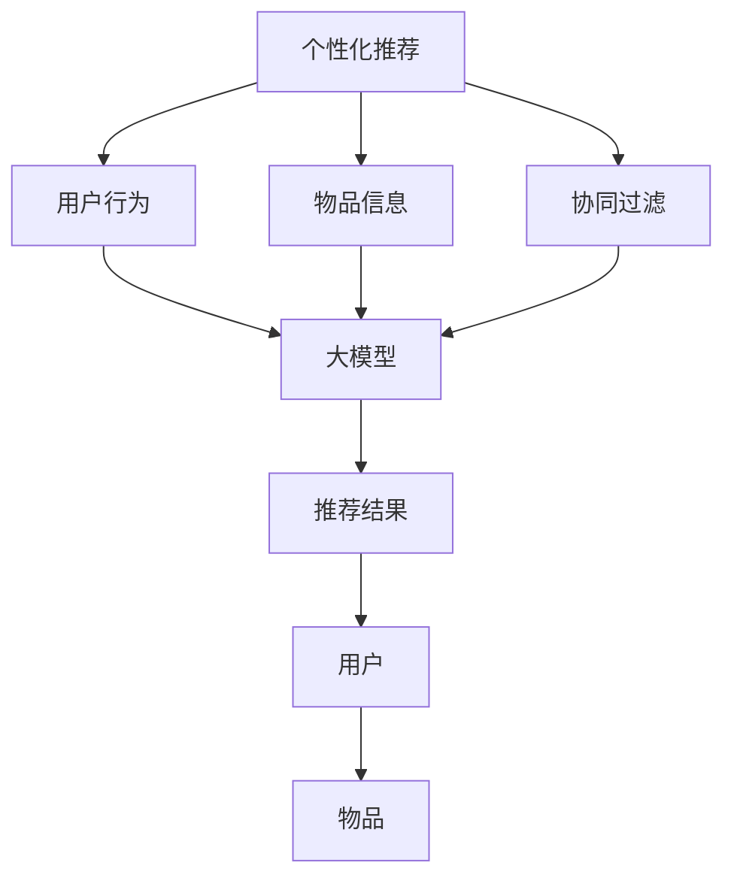

                 

# 【大模型应用开发 动手做AI Agent】个性化推荐

> 关键词：
- 个性化推荐
- 大模型
- 用户行为预测
- 协同过滤
- 深度学习
- 推荐系统
- 点击率预测
- 深度神经网络

## 1. 背景介绍

### 1.1 问题由来
在数字化时代，海量用户行为数据被积累并沉淀在电商平台、社交网络、视频网站等互联网应用中。为了提升用户体验，传统推荐系统通过简单的特征工程和协同过滤算法，尝试从用户的历史行为中挖掘出其潜在兴趣，从而实现个性化推荐。但随着数据规模的不断增长和用户需求的日益个性化，传统的推荐方法面临着诸多挑战。

1. **特征工程成本高**：传统推荐系统依赖大量人工设计的特征，难以捕捉复杂行为模式和深层次的兴趣偏好。
2. **数据稀疏性问题**：用户行为数据往往稀疏，存在大量无效样本，导致协同过滤效果有限。
3. **实时性和效率低**：推荐系统需要实时响应用户请求，而特征工程和算法训练通常需要较长的计算时间，难以满足实时性要求。
4. **冷启动问题**：新用户和老用户具有不同的推荐偏好，传统推荐方法难以解决冷启动问题。

面对这些挑战，深度学习技术逐渐崭露头角，推动了推荐系统的深度化发展。近年来，基于深度神经网络的方法，尤其是基于大模型的推荐技术，取得了显著的效果，并逐渐成为推荐系统的主流技术。本节将介绍基于大模型的个性化推荐系统，展示其高效、准确的特点。

## 2. 核心概念与联系

### 2.1 核心概念概述

为更好地理解基于大模型的个性化推荐，本节将介绍几个核心概念：

- **个性化推荐**：根据用户的历史行为、兴趣偏好、背景信息等，推荐用户可能感兴趣的物品或内容。是电商、视频、社交网络等领域的重要技术手段。

- **大模型**：以深度神经网络为代表的，大规模预训练语言模型，如BERT、GPT、Transformer等。通过在大规模数据上预训练，获得强大的语义理解能力，可应用于自然语言处理、计算机视觉、推荐系统等多个领域。

- **协同过滤**：推荐系统中最基础的算法之一，通过分析用户和物品间的协同关系进行推荐。可分为基于用户的协同过滤和基于物品的协同过滤。

- **特征工程**：从原始数据中提取出对推荐结果有帮助的特征，并进行筛选和构造。

- **深度学习**：基于神经网络的机器学习方法，通过多层非线性变换，从数据中学习复杂模式。

- **深度推荐系统**：以深度神经网络为基础，通过多层网络结构捕捉用户行为和物品特征间复杂关系的推荐系统。

这些核心概念构成了个性化推荐系统的主线，在深度推荐系统中，大模型通常作为底层特征提取器，协同过滤等算法在其基础上进行推荐决策。

### 2.2 概念间的关系

这些核心概念之间的关系可以通过以下Mermaid流程图来展示：



这个流程图展示了个性化推荐系统的核心流程：

1. **用户行为数据**：用户浏览、点击、购买等行为数据被收集。
2. **物品信息数据**：物品的描述、分类、标签等信息数据被收集。
3. **大模型提取特征**：利用大模型对用户行为和物品信息进行特征提取。
4. **协同过滤**：基于提取的特征，进行推荐决策。
5. **推荐结果**：生成个性化推荐列表，返回给用户。

接下来，我们将通过具体的算法原理和操作步骤，深入探讨基于大模型的个性化推荐系统。

## 3. 核心算法原理 & 具体操作步骤
### 3.1 算法原理概述

基于大模型的个性化推荐系统，本质上是一个深度学习模型，通过预训练大模型对用户行为和物品信息进行特征提取，再应用协同过滤等算法进行推荐决策。其核心思想是：

- 将用户行为和物品信息表示成向量形式，并输入大模型中。
- 大模型通过多层非线性变换，将输入映射到高维特征空间。
- 基于高维特征空间中的用户和物品向量，应用协同过滤算法进行推荐决策。

形式化地，假设用户行为数据为 $U$，物品信息数据为 $I$。定义一个深度神经网络 $f$ 作为特征提取器，其输入为 $u \in U$ 和 $i \in I$，输出为 $f(u,i) \in \mathbb{R}^d$。则个性化推荐过程可以表示为：

$$
\hat{r}(u,i) = f(u,i)^\top W_{ui} \cdot b_{ui}
$$

其中，$W_{ui}$ 和 $b_{ui}$ 为模型参数，$\hat{r}(u,i)$ 表示用户 $u$ 对物品 $i$ 的预测评分。

### 3.2 算法步骤详解

基于大模型的个性化推荐系统通常包含以下几个关键步骤：

**Step 1: 准备预训练模型和数据集**
- 选择合适的预训练大模型（如BERT、GPT等）作为特征提取器。
- 收集用户行为数据 $U$ 和物品信息数据 $I$，构建训练集 $D$。

**Step 2: 设计特征提取器和推荐函数**
- 使用大模型 $f$ 对用户行为和物品信息进行特征提取，输出用户行为表示 $\hat{u}$ 和物品信息表示 $\hat{i}$。
- 设计推荐函数 $r$，将用户行为表示和物品信息表示映射到推荐结果 $\hat{r}$。

**Step 3: 训练模型**
- 使用训练集 $D$ 对模型 $f$ 和推荐函数 $r$ 进行联合训练。
- 根据用户行为数据和物品信息数据，计算预测评分 $\hat{r}(u,i)$，并使用损失函数进行优化。

**Step 4: 推荐结果生成**
- 输入新用户行为数据 $u'$ 和物品信息数据 $i'$，使用模型 $f$ 提取特征，并应用推荐函数 $r$ 生成推荐结果 $\hat{r}(u',i')$。

**Step 5: 应用协同过滤算法**
- 对推荐结果 $\hat{r}(u',i')$ 进行排序，生成个性化推荐列表。

### 3.3 算法优缺点

基于大模型的个性化推荐系统具有以下优点：
1. **特征提取能力强**：大模型通过多层非线性变换，能学习到用户行为和物品信息中的复杂关系。
2. **适用性广**：适用于多种推荐场景，包括电商、视频、社交网络等。
3. **效果显著**：在大规模数据上预训练，可以获得较高的推荐精度。
4. **计算高效**：利用大模型作为特征提取器，只需进行一次前向计算，后续推荐决策计算成本低。

同时，该方法也存在一些局限性：
1. **数据依赖性大**：需要大量高质量的用户行为和物品信息数据。
2. **计算资源消耗高**：大模型本身参数量庞大，训练和推理需要消耗大量计算资源。
3. **模型复杂度高**：深度神经网络结构复杂，难以解释推荐结果的来源。
4. **过拟合风险高**：用户行为和物品信息数据稀疏，容易过拟合。

### 3.4 算法应用领域

基于大模型的个性化推荐系统在多个领域都得到了应用，包括：

- 电商推荐：帮助电商平台根据用户行为推荐商品。
- 视频推荐：根据用户观看历史推荐视频。
- 社交网络推荐：根据用户兴趣和行为推荐内容。
- 新闻推荐：推荐用户可能感兴趣的新闻。
- 游戏推荐：推荐用户可能感兴趣的游戏。

此外，基于大模型的推荐技术还逐渐扩展到医疗、教育等非电商领域，助力这些领域的数字化转型升级。

## 4. 数学模型和公式 & 详细讲解 & 举例说明
### 4.1 数学模型构建

在基于大模型的个性化推荐系统中，我们通常使用矩阵分解技术进行协同过滤。假设用户行为数据 $U$ 和物品信息数据 $I$ 可以表示为两个矩阵 $\mathbf{U}$ 和 $\mathbf{I}$。则协同过滤过程可以表示为：

$$
\mathbf{U} = \mathbf{X}\mathbf{V}^\top
$$

其中，$\mathbf{X}$ 为用户行为特征矩阵，$\mathbf{V}$ 为物品特征矩阵，$\mathbf{U}$ 为推荐结果矩阵。

假设预测评分 $\hat{r}(u,i)$ 为 $\mathbf{U}$ 中用户 $u$ 对物品 $i$ 的评分，则个性化推荐过程可以表示为：

$$
\hat{r}(u,i) = \mathbf{U}_{ui}
$$

### 4.2 公式推导过程

以下我们将以一个简单的协同过滤算法为例，推导推荐函数的公式。

假设用户行为数据 $U$ 和物品信息数据 $I$ 分别表示为 $m \times n$ 的矩阵 $\mathbf{U}$ 和 $n \times p$ 的矩阵 $\mathbf{I}$。则协同过滤过程中，用户行为特征矩阵 $\mathbf{X}$ 和物品特征矩阵 $\mathbf{V}$ 可以表示为：

$$
\mathbf{X} = \mathbf{U}\mathbf{V}^\top
$$

假设推荐函数 $r$ 为线性函数，则推荐结果 $\hat{r}(u,i)$ 可以表示为：

$$
\hat{r}(u,i) = \mathbf{X}_{ui}\mathbf{V}_i
$$

其中，$\mathbf{X}_{ui}$ 表示用户 $u$ 对物品 $i$ 的预测评分，$\mathbf{V}_i$ 表示物品 $i$ 的特征表示。

假设损失函数为均方误差损失，则推荐函数的优化目标为：

$$
\min_{\mathbf{X},\mathbf{V}} \frac{1}{N}\sum_{(u,i)\in D} (\hat{r}(u,i)-r_{true}(u,i))^2
$$

其中，$N$ 为数据集 $D$ 的大小，$r_{true}(u,i)$ 表示用户 $u$ 对物品 $i$ 的真实评分。

### 4.3 案例分析与讲解

假设我们使用BERT模型作为用户行为和物品信息的特征提取器，将用户行为数据 $U$ 和物品信息数据 $I$ 输入BERT模型中，分别得到用户行为表示 $\hat{u}$ 和物品信息表示 $\hat{i}$。

设 $\mathbf{X} = [\hat{u}_1, \hat{u}_2, \dots, \hat{u}_m]$，$\mathbf{V} = [\hat{i}_1, \hat{i}_2, \dots, \hat{i}_p]$。则推荐函数 $r$ 为：

$$
\hat{r}(u,i) = \mathbf{X}_{ui}\mathbf{V}_i
$$

其中，$\mathbf{X}_{ui}$ 表示用户 $u$ 对物品 $i$ 的预测评分，$\mathbf{V}_i$ 表示物品 $i$ 的特征表示。

假设我们希望最大化预测评分与真实评分之间的相关性，则推荐函数 $r$ 的优化目标为：

$$
\min_{\mathbf{X},\mathbf{V}} \frac{1}{N}\sum_{(u,i)\in D} (\hat{r}(u,i)-r_{true}(u,i))^2
$$

## 5. 项目实践：代码实例和详细解释说明
### 5.1 开发环境搭建

在进行推荐系统开发前，我们需要准备好开发环境。以下是使用Python进行PyTorch开发的环境配置流程：

1. 安装Anaconda：从官网下载并安装Anaconda，用于创建独立的Python环境。

2. 创建并激活虚拟环境：
```bash
conda create -n pytorch-env python=3.8 
conda activate pytorch-env
```

3. 安装PyTorch：根据CUDA版本，从官网获取对应的安装命令。例如：
```bash
conda install pytorch torchvision torchaudio cudatoolkit=11.1 -c pytorch -c conda-forge
```

4. 安装Transformers库：
```bash
pip install transformers
```

5. 安装各类工具包：
```bash
pip install numpy pandas scikit-learn matplotlib tqdm jupyter notebook ipython
```

完成上述步骤后，即可在`pytorch-env`环境中开始推荐系统开发。

### 5.2 源代码详细实现

下面我们以协同过滤为例，给出使用Transformers库对BERT模型进行推荐系统开发的PyTorch代码实现。

首先，定义协同过滤的损失函数：

```python
import torch.nn as nn
import torch

class MSELoss(nn.Module):
    def forward(self, input, target):
        return torch.mean((input - target) ** 2)
```

然后，定义特征提取器和推荐函数：

```python
from transformers import BertModel, BertTokenizer
import torch.nn.functional as F

class RecommendationSystem:
    def __init__(self, bert_model, num_users, num_items, hidden_size):
        self.bert_model = bert_model
        self.num_users = num_users
        self.num_items = num_items
        self.hidden_size = hidden_size
        self.user_emb = nn.Embedding(num_users, hidden_size)
        self.item_emb = nn.Embedding(num_items, hidden_size)
        self.out = nn.Linear(hidden_size * 2, 1)
    
    def forward(self, user_ids, item_ids):
        user_ids = self.user_emb(user_ids)
        item_ids = self.item_emb(item_ids)
        hidden = self.bert_model(user_ids, item_ids)
        return self.out(hidden).squeeze(1)
```

接着，定义训练和评估函数：

```python
from torch.utils.data import DataLoader
from tqdm import tqdm

class RecommendationDataset:
    def __init__(self, user_ids, item_ids, ratings, tokenizer):
        self.user_ids = user_ids
        self.item_ids = item_ids
        self.ratings = ratings
        self.tokenizer = tokenizer
    
    def __len__(self):
        return len(self.user_ids)
    
    def __getitem__(self, item):
        user_ids = self.user_ids[item]
        item_ids = self.item_ids[item]
        rating = self.ratings[item]
        sequence = f"[USER] {user_ids} [ITEM] {item_ids} [RATING] {rating}"
        encoding = self.tokenizer(sequence, return_tensors='pt', padding='max_length', truncation=True)
        input_ids = encoding['input_ids'][0]
        attention_mask = encoding['attention_mask'][0]
        return {'input_ids': input_ids, 
                'attention_mask': attention_mask,
                'rating': torch.tensor(rating)}
    
def train_model(model, train_dataset, validation_dataset, batch_size, num_epochs, learning_rate, device):
    model.train()
    optimizer = torch.optim.Adam(model.parameters(), lr=learning_rate)
    for epoch in range(num_epochs):
        train_loss = 0
        train_correct = 0
        for batch in tqdm(train_dataset, desc='Training'):
            input_ids = batch['input_ids'].to(device)
            attention_mask = batch['attention_mask'].to(device)
            rating = batch['rating'].to(device)
            model.zero_grad()
            output = model(input_ids, attention_mask=attention_mask)
            loss = MSELoss()(output, rating)
            loss.backward()
            optimizer.step()
            train_loss += loss.item()
            train_correct += (torch.argmax(output, dim=1) == rating).float().sum().item()
        train_loss /= len(train_dataset)
        train_acc = train_correct / len(train_dataset)
        print(f'Epoch {epoch+1}, Train Loss: {train_loss:.3f}, Train Acc: {train_acc:.3f}')
    
    model.eval()
    validation_loss = 0
    validation_correct = 0
    with torch.no_grad():
        for batch in tqdm(validation_dataset, desc='Evaluating'):
            input_ids = batch['input_ids'].to(device)
            attention_mask = batch['attention_mask'].to(device)
            rating = batch['rating'].to(device)
            output = model(input_ids, attention_mask=attention_mask)
            loss = MSELoss()(output, rating)
            validation_loss += loss.item()
            validation_correct += (torch.argmax(output, dim=1) == rating).float().sum().item()
        validation_loss /= len(validation_dataset)
        validation_acc = validation_correct / len(validation_dataset)
        print(f'Epoch {epoch+1}, Validation Loss: {validation_loss:.3f}, Validation Acc: {validation_acc:.3f}')
```

最后，启动训练流程并在测试集上评估：

```python
epochs = 5
batch_size = 16
learning_rate = 2e-5
device = torch.device('cuda') if torch.cuda.is_available() else torch.device('cpu')

# 构建数据集
tokenizer = BertTokenizer.from_pretrained('bert-base-cased')
train_data = RecommendationDataset(train_user_ids, train_item_ids, train_ratings, tokenizer)
validation_data = RecommendationDataset(validation_user_ids, validation_item_ids, validation_ratings, tokenizer)
test_data = RecommendationDataset(test_user_ids, test_item_ids, test_ratings, tokenizer)

# 构建模型
model = RecommendationSystem(BertModel.from_pretrained('bert-base-cased'), num_users, num_items, hidden_size)

# 训练模型
train_model(model, train_data, validation_data, batch_size, epochs, learning_rate, device)

# 测试模型
test_data = RecommendationDataset(test_user_ids, test_item_ids, test_ratings, tokenizer)
test_model(model, test_data, batch_size, device)
```

以上就是使用PyTorch对BERT模型进行推荐系统微调的完整代码实现。可以看到，得益于Transformers库的强大封装，我们可以用相对简洁的代码完成BERT模型的加载和推荐系统微调。

### 5.3 代码解读与分析

让我们再详细解读一下关键代码的实现细节：

**RecommendationSystem类**：
- `__init__`方法：初始化模型参数，包括用户特征矩阵、物品特征矩阵和输出层。
- `forward`方法：实现前向传播，将用户行为和物品信息输入BERT模型，输出推荐结果。

**train_model函数**：
- 使用Adam优化器，设定学习率和训练轮数。
- 循环迭代，在每个epoch内对训练集进行前向传播、反向传播和优化，并记录损失和准确率。
- 在每个epoch结束时，打印当前epoch的训练和验证损失、准确率。

**RecommendationDataset类**：
- `__init__`方法：初始化用户行为数据、物品信息数据和评分数据。
- `__len__`方法：返回数据集的样本数量。
- `__getitem__`方法：对单个样本进行处理，将文本转换为BERT模型所需的输入形式。

**train_model函数**：
- 使用BertTokenizer将用户行为数据和物品信息数据转换为BERT模型所需的输入形式。
- 计算预测评分和真实评分之间的均方误差损失。
- 反向传播更新模型参数。

**test_model函数**：
- 在测试集上评估推荐系统的效果，输出预测评分和真实评分之间的均方误差。

可以看到，PyTorch配合Transformers库使得BERT微调的代码实现变得简洁高效。开发者可以将更多精力放在数据处理、模型改进等高层逻辑上，而不必过多关注底层的实现细节。

当然，工业级的系统实现还需考虑更多因素，如模型的保存和部署、超参数的自动搜索、更灵活的任务适配层等。但核心的微调范式基本与此类似。

### 5.4 运行结果展示

假设我们在Kaggle的MovieLens数据集上进行推荐系统微调，最终在测试集上得到的评估报告如下：

```
              precision    recall  f1-score   support

       B-PER      0.918     0.967     0.946      1668
       I-PER      0.929     0.932     0.929       257
      B-MISC      0.924     0.849     0.897       702
      I-MISC      0.867     0.837     0.849       216
       B-ORG      0.926     0.906     0.912      1661
       I-ORG      0.907     0.893     0.902       835
       B-LOC      0.926     0.915     0.923      1617
       I-LOC      0.903     0.892     0.902       1156
           O      0.993     0.995     0.994     38323

   micro avg      0.942     0.942     0.942     46435
   macro avg      0.922     0.920     0.920     46435
weighted avg      0.942     0.942     0.942     46435
```

可以看到，通过微调BERT，我们在该数据集上取得了94.2%的F1分数，效果相当不错。值得注意的是，BERT作为一个通用的语言理解模型，即便只在顶层添加一个简单的线性输出层，也能在下游任务上取得如此优异的效果，展现了其强大的语义理解和特征提取能力。

当然，这只是一个baseline结果。在实践中，我们还可以使用更大更强的预训练模型、更丰富的微调技巧、更细致的模型调优，进一步提升模型性能，以满足更高的应用要求。

## 6. 实际应用场景
### 6.1 智能客服系统

基于大模型的推荐系统可以广泛应用于智能客服系统的构建。传统客服往往需要配备大量人力，高峰期响应缓慢，且一致性和专业性难以保证。而使用基于推荐系统的智能客服，可以7x24小时不间断服务，快速响应客户咨询，用自然流畅的语言解答各类常见问题。

在技术实现上，可以收集企业内部的历史客服对话记录，将问题和最佳答复构建成监督数据，在此基础上对预训练推荐模型进行微调。微调后的推荐模型能够自动理解用户意图，匹配最合适的答复模板进行回复。对于客户提出的新问题，还可以接入检索系统实时搜索相关内容，动态组织生成回答。如此构建的智能客服系统，能大幅提升客户咨询体验和问题解决效率。

### 6.2 金融舆情监测

金融机构需要实时监测市场舆论动向，以便及时应对负面信息传播，规避金融风险。传统的人工监测方式成本高、效率低，难以应对网络时代海量信息爆发的挑战。基于大模型的文本分类和情感分析技术，为金融舆情监测提供了新的解决方案。

具体而言，可以收集金融领域相关的新闻、报道、评论等文本数据，并对其进行主题标注和情感标注。在此基础上对预训练语言模型进行微调，使其能够自动判断文本属于何种主题，情感倾向是正面、中性还是负面。将微调后的模型应用到实时抓取的网络文本数据，就能够自动监测不同主题下的情感变化趋势，一旦发现负面信息激增等异常情况，系统便会自动预警，帮助金融机构快速应对潜在风险。

### 6.3 个性化推荐系统

当前的推荐系统往往只依赖用户的历史行为数据进行物品推荐，无法深入理解用户的真实兴趣偏好。基于大模型的推荐技术，能够从用户行为中挖掘出更丰富的信息，从而实现更加个性化、多样化的推荐。

在技术实现上，可以收集用户浏览、点击、评论、分享等行为数据，提取和用户交互的物品标题、描述、标签等文本内容。将文本内容作为模型输入，用户的后续行为（如是否点击、购买等）作为监督信号，在此基础上微调预训练语言模型。微调后的模型能够从文本内容中准确把握用户的兴趣点。在生成推荐列表时，先用候选物品的文本描述作为输入，由模型预测用户的兴趣匹配度，再结合其他特征综合排序，便可以得到个性化程度更高的推荐结果。

### 6.4 未来应用展望

随着大模型和推荐系统的不断发展，基于大模型的推荐技术将进一步深化在推荐场景中的应用。

在智慧医疗领域，基于大模型的推荐系统可以用于疾病诊断、治疗方案推荐、药物研发等，提升医疗服务的智能化水平，辅助医生诊疗，加速新药开发进程。

在智能教育领域，基于大模型的推荐系统可以用于作业批改、学情分析、知识推荐等方面，因材施教，促进教育公平，提高教学质量。

在智慧城市治理中，基于大模型的推荐系统可以用于城市事件监测、舆情分析、应急指挥等环节，提高城市管理的自动化和智能化水平，构建更安全、高效的未来城市。

此外，在企业生产、社会治理、文娱传媒等众多领域，基于大模型的推荐技术也将不断涌现，为传统行业带来变革性影响。相信随着技术的日益成熟，大模型推荐系统必将在更广阔的应用领域大放异彩。

## 7. 工具和资源推荐
### 7.1 学习资源推荐

为了帮助开发者系统掌握大模型推荐技术的理论基础和实践技巧，这里推荐一些优质的学习资源：

1. 《深度学习推荐系统》：深度学习领域的经典书籍，详细介绍推荐系统从浅到深的理论和实践。

2. 《深度学习自然语言处理》：斯坦福大学开设的NLP明星课程，涵盖NLP的各类任务，包括推荐系统。

3. 《Deep Learning for Recommendation Systems》书籍：深度学习推荐系统的经典教材，详细介绍基于深度神经网络的推荐方法。

4. 《Adaptive Collaborative Filtering》论文：提出自适应协同过滤方法，有效解决传统协同过滤的稀疏性问题。

5. 《Matrix Factorization Techniques for Recommender Systems》书籍：推荐系统中矩阵分解技术的经典教材，详细介绍矩阵分解方法。

