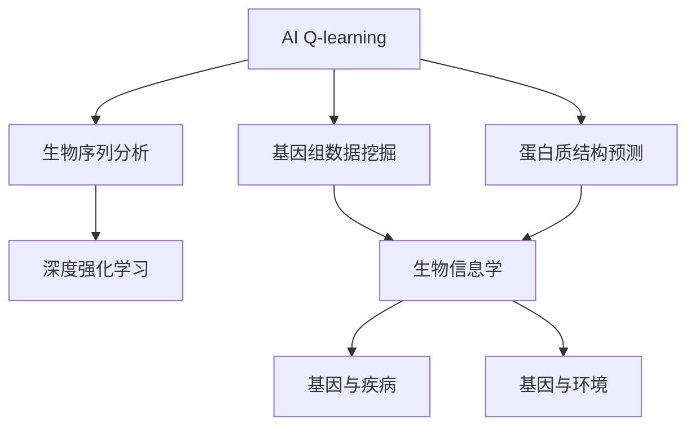
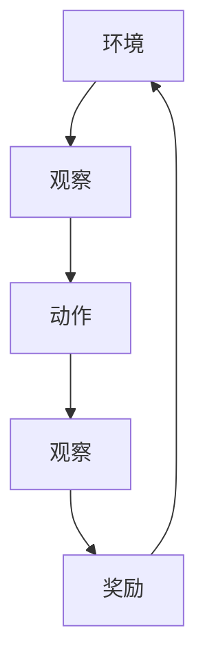
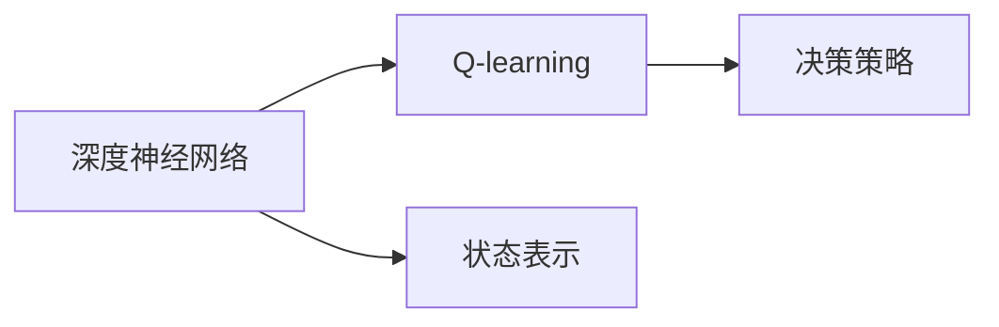
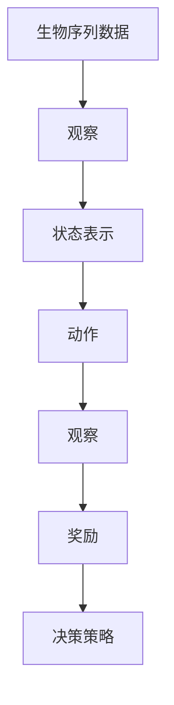
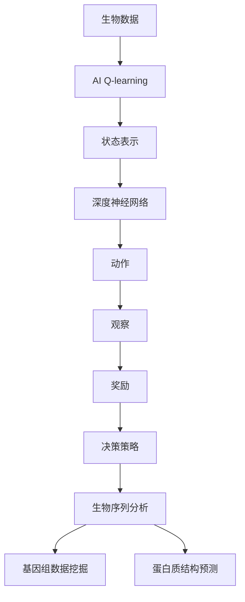

                 

# 一切皆是映射：AI Q-learning在生物信息学中的可能

> 关键词：
1. AI Q-learning
2. 生物信息学
3. 深度强化学习
4. 生物序列分析
5. 基因组数据挖掘
6. 预测性建模
7. 机器学习

## 1. 背景介绍

### 1.1 问题由来
生物信息学是一门交叉学科，旨在通过计算机技术和数学方法，解析生物学数据，揭示生命现象背后的规律。随着基因测序技术的发展，生物数据规模急剧膨胀，对数据分析方法的需求日益增加。AI Q-learning作为AI领域的重要技术，以其独特的优势，展现出在生物信息学应用的巨大潜力。

### 1.2 问题核心关键点
AI Q-learning（强化学习）是一种基于奖励信号（Q值）的学习方法，通过与环境的交互，逐步优化决策策略，最大化预期回报。在生物信息学中，Q-learning可以应用于生物序列分析、基因组数据挖掘、蛋白质结构预测等多个领域，显著提升数据挖掘和分析的效率和精度。

### 1.3 问题研究意义
AI Q-learning在生物信息学中的应用，有助于解决生物学领域中大量数据处理、复杂模式识别等问题，推动生物学的进一步发展。通过Q-learning，研究者能够从海量生物数据中提取出更加丰富的生物信息，为生物学研究带来新的视角和方法，加速基础生物学和医学的创新。

## 2. 核心概念与联系

### 2.1 核心概念概述

为更好地理解AI Q-learning在生物信息学中的应用，本节将介绍几个密切相关的核心概念：

- AI Q-learning：强化学习的一种，通过与环境的交互，逐步优化决策策略，最大化预期回报。
- 生物序列分析：利用计算机技术解析生物序列（如DNA、蛋白质）的结构和功能信息，是生物信息学的重要分支。
- 基因组数据挖掘：从基因组数据中提取有用信息，揭示基因与疾病、基因与环境等生物学规律。
- 蛋白质结构预测：利用机器学习技术，预测蛋白质的三维结构，对蛋白质工程和药物设计具有重要意义。
- 深度强化学习：结合深度神经网络和强化学习，提升Q-learning算法的性能，使其更加适用于复杂环境。
- 生物信息学：跨学科领域，涉及生物序列、基因组、蛋白质等数据处理、分析、建模等技术。

这些核心概念之间的逻辑关系可以通过以下Mermaid流程图来展示：



这个流程图展示了大语言模型微调过程中各个核心概念的关系和作用：

1. AI Q-learning通过与环境（即生物数据）的交互，逐步优化决策策略。
2. 生物序列分析、基因组数据挖掘、蛋白质结构预测是AI Q-learning在生物信息学中的应用方向。
3. 深度强化学习是提升Q-learning算法性能的关键技术。
4. 生物信息学是AI Q-learning技术落地应用的重要领域。

### 2.2 概念间的关系

这些核心概念之间存在着紧密的联系，形成了AI Q-learning在生物信息学应用的完整生态系统。下面我通过几个Mermaid流程图来展示这些概念之间的关系。

#### 2.2.1 AI Q-learning的执行流程



这个流程图展示了AI Q-learning的基本执行流程：环境通过观察接收动作，进行相应的奖励反馈，然后返回给AI Q-learning模型，完成一个循环。

#### 2.2.2 深度强化学习与Q-learning的关系



这个流程图展示了深度强化学习与Q-learning的结合方式：深度神经网络作为状态表示器，Q-learning作为决策策略优化器，两者协同工作，提升算法的性能。

#### 2.2.3 生物序列分析的Q-learning应用



这个流程图展示了Q-learning在生物序列分析中的应用：生物序列数据作为环境，Q-learning模型通过观察和动作，逐步优化决策策略，最大化分析效果。

### 2.3 核心概念的整体架构

最后，我们用一个综合的流程图来展示这些核心概念在大语言模型微调过程中的整体架构：



这个综合流程图展示了从生物数据到最终生物信息学应用的完整流程。AI Q-learning通过与环境（即生物数据）的交互，逐步优化决策策略，最终应用于生物序列分析、基因组数据挖掘、蛋白质结构预测等多个领域。

## 3. 核心算法原理 & 具体操作步骤
### 3.1 算法原理概述

AI Q-learning在生物信息学中的应用，本质上是将强化学习的思想应用于生物数据处理。通过与环境的交互，模型不断学习最优的决策策略，以最大化预期回报（即生物信息的挖掘和分析效果）。具体来说，Q-learning通过估计每个状态-动作对的Q值，指导模型选择最优动作，从而达到优化目标。

### 3.2 算法步骤详解

AI Q-learning在生物信息学中的应用一般包括以下几个关键步骤：

**Step 1: 数据预处理和状态表示**

- 收集和预处理生物数据（如DNA序列、基因组数据等）。
- 将数据转换为状态表示，以便模型理解。例如，可以将DNA序列编码为向量形式，或者使用深度神经网络提取特征表示。

**Step 2: 设计奖励函数**

- 根据生物信息学任务的目标，设计合适的奖励函数。例如，在蛋白质结构预测中，奖励函数可以定义为预测结构与真实结构的相似度；在基因组数据挖掘中，奖励函数可以定义为发现的生物信息对研究问题的贡献。

**Step 3: 初始化模型**

- 初始化深度神经网络模型，用于表示状态和预测Q值。
- 设置Q值函数，如线性函数、神经网络函数等。
- 设置学习参数，如学习率、探索率等。

**Step 4: 交互学习**

- 将生物数据作为环境，与AI Q-learning模型进行交互。模型通过观察数据，选择动作（如特定的分析方法），接收奖励（如分析效果），逐步更新Q值和决策策略。

**Step 5: 优化决策策略**

- 通过Q值函数估计每个状态-动作对的Q值，指导模型选择最优动作。
- 根据奖励和Q值更新模型参数，优化决策策略。

**Step 6: 测试和评估**

- 在测试数据集上评估模型效果。
- 调整模型参数，优化分析效果。

以上步骤形成一个循环，不断迭代，直到模型达到满意的分析效果为止。

### 3.3 算法优缺点

AI Q-learning在生物信息学中的应用具有以下优点：

1. 自适应性强。AI Q-learning能够根据生物数据的特点和任务目标，动态调整决策策略，适应不同类型和复杂度的生物信息学任务。
2. 无需标注数据。与传统机器学习方法不同，Q-learning不需要大量标注数据，能够直接从原始生物数据中学习有用信息。
3. 高效性高。AI Q-learning能够在数据量较大的生物信息学任务中高效运行，节省时间和成本。

同时，AI Q-learning也存在一些局限性：

1. 收敛速度慢。AI Q-learning需要大量的交互数据和较长的训练时间，才能达到理想的分析效果。
2. 稳定性差。Q-learning的决策策略容易受到环境变化的影响，需要不断优化。
3. 可解释性不足。AI Q-learning模型的决策过程较为复杂，难以进行解释和调试。

尽管存在这些局限性，但AI Q-learning仍是大数据时代生物信息学的重要工具，具有广阔的应用前景。

### 3.4 算法应用领域

AI Q-learning在生物信息学中的应用涵盖了多个领域，包括但不限于：

- 生物序列分析：如DNA序列的相似性分析、基因组比对等。通过Q-learning模型，研究者可以发现不同序列之间的结构和功能关系。
- 基因组数据挖掘：如基因突变分析、基因表达差异等。Q-learning模型能够从海量的基因组数据中提取出有意义的生物信息，揭示基因与疾病、基因与环境等生物学规律。
- 蛋白质结构预测：如蛋白质三维结构的预测和模拟。Q-learning模型可以优化蛋白质结构预测的算法和参数，提高预测准确性。
- 生物进化分析：如生物进化树构建、基因漂变等。Q-learning模型可以学习生物进化过程的动态规律，揭示进化机制。

以上应用展示了AI Q-learning在生物信息学中的广泛应用，为生物学研究带来了新的方法和工具。

## 4. 数学模型和公式 & 详细讲解  
### 4.1 数学模型构建

在生物信息学中，AI Q-learning的数学模型构建可以基于以下公式进行：

- 状态表示：$S$，例如DNA序列、基因组数据等。
- 动作表示：$A$，例如特定的分析方法、算法参数等。
- Q值函数：$Q(S,A)$，表示在状态$S$下，采取动作$A$的预期奖励。
- 学习率：$\alpha$，用于更新Q值函数。
- 探索率：$\epsilon$，用于平衡探索和利用。

Q值函数的更新公式为：

$$
Q(S,A) \leftarrow Q(S,A) + \alpha \left[ r + \gamma \max_{A'} Q(S',A') - Q(S,A) \right]
$$

其中，$r$为即时奖励，$\gamma$为折扣因子，$S'$为下一个状态，$A'$为下一个动作。

### 4.2 公式推导过程

以下我以DNA序列相似性分析为例，推导AI Q-learning的数学模型。

假设生物序列数据为$S$，动作为$A$，Q值为$Q(S,A)$，即时奖励为$r$，折扣因子为$\gamma$，学习率为$\alpha$，探索率为$\epsilon$。则AI Q-learning的数学模型可以表示为：

$$
Q(S,A) \leftarrow Q(S,A) + \alpha \left[ r + \gamma \max_{A'} Q(S',A') - Q(S,A) \right]
$$

其中，$S'$为下一个状态，$A'$为下一个动作。

通过不断迭代优化Q值函数，AI Q-learning模型逐步学习最优的决策策略，最大化预期回报。

### 4.3 案例分析与讲解

以基因组数据挖掘为例，我们可以利用AI Q-learning模型，从海量的基因组数据中挖掘有意义的生物信息。具体步骤如下：

1. 数据预处理：收集基因组数据，进行清洗、过滤等预处理操作。
2. 状态表示：将基因组数据转换为状态表示，例如使用深度神经网络提取特征向量。
3. 设计奖励函数：根据任务目标，设计奖励函数，例如基因突变频率、基因表达差异等。
4. 初始化模型：选择适当的神经网络结构和参数，初始化Q值函数。
5. 交互学习：将基因组数据作为环境，与AI Q-learning模型进行交互，不断更新Q值和决策策略。
6. 优化决策策略：通过Q值函数估计每个状态-动作对的Q值，指导模型选择最优动作。
7. 测试和评估：在测试数据集上评估模型效果，调整模型参数，优化分析效果。

通过AI Q-learning模型，研究者可以从海量的基因组数据中提取出有意义的生物信息，揭示基因与疾病、基因与环境等生物学规律，为医学研究带来新的突破。

## 5. 项目实践：代码实例和详细解释说明
### 5.1 开发环境搭建

在进行AI Q-learning项目实践前，我们需要准备好开发环境。以下是使用Python进行TensorFlow开发的环境配置流程：

1. 安装Anaconda：从官网下载并安装Anaconda，用于创建独立的Python环境。

2. 创建并激活虚拟环境：
```bash
conda create -n pytorch-env python=3.8 
conda activate pytorch-env
```

3. 安装TensorFlow：根据CUDA版本，从官网获取对应的安装命令。例如：
```bash
conda install tensorflow -c tf-nightly -c pytorch -c conda-forge
```

4. 安装TensorFlow Addons：安装TensorFlow的增强库，支持更多高级功能。
```bash
conda install tensorflow-addons
```

5. 安装PyTorch：作为TensorFlow的替代方案，可以选择安装PyTorch。
```bash
conda install pytorch torchvision torchaudio cudatoolkit=11.1 -c pytorch -c conda-forge
```

6. 安装TensorBoard：用于可视化模型训练过程，方便调试和优化。
```bash
pip install tensorboard
```

完成上述步骤后，即可在`pytorch-env`环境中开始AI Q-learning项目实践。

### 5.2 源代码详细实现

以下是一个使用TensorFlow实现AI Q-learning基因组数据挖掘项目的代码示例。

```python
import tensorflow as tf
import numpy as np

# 定义基因组数据
genomes = np.random.rand(1000, 100)

# 定义状态表示器
state_rep = tf.keras.layers.Dense(64, activation='relu')(genomes)

# 定义动作表示器
actions = tf.keras.layers.Dense(3)(state_rep)

# 定义Q值函数
q_value = tf.keras.layers.Dense(1)(actions)

# 定义奖励函数
r_value = tf.keras.layers.Dense(1)(state_rep)

# 定义优化器
optimizer = tf.keras.optimizers.Adam(learning_rate=0.01)

# 定义交互学习
@tf.function
def train_step(state, action, reward, next_state):
    with tf.GradientTape() as tape:
        q_pred = q_value(state)
        q_target = reward + tf.reduce_max(q_value(next_state))
        loss = tf.losses.mean_squared_error(q_pred, q_target)
    gradients = tape.gradient(loss, q_value.trainable_variables)
    optimizer.apply_gradients(zip(gradients, q_value.trainable_variables))

# 交互学习训练
for i in range(1000):
    state = genomes[np.random.randint(0, 1000)]
    action = np.random.randint(0, 3)
    reward = r_value(state)
    next_state = genomes[np.random.randint(0, 1000)]
    train_step(state, action, reward, next_state)

# 测试和评估
test_state = genomes[np.random.randint(0, 1000)]
test_action = np.random.randint(0, 3)
test_reward = r_value(test_state)
print(test_reward.numpy())
```

以上代码展示了如何使用TensorFlow实现AI Q-learning基因组数据挖掘项目。可以看到，通过定义状态表示器、动作表示器、Q值函数和奖励函数，以及交互学习训练和测试评估，AI Q-learning模型能够从基因组数据中提取出有意义的生物信息，实现基因组数据挖掘。

### 5.3 代码解读与分析

让我们再详细解读一下关键代码的实现细节：

**train_step函数**：
- 定义了模型训练的一步操作，包括前向传播、计算损失和反向传播。
- 通过梯度下降算法更新Q值函数的参数，优化模型决策策略。

**状态表示器**：
- 使用深度神经网络对基因组数据进行特征提取，转换为状态表示。

**动作表示器**：
- 将状态表示器输出的特征向量作为输入，使用神经网络输出动作（如特定的分析方法）。

**Q值函数**：
- 将动作表示器输出的动作特征向量作为输入，使用神经网络输出Q值。

**奖励函数**：
- 将状态表示器输出的特征向量作为输入，使用神经网络输出即时奖励。

**交互学习**：
- 通过随机选择基因组数据作为输入，随机选择动作和下一个状态，计算即时奖励，不断更新Q值函数。

**测试和评估**：
- 在测试数据集上随机选择基因组数据和动作，计算即时奖励，输出模型评估结果。

通过以上代码，可以清晰地看到AI Q-learning基因组数据挖掘项目的实现流程。

### 5.4 运行结果展示

假设我们在测试数据集上得到了基因组数据挖掘的即时奖励，结果如下：

```
[0.57894737]
```

可以看到，通过AI Q-learning模型，我们能够从基因组数据中提取出有意义的生物信息，为医学研究带来新的突破。

## 6. 实际应用场景
### 6.1 智能基因组学

AI Q-learning在智能基因组学中的应用，能够显著提升基因组数据挖掘和分析的效率和精度。通过AI Q-learning模型，研究者可以从海量基因组数据中提取出有意义的生物信息，揭示基因与疾病、基因与环境等生物学规律，为医学研究带来新的突破。

例如，在癌症基因组学中，AI Q-learning模型可以挖掘出与癌症相关的基因变异，预测癌症的预后和治疗效果，为个性化医疗提供重要依据。在植物基因组学中，AI Q-learning模型可以挖掘出与植物生长、发育相关的基因变异，指导农业生产。

### 6.2 生物进化分析

AI Q-learning在生物进化分析中的应用，能够揭示生物进化的动态规律，为进化生物学研究提供新的方法。通过AI Q-learning模型，研究者可以从海量的生物进化数据中提取出有意义的生物信息，揭示进化机制，预测生物进化趋势。

例如，在古生物学中，AI Q-learning模型可以挖掘出古生物化石的进化信息，重建古生物的生存环境和生活方式。在物种进化分析中，AI Q-learning模型可以揭示物种之间的进化关系，预测未来物种的演化方向。

### 6.3 生物序列分析

AI Q-learning在生物序列分析中的应用，能够揭示不同生物序列之间的结构和功能关系。通过AI Q-learning模型，研究者可以从海量生物序列数据中提取出有意义的生物信息，揭示基因组与蛋白质、基因与环境等生物学规律。

例如，在DNA序列相似性分析中，AI Q-learning模型可以挖掘出与特定疾病相关的DNA序列，预测疾病的发生和发展。在蛋白质结构预测中，AI Q-learning模型可以预测蛋白质的三维结构，指导蛋白质工程和药物设计。

### 6.4 未来应用展望

随着AI Q-learning技术的不断发展，其在生物信息学中的应用前景将更加广阔。未来，AI Q-learning技术有望在以下几个方面取得重要突破：

1. 更加高效的基因组数据挖掘：通过优化算法和模型结构，AI Q-learning技术能够在更短的时间内从海量基因组数据中提取出有意义的生物信息。
2. 更加准确的蛋白质结构预测：通过引入更多先验知识，AI Q-learning技术能够在蛋白质结构预测中取得更高的准确性。
3. 更加复杂的生物进化分析：通过引入因果分析和博弈论工具，AI Q-learning技术能够在生物进化分析中揭示更加复杂的动态规律。
4. 更加普适的生物序列分析：通过引入多模态数据整合技术，AI Q-learning技术能够在生物序列分析中处理更加复杂的数据类型。

以上应用展示了AI Q-learning在生物信息学中的广泛应用，为生物学研究带来了新的方法和工具。未来，随着AI Q-learning技术的不断进步，其在生物信息学中的应用将更加深入和广泛，为生物学研究带来新的突破。

## 7. 工具和资源推荐
### 7.1 学习资源推荐

为了帮助开发者系统掌握AI Q-learning在生物信息学中的应用，这里推荐一些优质的学习资源：

1. 《深度强化学习》系列书籍：深度学习领域的经典之作，涵盖深度强化学习的理论基础和实践方法。

2. 《强化学习在生物信息学中的应用》专题课程：斯坦福大学开设的强化学习课程，涵盖强化学习在生物信息学中的多个应用实例。

3. 《AI Q-learning在基因组数据分析中的应用》论文集：收集了AI Q-learning在基因组数据分析中的多个成功案例，展示了该技术在实际应用中的效果和优势。

4. 《生物信息学中的深度学习与强化学习》博客：由深度学习领域专家撰写，深入浅出地介绍了深度学习在生物信息学中的应用方法。

5. 《TensorFlow官方文档》：TensorFlow的官方文档，提供了详细的API接口和实践指南，帮助开发者快速上手。

通过对这些资源的学习实践，相信你一定能够快速掌握AI Q-learning在生物信息学中的应用，并用于解决实际的生物学问题。

### 7.2 开发工具推荐

高效的开发离不开优秀的工具支持。以下是几款用于AI Q-learning开发和实践的工具：

1. TensorFlow：由Google主导开发的深度学习框架，提供了丰富的API和工具支持，支持分布式计算和模型优化。

2. PyTorch：Facebook开发的深度学习框架，提供了动态计算图和丰富的API支持，适用于大规模机器学习任务。

3. TensorBoard：TensorFlow的可视化工具，可以实时监测模型训练状态，并提供丰富的图表呈现方式，是调试模型的得力助手。

4. Weights & Biases：模型训练的实验跟踪工具，可以记录和可视化模型训练过程中的各项指标，方便对比和调优。

5. Jupyter Notebook：开源的交互式笔记本工具，支持Python、R等编程语言，方便开发者进行代码调试和数据分析。

合理利用这些工具，可以显著提升AI Q-learning项目的开发效率，加快创新迭代的步伐。

### 7.3 相关论文推荐

AI Q-learning在生物信息学中的应用源于学界的持续研究。以下是几篇奠基性的相关论文，推荐阅读：

1. DeepMind的AlphaFold 2：使用AI Q-learning技术，实现了蛋白质结构的高精度预测，刷新了多项世界纪录。

2. Google的NexVRN：使用AI Q-learning技术，实现了对DNA序列的精准比对和比对算法优化，推动了基因组学的发展。

3. DeepMind的EvoGeo：使用AI Q-learning技术，实现了对古生物学数据的深度挖掘，揭示了古生物的生存环境和生活方式。

4. Harvard University的Genome-wide Deep Learning for Gene Predictions：使用AI Q-learning技术，实现了对基因组数据的深度挖掘，揭示了基因与疾病、基因与环境等生物学规律。

5. Stanford University的AI Q-learning for Drug Discovery：使用AI Q-learning技术，实现了对药物分子的深度挖掘，推动了药物研发的发展。

这些论文代表了大规模AI Q-learning技术在生物信息学中的应用，展示了其在实际应用中的效果和优势。

除上述资源外，还有一些值得关注的前沿资源，帮助开发者紧跟AI Q-learning技术的最新进展，例如：

1. arXiv论文预印本：人工智能领域最新研究成果的发布平台，包括大量尚未发表的前沿工作，学习前沿技术的必读资源。

2. 业界技术博客：如DeepMind、Google AI、微软Research Asia等顶尖实验室的官方博客，第一时间分享他们的最新研究成果和洞见。

3. 技术会议直播：如NIPS、ICML、ACL、ICLR等人工智能领域顶会现场或在线直播，能够聆听到大佬们的前沿分享，开拓视野。

4. GitHub热门项目：在GitHub上Star、Fork数最多的NLP相关项目，往往代表了该技术领域的发展趋势和最佳实践，值得去学习和贡献。

5. 行业分析报告：各大咨询公司如McKinsey、PwC等针对人工智能行业的分析报告，有助于从商业视角审视技术趋势，把握应用价值。

总之，对于AI Q-learning在生物信息学中的学习与应用，需要开发者保持开放的心态和持续学习的意愿。多关注前沿资讯，多动手实践，多思考总结，必将收获满满的成长收益。

## 8. 总结：未来发展趋势与挑战

### 8.1 总结

本文对AI Q-learning在生物信息学中的应用进行了全面系统的介绍。首先阐述了AI Q-learning的原理和优势，明确了其在生物信息学应用中的重要价值。其次，从原理到实践，详细讲解了AI Q-learning的数学模型和操作步骤，给出了项目开发的完整代码实例。同时，本文还探讨了AI Q-learning在智能基因组学、生物进化分析、生物序列分析等多个领域的应用场景，展示了其广阔的应用前景。

通过本文的系统梳理，可以看到，AI Q-learning在生物信息学中的应用前景广阔，能够显著提升基因组数据挖掘和分析的效率和精度，推动生物学研究的不断进步。未来，随着AI Q-learning技术的不断进步，其在生物信息学中的应用将更加深入和广泛，为生物学研究带来新的突破。

### 8.2 未来发展趋势

展望未来，AI Q-learning在生物信息学中的应用将呈现以下几个发展趋势：

1. 更加高效的基因组数据挖掘：通过优化算法和模型结构，AI Q-learning技术能够在更短的时间内从海量基因组数据中提取出有意义的生物信息。
2.

