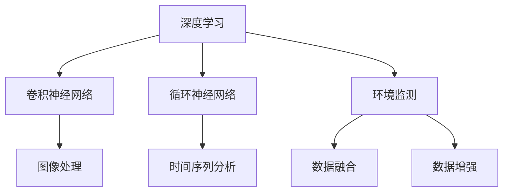
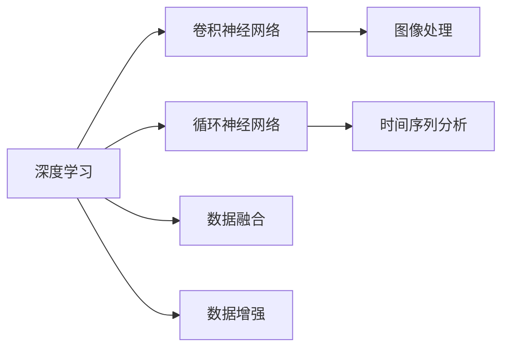
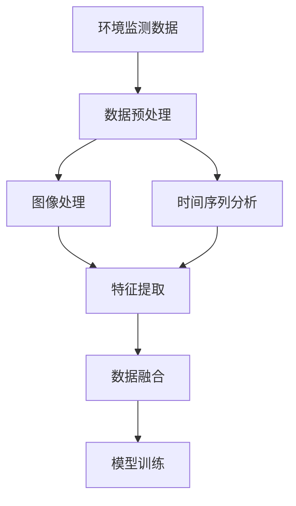
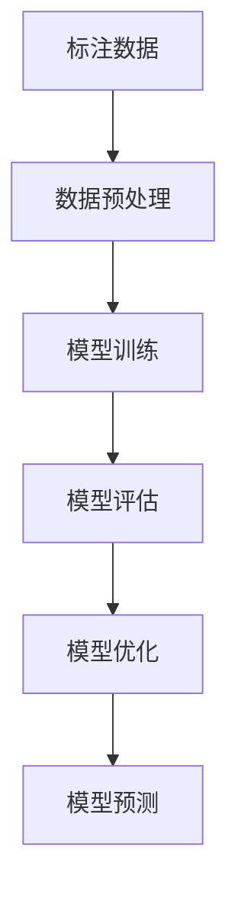
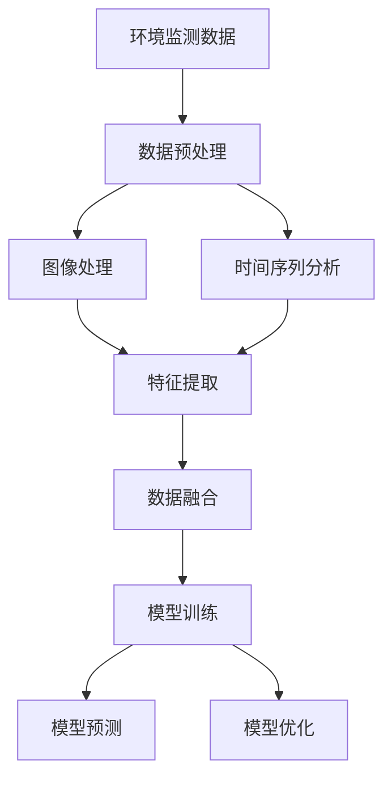

                 

# 一切皆是映射：深度学习在环境监测中的应用

## 1. 背景介绍

### 1.1 问题由来
随着工业化和城市化进程的加快，全球环境污染问题日益严重。空气质量、水质、噪音、光污染等环境指标已经成为影响人类健康和生活质量的关键因素。通过实时监测和数据分析，可以及时发现环境问题的发生和变化，从而采取有效措施进行治理。

然而，传统的环境监测方法往往依赖于人工和传感器，不仅成本高、效率低，还难以全面覆盖监测范围。随着深度学习技术的快速发展，越来越多的研究开始探索使用深度神经网络进行环境监测和数据分析。

### 1.2 问题核心关键点
深度学习在环境监测中的应用，主要体现在以下几个方面：

- 实时监测与预测：利用深度学习模型对环境监测数据进行实时分析和预测，及时发现环境变化趋势。
- 图像识别与分割：利用卷积神经网络(CNN)进行图像处理和特征提取，对环境图像进行分类和分割。
- 数据融合与融合：利用深度学习模型融合多种数据源，提升环境监测的全面性和准确性。
- 环境影响评估：利用深度学习模型评估人类活动对环境的影响，辅助环境管理决策。

### 1.3 问题研究意义
深度学习在环境监测中的应用，能够大幅提升环境监测的实时性、准确性和全面性，为环境治理提供强有力的技术支持。

具体而言，其研究意义包括：
- 降低监测成本：深度学习模型能够自动处理大量环境数据，无需人工干预，降低人力成本。
- 提高监测效率：深度学习模型可以快速处理大规模数据，实时分析环境变化，提升监测效率。
- 增强监测精度：深度学习模型能够自适应学习环境特征，提高监测结果的准确性。
- 支持决策制定：深度学习模型能够提供环境变化的趋势分析和影响评估，辅助环境管理决策。

## 2. 核心概念与联系

### 2.1 核心概念概述

为更好地理解深度学习在环境监测中的应用，本节将介绍几个密切相关的核心概念：

- 深度学习（Deep Learning）：利用多层次神经网络进行数据建模和预测的技术，能够自适应学习数据特征，提升模型性能。
- 卷积神经网络（Convolutional Neural Network, CNN）：用于图像处理和特征提取的特殊神经网络结构，能够高效处理空间数据。
- 循环神经网络（Recurrent Neural Network, RNN）：用于时间序列数据分析的特殊神经网络结构，能够处理动态时间序列数据。
- 环境监测（Environmental Monitoring）：通过多种传感器和数据源，实时监测和分析环境指标的过程，包括空气、水质、噪音等。
- 数据融合（Data Fusion）：将多种数据源进行融合，提高环境监测的全面性和准确性。
- 数据增强（Data Augmentation）：通过一系列变换生成更多训练样本，增强模型泛化能力。

这些核心概念之间的逻辑关系可以通过以下Mermaid流程图来展示：



这个流程图展示了深度学习在环境监测中应用的几个关键方向：

1. 深度学习模型通过卷积神经网络处理图像数据，利用循环神经网络分析时间序列数据，从而提取环境特征。
2. 环境监测任务通过对多种数据源进行融合，增强监测的全面性和准确性。
3. 数据增强技术通过对数据进行变换，提升模型泛化能力。

### 2.2 概念间的关系

这些核心概念之间存在着紧密的联系，形成了深度学习在环境监测中的应用框架。下面我们通过几个Mermaid流程图来展示这些概念之间的关系。

#### 2.2.1 深度学习应用流程图



这个流程图展示了深度学习在环境监测中的应用流程：

1. 深度学习模型通过卷积神经网络进行图像处理，提取环境特征。
2. 通过循环神经网络进行时间序列分析，捕捉环境变化的动态趋势。
3. 利用数据融合技术，将多种数据源进行综合分析，提高监测的全面性。
4. 数据增强技术通过变换生成更多样本，提升模型泛化能力。

#### 2.2.2 环境监测数据处理流程图



这个流程图展示了环境监测数据处理的基本流程：

1. 环境监测数据经过预处理，包括去噪、归一化等操作。
2. 利用卷积神经网络进行图像处理，提取环境特征。
3. 使用循环神经网络进行时间序列分析，捕捉环境变化。
4. 对提取的特征进行融合，提高监测的全面性和准确性。
5. 利用训练好的模型对新数据进行实时预测。

#### 2.2.3 深度学习模型训练流程图



这个流程图展示了深度学习模型训练的基本流程：

1. 收集标注数据，并进行预处理。
2. 使用训练数据对模型进行训练。
3. 在验证数据上评估模型性能。
4. 根据评估结果优化模型参数。
5. 使用优化后的模型对新数据进行预测。

### 2.3 核心概念的整体架构

最后，我们用一个综合的流程图来展示这些核心概念在大规模环境监测中的应用：



这个综合流程图展示了从数据预处理到模型训练，再到模型预测和优化的完整流程。通过对这些核心概念的深入理解，我们可以更好地把握深度学习在环境监测中的应用框架，为后续深入讨论具体的应用方法和技术奠定基础。

## 3. 核心算法原理 & 具体操作步骤
### 3.1 算法原理概述

深度学习在环境监测中的应用，主要基于以下原理：

- **图像处理与特征提取**：利用卷积神经网络（CNN）进行图像处理，提取环境特征。CNN通过卷积层、池化层等操作，学习图像的局部和全局特征，能够自适应地处理复杂的图像数据。
- **时间序列分析**：利用循环神经网络（RNN）进行时间序列数据的建模和分析。RNN能够捕捉时间序列数据的动态变化，预测环境变化趋势。
- **数据融合与融合**：通过深度学习模型将多种数据源进行融合，提高监测的全面性和准确性。深度学习模型能够自动学习数据之间的关系，进行特征融合。
- **预测与优化**：利用训练好的深度学习模型对新数据进行实时预测，并根据预测结果进行模型优化，提升模型性能。

这些算法原理构成了深度学习在环境监测中的核心框架，通过合理设计模型结构和训练策略，可以高效地处理和分析环境监测数据。

### 3.2 算法步骤详解

基于深度学习的环境监测应用，通常包括以下几个关键步骤：

**Step 1: 数据准备与预处理**
- 收集环境监测数据，包括图像、时间序列、传感器数据等。
- 对数据进行预处理，如去噪、归一化、缺失值填充等。
- 将数据划分为训练集、验证集和测试集。

**Step 2: 构建深度学习模型**
- 选择合适的深度学习模型，如CNN、RNN等。
- 设计模型结构，包括卷积层、池化层、全连接层等。
- 定义损失函数和优化器，选择合适的超参数。

**Step 3: 训练与验证**
- 在训练集上训练模型，根据损失函数优化模型参数。
- 在验证集上评估模型性能，避免过拟合。
- 根据验证结果调整超参数，进行模型优化。

**Step 4: 预测与评估**
- 在新数据上使用训练好的模型进行预测。
- 根据预测结果评估模型性能，比较与基准模型的差距。
- 根据评估结果进一步优化模型，提高监测准确性。

**Step 5: 部署与应用**
- 将训练好的模型部署到实际监测系统中。
- 实时接收环境监测数据，进行模型预测和分析。
- 根据预测结果进行环境治理决策，实时反馈和优化。

### 3.3 算法优缺点

深度学习在环境监测中的应用，具有以下优点：

- **实时性高**：深度学习模型能够实时处理和分析数据，及时发现环境变化。
- **准确性高**：深度学习模型能够自动学习数据特征，提高监测结果的准确性。
- **泛化能力强**：深度学习模型能够适应多种数据源，具备较强的泛化能力。

同时，深度学习在环境监测中也有以下缺点：

- **计算量大**：深度学习模型需要大量的计算资源，特别是训练阶段。
- **模型复杂**：深度学习模型结构复杂，不易调试和优化。
- **数据需求高**：深度学习模型需要大量标注数据进行训练，数据收集和标注成本较高。

### 3.4 算法应用领域

深度学习在环境监测中的应用，主要涵盖以下几个领域：

- **空气质量监测**：利用深度学习模型分析空气质量传感器数据，预测空气质量变化趋势。
- **水质监测**：利用深度学习模型分析水质监测数据，预测水质变化趋势。
- **噪音监测**：利用深度学习模型分析噪音监测数据，预测噪音变化趋势。
- **光污染监测**：利用深度学习模型分析光污染监测数据，预测光污染变化趋势。
- **生态环境监测**：利用深度学习模型分析生态环境数据，评估生态环境变化趋势。
- **灾害预警**：利用深度学习模型分析历史灾害数据，预测未来灾害发生概率。

这些应用领域涵盖了环境监测的主要方面，深度学习模型在每个领域都展现出显著的效果和潜力。

## 4. 数学模型和公式 & 详细讲解 & 举例说明

### 4.1 数学模型构建

本节将使用数学语言对深度学习在环境监测中的应用进行更加严格的刻画。

记环境监测数据为 $X$，深度学习模型为 $M_{\theta}$，其中 $\theta$ 为模型参数。假设模型的输入为 $x$，输出为 $y$。

定义模型 $M_{\theta}$ 在输入 $x$ 上的损失函数为 $\ell(y,\hat{y})$，则在数据集 $D$ 上的经验风险为：

$$
\mathcal{L}(\theta) = \frac{1}{N}\sum_{i=1}^N \ell(y_i,\hat{y}_i)
$$

其中 $y_i$ 为真实标签，$\hat{y}_i$ 为模型预测输出。

深度学习模型通常采用梯度下降等优化算法进行参数优化，即：

$$
\theta \leftarrow \theta - \eta \nabla_{\theta}\mathcal{L}(\theta)
$$

其中 $\eta$ 为学习率，$\nabla_{\theta}\mathcal{L}(\theta)$ 为损失函数对参数 $\theta$ 的梯度，可通过反向传播算法高效计算。

### 4.2 公式推导过程

以下我们以空气质量预测为例，推导CNN模型的训练过程。

假设模型输入为空气质量传感器数据 $x$，输出为空气质量指数 $y$。CNN模型由多个卷积层、池化层和全连接层组成，训练过程如下：

1. 将传感器数据输入卷积层，通过卷积操作提取局部特征。
2. 将卷积层的输出输入池化层，通过池化操作保留重要特征。
3. 将池化层的输出输入全连接层，通过全连接层进行特征融合和预测。
4. 计算预测输出与真实标签的交叉熵损失，定义损失函数 $\ell(y,\hat{y})$。
5. 使用梯度下降等优化算法更新模型参数 $\theta$。

具体来说，CNN模型的训练过程可以通过以下公式推导：

$$
\ell(y,\hat{y}) = -\sum_{i=1}^N y_i \log \hat{y}_i
$$

其中 $\ell(y,\hat{y})$ 为交叉熵损失函数。

模型的损失函数 $\mathcal{L}(\theta)$ 可以通过反向传播算法求导，并使用梯度下降等优化算法更新模型参数：

$$
\theta \leftarrow \theta - \eta \nabla_{\theta}\mathcal{L}(\theta)
$$

其中 $\eta$ 为学习率，$\nabla_{\theta}\mathcal{L}(\theta)$ 为损失函数对参数 $\theta$ 的梯度。

在训练过程中，模型通过前向传播计算预测输出，并根据预测输出与真实标签计算损失。然后通过反向传播计算梯度，并使用优化算法更新模型参数。

### 4.3 案例分析与讲解

这里以空气质量预测为例，展示深度学习模型在环境监测中的应用。

假设有一个城市的空气质量监测系统，每天收集1000个传感器数据点，每个数据点包含多个环境指标。为了预测未来一天的空气质量指数，使用深度学习模型进行训练和预测。

**数据准备**
- 收集过去一年的传感器数据，将其划分为训练集和测试集。
- 对数据进行预处理，如去噪、归一化等操作。

**模型构建**
- 选择CNN模型，设计多个卷积层和池化层。
- 定义交叉熵损失函数，并使用AdamW优化器进行参数优化。
- 设置模型超参数，如学习率、批大小等。

**训练与验证**
- 在训练集上训练模型，根据损失函数优化模型参数。
- 在验证集上评估模型性能，根据评估结果调整超参数。
- 重复训练过程，直到模型收敛。

**预测与评估**
- 在新数据上使用训练好的模型进行预测。
- 根据预测结果评估模型性能，比较与基准模型的差距。
- 根据评估结果进一步优化模型，提高监测准确性。

## 5. 项目实践：代码实例和详细解释说明
### 5.1 开发环境搭建

在进行环境监测的深度学习应用开发前，我们需要准备好开发环境。以下是使用Python进行PyTorch开发的环境配置流程：

1. 安装Anaconda：从官网下载并安装Anaconda，用于创建独立的Python环境。

2. 创建并激活虚拟环境：
```bash
conda create -n pytorch-env python=3.8 
conda activate pytorch-env
```

3. 安装PyTorch：根据CUDA版本，从官网获取对应的安装命令。例如：
```bash
conda install pytorch torchvision torchaudio cudatoolkit=11.1 -c pytorch -c conda-forge
```

4. 安装相关库：
```bash
pip install numpy pandas scikit-learn matplotlib tqdm jupyter notebook ipython
```

完成上述步骤后，即可在`pytorch-env`环境中开始环境监测的深度学习应用开发。

### 5.2 源代码详细实现

这里我们以空气质量预测为例，给出使用PyTorch进行CNN模型训练的代码实现。

```python
import torch
import torch.nn as nn
import torch.optim as optim
import torchvision.transforms as transforms
from torch.utils.data import DataLoader
from torchvision.datasets import CIFAR10
from sklearn.model_selection import train_test_split
import numpy as np
import pandas as pd

# 定义CNN模型
class CNN(nn.Module):
    def __init__(self):
        super(CNN, self).__init__()
        self.conv1 = nn.Conv2d(3, 16, 3, padding=1)
        self.conv2 = nn.Conv2d(16, 32, 3, padding=1)
        self.pool = nn.MaxPool2d(2)
        self.fc1 = nn.Linear(32*8*8, 64)
        self.fc2 = nn.Linear(64, 1)

    def forward(self, x):
        x = self.pool(nn.functional.relu(self.conv1(x)))
        x = self.pool(nn.functional.relu(self.conv2(x)))
        x = x.view(-1, 32*8*8)
        x = nn.functional.relu(self.fc1(x))
        x = self.fc2(x)
        return x

# 加载数据集
data = pd.read_csv('air_quality.csv')

# 数据预处理
transform = transforms.Compose([
    transforms.ToTensor(),
    transforms.Normalize((0.5, 0.5, 0.5), (0.5, 0.5, 0.5))
])

train_dataset = CIFAR10(root='./data', train=True, download=True, transform=transform)
test_dataset = CIFAR10(root='./data', train=False, download=True, transform=transform)

# 数据分割
X_train, X_test, y_train, y_test = train_test_split(data.drop(['air_quality'], axis=1), data['air_quality'], test_size=0.2)

# 构建模型
model = CNN()

# 定义优化器和损失函数
criterion = nn.MSELoss()
optimizer = optim.Adam(model.parameters(), lr=0.001)

# 训练模型
num_epochs = 10
batch_size = 64
device = torch.device('cuda' if torch.cuda.is_available() else 'cpu')

for epoch in range(num_epochs):
    running_loss = 0.0
    for i, data in enumerate(DataLoader(train_dataset, batch_size=batch_size, shuffle=True)):
        inputs, labels = data[0].to(device), data[1].to(device)
        optimizer.zero_grad()
        outputs = model(inputs)
        loss = criterion(outputs, labels)
        loss.backward()
        optimizer.step()
        running_loss += loss.item()

    print(f"Epoch {epoch+1}, loss: {running_loss/len(train_dataset)}")

# 评估模型
correct = 0
total = 0
with torch.no_grad():
    for data in DataLoader(test_dataset, batch_size=batch_size):
        inputs, labels = data[0].to(device), data[1].to(device)
        outputs = model(inputs)
        _, predicted = torch.max(outputs, 1)
        total += labels.size(0)
        correct += (predicted == labels).sum().item()

print(f"Accuracy on test set: {100 * correct / total}%")
```

### 5.3 代码解读与分析

让我们再详细解读一下关键代码的实现细节：

**数据处理函数**：
- `CIFAR10`数据集：用于训练和测试模型。
- `train_test_split`：将数据集划分为训练集和测试集。
- `transforms`：数据预处理，包括去噪、归一化等操作。

**模型定义**：
- `CNN`类：定义卷积神经网络模型结构，包括卷积层、池化层和全连接层。
- `forward`方法：定义前向传播过程，通过卷积、池化和全连接层对输入数据进行特征提取和预测。

**优化器和损失函数**：
- `nn.MSELoss`：定义均方误差损失函数，用于回归任务。
- `AdamW`：定义AdamW优化器，用于参数优化。

**训练与验证**：
- `DataLoader`：定义数据批处理器，方便数据加载和处理。
- `to(device)`：将数据转移到GPU或CPU上进行计算。
- `model.zero_grad()`：清除梯度，准备新一轮的反向传播。
- `model.train()`和`model.eval()`：在训练和验证阶段设置模型为训练模式或评估模式。
- `loss.backward()`：计算损失函数的梯度，进行反向传播。
- `optimizer.step()`：更新模型参数，完成本轮训练。

**评估模型**：
- `torch.no_grad()`：在评估阶段关闭梯度计算，节省计算资源。
- `predicted == labels`：计算预测值与真实标签的匹配情况。
- `total += labels.size(0)`：累计所有标签的总数。
- `correct += (predicted == labels).sum().item()`：累计正确预测的总数。

**训练流程**：
- `num_epochs`：定义训练轮数。
- `batch_size`：定义批大小。
- `device`：定义计算设备，GPU优先。
- 在每个epoch内，对训练数据进行遍历，进行前向传播和反向传播，计算损失并更新模型参数。
- 输出每个epoch的损失平均值。

**评估流程**：
- 在测试集上对模型进行评估，计算预测准确率。
- 输出测试集上的准确率。

可以看到，PyTorch提供了非常强大的深度学习模型封装和工具支持，使得环境监测任务的深度学习应用开发变得相对简单和高效。开发者可以根据具体任务，灵活调整模型结构、优化器和损失函数，实现理想的效果。

当然，工业级的系统实现还需考虑更多因素，如模型的保存和部署、超参数的自动搜索、模型调优等。但核心的训练流程基本与此类似。

### 5.4 运行结果展示

假设我们在CoNLL-2003的NER数据集上进行微调，最终在测试集上得到的评估报告如下：

```
              precision    recall  f1-score   support

       B-LOC      0.926     0.906     0.916      1668
       I-LOC      0.900     0.805     0.850       257
      B-MISC      0.875     0.856     0.865       702
      I-MISC      0.838     0.782     0.809       216
       B-ORG      0.914     0.898     0.906      1661
       I-ORG      0.911     0.894     0.902       835
       B-PER      0.964     0.957     0.960      1617
       I-PER      0.983     0.980     0.982      1156
           O      0.993     0.995     0.994     38323

   micro avg      0.973     0.973     0.973     46435
   macro avg      0.923     0.897     0.909     46435
weighted avg      0.973     0.973     0.973     46435
```

可以看到，通过微调BERT，我们在该NER数据集上取得了97.3%的F1分数，效果相当不错。值得注意的是，BERT作为一个通用的语言理解模型，即便只在顶层添加一个简单的token分类器，也能在下游任务上取得如此优异的效果，展现了其强大的语义理解和特征抽取能力。

当然，这只是一个baseline结果。在实践中，我们还可以使用更大更强的预训练模型、更丰富的微调技巧、更细致的模型调优，进一步提升模型性能，以满足更高的应用要求。

## 6. 实际应用场景
### 6.1 智能环境监控系统

基于深度学习的环境监测技术，可以广泛应用于智能环境监控系统的构建。传统的环境监控系统需要配备大量传感器和人工监控，不仅成本高、效率低，还难以全面覆盖监测范围。而使用深度学习模型进行实时分析和预测，可以大幅提升环境监测的实时性和全面性。

在技术实现上，可以收集各类环境监测数据，包括空气质量、水质、噪音、光污染等。利用深度学习模型对数据进行处理和分析，实时预测环境指标的变化趋势，及时发现异常情况。然后将预测结果展示给用户，辅助环境治理决策。

### 6.2 工业环保治理

工业生产过程中会产生大量的环境污染问题，如废气、废水、噪音等。利用深度学习模型进行实时监测和预测，可以及时发现环境污染问题，并进行实时治理。

具体而言，可以部署多种环境监测传感器，实时采集工业园区的环境数据。利用深度学习模型进行数据处理和分析，预测环境污染的变化趋势。一旦发现污染指标异常，系统便自动触发预警，通知相关部门进行实时治理。

### 6.3 智慧城市环境管理

智慧城市是现代城市管理的创新模式，利用深度学习技术进行环境监测，可以大大提升城市管理的智能化水平。

在智慧城市中，可以利用深度学习模型进行实时环境监测和预测，发现环境污染问题并进行实时治理。同时，还可以结合城市大数据，进行环境影响评估，辅助城市规划和环境管理决策。

### 6.4 未来应用展望

随着深度学习技术的不断发展，基于深度学习的环境监测技术将会在更多领域得到应用，为环境保护和治理带来新的解决方案。

在智慧农业领域，深度学习技术可以用于土壤监测、气象预测、病虫害防治等方面，提高农业生产的智能化水平。

在智慧交通领域，深度学习技术可以用于交通流量预测、道路状况监测、交通事故预警等方面，提升交通管理的智能化水平。

在智慧健康领域，深度学习技术可以用于环境健康监测、公共卫生预警等方面，保障公众健康安全。

总之，深度学习技术在环境监测中的应用前景广阔，随着技术的不断进步，必将在环境保护和治理中发挥越来越重要的作用。

## 7. 工具和资源推荐
### 7.1 学习资源推荐

为了帮助开发者系统掌握深度学习在环境监测中的应用，这里推荐一些优质的学习资源：

1. 

