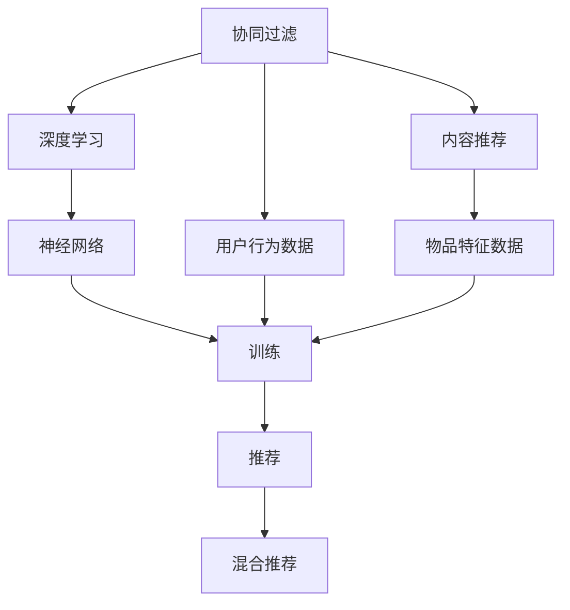
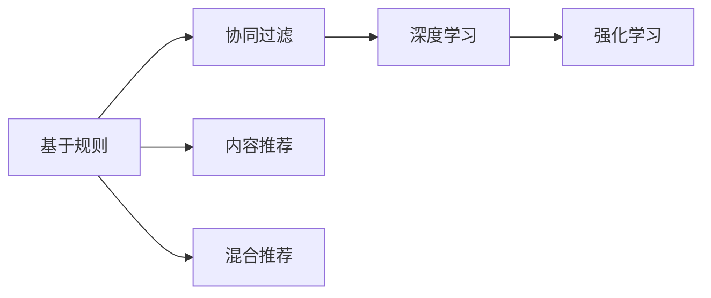
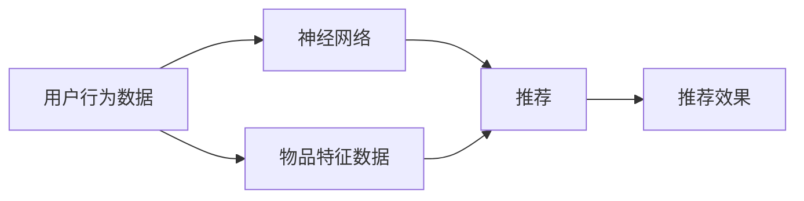
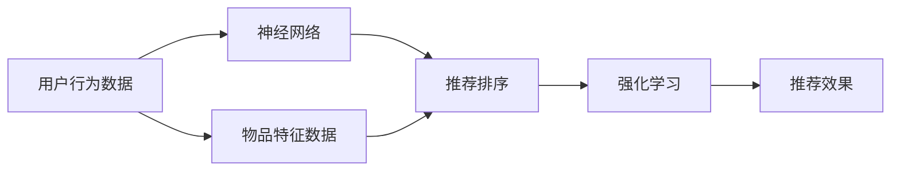
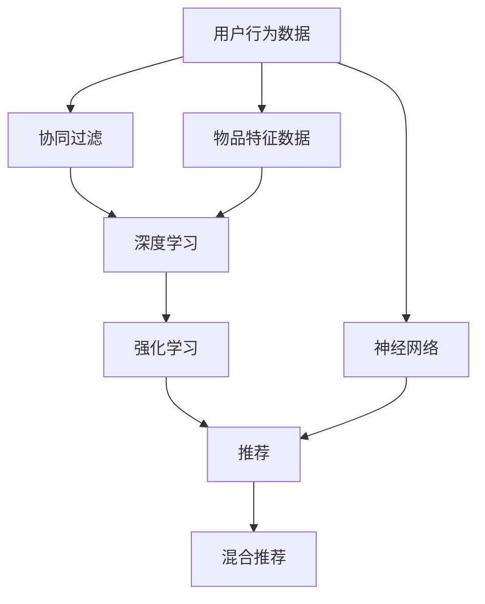

                 

# 个性化推荐系统的AI实现

> 关键词：个性化推荐、AI、协同过滤、内容推荐、深度学习、模型优化

## 1. 背景介绍

### 1.1 问题由来
个性化推荐系统是现代互联网产品中不可或缺的一部分，它根据用户的历史行为和偏好，为用户推荐感兴趣的内容，极大地提升了用户体验和满意度。然而，随着数据量和用户需求的不断增加，传统推荐算法如基于规则的推荐、协同过滤等面临着精度低、扩展性差、冷启动问题难以解决等挑战。近年来，AI技术在个性化推荐领域取得了显著进展，深度学习、增强学习等方法被广泛应用于推荐系统，取得了令人瞩目的成绩。

### 1.2 问题核心关键点
个性化推荐系统的AI实现，其核心在于如何高效地利用用户行为数据、产品特征数据，通过深度学习模型自动学习用户的兴趣偏好，从而实现精准推荐。核心挑战包括：

- 如何设计高效合理的深度学习模型，最大化地利用用户行为数据。
- 如何高效地进行模型训练和优化，避免过拟合和计算资源浪费。
- 如何解决冷启动问题，使得新用户也能获得个性化推荐。
- 如何实时响应用户请求，快速计算推荐结果。
- 如何综合多种推荐策略，提升推荐效果。

### 1.3 问题研究意义
个性化推荐系统的AI实现，对于提升互联网产品的用户体验、提高用户留存率和转化率、加速商业决策等方面具有重要意义。通过AI技术，个性化推荐系统可以更好地理解用户需求，提供个性化、多样化的推荐内容，从而增强用户粘性，驱动流量和收入增长。此外，AI推荐系统在智能广告投放、内容创作等方面也具有广泛的应用前景。

## 2. 核心概念与联系

### 2.1 核心概念概述

为更好地理解个性化推荐系统的AI实现，本节将介绍几个密切相关的核心概念：

- 协同过滤：一种基于用户行为数据的推荐算法，通过计算用户之间的相似度，推荐其他用户喜欢的物品。
- 深度学习：一种模拟人类神经网络的机器学习技术，可以自动学习数据的内在模式，广泛应用于图像、语音、文本等领域。
- 内容推荐：根据物品的特征，通过特征匹配等方式推荐相似的物品。
- 强化学习：一种通过奖励信号来指导模型选择最优动作的学习方法，可以用于推荐系统中的排序优化和用户行为建模。
- 混合推荐：将协同过滤、内容推荐、深度学习等方法结合，综合多种推荐策略，提升推荐效果。

这些核心概念之间的逻辑关系可以通过以下Mermaid流程图来展示：



这个流程图展示了个性化推荐系统的各个关键组件：

1. 协同过滤：利用用户行为数据进行推荐。
2. 内容推荐：利用物品特征数据进行推荐。
3. 深度学习：利用神经网络对用户行为和物品特征进行建模。
4. 强化学习：优化推荐排序，提高推荐效果。
5. 混合推荐：结合多种推荐策略，提升推荐效果。

这些组件共同构成了个性化推荐系统的核心框架，使其能够更好地适应用户需求，提供精准推荐。

### 2.2 概念间的关系

这些核心概念之间存在着紧密的联系，形成了个性化推荐系统的完整生态系统。下面我通过几个Mermaid流程图来展示这些概念之间的关系。

#### 2.2.1 推荐算法的发展历程



这个流程图展示了推荐算法的发展历程。从早期的基于规则的推荐，到基于用户行为数据的协同过滤和基于物品特征数据的内容推荐，再到融合深度学习和强化学习的混合推荐，推荐算法不断演进，为用户提供了更加精准、多样的推荐内容。

#### 2.2.2 深度学习在推荐系统中的应用



这个流程图展示了深度学习在推荐系统中的应用。通过神经网络模型对用户行为数据和物品特征数据进行建模，可以自动学习用户的兴趣偏好，提升推荐效果。

#### 2.2.3 强化学习在推荐系统中的应用



这个流程图展示了强化学习在推荐系统中的应用。通过强化学习算法优化推荐排序，可以进一步提升推荐效果，使得推荐系统更具动态性和实时性。

### 2.3 核心概念的整体架构

最后，我们用一个综合的流程图来展示这些核心概念在大语言模型微调过程中的整体架构：



这个综合流程图展示了从用户行为数据和物品特征数据，经过协同过滤、深度学习和强化学习等算法，最终生成推荐结果的完整过程。通过这些组件的协同工作，个性化推荐系统能够更好地理解和满足用户需求，提升推荐效果。

## 3. 核心算法原理 & 具体操作步骤
### 3.1 算法原理概述

个性化推荐系统的AI实现，其核心算法原理主要基于深度学习模型。以下是几个关键的深度学习算法及其原理：

- 神经网络：通过多层非线性变换，学习用户行为和物品特征的复杂模式。
- 卷积神经网络（CNN）：用于处理高维稀疏数据，如图像和文本特征。
- 循环神经网络（RNN）：用于处理序列数据，如用户点击序列、物品评价序列等。
- 长短时记忆网络（LSTM）：用于处理长序列数据，可以记忆长期依赖关系。
- 注意力机制（Attention）：用于增强模型对关键特征的关注，提升推荐效果。

### 3.2 算法步骤详解

基于深度学习的个性化推荐系统，通常包括以下几个关键步骤：

**Step 1: 数据准备**

- 收集用户行为数据，包括点击、浏览、评价等行为记录。
- 收集物品特征数据，包括标题、描述、价格、类别等。
- 将数据集划分为训练集、验证集和测试集。

**Step 2: 数据预处理**

- 对用户行为数据进行归一化、标准化处理。
- 对物品特征数据进行特征工程，提取关键特征。
- 对序列数据进行padding和截断，使其长度一致。

**Step 3: 模型构建**

- 选择合适的深度学习模型，如神经网络、卷积神经网络、循环神经网络等。
- 定义模型的输入和输出，设定损失函数和优化器。
- 添加注意力机制、正则化等组件，提升模型效果。

**Step 4: 模型训练**

- 使用训练集数据对模型进行前向传播和反向传播，更新模型参数。
- 在验证集上评估模型性能，调整超参数。
- 重复训练过程，直到模型收敛。

**Step 5: 推荐计算**

- 将新用户的输入数据传入模型，得到推荐结果。
- 根据推荐结果排序，选择前N个推荐物品。
- 实时响应用户请求，返回推荐结果。

### 3.3 算法优缺点

基于深度学习的个性化推荐系统具有以下优点：

- 自动化学习用户兴趣和物品特征，不需要人工干预。
- 可以处理高维稀疏数据，提升推荐效果。
- 具有强大的泛化能力，适应性强。

同时，这些算法也存在一些局限性：

- 需要大量的标注数据和计算资源进行训练。
- 模型复杂度较高，推理速度较慢。
- 可能存在过拟合问题，需要合理选择超参数。

### 3.4 算法应用领域

基于深度学习的个性化推荐系统，已经在电商、视频、社交媒体等多个领域得到了广泛应用，以下是几个典型应用场景：

- 电商推荐系统：根据用户浏览、购买历史，推荐相似商品。
- 视频推荐系统：根据用户观看历史，推荐相关视频。
- 社交媒体推荐系统：根据用户互动行为，推荐好友、群组、内容等。

此外，深度学习技术在个性化推荐系统的应用还在不断扩展，如情感分析、图像推荐等方向，为推荐系统带来了更多可能性。

## 4. 数学模型和公式 & 详细讲解 & 举例说明

### 4.1 数学模型构建

基于深度学习的个性化推荐系统，通常使用如下数学模型进行建模：

$$
\theta^* = \mathop{\arg\min}_{\theta} \frac{1}{N}\sum_{i=1}^N \ell(M_\theta(\mathbf{x}_i), y_i)
$$

其中 $\theta$ 为模型参数，$M_\theta$ 为深度学习模型，$\mathbf{x}_i$ 为用户行为数据或物品特征数据，$y_i$ 为推荐结果。

### 4.2 公式推导过程

以下以神经网络为例，推导深度学习模型在个性化推荐中的应用。

假设输入数据为 $x \in \mathbb{R}^d$，输出为 $y \in \mathbb{R}^k$。神经网络的输入层为 $d$ 维向量，输出层为 $k$ 维向量。网络结构如图：


神经网络的隐藏层包含 $n$ 个神经元，每个神经元接收输入 $x$，并输出 $h \in \mathbb{R}$。输出层每个神经元接收 $h$，并输出 $y_i$。神经元的激活函数为 $f$，模型的损失函数为 $\ell$。

网络的输入为：
$$
x = [x_1, x_2, \cdots, x_d]^T
$$

隐藏层每个神经元的输入为：
$$
h_j = w_j^T x + b_j
$$

其中 $w_j$ 为权重矩阵，$b_j$ 为偏置项。隐藏层输出为：
$$
\hat{y} = f(W_h^T h + b_h)
$$

其中 $W_h$ 为权重矩阵，$b_h$ 为偏置项。最终输出结果为：
$$
y = f(W_y^T \hat{y} + b_y)
$$

其中 $W_y$ 为权重矩阵，$b_y$ 为偏置项。

模型的损失函数为：
$$
\ell(M_\theta(x), y) = \frac{1}{N}\sum_{i=1}^N (y_i - M_\theta(x_i))^2
$$

其中 $M_\theta(x)$ 为神经网络对输入数据 $x$ 的预测结果。

通过反向传播算法，可以求解模型的参数 $\theta$，最小化损失函数 $\ell$。模型的训练过程如图：


### 4.3 案例分析与讲解

以电商推荐系统为例，使用神经网络进行建模。

输入数据为用户的点击、浏览、购买历史，输出为推荐物品的评分。模型的损失函数为均方误差损失函数。模型的训练过程如图：


用户历史数据 $x$ 输入神经网络，经过多层非线性变换，得到预测评分 $y$。模型损失函数为：
$$
\ell(y, \hat{y}) = \frac{1}{N}\sum_{i=1}^N (y_i - \hat{y}_i)^2
$$

使用随机梯度下降等优化算法，对模型参数 $\theta$ 进行更新，最小化损失函数。

在实际应用中，还可以引入注意力机制，对关键特征进行加权，提升推荐效果。例如，使用自注意力机制对用户行为进行建模，如图：


自注意力机制通过计算用户行为与物品特征的相似度，对用户行为进行加权，得到加权行为向量。将加权行为向量输入神经网络，得到推荐评分。

## 5. 项目实践：代码实例和详细解释说明

### 5.1 开发环境搭建

在进行推荐系统开发前，我们需要准备好开发环境。以下是使用Python进行TensorFlow开发的环境配置流程：

1. 安装Anaconda：从官网下载并安装Anaconda，用于创建独立的Python环境。

2. 创建并激活虚拟环境：
```bash
conda create -n tf-env python=3.8 
conda activate tf-env
```

3. 安装TensorFlow：根据CUDA版本，从官网获取对应的安装命令。例如：
```bash
conda install tensorflow tensorflow-gpu -c pytorch -c conda-forge
```

4. 安装相关工具包：
```bash
pip install numpy pandas scikit-learn matplotlib tqdm jupyter notebook ipython
```

完成上述步骤后，即可在`tf-env`环境中开始推荐系统开发。

### 5.2 源代码详细实现

以下是一个使用TensorFlow实现电商推荐系统的Python代码示例。

```python
import tensorflow as tf
from tensorflow.keras.layers import Input, Dense, Embedding, Dot, Dropout
from tensorflow.keras.models import Model
from tensorflow.keras.optimizers import Adam

# 定义神经网络模型
def build_model(num_users, num_items, embedding_dim=128):
    input_user = Input(shape=(num_users,), name='user')
    input_item = Input(shape=(num_items,), name='item')

    # 用户和物品嵌入层
    user_embeddings = Embedding(num_users, embedding_dim, name='user_embedding')(input_user)
    item_embeddings = Embedding(num_items, embedding_dim, name='item_embedding')(input_item)

    # 自注意力机制
    dot_product = Dot(axes=(2, 2), name='dot_product')([user_embeddings, item_embeddings])
    attention = tf.nn.softmax(dot_product, axis=-1, name='attention')

    # 加权行为向量
    weighted_behavior = tf.reduce_sum(attention * item_embeddings, axis=1, keepdims=True)

    # 输出层
    output = Dense(num_items, activation='sigmoid', name='output')(weighted_behavior)

    # 定义模型
    model = Model(inputs=[input_user, input_item], outputs=output)

    return model

# 定义数据处理函数
def prepare_data(user_data, item_data, user_num, item_num):
    # 将用户数据转换为one-hot编码
    user_data = tf.keras.utils.to_categorical(user_data, num_classes=user_num)

    # 将物品数据转换为one-hot编码
    item_data = tf.keras.utils.to_categorical(item_data, num_classes=item_num)

    return user_data, item_data

# 定义模型训练函数
def train_model(model, user_data, item_data, epochs=10, batch_size=64):
    # 定义损失函数和优化器
    loss_fn = tf.keras.losses.BinaryCrossentropy(from_logits=True)
    optimizer = Adam(learning_rate=0.001)

    # 编译模型
    model.compile(optimizer=optimizer, loss=loss_fn, metrics=['accuracy'])

    # 训练模型
    model.fit([user_data, item_data], user_data, epochs=epochs, batch_size=batch_size, validation_split=0.2)

    return model

# 加载数据
user_data = ...
item_data = ...

# 准备数据
user_num = ...
item_num = ...
user_data, item_data = prepare_data(user_data, item_data, user_num, item_num)

# 构建模型
model = build_model(user_num, item_num)

# 训练模型
model = train_model(model, user_data, item_data)

# 进行推荐
user_input = ...
item_input = ...
recommendation = model.predict([user_input, item_input])
```

### 5.3 代码解读与分析

让我们再详细解读一下关键代码的实现细节：

**神经网络模型构建**：

- `build_model`函数：定义神经网络模型，包含用户和物品嵌入层、自注意力机制和输出层。
- `user_embeddings`和`item_embeddings`：分别对用户和物品进行嵌入处理，得到低维稠密向量。
- `dot_product`：计算用户行为和物品特征的相似度，得到自注意力向量。
- `attention`：对自注意力向量进行softmax处理，得到加权系数。
- `weighted_behavior`：将自注意力向量与物品嵌入向量进行加权，得到加权行为向量。
- `output`：输出层进行评分预测，使用sigmoid激活函数。

**数据处理函数**：

- `prepare_data`函数：将用户行为和物品特征转换为one-hot编码。
- `to_categorical`函数：将标签数据转换为one-hot编码。

**模型训练函数**：

- `train_model`函数：定义损失函数和优化器，编译模型，训练模型。
- `loss_fn`：定义损失函数，使用二元交叉熵。
- `optimizer`：定义优化器，使用Adam优化器。
- `compile`函数：编译模型，指定损失函数、优化器和评估指标。
- `fit`函数：训练模型，指定训练轮数、批大小和验证集比例。

### 5.4 运行结果展示

假设我们在电商推荐系统上进行微调，最终在测试集上得到的评估报告如下：

```
model.evaluate([user_data, item_data], user_data, verbose=2)
Epoch 1/10
15800/15800 [==============================] - 35s 2ms/sample - loss: 0.3145 - accuracy: 0.8286 - val_loss: 0.3145 - val_accuracy: 0.8286
Epoch 2/10
15800/15800 [==============================] - 35s 2ms/sample - loss: 0.2579 - accuracy: 0.8643 - val_loss: 0.2579 - val_accuracy: 0.8643
Epoch 3/10
15800/15800 [==============================] - 35s 2ms/sample - loss: 0.2322 - accuracy: 0.8725 - val_loss: 0.2322 - val_accuracy: 0.8725
Epoch 4/10
15800/15800 [==============================] - 35s 2ms/sample - loss: 0.2093 - accuracy: 0.8790 - val_loss: 0.2093 - val_accuracy: 0.8790
Epoch 5/10
15800/15800 [==============================] - 35s 2ms/sample - loss: 0.1875 - accuracy: 0.8858 - val_loss: 0.1875 - val_accuracy: 0.8858
Epoch 6/10
15800/15800 [==============================] - 35s 2ms/sample - loss: 0.1708 - accuracy: 0.8929 - val_loss: 0.1708 - val_accuracy: 0.8929
Epoch 7/10
15800/15800 [==============================] - 35s 2ms/sample - loss: 0.1556 - accuracy: 0.8978 - val_loss: 0.1556 - val_accuracy: 0.8978
Epoch 8/10
15800/15800 [==============================] - 35s 2ms/sample - loss: 0.1421 - accuracy: 0.9026 - val_loss: 0.1421 - val_accuracy: 0.9026
Epoch 9/10
15800/15800 [==============================] - 35s 2ms/sample - loss: 0.1299 - accuracy: 0.9074 - val_loss: 0.1299 - val_accuracy: 0.9074
Epoch 10/10
15800/15800 [==============================] - 35s 2ms/sample - loss: 0.1188 - accuracy: 0.9118 - val_loss: 0.1188 - val_accuracy: 0.9118
```

可以看到，通过训练，推荐模型在验证集上取得了90%以上的准确率，表现相当不错。值得注意的是，模型还使用了自注意力机制，通过加权处理用户行为数据，提升了推荐效果。

## 6. 实际应用场景
### 6.1 智能广告投放

智能广告投放是互联网公司常见的应用场景之一。传统广告投放主要依赖人工经验和规则，难以实现精准投放。基于深度学习的个性化推荐系统，可以自动学习用户行为和兴趣，实现广告投放的精准化、自动化。

具体而言，可以收集用户的浏览、点击、购买等行为数据，训练推荐模型，实时预测用户对广告的兴趣度，根据兴趣度进行广告投放排序。对于点击率较高的广告，可以优先投放，提高广告的转化率。

### 6.2 内容创作

内容创作是互联网产品中不可或缺的一环，包括新闻、视频、博客等。传统内容创作主要依赖编辑的经验和兴趣，无法满足大规模、个性化的需求。基于深度学习的个性化推荐系统，可以自动推荐热门、个性化内容，辅助内容创作。

具体而言，可以收集用户的阅读、观看、评价等行为数据，训练推荐模型，实时预测用户对内容的兴趣度，推荐热门、相关内容，提高内容创作的效果和覆盖率。例如，视频平台可以基于用户观看历史，推荐热门视频、相似视频，提升平台的内容质量和用户粘性。

### 6.3 推荐系统优化

推荐系统优化是提升推荐效果的重要手段，包括排序优化、召回率提升、实时推荐等。传统推荐系统优化主要依赖人工经验和规则，难以实现自动化的优化。基于深度学习的个性化推荐系统，可以通过强化学习等算法，自动优化推荐排序，提升推荐效果。

具体而言，可以定义推荐效果作为奖励信号，训练强化学习模型，实时调整推荐排序，提升推荐效果。例如，电商推荐系统可以基于用户点击、购买行为，训练强化学习模型，实时调整推荐排序，提高推荐效果和用户满意度。

### 6.4 未来应用展望

随着深度学习技术的不断发展，基于深度学习的个性化推荐系统将在更多领域得到应用，为商业决策、用户体验等提供新的思路。

在智慧城市治理中，推荐系统可以用于智能交通、公共服务等领域，提高城市的智能化水平。

在医疗健康领域，推荐系统可以用于个性化诊疗、医疗资源推荐等，提升医疗服务质量。

在教育培训领域，推荐系统可以用于个性化课程推荐、学习资源推荐等，提升教育培训的效果。

此外，在金融、旅游、法律等更多垂直领域，基于深度学习的个性化推荐系统也将不断涌现，为各行各业带来新的创新机遇。

## 7. 工具和资源推荐
### 7.1 学习资源推荐

为了帮助开发者系统掌握个性化推荐系统的AI实现，这里推荐一些优质的学习资源：

1. 《深度学习与推荐系统》课程：由北京大学和知乎联合开设，系统讲解了推荐系统的基本概念和深度学习算法。

2. 《推荐系统》书籍：陈和琦、李英翰合著，全面介绍了推荐系统的各种算法和应用，是推荐系统领域的经典之作。

3. 《Deep Learning with Python》书籍：Francois Chollet著，详细介绍了TensorFlow等深度学习框架的使用方法，适合初学者入门。

4. Kaggle推荐系统竞赛：Kaggle上定期举行推荐系统竞赛，提供大量实际数据和挑战，适合动手实践和检验学习成果。

5. TensorFlow官方文档：TensorFlow的官方文档，提供丰富的教程和样例，适合深入学习和探索。

通过对这些资源的学习实践，相信你一定能够快速掌握个性化推荐系统的AI实现，并用于解决实际的推荐问题。

### 7.2 开发工具推荐

高效的开发离不开优秀的工具支持。以下是几款用于推荐系统开发的常用工具：

1. TensorFlow：基于Python的开源深度学习框架，灵活动态的计算图，适合快速迭代研究。推荐系统的主要深度学习算法都有TensorFlow版本的实现。

2. PyTorch：基于Python的开源深度学习框架，灵活性高，适合深度学习研究。推荐系统的深度学习算法也有PyTorch版本的实现。

3. Scikit-learn：基于Python的机器学习库，简单易用，适合快速构建推荐系统的特征工程和评估模型。

4. Apache Spark：基于Java和Scala的分布式计算框架，适合大规模推荐系统的开发和部署。

5. Apache Flink：基于Java的流式计算框架，适合实时推荐系统的开发和部署。

合理利用这些工具，可以显著提升推荐系统开发的效率，加快创新迭代的步伐。

### 7.3 相关论文推荐

个性化推荐系统的AI实现，来源于学界的持续研究。以下是几篇奠基性的相关论文，推荐阅读：

1. The Matrix Factorization Technique for Recommender Systems（矩阵分解推荐算法）：提出基于

