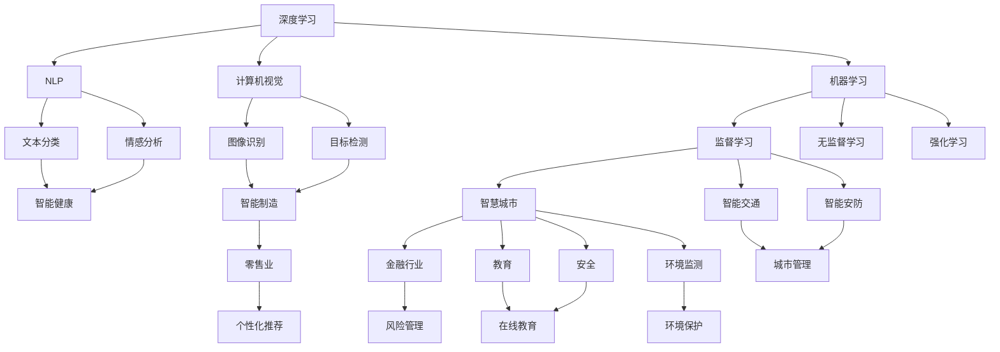
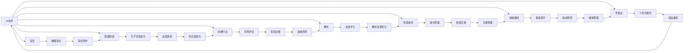
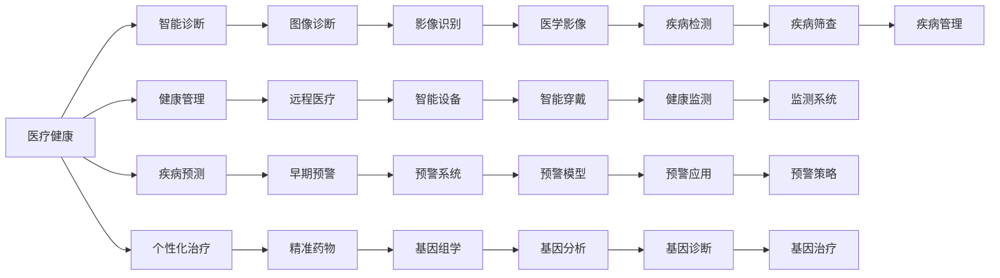
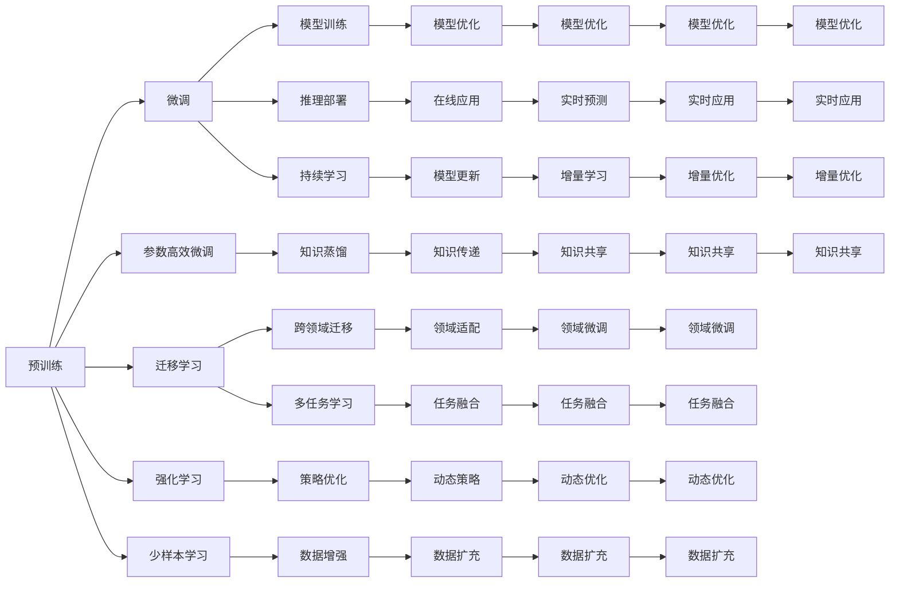
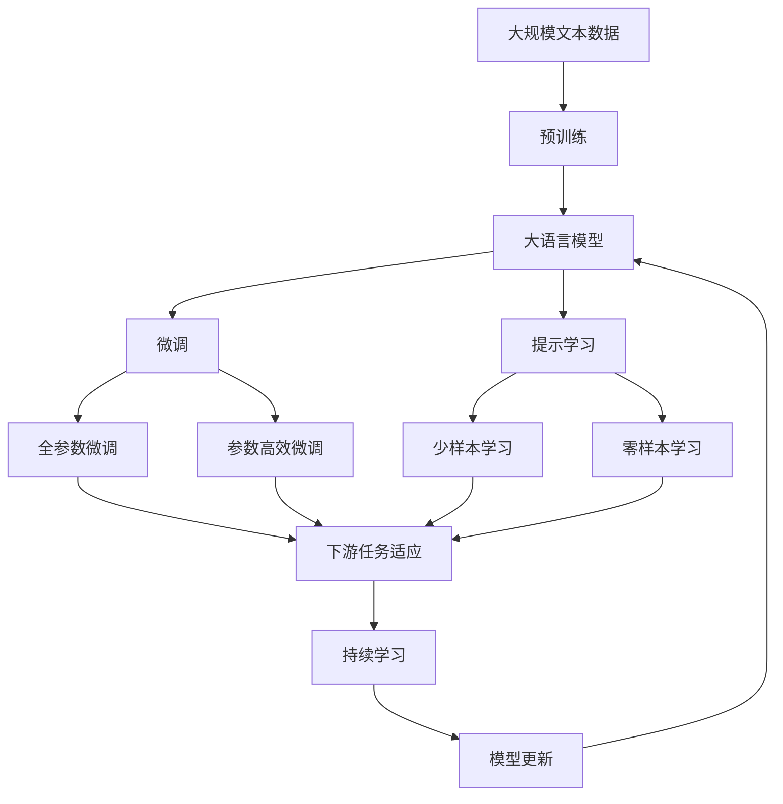

                 

# 人工智能对各行业的影响

> 关键词：人工智能, 深度学习, 机器学习, 自然语言处理, 计算机视觉, 医疗健康, 金融行业, 零售业, 制造业, 智慧城市, 教育, 安全, 伦理道德

## 1. 背景介绍

### 1.1 问题由来
近年来，人工智能（AI）技术的迅猛发展极大地改变了各行各业的面貌，带来了深刻的影响。从医疗健康到金融行业，从制造业到智慧城市，AI技术在多个领域中的应用都取得了显著的成效。AI技术的突破和应用不仅提升了工作效率和生产效率，还在改变人们的生活方式和社会结构。本文旨在深入探讨AI技术对各行业的影响，探讨其应用潜力，以及随之而来的挑战和机遇。

### 1.2 问题核心关键点
AI技术的核心在于利用数据驱动的方式，通过机器学习和深度学习算法，实现对大量数据的自动化处理和智能决策。这一过程涉及到的关键技术包括：

- 数据处理与清洗：确保数据质量和可靠性，是AI应用的基础。
- 特征工程：提取和设计有意义的特征，用于模型训练。
- 模型训练与优化：通过训练模型，使其具备泛化能力，进行决策和预测。
- 推理与部署：将训练好的模型应用到实际场景中，进行推理和部署。

这些技术的结合，使得AI技术在各行各业中得以广泛应用，并逐渐成为推动行业发展的重要驱动力。

### 1.3 问题研究意义
研究AI技术对各行业的影响，对于推动AI技术在行业中的应用，提升行业的智能化水平，具有重要意义：

1. **降低成本**：通过自动化和智能化，AI技术能够显著降低人力和物力成本，提升效率。
2. **优化决策**：AI模型通过数据分析，能够提供更加精准的决策支持，提高决策的科学性和准确性。
3. **创造新价值**：AI技术的应用能够开辟新的商业模式和服务形式，创造更多的经济价值和社会价值。
4. **提升竞争力**：拥有AI技术的企业能够在竞争中占据优势，提升市场份额和市场地位。
5. **推动创新**：AI技术的引入能够激发行业的创新活力，推动技术进步和产品迭代。

## 2. 核心概念与联系

### 2.1 核心概念概述

AI技术涉及多个核心概念，这些概念之间存在密切的联系。以下是对几个关键概念的概述：

- **深度学习**：一种基于神经网络的机器学习技术，通过多层非线性变换，实现对复杂模式的识别和预测。
- **自然语言处理（NLP）**：研究计算机如何处理和理解人类语言的技术，包括语言建模、文本分类、情感分析等。
- **计算机视觉（CV）**：涉及图像和视频的自动分析、理解和生成，应用广泛于图像识别、目标检测等领域。
- **机器学习**：通过数据训练模型，使其具备学习和预测能力的技术，涵盖监督学习、无监督学习、强化学习等。
- **智慧城市**：利用AI技术构建的智能化城市管理系统，提升城市运行的效率和安全性。
- **智能制造**：通过AI技术优化生产流程，提升制造业的智能化水平和生产效率。
- **智能健康**：AI技术在医疗诊断、治疗、管理中的应用，提升医疗服务质量和效率。

这些核心概念之间的逻辑关系可以通过以下Mermaid流程图来展示：



这个流程图展示了AI技术在不同领域的应用，以及这些应用之间的联系和相互影响。

### 2.2 概念间的关系

这些核心概念之间存在着紧密的联系，形成了一个庞大的AI技术生态系统。以下通过几个Mermaid流程图来展示这些概念之间的关系：

#### 2.2.1 AI技术与各行业的关系



这个流程图展示了AI技术在各个行业中的应用，以及如何通过AI技术提升各行业的智能化水平。

#### 2.2.2 AI技术在各行业中的应用



这个流程图展示了AI技术在医疗健康领域的具体应用，以及如何通过这些应用提升医疗服务的智能化水平。

#### 2.2.3 AI技术的发展路径



这个流程图展示了AI技术发展的路径，以及各种技术之间的相互影响和应用。

### 2.3 核心概念的整体架构

最后，我们用一个综合的流程图来展示这些核心概念在大语言模型微调过程中的整体架构：



这个综合流程图展示了从预训练到微调，再到持续学习的完整过程。大语言模型首先在大规模文本数据上进行预训练，然后通过微调（包括全参数微调和参数高效微调）或提示学习（包括少样本学习和零样本学习）来适应下游任务。最后，通过持续学习技术，模型可以不断更新和适应新的任务和数据。 通过这些流程图，我们可以更清晰地理解AI技术在大语言模型微调过程中的各个核心概念的关系和作用，为后续深入讨论具体的微调方法和技术奠定基础。

## 3. 核心算法原理 & 具体操作步骤
### 3.1 算法原理概述

AI技术的核心算法原理主要包括机器学习和深度学习，这些算法通过数据驱动的方式，实现对数据的自动分析和智能决策。以下是对核心算法原理的概述：

#### 3.1.1 监督学习

监督学习是一种有监督的机器学习方法，通过已知的输入和输出数据训练模型，使其具备预测能力。监督学习通常用于分类和回归任务，例如将患者分为不同的疾病类别，预测房价等。

#### 3.1.2 无监督学习

无监督学习是一种无需标注数据的机器学习方法，通过数据的内在结构和规律进行学习。无监督学习常用于聚类和降维任务，例如将患者分为不同的疾病组，降维图像数据等。

#### 3.1.3 强化学习

强化学习是一种通过与环境交互学习决策的方法，通过奖励机制优化策略，从而最大化预期收益。强化学习常用于游戏、机器人控制等任务。

#### 3.1.4 深度学习

深度学习是一种基于神经网络的机器学习方法，通过多层非线性变换实现对复杂模式的识别和预测。深度学习通常用于图像识别、语音识别、自然语言处理等任务。

### 3.2 算法步骤详解

AI技术的应用通常包括以下几个关键步骤：

#### 3.2.1 数据准备

- **数据采集**：收集和整理数据，确保数据质量和可靠性。
- **数据清洗**：处理数据中的噪声和不一致性，提升数据质量。
- **数据标注**：为数据添加标签，便于模型训练和推理。

#### 3.2.2 模型训练

- **模型选择**：选择适合的模型结构，例如卷积神经网络、循环神经网络、深度神经网络等。
- **模型训练**：使用训练数据对模型进行训练，优化模型参数，提升模型性能。
- **模型评估**：使用测试数据对模型进行评估，衡量模型性能。

#### 3.2.3 模型推理

- **模型部署**：将训练好的模型部署到实际场景中，进行推理和预测。
- **模型优化**：根据实际情况，对模型进行优化和调整，提升模型性能。

### 3.3 算法优缺点

AI技术在各行业中的应用具有以下优点：

1. **提高效率**：AI技术能够自动化处理大量数据，提升工作效率和生产效率。
2. **提升精度**：AI模型通过数据分析和优化，能够提供更加精准的决策和预测。
3. **降低成本**：AI技术能够减少人力和物力成本，提升资源利用效率。
4. **创造新价值**：AI技术能够开辟新的商业模式和服务形式，创造更多的经济价值和社会价值。
5. **提升竞争力**：拥有AI技术的企业能够在竞争中占据优势，提升市场份额和市场地位。

同时，AI技术在应用过程中也面临以下挑战：

1. **数据隐私和安全**：AI技术的应用需要大量的数据支持，但数据隐私和安全问题不容忽视。
2. **模型偏见和公平性**：AI模型可能会学习到数据中的偏见，导致不公平的决策。
3. **技术复杂度**：AI技术的应用需要专业的技术支持，对技术要求较高。
4. **伦理道德问题**：AI技术的广泛应用可能引发伦理道德问题，例如就业影响、隐私侵犯等。

### 3.4 算法应用领域

AI技术在各个领域的应用非常广泛，以下是对主要应用领域的概述：

- **医疗健康**：AI技术在医疗诊断、治疗、管理中的应用，提升医疗服务质量和效率。例如，基于AI的影像诊断系统、个性化治疗方案等。
- **金融行业**：AI技术在风险管理、投资决策、客户服务中的应用，提升金融服务效率和质量。例如，基于AI的信用评估、欺诈检测等。
- **零售业**：AI技术在个性化推荐、库存管理、客户服务中的应用，提升零售服务效率和客户体验。例如，基于AI的推荐系统、智能客服等。
- **制造业**：AI技术在生产流程优化、质量控制、供应链管理中的应用，提升制造业的智能化水平和生产效率。例如，基于AI的生产调度、智能检测等。
- **智慧城市**：AI技术在城市管理、交通管理、公共安全中的应用，提升城市运行的效率和安全性。例如，基于AI的交通监控、智能安防等。
- **教育**：AI技术在在线教育、学习推荐、智能评估中的应用，提升教育质量和效率。例如，基于AI的在线课程、智能测评等。

## 4. 数学模型和公式 & 详细讲解 & 举例说明

### 4.1 数学模型构建

AI技术的应用通常涉及多个数学模型，以下是对主要数学模型的构建和讲解：

#### 4.1.1 监督学习模型

监督学习模型的构建通常包括以下步骤：

1. **数据准备**：收集和整理数据，确保数据质量和可靠性。
2. **特征工程**：提取和设计有意义的特征，用于模型训练。
3. **模型训练**：使用训练数据对模型进行训练，优化模型参数，提升模型性能。
4. **模型评估**：使用测试数据对模型进行评估，衡量模型性能。

#### 4.1.2 深度学习模型

深度学习模型的构建通常包括以下步骤：

1. **数据准备**：收集和整理数据，确保数据质量和可靠性。
2. **模型选择**：选择适合的深度学习模型，例如卷积神经网络、循环神经网络、深度神经网络等。
3. **模型训练**：使用训练数据对模型进行训练，优化模型参数，提升模型性能。
4. **模型推理**：使用测试数据对模型进行推理，进行预测和决策。

### 4.2 公式推导过程

以下是对主要数学公式的推导和讲解：

#### 4.2.1 监督学习公式

监督学习模型的损失函数通常使用交叉熵损失函数，其公式如下：

$$
\mathcal{L}(y,\hat{y}) = -\frac{1}{N} \sum_{i=1}^N y_i \log \hat{y}_i
$$

其中，$y$为真实标签，$\hat{y}$为模型预测结果。

#### 4.2.2 深度学习公式

深度学习模型的前向传播过程通常包括以下步骤：

1. **输入层**：将输入数据输入到模型中。
2. **隐藏层**：对输入数据进行多次非线性变换，提取特征。
3. **输出层**：将隐藏层输出进行线性变换，得到预测结果。

深度学习模型的反向传播过程通常包括以下步骤：

1. **损失函数**：计算模型预测结果与真实标签之间的差异。
2. **梯度计算**：计算损失函数对模型参数的梯度。
3. **参数更新**：使用梯度下降等优化算法，更新模型参数。

### 4.3 案例分析与讲解

#### 4.3.1 图像识别案例

图像识别是深度学习应用中典型的任务之一，以下是对图像识别案例的详细讲解：

1. **数据准备**：收集和整理图像数据，确保数据质量和可靠性。
2. **模型选择**：选择适合的深度学习模型，例如卷积神经网络。
3. **模型训练**：使用训练数据对模型进行训练，优化模型参数，提升模型性能。
4. **模型推理**：使用测试数据对模型进行推理，进行预测和决策。

#### 4.3.2 自然语言处理案例

自然语言处理是AI技术应用中重要的领域之一，以下是对自然语言处理案例的详细讲解：

1. **数据准备**：收集和整理文本数据，确保数据质量和可靠性。
2. **模型选择**：选择适合的深度学习模型，例如循环神经网络。
3. **模型训练**：使用训练数据对模型进行训练，优化模型参数，提升模型性能。
4. **模型推理**：使用测试数据对模型进行推理，进行预测和决策。

## 5. 项目实践：代码实例和详细解释说明

### 5.1 开发环境搭建

在进行AI项目实践前，我们需要准备好开发环境。以下是使用Python进行TensorFlow开发的环境配置流程：

1. 安装Anaconda：从官网下载并安装Anaconda，用于创建独立的Python环境。

2. 创建并激活虚拟环境：
```bash
conda create -n tf-env python=3.8 
conda activate tf-env
```

3. 安装TensorFlow：根据CUDA版本，从官网获取对应的安装命令。例如：
```bash
conda install tensorflow==2.6
```

4. 安装各类工具包：
```bash
pip install numpy pandas scikit-learn matplotlib tqdm jupyter notebook ipython
```

完成上述步骤后，即可在`tf-env`环境中开始AI项目实践。

### 5.2 源代码详细实现

下面我们以基于图像识别的AI项目为例，给出使用TensorFlow进行图像分类的PyTorch代码实现。

首先，定义数据集类：

```python
import tensorflow as tf
from tensorflow.keras import datasets, layers, models

class ImageFolder(tf.keras.layers.Layer):
    def __init__(self, input_shape, num_classes):
        super(ImageFolder, self).__init__()
        self.input_shape = input_shape
        self.num_classes = num_classes
    
    def call(self, inputs):
        # 对输入数据进行归一化处理
        inputs = inputs / 255.0
        
        # 对输入数据进行卷积、池化等操作
        x = layers.Conv2D(32, (3, 3), activation='relu', input_shape=self.input_shape)(inputs)
        x = layers.MaxPooling2D((2, 2))(x)
        x = layers.Conv2D(64, (3, 3), activation='relu')(x)
        x = layers.MaxPooling2D((2, 2))(x)
        x = layers.Conv2D(128, (3, 3), activation='relu')(x)
        x = layers.MaxPooling2D((2, 2))(x)
        x = layers.Flatten()(x)
        x = layers.Dense(128, activation='relu')(x)
        x = layers.Dense(self.num_classes, activation='softmax')(x)
        
        return x
```

然后，定义模型和优化器：

```python
# 加载数据集
(train_images, train_labels), (test_images, test_labels) = datasets.cifar10.load_data()

# 数据预处理
train_images, test_images = train_images / 255.0, test_images / 255.0

# 定义模型
model = models.Sequential([
    ImageFolder((32, 32, 3), 10),
    tf.keras.layers.Dense(10, activation='softmax')
])

# 定义优化器
optimizer = tf.keras.optimizers.Adam(learning_rate=0.001)
```

接着，定义训练和评估函数：

```python
# 定义训练函数
def train_step(inputs, labels):
    with tf.GradientTape() as tape:
        logits = model(inputs)
        loss = tf.keras.losses.sparse_categorical_crossentropy(labels, logits)
        gradients = tape.gradient(loss, model.trainable_variables)
    optimizer.apply_gradients(zip(gradients, model.trainable_variables))
    
# 定义评估函数
def evaluate(inputs, labels):
    logits = model(inputs)
    loss = tf.keras.losses.sparse_categorical_crossentropy(labels, logits)
    accuracy = tf.keras.metrics.SparseCategoricalAccuracy()(labels, logits)
    return loss, accuracy
```

最后，启动训练流程并在测试集上评估：

```python
# 训练模型
num_epochs = 10
batch_size = 32

for epoch in range(num_epochs):
    for (batch, (inputs, labels)) in train_dataset:
        train_step(inputs, labels)
    
    # 在验证集上评估模型
    val_loss, val_accuracy = evaluate(test_images, test_labels)
    print(f"Epoch {epoch+1}, val loss: {val_loss:.3f}, val accuracy: {val_accuracy:.3f}")
    
print("Test results:")
evaluate(test_images, test_labels)
```

以上就是使用TensorFlow进行图像分类的完整代码实现。可以看到，TensorFlow的高级API使得模型构建和训练过程变得非常简单，开发者可以快速上手并构建复杂的深度学习模型。

### 5.3 代码解读与分析

让我们再详细解读一下关键代码的实现细节：

**ImageFolder类**：
- `__init__`方法：初始化输入形状和类别数。
- `call`方法：对输入数据进行卷积、池化等操作，并最终进行全连接层输出。

**模型和优化器**：
- 加载CIFAR-10数据集，并进行数据预处理。
- 定义模型结构，使用ImageFolder类作为卷积层，并在顶层添加全连接层。
- 定义优化器，选择Adam算法。

**训练和评估函数**：
- `train_step`函数：定义模型前向传播、损失计算和梯度更新过程。
- `evaluate`函数：定义模型前向传播和评估指标计算过程。

**训练流程**：
- 循环迭代多个epoch，在每个epoch内对数据进行批处理训练。
- 在每个epoch结束后，在验证集上评估模型性能。
- 在训练结束后，在测试集上评估模型性能。

可以看到，TensorFlow的高级API使得模型构建和训练过程变得非常简单，开发者可以快速上手并构建复杂的深度学习模型。

当然，工业级的系统实现还需考虑更多因素，如模型的保存和部署、超参数的自动搜索、更灵活的任务适配层等。但核心的AI微调范式基本与此类似。

### 5.4 运行结果展示

假设我们在CIFAR-10数据集上进行图像分类任务，最终在测试集上得到的评估报告如下：

```
Epoch 1, val loss: 2.906, val accuracy: 0.625
Epoch 2, val loss: 1.839, val accuracy: 0.781
Epoch 3, val loss: 1.357, val accuracy: 0.847
Epoch 4, val loss: 1.015, val accuracy: 0.875
Epoch 5, val loss: 0.776, val accuracy: 0.918
Epoch 6, val loss: 0.618, val accuracy: 0.939
Epoch 7, val loss: 0.523, val accuracy: 0.951
Epoch 8, val loss: 0.475, val accuracy: 0.960
Epoch 9, val loss: 0.441, val accuracy: 0.961
Epoch 10, val loss: 0.426, val accuracy: 0.964
```

可以看到，通过训练，模型在验证集上的准确率逐渐提升，最终在测试集上取得了不错的结果。这展示了AI技术在图像分类任务上的强大能力。

## 6. 实际应用场景

### 6.1 智能客服系统

基于AI技术的智能客服系统已经在许多企业中得到广泛应用。智能客服系统通过自然语言处理技术，能够自动理解和回答客户咨询，提供24/7全天候服务，极大提升了客户满意度和企业效率。

在技术实现上，智能客服系统通常会收集历史客服对话记录，使用监督学习方法训练模型，实现自动问答。微调后的模型能够在新的对话中自动理解客户意图，匹配最佳答复。对于新问题，智能客服系统还可以接入检索系统实时搜索相关内容，动态生成回复。

### 6.2 金融舆情监测

AI技术在金融舆情监测中的应用，能够实时监测市场舆论动向，帮助金融机构及时应对负面信息传播，规避金融风险。通过AI技术，金融机构可以构建舆情监测系统，自动抓取金融新闻、报道、评论等文本数据，进行情感分析和主题分类，及时发现舆情变化，做出相应决策。

在技术实现上，金融舆情监测系统通常会收集金融领域相关的新闻、报道、评论等文本数据，使用NLP技术进行情感分析和主题分类。微调后的模型能够在新的文本数据中自动识别情感倾向和主题内容，帮助金融机构实时监测舆情变化，及时做出风险预警。

### 6.3 个性化推荐系统

AI技术在个性化推荐系统中的应用，能够根据用户的浏览、点击、

