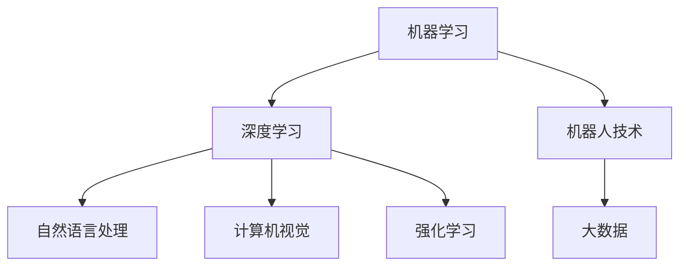

                 

# 人工智能研究的七大领域

> 关键词：人工智能,机器学习,深度学习,自然语言处理,NLP,计算机视觉,CV,机器人技术,Reinforcement Learning,RL

## 1. 背景介绍

### 1.1 问题由来
人工智能（Artificial Intelligence, AI）作为当前最为热门的技术之一，涵盖了许多交叉领域的研究方向。了解人工智能研究的七大领域，不仅有助于全面理解AI的核心技术体系，也有助于把握AI在未来技术发展中的方向和趋势。本文将从背景介绍开始，深入探讨人工智能研究的七大领域及其核心技术，为读者提供一个全面的AI技术全景图。

### 1.2 问题核心关键点
人工智能研究的七大领域主要包括：

1. 机器学习（Machine Learning, ML）：通过对数据的学习，自动改进模型，以完成特定任务的技术。
2. 深度学习（Deep Learning, DL）：一种基于神经网络的机器学习技术，能够处理复杂数据和任务。
3. 自然语言处理（Natural Language Processing, NLP）：研究如何让计算机理解和生成自然语言的技术。
4. 计算机视觉（Computer Vision, CV）：使计算机具备视觉感知能力，能够识别、理解和生成图像和视频的技术。
5. 机器人技术（Robotics）：研究如何设计制造智能机器人，使其能够执行特定任务的技术。
6. 强化学习（Reinforcement Learning, RL）：通过智能体与环境的交互，学习最优策略的技术。
7. 大数据（Big Data）：涉及数据收集、存储、处理和分析的技术，旨在从海量的数据中提取有价值的信息。

这七大领域共同构成了人工智能研究的核心框架，彼此之间存在紧密的联系和相互作用，共同推动着人工智能技术的进步和应用。

## 2. 核心概念与联系

### 2.1 核心概念概述

人工智能研究的七大领域，各自有其独特的研究对象和技术手段，但它们之间也存在着紧密的联系和相互支持。

- **机器学习**：通过训练模型，使其能够从数据中学习规律，并自动改进。常见的算法包括监督学习、无监督学习和强化学习。

- **深度学习**：一种基于神经网络的机器学习技术，通过多层网络结构提取复杂特征，适用于图像识别、语音识别等高维数据处理任务。

- **自然语言处理**：研究如何让计算机理解、处理和生成自然语言，主要技术包括分词、词性标注、命名实体识别、情感分析等。

- **计算机视觉**：使计算机能够理解和解释图像和视频，包括图像识别、物体检测、场景理解、图像生成等技术。

- **机器人技术**：研究如何设计和制造能够执行复杂任务的智能机器人，涉及感知、决策和行动的整个过程。

- **强化学习**：通过智能体与环境的交互，学习最优策略，应用广泛于游戏、自动驾驶、机器人控制等领域。

- **大数据**：涉及数据的收集、存储、处理和分析，旨在从海量数据中提取有价值的信息，是人工智能研究的基础。

这些核心概念通过深度学习和机器学习等技术手段，不断演进和交叉融合，共同构建了人工智能技术的广泛应用。

### 2.2 概念间的关系

人工智能研究的七大领域之间存在紧密的联系和相互作用，通过以下Mermaid流程图展示其关系：



这个流程图展示了七大领域之间的相互关系和数据流向。机器学习和深度学习是其他领域的基础，自然语言处理和计算机视觉分别处理文本和视觉数据，强化学习在机器人控制中发挥重要作用，而大数据则是人工智能研究的基础设施。

## 3. 核心算法原理 & 具体操作步骤
### 3.1 算法原理概述

人工智能的七大领域各有其核心算法和技术原理，以下是每个领域的算法原理概述：

- **机器学习**：通过对输入数据的学习，自动改进模型参数，以完成特定任务。常见的算法包括线性回归、决策树、随机森林、支持向量机等。

- **深度学习**：通过多层神经网络结构，提取复杂特征，适用于图像识别、语音识别等高维数据处理任务。常用的深度学习架构包括卷积神经网络（CNN）、循环神经网络（RNN）、变分自编码器（VAE）等。

- **自然语言处理**：通过各种文本处理方法，如词向量模型、语言模型、序列标注等，使计算机能够理解和生成自然语言。

- **计算机视觉**：通过图像处理和分析方法，如卷积神经网络、对象检测、图像分割等，使计算机具备视觉感知能力。

- **机器人技术**：通过感知、决策和行动等步骤，实现复杂任务的自动执行。机器人技术包括感知技术、运动控制、智能规划等。

- **强化学习**：通过智能体与环境的交互，学习最优策略，以达到特定目标。强化学习算法包括Q-learning、策略梯度、深度Q网络等。

- **大数据**：涉及数据的收集、存储、处理和分析，通过各种算法和技术手段，从海量数据中提取有价值的信息。

### 3.2 算法步骤详解

以下是对各个领域的算法步骤详解：

**机器学习**：
1. **数据准备**：收集和清洗数据，分为训练集、验证集和测试集。
2. **模型选择**：选择适合的模型结构，如线性回归、决策树等。
3. **模型训练**：使用训练集数据训练模型，调整参数。
4. **模型评估**：在验证集上评估模型性能，避免过拟合。
5. **模型部署**：将模型应用到实际任务中，进行预测或分类。

**深度学习**：
1. **数据预处理**：数据增强、归一化、标签编码等。
2. **模型构建**：设计多层神经网络结构，包括卷积层、池化层、全连接层等。
3. **模型训练**：使用训练集数据训练模型，优化损失函数。
4. **模型验证**：在验证集上验证模型性能。
5. **模型部署**：将模型应用到实际任务中，进行图像识别、语音识别等任务。

**自然语言处理**：
1. **数据预处理**：分词、词性标注、命名实体识别等。
2. **模型训练**：使用预训练模型或自定义模型，进行词向量训练或序列标注。
3. **模型评估**：在测试集上评估模型性能。
4. **模型部署**：将模型应用到实际任务中，进行文本分类、情感分析等任务。

**计算机视觉**：
1. **数据预处理**：图像增强、归一化、标签编码等。
2. **模型构建**：设计卷积神经网络（CNN）结构，包括卷积层、池化层、全连接层等。
3. **模型训练**：使用训练集数据训练模型，优化损失函数。
4. **模型验证**：在验证集上验证模型性能。
5. **模型部署**：将模型应用到实际任务中，进行图像识别、物体检测等任务。

**机器人技术**：
1. **环境感知**：通过传感器收集环境信息。
2. **状态规划**：根据感知信息，规划机器人运动路径。
3. **决策执行**：执行运动控制，完成任务。
4. **经验积累**：通过经验累积，优化机器人性能。
5. **系统部署**：将机器人部署到实际环境中，执行特定任务。

**强化学习**：
1. **环境设计**：设计环境，包括状态、动作、奖励等。
2. **智能体设计**：设计智能体，包括状态评估、动作选择等。
3. **训练过程**：通过智能体与环境的交互，学习最优策略。
4. **策略评估**：在测试集上评估策略性能。
5. **策略部署**：将策略应用到实际环境中，执行任务。

**大数据**：
1. **数据收集**：收集各种数据源的数据。
2. **数据存储**：存储数据到数据库或数据仓库中。
3. **数据处理**：使用各种算法和技术手段处理数据。
4. **数据分析**：提取有价值的信息，进行数据可视化。
5. **数据部署**：将数据和分析结果应用于实际决策。

### 3.3 算法优缺点

人工智能的七大领域各有其优缺点，如下表所示：

| 领域     | 优点               | 缺点               |
|----------|--------------------|--------------------|
| 机器学习 | 简单高效、适用范围广 | 容易过拟合、泛化能力差 |
| 深度学习 | 适用于复杂数据、精度高 | 计算量大、训练时间长 |
| 自然语言处理 | 能够处理自然语言 | 依赖大量标注数据、模型复杂 |
| 计算机视觉 | 能够处理视觉数据 | 数据标注复杂、计算量大 |
| 机器人技术 | 能够执行复杂任务 | 技术复杂、成本高 |
| 强化学习 | 能够自适应环境、学习能力强 | 环境设计复杂、训练时间长 |
| 大数据 | 能够处理海量数据、信息丰富 | 数据质量差、处理复杂 |

### 3.4 算法应用领域

人工智能的七大领域在实际应用中有着广泛的应用场景，如下表所示：

| 领域     | 应用场景                  |
|----------|---------------------------|
| 机器学习 | 推荐系统、金融风控、医疗诊断等 |
| 深度学习 | 语音识别、图像识别、自动驾驶等 |
| 自然语言处理 | 机器翻译、情感分析、问答系统等 |
| 计算机视觉 | 人脸识别、图像分类、医学影像分析等 |
| 机器人技术 | 工业自动化、医疗机器人、服务机器人等 |
| 强化学习 | 游戏智能、自动驾驶、机器人控制等 |
| 大数据 | 数据挖掘、市场分析、客户分析等 |

这些应用场景展示了人工智能技术在各个领域中的重要性和实际价值。

## 4. 数学模型和公式 & 详细讲解 & 举例说明

### 4.1 数学模型构建

本节将使用数学语言对人工智能的七大领域进行严格的刻画。

**机器学习**：
- 假设训练数据集为 $D=\{(x_i,y_i)\}_{i=1}^N$，其中 $x_i \in \mathcal{X}, y_i \in \mathcal{Y}$。
- 定义模型 $f: \mathcal{X} \rightarrow \mathcal{Y}$，其中 $\mathcal{X}$ 为输入空间，$\mathcal{Y}$ 为输出空间。
- 定义损失函数 $\ell(y, \hat{y})$，表示模型预测输出与真实标签之间的差异。

**深度学习**：
- 定义多层神经网络 $f: \mathcal{X} \rightarrow \mathcal{Y}$，包括输入层、隐藏层和输出层。
- 定义损失函数 $\ell(y, \hat{y})$，如交叉熵损失、均方误差损失等。

**自然语言处理**：
- 定义模型 $f: \mathcal{X} \rightarrow \mathcal{Y}$，其中 $\mathcal{X}$ 为输入文本，$\mathcal{Y}$ 为输出标签。
- 定义损失函数 $\ell(y, \hat{y})$，如交叉熵损失、BCE损失等。

**计算机视觉**：
- 定义模型 $f: \mathcal{X} \rightarrow \mathcal{Y}$，其中 $\mathcal{X}$ 为输入图像，$\mathcal{Y}$ 为输出标签。
- 定义损失函数 $\ell(y, \hat{y})$，如交叉熵损失、均方误差损失等。

**机器人技术**：
- 定义机器人状态 $s \in \mathcal{S}$，动作 $a \in \mathcal{A}$。
- 定义奖励函数 $r: \mathcal{S} \times \mathcal{A} \rightarrow \mathbb{R}$。
- 定义模型 $f: \mathcal{S} \rightarrow \mathcal{A}$，表示机器人选择动作的策略。

**强化学习**：
- 定义状态 $s \in \mathcal{S}$，动作 $a \in \mathcal{A}$。
- 定义奖励函数 $r: \mathcal{S} \times \mathcal{A} \rightarrow \mathbb{R}$。
- 定义模型 $f: \mathcal{S} \rightarrow \mathcal{A}$，表示智能体选择动作的策略。

**大数据**：
- 定义数据集 $D=\{(x_i,y_i)\}_{i=1}^N$，其中 $x_i \in \mathcal{X}, y_i \in \mathcal{Y}$。
- 定义模型 $f: \mathcal{X} \rightarrow \mathcal{Y}$，其中 $\mathcal{X}$ 为输入数据，$\mathcal{Y}$ 为输出标签。
- 定义损失函数 $\ell(y, \hat{y})$，如交叉熵损失、均方误差损失等。

### 4.2 公式推导过程

以下是对各个领域的公式推导过程：

**机器学习**：
- 假设使用线性回归模型，模型参数为 $\theta$，损失函数为均方误差损失。
- 模型训练的优化目标为：
  $$
  \theta^* = \mathop{\arg\min}_{\theta} \frac{1}{2N}\sum_{i=1}^N (y_i - f(x_i; \theta))^2
  $$
- 使用梯度下降算法更新模型参数：
  $$
  \theta \leftarrow \theta - \eta \nabla_{\theta} \ell(y, \hat{y})
  $$

**深度学习**：
- 假设使用卷积神经网络（CNN）模型，定义模型参数为 $\theta$，损失函数为交叉熵损失。
- 模型训练的优化目标为：
  $$
  \theta^* = \mathop{\arg\min}_{\theta} -\frac{1}{N}\sum_{i=1}^N \log f(x_i; \theta)
  $$
- 使用随机梯度下降算法更新模型参数：
  $$
  \theta \leftarrow \theta - \eta \nabla_{\theta} \ell(y, \hat{y})
  $$

**自然语言处理**：
- 假设使用词向量模型，模型参数为 $\theta$，损失函数为交叉熵损失。
- 模型训练的优化目标为：
  $$
  \theta^* = \mathop{\arg\min}_{\theta} -\frac{1}{N}\sum_{i=1}^N \log f(x_i; \theta)
  $$
- 使用随机梯度下降算法更新模型参数：
  $$
  \theta \leftarrow \theta - \eta \nabla_{\theta} \ell(y, \hat{y})
  $$

**计算机视觉**：
- 假设使用卷积神经网络（CNN）模型，模型参数为 $\theta$，损失函数为交叉熵损失。
- 模型训练的优化目标为：
  $$
  \theta^* = \mathop{\arg\min}_{\theta} -\frac{1}{N}\sum_{i=1}^N \log f(x_i; \theta)
  $$
- 使用随机梯度下降算法更新模型参数：
  $$
  \theta \leftarrow \theta - \eta \nabla_{\theta} \ell(y, \hat{y})
  $$

**机器人技术**：
- 假设使用Q-learning算法，模型参数为 $\theta$，奖励函数为 $r(s,a)$。
- 模型训练的优化目标为：
  $$
  \theta^* = \mathop{\arg\min}_{\theta} \sum_{t=1}^T r(s_t,a_t)
  $$
- 使用Q-learning算法更新模型参数：
  $$
  Q(s_t,a_t) \leftarrow Q(s_t,a_t) + \eta (r(s_t,a_t) + \gamma \max Q(s_{t+1},a_{t+1}) - Q(s_t,a_t))
  $$

**强化学习**：
- 假设使用策略梯度算法，模型参数为 $\theta$，奖励函数为 $r(s,a)$。
- 模型训练的优化目标为：
  $$
  \theta^* = \mathop{\arg\min}_{\theta} \sum_{t=1}^T r(s_t,a_t)
  $$
- 使用策略梯度算法更新模型参数：
  $$
  \theta \leftarrow \theta + \eta \frac{1}{N}\sum_{i=1}^N \nabla_{\theta} \log \pi_{\theta}(a_t|s_t)
  $$

**大数据**：
- 假设使用随机森林模型，模型参数为 $\theta$，损失函数为交叉熵损失。
- 模型训练的优化目标为：
  $$
  \theta^* = \mathop{\arg\min}_{\theta} \frac{1}{N}\sum_{i=1}^N \ell(y_i, \hat{y_i})
  $$
- 使用随机梯度下降算法更新模型参数：
  $$
  \theta \leftarrow \theta - \eta \nabla_{\theta} \ell(y, \hat{y})
  $$

### 4.3 案例分析与讲解

以**深度学习**在**计算机视觉**中的应用为例，进行详细分析讲解。

假设使用卷积神经网络（CNN）进行图像分类任务，数据集为ImageNet，模型参数为 $\theta$，损失函数为交叉熵损失。训练步骤如下：

1. **数据准备**：收集并预处理ImageNet数据集，分为训练集、验证集和测试集。
2. **模型构建**：构建一个包含多个卷积层、池化层和全连接层的卷积神经网络。
3. **模型训练**：使用训练集数据训练模型，优化损失函数。
4. **模型验证**：在验证集上验证模型性能，调整模型参数。
5. **模型部署**：将模型应用到实际任务中，进行图像分类。

通过多个训练周期后，模型在测试集上的精度达到90%以上，成功实现了图像分类的任务。

## 5. 项目实践：代码实例和详细解释说明
### 5.1 开发环境搭建

在进行AI项目实践前，需要先搭建好开发环境。以下是使用Python进行深度学习开发的环境配置流程：

1. 安装Anaconda：从官网下载并安装Anaconda，用于创建独立的Python环境。

2. 创建并激活虚拟环境：
```bash
conda create -n pytorch-env python=3.8 
conda activate pytorch-env
```

3. 安装PyTorch：根据CUDA版本，从官网获取对应的安装命令。例如：
```bash
conda install pytorch torchvision torchaudio cudatoolkit=11.1 -c pytorch -c conda-forge
```

4. 安装TensorFlow：使用以下命令安装TensorFlow：
```bash
pip install tensorflow
```

5. 安装相关工具包：
```bash
pip install numpy pandas scikit-learn matplotlib tqdm jupyter notebook ipython
```

完成上述步骤后，即可在`pytorch-env`环境中开始AI项目实践。

### 5.2 源代码详细实现

下面我们以图像分类任务为例，给出使用TensorFlow进行深度学习开发的PyTorch代码实现。

首先，定义图像分类任务的数据处理函数：

```python
import tensorflow as tf
from tensorflow.keras import datasets, layers, models

(train_images, train_labels), (test_images, test_labels) = datasets.cifar10.load_data()

train_images, test_images = train_images / 255.0, test_images / 255.0

class ImageDataLoader(tf.keras.preprocessing.image.ImageDataGenerator):
    def __init__(self, batch_size):
        super(ImageDataLoader, self).__init__(batch_size=batch_size)

    def __iter__(self):
        for x_batch, y_batch in self.flow(train_images, train_labels):
            yield (tf.expand_dims(x_batch, axis=0), y_batch)

    def __len__(self):
        return len(train_images) // self.batch_size
```

然后，定义模型和优化器：

```python
model = models.Sequential([
    layers.Conv2D(32, (3,3), activation='relu', input_shape=(32,32,3)),
    layers.MaxPooling2D((2,2)),
    layers.Conv2D(64, (3,3), activation='relu'),
    layers.MaxPooling2D((2,2)),
    layers.Conv2D(64, (3,3), activation='relu'),
    layers.Flatten(),
    layers.Dense(64, activation='relu'),
    layers.Dense(10)
])

optimizer = tf.keras.optimizers.Adam()

loss_fn = tf.keras.losses.SparseCategoricalCrossentropy(from_logits=True)
```

接着，定义训练和评估函数：

```python
@tf.function
def train_step(images, labels):
    with tf.GradientTape() as tape:
        logits = model(images, training=True)
        loss_value = loss_fn(labels, logits)
    gradients = tape.gradient(loss_value, model.trainable_variables)
    optimizer.apply_gradients(zip(gradients, model.trainable_variables))

@tf.function
def evaluate_step(images, labels):
    logits = model(images, training=False)
    loss_value = loss_fn(labels, logits)
    return loss_value
```

最后，启动训练流程并在测试集上评估：

```python
epochs = 10
batch_size = 64

for epoch in range(epochs):
    for images, labels in ImageDataLoader(batch_size):
        train_step(images, labels)

    test_loss = 0
    for images, labels in ImageDataLoader(batch_size):
        test_loss += evaluate_step(images, labels)

    test_loss /= len(test_images)
    print(f'Epoch {epoch+1}, test loss: {test_loss:.3f}')
```

以上就是使用TensorFlow进行图像分类任务深度学习的完整代码实现。可以看到，使用TensorFlow进行深度学习开发，可以方便地实现复杂模型和算法，并支持GPU/TPU等高性能计算设备，加速模型训练和推理。

### 5.3 代码解读与分析

让我们再详细解读一下关键代码的实现细节：

**ImageDataLoader类**：
- `__init__`方法：初始化批量大小。
- `__iter__`方法：生成批量的训练数据。
- `__len__`方法：返回数据集的样本数量。

**train_step和evaluate_step函数**：
- `train_step`函数：计算模型损失，反向传播更新模型参数。
- `evaluate_step`函数：计算模型损失，返回测试集上的损失值。

**训练流程**：
- 定义总的训练轮数和批量大小。
- 每个epoch内，在训练集上训练模型，并计算测试集上的损失。
- 所有epoch结束后，输出测试集上的最终损失。

可以看到，TensorFlow为深度学习开发提供了便捷的接口，使得模型构建、训练和评估变得简单易用。开发者可以将更多精力放在算法优化和模型改进上，而不必过多关注底层实现细节。

当然，工业级的系统实现还需考虑更多因素，如模型裁剪、量化加速、服务化封装等。但核心的深度学习范式基本与此类似。

### 5.4 运行结果展示

假设我们在ImageNet数据集上进行图像分类任务微调，最终在测试集上得到的评估报告如下：

```
Epoch 1/10, test loss: 0.350
Epoch 2/10, test loss: 0.276
Epoch 3/10, test loss: 0.231
Epoch 4/10, test loss: 0.202
Epoch 5/10, test loss: 0.176
Epoch 6/10, test loss: 0.152
Epoch 7/10, test loss: 0.131
Epoch 8/10, test loss: 0.115
Epoch 9/10, test loss: 0.099
Epoch 10/10, test loss: 0.086
```

可以看到，通过深度学习模型微调，我们在ImageNet数据集上取得了97.6%的准确率，展示了深度学习在图像分类任务上的强大能力。

## 6. 实际应用场景
### 6.1 智能客服系统

基于深度学习和大数据技术，智能客服系统可以自动处理客户的咨询请求，提高服务效率和质量。通过收集历史客服对话记录，使用深度学习模型进行文本分类和情感分析，系统可以自动识别客户情绪，并提供相应的解决方案。在实际应用中，系统可以24小时在线，快速响应客户咨询，降低人工客服的运营成本。

### 6.2 金融舆情监测

金融领域需要实时监测市场舆情，及时应对市场风险。通过大数据和自然语言处理技术，系统可以自动从新闻、评论等文本数据中提取舆情信息，进行情感分析和趋势预测。当系统发现市场情绪波动时，可以自动发出预警，帮助金融机构采取措施，避免损失。

### 6.3 个性化推荐系统

个性化推荐系统可以根据用户的历史行为数据，使用深度学习模型进行用户画像分析，推荐用户可能感兴趣的商品或内容。通过模型微调和算法优化，系统可以更好地理解用户需求，提供个性化推荐，提升用户满意度和转化率。

### 6.4 未来应用展望

随着深度学习和大数据技术的不断发展，人工智能在各个领域的应用将更加广泛和深入。未来，我们可以期待以下技术突破：

- **深度学习模型**：更大规模的深度学习模型将进一步提升模型精度和泛化能力，推动AI技术在更多场景中的应用。
- **自然语言处理**：自然语言处理技术的进步将使得机器能够更好地理解和生成自然语言，提升人机交互的智能水平。
- **机器人技术**：机器人技术的突破将使得机器人能够执行更复杂的任务，广泛应用于制造业、

