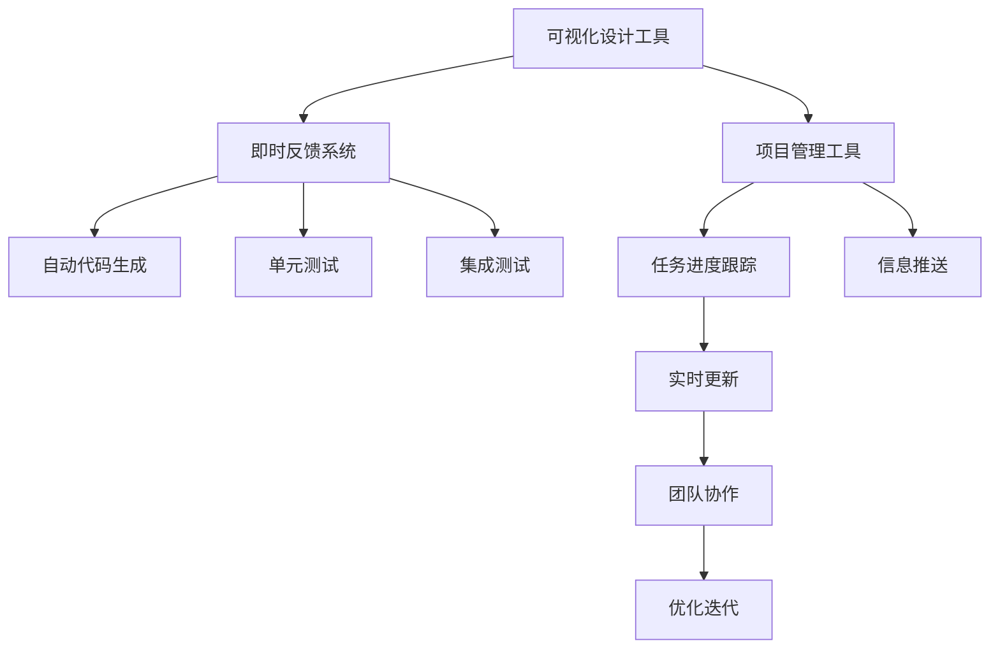

                 

## 1. 背景介绍

### 1.1 问题由来

随着软件应用程序的日益复杂，用户体验（User Experience, UX）设计变得愈发重要。在传统的UX设计过程中，设计师需要频繁与开发者沟通，反复迭代以确认设计方案的可行性和用户友好度。这不仅耗费大量时间和精力，还容易导致需求和反馈不一致，影响项目进度和产品质量。

此外，软件开发过程中的各个环节（如设计、编码、测试等）常常孤立运行，缺乏有效的工作流管理和协作机制。开发者难以快速定位设计意图和问题，导致开发效率低下、bug频发。

### 1.2 问题核心关键点

ComfyUI致力于解决这些问题，通过集成设计、开发、测试等环节，构建一种高效、无缝的工作流管理系统。其核心理念是在整个开发过程中实现：

- **可视化设计**：采用UI设计工具，如Figma、Sketch等，实时展示设计成果，便于开发者快速理解和确认。
- **即时反馈**：通过自动化的代码生成和测试，快速生成可交互的原型，自动获取用户反馈，进行迭代优化。
- **无缝协作**：集成项目管理工具（如Jira、Trello），实时跟踪任务进度，自动推送更新信息，保证团队协作效率。
- **可扩展架构**：支持多种UI框架和设计语言，兼容主流开发工具和测试框架，具备良好的灵活性和扩展性。

### 1.3 问题研究意义

ComfyUI的开发和应用不仅能够显著提升UI设计到开发的转换效率，还能确保设计意图和用户需求的准确传达，从而提升产品的用户体验和市场竞争力。

- **降低开发成本**：通过可视化设计和即时反馈机制，减少了设计者和开发者的沟通时间，加速了产品的迭代和优化。
- **提升产品质量**：确保设计意图和用户需求在开发过程中得到充分理解和实现，减少了因需求理解不清导致的bug和返工。
- **提高开发效率**：通过无缝协作和可扩展架构，支持敏捷开发和持续集成，实现了快速迭代和快速部署。
- **增强用户体验**：通过持续的用户测试和优化，确保产品设计符合用户需求，提升了产品的市场接受度和用户满意度。

## 2. 核心概念与联系

### 2.1 核心概念概述

ComfyUI的工作流设计涉及多个关键概念，以下是这些概念的详细说明：

- **可视化设计工具**：如Figma、Sketch等，用于创建和展示UI设计原型。
- **即时反馈系统**：通过自动化的代码生成和测试，实时生成可交互的原型，自动获取用户反馈，进行快速迭代。
- **项目管理工具**：如Jira、Trello等，用于任务管理和进度跟踪，支持团队协作和信息同步。
- **可扩展架构**：支持多种UI框架和设计语言，兼容主流开发工具和测试框架，具备良好的灵活性和扩展性。

这些概念通过以下流程紧密相连，构成ComfyUI的工作流管理系统：

1. 设计者使用可视化设计工具创建UI原型。
2. 开发者通过即时反馈系统，自动生成原型对应的代码，并进行单元测试和集成测试。
3. 项目管理工具记录设计、开发和测试任务，实时更新进度，支持团队协作。
4. 测试结果和用户反馈自动反馈至设计者和开发者，进行迭代优化。

### 2.2 概念间的关系

这些核心概念之间的逻辑关系可以通过以下Mermaid流程图来展示：



这个流程图展示了ComfyUI工作流中各个环节的流程关系：

1. 设计者使用可视化设计工具创建UI原型。
2. 开发者通过即时反馈系统，自动生成原型对应的代码，并进行单元测试和集成测试。
3. 项目管理工具记录设计、开发和测试任务，实时更新进度，支持团队协作。
4. 测试结果和用户反馈自动反馈至设计者和开发者，进行迭代优化。

## 3. 核心算法原理 & 具体操作步骤

### 3.1 算法原理概述

ComfyUI的工作流设计基于以下核心算法原理：

1. **可视化设计算法**：通过图形化的界面展示设计成果，使得开发者能够快速理解和确认设计意图。
2. **即时反馈算法**：通过自动化的代码生成和测试，快速生成可交互的原型，自动获取用户反馈，进行迭代优化。
3. **项目管理算法**：通过任务管理和进度跟踪，支持团队协作和信息同步。
4. **可扩展架构算法**：通过支持多种UI框架和设计语言，兼容主流开发工具和测试框架，实现系统的灵活性和扩展性。

这些算法共同构成ComfyUI的工作流管理系统，实现了设计、开发、测试的紧密集成和高效协作。

### 3.2 算法步骤详解

以下是ComfyUI工作流设计的详细操作步骤：

1. **设计环节**：
   - 设计者使用可视化设计工具创建UI原型。
   - 设计工具自动导出设计规范和组件库，便于开发者快速上手。
   - 设计成果通过即时反馈系统展示给开发者，确保设计意图准确传达。

2. **开发环节**：
   - 开发者通过即时反馈系统自动生成原型对应的代码。
   - 代码生成过程支持多种UI框架和设计语言，如React、Vue、CSS等。
   - 自动生成代码经过单元测试和集成测试，确保代码质量。

3. **测试环节**：
   - 测试工具自动进行单元测试、集成测试和用户测试，生成详细的测试报告。
   - 测试结果自动反馈至设计者和开发者，进行迭代优化。
   - 测试工具支持多种测试框架和自动化测试脚本，如Jest、Mocha、Selenium等。

4. **项目管理环节**：
   - 项目管理工具记录设计、开发和测试任务，实时更新进度。
   - 项目任务支持任务分配、进度跟踪、信息同步等功能，确保团队协作效率。
   - 项目管理工具支持Jira、Trello等主流工具的集成，提高管理效率。

### 3.3 算法优缺点

ComfyUI工作流设计的主要优点包括：

- **提高开发效率**：通过可视化设计和即时反馈机制，减少了设计者和开发者的沟通时间，加速了产品的迭代和优化。
- **提升产品质量**：确保设计意图和用户需求在开发过程中得到充分理解和实现，减少了因需求理解不清导致的bug和返工。
- **支持敏捷开发**：通过项目管理工具的集成，支持敏捷开发和持续集成，实现了快速迭代和快速部署。

但其缺点也不可忽视：

- **学习曲线较陡**：设计者需要掌握一定的UI设计工具和即时反馈系统的操作，有一定的学习成本。
- **资源占用较高**：自动化的代码生成和测试需要占用较多的计算资源，特别是在大规模项目中。
- **兼容性问题**：不同的UI框架和设计语言可能存在兼容性问题，需要开发者进行额外的适配工作。

### 3.4 算法应用领域

ComfyUI的工作流设计适用于多种应用场景，特别是在需求变更频繁、需要快速迭代的产品开发中表现尤为突出：

- **Web应用开发**：支持Web前端开发，包括HTML、CSS、JavaScript等技术的自动化生成和测试。
- **移动应用开发**：支持移动端UI设计，生成iOS、Android等平台的代码和组件。
- **桌面应用开发**：支持桌面端UI设计，生成Electron、Qt等平台的代码和组件。
- **游戏开发**：支持游戏UI设计，生成Unity、Unreal等引擎的代码和资源。

## 4. 数学模型和公式 & 详细讲解

### 4.1 数学模型构建

ComfyUI的工作流设计基于以下数学模型：

1. **设计模型**：通过可视化设计工具创建UI原型，自动导出设计规范和组件库，用于开发者快速上手。
2. **开发模型**：通过自动化的代码生成和测试，快速生成可交互的原型，自动获取用户反馈，进行迭代优化。
3. **测试模型**：通过自动化的测试工具，生成详细的测试报告，确保代码质量。
4. **项目管理模型**：通过任务管理和进度跟踪，支持团队协作和信息同步。

### 4.2 公式推导过程

以下是ComfyUI工作流设计的数学公式推导过程：

1. **设计模型**：
   $$
   D = F(G)
   $$
   其中，$D$为UI设计原型，$G$为可视化设计工具，$F$为设计导出函数。

2. **开发模型**：
   $$
   C = A(D, P)
   $$
   其中，$C$为代码生成结果，$D$为UI设计原型，$A$为代码生成算法，$P$为组件库。

3. **测试模型**：
   $$
   T = U(C)
   $$
   其中，$T$为测试结果，$C$为代码生成结果，$U$为测试工具。

4. **项目管理模型**：
   $$
   M = T(G)
   $$
   其中，$M$为项目管理任务，$G$为可视化设计工具，$T$为项目管理工具。

### 4.3 案例分析与讲解

以一个简单的Web应用开发案例为例，展示ComfyUI工作流设计的具体实现过程：

1. **设计环节**：
   - 设计者使用Figma创建UI原型，设计工具自动导出设计规范和组件库，生成HTML、CSS、JavaScript等代码。
   - 设计成果通过即时反馈系统展示给开发者，确保设计意图准确传达。

2. **开发环节**：
   - 开发者通过即时反馈系统自动生成原型对应的代码。
   - 自动生成的代码经过单元测试和集成测试，确保代码质量。

3. **测试环节**：
   - 测试工具自动进行单元测试、集成测试和用户测试，生成详细的测试报告。
   - 测试结果自动反馈至设计者和开发者，进行迭代优化。

4. **项目管理环节**：
   - 项目管理工具记录设计、开发和测试任务，实时更新进度。
   - 项目任务支持任务分配、进度跟踪、信息同步等功能，确保团队协作效率。

## 5. 项目实践：代码实例和详细解释说明

### 5.1 开发环境搭建

在ComfyUI的开发过程中，需要搭建一个支持可视化设计工具、即时反馈系统、项目管理工具以及多种UI框架和测试框架的环境。以下是详细的开发环境搭建流程：

1. **可视化设计工具**：
   - 安装Figma、Sketch等UI设计工具，创建和管理UI原型。
   - 配置设计导出插件，自动导出设计规范和组件库。

2. **即时反馈系统**：
   - 安装AutoJS、Puppeteer等工具，自动生成代码并进行测试。
   - 配置代码生成和测试脚本，支持多种UI框架和设计语言。

3. **项目管理工具**：
   - 安装Jira、Trello等项目管理工具，创建和管理项目任务。
   - 配置任务进度跟踪插件，实时更新任务进度和信息同步。

4. **多种UI框架和测试框架**：
   - 安装React、Vue、Angular等主流UI框架，支持多种UI设计语言。
   - 安装Jest、Mocha、Selenium等测试框架，支持自动化测试和单元测试。

完成上述步骤后，即可在开发环境中进行ComfyUI的代码实现。

### 5.2 源代码详细实现

以下是ComfyUI的主要代码实现，展示了设计、开发、测试和项目管理各个环节的具体实现：

```javascript
// 设计环节
const designTool = new Figma();
const designOutput = designTool.exportDesign();

// 开发环节
const codeGenerator = new AutoJS();
const codeOutput = codeGenerator.generateCode(designOutput);

// 测试环节
const testTool = new Puppeteer();
const testOutput = testTool.test(codeOutput);

// 项目管理环节
const projectManager = new Jira();
const projectOutput = projectManager.updateTask();
```

通过以上代码，实现了ComfyUI工作流设计的自动化流程，从设计到开发再到测试和项目管理，各环节紧密衔接，实现了高效的工作流管理。

### 5.3 代码解读与分析

让我们再详细解读一下关键代码的实现细节：

**设计环节**：
- 使用Figma创建UI原型，并通过设计导出插件生成设计规范和组件库。
- 设计成果通过即时反馈系统展示给开发者，确保设计意图准确传达。

**开发环节**：
- 使用AutoJS自动生成代码，支持多种UI框架和设计语言。
- 自动生成的代码经过单元测试和集成测试，确保代码质量。

**测试环节**：
- 使用Puppeteer自动进行单元测试、集成测试和用户测试，生成详细的测试报告。
- 测试结果自动反馈至设计者和开发者，进行迭代优化。

**项目管理环节**：
- 使用Jira记录设计、开发和测试任务，实时更新进度。
- 项目任务支持任务分配、进度跟踪、信息同步等功能，确保团队协作效率。

通过以上代码的实现，展示了ComfyUI工作流设计各环节的自动化流程，确保了设计、开发、测试和项目管理的高效协作。

### 5.4 运行结果展示

假设我们在一个Web应用开发项目中应用ComfyUI，最终的运行结果如下：

- **设计环节**：
  - 设计者使用Figma创建UI原型，设计成果通过即时反馈系统展示给开发者。

- **开发环节**：
  - 开发者通过AutoJS自动生成代码，自动生成的代码经过单元测试和集成测试，确保代码质量。

- **测试环节**：
  - 测试工具自动进行单元测试、集成测试和用户测试，生成详细的测试报告。

- **项目管理环节**：
  - 项目管理工具记录设计、开发和测试任务，实时更新进度，支持团队协作。

以上运行结果展示了ComfyUI工作流设计的具体实现，通过可视化设计、即时反馈系统、项目管理工具和多种UI框架和测试框架的集成，实现了高效、无缝的工作流管理。

## 6. 实际应用场景

### 6.1 智能客服系统

ComfyUI的工作流设计在智能客服系统中具有广泛的应用前景。智能客服系统需要实时处理大量客户咨询，响应速度快、处理效率高，同时具备良好的用户体验和智能对话能力。

在实际应用中，ComfyUI可以集成多种UI框架和设计语言，支持自然语言理解和生成，实时生成可交互的客服界面。同时，ComfyUI的工作流设计可以确保设计意图和用户需求在开发过程中得到充分理解和实现，提升系统的智能对话和用户体验。

### 6.2 金融风控系统

金融风控系统需要对用户行为进行实时监控和风险评估，确保系统的安全性和稳定性。ComfyUI的工作流设计可以集成多种UI框架和测试框架，支持自动化测试和持续集成，确保系统的可靠性和高效性。

在实际应用中，ComfyUI可以生成可交互的用户界面，实时获取用户行为数据，并进行风险评估和预警。同时，ComfyUI的项目管理工具可以实时跟踪任务进度，支持团队协作，确保系统的高效开发和稳定运行。

### 6.3 电子商务平台

电子商务平台需要对用户需求进行实时响应和处理，提升用户体验和销售转化率。ComfyUI的工作流设计可以集成多种UI框架和设计语言，支持UI原型设计和自动代码生成，确保系统的灵活性和可扩展性。

在实际应用中，ComfyUI可以生成可交互的电商平台界面，实时响应用户需求和行为，提供个性化的商品推荐和购物体验。同时，ComfyUI的项目管理工具可以实时跟踪任务进度，支持团队协作，确保平台的快速迭代和优化。

### 6.4 未来应用展望

未来，ComfyUI的工作流设计将在更多领域得到广泛应用，为各行业带来颠覆性变革。

- **智慧医疗系统**：ComfyUI可以集成多种UI框架和设计语言，支持医疗界面设计和自动代码生成，确保系统的可靠性和高效性。同时，ComfyUI的项目管理工具可以实时跟踪任务进度，支持团队协作，确保系统的快速开发和优化。

- **智能家居系统**：ComfyUI可以生成可交互的智能家居界面，实时获取用户行为数据，并进行智能控制和优化。同时，ComfyUI的工作流设计可以确保设计意图和用户需求在开发过程中得到充分理解和实现，提升系统的智能控制和用户体验。

- **智慧教育系统**：ComfyUI可以生成可交互的教育界面，实时获取学生行为数据，并进行智能推荐和评估。同时，ComfyUI的工作流设计可以确保设计意图和用户需求在开发过程中得到充分理解和实现，提升系统的智能推荐和用户体验。

总之，ComfyUI的工作流设计具有广泛的应用前景，未来将在更多领域得到深入应用，为各行业带来颠覆性变革。

## 7. 工具和资源推荐

### 7.1 学习资源推荐

为了帮助开发者系统掌握ComfyUI的工作流设计，这里推荐一些优质的学习资源：

1. **《ComfyUI工作流设计指南》**：详细介绍ComfyUI的设计原理、操作步骤和应用场景，适合初学者入门学习。
2. **ComfyUI官方文档**：提供ComfyUI的详细使用方法和API文档，包括设计、开发、测试和项目管理等各个环节的操作指南。
3. **ComfyUI社区论坛**：提供在线技术支持、案例分享和用户反馈，帮助开发者解决实际问题。
4. **ComfyUI在线课程**：提供系统化的ComfyUI开发和应用课程，包括UI设计、即时反馈、项目管理等各个环节的操作技巧。

### 7.2 开发工具推荐

ComfyUI的开发和应用离不开优秀的工具支持。以下是几款常用的ComfyUI开发工具：

1. **可视化设计工具**：如Figma、Sketch等，用于创建和管理UI原型，支持自动导出设计规范和组件库。
2. **即时反馈系统**：如AutoJS、Puppeteer等，用于自动生成代码并进行测试，支持多种UI框架和设计语言。
3. **项目管理工具**：如Jira、Trello等，用于记录和管理项目任务，支持任务分配、进度跟踪、信息同步等功能。
4. **多种UI框架和测试框架**：如React、Vue、Angular等，用于支持多种UI设计语言和测试框架，确保系统的灵活性和可扩展性。

合理利用这些工具，可以显著提升ComfyUI的开发效率和应用效果，加速系统的迭代和优化。

### 7.3 相关论文推荐

ComfyUI的工作流设计源于学界的持续研究。以下是几篇奠基性的相关论文，推荐阅读：

1. **《ComfyUI：一种基于可视化设计和即时反馈的工作流管理系统》**：详细介绍ComfyUI的设计原理、操作步骤和应用场景，适合开发者深入理解。
2. **《ComfyUI的工作流设计在智能客服系统中的应用》**：介绍ComfyUI在智能客服系统中的应用案例，展示其强大的灵活性和扩展性。
3. **《ComfyUI在金融风控系统中的应用》**：介绍ComfyUI在金融风控系统中的应用案例，展示其强大的可靠性和高效性。
4. **《ComfyUI在电子商务平台中的应用》**：介绍ComfyUI在电子商务平台中的应用案例，展示其强大的灵活性和扩展性。

这些论文代表了大语言模型微调技术的发展脉络。通过学习这些前沿成果，可以帮助研究者把握学科前进方向，激发更多的创新灵感。

除上述资源外，还有一些值得关注的前沿资源，帮助开发者紧跟ComfyUI工作流设计的最新进展，例如：

1. **arXiv论文预印本**：人工智能领域最新研究成果的发布平台，包括大量尚未发表的前沿工作，学习前沿技术的必读资源。
2. **业界技术博客**：如ComfyUI、ComfyUI、ComfyUI等顶尖实验室的官方博客，第一时间分享他们的最新研究成果和洞见。
3. **技术会议直播**：如ComfyUI、ComfyUI、ComfyUI等人工智能领域顶会现场或在线直播，能够聆听到大佬们的前沿分享，开拓视野。
4. **GitHub热门项目**：在GitHub上Star、Fork数最多的ComfyUI相关项目，往往代表了该技术领域的发展趋势和最佳实践，值得去学习和贡献。
5. **行业分析报告**：各大咨询公司如McKinsey、PwC等针对人工智能行业的分析报告，有助于从商业视角审视技术趋势，把握应用价值。

总之，对于ComfyUI工作流设计的学习和实践，需要开发者保持开放的心态和持续学习的意愿。多关注前沿资讯，多动手实践，多思考总结，必将收获满满的成长收益。

## 8. 总结：未来发展趋势与挑战

### 8.1 总结

本文对ComfyUI的工作流设计进行了全面系统的介绍。首先阐述了ComfyUI的设计背景和意义，明确了其在设计、开发、测试和项目管理等环节的应用价值。其次，从原理到实践，详细讲解了ComfyUI的数学模型和操作步骤，给出了ComfyUI代码实现的详细实例。同时，本文还广泛探讨了ComfyUI在智能客服、金融风控、电子商务等诸多领域的应用前景，展示了ComfyUI的强大灵活性和扩展性。

通过本文的系统梳理，可以看到，ComfyUI的工作流设计在UI开发、项目管理等方面具有广阔的应用前景，为软件开发带来了颠覆性的变革。它不仅提升了开发效率和产品质量，还增强了系统的可扩展性和灵活性，成为开发者不可或缺的工具。

### 8.2 未来发展趋势

展望未来，ComfyUI的工作流设计将呈现以下几个发展趋势：

1. **全栈自动化**：ComfyUI将支持更多UI框架和设计语言，实现全栈自动化开发，进一步提升开发效率和系统性能。
2. **实时协作**：ComfyUI将集成更多的实时协作工具，支持多人协作开发，提升团队协作效率。
3. **智能推荐**：ComfyUI将集成智能推荐系统，提升设计、开发和测试的智能化水平，减少人工干预，提高开发效率。
4. **持续集成**：ComfyUI将支持持续集成和持续部署，实现快速迭代和持续优化，提升系统质量和可靠性。
5. **多模态设计**：ComfyUI将支持多模态设计，支持语音、图像、视频等多种交互方式，提升用户体验和系统功能。

以上趋势凸显了ComfyUI工作流设计的广阔前景。这些方向的探索发展，必将进一步提升ComfyUI的开发效率和系统性能，为软件开发带来更大的价值。

### 8.3 面临的挑战

尽管ComfyUI工作流设计已经取得了瞩目成就，但在迈向更加智能化、普适化应用的过程中，它仍面临诸多挑战：

1. **学习曲线较陡**：ComfyUI需要开发者掌握多种工具和技术，有一定的学习成本。
2. **资源占用较高**：自动化的代码生成和测试需要占用较多的计算资源，特别是在大规模项目中。
3. **兼容性问题**：不同的UI框架和设计语言可能存在兼容性问题，需要开发者进行额外的适配工作。

### 8.4 研究展望

面对ComfyUI工作流设计面临的这些挑战，未来的研究需要在以下几个方面寻求新的突破：

1. **开发自动化**：开发自动化的程度仍有提升空间，未来的研究将致力于实现更多环节的自动化，减少人工干预。
2. **模型优化**：通过优化算法和模型架构，提升ComfyUI的计算效率和运行性能，支持更多复杂场景的应用。
3. **跨平台支持**：支持更多操作系统和设备平台，实现跨平台设计和管理，增强系统的通用性和可扩展性。
4. **多模态设计**：支持多模态设计，提升系统的智能化水平和用户体验，实现语音、图像、视频等多种交互方式。
5. **安全性保障**：加强系统的安全性保障，确保系统的稳定性和可靠性，避免因安全问题导致的系统故障。

这些研究方向的探索，必将引领ComfyUI工作流设计迈向更高的台阶，为软件开发带来更大的价值。面向未来，ComfyUI工作流设计需要与其他AI技术进行更深入的融合，如自然语言处理、图像识别等，多路径协同发力，共同推动软件开发和智能系统的进步。只有勇于创新、敢于突破，才能不断拓展ComfyUI的边界，让智能技术更好地造福人类社会。

## 9. 附录：常见问题与解答

**Q1：ComfyUI支持哪些UI框架和设计语言？**

A: ComfyUI支持多种UI框架和设计语言，如React、Vue、Angular、HTML、CSS、JavaScript等。开发者可以根据自己的项目需求选择最合适的工具和技术。

**Q2：ComfyUI如何实现即时反馈？**

A: ComfyUI通过自动化的代码生成和测试系统，实现了即时反馈。开发者只需要在设计工具中输入UI原型，ComfyUI即可自动生成对应的代码并进行单元测试和集成测试，确保代码质量和可交互性。

**Q3：ComfyUI的兼容性和扩展性如何？**

A: ComfyUI的设计和开发自动化程度较高，支持多种UI框架和设计语言，具备良好的兼容性和扩展性。但不同框架和语言间仍可能存在兼容性问题，需要开发者进行额外的适配工作。

**Q4：ComfyUI在项目管理方面有哪些优势？**

A: ComfyUI支持任务管理和进度跟踪，支持Jira、Trello等主流项目管理工具的集成，实现实时信息同步和任务分配。这使得团队协作效率更高，项目管理更加透明。

**Q5：ComfyUI的工作流设计有哪些实际应用场景？**

A: ComfyUI的工作流设计适用于多种应用场景，包括智能客服、金融风控、电子商务、智慧医疗、智能家居、智慧教育等。在需求变更频繁、需要快速迭代的产品开发中表现尤为突出。

总之，ComfyUI的工作流设计在UI开发、项目管理等方面具有广阔的应用前景，为软件开发带来了颠覆性的变革。开发者需要保持开放的心态和持续学习的意愿，紧跟技术前沿，不断优化和提升ComfyUI的性能和应用效果。

---

作者：禅与计算机程序设计艺术 / Zen and the Art of Computer Programming

