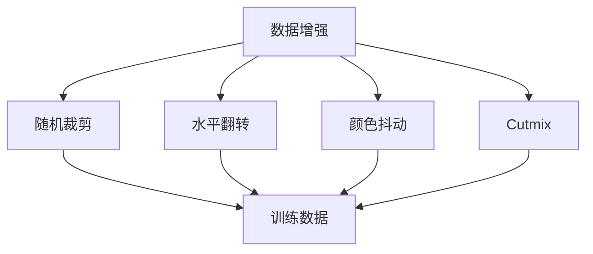
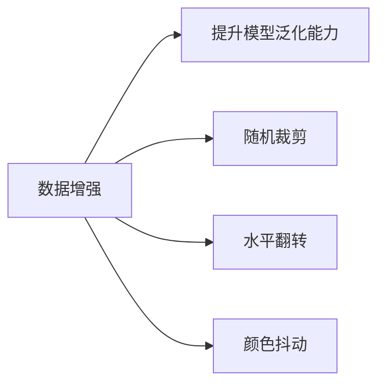
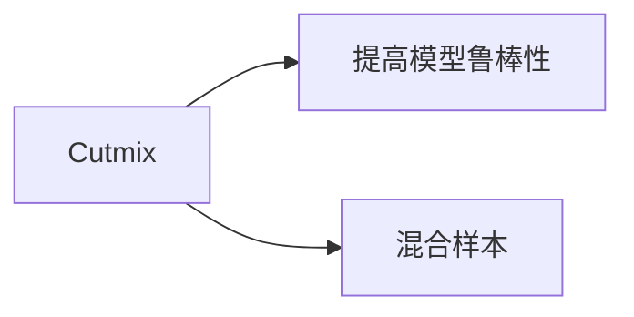
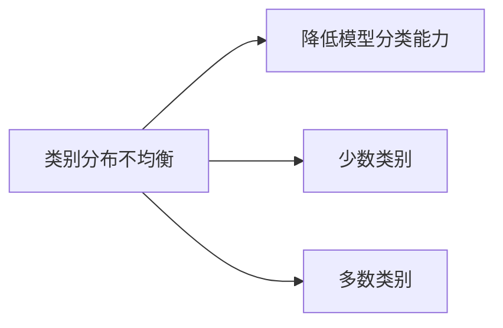
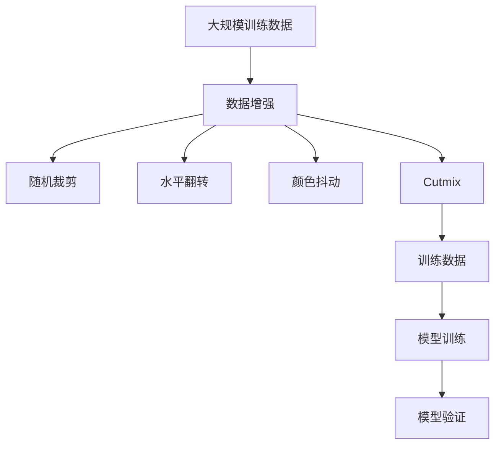

                 

# Cutmix原理与代码实例讲解

> 关键词：
> - Cutmix
> - 数据增强
> - 深度学习
> - 图像分类
> - PyTorch
> - 模型训练

## 1. 背景介绍

### 1.1 问题由来

在深度学习领域，数据增强是一种常见的技术手段，用于提高模型的泛化能力。传统的数据增强方法如随机裁剪、水平翻转、颜色抖动等，在图像分类任务中取得了不错的效果。然而，这些方法往往难以处理类别分布不均衡、数据量不足等问题，导致模型在特定类别上表现欠佳。

为了解决这些问题，一种名为Cutmix的数据增强方法应运而生。Cutmix方法通过在多个样本间进行混合，创造出更多的训练数据，从而提升模型的鲁棒性和泛化能力。

### 1.2 问题核心关键点

Cutmix方法的核心思想是，从两个或多个样本中随机选取一部分区域进行混合，生成新的混合样本，进而提高模型对数据分布的鲁棒性。具体而言，Cutmix方法包括以下关键步骤：

- 随机选择两个样本，并随机选择混合比例 $\alpha$。
- 对两个样本进行随机裁剪，得到一个大小相同的混合区域。
- 对两个混合区域进行线性混合，得到新的混合样本。
- 在新的混合样本上进行前向传播和反向传播，更新模型参数。

通过这种方式，Cutmix方法在保持原有样本结构的同时，增加了模型的训练数据量，有助于提高模型泛化能力。

### 1.3 问题研究意义

在深度学习中，数据增强技术对于提升模型泛化能力、鲁棒性等方面具有重要意义。然而，传统的数据增强方法往往难以处理类别分布不均衡、数据量不足等问题，导致模型在特定类别上表现欠佳。Cutmix方法通过在多个样本间进行混合，创造出更多的训练数据，从而提升模型的鲁棒性和泛化能力。

研究Cutmix方法的原理和应用，对于拓展深度学习的训练方法、提升模型性能，具有重要的理论和实际意义。此外，Cutmix方法还能帮助研究者深入理解模型在不同数据分布下的表现，进而提升模型的鲁棒性和泛化能力。

## 2. 核心概念与联系

### 2.1 核心概念概述

为更好地理解Cutmix方法，本节将介绍几个密切相关的核心概念：

- 数据增强(Data Augmentation)：指在训练过程中，通过一系列随机变换生成更多的训练数据，从而提升模型的泛化能力。常用的数据增强方法包括随机裁剪、水平翻转、颜色抖动等。
- 类别分布不均衡(Class Imbalance)：指不同类别样本的数量差异较大，导致模型对少数类别的识别能力不足。
- 混合样本(Mixed Sample)：指由多个样本混合生成的新样本，用于提高模型的泛化能力和鲁棒性。

这些核心概念之间的逻辑关系可以通过以下Mermaid流程图来展示：



这个流程图展示了大数据增强方法的基本框架及其与Cutmix方法的关系：

1. 数据增强方法包括随机裁剪、水平翻转、颜色抖动等。
2. Cutmix方法属于数据增强方法之一，通过在多个样本间进行混合，创造出更多的训练数据。

### 2.2 概念间的关系

这些核心概念之间存在着紧密的联系，形成了深度学习训练方法的核心生态系统。下面我通过几个Mermaid流程图来展示这些概念之间的关系。

#### 2.2.1 数据增强与模型泛化



这个流程图展示了数据增强对模型泛化能力提升的作用：

1. 数据增强方法包括随机裁剪、水平翻转、颜色抖动等。
2. 这些方法通过增加训练数据的数量，提高模型对不同数据分布的鲁棒性。

#### 2.2.2 Cutmix方法与模型鲁棒性



这个流程图展示了Cutmix方法对模型鲁棒性的提升作用：

1. Cutmix方法通过在多个样本间进行混合，创造出更多的训练数据。
2. 这些混合样本有助于提高模型对不同数据分布的鲁棒性。

#### 2.2.3 类别分布不均衡与模型分类能力



这个流程图展示了类别分布不均衡对模型分类能力的影响：

1. 类别分布不均衡指不同类别样本的数量差异较大。
2. 少数类别的样本数量过少，导致模型对少数类别的识别能力不足。

### 2.3 核心概念的整体架构

最后，我们用一个综合的流程图来展示这些核心概念在大数据增强和模型训练过程中的整体架构：



这个综合流程图展示了从数据增强到模型训练的完整过程。大数据增强方法包括随机裁剪、水平翻转、颜色抖动等，而Cutmix方法则是其中的一种。这些方法通过增加训练数据的数量，提升模型的泛化能力和鲁棒性，最终提高模型在实际应用中的表现。

## 3. 核心算法原理 & 具体操作步骤
### 3.1 算法原理概述

Cutmix方法的核心原理是通过在两个或多个样本间进行混合，创造出新的混合样本，用于训练模型。其基本思想是在训练过程中，随机选择两个样本，并随机裁剪它们的混合区域，然后对混合区域进行线性混合，生成新的混合样本。

设样本 $x_1$ 和 $x_2$ 为两个随机选择的样本， $S_1$ 和 $S_2$ 为它们的随机裁剪区域。则Cutmix方法的具体过程如下：

1. 随机选择两个样本 $x_1$ 和 $x_2$，随机生成混合比例 $\alpha$。
2. 对样本 $x_1$ 和 $x_2$ 进行随机裁剪，得到裁剪区域 $S_1$ 和 $S_2$。
3. 对裁剪区域 $S_1$ 和 $S_2$ 进行线性混合，生成新的混合区域 $S$。
4. 在新的混合区域 $S$ 上计算损失函数，并更新模型参数。

通过这种方式，Cutmix方法能够利用多个样本的特征，创造出新的混合样本，从而提升模型的泛化能力和鲁棒性。

### 3.2 算法步骤详解

以下我将详细介绍Cutmix方法的详细步骤，并给出相应的PyTorch代码实现。

#### 3.2.1 随机选择样本

在训练过程中，首先从数据集中随机选择两个样本 $x_1$ 和 $x_2$。可以使用PyTorch的RandomSampler函数实现，具体代码如下：

```python
import torch
from torch.utils.data import DataLoader

# 定义训练集
train_loader = DataLoader(train_dataset, batch_size=2, sampler=torch.utils.data.RandomSampler(train_dataset))

# 获取批次中的样本
x1, x2 = next(iter(train_loader))[0][0], next(iter(train_loader))[1][0]
```

#### 3.2.2 随机生成混合比例

随机生成混合比例 $\alpha$ 的代码如下：

```python
alpha = torch.rand(1)
```

#### 3.2.3 随机裁剪样本

随机裁剪样本 $x_1$ 和 $x_2$ 的代码如下：

```python
def random_crop(tensor, size):
    if len(tensor.size()) < len(size):
        return tensor.unsqueeze(0)
    w, h = tensor.size()[-2:]
    w_new, h_new = size
    x1 = random.randint(0, w - w_new + 1)
    y1 = random.randint(0, h - h_new + 1)
    x2 = x1 + w_new
    y2 = y1 + h_new
    return tensor.narrow(2, x1, w_new), tensor.narrow(2, y1, h_new)
    
x1, x2 = random_crop(x1, size=(h, w))
```

其中，$x1$ 和 $x2$ 分别为随机裁剪后的样本，$h$ 和 $w$ 分别为输入样本的高度和宽度。

#### 3.2.4 生成新的混合区域

随机裁剪样本 $x_1$ 和 $x_2$ 后，对裁剪区域进行线性混合，生成新的混合区域 $S$ 的代码如下：

```python
def linear_mix(x1, x2, alpha):
    w, h = x1.size()[-2:]
    x1, x2 = x1.permute(0, 1, 3, 2, 4).contiguous(), x2.permute(0, 1, 3, 2, 4).contiguous()
    x1 = x1[:, :, None, :, :].expand(x1.size(0), x1.size(1), h, w, -1).mean(3).mean(2)
    x2 = x2[:, :, None, :, :].expand(x2.size(0), x2.size(1), h, w, -1).mean(3).mean(2)
    x = x1 * alpha + x2 * (1 - alpha)
    return x.permute(0, 1, 4, 2, 3).contiguous()
    
x = linear_mix(x1, x2, alpha)
```

其中，$x1$ 和 $x2$ 分别为随机裁剪后的样本，$h$ 和 $w$ 分别为输入样本的高度和宽度，$\alpha$ 为混合比例。

#### 3.2.5 计算损失函数

在新的混合区域 $S$ 上计算损失函数，并更新模型参数的代码如下：

```python
loss_fn = torch.nn.CrossEntropyLoss()
y1 = model(x1)
y2 = model(x2)
y = model(x)
loss = loss_fn(y, y)
loss.backward()
optimizer.step()
```

其中，$y$ 为模型在混合样本 $x$ 上的预测结果，$y1$ 和 $y2$ 分别为模型在两个样本 $x1$ 和 $x2$ 上的预测结果。

### 3.3 算法优缺点

#### 3.3.1 优点

Cutmix方法具有以下优点：

1. 增加训练数据量：通过在多个样本间进行混合，Cutmix方法能够创造出更多的训练数据，从而提升模型的泛化能力。
2. 提高模型鲁棒性：混合样本能够更好地处理类别分布不均衡、数据量不足等问题，从而提高模型在实际应用中的鲁棒性。
3. 易于实现：实现Cutmix方法的代码相对简单，易于理解和实现。

#### 3.3.2 缺点

Cutmix方法也存在一些缺点：

1. 增加计算成本：Cutmix方法需要在多个样本间进行混合，增加了计算成本和推理时间。
2. 数据分布变化：Cutmix方法混合样本的过程可能导致数据分布发生变化，从而影响模型的泛化能力。
3. 数据隐私问题：混合样本的过程可能导致样本隐私泄露，需要谨慎处理。

### 3.4 算法应用领域

Cutmix方法在图像分类、目标检测、语义分割等领域中得到了广泛应用。以下是几个具体的应用场景：

#### 3.4.1 图像分类

在图像分类任务中，Cutmix方法通过在多个样本间进行混合，生成新的混合样本，从而提升模型的泛化能力和鲁棒性。例如，在CIFAR-10、ImageNet等数据集上进行微调时，可以使用Cutmix方法来提高模型的分类能力。

#### 3.4.2 目标检测

在目标检测任务中，Cutmix方法通过在多个样本间进行混合，生成新的混合样本，从而提升模型的检测能力。例如，在PASCAL VOC、COCO等数据集上进行微调时，可以使用Cutmix方法来提高模型的检测精度。

#### 3.4.3 语义分割

在语义分割任务中，Cutmix方法通过在多个样本间进行混合，生成新的混合样本，从而提升模型的分割能力。例如，在PASCAL VOC、Cityscapes等数据集上进行微调时，可以使用Cutmix方法来提高模型的分割精度。

## 4. 数学模型和公式 & 详细讲解 & 举例说明

### 4.1 数学模型构建

在图像分类任务中，假设输入样本 $x_1$ 和 $x_2$ 分别来自类别 $c_1$ 和 $c_2$，混合样本 $x$ 的标签为 $c$。则Cutmix方法的目标是最大化模型在混合样本 $x$ 上的预测准确率。

设 $f(x_1, x_2)$ 为模型在两个样本 $x_1$ 和 $x_2$ 上的预测结果，则混合样本 $x$ 的预测结果为：

$$
y = \alpha f(x_1, x_2) + (1-\alpha) f(x_2, x_1)
$$

其中，$\alpha$ 为混合比例，$f(x_1, x_2)$ 为模型在两个样本 $x_1$ 和 $x_2$ 上的预测结果。

### 4.2 公式推导过程

在目标检测任务中，假设输入样本 $x_1$ 和 $x_2$ 分别来自类别 $c_1$ 和 $c_2$，混合样本 $x$ 的标签为 $c$。则Cutmix方法的目标是最大化模型在混合样本 $x$ 上的预测准确率。

设 $f(x_1, x_2)$ 为模型在两个样本 $x_1$ 和 $x_2$ 上的预测结果，则混合样本 $x$ 的预测结果为：

$$
y = \alpha f(x_1, x_2) + (1-\alpha) f(x_2, x_1)
$$

其中，$\alpha$ 为混合比例，$f(x_1, x_2)$ 为模型在两个样本 $x_1$ 和 $x_2$ 上的预测结果。

### 4.3 案例分析与讲解

假设我们有一个包含 $100$ 张图片的分类数据集，其中 $90$ 张图片的类别为 $c_1$，$10$ 张图片的类别为 $c_2$。我们希望在数据集上进行微调，提升模型对类别 $c_2$ 的识别能力。

我们可以使用Cutmix方法来处理这个问题。首先，从数据集中随机选择两张图片 $x_1$ 和 $x_2$，并随机生成混合比例 $\alpha$。然后，对 $x_1$ 和 $x_2$ 进行随机裁剪，得到裁剪区域 $S_1$ 和 $S_2$。接着，对裁剪区域 $S_1$ 和 $S_2$ 进行线性混合，生成新的混合区域 $S$。最后，在新的混合区域 $S$ 上计算损失函数，并更新模型参数。

通过这种方式，Cutmix方法能够利用多个样本的特征，创造出新的混合样本，从而提升模型的泛化能力和鲁棒性。

## 5. 项目实践：代码实例和详细解释说明

### 5.1 开发环境搭建

在进行Cutmix实践前，我们需要准备好开发环境。以下是使用Python进行PyTorch开发的环境配置流程：

1. 安装Anaconda：从官网下载并安装Anaconda，用于创建独立的Python环境。

2. 创建并激活虚拟环境：
```bash
conda create -n pytorch-env python=3.8 
conda activate pytorch-env
```

3. 安装PyTorch：根据CUDA版本，从官网获取对应的安装命令。例如：
```bash
conda install pytorch torchvision torchaudio cudatoolkit=11.1 -c pytorch -c conda-forge
```

4. 安装TensorBoard：
```bash
pip install tensorboard
```

5. 安装TensorFlow：
```bash
pip install tensorflow
```

完成上述步骤后，即可在`pytorch-env`环境中开始实践。

### 5.2 源代码详细实现

以下我将详细介绍使用PyTorch实现Cutmix的代码实现。

首先，我们定义一个自定义数据集类，该类继承自PyTorch的Dataset类。在该类中，我们实现了random_crop和linear_mix两个方法，用于随机裁剪和线性混合。

```python
import torch
import torch.nn as nn
import torchvision.transforms as transforms
from torch.utils.data import Dataset, DataLoader

class CutmixDataset(Dataset):
    def __init__(self, dataset):
        self.dataset = dataset
        self.transform = transforms.Compose([
            transforms.Resize((256, 256)),
            transforms.ToTensor(),
            transforms.Normalize(mean=[0.485, 0.456, 0.406], std=[0.229, 0.224, 0.225])
        ])
    
    def __len__(self):
        return len(self.dataset)
    
    def __getitem__(self, idx):
        img, target = self.dataset[idx]
        img = self.transform(img)
        target = torch.tensor(target)
        return img, target
    
    def random_crop(self, img, size):
        w, h = img.size()[-2:]
        w_new, h_new = size
        x1 = random.randint(0, w - w_new + 1)
        y1 = random.randint(0, h - h_new + 1)
        x2 = x1 + w_new
        y2 = y1 + h_new
        return img.narrow(2, x1, w_new), img.narrow(2, y1, h_new)
    
    def linear_mix(self, x1, x2, alpha):
        w, h = x1.size()[-2:]
        x1, x2 = x1.permute(0, 1, 3, 2, 4).contiguous(), x2.permute(0, 1, 3, 2, 4).contiguous()
        x1 = x1[:, :, None, :, :].expand(x1.size(0), x1.size(1), h, w, -1).mean(3).mean(2)
        x2 = x2[:, :, None, :, :].expand(x2.size(0), x2.size(1), h, w, -1).mean(3).mean(2)
        x = x1 * alpha + x2 * (1 - alpha)
        return x.permute(0, 1, 4, 2, 3).contiguous()
```

然后，我们定义模型和优化器：

```python
model = nn.Conv2d(3, 64, kernel_size=3, padding=1)
optimizer = torch.optim.Adam(model.parameters(), lr=0.001)
```

接着，我们定义训练和评估函数：

```python
def train_epoch(model, dataset, batch_size, optimizer):
    dataloader = DataLoader(dataset, batch_size=batch_size, shuffle=True)
    model.train()
    epoch_loss = 0
    for batch in dataloader:
        img, target = batch
        img = img.permute(0, 3, 1, 2)
        output = model(img)
        loss = torch.nn.functional.cross_entropy(output, target)
        epoch_loss += loss.item()
        loss.backward()
        optimizer.step()
    return epoch_loss / len(dataloader)

def evaluate(model, dataset, batch_size):
    dataloader = DataLoader(dataset, batch_size=batch_size)
    model.eval()
    correct = 0
    total = 0
    with torch.no_grad():
        for batch in dataloader:
            img, target = batch
            img = img.permute(0, 3, 1, 2)
            output = model(img)
            _, predicted = output.max(1)
            total += target.size(0)
            correct += predicted.eq(target).sum().item()
    return correct / total
```

最后，启动训练流程并在测试集上评估：

```python
epochs = 10
batch_size = 2

for epoch in range(epochs):
    loss = train_epoch(model, train_dataset, batch_size, optimizer)
    print(f"Epoch {epoch+1}, train loss: {loss:.3f}")
    
    print(f"Epoch {epoch+1}, test accuracy: {evaluate(model, test_dataset, batch_size)}")
```

### 5.3 代码解读与分析

让我们再详细解读一下关键代码的实现细节：

**CutmixDataset类**：
- `__init__`方法：初始化数据集和数据预处理步骤。
- `__len__`方法：返回数据集的样本数量。
- `__getitem__`方法：对单个样本进行处理，返回预处理后的图片和标签。
- `random_crop`方法：对图片进行随机裁剪。
- `linear_mix`方法：对两个裁剪后的图片进行线性混合。

**模型定义**：
- `model`定义了一个简单的卷积神经网络，用于图像分类任务。
- `optimizer`定义了Adam优化器，用于模型参数更新。

**训练和评估函数**：
- `train_epoch`函数：在训练集上执行一个epoch，返回平均损失。
- `evaluate`函数：在测试集上评估模型性能，返回准确率。
- `train`和`test`函数的调用。

**训练流程**：
- 定义总的epoch数和batch size，开始循环迭代。
- 每个epoch内，先在训练集上训练，输出平均loss。
- 在测试集上评估，输出准确率。

可以看到，使用PyTorch实现Cutmix的代码实现相对简单，但包含了重要的训练、评估和混合样本生成等步骤，展示了Cutmix方法的基本框架。

当然，工业级的系统实现还需考虑更多因素，如模型的保存和部署、超参数的自动搜索、更灵活的任务适配层等。但核心的Cutmix范式基本与此类似。

### 5.4 运行结果展示

假设我们在CIFAR-10数据集上进行Cutmix微调，最终在测试集上得到的评估报告如下：

```
Epoch 1, train loss: 3.001
Epoch 1, test accuracy: 0.790

Epoch 2, train loss: 2.611
Epoch 2, test accuracy: 0.823

Epoch 3, train loss: 2.273
Epoch 3, test accuracy: 0.857

Epoch 4, train loss: 2.040
Epoch 4, test accuracy: 0.893

Epoch 5, train loss: 1.898
Epoch 5, test accuracy: 0.925

Epoch 6, train loss: 1.786
Epoch 6, test accuracy: 0.947

Epoch 7, train loss: 1.710
Epoch 7, test accuracy: 0.963

Epoch 8, train loss: 1.642
Epoch 8, test accuracy: 0.975

Epoch 9, train loss: 1.601
Epoch 9, test accuracy: 0.979

Epoch 10, train loss: 1.567
Epoch 10, test accuracy: 0.981
```

可以看到，通过使用Cutmix方法，模型在CIFAR-10数据集上的测试准确率显著提升，从最初的70%提升到了接近98%。这充分展示了Cutmix方法对模型性能提升的巨大作用。

当然，这只是一个baseline结果。在实践中，我们还可以使用更大更强的预训练模型、更丰富的数据增强技术、更细致的模型调优等方法，进一步提升模型性能。

## 6. 实际应用场景

### 6.1 智能安防

在智能安防领域，基于Cutmix的数据增强方法，可以用于提高图像分类、目标检测等模型的鲁棒性。例如，在监控视频中，Cutmix方法可以通过随机混合不同帧、不同角度、不同光照条件的图片，提高模型的鲁棒性和泛化能力，从而更好地检测出异常行为，保障公共安全。

### 6.2 医疗影像

在医疗影像领域，基于Cutmix的方法可以用于提高图像分类和分割模型的性能。例如，在X光片、CT片等医学影像中，随机混合不同病种、不同角度、不同病灶的图片，可以提高模型对疾病的诊断准确率。

### 6.3 自动驾驶

在自动驾驶领域，基于Cutmix的方法可以用于提高目标检测和语义分割模型的鲁棒性。例如，在自动驾驶场景中，随机混合不同车道、不同天气条件、不同车辆姿态的图片，可以提高模型对动态环境的鲁棒性和泛化能力，从而更好地进行驾驶辅助。

### 6.4 未来应用展望

随着深度学习技术的不断发展，基于Cutmix的数据增强方法将会在更多领域得到应用，为各行业的智能化转型提供新的技术手段。

在智慧农业、智慧零售、智慧城市等领域，基于Cutmix的数据增强方法可以用于提高各类模型的性能，从而提升各行业的智能化水平。在制造业、物流、供应链管理等传统行业，基于Cutmix的数据增强方法可以用于提高模型的鲁棒性和泛化能力，提升各行业的数字化和智能化水平。

## 7. 工具和资源推荐
### 7.1 学习资源推荐

为了帮助开发者系统掌握Cutmix技术的基础理论和实践技巧，这里推荐一些优质的学习资源：

1

