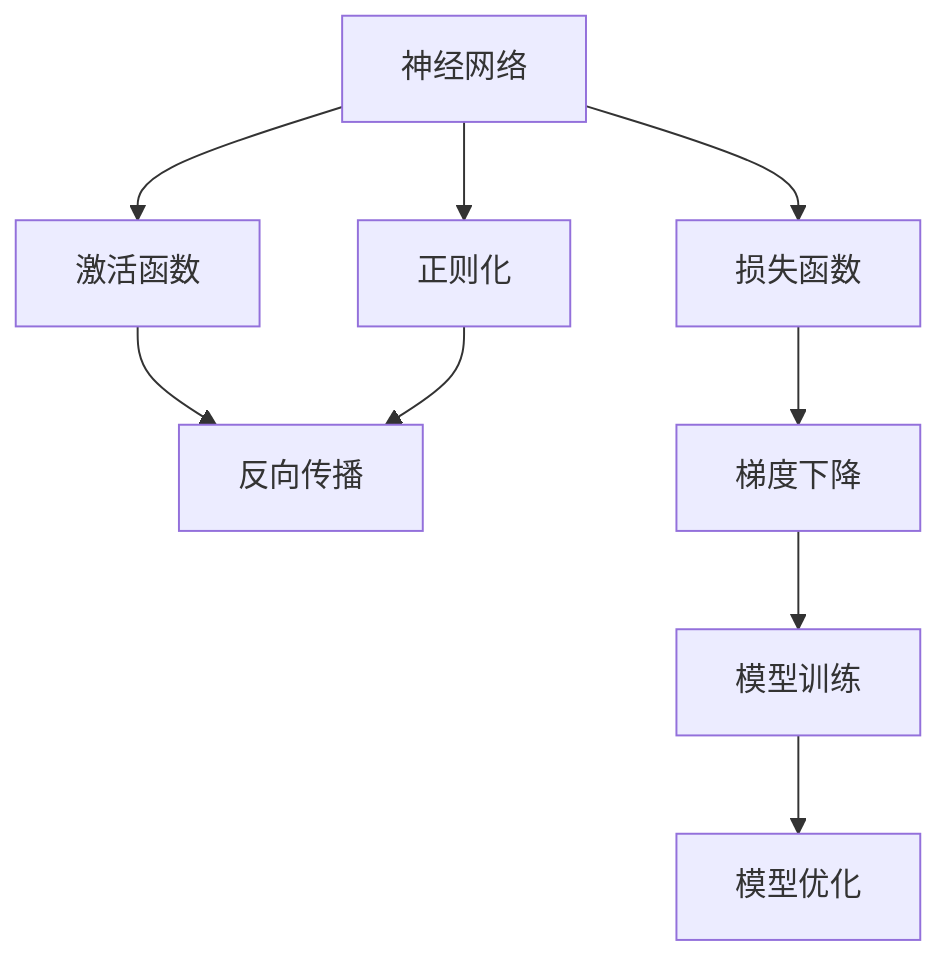
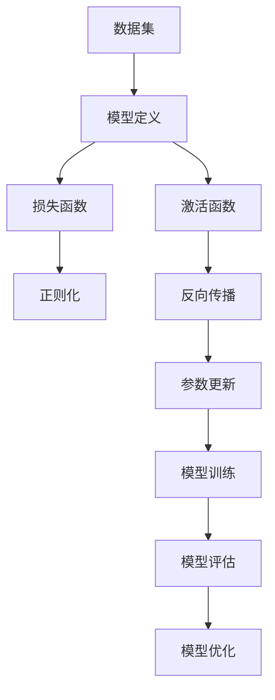

                 

# Deep Learning (DL) 原理与代码实战案例讲解

> 关键词：深度学习,DL,神经网络,代码实战,Python,PyTorch,机器学习,深度学习架构

## 1. 背景介绍

### 1.1 问题由来
深度学习（Deep Learning, DL）作为人工智能（AI）的重要分支，近年来在图像识别、语音处理、自然语言处理（NLP）、推荐系统等领域取得了突破性进展，成为科技公司争相布局的核心技术。其核心思想是使用多层次的神经网络，从数据中学习出高层次的特征表示，从而实现复杂模式的自动识别和处理。然而，尽管深度学习在理论研究上取得了丰硕成果，实际应用中的工程实践却面临着诸多挑战，例如模型的训练和优化、数据集的选择和标注、算力的需求等。

### 1.2 问题核心关键点
本文将深入探讨深度学习的原理与实践，尤其针对DL在代码实现和应用场景中的应用，旨在帮助读者系统地掌握DL的理论基础与实践技巧，提高开发效率与模型性能。核心关键点包括：

- 深度学习的基本概念与架构。
- 神经网络的设计与优化方法。
- 模型训练与调优的流程与技巧。
- 深度学习在实际应用中的案例讲解。

### 1.3 问题研究意义
深度学习在当今AI的各个领域发挥着至关重要的作用，但其实践往往需要开发者具备扎实的数学基础和编程技能。通过系统的学习与实践，读者不仅能掌握DL的核心原理，还能熟悉其实现细节与工程挑战，这对于推动DL技术在实际中的应用具有重要意义。

- 降低技术门槛：帮助没有数学背景的开发者快速上手深度学习，理解基本概念。
- 提高模型性能：通过优化模型结构和训练流程，提升模型的准确率和效率。
- 加速应用落地：深入理解DL在不同领域的应用，促进技术的实际应用与产业化。

## 2. 核心概念与联系

### 2.1 核心概念概述

为了更好地理解深度学习的原理与实践，本节将介绍几个核心概念，并阐述它们之间的联系：

- **神经网络（Neural Network）**：由大量的人工神经元通过连接构成，用于处理复杂数据模式。
- **激活函数（Activation Function）**：神经元输出非线性的函数，引入非线性变换。
- **损失函数（Loss Function）**：衡量模型预测与真实标签之间差异的函数，用于指导模型的训练。
- **正则化（Regularization）**：防止模型过拟合，提高泛化能力的技巧。
- **反向传播（Backpropagation）**：深度学习中最核心的优化算法，通过链式法则计算梯度。

### 2.2 概念间的关系

深度学习的核心概念之间存在紧密的联系，通过以下Mermaid流程图展示了这些概念的关系：



这个流程图展示了神经网络、激活函数、损失函数、正则化和反向传播等核心概念之间的关系：

1. 神经网络通过激活函数进行非线性变换。
2. 损失函数用于衡量模型的预测与真实标签之间的误差。
3. 正则化通过引入惩罚项，防止模型过拟合。
4. 反向传播算法通过链式法则计算梯度，更新模型参数。
5. 模型训练和优化是深度学习中反复迭代的过程。

### 2.3 核心概念的整体架构

最后，我们用一个综合的流程图来展示这些核心概念在深度学习模型构建中的整体架构：



这个综合流程图展示了深度学习模型构建的完整过程，从数据预处理到模型定义、损失函数定义、正则化应用、激活函数选择、反向传播算法应用、参数更新、模型训练、模型评估、模型优化，最终达到模型的优化和泛化。

## 3. 核心算法原理 & 具体操作步骤

### 3.1 算法原理概述

深度学习模型通常由多个层次的神经网络构成，每一层都对输入数据进行非线性变换，从而构建出复杂的特征表示。深度学习的核心在于通过反向传播算法不断调整模型参数，使得模型的输出与真实标签尽可能接近。

### 3.2 算法步骤详解

深度学习模型的训练过程通常包括以下几个步骤：

1. **数据预处理**：将原始数据转换为适合模型的格式，如归一化、标准化、分批等。
2. **模型定义**：定义神经网络的架构，包括输入层、隐藏层和输出层的结构。
3. **损失函数定义**：根据具体任务选择合适的损失函数，如交叉熵、均方误差等。
4. **正则化设置**：引入正则化技术，如L1、L2正则、Dropout等，避免过拟合。
5. **反向传播与参数更新**：使用梯度下降等优化算法，通过反向传播计算梯度，更新模型参数。
6. **模型训练与评估**：在训练集上训练模型，使用验证集评估模型性能，不断调整模型参数。
7. **模型优化与部署**：通过超参数调优、模型融合等手段提高模型性能，并将模型部署到实际应用中。

### 3.3 算法优缺点

深度学习的优点在于其强大的非线性建模能力和泛化能力，能处理复杂的非结构化数据。但同时，深度学习也存在以下缺点：

- **计算资源消耗大**：深度学习模型参数量巨大，训练和推理过程中需要大量的计算资源。
- **训练时间长**：深度学习模型通常需要长时间训练，才能收敛到最优解。
- **数据需求高**：深度学习模型需要大量标注数据进行训练，数据获取和标注成本高。
- **模型可解释性差**：深度学习模型往往是"黑盒"系统，难以解释其内部工作机制。

### 3.4 算法应用领域

深度学习在多个领域中得到了广泛应用，例如：

- **计算机视觉**：图像分类、目标检测、图像生成等。
- **自然语言处理**：文本分类、情感分析、机器翻译、对话系统等。
- **语音处理**：语音识别、语音合成、情感分析等。
- **推荐系统**：用户行为预测、物品推荐等。

随着深度学习技术的不断发展，其应用范围将进一步扩大，推动人工智能技术的产业化进程。

## 4. 数学模型和公式 & 详细讲解 & 举例说明

### 4.1 数学模型构建

深度学习的数学模型构建涉及多个数学概念，如向量、矩阵、张量等。以线性回归模型为例，其数学模型构建如下：

设训练集为 $(x_i,y_i)$，其中 $x_i \in \mathbb{R}^n, y_i \in \mathbb{R}$。目标为构建一个线性回归模型 $f(x)=\theta^Tx$，其中 $\theta \in \mathbb{R}^n$ 为模型参数。目标是最小化损失函数：

$$
\mathcal{L}(\theta) = \frac{1}{2N} \sum_{i=1}^N (y_i - f(x_i))^2
$$

### 4.2 公式推导过程

以线性回归模型为例，其梯度下降算法的推导如下：

1. 定义损失函数 $\mathcal{L}(\theta)$。
2. 对损失函数求导，得到梯度 $\frac{\partial \mathcal{L}}{\partial \theta}$。
3. 使用梯度下降算法更新参数 $\theta$。

$$
\theta \leftarrow \theta - \eta \nabla_{\theta}\mathcal{L}(\theta)
$$

其中 $\eta$ 为学习率，$\nabla_{\theta}\mathcal{L}(\theta)$ 为损失函数对参数 $\theta$ 的梯度。

### 4.3 案例分析与讲解

以MNIST手写数字识别为例，展示深度学习模型的应用与优化过程：

1. **数据准备**：收集MNIST数据集，进行数据预处理。
2. **模型定义**：定义一个简单的卷积神经网络（CNN）模型。
3. **损失函数与正则化**：使用交叉熵损失函数，添加L2正则。
4. **反向传播与参数更新**：使用SGD优化算法，通过反向传播计算梯度。
5. **模型训练与评估**：在训练集上训练模型，使用验证集评估模型性能。

## 5. 项目实践：代码实例和详细解释说明

### 5.1 开发环境搭建

在进行深度学习项目实践前，需要准备相应的开发环境。以下是Python环境下搭建深度学习开发环境的流程：

1. 安装Python：从官网下载并安装Python，推荐使用3.6及以上版本。
2. 安装PyTorch：使用pip安装PyTorch，建议使用conda环境管理。
3. 安装TensorFlow：使用pip安装TensorFlow，与PyTorch配合使用。
4. 安装NumPy、Matplotlib等工具包：使用pip安装常用的科学计算与绘图工具。

### 5.2 源代码详细实现

以PyTorch为例，展示线性回归模型的代码实现：

```python
import torch
import torch.nn as nn
import torch.optim as optim

# 定义模型
class LinearRegression(nn.Module):
    def __init__(self, input_dim, output_dim):
        super(LinearRegression, self).__init__()
        self.linear = nn.Linear(input_dim, output_dim)

    def forward(self, x):
        y_pred = self.linear(x)
        return y_pred

# 定义损失函数
criterion = nn.MSELoss()

# 定义优化器
learning_rate = 0.01
optimizer = optim.SGD(model.parameters(), lr=learning_rate)

# 训练模型
for epoch in range(num_epochs):
    for i, (inputs, targets) in enumerate(train_loader):
        inputs = inputs.to(device)
        targets = targets.to(device)

        # 前向传播
        outputs = model(inputs)
        loss = criterion(outputs, targets)

        # 反向传播
        optimizer.zero_grad()
        loss.backward()
        optimizer.step()

        # 打印训练状态
        print(f"Epoch {epoch+1}/{num_epochs}, Step {i+1}/{len(train_loader)}, Loss: {loss.item()}")
```

### 5.3 代码解读与分析

- **模型定义**：定义了一个线性回归模型，使用nn.Linear模块定义了一个线性层。
- **损失函数与优化器**：使用nn.MSELoss定义均方误差损失函数，使用SGD优化器更新模型参数。
- **训练流程**：在训练集上迭代训练模型，每次迭代前向传播计算损失，反向传播计算梯度，更新参数。

### 5.4 运行结果展示

通过上述代码实现，可以在训练集上训练线性回归模型，并得到训练过程中的损失函数值。例如，训练10个epoch后的损失函数值可能为0.01左右，表示模型已经较好地拟合了数据。

## 6. 实际应用场景

### 6.1 图像分类

深度学习在图像分类任务上取得了巨大的成功。以卷积神经网络（CNN）为例，通过多层卷积和池化操作，可以从图像中提取高层次的特征，进而进行分类。

### 6.2 自然语言处理

深度学习在自然语言处理（NLP）任务上也表现优异。通过使用循环神经网络（RNN）或Transformer等模型，可以对文本进行情感分析、机器翻译、文本生成等操作。

### 6.3 语音识别

深度学习在语音识别领域的应用也取得了显著进展。通过使用卷积神经网络（CNN）或循环神经网络（RNN），可以对语音信号进行特征提取和分类，实现语音识别和语音合成。

### 6.4 未来应用展望

随着深度学习技术的不断发展，未来深度学习将在更多领域得到应用，为各个行业带来革命性影响。以下是一些未来可能的应用场景：

- **自动驾驶**：通过深度学习技术，可以实现对复杂环境中的车辆控制和路径规划。
- **医疗诊断**：深度学习技术可以用于医学影像分析、疾病预测等，提升医疗诊断的准确性和效率。
- **金融分析**：通过深度学习技术，可以对市场数据进行分析和预测，辅助投资决策。

## 7. 工具和资源推荐

### 7.1 学习资源推荐

- **在线课程**：Coursera、edX、Udacity等在线教育平台提供了深度学习相关的课程。
- **书籍推荐**：《深度学习》（Ian Goodfellow等著）、《动手学深度学习》（李沐等著）。
- **博客与论文**：GitHub、arXiv等平台上有大量深度学习相关的博客和论文，可以深入学习最新的研究成果。

### 7.2 开发工具推荐

- **Python**：深度学习的主流编程语言，简单易用，有丰富的科学计算和绘图工具。
- **PyTorch**：由Facebook开发的深度学习框架，支持动态图和静态图，易于使用和扩展。
- **TensorFlow**：由Google开发的深度学习框架，支持分布式训练和优化，性能优越。
- **Jupyter Notebook**：数据科学与深度学习常用的交互式笔记本环境。

### 7.3 相关论文推荐

- **论文1**：《ImageNet Classification with Deep Convolutional Neural Networks》（AlexNet）。
- **论文2**：《ImageNet Large Scale Visual Recognition Challenge》（ILSVRC）。
- **论文3**：《Deep Residual Learning for Image Recognition》（ResNet）。

## 8. 总结：未来发展趋势与挑战

### 8.1 总结

本文对深度学习的原理与实践进行了全面系统的介绍，帮助读者理解深度学习的核心概念与实现细节。通过数学模型构建、公式推导过程、案例分析与讲解、代码实现与分析，读者可以系统地掌握深度学习的理论基础与实践技巧，提高模型训练与调优的能力。

### 8.2 未来发展趋势

未来深度学习的发展趋势包括：

- **模型规模继续增大**：随着硬件计算能力的提升，深度学习模型的规模将进一步增大，可以处理更加复杂的数据。
- **模型结构多样化**：除了CNN、RNN、Transformer等主流模型外，未来将涌现更多新型模型，如GAN、VAE等。
- **应用领域进一步拓展**：深度学习将在更多领域得到应用，推动各行业智能化升级。
- **自动化与可解释性增强**：深度学习的自动化调参、可解释性等方面将进一步提升，使得模型更易于使用和理解。

### 8.3 面临的挑战

尽管深度学习取得了巨大成功，但在实际应用中仍面临诸多挑战：

- **计算资源消耗大**：深度学习模型需要大量的计算资源，大规模模型训练和推理成本高。
- **数据获取与标注成本高**：深度学习模型需要大量标注数据，获取和标注成本高。
- **模型可解释性差**：深度学习模型往往是"黑盒"系统，难以解释其内部工作机制。

### 8.4 研究展望

未来深度学习研究需要在以下几个方面寻求新的突破：

- **优化算法改进**：开发更高效的优化算法，降低计算成本，提升模型训练速度。
- **数据增强与生成技术**：使用数据增强和生成技术，提高数据利用率，降低标注成本。
- **模型自动化调参**：开发自动化调参工具，提高模型训练效率，降低人工干预成本。
- **模型可解释性增强**：引入可解释性技术，提高模型的透明性和可理解性。

## 9. 附录：常见问题与解答

**Q1: 深度学习模型中为什么要使用正则化？**

A: 正则化可以防止模型过拟合，提高模型的泛化能力。通过引入惩罚项，使得模型参数的更新受到限制，避免模型在训练集上过拟合。

**Q2: 深度学习模型中常见的正则化方法有哪些？**

A: 常见的正则化方法包括L1正则、L2正则、Dropout、Early Stopping等。其中L1正则和L2正则通过引入惩罚项，限制模型参数的大小；Dropout通过随机丢弃一部分神经元，减少模型的过拟合风险；Early Stopping通过监控验证集上的性能指标，防止模型过拟合。

**Q3: 深度学习模型中常见的优化算法有哪些？**

A: 常见的优化算法包括SGD、Adam、Adagrad等。其中SGD简单易用，但需要手动调整学习率；Adam适应性强，收敛速度快，是深度学习中常用的优化算法。

**Q4: 如何优化深度学习模型的训练过程？**

A: 优化深度学习模型的训练过程，可以从以下几个方面入手：
- 选择合适的模型结构，减少模型复杂度。
- 使用正则化技术，防止模型过拟合。
- 选择合适的优化算法，提高模型收敛速度。
- 调整超参数，如学习率、批大小等，优化训练效果。
- 使用数据增强和生成技术，提高数据利用率。

**Q5: 深度学习模型中常见的损失函数有哪些？**

A: 常见的损失函数包括均方误差损失、交叉熵损失、多类交叉熵损失等。均方误差损失常用于回归任务，交叉熵损失常用于分类任务，多类交叉熵损失常用于多分类任务。

总之，深度学习在现代AI的各个领域发挥着至关重要的作用，但其实践往往需要开发者具备扎实的数学基础和编程技能。通过系统的学习与实践，读者不仅能掌握DL的核心原理，还能熟悉其实现细节与工程挑战，这对于推动DL技术在实际中的应用具有重要意义。未来，随着深度学习技术的不断发展，其应用范围将进一步扩大，推动人工智能技术的产业化进程。

---

作者：禅与计算机程序设计艺术 / Zen and the Art of Computer Programming

