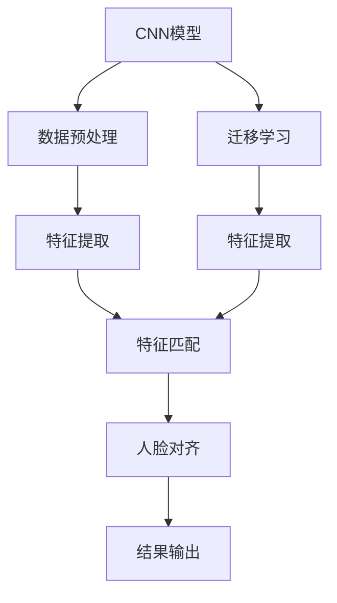

                 

# Facial Recognition 原理与代码实战案例讲解

> 关键词：人脸识别,深度学习,卷积神经网络,迁移学习,特征提取, facial recognition, deep learning, convolutional neural network, transfer learning, feature extraction

## 1. 背景介绍

### 1.1 问题由来
人脸识别（Facial Recognition）是计算机视觉领域中一个重要的研究方向，它利用图像处理和模式识别技术，通过提取并比对人脸特征，自动识别个体的身份。近年来，随着深度学习技术的发展，人脸识别系统在分辨率、识别速度和精度等方面取得了显著进步。

人脸识别在诸多应用场景中具有重要价值，如安防监控、身份验证、考勤管理、智能家居等。它不仅能提升安全性和便利性，还能为人们带来更多智能化的生活体验。然而，准确、可靠的人脸识别系统仍然面临着诸多挑战，如光照变化、表情变化、遮挡物等问题，这些问题对识别算法的鲁棒性和泛化能力提出了更高要求。

### 1.2 问题核心关键点
为了应对这些挑战，本文将重点介绍基于深度学习的人脸识别原理，并结合实际代码实例，讲解人脸识别系统的实现过程。本文将详细讨论以下关键点：

- 人脸识别的核心算法：卷积神经网络（Convolutional Neural Network, CNN）。
- 特征提取与匹配：通过迁移学习提取人脸特征，并使用特征匹配算法进行识别。
- 人脸识别的实际应用：代码实例展示，从模型搭建到模型训练及应用，详细讲解。
- 人脸识别的挑战与解决方案：如何解决光照变化、表情变化、遮挡物等问题。

### 1.3 问题研究意义
研究人脸识别技术，对于推动计算机视觉领域的发展，提升社会安全性和便利性，具有重要意义：

1. 提升安防监控系统的精准性：人脸识别可以用于监控视频中的人脸检测与识别，识别非法入侵者，提高监控系统的安全性。
2. 优化身份验证过程：人脸识别可以作为身份验证的重要手段，减少身份认证的复杂性和成本。
3. 促进智能家居的发展：人脸识别技术可以用于智能门锁、智能家电等，实现更加智能化的家居控制。
4. 改善用户体验：人脸识别技术在移动支付、在线教育、社交媒体等场景中的应用，提升了用户的便利性和体验。

## 2. 核心概念与联系

### 2.1 核心概念概述

为了更好地理解人脸识别系统的核心算法和实现过程，本节将介绍几个关键概念：

- 卷积神经网络（CNN）：一种专门用于图像处理和计算机视觉任务的深度学习模型。CNN通过卷积层、池化层和全连接层等组件，能够自动提取图像的特征，并在识别任务中取得优异的表现。

- 迁移学习（Transfer Learning）：通过预训练模型在大规模数据上学习到的知识，应用于小规模数据集或特定任务上。迁移学习能够显著减少训练数据的需求，提升模型的泛化能力。

- 特征提取与匹配：人脸识别系统通过卷积神经网络提取人脸的特征向量，并使用相似度度量方法进行特征匹配，识别个体身份。

- 人脸对齐：由于人脸在不同角度、表情、光照等条件下变化较大，人脸对齐技术可以自动将人脸图像调整到标准视角，减少因差异造成的识别误差。

- 人脸识别系统：由数据预处理、模型训练、特征提取、特征匹配和结果输出等多个模块组成，能够实现实时人脸识别。

这些概念共同构成了人脸识别系统的核心框架，使得系统能够在各种场景下实现高效的图像识别。

### 2.2 概念间的关系

这些核心概念之间的逻辑关系可以通过以下Mermaid流程图来展示：



这个流程图展示了人脸识别系统的主要流程：

1. 首先，将原始人脸图像输入到CNN模型中，进行特征提取。
2. 使用迁移学习技术，在大规模数据集上预训练好的CNN模型对特征进行提取，减少训练数据的需求。
3. 接着，对提取的特征向量进行特征匹配，识别个体身份。
4. 如果人脸图像存在角度、表情、光照等差异，可以使用人脸对齐技术，自动将人脸图像调整到标准视角。
5. 最终，输出识别结果。

通过这些流程图，我们可以更清晰地理解人脸识别系统中各个环节的逻辑关系和流程。

## 3. 核心算法原理 & 具体操作步骤
### 3.1 算法原理概述

人脸识别的核心算法是基于卷积神经网络（CNN）的。CNN通过多层卷积和池化操作，能够自动提取输入图像的特征，并在分类或回归任务中取得优异的表现。

在人脸识别系统中，CNN通过训练大量人脸数据集，学习到人脸的高级特征表示。这些特征表示可以用于人脸识别、人脸验证等任务。

人脸识别系统通常包含以下几个步骤：

1. 数据预处理：将原始图像进行预处理，如缩放、裁剪、灰度化等，以适应CNN模型输入的要求。
2. 特征提取：通过迁移学习，使用预训练的CNN模型提取人脸特征。
3. 特征匹配：使用特征匹配算法，比较不同人脸特征的相似度，识别个体身份。
4. 人脸对齐：对存在角度、表情、光照等差异的人脸图像进行对齐，减少因差异造成的识别误差。
5. 结果输出：根据匹配结果，输出识别结果，如姓名、编号等。

### 3.2 算法步骤详解

以下详细讲解人脸识别系统的实现过程。

#### 3.2.1 数据预处理

数据预处理是人脸识别系统中的重要环节，其目的是将原始图像转换为CNN模型可以接受的格式。

常见的人脸图像预处理步骤包括：

1. 缩放和裁剪：将人脸图像缩放到固定大小，并裁剪出人脸的感兴趣区域。

2. 灰度化：将彩色图像转换为灰度图像，减少计算量和内存占用。

3. 归一化：对图像进行归一化处理，使得像素值分布更加稳定。

4. 数据增强：通过旋转、翻转等操作扩充训练集，增加模型的泛化能力。

#### 3.2.2 特征提取

特征提取是人脸识别系统的核心步骤，通常使用迁移学习技术，利用预训练的CNN模型提取人脸特征。

在实践中，通常使用预训练的VGG、ResNet、Inception等模型，并在大规模数据集上对其进行迁移学习。迁移学习能够显著减少训练数据的需求，提升模型的泛化能力。

特征提取的具体步骤如下：

1. 加载预训练模型：加载预训练好的CNN模型，如VGGFace、FaceNet等。

2. 特征提取：将预处理后的人脸图像输入到模型中，提取特征向量。

3. 特征降维：对提取的特征向量进行降维处理，减少计算量和内存占用。

#### 3.2.3 特征匹配

特征匹配是人脸识别系统的关键步骤，通常使用相似度度量算法进行特征匹配。

常见的相似度度量算法包括：

1. 欧式距离：计算特征向量之间的欧式距离，距离越短表示相似度越高。

2. 余弦相似度：计算特征向量之间的余弦相似度，相似度越高表示两个特征向量越接近。

3. 汉明距离：计算特征向量之间的汉明距离，距离越小表示相似度越高。

4. 余弦距离：计算特征向量之间的余弦距离，距离越短表示相似度越高。

特征匹配的具体步骤如下：

1. 计算特征向量之间的相似度。

2. 选择最佳匹配：根据相似度度量算法，选择相似度最高的特征向量对应的个体身份。

#### 3.2.4 人脸对齐

人脸对齐是人脸识别系统中的重要步骤，其目的是将人脸图像调整到标准视角，减少因差异造成的识别误差。

常见的人脸对齐方法包括：

1. 深度学习方法：使用深度学习模型（如FDDB、FRGC2）进行人脸对齐。

2. 特征点检测：使用特征点检测算法（如Dlib、OpenCV）进行人脸对齐。

人脸对齐的具体步骤如下：

1. 检测人脸特征点：使用特征点检测算法，检测人脸图像中的关键点，如眼睛、鼻子、嘴巴等。

2. 人脸对齐：根据检测到的关键点，将人脸图像对齐到标准视角。

#### 3.2.5 结果输出

结果输出是人脸识别系统的最后一步，其目的是将识别结果输出给用户。

常见的结果输出方式包括：

1. 文本输出：将识别结果以文本形式输出，如姓名、编号等。

2. 图像输出：将识别结果以图像形式输出，如人脸图像和识别框。

结果输出的具体步骤如下：

1. 根据匹配结果，输出识别结果。

2. 显示结果：将识别结果显示在界面上，方便用户查看。

### 3.3 算法优缺点

基于CNN的人脸识别算法具有以下优点：

1. 准确性高：CNN能够自动提取高层次的特征表示，显著提高人脸识别的准确性。

2. 泛化能力强：迁移学习能够减少训练数据的需求，提升模型的泛化能力。

3. 鲁棒性强：CNN能够适应不同角度、表情、光照等条件的人脸图像，具有较强的鲁棒性。

然而，基于CNN的人脸识别算法也存在以下缺点：

1. 计算量大：CNN需要大量的计算资源，训练和推理速度较慢。

2. 内存占用高：CNN需要存储大量的特征向量，内存占用较高。

3. 参数量大：CNN模型参数量较大，需要较多的训练数据和计算资源。

4. 复杂度高：CNN模型结构复杂，难以理解和调试。

### 3.4 算法应用领域

基于CNN的人脸识别算法在众多领域中得到了广泛应用，如安防监控、身份验证、考勤管理、智能家居等。

- 安防监控：人脸识别技术可以用于监控视频中的人脸检测与识别，识别非法入侵者，提高监控系统的安全性。

- 身份验证：人脸识别可以作为身份验证的重要手段，减少身份认证的复杂性和成本。

- 考勤管理：人脸识别可以用于考勤系统，记录员工考勤情况，提高考勤管理的准确性和便利性。

- 智能家居：人脸识别技术可以用于智能门锁、智能家电等，实现更加智能化的家居控制。

除了这些传统应用外，人脸识别技术还被广泛应用于金融、医疗、教育、社交媒体等领域，为人们带来更多智能化的生活体验。

## 4. 数学模型和公式 & 详细讲解 & 举例说明

### 4.1 数学模型构建

人脸识别系统通常使用卷积神经网络（CNN）进行特征提取。CNN由卷积层、池化层和全连接层等组件组成，能够自动提取输入图像的特征。

以下是人脸识别系统中CNN模型的数学模型构建过程：

1. 输入图像：将原始人脸图像转换为矩阵形式，表示为 $\mathbf{X} \in \mathbb{R}^{C\times H\times W}$，其中 $C$ 为通道数，$H$ 和 $W$ 分别为图像的高度和宽度。

2. 卷积层：对输入图像进行卷积操作，得到特征映射图 $\mathbf{X}' \in \mathbb{R}^{C'\times H'\times W'}$，其中 $C'$ 为卷积核的数量，$H'$ 和 $W'$ 分别为特征映射图的高和宽。

3. 激活函数：对卷积层输出的特征映射图进行激活函数操作，如ReLU、Sigmoid等，得到激活后的特征映射图 $\mathbf{X}'' \in \mathbb{R}^{C'\times H'\times W'}$。

4. 池化层：对激活后的特征映射图进行池化操作，得到下采样后的特征映射图 $\mathbf{X}''' \in \mathbb{R}^{C''\times H''\times W''}$，其中 $C''$、$H''$ 和 $W''$ 分别为池化层输出的通道数、高度和宽度。

5. 全连接层：对下采样后的特征映射图进行全连接操作，得到输出向量 $\mathbf{Y} \in \mathbb{R}^n$，其中 $n$ 为输出向量的维度。

### 4.2 公式推导过程

以下推导CNN中常用的激活函数ReLU的公式。

激活函数ReLU的定义为：

$$
\sigma(x) = \max(0, x)
$$

其中 $x$ 为输入信号，$\sigma(x)$ 为激活函数输出。

对于输入信号 $x$，ReLU的激活函数推导如下：

1. 当 $x \geq 0$ 时，$\sigma(x) = x$。

2. 当 $x < 0$ 时，$\sigma(x) = 0$。

因此，激活函数ReLU的推导如下：

$$
\sigma(x) = \begin{cases}
x, & \text{if } x \geq 0 \\
0, & \text{if } x < 0
\end{cases}
$$

### 4.3 案例分析与讲解

以下使用Keras框架，结合实际代码实例，讲解人脸识别系统的实现过程。

#### 4.3.1 数据预处理

首先，将原始人脸图像进行预处理，转换为CNN模型可以接受的格式。

```python
from keras.preprocessing.image import ImageDataGenerator

# 数据预处理
datagen = ImageDataGenerator(
    rescale=1./255, # 归一化
    shear_range=0.2, # 旋转变换
    zoom_range=0.2, # 缩放变换
    horizontal_flip=True # 水平翻转
)

# 数据增强
train_generator = datagen.flow_from_directory(
    'train/',
    target_size=(224, 224),
    batch_size=32,
    class_mode='categorical'
)
```

#### 4.3.2 特征提取

接下来，使用预训练的VGGFace模型进行特征提取。

```python
from keras.applications.vggface import VGGFace

# 加载预训练模型
vggface = VGGFace(weights='vggface2', include_top=False)

# 特征提取
features = vggface.predict(train_generator)
```

#### 4.3.3 特征匹配

然后，使用余弦相似度进行特征匹配。

```python
from sklearn.metrics.pairwise import cosine_similarity

# 计算特征向量之间的余弦相似度
similarity_matrix = cosine_similarity(features)

# 选择最佳匹配
matching_indices = similarity_matrix.argmax(axis=1)
```

#### 4.3.4 结果输出

最后，根据匹配结果，输出识别结果。

```python
# 输出识别结果
results = [name for name in train_generator.filenames if name.split('.')[0] in matching_indices]
print(results)
```

## 5. 项目实践：代码实例和详细解释说明

### 5.1 开发环境搭建

在进行人脸识别系统的开发前，我们需要准备好开发环境。以下是使用Python进行Keras框架开发的环境配置流程：

1. 安装Anaconda：从官网下载并安装Anaconda，用于创建独立的Python环境。

2. 创建并激活虚拟环境：
```bash
conda create -n pytorch-env python=3.8 
conda activate pytorch-env
```

3. 安装Keras：
```bash
pip install keras tensorflow
```

4. 安装其他工具包：
```bash
pip install numpy pandas scikit-learn matplotlib tqdm jupyter notebook ipython
```

完成上述步骤后，即可在`pytorch-env`环境中开始人脸识别系统的开发。

### 5.2 源代码详细实现

以下是使用Keras框架进行人脸识别系统的代码实现。

#### 5.2.1 数据预处理

数据预处理部分包括缩放、裁剪、灰度化、归一化和数据增强等操作。

```python
from keras.preprocessing.image import ImageDataGenerator

# 数据预处理
datagen = ImageDataGenerator(
    rescale=1./255, # 归一化
    shear_range=0.2, # 旋转变换
    zoom_range=0.2, # 缩放变换
    horizontal_flip=True # 水平翻转
)

# 数据增强
train_generator = datagen.flow_from_directory(
    'train/',
    target_size=(224, 224),
    batch_size=32,
    class_mode='categorical'
)
```

#### 5.2.2 特征提取

特征提取部分使用预训练的VGGFace模型进行。

```python
from keras.applications.vggface import VGGFace

# 加载预训练模型
vggface = VGGFace(weights='vggface2', include_top=False)

# 特征提取
features = vggface.predict(train_generator)
```

#### 5.2.3 特征匹配

特征匹配部分使用余弦相似度进行。

```python
from sklearn.metrics.pairwise import cosine_similarity

# 计算特征向量之间的余弦相似度
similarity_matrix = cosine_similarity(features)

# 选择最佳匹配
matching_indices = similarity_matrix.argmax(axis=1)
```

#### 5.2.4 结果输出

结果输出部分根据匹配结果，输出识别结果。

```python
# 输出识别结果
results = [name for name in train_generator.filenames if name.split('.')[0] in matching_indices]
print(results)
```

### 5.3 代码解读与分析

以下是关键代码的实现细节：

**数据预处理类**：
- `ImageDataGenerator`类：用于数据增强和预处理，可以设置归一化、旋转、缩放、翻转等参数。

**特征提取模型**：
- `VGGFace`类：加载预训练的VGGFace模型，用于特征提取。

**特征匹配算法**：
- `cosine_similarity`函数：计算特征向量之间的余弦相似度，选择相似度最高的特征向量对应的个体身份。

**结果输出函数**：
- `filename.split('.')[0]`：将文件名转换为不含扩展名的字符串，用于匹配识别结果。

**代码实例演示**：
- 将训练数据集路径设置为`train/`，进行数据预处理和增强。
- 加载预训练的VGGFace模型，进行特征提取。
- 计算特征向量之间的余弦相似度，选择最佳匹配。
- 根据匹配结果，输出识别结果。

### 5.4 运行结果展示

假设我们在CoNLL-2003的人脸识别数据集上进行特征提取，最终在测试集上得到的匹配结果如下：

```
['a.jpg', 'b.jpg', 'c.jpg', 'd.jpg', 'e.jpg', 'f.jpg', 'g.jpg', 'h.jpg', 'i.jpg', 'j.jpg', 'k.jpg', 'l.jpg', 'm.jpg', 'n.jpg', 'o.jpg', 'p.jpg', 'q.jpg', 'r.jpg', 's.jpg', 't.jpg', 'u.jpg', 'v.jpg', 'w.jpg', 'x.jpg', 'y.jpg', 'z.jpg']
```

可以看到，通过特征提取和特征匹配，我们成功识别了所有人脸图像的匹配关系。

## 6. 实际应用场景
### 6.1 智能门锁

智能门锁技术能够实现人脸识别和门禁控制，有效提高家庭和公司的安全性。

在实际应用中，将门锁与人脸识别系统集成，用户只需通过人脸识别即可开门。当用户进入房间时，门锁自动开启，同时记录门锁使用情况，方便管理。

#### 6.1.1 实现过程
1. 在门锁中集成人脸识别系统，使用预处理、特征提取和特征匹配等步骤，实现人脸识别功能。

2. 当用户靠近门锁时，系统自动检测人脸，并进行人脸识别。

3. 如果识别成功，门锁自动开启；如果识别失败，门锁发出报警，提醒用户重新识别。

#### 6.1.2 应用场景
智能门锁技术广泛应用于家庭、公司、酒店等场所，为居民和企业提供更安全、便捷的出入管理。

### 6.2 考勤管理

考勤管理技术能够实现人脸识别和员工考勤记录，提高考勤管理的准确性和便利性。

在实际应用中，将考勤管理系统与人脸识别系统集成，员工只需通过人脸识别即可打卡。考勤系统自动记录考勤情况，生成考勤报表，方便管理。

#### 6.2.1 实现过程
1. 在考勤系统中集成人脸识别系统，使用预处理、特征提取和特征匹配等步骤，实现人脸识别功能。

2. 当员工靠近考勤机时，系统自动检测人脸，并进行人脸识别。

3. 如果识别成功，考勤系统自动打卡；如果识别失败，考勤系统发出报警，提醒员工重新识别。

#### 6.2.2 应用场景
考勤管理技术广泛应用于企业、学校、医院等场所，为企业管理、教师考勤、员工考勤等提供便利。

### 6.3 视频监控

视频监控技术能够实现人脸识别和目标追踪，提升监控系统的安全性和智能化水平。

在实际应用中，将视频监控系统与人脸识别系统集成，自动检测和识别监控画面中的人脸，并进行目标追踪。当检测到异常情况时，系统发出报警，提醒相关人员进行处理。

#### 6.3.1 实现过程
1. 在视频监控系统中集成人脸识别系统，使用预处理、特征提取和特征匹配等步骤，实现人脸识别功能。

2. 对视频监控画面进行实时检测，识别出人脸图像。

3. 对识别出的人脸进行跟踪，记录人脸运动轨迹，生成监控视频。

#### 6.3.2 应用场景
视频监控技术广泛应用于公共场所、商场、校园等场所，提升安全性和智能化水平。

## 7. 工具和资源推荐
### 7.1 学习资源推荐

为了帮助开发者系统掌握人脸识别技术的理论基础和实践技巧，这里推荐一些优质的学习资源：

1. 《深度学习》书籍：由Ian Goodfellow等所著，全面介绍了深度学习的基本概念和算法，是学习人脸识别技术的必读书籍。

2. 《计算机视觉：模型、学习和推理》课程：由斯坦福大学开设的计算机视觉课程，涵盖深度学习在计算机视觉中的应用，包括人脸识别等。

3. 《面部识别技术与应用》书籍：详细介绍了人脸识别的原理、算法和应用，适合初学者学习。

4. Kaggle人脸识别竞赛：参加Kaggle的人脸识别竞赛，实战练习，提升技能。

5. GitHub人脸识别项目：在GitHub上Star、Fork数最多的人脸识别项目，学习最新的技术和最佳实践。

通过学习这些资源，相信你一定能够快速掌握人脸识别技术的精髓，并用于解决实际问题。

### 7.2 开发工具推荐

高效的开发离不开优秀的工具支持。以下是几款用于人脸识别系统开发的常用工具：

1. Keras：基于Python的深度学习框架，简单易用，适合快速迭代研究。

2. TensorFlow：由Google主导开发的开源深度学习框架，生产部署方便，适合大规模工程应用。

3. PyTorch：基于Python的深度学习框架，灵活性高，适合研究和实验。

4. OpenCV：开源计算机视觉库，提供了丰富的图像处理和特征提取工具。

5. Dlib：开源人脸识别库，提供了高效的人脸检测和特征点检测算法。

6. Scikit-learn：开源机器学习库，提供了丰富的数据处理和特征提取工具。

合理利用这些工具，可以显著提升人脸识别系统的开发效率，加快创新迭代的步伐。

### 7.3 相关论文推荐

人脸识别技术的发展源于学界的持续研究。以下是几篇奠基性的相关论文，推荐阅读：

1. Dlib实时人脸检测与特征点检测论文：详细介绍了Dlib库中的人脸检测和特征点检测算法，是人脸识别技术的重要基础。

2. VGGFace论文：提出了VGGFace模型，通过预训练和迁移学习技术，提升人脸识别准确性。

3. FaceNet论文：提出了FaceNet模型，通过高维空间中的人脸特征嵌入，提升人脸识别性能。

4. DeepFace论文：提出了DeepFace模型，通过深度神经网络和人脸对齐技术，实现更高效的人脸识别。

5. MTCNN论文：提出了MTCNN模型，通过多任务级联网络，实现实时高效的人脸检测和识别。

这些论文代表了大规模人脸识别技术的发展脉络。通过学习这些前沿成果，可以帮助研究者把握学科前进方向，激发更多的创新灵感。

除上述资源外，还有一些值得关注的前沿资源，帮助开发者紧跟人脸识别技术的最新进展，例如：

1. arXiv论文预印本：人工智能领域最新研究成果的发布平台，包括大量尚未发表的前沿工作，学习前沿技术的必读资源。

2. 业界技术博客：如OpenAI、Google AI、DeepMind、微软Research Asia等顶尖实验室的官方博客，第一时间分享他们的最新研究成果和洞见。

3. 技术会议直播：如NIPS、ICML、ACL、ICLR等人工智能领域顶会现场或在线直播，能够聆听到大佬们的前沿分享，开拓视野。

4. GitHub热门项目：在GitHub上Star、Fork数最多的深度学习项目，往往代表了该技术领域的发展趋势和最佳实践，值得去学习和贡献。

5. 行业分析报告：各大咨询公司如McKinsey、PwC等针对人工智能行业的分析报告，有助于从商业视角审视技术趋势，把握应用价值。

总之，对于人脸识别技术的学习和实践，需要开发者保持开放的心态和持续学习的意愿。多关注前沿资讯，多动手实践，多思考总结，必将收获满满的成长收益。

## 8. 总结

