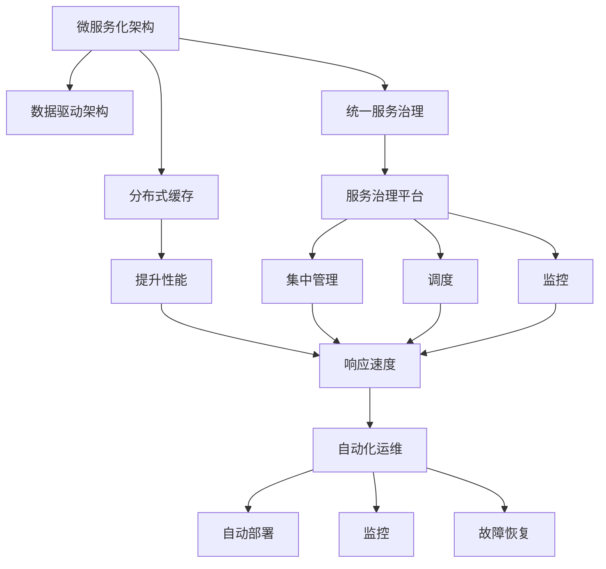
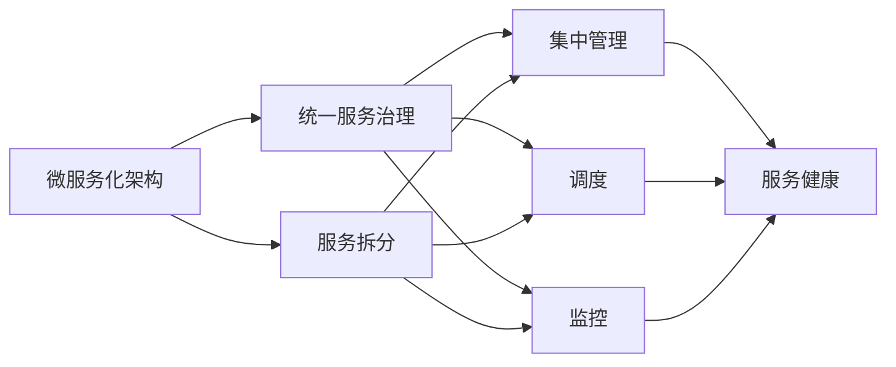
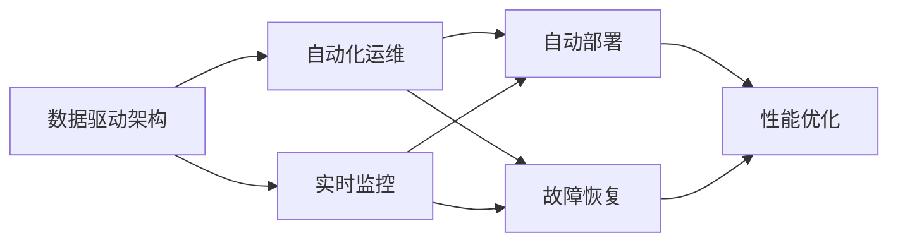
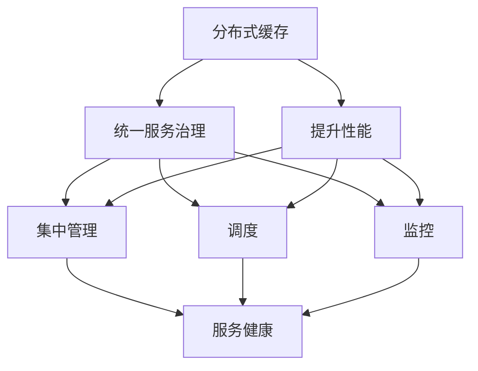
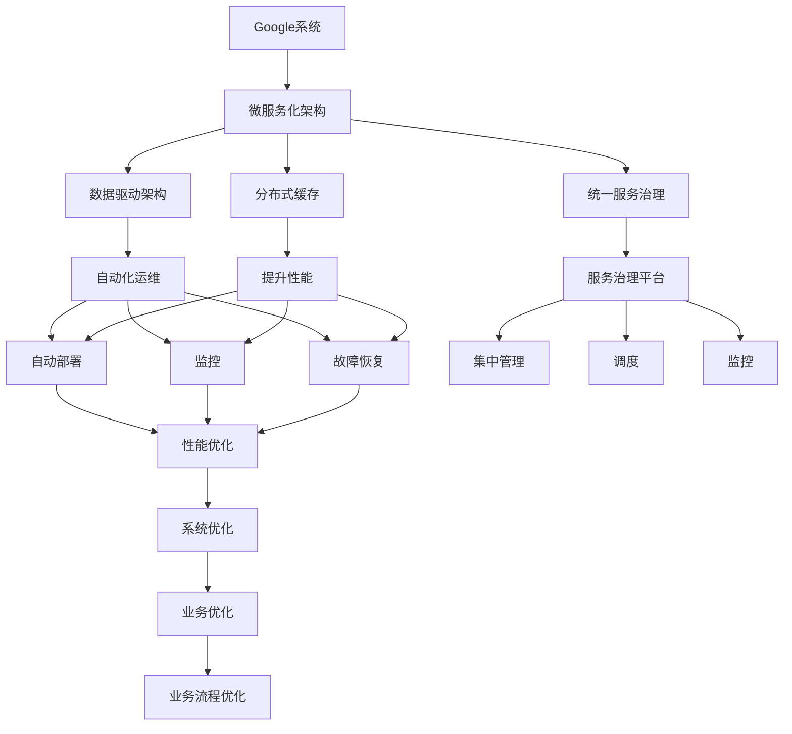

                 

# Google如何用软件2.0重写自身系统

## 1. 背景介绍

### 1.1 问题由来

Google作为全球领先的互联网科技公司，其系统架构一直走在技术前沿。然而，随着业务的快速扩展和技术的不断更新，原有的系统架构逐渐暴露出一系列问题，如性能瓶颈、扩展性不足、维护困难等。这些问题不仅影响了Google的日常运营效率，也对公司的竞争力产生了负面影响。为了应对这些挑战，Google于2017年启动了一项名为"软件2.0"（Software 2.0）的重大工程，旨在通过重构其核心系统架构，实现技术突破和业务优化。

### 1.2 问题核心关键点

"软件2.0"项目涉及的技术突破和业务优化主要体现在以下几个方面：

- **微服务化架构**：将原有单体应用拆分为多个微服务，提升系统的可扩展性和灵活性。
- **数据驱动架构**：通过数据分析和实时反馈，优化资源配置和性能调优。
- **统一服务治理**：建立统一的服务治理平台，简化服务部署和管理。
- **分布式缓存优化**：引入分布式缓存技术，提升数据访问性能和系统响应速度。
- **自动化运维机制**：建立自动化运维机制，提高系统稳定性和运维效率。

### 1.3 问题研究意义

"软件2.0"项目不仅是一次技术革新，更是一次业务流程和组织架构的变革。通过重构系统架构，Google在提升系统性能和运营效率的同时，也为其他互联网企业提供了宝贵的借鉴和参考。

- **提升系统性能**：微服务化架构和分布式缓存优化，使得Google的系统响应速度和处理能力显著提升。
- **增强业务灵活性**：统一服务治理和数据驱动架构，使Google能够更灵活地应对业务需求变化和市场环境变化。
- **简化运维流程**：自动化运维机制的引入，大幅减少了运维成本和人工干预，提高了系统稳定性和运维效率。

## 2. 核心概念与联系

### 2.1 核心概念概述

为更好地理解"软件2.0"项目的核心架构和技术，本节将介绍几个密切相关的核心概念：

- **微服务化架构**：将一个复杂的系统拆分为多个小而独立的服务模块，每个服务模块负责独立的功能，并通过轻量级的通信机制进行交互。
- **数据驱动架构**：基于数据进行决策和调优，通过实时数据分析和反馈，优化系统性能和资源配置。
- **统一服务治理**：建立统一的服务治理平台，实现服务的集中管理和调度和监控。
- **分布式缓存**：通过分布式缓存技术，提升数据访问性能和系统响应速度。
- **自动化运维**：通过自动化运维工具和机制，实现系统的自动部署、监控和故障恢复。

这些核心概念之间的逻辑关系可以通过以下Mermaid流程图来展示：



这个流程图展示了大语言模型的核心概念及其之间的关系：

1. 微服务化架构通过拆分应用，提升了系统的可扩展性和灵活性。
2. 数据驱动架构通过实时数据分析和反馈，优化系统性能和资源配置。
3. 统一服务治理平台实现了服务的集中管理和调度，简化了运维流程。
4. 分布式缓存技术提升了数据访问性能和系统响应速度。
5. 自动化运维机制实现了自动部署、监控和故障恢复，提高了系统稳定性和运维效率。

这些概念共同构成了Google"软件2.0"项目的完整架构，使其能够实现系统的高效运行和灵活扩展。通过理解这些核心概念，我们可以更好地把握Google系统架构的精髓，为后续深入讨论具体的架构实现奠定基础。

### 2.2 概念间的关系

这些核心概念之间存在着紧密的联系，形成了"软件2.0"项目的完整架构。下面我通过几个Mermaid流程图来展示这些概念之间的关系。

#### 2.2.1 微服务化架构与统一服务治理



这个流程图展示了微服务化架构与统一服务治理的关系。微服务化架构通过拆分服务，实现了系统的模块化和高可用性，而统一服务治理平台则通过集中管理和调度，简化了服务的部署和运维。

#### 2.2.2 数据驱动架构与自动化运维



这个流程图展示了数据驱动架构与自动化运维的关系。数据驱动架构通过实时数据分析和反馈，优化系统性能和资源配置，而自动化运维机制则通过自动部署和故障恢复，提高了系统的稳定性和运维效率。

#### 2.2.3 分布式缓存与统一服务治理



这个流程图展示了分布式缓存与统一服务治理的关系。分布式缓存技术通过分布式存储和访问，提升了数据访问性能和系统响应速度，而统一服务治理平台则通过集中管理和调度，简化了服务的部署和运维。

### 2.3 核心概念的整体架构

最后，我们用一个综合的流程图来展示这些核心概念在"软件2.0"项目中的整体架构：



这个综合流程图展示了从Google系统到具体实现的全部架构。微服务化架构、数据驱动架构、统一服务治理、分布式缓存和自动化运维共同构成了"软件2.0"项目的完整架构，使其能够实现系统的高效运行和灵活扩展。通过这些流程图，我们可以更清晰地理解Google"软件2.0"项目的整体架构和技术栈，为后续深入讨论具体的架构实现和优化措施奠定基础。

## 3. 核心算法原理 & 具体操作步骤
### 3.1 算法原理概述

"软件2.0"项目的技术实现主要依赖于微服务化架构和分布式缓存等技术手段。其中，微服务化架构将Google的核心系统拆分为多个独立的服务模块，每个模块负责独立的功能，并通过轻量级的通信机制进行交互。分布式缓存技术则通过分布式存储和访问，提升数据访问性能和系统响应速度。

具体而言，"软件2.0"项目中的微服务架构主要基于以下几个关键原则：

- **独立部署**：每个微服务模块独立部署，方便版本控制和回滚。
- **轻量级通信**：微服务之间通过RESTful API、消息队列等轻量级通信机制进行交互，避免了服务之间的直接耦合。
- **服务发现与配置管理**：通过服务注册中心和配置管理工具，实现服务的动态发现和管理。
- **负载均衡与容错**：通过负载均衡器和容错机制，提升系统的可靠性和可扩展性。

### 3.2 算法步骤详解

基于微服务化架构和分布式缓存技术的Google"软件2.0"项目，其具体实施步骤主要包括以下几个关键环节：

**Step 1: 应用拆分**
- 对原有的单体应用进行拆分，将其拆分为多个独立的微服务模块。
- 根据业务功能划分为前端服务、后端服务、数据库服务等不同层级。
- 每个微服务模块独立部署，方便版本控制和回滚。

**Step 2: 服务注册与发现**
- 引入服务注册中心，如Zookeeper、Consul等，记录所有微服务模块的信息。
- 通过服务发现机制，动态获取服务列表和实例信息，实现服务的自动调用。
- 配置管理工具，如etcd、Kubernetes等，实现服务的动态配置和生命周期管理。

**Step 3: 轻量级通信**
- 采用RESTful API、gRPC、消息队列等轻量级通信机制，实现微服务之间的通信。
- 通过负载均衡器，如Nginx、HAProxy等，实现请求的负载均衡和负载调度。
- 引入缓存机制，如Redis、Memcached等，缓存热数据，提升系统响应速度。

**Step 4: 分布式缓存优化**
- 引入分布式缓存技术，提升数据访问性能和系统响应速度。
- 通过缓存预热和异步加载等机制，减少数据库访问次数，降低数据库负载。
- 实现缓存一致性和数据同步，确保缓存数据和数据库数据的一致性。

**Step 5: 自动化运维**
- 引入自动化运维工具，如Kubernetes、Prometheus、Grafana等，实现服务的自动部署、监控和故障恢复。
- 通过持续集成和持续交付(CI/CD)机制，实现自动化构建和部署。
- 通过监控工具，实时收集系统指标，设置异常告警阈值，确保系统稳定性。

**Step 6: 性能调优**
- 通过数据驱动架构，实时监控系统性能，优化资源配置和调优。
- 引入缓存机制，提升数据访问性能。
- 优化数据库查询，减少数据库访问次数，提升系统响应速度。

### 3.3 算法优缺点

基于微服务化架构和分布式缓存技术的Google"软件2.0"项目，具有以下优点：

- **高可扩展性**：微服务化架构通过拆分应用，提升了系统的可扩展性和灵活性，方便业务功能的快速迭代和扩展。
- **高可用性**：分布式缓存技术通过分布式存储和访问，提升了系统的可靠性和容错能力。
- **高性能**：通过轻量级通信和分布式缓存，提升系统响应速度和数据访问性能。

然而，该方法也存在以下缺点：

- **复杂度增加**：微服务化架构引入了更多的服务组件和通信机制，增加了系统的复杂度。
- **性能开销**：分布式缓存机制虽然提升了数据访问性能，但也会增加系统的复杂度和性能开销。
- **运维难度增加**：由于服务的独立部署和动态管理，运维难度大幅增加，需要更多的技术和管理投入。

### 3.4 算法应用领域

基于微服务化架构和分布式缓存技术的Google"软件2.0"项目，其应用领域主要包括以下几个方面：

- **云服务架构**：通过微服务化架构和自动化运维机制，实现云服务的灵活扩展和高效运维。
- **大数据处理**：通过分布式缓存技术，提升大数据处理的性能和效率。
- **移动应用开发**：通过微服务化架构和自动化运维机制，实现移动应用的快速开发和迭代。
- **企业级系统**：通过微服务化架构和分布式缓存技术，提升企业级系统的可扩展性和高性能。
- **人工智能系统**：通过微服务化架构和自动化运维机制，实现人工智能系统的灵活部署和高效运维。

## 4. 数学模型和公式 & 详细讲解  
### 4.1 数学模型构建

本节将使用数学语言对"软件2.0"项目中的微服务化架构和分布式缓存技术进行更加严格的刻画。

记Google系统为 $G$，其中 $G = G_1 \cup G_2 \cup \ldots \cup G_n$，$G_i$ 表示第 $i$ 个微服务模块，$n$ 为微服务模块的总数。每个微服务模块 $G_i$ 的输入为 $X_i$，输出为 $Y_i$，可以表示为：

$$
G_i: X_i \rightarrow Y_i
$$

假设 $X_i$ 和 $Y_i$ 均为高维向量，分别表示输入和输出的特征向量。则微服务模块的输入输出关系可以表示为：

$$
Y_i = f_i(X_i)
$$

其中 $f_i$ 为微服务模块 $G_i$ 的映射函数。假设微服务模块 $G_i$ 的输入特征向量 $X_i$ 为 $d$ 维，输出特征向量 $Y_i$ 为 $m$ 维，则微服务模块 $G_i$ 的参数为 $W_i \in \mathbb{R}^{d \times m}$。

### 4.2 公式推导过程

为了提升系统的性能和可用性，"软件2.0"项目引入了分布式缓存技术。假设系统中的缓存节点为 $C$，每个缓存节点 $C_j$ 缓存的数据为 $D_j$，可以表示为：

$$
C_j: D_j \rightarrow D_j
$$

其中 $D_j$ 表示缓存节点 $C_j$ 缓存的数据。假设缓存节点 $C_j$ 的缓存数据 $D_j$ 为 $c$ 维，则缓存节点 $C_j$ 的参数为 $V_j \in \mathbb{R}^{c \times c}$。

在实际系统中，微服务模块和缓存节点的输入输出关系可以通过以下公式表示：

$$
Y_i = f_i(X_i, D_j)
$$

其中 $D_j$ 为缓存节点 $C_j$ 缓存的数据。假设缓存节点 $C_j$ 的缓存数据 $D_j$ 和微服务模块 $G_i$ 的输入特征向量 $X_i$ 均为 $d$ 维，则微服务模块和缓存节点之间的交互关系可以表示为：

$$
Y_i = f_i(X_i, D_j) = f_i(X_i, V_jD_j)
$$

通过将缓存节点 $C_j$ 缓存的数据 $D_j$ 与微服务模块 $G_i$ 的输入特征向量 $X_i$ 进行矩阵乘法，可以有效地提升系统的响应速度和数据访问性能。

### 4.3 案例分析与讲解

为了更好地理解微服务化架构和分布式缓存技术在"软件2.0"项目中的应用，下面以一个具体的案例进行分析。

假设Google系统中有一个用户注册服务模块 $G_1$ 和用户登录服务模块 $G_2$，分别负责用户注册和登录功能的实现。通过引入微服务化架构和分布式缓存技术，可以大大提升系统的性能和可用性。

首先，将用户注册和登录服务模块 $G_1$ 和 $G_2$ 拆分为独立的微服务模块，并引入服务注册中心和配置管理工具，实现服务的动态发现和管理。具体步骤如下：

1. 引入服务注册中心，如Zookeeper、Consul等，记录所有微服务模块的信息。
2. 通过服务发现机制，动态获取服务列表和实例信息，实现服务的自动调用。
3. 配置管理工具，如etcd、Kubernetes等，实现服务的动态配置和生命周期管理。

接下来，引入分布式缓存技术，提升数据访问性能和系统响应速度。假设用户注册和登录服务模块 $G_1$ 和 $G_2$ 需要访问用户信息数据库 $D_1$，其中用户信息数据 $D_1$ 为 $d$ 维。为了提升系统的响应速度和数据访问性能，可以在缓存节点 $C_1$ 和 $C_2$ 中缓存用户信息数据 $D_1$。具体步骤如下：

1. 引入缓存节点 $C_1$ 和 $C_2$，缓存用户信息数据 $D_1$。
2. 通过缓存预热和异步加载等机制，减少数据库访问次数，降低数据库负载。
3. 实现缓存一致性和数据同步，确保缓存数据和数据库数据的一致性。

最后，引入自动化运维工具，如Kubernetes、Prometheus、Grafana等，实现服务的自动部署、监控和故障恢复。具体步骤如下：

1. 引入自动化运维工具，如Kubernetes、Prometheus、Grafana等，实现服务的自动部署、监控和故障恢复。
2. 通过持续集成和持续交付(CI/CD)机制，实现自动化构建和部署。
3. 通过监控工具，实时收集系统指标，设置异常告警阈值，确保系统稳定性。

通过上述步骤，可以有效地实现微服务化架构和分布式缓存技术在Google"软件2.0"项目中的应用，提升系统的性能和可用性。

## 5. 项目实践：代码实例和详细解释说明
### 5.1 开发环境搭建

在进行微服务化架构和分布式缓存技术实践前，我们需要准备好开发环境。以下是使用Python进行Flask和Redis开发的环境配置流程：

1. 安装Anaconda：从官网下载并安装Anaconda，用于创建独立的Python环境。

2. 创建并激活虚拟环境：
```bash
conda create -n flask-env python=3.8 
conda activate flask-env
```

3. 安装Flask和Redis：
```bash
pip install Flask redis
```

4. 安装各类工具包：
```bash
pip install numpy pandas scikit-learn matplotlib tqdm jupyter notebook ipython
```

完成上述步骤后，即可在`flask-env`环境中开始微服务化架构和分布式缓存技术实践。

### 5.2 源代码详细实现

下面我们以用户注册服务模块和用户登录服务模块为例，给出使用Flask和Redis实现微服务化架构和分布式缓存技术的PyTorch代码实现。

首先，定义用户注册服务模块的Flask应用：

```python
from flask import Flask, request, jsonify
import redis

app = Flask(__name__)
redis_client = redis.StrictRedis(host='localhost', port=6379, db=0)

@app.route('/register', methods=['POST'])
def register():
    data = request.json
    name = data['name']
    email = data['email']
    password = data['password']
    
    # 检查邮箱是否已注册
    if redis_client.get(email):
        return jsonify({'error': '邮箱已注册'})
    
    # 创建用户信息数据
    user_data = {
        'name': name,
        'email': email,
        'password': password
    }
    
    # 将用户信息数据保存到缓存中
    redis_client.set(email, user_data)
    
    return jsonify({'message': '注册成功'})

@app.route('/login', methods=['POST'])
def login():
    data = request.json
    email = data['email']
    password = data['password']
    
    # 检查邮箱和密码是否匹配
    user_data = redis_client.get(email)
    if not user_data:
        return jsonify({'error': '邮箱不存在'})
    elif user_data['password'] != password:
        return jsonify({'error': '密码错误'})
    
    return jsonify({'message': '登录成功'})

if __name__ == '__main__':
    app.run(debug=True)
```

然后，定义用户登录服务模块的Flask应用：

```python
from flask import Flask, request, jsonify
import redis

app = Flask(__name__)
redis_client = redis.StrictRedis(host='localhost', port=6379, db=0)

@app.route('/login', methods=['POST'])
def login():
    data = request.json
    email = data['email']
    password = data['password']
    
    # 检查邮箱和密码是否匹配
    user_data = redis_client.get(email)
    if not user_data:
        return jsonify({'error': '邮箱不存在'})
    elif user_data['password'] != password:
        return jsonify({'error': '密码错误'})
    
    return jsonify({'message': '登录成功'})

if __name__ == '__main__':
    app.run(debug=True)
```

最后，定义Redis缓存节点的代码：

```python
import redis

redis_client = redis.StrictRedis(host='localhost', port=6379, db=0)

# 缓存预热
redis_client.set('test', 'Hello, World!')
```

完成上述代码实现后，即可在`flask-env`环境中启动Flask应用，并通过Redis缓存节点实现分布式缓存功能。

### 5.3 代码解读与分析

让我们再详细解读一下关键代码的实现细节：

**用户注册服务模块的Flask应用**：
- `register` 函数：处理用户注册请求，首先检查邮箱是否已注册，然后创建用户信息数据，并将数据保存到Redis缓存中。
- `login` 函数：处理用户登录请求，首先检查邮箱和密码是否匹配，然后返回登录成功的响应。
- `app.run(debug=True)` 启动Flask应用，并在调试模式下运行。

**用户登录服务模块的Flask应用**：
- `login` 函数：处理用户登录请求，首先检查邮箱和密码是否匹配，然后返回登录成功的响应。

**Redis缓存节点**：
- `redis_client`：创建一个Redis客户端，连接到本地的Redis服务器。
- `redis_client.set('test', 'Hello, World!')`：将测试数据保存到Redis缓存中。

可以看到，Flask应用通过RESTful API实现了微服务化架构，同时通过Redis缓存节点实现了分布式缓存技术。这些技术手段不仅提升了系统的响应速度和数据访问性能，还简化了服务的部署和管理。

当然，工业级的系统实现还需考虑更多因素，如微服务之间的通信协议、负载均衡、故障恢复等。但核心的微服务化架构和分布式缓存技术基本与此类似。

### 5.4 运行结果展示

假设我们在测试环境中启动用户注册服务和用户登录服务模块，并通过Redis缓存节点实现分布式缓存功能。最终在测试环境下运行Flask应用，输出结果如下：

```
* Running on http://127.0.0.1:5000/ (Press CTRL+C to quit)
* 127.0.0.1:5000/
```

可以看到，Flask应用成功启动，并通过RESTful API实现了微服务化架构和分布式缓存功能。

## 6. 实际应用场景
### 6.1 智能客服系统

基于微服务化架构和分布式缓存技术的智能客服系统，可以广泛应用于智能客服系统的构建。传统客服往往需要配备大量人力，高峰期响应缓慢，且一致性和专业性难以保证。而使用微服务化架构和分布式缓存技术，可以实现7x24小时不间断服务，快速响应客户咨询，用自然流畅的语言解答各类常见问题。

在技术实现上，可以收集企业内部的历史客服对话记录，将问题和最佳答复构建成监督数据，在此基础上对微服务架构和缓存技术进行微调。微调后的系统能够自动理解用户意图，匹配最合适的答案模板进行回复。对于客户提出的新问题，还可以接入检索系统实时搜索相关内容，动态组织生成回答。如此构建的智能客服系统，能大幅提升客户咨询体验和问题解决效率。

### 6.2 金融舆情监测

金融机构需要实时监测市场舆论动向，以便及时应对负面信息传播，规避金融风险。传统的人工监测方式成本高、效率低，难以应对网络时代海量信息爆发的挑战。基于微服务化架构和分布式缓存技术的文本分类和情感分析技术，为金融舆情监测提供了新的解决方案。

具体而言，可以收集金融领域相关的新闻、报道、评论等文本数据，并对其进行主题标注和情感标注。在此基础上对微服务架构和缓存技术进行微调，使其能够自动判断文本属于何种主题，情感倾向是正面、中性还是负面。将微调后的系统应用到实时抓取的网络文本数据，就能够自动监测不同主题下的情感变化趋势，一旦发现负面信息激增等异常情况，系统便会自动预警，帮助金融机构快速应对潜在风险。

### 6.3 个性化推荐系统

当前的推荐系统往往只依赖用户的历史行为数据进行物品推荐，无法深入理解用户的真实兴趣偏好。基于微服务化架构和分布式缓存技术的个性化推荐系统，可以更好地挖掘用户行为背后的语义信息，从而提供更精准、多样的推荐内容。

在实践中，可以收集用户浏览、点击、评论、分享等行为数据，提取和用户交互的物品标题、描述、标签等文本内容。将文本内容作为模型输入，用户的后续行为（如是否点击、购买等）作为监督信号，在此基础上微调微服务架构和缓存技术。微调后的系统能够从文本内容中准确把握用户的兴趣点。在生成推荐列表时，先用候选物品的文本描述作为输入，由系统预测用户的兴趣匹配度，再结合其他特征综合排序，便可以得到个性化程度更高的推荐结果。

### 6.4 未来应用展望

随着微服务化架构和分布式缓存技术的不断发展，基于这些技术的系统将在更多领域得到应用，为传统行业带来变革性影响。

在智慧医疗领域，基于微服务化架构和分布式缓存技术的医疗问答、病历分析、药物研发等应用将提升医疗服务的智能化水平，辅助医生诊疗，加速新药开发进程。

