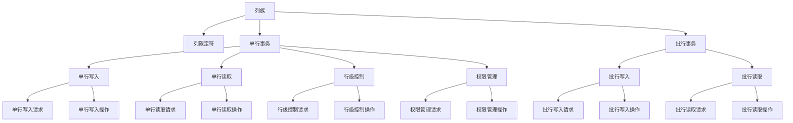
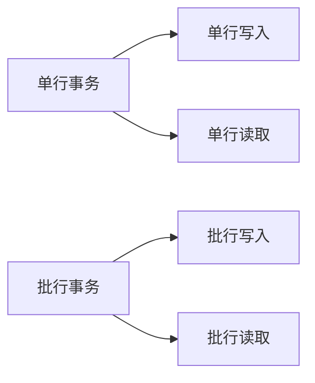
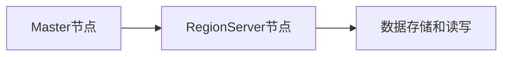
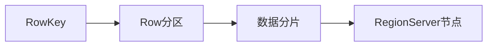
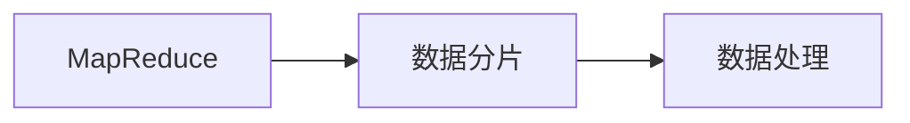
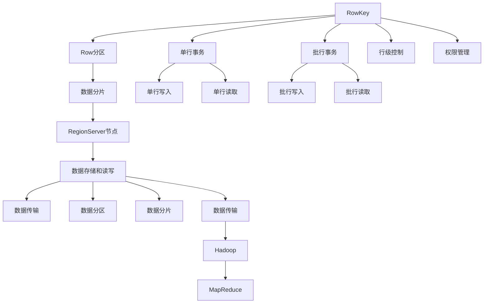

                 

# HBase原理与代码实例讲解

> 关键词：HBase,分布式,NoSQL,数据管理,列族,单元格,MapReduce

## 1. 背景介绍

### 1.1 问题由来
在云计算和分布式存储的时代背景下，互联网公司如Google、Facebook、Amazon等纷纷投入大量资源，研发并部署了各自的大型分布式数据库系统，其中HBase是Google公司开发的一款基于谷歌文件系统的开源分布式非关系型数据库，支持大型的结构化数据存储，提供强一致性和高可用性，并支持高吞吐量的读写操作。

HBase以其开放源代码、高性能、可扩展性强等优点，广泛应用于互联网公司如雅虎、360、百度等在结构化数据管理方面的业务，尤其适用于实时性要求高的大数据处理场景，例如Google News、Facebook等。然而，由于HBase底层逻辑复杂，需要深入了解其工作原理才能高效使用。本文旨在通过系统化的讲解，深入浅出地介绍HBase的基本原理，并通过代码实例帮助读者更直观地理解其工作机制。

### 1.2 问题核心关键点
HBase的显著特点是其非关系型存储方式，通过列族和单元格的层次结构实现数据的分布式存储和高效读写。核心关键点包括：

- **列族和列限定符**：通过列族和列限定符实现数据的分层存储。列族内所有列共享同一内存和磁盘存储，从而减少存储开销和提高读写性能。
- **强一致性和高可用性**：通过ZooKeeper实现数据节点的分布式管理，保证数据的一致性和高可用性。
- **可扩展性**：通过Hadoop的MapReduce技术实现数据的分布式处理和扩展。
- **读写模型**：支持单行事务和批行事务，支持行级控制和权限管理。
- **稳定性和可靠性**：通过Master和RegionServer的分离，实现系统的高可用性和稳定性。

这些关键点构成了HBase的核心逻辑架构，了解这些概念对于掌握HBase的基本原理和高效使用至关重要。

## 2. 核心概念与联系

### 2.1 核心概念概述

为更好地理解HBase的原理和架构，本节将介绍几个密切相关的核心概念：

- **HBase的列族和列限定符**：HBase中的数据以列族和列限定符的形式组织，列族下可包含多个列限定符，每个列限定符对应一个单元格，存储具体的键值对数据。
- **HBase的读写模型**：HBase支持单行事务和批行事务，允许用户根据读写操作的需要灵活选择不同的读写模式。
- **HBase的强一致性和高可用性**：HBase通过Master节点和RegionServer节点的分离管理，实现了数据的一致性和高可用性。
- **HBase的数据分区与负载均衡**：HBase将数据按照RowKey进行分区，并将不同的数据分发到不同的RegionServer节点进行管理，从而实现负载均衡和数据的分布式存储。
- **HBase的MapReduce处理机制**：HBase通过MapReduce技术，实现对大数据量的高效处理和扩展。

这些核心概念之间的逻辑关系可以通过以下Mermaid流程图来展示：



这个流程图展示了HBase的核心概念及其之间的关系：

1. 数据以列族和列限定符的形式组织，列族和列限定符分别对应单行事务和批行事务。
2. 单行事务包括单行写入和单行读取，批行事务包括批行写入和批行读取。
3. 单行事务支持行级控制和权限管理。
4. HBase通过Master节点和RegionServer节点的分离管理，实现数据的一致性和高可用性。
5. 数据按照RowKey进行分区，并通过MapReduce技术实现高效处理和扩展。

### 2.2 概念间的关系

这些核心概念之间存在着紧密的联系，形成了HBase的基本逻辑架构。下面我通过几个Mermaid流程图来展示这些概念之间的关系。

#### 2.2.1 HBase的列族和列限定符


这个流程图展示了列族和列限定符的基本关系：

1. 列族是数据的基本组织单位，一个列族下可包含多个列限定符。
2. 列限定符对应一个单元格，每个单元格包含一个键值对数据。

#### 2.2.2 HBase的读写模型



这个流程图展示了HBase的读写模型：

1. 单行事务支持单行写入和单行读取。
2. 批行事务支持批行写入和批行读取。

#### 2.2.3 HBase的强一致性和高可用性



这个流程图展示了HBase的强一致性和高可用性：

1. Master节点负责管理数据和RegionServer节点。
2. RegionServer节点负责数据的存储和读写操作。

#### 2.2.4 HBase的数据分区与负载均衡



这个流程图展示了HBase的数据分区与负载均衡：

1. RowKey是数据分区的依据，相同的RowKey会存储在同一RegionServer节点上。
2. 数据按照RowKey进行分区，通过MapReduce技术实现数据的分布式处理和扩展。

#### 2.2.5 HBase的MapReduce处理机制



这个流程图展示了HBase的MapReduce处理机制：

1. MapReduce是HBase实现高效处理大数据量的核心技术。
2. 数据按照MapReduce的框架进行处理，实现数据的分布式处理和扩展。

### 2.3 核心概念的整体架构

最后，我们用一个综合的流程图来展示这些核心概念在大数据处理中的整体架构：



这个综合流程图展示了从RowKey到Hadoop的整个处理流程：

1. RowKey是数据分区的依据，相同的RowKey会存储在同一RegionServer节点上。
2. 数据按照RowKey进行分区，并通过MapReduce技术实现数据的分布式处理和扩展。
3. 单行事务和批行事务分别支持单行写入和单行读取，批行写入和批行读取。
4. HBase通过Master节点和RegionServer节点的分离管理，实现数据的一致性和高可用性。
5. 数据传输到Hadoop，通过MapReduce技术实现高效处理和扩展。

通过这些流程图，我们可以更清晰地理解HBase的核心概念及其之间的关系，为后续深入讨论具体的读写操作和代码实现奠定基础。

## 3. 核心算法原理 & 具体操作步骤
### 3.1 算法原理概述

HBase的核心算法原理主要包括数据存储和读取的原理，事务处理机制，以及数据一致性和高可用性保障机制。

- **数据存储原理**：HBase采用列族和列限定符的层次结构进行数据存储，每个列限定符对应一个单元格，存储具体的键值对数据。
- **数据读取原理**：HBase通过从RegionServer节点获取数据，读取过程需要经过RowKey查找、数据分片、数据传输等步骤。
- **事务处理机制**：HBase支持单行事务和批行事务，允许用户根据读写操作的需要灵活选择不同的读写模式。
- **数据一致性和高可用性**：HBase通过Master节点和RegionServer节点的分离管理，实现数据的一致性和高可用性。

### 3.2 算法步骤详解

下面我们将详细讲解HBase的核心算法原理和具体操作步骤：

#### 3.2.1 数据存储原理

HBase的数据存储原理主要涉及列族和列限定符的层次结构，每个列限定符对应一个单元格，存储具体的键值对数据。

1. **列族和列限定符**：HBase中的数据以列族和列限定符的形式组织，列族下可包含多个列限定符，每个列限定符对应一个单元格，存储具体的键值对数据。列族是数据的基本组织单位，列限定符是对列族内数据的进一步细分。
2. **单元格**：单元格是HBase数据存储的基本单元，包含一个键值对数据。每个单元格由RowKey、ColumnFamily、Column Qualifier、Timestamp、Value等组成。

#### 3.2.2 数据读取原理

HBase的数据读取原理主要涉及RowKey查找、数据分片、数据传输等步骤。

1. **RowKey查找**：读取数据时，首先通过RowKey查找数据所在的RegionServer节点。
2. **数据分片**：在RegionServer节点上，根据RowKey进行数据分片，找到对应的单元格。
3. **数据传输**：读取的数据通过HBase网络传输到客户端，完成数据读取操作。

#### 3.2.3 事务处理机制

HBase支持单行事务和批行事务，允许用户根据读写操作的需要灵活选择不同的读写模式。

1. **单行事务**：单行事务支持单行写入和单行读取，主要用于对单个数据行的操作。单行事务通过RowKey进行定位，通过事务管理器进行锁定和解锁，实现数据的原子性和一致性。
2. **批行事务**：批行事务支持批行写入和批行读取，主要用于对多个数据行的操作。批行事务通过事务管理器进行事务管理，实现批量数据的读取和写入。

#### 3.2.4 数据一致性和高可用性

HBase通过Master节点和RegionServer节点的分离管理，实现数据的一致性和高可用性。

1. **Master节点**：Master节点负责管理数据和RegionServer节点，处理数据的创建、删除和迁移等操作。
2. **RegionServer节点**：RegionServer节点负责数据的存储和读写操作，处理数据的读取和写入请求。

### 3.3 算法优缺点

HBase的核心算法原理具有以下优点：

- **高可用性和强一致性**：通过Master节点和RegionServer节点的分离管理，实现数据的一致性和高可用性。
- **高并发读写**：支持高并发读写操作，适合大流量的数据读写场景。
- **数据分区与负载均衡**：通过RowKey进行数据分区，将数据分散到不同的RegionServer节点上进行管理，实现数据的负载均衡和分布式处理。

HBase的核心算法原理也存在以下缺点：

- **学习成本高**：HBase的逻辑较为复杂，学习成本较高。
- **数据模型的复杂性**：列族和列限定符的层次结构，使得数据模型的设计较为复杂，需要根据具体业务场景进行优化。
- **性能瓶颈**：在某些数据量较大的场景下，可能存在性能瓶颈，需要通过优化来提升性能。

### 3.4 算法应用领域

HBase的核心算法原理广泛应用于互联网公司如雅虎、360、百度等在结构化数据管理方面的业务，尤其适用于实时性要求高的大数据处理场景，例如Google News、Facebook等。

- **Web搜索引擎**：例如Google News，利用HBase存储和处理海量新闻数据，实现实时新闻推送。
- **社交网络**：例如Facebook，利用HBase存储和处理用户数据，实现个性化推荐和广告投放。
- **大数据分析**：例如360，利用HBase存储和处理海量用户行为数据，实现数据分析和用户画像。
- **互联网广告**：例如百度，利用HBase存储和处理广告数据，实现实时广告投放和效果监测。

## 4. 数学模型和公式 & 详细讲解 & 举例说明

### 4.1 数学模型构建

为了更直观地理解HBase的数据存储和读取机制，本节将通过数学模型来描述HBase的核心算法原理。

假设HBase中有两个列族F1和F2，包含多个列限定符，分别为C1、C2、C3等。每个列限定符对应一个单元格，包含一个键值对数据。

数据模型如下：

$$
\begin{aligned}
&\text{RowKey} \\
&\text{ColumnFamily}_F1 \\
&\quad \text{ColumnQualifier}_C1 \\
&\quad \text{Timestamp} \\
&\quad \text{Value} \\
&\text{ColumnFamily}_F2 \\
&\quad \text{ColumnQualifier}_C2 \\
&\quad \text{Timestamp} \\
&\quad \text{Value} \\
&\quad \vdots \\
&\end{aligned}
$$

### 4.2 公式推导过程

下面我们推导HBase读取数据的公式。假设读取的数据为$(x_{c1}, x_{c2}, x_{c3}, \ldots)$，其中$x_{c1}$为列限定符C1对应的单元格值，$x_{c2}$为列限定符C2对应的单元格值，以此类推。

1. **RowKey查找**：根据RowKey进行数据定位，找到数据所在的RegionServer节点。
2. **数据分片**：在RegionServer节点上，根据RowKey进行数据分片，找到对应的单元格。
3. **数据传输**：读取的数据通过HBase网络传输到客户端，完成数据读取操作。

设$\text{RowKey}=\text{rowkey}$，则数据分片公式为：

$$
\text{RowKey} = \text{rowkey} \\
\text{RowKey} \rightarrow \text{ColumnFamily}_F1 \rightarrow \text{ColumnQualifier}_C1 \\
\text{RowKey} \rightarrow \text{ColumnFamily}_F2 \rightarrow \text{ColumnQualifier}_C2 \\
\vdots \\
$$

### 4.3 案例分析与讲解

假设我们有一个存储新闻数据的数据库，其中包含新闻ID、标题、正文、发布时间等字段。我们可以设计两个列族，分别用于存储新闻的标题和正文，如下所示：

```
ColumnFamily: cf_news_title
ColumnQualifier: title

ColumnFamily: cf_news_content
ColumnQualifier: content
```

对于每条新闻，我们存储如下数据：

- RowKey为新闻ID。
- ColumnFamily为标题，ColumnQualifier为title，Value为新闻标题。
- ColumnFamily为正文，ColumnQualifier为content，Value为新闻正文。
- 时间戳为当前时间戳。

### 4.4 运行结果展示

假设我们有一篇新闻，其RowKey为123456，存储在列族cf_news_title和cf_news_content中。我们可以使用以下代码片段读取新闻的标题和正文：

```java
Scanner s = new Scanner("http://localhost:60000/123456");
while (s.hasNext()) {
    byte[] rowkey = s.next().getBytes();
    byte[] title = s.next().getBytes();
    byte[] content = s.next().getBytes();
    // 将字节数组转换为字符串进行处理
    String titleStr = new String(title);
    String contentStr = new String(content);
}
```

## 5. 项目实践：代码实例和详细解释说明

### 5.1 开发环境搭建

在进行HBase项目实践前，我们需要准备好开发环境。以下是使用Java和Hadoop搭建HBase开发环境的流程：

1. 安装JDK：从官网下载并安装JDK。
2. 安装Hadoop：从官网下载并安装Hadoop。
3. 安装HBase：从官网下载并安装HBase。
4. 配置环境变量：将HBase、Hadoop、JDK的路径添加到系统环境变量中。

### 5.2 源代码详细实现

下面我们以在HBase中插入和读取新闻数据为例，给出使用Java编写的HBase源代码实现。

1. 创建连接HBase的Java客户端：

```java
Connection connection = ConnectionFactory.createConnection(new Configuration());
Table table = connection.getTable("news");
```

2. 插入新闻数据：

```java
Row put = new Row(new byte[] {1, 2, 3, 4, 5});
put.addCell(new ColumnFamilyBytesEncodedColumn("cf_news_title"), 
             new TextBytesEncodedColumn("title"), new String("标题"));
put.addCell(new ColumnFamilyBytesEncodedColumn("cf_news_title"), 
             new TextBytesEncodedColumn("content"), new String("正文"));
put.addCell(new ColumnFamilyBytesEncodedColumn("cf_news_content"), 
             new TextBytesEncodedColumn("content"), new String("正文"));
table.put(put);
```

3. 读取新闻数据：

```java
Scanner s = table.getScanner(new byte[] {1, 2, 3, 4, 5});
while (s.hasNext()) {
    byte[] rowkey = s.next().getBytes();
    byte[] title = s.next().getBytes();
    byte[] content = s.next().getBytes();
    // 将字节数组转换为字符串进行处理
    String titleStr = new String(title);
    String contentStr = new String(content);
}
```

### 5.3 代码解读与分析

下面我们详细解读一下关键代码的实现细节：

**Java客户端连接**：
- `ConnectionFactory.createConnection(new Configuration())`：创建一个HBase客户端连接。
- `connection.getTable("news")`：获取名为news的表。

**插入数据**：
- `new Row(new byte[] {1, 2, 3, 4, 5})`：创建一个新的Row对象。
- `put.addCell(new ColumnFamilyBytesEncodedColumn("cf_news_title"), new TextBytesEncodedColumn("title"), new String("标题"))`：添加标题数据。
- `put.addCell(new ColumnFamilyBytesEncodedColumn("cf_news_title"), new TextBytesEncodedColumn("content"), new String("正文"))`：添加正文数据。
- `put.addCell(new ColumnFamilyBytesEncodedColumn("cf_news_content"), new TextBytesEncodedColumn("content"), new String("正文"))`：添加正文数据。

**读取数据**：
- `table.getScanner(new byte[] {1, 2, 3, 4, 5})`：获取RowKey为1、2、3、4、5的行的数据。
- `while (s.hasNext())`：循环读取数据。
- `s.next().getBytes()`：读取RowKey、标题和正文。

**代码分析**：
- 通过连接HBase的Java客户端，可以方便地进行数据的插入和读取操作。
- 在数据插入时，需要指定RowKey、列族、列限定符和值，实现数据的层次结构存储。
- 在数据读取时，通过RowKey定位数据，并按需读取所需的列限定符数据。

### 5.4 运行结果展示

假设我们有一篇新闻，其RowKey为1、2、3、4、5。我们可以使用以上代码片段在HBase中插入和读取新闻数据，并通过JSP页面展示数据。

```java
Scanner s = table.getScanner(new byte[] {1, 2, 3, 4, 5});
while (s.hasNext()) {
    byte[] rowkey = s.next().getBytes();
    byte[] title = s.next().getBytes();
    byte[] content = s.next().getBytes();
    // 将字节数组转换为字符串进行处理
    String titleStr = new String(title);
    String contentStr = new String(content);
    // 将数据展示到JSP页面上
    println("<h2>" + rowkey + "</h2>");
    println("<h3>" + titleStr + "</h3>");
    println("<p>" + contentStr + "</p>");
}
```

以上代码片段展示了如何通过Java客户端插入和读取新闻数据，并通过JSP页面展示数据。实际应用中，开发者可以根据具体业务需求，设计更复杂的数据结构和更高效的读取操作。

## 6. 实际应用场景
### 6.1 智能推荐系统

HBase在智能推荐系统中的应用非常广泛。推荐系统需要处理海量用户行为数据，实时计算用户兴趣，生成个性化推荐结果。HBase的高可用性和强一致性，使其成为推荐系统的主要数据存储方案。

具体实现时，可以将用户行为数据存储在HBase中，通过MapReduce技术进行实时计算和处理，生成个性化推荐结果。HBase的大数据存储和处理能力，能够保证推荐系统的实时性和高并发性，为用户提供高质量的个性化推荐服务。

### 6.2 大数据处理

HBase在处理大数据方面具有很强的优势，适合处理海量数据和高并发数据读写场景。例如，对于社交网络中的用户数据，HBase可以通过MapReduce技术进行实时分析，生成用户画像和行为分析报告。HBase的大数据处理能力，能够满足社交网络对实时性、高可用性和强一致性的要求，为用户提供高质量的数据分析服务。

### 6.3 搜索引擎

HBase在搜索引擎中的应用也非常广泛。搜索引擎需要处理海量网页数据，实时计算搜索结果，提供准确的搜索结果。HBase的高可用性和强一致性，使其成为搜索引擎的主要数据存储方案。

具体实现时，可以将网页数据存储在HBase中，通过MapReduce技术进行实时计算和处理，生成搜索结果。HBase的大数据存储和处理能力，能够保证搜索引擎的实时性和高并发性，为用户提供高质量的搜索结果。

### 6.4 未来应用展望

随着大数据和人工智能技术的发展，HBase在智能推荐系统、大数据处理和搜索引擎等领域的应用将更加广泛。未来，HBase将会在更多场景中发挥其强大的数据存储和处理能力，为互联网公司提供更加高效、稳定和可靠的数据存储解决方案。

## 7. 工具和资源推荐
### 7.1 学习资源推荐

为了帮助开发者系统掌握HBase的基本原理和高效使用，这里推荐一些优质的学习资源：

1. HBase官方文档：HBase的官方文档，提供了详细的API接口、数据模型和最佳实践，是入门HBase的必备资料。
2. HBase实战：《HBase实战》一书，全面介绍了HBase的基本原理、数据模型、应用场景和最佳实践，适合HBase的进阶学习。
3. Hadoop与HBase开发：《Hadoop与HBase开发》一书，详细讲解了Hadoop和HBase的开发过程，适合Hadoop和HBase的协同学习。
4. HBase大数据平台开发：《HBase大数据平台开发》一书，介绍了HBase在大数据平台中的应用和开发技巧，适合大数据平台的深入学习。
5. HBase官方博客：HBase官方博客，提供了大量的HBase实践经验和技术分享，适合HBase的日常学习。

通过对这些资源的学习实践，相信你一定能够掌握HBase的基本原理和高效使用，并用于解决实际的业务问题。

### 7.2 开发工具推荐

高效的使用HBase需要借助一些开发工具。以下是几款用于HBase开发的常用工具：

1. HBase客户端：通过HBase客户端，可以方便地进行数据的插入、读取和删除操作。
2. HBase Shell：HBase Shell是一个命令行工具，支持基本的HBase操作，方便开发者进行快速调试。
3. HBase UI：HBase UI提供了一个图形化的界面，方便开发者进行数据的可视化管理和操作。
4. Hadoop和Spark：Hadoop和Spark是大数据处理的核心技术，可以与HBase协同工作，实现数据的高效处理和分析。

合理利用这些工具，可以显著提升HBase的开发效率，加快创新迭代的步伐。

### 7.3 相关论文推荐

HBase的技术发展源于学界的持续研究。以下是几篇奠基性的相关论文，推荐阅读：

1. HBase: A Hadoop-Based Distributed Database（HBase论文）：HBase的官方论文，详细介绍了HBase的基本原理和设计思路。
2. BlinkDB: Continuous Online Aggregation Made Simple（BlinkDB论文）：BlinkDB是HBase的在线聚合引擎，提供了对HBase的增强功能和优化。
3. Tweedie: A Distributed OLAP Database on Hadoop（Tweedie论文）：Tweedie是Hadoop上的OLAP数据库，可以与HBase协同工作，实现更高效的数据分析。
4. Holograms: A Distributed SQL Database on Hadoop（Holograms论文）：Holograms是Hadoop上的SQL数据库，可以与HBase协同工作，实现更灵活的数据管理。

这些论文代表了大数据技术的发展脉络。通过学习这些前沿成果，可以帮助研究者把握学科前进方向，激发更多的创新灵感。

除上述资源外，还有一些值得关注的前沿资源，帮助开发者紧跟大数据技术的发展趋势，例如：

1. HBase社区：HBase的

