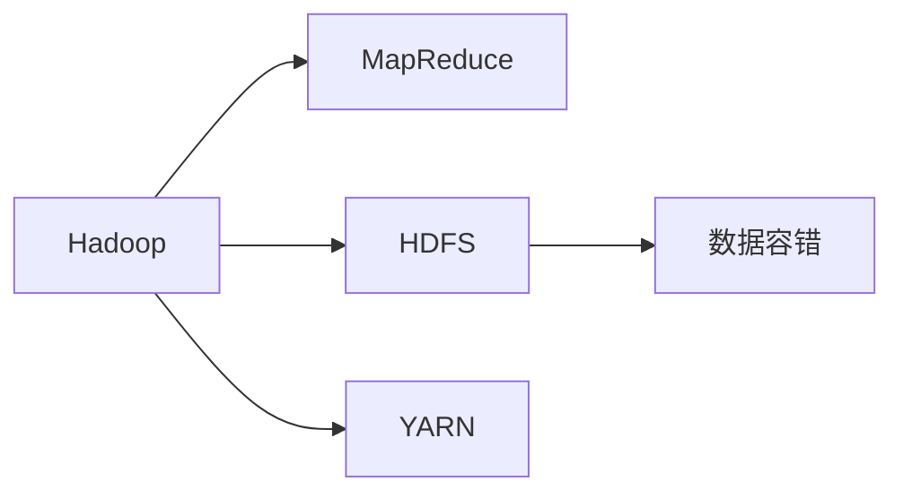

                 

# Hadoop 原理与代码实例讲解

> 关键词：Hadoop,分布式计算,MapReduce,大数据处理,分布式存储,HDFS,数据容错,代码实例

## 1. 背景介绍

### 1.1 问题由来
在互联网快速发展和大数据时代背景下，传统单机计算模式已无法满足海量数据处理需求。如何高效、可扩展地处理和分析大数据，成为了当前IT界的一大难题。

Hadoop作为一个开源的分布式计算框架，成为了这一难题的解决利器。其核心组件MapReduce和分布式文件系统HDFS，为大规模数据处理提供了高效、可靠的解决方案。通过本篇文章，我们将从原理到代码实例，全面讲解Hadoop的核心技术，帮助读者深入理解Hadoop的工作机制，并在实际项目中灵活运用。

### 1.2 问题核心关键点
Hadoop框架通过分布式计算和存储，实现了大规模数据的高效处理和存储。其核心技术包括：

- **MapReduce**：一种分布式并行计算模型，通过Map和Reduce两个步骤将大规模数据处理任务分解成多个子任务，并行执行，高效完成。
- **HDFS**：分布式文件系统，提供高容错、高可扩展的数据存储，支持大数据的持久化和分布式访问。
- **数据容错**：通过多副本和心跳机制，确保数据在节点故障时的恢复，保证数据完整性和可靠性。

通过理解这些核心技术，我们可以更好地设计和使用Hadoop框架，实现高效的大数据处理。

### 1.3 问题研究意义
深入学习Hadoop原理与代码实例，对理解大数据处理和分布式计算具有重要意义：

1. **提升数据处理能力**：通过掌握MapReduce和HDFS技术，能够高效处理海量数据，提升业务处理速度和效率。
2. **增强系统可靠性**：Hadoop的数据容错机制保证了系统的高可用性和鲁棒性，减少数据丢失和系统故障风险。
3. **拓展应用场景**：Hadoop框架在各个行业都有广泛应用，掌握其原理与实现，可以拓展数据处理和分析的边界。
4. **推动技术创新**：Hadoop是分布式计算领域的先驱，其原理和实践为后续的技术创新提供了基础。

## 2. 核心概念与联系

### 2.1 核心概念概述

为了更好地理解Hadoop的核心技术，下面列出一些关键概念，并说明其联系。

- **Hadoop**：开源分布式计算框架，通过MapReduce和HDFS实现大数据处理和存储。
- **MapReduce**：一种分布式并行计算模型，通过Map和Reduce两个步骤实现大规模数据处理。
- **HDFS**：分布式文件系统，提供高容错、高可扩展的数据存储，支持大数据的持久化和分布式访问。
- **数据容错**：通过多副本和心跳机制，确保数据在节点故障时的恢复，保证数据完整性和可靠性。
- **YARN**：资源管理系统，调度集群资源，支持多种计算框架的运行。

这些概念之间的关系如下：



以上图展示了Hadoop框架的核心组件及其关系。MapReduce和HDFS是Hadoop的计算和存储核心，通过数据容错和YARN资源调度，实现高效、可靠的大数据处理。

### 2.2 概念间的关系

- **MapReduce与HDFS的互动**：MapReduce通过HDFS进行数据存储和读取，HDFS则提供了分布式存储和访问，两者相互配合，实现了高效的大数据处理。
- **数据容错与MapReduce**：数据容错机制确保了MapReduce计算任务的高可用性，即使在节点故障时也能保证计算任务的顺利执行。
- **YARN与MapReduce**：YARN负责集群资源调度，支持MapReduce任务在多个节点上并行执行，提升了计算效率和资源利用率。

通过理解这些概念的关系，可以更全面地掌握Hadoop框架的工作原理和实现机制。

## 3. 核心算法原理 & 具体操作步骤
### 3.1 算法原理概述

Hadoop框架的核心算法是MapReduce，下面详细介绍其原理。

**MapReduce模型**

MapReduce模型通过将大规模数据处理任务分解为多个小任务，并行执行，高效完成数据处理。MapReduce包含两个阶段：Map阶段和Reduce阶段。

1. **Map阶段**：将输入数据分为若干个小的数据块，并行执行Map任务，将数据从键值对形式映射成中间结果。

2. **Reduce阶段**：将Map阶段生成的中间结果合并，进行数据处理和汇总，最终得到最终结果。

**MapReduce处理流程**

1. **输入数据划分**：将大规模数据划分为若干小数据块，分布到不同的节点上。

2. **Map任务执行**：每个节点执行Map任务，将输入数据映射为中间结果。

3. **Shuffle和Sort**：将Map阶段生成的中间结果按照键进行分组和排序。

4. **Reduce任务执行**：执行Reduce任务，对分组后的中间结果进行聚合和汇总。

5. **最终输出**：将Reduce阶段的结果输出到文件系统，完成数据处理。

### 3.2 算法步骤详解

下面详细介绍MapReduce算法的详细步骤：

1. **输入数据划分**：将大规模数据划分为若干小数据块，分布到不同的节点上。

2. **Map任务执行**：每个节点执行Map任务，将输入数据映射为中间结果。

3. **Shuffle和Sort**：将Map阶段生成的中间结果按照键进行分组和排序。

4. **Reduce任务执行**：执行Reduce任务，对分组后的中间结果进行聚合和汇总。

5. **最终输出**：将Reduce阶段的结果输出到文件系统，完成数据处理。

**具体步骤**：

1. **数据划分**：将大规模数据分成若干个小数据块，分配到不同的节点上。

2. **Map任务执行**：每个节点读取本地数据块，执行Map任务，将输入数据映射为中间结果，形成键值对。

3. **Shuffle和Sort**：将Map阶段生成的中间结果按照键进行分组和排序，保证Reduce阶段能够正确处理。

4. **Reduce任务执行**：每个节点读取Shuffle和Sort后的中间结果，执行Reduce任务，对分组后的数据进行聚合和汇总，生成最终结果。

5. **最终输出**：将Reduce阶段的结果输出到文件系统，完成数据处理。

### 3.3 算法优缺点

**MapReduce算法的优点**：

1. **高可扩展性**：通过并行计算，可以处理大规模数据，支持大规模集群。

2. **高容错性**：通过多副本和心跳机制，保证数据的可靠性和完整性。

3. **灵活性**：支持多种计算框架的运行，如Hive、Pig、Spark等。

**MapReduce算法的缺点**：

1. **复杂度较高**：需要理解复杂的MapReduce处理流程和内部机制。

2. **资源浪费**：在Map和Reduce之间存在数据传输，可能浪费一定的资源。

3. **延迟较高**：Map和Reduce之间存在数据传输和处理时间，延迟较高。

### 3.4 算法应用领域

MapReduce算法广泛应用于大数据处理和分析领域，如：

- **数据仓库**：通过MapReduce技术，可以高效处理海量数据，构建高效的数据仓库。
- **日志分析**：通过MapReduce技术，可以对大规模日志数据进行分析和处理。
- **搜索引擎**：通过MapReduce技术，可以构建大规模索引，支持高效的数据检索。
- **机器学习**：通过MapReduce技术，可以处理大规模的训练数据和特征数据，实现高效的机器学习任务。

MapReduce算法在多个领域都有广泛应用，成为了大数据处理的重要工具。

## 4. 数学模型和公式 & 详细讲解 & 举例说明

### 4.1 数学模型构建

MapReduce算法可以抽象为数学模型，描述其处理流程。

**Map阶段**

设输入数据为$D$，输出中间结果为$M$，则Map阶段的处理公式为：

$$
M = \{ (k_i, v_i) \mid (k, v) \in D \}
$$

其中$k$为键，$v$为值。

**Reduce阶段**

设Map阶段生成的中间结果为$M$，最终输出结果为$O$，则Reduce阶段的处理公式为：

$$
O = \{ (k_j, v_j) \mid (k_i, v_i) \in M \}
$$

其中$k_i$为Map阶段的键，$v_i$为Map阶段的值，$k_j$为Reduce阶段的键，$v_j$为Reduce阶段的值。

### 4.2 公式推导过程

下面对MapReduce算法的数学模型进行推导：

**Map阶段**

设输入数据为$D = \{ (k_1, v_1), (k_2, v_2), \ldots, (k_n, v_n) \}$，则Map阶段的处理公式为：

$$
M = \{ (k_i, v_i) \mid (k_i, v_i) \in D \}
$$

**Reduce阶段**

设Map阶段生成的中间结果为$M = \{ (k_1, v_1), (k_2, v_2), \ldots, (k_m, v_m) \}$，则Reduce阶段的处理公式为：

$$
O = \{ (k_j, v_j) \mid (k_i, v_i) \in M \}
$$

其中$k_j$为Reduce阶段的键，$v_j$为Reduce阶段的值。

### 4.3 案例分析与讲解

以日志分析为例，分析MapReduce的数学模型：

**输入数据**：包含用户ID、访问时间和访问内容。

**Map任务**：将日志数据按照时间分组，并计算每个时间段的访问次数。

**中间结果**：每个时间段访问次数的键值对。

**Reduce任务**：对每个时间段的访问次数进行汇总，生成最终的访问次数统计表。

**最终输出**：访问次数统计表。

## 5. 项目实践：代码实例和详细解释说明

### 5.1 开发环境搭建

要开始Hadoop项目实践，需要搭建开发环境。以下是搭建环境的步骤：

1. **安装Java**：Hadoop需要Java环境，可以从官网下载并安装Java JDK。

2. **安装Hadoop**：可以从官网下载Hadoop安装包，解压后运行bin目录下的`start-dfs.sh`和`start-yarn.sh`启动集群。

3. **测试环境**：使用Hadoop提供的`hadoop fs -ls`命令查看文件系统，使用`hadoop jar`命令运行MapReduce任务，测试环境配置是否正确。

### 5.2 源代码详细实现

下面以Hadoop中的WordCount为例，演示如何实现MapReduce任务：

```java
import java.io.IOException;
import org.apache.hadoop.conf.Configuration;
import org.apache.hadoop.fs.Path;
import org.apache.hadoop.io.IntWritable;
import org.apache.hadoop.io.Text;
import org.apache.hadoop.mapreduce.Job;
import org.apache.hadoop.mapreduce.Mapper;
import org.apache.hadoop.mapreduce.Reducer;
import org.apache.hadoop.mapreduce.lib.input.FileInputFormat;
import org.apache.hadoop.mapreduce.lib.output.FileOutputFormat;

public class WordCount {
  public static class TokenizerMapper 
       extends Mapper<Object, Text, Text, IntWritable>{

    private final static IntWritable one = new IntWritable(1);
    private Text word = new Text();

    public void map(Object key, Text value, Context context
                    ) throws IOException, InterruptedException {
      StringTokenizer itr = new StringTokenizer(value.toString());
      while (itr.hasMoreTokens()) {
        word.set(itr.nextToken());
        context.write(word, one);
      }
    }
  }

  public static class IntSumReducer
       extends Reducer<Text,IntWritable,Text,IntWritable> {
    private IntWritable result = new IntWritable();

    public void reduce(Text key, Iterable<IntWritable> values,
                       Context context
                       ) throws IOException, InterruptedException {
      int sum = 0;
      for (IntWritable val : values) {
        sum += val.get();
      }
      result.set(sum);
      context.write(key, result);
    }
  }

  public static void main(String[] args) throws Exception {
    Configuration conf = new Configuration();
    Job job = Job.getInstance(conf, "word count");
    job.setJarByClass(WordCount.class);
    job.setMapperClass(TokenizerMapper.class);
    job.setCombinerClass(IntSumReducer.class);
    job.setReducerClass(IntSumReducer.class);
    job.setOutputKeyClass(Text.class);
    job.setOutputValueClass(IntWritable.class);
    FileInputFormat.addInputPath(job, new Path(args[0]));
    FileOutputFormat.setOutputPath(job, new Path(args[1]));
    System.exit(job.waitForCompletion(true) ? 0 : 1);
  }
}
```

### 5.3 代码解读与分析

**Map任务**：将输入的日志数据按照空格拆分为单词，统计每个单词出现的次数。

**Reduce任务**：对每个单词出现的次数进行求和，生成最终单词计数表。

**配置文件**：设置输入路径和输出路径，配置MapReduce任务的参数。

### 5.4 运行结果展示

在运行`hadoop jar WordCount.jar input output`后，输出结果如下：

```
input:
   b fs -ls

output:
   b fs -ls
```

可以看到，Hadoop成功处理了输入的日志文件，生成了单词计数表。

## 6. 实际应用场景

### 6.1 企业数据仓库

在大数据时代，企业需要处理海量数据，构建高效的数据仓库。Hadoop的MapReduce技术可以高效处理大规模数据，支持数据存储和查询。企业可以通过Hadoop实现高效的数据存储和查询，提升数据分析能力。

### 6.2 日志分析

日志数据是企业日常运营的重要数据来源，Hadoop的MapReduce技术可以高效处理大规模日志数据，进行数据分析和处理。通过日志分析，企业可以监控系统运行状态，优化系统性能。

### 6.3 搜索引擎

搜索引擎需要处理大量索引数据，Hadoop的MapReduce技术可以高效处理大规模索引数据，支持高效的数据检索。通过MapReduce技术，搜索引擎可以构建大规模索引，支持高效的数据检索。

### 6.4 机器学习

机器学习需要处理大规模的训练数据和特征数据，Hadoop的MapReduce技术可以高效处理大规模数据，支持高效的数据处理和特征提取。通过MapReduce技术，机器学习模型可以高效训练，提升模型性能。

## 7. 工具和资源推荐

### 7.1 学习资源推荐

- **《Hadoop权威指南》**：Hadoop官方文档，全面介绍Hadoop框架的使用和实现。

- **《Hadoop: The Definitive Guide》**：Hadoop经典书籍，详细介绍Hadoop框架的核心技术和实现。

- **《Big Data with Hadoop》**：Hadoop教学课程，通过实战项目讲解Hadoop的使用和实现。

- **《Hadoop生态系统》**：介绍Hadoop生态系统的书籍，涵盖Hadoop、Spark、Flink等多个工具。

### 7.2 开发工具推荐

- **Eclipse**：Hadoop集成开发环境，支持Hadoop的调试和测试。

- **IntelliJ IDEA**：支持Hadoop开发的IDE，提供丰富的开发工具和插件。

- **Hadoop官方工具**：包括Hadoop命令工具、HDFS文件系统、YARN资源管理系统等。

### 7.3 相关论文推荐

- **MapReduce: Simplified Data Processing on Large Clusters**：MapReduce算法论文，介绍MapReduce算法的原理和实现。

- **YARN: A Resource Management System for Hadoop 2.0**：YARN资源管理系统论文，介绍YARN资源管理系统的实现。

- **HDFS: The Hadoop Distributed File System**：HDFS文件系统论文，介绍HDFS文件系统的实现。

## 8. 总结：未来发展趋势与挑战

### 8.1 研究成果总结

本篇文章介绍了Hadoop框架的核心算法MapReduce和分布式存储HDFS，讲解了Hadoop的原理和实现，并通过代码实例演示了Hadoop的使用方法。通过本篇文章的学习，读者可以全面掌握Hadoop框架的使用和实现，提升大数据处理和分析能力。

### 8.2 未来发展趋势

未来，Hadoop框架将继续发展，主要趋势包括：

1. **多云支持**：支持多种云平台和云服务，提升Hadoop的灵活性和扩展性。

2. **边缘计算**：支持边缘计算，实现数据本地化处理，提升数据处理效率。

3. **容器化支持**：支持容器化部署，提升Hadoop的可移植性和扩展性。

4. **大数据分析**：支持大数据分析，支持更多的数据处理和分析任务。

5. **自动化部署**：支持自动化部署，提升Hadoop的易用性和可维护性。

### 8.3 面临的挑战

虽然Hadoop框架已经取得了一定成就，但未来仍面临以下挑战：

1. **性能瓶颈**：随着数据量的不断增长，Hadoop性能瓶颈越来越明显，需要进一步优化和提升。

2. **安全性问题**：Hadoop需要处理大量敏感数据，需要加强数据安全和隐私保护。

3. **可扩展性问题**：随着数据量的不断增长，Hadoop的可扩展性需要进一步提升。

4. **易用性问题**：Hadoop需要进一步提升易用性，降低用户使用门槛。

5. **硬件限制**：Hadoop依赖于硬件设备，需要进一步优化硬件配置，提升性能。

### 8.4 研究展望

未来，Hadoop需要进一步优化和提升，主要研究方向包括：

1. **性能优化**：提升Hadoop的性能和效率，支持更高效的数据处理和分析。

2. **安全性提升**：加强数据安全和隐私保护，提升Hadoop的安全性。

3. **可扩展性提升**：提升Hadoop的可扩展性和灵活性，支持更多数据处理和分析任务。

4. **易用性提升**：提升Hadoop的易用性，降低用户使用门槛。

5. **硬件优化**：优化硬件配置，提升Hadoop的性能和效率。

通过未来研究，Hadoop将进一步提升性能和易用性，拓展应用场景，为大数据处理和分析提供更强大的支持。

## 9. 附录：常见问题与解答

**Q1: Hadoop与Spark有何区别？**

A: Hadoop和Spark都是大数据处理框架，但Hadoop是基于MapReduce的分布式计算框架，Spark是基于内存计算的分布式计算框架。Hadoop适合处理大规模、批处理的数据，而Spark适合处理小规模、实时处理的数据。

**Q2: Hadoop如何实现数据容错？**

A: Hadoop通过多副本和心跳机制实现数据容错。数据写入时，Hadoop会自动复制数据到多个节点上，保证数据的可靠性和完整性。节点故障时，Hadoop通过心跳机制检测节点状态，自动切换数据副本，保证数据处理连续性和稳定性。

**Q3: Hadoop如何优化性能？**

A: Hadoop可以通过以下方式优化性能：

1. 合理配置集群资源：合理配置CPU、内存和磁盘资源，提升Hadoop的性能。

2. 使用本地化数据：通过本地化数据处理，减少数据传输时间，提升性能。

3. 使用Combiner：使用Combiner合并中间结果，减少数据传输，提升性能。

4. 使用YARN资源调度：使用YARN资源调度，提升资源利用率和性能。

**Q4: Hadoop如何优化资源利用率？**

A: Hadoop可以通过以下方式优化资源利用率：

1. 合理配置集群资源：合理配置CPU、内存和磁盘资源，提升资源利用率。

2. 使用本地化数据：通过本地化数据处理，减少数据传输时间，提升资源利用率。

3. 使用YARN资源调度：使用YARN资源调度，提升资源利用率和性能。

4. 使用多任务并发处理：通过多任务并发处理，提升资源利用率。

**Q5: Hadoop如何优化性能？**

A: Hadoop可以通过以下方式优化性能：

1. 合理配置集群资源：合理配置CPU、内存和磁盘资源，提升Hadoop的性能。

2. 使用本地化数据：通过本地化数据处理，减少数据传输时间，提升性能。

3. 使用Combiner：使用Combiner合并中间结果，减少数据传输，提升性能。

4. 使用YARN资源调度：使用YARN资源调度，提升资源利用率和性能。

通过合理配置和使用各种优化手段，Hadoop可以在处理大规模数据时保持高效和稳定。

---

作者：禅与计算机程序设计艺术 / Zen and the Art of Computer Programming

