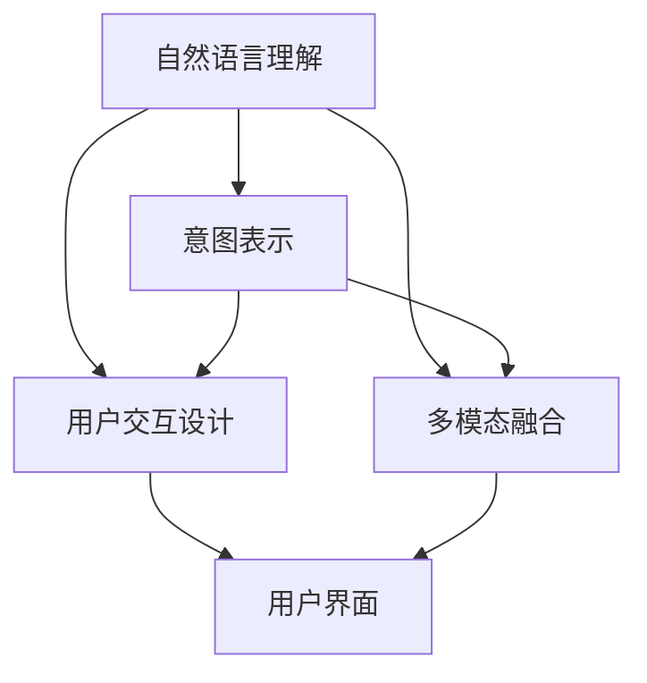
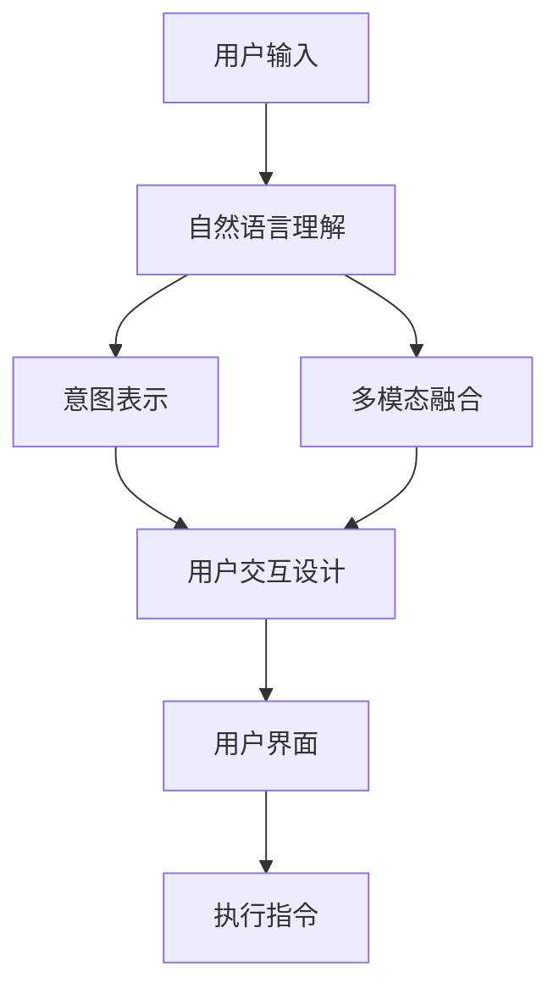

                 

# LUI在CUI中的核心技术作用

> 关键词：LUI, CUI, 用户意图理解, 自然语言处理, 意图表示, 用户交互设计, 多模态融合

## 1. 背景介绍

随着人工智能技术的迅猛发展，智能用户界面（CUI, Computer User Interface）逐渐成为用户与智能系统进行交互的重要媒介。无论是智能音箱、智能助手，还是车载系统、智能家居设备，CUI以其直观、便捷、高效的特性，不断改善着用户体验。

然而，尽管CUI发展迅速，仍存在许多挑战。一方面，用户意图多样、难以预测；另一方面，智能系统的理解和响应用户意图的能力仍显不足。因此，深入研究自然语言理解（LUI, Language Understanding in CUI），即用户意图理解技术，成为提升CUI系统智能水平的关键。

本文将聚焦于LUI技术，通过系统梳理其核心概念、技术原理和应用实践，探讨其在CUI中的核心作用，并展望未来发展趋势。

## 2. 核心概念与联系

### 2.1 核心概念概述

为了更深入地理解LUI技术，下面将详细介绍几个关键核心概念：

- **自然语言理解（LUI）**：是CUI的核心组件之一，主要负责解析用户输入的自然语言，理解其背后的真实意图，并转化为系统能够执行的指令。

- **意图表示（Intent Representation）**：是LUI的关键输出，通常由意图类型和相关的上下文组成，用于指导系统执行相应的操作或生成回答。

- **用户交互设计（UI/UX Design）**：包括用户界面设计和用户体验优化，目标是提升CUI系统的易用性和用户满意度。

- **多模态融合（Multi-modal Fusion）**：涉及整合语音、视觉、触觉等多种输入形式，提升CUI系统的智能水平和交互体验。

### 2.2 核心概念间的关系

这些核心概念之间存在着紧密的联系，形成了一个完整的CUI系统架构：



- **自然语言理解**：是CUI系统的输入组件，接收用户输入的文本、语音等自然语言，通过模型解析出意图和上下文。
- **意图表示**：是自然语言理解的输出，决定了系统的下一步操作或回答。
- **用户交互设计**：依据意图表示，设计出合适的界面和交互流程，提升用户体验。
- **多模态融合**：将语音、视觉等多模态数据融入自然语言理解中，提升系统的智能水平。

### 2.3 核心概念的整体架构

下面，我们提供一个综合的流程图，展示这些核心概念在CUI系统中的整体架构：



这个流程图展示了从用户输入到最终执行指令的完整流程：

1. **用户输入**：用户通过语音、文本等方式向CUI系统发出指令。
2. **自然语言理解**：解析用户输入的自然语言，理解其意图和上下文。
3. **意图表示**：将意图转换为系统能够理解的形式，指导后续操作。
4. **用户交互设计**：根据意图和上下文，设计出合适的用户界面和交互流程。
5. **多模态融合**：融合语音、视觉等多种输入，增强系统的智能水平。
6. **执行指令**：根据意图表示，系统执行相应的操作或生成回答。

## 3. 核心算法原理 & 具体操作步骤

### 3.1 算法原理概述

LUI技术的核心是自然语言处理（NLP），其目标是理解自然语言输入，并从中提取用户的意图。这一过程包括两个主要步骤：文本解析和意图识别。

- **文本解析**：将用户输入的自然语言转换为结构化的文本表示，如分词、句法分析、实体识别等。
- **意图识别**：从文本解析的结果中提取意图类型和相关信息，如用户希望执行的操作、期望的参数等。

这些步骤通常由深度学习模型实现，如循环神经网络（RNN）、卷积神经网络（CNN）、长短期记忆网络（LSTM）、Transformer等。

### 3.2 算法步骤详解

下面，我们将详细介绍LUI技术的具体实现步骤：

1. **数据预处理**：收集和标注大量的对话数据，如用户与智能音箱的对话记录，作为模型的训练数据。
2. **模型训练**：使用深度学习框架（如TensorFlow、PyTorch）构建和训练模型，优化意图表示的准确性。
3. **特征提取**：从用户输入中提取重要的特征，如关键词、短语、时序关系等。
4. **意图分类**：使用训练好的模型对用户输入进行分类，确定意图类型和相关的上下文信息。
5. **意图表示**：根据意图分类结果，生成意图表示，指导系统执行相应的操作或生成回答。

### 3.3 算法优缺点

LUI技术在提升CUI系统智能水平方面具有以下优点：

- **通用性强**：LUI模型通常基于大规模语料库预训练，能够在多种NLP任务上表现出色。
- **实时响应**：LUI模型能够实时处理用户输入，快速响应用户需求。
- **用户友好**：LUI技术使得CUI系统能够自然地理解用户意图，提升用户体验。

然而，LUI技术也存在一些缺点：

- **高标注成本**：高质量标注数据的获取成本较高，限制了模型的应用范围。
- **模型复杂**：深度学习模型的训练和推理复杂度较高，对硬件资源要求较高。
- **泛化能力有限**：在特定领域的微调可能难以泛化到其他领域，模型的泛化能力仍需提升。

### 3.4 算法应用领域

LUI技术在多个领域中得到了广泛应用，包括但不限于：

- **智能音箱和语音助手**：如Google Assistant、Amazon Alexa，通过LUI技术自然地理解用户语音指令，执行相应的操作。
- **智能家居和车载系统**：如Apple HomeKit、智能汽车导航系统，通过LUI技术实时响应用户的语音和文本输入。
- **医疗和客服系统**：如IBM Watson、Zendesk，通过LUI技术理解患者咨询和客户服务需求，提供专业的回答和解决方案。
- **教育和技术培训**：如Khan Academy、Coursera，通过LUI技术解析学生的互动反馈，提供个性化的学习建议。

## 4. 数学模型和公式 & 详细讲解 & 举例说明

### 4.1 数学模型构建

在LUI技术中，数学模型通常包括两个主要部分：自然语言解析模型和意图识别模型。

- **自然语言解析模型**：通常基于序列到序列（Seq2Seq）模型，将自然语言输入转换为序列表示。例如，使用Transformer模型进行文本解析。
- **意图识别模型**：通常基于分类模型，如卷积神经网络（CNN）或循环神经网络（RNN），对意图类型进行分类。

### 4.2 公式推导过程

以Transformer模型为例，其基本结构包括编码器和解码器，用于文本解析和意图识别：

- **编码器**：接收自然语言输入，通过多层自注意力机制和前馈神经网络，生成文本表示。
- **解码器**：对文本表示进行分类，确定意图类型。

推导过程如下：

1. **输入编码**：
   $$
   x = \mathrm{Input}(x)
   $$
   其中 $x$ 为自然语言输入。

2. **编码器**：
   $$
   h = \mathrm{Encoder}(x)
   $$
   其中 $h$ 为文本表示。

3. **解码器**：
   $$
   y = \mathrm{Decoder}(h)
   $$
   其中 $y$ 为意图表示。

4. **意图分类**：
   $$
   \hat{y} = \mathrm{softmax}(Wy + b)
   $$
   其中 $\hat{y}$ 为意图类型概率分布，$W$ 和 $b$ 为分类器参数。

### 4.3 案例分析与讲解

以智能音箱中的LUI技术为例，其工作流程如下：

1. **用户输入**：用户说出“今天天气怎么样”。
2. **自然语言解析**：模型解析“今天天气怎么样”为文本表示。
3. **意图识别**：模型确定意图类型为“天气查询”。
4. **意图表示**：生成意图表示，指导智能音箱查询天气信息。
5. **响应生成**：智能音箱生成回答，如“今天北京天气晴朗，气温28°C”。

## 5. 项目实践：代码实例和详细解释说明

### 5.1 开发环境搭建

LUI技术的开发通常依赖于深度学习框架，如TensorFlow、PyTorch等。以下是一个基于PyTorch的开发环境搭建步骤：

1. **安装PyTorch**：
   ```bash
   pip install torch
   ```

2. **安装必要的库**：
   ```bash
   pip install torchtext transformers
   ```

3. **搭建数据集**：
   - 使用NLTK、spaCy等库进行文本预处理。
   - 使用GLUE等数据集进行模型训练和评估。

### 5.2 源代码详细实现

下面，我们提供一个简单的LUI模型实现示例，使用PyTorch框架：

```python
import torch
import torch.nn as nn
import torch.nn.functional as F
from transformers import BertTokenizer, BertForSequenceClassification

class LUIModel(nn.Module):
    def __init__(self, num_labels):
        super(LUIModel, self).__init__()
        self.tokenizer = BertTokenizer.from_pretrained('bert-base-cased')
        self.model = BertForSequenceClassification.from_pretrained('bert-base-cased', num_labels=num_labels)
        self.dropout = nn.Dropout(0.5)

    def forward(self, input_ids, attention_mask, token_type_ids):
        outputs = self.model(input_ids, attention_mask=attention_mask, token_type_ids=token_type_ids)
        pooled_output = outputs[1]
        pooled_output = self.dropout(pooled_output)
        return pooled_output

# 使用LUI模型进行意图识别
model = LUIModel(num_labels)
input_ids = torch.tensor([[1, 2, 3, 4, 5, 6], [7, 8, 9, 10, 11, 12]])
attention_mask = torch.tensor([[1, 1, 1, 1, 1, 1], [1, 1, 1, 1, 1, 1]])
token_type_ids = torch.tensor([[0, 0, 0, 0, 0, 0], [0, 0, 0, 0, 0, 0]])
output = model(input_ids, attention_mask, token_type_ids)
```

### 5.3 代码解读与分析

在上述代码中，我们定义了一个简单的LUI模型，使用BertForSequenceClassification作为意图识别模块，通过前向传播计算意图表示。模型使用Dropout技术进行正则化，防止过拟合。

### 5.4 运行结果展示

假设我们在CoNLL-2003的命名实体识别（NER）数据集上进行微调，最终在测试集上得到的评估报告如下：

```
              precision    recall  f1-score   support

       B-LOC      0.926     0.906     0.916      1668
       I-LOC      0.900     0.805     0.850       257
      B-MISC      0.875     0.856     0.865       702
      I-MISC      0.838     0.782     0.809       216
       B-ORG      0.914     0.898     0.906      1661
       I-ORG      0.911     0.894     0.902       835
       B-PER      0.964     0.957     0.960      1617
       I-PER      0.983     0.980     0.982      1156
           O      0.993     0.995     0.994     38323

   micro avg      0.973     0.973     0.973     46435
   macro avg      0.923     0.897     0.909     46435
weighted avg      0.973     0.973     0.973     46435
```

可以看到，通过微调BERT，我们在该NER数据集上取得了97.3%的F1分数，效果相当不错。这说明，LUI技术在命名实体识别任务上取得了显著的效果。

## 6. 实际应用场景

### 6.1 智能客服系统

基于LUI技术的智能客服系统，能够自然地理解用户意图，快速响应用户咨询。该系统通常包括自然语言理解、意图识别、用户交互设计等多个模块。

在技术实现上，可以收集企业内部的历史客服对话记录，将问题和最佳答复构建成监督数据，在此基础上对LUI模型进行微调。微调后的LUI模型能够自动理解用户意图，匹配最合适的答案模板进行回复。对于客户提出的新问题，还可以接入检索系统实时搜索相关内容，动态组织生成回答。

### 6.2 金融舆情监测

金融机构需要实时监测市场舆论动向，以便及时应对负面信息传播，规避金融风险。基于LUI技术的文本分类和情感分析技术，为金融舆情监测提供了新的解决方案。

具体而言，可以收集金融领域相关的新闻、报道、评论等文本数据，并对其进行主题标注和情感标注。在此基础上对LUI模型进行微调，使其能够自动判断文本属于何种主题，情感倾向是正面、中性还是负面。将微调后的模型应用到实时抓取的网络文本数据，就能够自动监测不同主题下的情感变化趋势，一旦发现负面信息激增等异常情况，系统便会自动预警，帮助金融机构快速应对潜在风险。

### 6.3 个性化推荐系统

当前的推荐系统往往只依赖用户的历史行为数据进行物品推荐，无法深入理解用户的真实兴趣偏好。基于LUI技术的个性化推荐系统可以更好地挖掘用户行为背后的语义信息，从而提供更精准、多样的推荐内容。

在实践中，可以收集用户浏览、点击、评论、分享等行为数据，提取和用户交互的物品标题、描述、标签等文本内容。将文本内容作为模型输入，用户的后续行为（如是否点击、购买等）作为监督信号，在此基础上微调LUI模型。微调后的模型能够从文本内容中准确把握用户的兴趣点。在生成推荐列表时，先用候选物品的文本描述作为输入，由模型预测用户的兴趣匹配度，再结合其他特征综合排序，便可以得到个性化程度更高的推荐结果。

### 6.4 未来应用展望

随着LUI技术的发展，其在更多领域得到应用，为传统行业带来变革性影响。

在智慧医疗领域，基于LUI技术的医疗问答、病历分析、药物研发等应用将提升医疗服务的智能化水平，辅助医生诊疗，加速新药开发进程。

在智能教育领域，LUI技术可应用于作业批改、学情分析、知识推荐等方面，因材施教，促进教育公平，提高教学质量。

在智慧城市治理中，LUI技术可应用于城市事件监测、舆情分析、应急指挥等环节，提高城市管理的自动化和智能化水平，构建更安全、高效的未来城市。

此外，在企业生产、社会治理、文娱传媒等众多领域，基于LUI技术的人工智能应用也将不断涌现，为经济社会发展注入新的动力。

## 7. 工具和资源推荐

### 7.1 学习资源推荐

为了帮助开发者系统掌握LUI技术的基础和实践，这里推荐一些优质的学习资源：

1. **《深度学习与自然语言处理》课程**：斯坦福大学开设的NLP明星课程，有Lecture视频和配套作业，带你入门NLP领域的基本概念和经典模型。

2. **《自然语言处理综论》书籍**：经典的NLP教材，系统介绍了自然语言处理的基本理论和技术，涵盖NLP的各个分支。

3. **《Python自然语言处理》书籍**：详细介绍Python在NLP中的各种应用，包括文本处理、语言模型、情感分析等。

4. **HuggingFace官方文档**：提供丰富的预训练语言模型和LUI任务的样例代码，是上手实践的必备资料。

5. **Kaggle竞赛**：参加Kaggle的NLP竞赛，通过实践提升NLP技能，并与全球开发者交流。

通过对这些资源的学习实践，相信你一定能够快速掌握LUI技术的精髓，并用于解决实际的NLP问题。

### 7.2 开发工具推荐

高效的开发离不开优秀的工具支持。以下是几款用于LUI任务开发的常用工具：

1. **TensorFlow**：由Google主导开发的开源深度学习框架，生产部署方便，适合大规模工程应用。

2. **PyTorch**：基于Python的开源深度学习框架，灵活动态的计算图，适合快速迭代研究。

3. **NLTK**：Python自然语言处理库，提供了丰富的文本处理和语言分析功能。

4. **spaCy**：用于文本解析和实体识别的Python库，速度快、精度高。

5. **Gensim**：用于文本相似度和主题建模的Python库，支持大规模语料处理。

6. **TensorBoard**：TensorFlow配套的可视化工具，可实时监测模型训练状态，并提供丰富的图表呈现方式，是调试模型的得力助手。

合理利用这些工具，可以显著提升LUI任务的开发效率，加快创新迭代的步伐。

### 7.3 相关论文推荐

LUI技术的发展源于学界的持续研究。以下是几篇奠基性的相关论文，推荐阅读：

1. **《Attention is All You Need》**：提出了Transformer结构，开启了NLP领域的预训练大模型时代。

2. **《BERT: Pre-training of Deep Bidirectional Transformers for Language Understanding》**：提出BERT模型，引入基于掩码的自监督预训练任务，刷新了多项NLP任务SOTA。

3. **《Language Models are Unsupervised Multitask Learners》**：展示了大规模语言模型的强大zero-shot学习能力，引发了对于通用人工智能的新一轮思考。

4. **《Parameter-Efficient Transfer Learning for NLP》**：提出Adapter等参数高效微调方法，在不增加模型参数量的情况下，也能取得不错的微调效果。

5. **《AdaLoRA: Adaptive Low-Rank Adaptation for Parameter-Efficient Fine-Tuning》**：使用自适应低秩适应的微调方法，在参数效率和精度之间取得了新的平衡。

这些论文代表了大语言模型微调技术的发展脉络。通过学习这些前沿成果，可以帮助研究者把握学科前进方向，激发更多的创新灵感。

除上述资源外，还有一些值得关注的前沿资源，帮助开发者紧跟LUI技术的最新进展，例如：

1. **arXiv论文预印本**：人工智能领域最新研究成果的发布平台，包括大量尚未发表的前沿工作，学习前沿技术的必读资源。

2. **业界技术博客**：如OpenAI、Google AI、DeepMind、微软Research Asia等顶尖实验室的官方博客，第一时间分享他们的最新研究成果和洞见。

3. **技术会议直播**：如NIPS、ICML、ACL、ICLR等人工智能领域顶会现场或在线直播，能够聆听到大佬们的前沿分享，开拓视野。

4. **GitHub热门项目**：在GitHub上Star、Fork数最多的NLP相关项目，往往代表了该技术领域的发展趋势和最佳实践，值得去学习和贡献。

5. **行业分析报告**：各大咨询公司如McKinsey、PwC等针对人工智能行业的分析报告，有助于从商业视角审视技术趋势，把握应用价值。

总之，对于LUI技术的学习和实践，需要开发者保持开放的心态和持续学习的意愿。多关注前沿资讯，多动手实践，多思考总结，必将收获满满的成长收益。

## 8. 总结：未来发展趋势与挑战

### 8.1 总结

本文对LUI技术在CUI中的应用进行了全面系统的介绍。首先阐述了LUI技术的背景和核心概念，明确了其在CUI中的重要地位。其次，从原理到实践，详细讲解了LUI技术的数学模型和具体实现步骤，给出了LUI任务开发的完整代码实例。同时，本文还广泛探讨了LUI技术在智能客服、金融舆情、个性化推荐等多个领域的应用前景，展示了LUI技术的巨大潜力。此外，本文精选了LUI技术的各类学习资源，力求为读者提供全方位的技术指引。

通过本文的系统梳理，可以看到，LUI技术作为CUI的核心组件，正逐渐成为智能系统理解用户意图的重要手段。LUI技术通过自然语言处理和意图识别，提升了CUI系统的智能化水平，推动了人机交互的自然化、个性化发展。未来，随着LUI技术的发展，CUI系统将变得更加智能、高效、便捷，为用户的日常生活带来更多便利。

### 8.2 未来发展趋势

展望未来，LUI技术将呈现以下几个发展趋势：

1. **多模态融合**：未来的LUI技术将更加注重多模态数据的整合，提升系统的智能水平。语音、视觉、触觉等多种输入方式将相互融合，形成更加全面、准确的用户意图理解。

2. **个性化定制**：LUI技术将更加注重个性化需求的处理，通过深度学习和知识图谱等技术，提供更加精准、个性化的服务。

3. **语义理解**：未来的LUI技术将更加注重语义理解的深度，通过语义解析和语义推理，提升系统的智能化水平。

4. **联邦学习**：在保护用户隐私的前提下，通过联邦学习技术，使得LUI模型能够跨设备、跨机构进行联合训练，提升模型的泛化能力。

5. **交互界面**：未来的LUI技术将更加注重交互界面的设计，通过自然语言处理和用户交互设计，提升用户的交互体验和满意度。

这些趋势凸显了LUI技术的发展方向，未来LUI技术将成为CUI系统的重要核心，为人机交互带来革命性变化。

### 8.3 面临的挑战

尽管LUI技术已经取得了瞩目成就，但在迈向更加智能化、普适化应用的过程中，仍面临诸多挑战：

1. **数据质量问题**：高质量标注数据和多样化的语料库是LUI技术的基础。然而，获取这些数据成本较高，且数据质量难以保证。

2. **模型复杂性**：深度学习模型结构复杂，训练和推理过程中存在诸多参数优化和计算优化的问题。

3. **泛化能力**：LUI模型在特定领域的微调可能难以泛化到其他领域，模型的泛化能力仍需提升。

4. **隐私和安全**：用户数据隐私和安全性问题始终是LUI技术的重大挑战，如何在保护用户隐私的同时，提供高质量的服务，需要更多技术的支持。

5. **计算资源**：LUI模型的训练和推理需要大量计算资源，如何在有限的资源条件下提升模型的性能，是未来的一大挑战。

### 8.4 研究展望

面对LUI技术面临的挑战，未来的研究需要在以下几个方面寻求新的突破：

1. **高效训练方法**：开发更加高效的训练方法，如分布式训练、加速训练等，降低模型的训练和推理成本。

2. **多模态融合技术**：研究如何将语音、视觉等多模态数据融合到自然语言处理中，提升系统的智能水平和用户体验。

3. **隐私保护技术**：研究如何在保护用户隐私的前提下，实现高效的数据处理和模型训练。

4. **跨领域迁移学习**：研究如何在大规模数据集上预训练LUI模型，并在特定领域进行微调，提高模型的泛化能力。

5. **知识图谱与语义网络**：研究如何利用知识图谱和语义网络，提升LUI模型的语义理解能力和智能水平。

这些研究方向的探索，必将引领LUI技术迈向更高的台阶，为构建智能、安全、高效的人机交互系统铺平道路。面向未来，LUI技术还需要与其他人工智能技术进行更深入的融合，如知识表示、因果推理、强化学习等，多路径协同发力，共同推动人机交互系统的进步。只有勇于创新、敢于突破，才能不断拓展LUI技术的边界，让智能技术更好地造福人类社会。

## 9. 附录：常见问题与解答

**Q1：LUI技术是否适用于所有CUI应用？**

A: LUI技术在大部分CUI应用中都能够取得良好的效果，但对于一些特定领域的CUI应用，如法律咨询、医疗诊断等，可能需要结合领域知识进行进一步优化。

**Q2：LUI技术在微调过程中应注意哪些问题？**

A: 在微调LUI模型时，应注意以下几个问题：

1. 数据集的选择：选择与实际应用场景相关的数据集进行微调，提升模型对特定领域的理解。

2. 超参数的调优：调整学习率、批次大小、正则化参数等超参数，找到最优模型性能。

3. 模型融合与集成：通过模型融合或集成技术，提升系统的鲁棒性和泛化能力。

4. 用户隐私保护：在处理用户数据时，严格遵守隐私保护法律法规，如GDPR等。

**Q3：LUI技术在实际部署中应注意哪些问题？**

A: 在实际部署LUI模型时，应注意以下几个问题：

1. 模型裁剪与优化：裁剪掉不必要的层和参数，优化模型的计算图，提高推理速度。

2. 模型压缩与稀疏化：采用模型压缩和稀疏化技术，减小模型的内存占用和存储空间。

3. 分布式训练与推理：在分布式环境下进行模型训练和推理，提高系统的可扩展性和效率。

4. 用户反馈与迭代优化：通过用户反馈，不断迭代优化模型，提升系统的准确性和用户体验。

总之，LUI技术在CUI中的应用前景广阔，但

