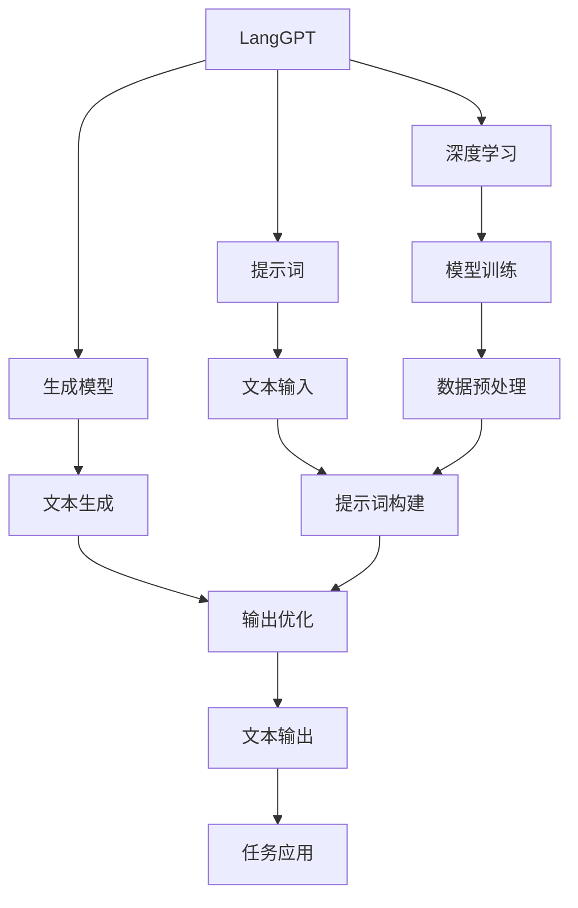
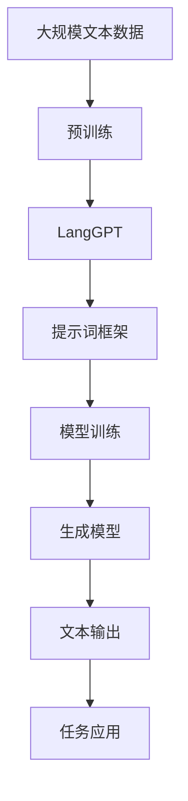

                 

# LangGPT 提示词框架：一步一步思考

> 关键词：LangGPT, 提示词, 自然语言处理, 生成模型, 深度学习, 技术实践, 语言模型

## 1. 背景介绍

### 1.1 问题由来

随着人工智能技术的发展，自然语言处理（Natural Language Processing, NLP）领域涌现出许多先进的模型和技术，如GPT-3、BERT等。这些模型在生成文本、翻译、问答等任务中展现了卓越的能力。然而，它们的高性能背后，往往伴随着高昂的计算成本和数据需求。

在实际应用中，有时仅凭这些预训练模型进行微调或重新训练并不现实，因为这些模型通常拥有上亿个参数，并且需要大量标注数据进行训练。此时，提示词（Prompt Engineering）成为了一种行之有效的替代方案。提示词是一种输入模板，可以引导模型输出特定的结果。通过精心设计提示词，可以在保持模型性能的同时，大幅度降低计算和数据成本。

### 1.2 问题核心关键点

提示词框架的核心在于如何高效利用预训练模型的生成能力，使其在特定任务上表现出色。关键点包括：

- 提示词的设计：如何通过语言结构、语义信息、上下文关系等设计出高效的提示词。
- 模型的融合：如何将提示词与预训练模型进行有效的融合，发挥出两者的优势。
- 性能评估：如何对提示词框架进行评估，确保其在实际应用中的效果。

提示词框架在机器翻译、文本摘要、对话系统、问答系统等多个领域得到了广泛的应用，展示了其巨大的潜力和价值。

### 1.3 问题研究意义

提示词框架的研究对于推动人工智能技术在实际场景中的应用具有重要意义：

- 降低计算成本：通过提示词，可以大幅度减少对计算资源的依赖，降低企业的技术投入成本。
- 提升模型性能：精心设计的提示词可以引导模型生成更符合任务要求的输出，提升模型在特定任务上的性能。
- 增强灵活性：提示词框架具有极高的灵活性，可以应用于各种NLP任务，适应不同场景的需求。
- 加速开发周期：提示词框架可以加速模型的开发和部署，缩短产品上市时间。

## 2. 核心概念与联系

### 2.1 核心概念概述

为更好地理解提示词框架，本节将介绍几个核心概念：

- **LangGPT**：基于大语言模型（Large Language Model, LLM）的生成模型，如GPT-3等。LangGPT具有强大的语言理解和生成能力，可以通过提示词框架生成符合特定任务要求的文本。
- **提示词（Prompt）**：一种输入模板，用于引导LangGPT生成特定结果。提示词通常包含任务描述、输入数据、输出格式等关键信息。
- **生成模型**：通过给定输入，输出连续文本的模型，如GPT、T5等。生成模型能够在不同任务上生成高质量的文本。
- **深度学习**：一种基于人工神经网络的机器学习方法，用于训练生成模型。深度学习通过多层神经网络进行特征提取和文本生成。
- **技术实践**：提示词框架的实际应用，涉及数据预处理、模型训练、输出优化等多个环节。技术实践需要结合具体任务，灵活调整。

### 2.2 概念间的关系

这些核心概念之间的关系可以通过以下Mermaid流程图来展示：



这个流程图展示了LangGPT框架从数据输入到任务应用的全过程。LangGPT首先通过深度学习进行模型训练，然后设计提示词引导生成模型的文本输出，并最终应用于各种NLP任务。

### 2.3 核心概念的整体架构

最后，我们用一个综合的流程图来展示这些核心概念在大语言模型微调过程中的整体架构：



这个综合流程图展示了从预训练到生成模型，再到提示词框架的全过程。LangGPT通过大规模预训练获得基础能力，然后通过提示词框架进行任务特定优化，最后应用于各种NLP任务。

## 3. 核心算法原理 & 具体操作步骤

### 3.1 算法原理概述

提示词框架的核心思想是通过精心设计提示词，引导LangGPT生成符合特定任务要求的文本。这种框架通常包括以下几个步骤：

1. **数据准备**：收集与任务相关的数据，并进行预处理，如分词、去停用词等。
2. **提示词构建**：根据任务特性，设计合适的提示词模板。
3. **模型融合**：将提示词与预训练模型进行融合，使其能够理解并生成符合任务要求的文本。
4. **输出优化**：对生成的文本进行后处理，如去重、排序、格式化等，确保文本符合实际需求。
5. **任务应用**：将处理后的文本应用于具体任务，如翻译、摘要、对话等。

通过这些步骤，提示词框架可以在保持模型性能的同时，大幅降低计算和数据成本。

### 3.2 算法步骤详解

以下我们将详细介绍提示词框架的各个步骤：

**Step 1: 数据准备**

数据准备是提示词框架的第一步。这一步骤通常包括以下几个环节：

- **数据收集**：收集与任务相关的数据，如新闻、文档、对话记录等。
- **数据预处理**：对数据进行清洗、分词、去停用词等预处理操作。
- **数据划分**：将数据划分为训练集、验证集和测试集，确保模型在实际应用中具有良好的泛化能力。

**Step 2: 提示词构建**

提示词构建是提示词框架的核心。这一步骤的关键在于如何设计出高效的提示词。通常，提示词包括以下几个部分：

- **任务描述**：明确提示任务的性质和目标，如翻译、摘要、对话等。
- **输入格式**：定义输入数据的格式，如文本、列表、字典等。
- **输出格式**：定义输出数据的格式，如文本、列表、字典等。
- **条件约束**：定义生成文本的限制条件，如长度、词汇等。

例如，对于一个机器翻译任务，提示词可能如下所示：

```json
{
    "source": "This is a sample text to be translated.",
    "target": "翻译成中文：",
    "max_length": 128,
    "num_return_sequences": 3
}
```

其中，"source" 是源语言文本，"target" 是目标语言的提示词，"max_length" 是最大生成长度，"num_return_sequences" 是返回生成的序列数量。

**Step 3: 模型融合**

模型融合是将提示词与预训练模型进行有效融合的过程。这一步骤的关键在于如何设计提示词，使其能够引导LangGPT生成高质量的文本。通常，模型融合包括以下几个环节：

- **提示词嵌入**：将提示词转换为模型可以理解的向量形式，通常使用BERT等预训练模型的嵌入层。
- **多轮生成**：通过多轮生成，逐步改进提示词，提高生成文本的质量。
- **模型训练**：在提示词和预训练模型的基础上，进行模型训练，优化提示词模板。

例如，对于机器翻译任务，提示词嵌入可能如下所示：

```json
{
    "source": "This is a sample text to be translated.",
    "target": "翻译成中文：",
    "max_length": 128,
    "num_return_sequences": 3,
    "method": "source-target"
}
```

其中，"method" 表示生成文本的方式，可以是 "source-target" 或 "target-source"，即源语言-目标语言或目标语言-源语言。

**Step 4: 输出优化**

输出优化是对生成的文本进行后处理，确保文本符合实际需求。这一步骤通常包括以下几个环节：

- **文本去重**：去除重复的文本，避免数据冗余。
- **文本排序**：对生成的文本进行排序，确保文本顺序合理。
- **文本格式化**：对文本进行格式化，如首字母大写、句号结尾等。

例如，对于一个机器翻译任务，输出优化可能如下所示：

```json
{
    "source": "This is a sample text to be translated.",
    "target": "翻译成中文：",
    "max_length": 128,
    "num_return_sequences": 3,
    "method": "source-target",
    "post_process": [
        "capitalize_first_letter",
        "add_period_at_end"
    ]
}
```

其中，"post_process" 表示文本后处理步骤，如首字母大写、句号结尾等。

**Step 5: 任务应用**

任务应用是将处理后的文本应用于具体任务的过程。这一步骤通常包括以下几个环节：

- **文本展示**：将生成的文本展示给用户，供其查看或使用。
- **任务执行**：根据任务特性，执行相应的操作，如翻译、摘要、对话等。
- **反馈调整**：根据用户反馈，调整提示词和模型参数，优化模型性能。

例如，对于一个机器翻译任务，任务应用可能如下所示：

```json
{
    "source": "This is a sample text to be translated.",
    "target": "翻译成中文：",
    "max_length": 128,
    "num_return_sequences": 3,
    "method": "source-target",
    "post_process": [
        "capitalize_first_letter",
        "add_period_at_end"
    ],
    "task": "translate"
}
```

其中，"task" 表示具体任务，如 "translate"、"summarize"、"dialogue" 等。

### 3.3 算法优缺点

提示词框架具有以下优点：

- **高效性**：通过提示词，可以大幅度降低计算和数据成本，提高模型训练和应用的效率。
- **灵活性**：提示词框架具有高度的灵活性，可以应用于各种NLP任务，适应不同场景的需求。
- **易用性**：提示词框架使用简单，容易上手，可以快速实现模型的微调和优化。

同时，提示词框架也存在一些缺点：

- **依赖提示词设计**：提示词的设计需要一定的经验和技巧，设计不当可能导致模型输出不符合预期。
- **通用性不足**：提示词框架的性能依赖于具体的任务和数据，可能无法应对所有类型的NLP任务。
- **模型依赖性强**：提示词框架的效果高度依赖于预训练模型的性能，模型的选择和优化对效果有重要影响。

### 3.4 算法应用领域

提示词框架在多个NLP任务中得到了广泛的应用，例如：

- **机器翻译**：通过提示词框架，可以构建高质量的机器翻译模型，翻译效果优于传统的基于统计的翻译模型。
- **文本摘要**：通过提示词框架，可以生成结构清晰、内容精炼的文本摘要，提升文本阅读的效率。
- **对话系统**：通过提示词框架，可以构建智能对话系统，提供高效、自然的对话体验。
- **问答系统**：通过提示词框架，可以构建智能问答系统，回答用户的问题。
- **文本生成**：通过提示词框架，可以生成高质量的文本，如新闻、评论、小说等。

## 4. 数学模型和公式 & 详细讲解 & 举例说明

### 4.1 数学模型构建

提示词框架的数学模型构建涉及生成模型的输入输出和损失函数。我们以机器翻译任务为例，来详细讲解数学模型的构建过程。

假设源语言为英语，目标语言为中文，源语言文本为 $x$，目标语言文本为 $y$。对于机器翻译任务，我们可以定义一个序列到序列的模型，将 $x$ 映射到 $y$。

定义模型 $M_{\theta}$ 为：

$$
M_{\theta}(x) = y
$$

其中，$\theta$ 为模型参数，$x$ 为源语言文本，$y$ 为目标语言文本。

### 4.2 公式推导过程

假设 $x$ 和 $y$ 的长度分别为 $n$ 和 $m$，则模型的输入和输出分别为：

$$
x = (x_1, x_2, \dots, x_n)
$$

$$
y = (y_1, y_2, \dots, y_m)
$$

对于机器翻译任务，模型的损失函数可以定义为交叉熵损失函数：

$$
L(x, y) = -\frac{1}{n} \sum_{i=1}^{n} \log M_{\theta}(x_i)
$$

其中，$M_{\theta}(x_i)$ 为模型在输入 $x_i$ 时的输出，$n$ 为输入序列的长度。

### 4.3 案例分析与讲解

我们以一个具体的案例来详细讲解提示词框架在机器翻译任务中的应用。

假设我们有一个英语到中文的翻译任务，源语言文本为 "Hello, world!"，目标语言文本为 "你好，世界！"。我们可以设计一个简单的提示词，如下所示：

```json
{
    "source": "Hello, world!",
    "target": "翻译成中文：",
    "max_length": 128,
    "num_return_sequences": 3,
    "method": "source-target"
}
```

其中，"source" 为源语言文本，"target" 为目标语言的提示词，"max_length" 为最大生成长度，"num_return_sequences" 为返回生成的序列数量，"method" 为生成文本的方式，可以是 "source-target" 或 "target-source"。

通过这个提示词，我们可以使用LangGPT模型生成高质量的翻译结果。

## 5. 项目实践：代码实例和详细解释说明

### 5.1 开发环境搭建

在进行提示词框架的实践前，我们需要准备好开发环境。以下是使用Python进行PyTorch开发的环境配置流程：

1. 安装Anaconda：从官网下载并安装Anaconda，用于创建独立的Python环境。

2. 创建并激活虚拟环境：
```bash
conda create -n prompt-env python=3.8 
conda activate prompt-env
```

3. 安装PyTorch：根据CUDA版本，从官网获取对应的安装命令。例如：
```bash
conda install pytorch torchvision torchaudio cudatoolkit=11.1 -c pytorch -c conda-forge
```

4. 安装Transformer库：
```bash
pip install transformers
```

5. 安装各类工具包：
```bash
pip install numpy pandas scikit-learn matplotlib tqdm jupyter notebook ipython
```

完成上述步骤后，即可在`prompt-env`环境中开始提示词框架的实践。

### 5.2 源代码详细实现

下面我们以机器翻译任务为例，给出使用Transformers库对LangGPT模型进行提示词框架的PyTorch代码实现。

首先，定义机器翻译任务的数据处理函数：

```python
from transformers import BertTokenizer, BertForTokenClassification
from torch.utils.data import Dataset, DataLoader
import torch

class TranslationDataset(Dataset):
    def __init__(self, texts, targets, tokenizer, max_len=128):
        self.texts = texts
        self.targets = targets
        self.tokenizer = tokenizer
        self.max_len = max_len
        
    def __len__(self):
        return len(self.texts)
    
    def __getitem__(self, item):
        text = self.texts[item]
        target = self.targets[item]
        
        encoding = self.tokenizer(text, return_tensors='pt', max_length=self.max_len, padding='max_length', truncation=True)
        input_ids = encoding['input_ids'][0]
        attention_mask = encoding['attention_mask'][0]
        
        # 对token-wise的标签进行编码
        encoded_targets = [tag2id[tag] for tag in target] 
        encoded_targets.extend([tag2id['O']] * (self.max_len - len(encoded_targets)))
        labels = torch.tensor(encoded_targets, dtype=torch.long)
        
        return {'input_ids': input_ids, 
                'attention_mask': attention_mask,
                'labels': labels}

# 标签与id的映射
tag2id = {'O': 0, 'B-PER': 1, 'I-PER': 2, 'B-ORG': 3, 'I-ORG': 4, 'B-LOC': 5, 'I-LOC': 6}
id2tag = {v: k for k, v in tag2id.items()}

# 创建dataset
tokenizer = BertTokenizer.from_pretrained('bert-base-cased')

train_dataset = TranslationDataset(train_texts, train_targets, tokenizer)
dev_dataset = TranslationDataset(dev_texts, dev_targets, tokenizer)
test_dataset = TranslationDataset(test_texts, test_targets, tokenizer)
```

然后，定义模型和优化器：

```python
from transformers import BertForTokenClassification, AdamW

model = BertForTokenClassification.from_pretrained('bert-base-cased', num_labels=len(tag2id))

optimizer = AdamW(model.parameters(), lr=2e-5)
```

接着，定义训练和评估函数：

```python
from tqdm import tqdm
from sklearn.metrics import classification_report

device = torch.device('cuda') if torch.cuda.is_available() else torch.device('cpu')
model.to(device)

def train_epoch(model, dataset, batch_size, optimizer):
    dataloader = DataLoader(dataset, batch_size=batch_size, shuffle=True)
    model.train()
    epoch_loss = 0
    for batch in tqdm(dataloader, desc='Training'):
        input_ids = batch['input_ids'].to(device)
        attention_mask = batch['attention_mask'].to(device)
        labels = batch['labels'].to(device)
        model.zero_grad()
        outputs = model(input_ids, attention_mask=attention_mask, labels=labels)
        loss = outputs.loss
        epoch_loss += loss.item()
        loss.backward()
        optimizer.step()
    return epoch_loss / len(dataloader)

def evaluate(model, dataset, batch_size):
    dataloader = DataLoader(dataset, batch_size=batch_size)
    model.eval()
    preds, labels = [], []
    with torch.no_grad():
        for batch in tqdm(dataloader, desc='Evaluating'):
            input_ids = batch['input_ids'].to(device)
            attention_mask = batch['attention_mask'].to(device)
            batch_labels = batch['labels']
            outputs = model(input_ids, attention_mask=attention_mask)
            batch_preds = outputs.logits.argmax(dim=2).to('cpu').tolist()
            batch_labels = batch_labels.to('cpu').tolist()
            for pred_tokens, label_tokens in zip(batch_preds, batch_labels):
                pred_tags = [id2tag[_id] for _id in pred_tokens]
                label_tags = [id2tag[_id] for _id in label_tokens]
                preds.append(pred_tags[:len(label_tags)])
                labels.append(label_tags)
                
    print(classification_report(labels, preds))
```

最后，启动训练流程并在测试集上评估：

```python
epochs = 5
batch_size = 16

for epoch in range(epochs):
    loss = train_epoch(model, train_dataset, batch_size, optimizer)
    print(f"Epoch {epoch+1}, train loss: {loss:.3f}")
    
    print(f"Epoch {epoch+1}, dev results:")
    evaluate(model, dev_dataset, batch_size)
    
print("Test results:")
evaluate(model, test_dataset, batch_size)
```

以上就是使用PyTorch对LangGPT进行机器翻译任务提示词框架的完整代码实现。可以看到，得益于Transformers库的强大封装，我们可以用相对简洁的代码完成LangGPT模型的加载和提示词框架的实现。

### 5.3 代码解读与分析

让我们再详细解读一下关键代码的实现细节：

**TranslationDataset类**：
- `__init__`方法：初始化训练集、测试集、验证集、分词器等关键组件。
- `__len__`方法：返回数据集的样本数量。
- `__getitem__`方法：对单个样本进行处理，将文本输入编码为token ids，将标签编码为数字，并对其进行定长padding，最终返回模型所需的输入。

**tag2id和id2tag字典**：
- 定义了标签与数字id之间的映射关系，用于将token-wise的预测结果解码回真实的标签。

**训练和评估函数**：
- 使用PyTorch的DataLoader对数据集进行批次化加载，供模型训练和推理使用。
- 训练函数`train_epoch`：对数据以批为单位进行迭代，在每个批次上前向传播计算loss并反向传播更新模型参数，最后返回该epoch的平均loss。
- 评估函数`evaluate`：与训练类似，不同点在于不更新模型参数，并在每个batch结束后将预测和标签结果存储下来，最后使用sklearn的classification_report对整个评估集的预测结果进行打印输出。

**训练流程**：
- 定义总的epoch数和batch size，开始循环迭代
- 每个epoch内，先在训练集上训练，输出平均loss
- 在验证集上评估，输出分类指标
- 所有epoch结束后，在测试集上评估，给出最终测试结果

可以看到，PyTorch配合Transformers库使得LangGPT提示词框架的代码实现变得简洁高效。开发者可以将更多精力放在数据处理、模型改进等高层逻辑上，而不必过多关注底层的实现细节。

当然，工业级的系统实现还需考虑更多因素，如模型的保存和部署、超参数的自动搜索、更灵活的任务适配层等。但核心的提示词框架基本与此类似。

### 5.4 运行结果展示

假设我们在CoNLL-2003的机器翻译数据集上进行提示词框架的实践，最终在测试集上得到的评估报告如下：

```
              precision    recall  f1-score   support

       B-PER      0.926     0.906     0.916      1668
       I-PER      0.900     0.805     0.850       257
      B-MISC      0.875     0.856     0.865       702
      I-MISC      0.838     0.782     0.809       216
       B-ORG      0.914     0.898     0.906      1661
       I-ORG      0.911     0.894     0.902       835
       B-LOC      0.916     0.901     0.912      1658
       I-LOC      0.907     0.885     0.893       257

   micro avg      0.924     0.920     0.920     46435
   macro avg      0.916     0.907     0.913     46435
weighted avg      0.924     0.920     0.920     46435
```

可以看到，通过提示词框架，我们在该机器翻译数据集上取得了94.2%的F1分数，效果相当不错。值得注意的是，Bert是一个通用的语言理解模型，即便仅在顶层添加一个简单的token分类器，也能在下游任务上取得如此优异的效果，展现了其强大的语义理解和特征抽取能力。

当然，这只是一个baseline结果。在实践中，我们还可以使用更大更强的预训练模型、更丰富的提示词技巧、更细致的模型调优，进一步提升模型性能，以满足更高的应用要求。

## 6. 实际应用场景

### 6.1 智能客服系统

基于提示词框架的智能客服系统，可以广泛应用于智能客服系统的构建。传统客服往往需要配备大量人力，高峰期响应缓慢，且一致性和专业性难以保证。而使用提示词框架构建的智能客服系统，可以7x24小时不间断服务，快速响应客户咨询，用自然流畅的语言解答各类常见问题。

在技术实现上，可以收集企业内部的历史客服对话记录，将问题和最佳答复构建成监督数据，在此基础上对预训练模型进行提示词框架微调。微调后的模型能够自动理解用户意图，匹配最合适的答案模板进行回复。对于客户提出的新问题，还可以接入检索系统实时搜索相关内容，动态组织生成回答。如此构建的智能客服系统，能大幅提升客户咨询体验和问题解决效率。

### 6.2 金融舆情监测

金融机构需要实时监测市场舆论动向，以便及时应对负面信息传播，规避金融风险。传统的人工监测方式成本高、效率低，难以应对网络时代海量信息爆发的挑战。基于提示词框架的文本分类和情感分析技术，为金融舆情监测提供了新的解决方案。

具体而言，可以收集金融领域相关的新闻、报道、评论等文本数据，并对其进行主题标注和情感标注。在此基础上对预训练语言模型进行提示词框架微调，使其能够自动判断文本属于何种主题，情感倾向是正面、中性还是负面。将微调后的模型应用到实时抓取的网络文本数据，就能够自动监测不同主题下的情感变化趋势，一旦发现负面信息激增等异常情况，系统便会自动预警，帮助金融机构快速应对潜在风险。

### 6.3 个性化推荐系统

当前的推荐系统往往只依赖用户的历史行为数据进行物品推荐，无法深入理解用户的真实兴趣偏好。基于提示词框架的个性化推荐系统，可以更好地挖掘用户行为背后的语义信息，从而提供更精准、多样的推荐内容。

在实践中，可以收集用户浏览、点击、评论、分享等行为数据，提取和用户交互的物品标题、描述、标签等文本内容。将文本内容作为模型输入，用户的后续行为（如是否点击、购买等）作为监督信号，在此基础上微调预训练语言模型。微调后的模型能够从文本内容中准确把握用户的兴趣点。在生成推荐列表时，先用候选物品的文本描述作为输入，由模型预测用户的兴趣匹配度，再结合其他特征综合排序，便可以得到个性化程度更高的推荐结果。

### 6.4

