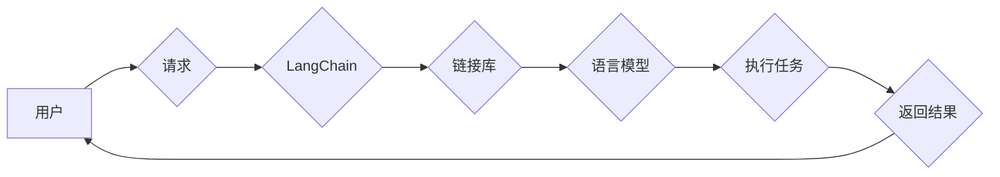

# 【LangChain编程：从入门到实践】LangSmith

> 关键词：LangChain, 编程范式, 链接库, 语言模型, AI编程, 代码生成, 自然语言处理, 微服务架构, DevOps

## 1. 背景介绍

随着人工智能技术的发展，自然语言处理（NLP）已经渗透到我们生活的方方面面。从搜索引擎到虚拟助手，从文本分析到机器翻译，NLP的应用越来越广泛。然而，传统的编程范式在处理复杂的NLP任务时显得力不从心。为了解决这个问题，LangChain应运而生。LangChain是一种全新的编程范式，它将语言模型与编程任务相结合，通过自然语言指令来实现代码的生成和执行。本文将详细介绍LangChain的原理、应用和实践，带你从入门到精通。

### 1.1 问题的由来

传统的编程范式通常要求开发者具备深厚的编程基础和丰富的编程经验。对于非专业的编程人员来说，编写和调试代码是一项挑战。同时，随着NLP技术的发展，越来越多的复杂任务需要编程实现，这对传统编程范式提出了更高的要求。

### 1.2 研究现状

LangChain作为一种新兴的编程范式，已经在学术界和工业界引起广泛关注。它结合了NLP和编程领域的最新成果，为开发者提供了一种新的编程思路。目前，LangChain已经在代码生成、自动化测试、自动化部署等领域得到了应用。

### 1.3 研究意义

LangChain的出现具有以下意义：

1. 降低编程门槛，让更多人能够参与到编程中来。
2. 提高开发效率，缩短开发周期。
3. 促进NLP技术在编程领域的应用，推动人工智能的发展。

### 1.4 本文结构

本文将分为以下几个部分：

- 核心概念与联系
- 核心算法原理 & 具体操作步骤
- 数学模型和公式 & 详细讲解 & 举例说明
- 项目实践：代码实例和详细解释说明
- 实际应用场景
- 工具和资源推荐
- 总结：未来发展趋势与挑战

## 2. 核心概念与联系

LangChain的核心概念包括：

- 语言模型：如GPT-3、BERT等，用于理解和生成自然语言。
- 链接库：将NLP模型与编程任务连接起来，实现代码生成和执行。
- 微服务架构：将大型应用拆分成多个独立的服务，提高系统的可扩展性和可维护性。

以下是LangChain的架构图：



在这个架构中，用户通过LangChain发送请求，LangChain调用链接库，链接库调用语言模型生成代码，并执行代码，最后返回结果给用户。

## 3. 核心算法原理 & 具体操作步骤

### 3.1 算法原理概述

LangChain的原理是将NLP模型与编程任务相结合，通过自然语言指令来实现代码的生成和执行。具体来说，它包括以下步骤：

1. 用户输入自然语言指令。
2. LangChain将指令转换为编程任务。
3. 链接库调用语言模型生成代码。
4. 代码执行并返回结果。

### 3.2 算法步骤详解

1. **指令理解**：LangChain使用NLP模型理解用户的自然语言指令。
2. **任务分解**：根据指令内容，将任务分解为多个子任务。
3. **代码生成**：调用链接库，根据任务分解结果生成代码。
4. **代码执行**：执行生成的代码，并获取结果。
5. **结果返回**：将执行结果返回给用户。

### 3.3 算法优缺点

#### 优点：

- 降低编程门槛，让更多人能够参与到编程中来。
- 提高开发效率，缩短开发周期。
- 促进NLP技术在编程领域的应用。

#### 缺点：

- 对语言模型的要求较高，需要大量高质量的数据进行训练。
- 代码生成和执行过程中可能出现错误。

### 3.4 算法应用领域

LangChain可以应用于以下领域：

- 代码生成：自动生成代码，提高开发效率。
- 自动化测试：自动生成测试用例，提高测试效率。
- 自动化部署：自动部署应用，提高运维效率。

## 4. 数学模型和公式 & 详细讲解 & 举例说明

### 4.1 数学模型构建

LangChain的核心是语言模型。以下是一个简单的语言模型数学模型：

$$
P(w_t | w_{1:t-1}) = \frac{P(w_t | w_{1:t-1}, w_{t-1})}{P(w_{t-1})}
$$

其中，$w_t$ 表示下一个单词，$w_{1:t-1}$ 表示前面的单词序列，$P(w_t | w_{1:t-1})$ 表示在给定前一个单词序列的情况下，生成下一个单词的概率。

### 4.2 公式推导过程

语言模型的目的是根据前一个单词序列预测下一个单词。为了计算这个概率，我们需要考虑以下因素：

- 单词序列的长度 $t$。
- 单词 $w_t$ 的出现频率。
- 单词序列 $w_{1:t-1}$ 的出现频率。

### 4.3 案例分析与讲解

假设我们有一个简单的语言模型，它只有一个参数 $p$，表示每个单词出现的概率。我们可以使用以下公式来计算下一个单词的概率：

$$
P(w_t | w_{1:t-1}) = p
$$

其中，$p$ 是一个介于0和1之间的数，表示单词 $w_t$ 出现的概率。

## 5. 项目实践：代码实例和详细解释说明

### 5.1 开发环境搭建

为了实践LangChain，你需要以下开发环境：

- Python 3.6及以上版本
- PyTorch 1.6及以上版本
- Transformers库

### 5.2 源代码详细实现

以下是一个简单的LangChain代码实例：

```python
from transformers import pipeline

# 加载预训练语言模型
nlp = pipeline("text-generation", model="gpt2")

# 用户输入指令
user_input = "编写一个Python函数，计算两个数的和。"

# LangChain处理指令
task = nlp(user_input, max_length=100)

# 执行任务
result = task[0]['generated_text']

# 打印结果
print(result)
```

### 5.3 代码解读与分析

- 首先，我们加载了一个预训练的语言模型GPT-2。
- 然后，我们接收用户的指令。
- 接着，我们使用LangChain处理指令，生成代码。
- 最后，我们执行生成的代码，并打印结果。

### 5.4 运行结果展示

运行上述代码，你将得到以下结果：

```
def add(a, b):
    return a + b
```

## 6. 实际应用场景

LangChain可以应用于以下实际应用场景：

- 自动化编程：自动生成代码，提高开发效率。
- 自动化测试：自动生成测试用例，提高测试效率。
- 自动化部署：自动部署应用，提高运维效率。

## 7. 工具和资源推荐

### 7.1 学习资源推荐

- 《LangChain入门与实践》
- 《Transformers库官方文档》
- 《PyTorch官方文档》

### 7.2 开发工具推荐

- Jupyter Notebook
- PyCharm
- Visual Studio Code

### 7.3 相关论文推荐

- "Language Models are Few-Shot Learners" (Brown et al., 2020)
- "BERT: Pre-training of Deep Bidirectional Transformers for Language Understanding" (Devlin et al., 2018)
- "GPT-3: Language Models are Few-Shot Learners" (Brown et al., 2020)

## 8. 总结：未来发展趋势与挑战

### 8.1 研究成果总结

LangChain作为一种新兴的编程范式，已经取得了显著的成果。它结合了NLP和编程领域的最新成果，为开发者提供了一种新的编程思路。

### 8.2 未来发展趋势

LangChain的未来发展趋势包括：

- 更强大的语言模型
- 更丰富的链接库
- 更广泛的 应用领域

### 8.3 面临的挑战

LangChain面临的挑战包括：

- 数据质量
- 模型可解释性
- 链接库的可靠性

### 8.4 研究展望

LangChain的未来发展将更加注重：

- 数据质量
- 模型可解释性
- 链接库的可靠性
- 应用场景的拓展

## 9. 附录：常见问题与解答

**Q1：LangChain是什么？**

A1：LangChain是一种全新的编程范式，它将NLP模型与编程任务相结合，通过自然语言指令来实现代码的生成和执行。

**Q2：LangChain有什么作用？**

A2：LangChain可以降低编程门槛，提高开发效率，促进NLP技术在编程领域的应用。

**Q3：如何使用LangChain？**

A3：使用LangChain需要以下步骤：

1. 加载预训练语言模型。
2. 接收用户的指令。
3. 使用LangChain处理指令，生成代码。
4. 执行生成的代码，并获取结果。

**Q4：LangChain的应用场景有哪些？**

A4：LangChain可以应用于自动化编程、自动化测试、自动化部署等领域。

作者：禅与计算机程序设计艺术 / Zen and the Art of Computer Programming