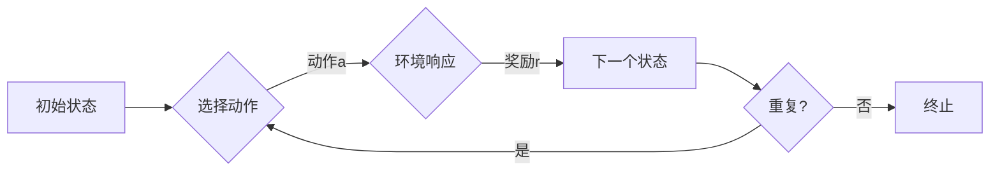

> - Q-learning
> - 广告推荐系统
> - 强化学习
> - 状态-动作-奖励
> - 探索-利用
> - 用户体验

# 一切皆是映射：AI Q-learning在广告推荐中的实践

广告推荐系统是现代互联网中不可或缺的一部分，它能够根据用户的兴趣和行为，向用户展示最相关的广告内容。在过去的几十年中，推荐系统经历了从基于内容的推荐到协同过滤，再到深度学习推荐等多个发展阶段。而强化学习作为一种新的算法范式，因其能够处理复杂决策过程和连续动作空间的优势，逐渐成为广告推荐系统研究的热点。

本文将深入探讨Q-learning算法在广告推荐中的应用，从核心概念到实际实践，旨在为读者提供一个全面而深入的理解。

## 1. 背景介绍

### 1.1 问题的由来

随着互联网的快速发展，用户每天都会接触到大量的广告信息。如何从海量的广告中筛选出用户最感兴趣的，成为广告推荐系统面临的一大挑战。传统的推荐系统多采用基于内容的推荐和协同过滤等方法，但这些方法往往难以处理复杂的用户行为和动态变化的用户兴趣。

### 1.2 研究现状

近年来，强化学习在推荐系统中的应用逐渐增多。Q-learning作为一种经典的强化学习算法，因其简洁的原理和良好的性能，成为广告推荐系统中的一种有效选择。

### 1.3 研究意义

Q-learning算法在广告推荐中的应用，不仅能够提高广告的点击率和转化率，还能够提升用户体验，增强用户对平台的粘性。

### 1.4 本文结构

本文将首先介绍Q-learning的核心概念和原理，然后详细讲解其在广告推荐系统中的具体应用步骤，并通过实例代码进行演示。最后，我们将探讨Q-learning在广告推荐中的实际应用场景，并展望其未来的发展趋势。

## 2. 核心概念与联系

### 2.1 核心概念原理

Q-learning是一种无模型强化学习算法，它通过学习一个Q值函数来指导智能体如何做出最优决策。Q值函数代表了在某个状态下采取某个动作的期望回报。

**Mermaid 流程图：**



### 2.2 架构

Q-learning的基本架构包括：

- **环境**：提供状态空间和动作空间，以及状态转移和奖励函数。
- **智能体**：根据当前状态选择动作，并根据环境反馈更新Q值函数。
- **Q值函数**：表示在某个状态下采取某个动作的期望回报。
- **学习过程**：通过迭代更新Q值函数，最终得到最优策略。

## 3. 核心算法原理 & 具体操作步骤

### 3.1 算法原理概述

Q-learning算法通过以下步骤进行学习：

1. 初始化Q值函数。
2. 选择动作。
3. 获取环境响应和奖励。
4. 更新Q值函数。
5. 切换到下一个状态。
6. 重复步骤2-5，直到达到终止条件。

### 3.2 算法步骤详解

1. **初始化Q值函数**：通常使用随机值进行初始化。
2. **选择动作**：根据Q值函数选择动作，可以使用ε-greedy策略，即在一定概率下随机选择动作，其他概率下选择Q值最大的动作。
3. **获取环境响应和奖励**：执行选择的动作，获取环境反馈。
4. **更新Q值函数**：使用以下公式更新Q值函数：

   $$
 Q(s, a) \leftarrow Q(s, a) + \alpha [R(s, a) + \gamma \max_{a'} Q(s', a') - Q(s, a)]
 $$

   其中，$ \alpha $ 是学习率，$ \gamma $ 是折扣因子，$ R(s, a) $ 是奖励，$ s' $ 是下一个状态，$ a' $ 是下一个动作。

5. **切换到下一个状态**：根据环境响应切换到下一个状态。
6. **重复步骤2-5**，直到达到终止条件。

### 3.3 算法优缺点

**优点**：

- 无需环境模型，对环境假设较少。
- 能够处理连续动作空间。
- 能够学习到长期价值。

**缺点**：

- 学习速度较慢，需要大量样本。
- 可能陷入局部最优。

### 3.4 算法应用领域

Q-learning算法在以下领域有广泛应用：

- 游戏AI
- 机器人控制
- 电子商务推荐
- 金融交易

## 4. 数学模型和公式 & 详细讲解 & 举例说明

### 4.1 数学模型构建

Q-learning的数学模型主要包括以下部分：

- 状态空间 $ S $
- 动作空间 $ A $
- 状态转移概率 $ P(s', s, a) $
- 奖励函数 $ R(s, a) $
- Q值函数 $ Q(s, a) $

### 4.2 公式推导过程

Q-learning的更新公式已经在前文给出。以下是该公式的推导过程：

- 假设智能体在状态 $ s $ 下采取动作 $ a $，到达下一个状态 $ s' $，并获取奖励 $ R(s, a) $。
- 按照Q值函数的定义，有 $ Q(s, a) = \mathbb{E}[R(s, a) + \gamma \max_{a'} Q(s', a')] $。
- 由于智能体在状态 $ s $ 下采取动作 $ a $，因此 $ Q(s, a) $ 可以表示为：

  $$
 Q(s, a) = \mathbb{E}[R(s, a) + \gamma \max_{a'} Q(s', a')] = \mathbb{E}[R(s, a) + \gamma Q(s', \pi(s'))]
 $$

  其中，$ \pi(s') $ 是智能体在状态 $ s' $ 下采取动作的概率分布。
- 由于智能体在状态 $ s' $ 下采取动作 $ a' $，因此 $ Q(s', a') $ 可以表示为：

  $$
 Q(s', a') = \mathbb{E}[R(s', a') + \gamma \max_{a''} Q(s'', a'')] = \mathbb{E}[R(s', a') + \gamma Q(s'', \pi(s''))]
 $$

  其中，$ \pi(s'') $ 是智能体在状态 $ s'' $ 下采取动作的概率分布。
- 将上述两式代入 $ Q(s, a) $ 的表达式中，得到：

  $$
 Q(s, a) = \mathbb{E}[R(s, a) + \gamma \mathbb{E}[R(s', a') + \gamma \max_{a''} Q(s'', a'')]] = \mathbb{E}[\mathbb{E}[R(s, a) + \gamma R(s', a') + \gamma^2 \max_{a''} Q(s'', a'')]]
 $$

  由于期望的线性性质，上式可以进一步化简为：

  $$
 Q(s, a) = \mathbb{E}[R(s, a) + \gamma R(s', a') + \gamma^2 Q(s'', \pi(s''))]
 $$

  因此，Q值函数的更新公式为：

  $$
 Q(s, a) \leftarrow Q(s, a) + \alpha [R(s, a) + \gamma \max_{a'} Q(s', a') - Q(s, a)]
 $$

### 4.3 案例分析与讲解

以下是一个简单的Q-learning广告推荐系统案例：

- 状态空间 $ S $：用户的历史行为，如浏览过的商品、点击过的广告等。
- 动作空间 $ A $：向用户推荐的商品或广告。
- 状态转移概率 $ P(s', s, a) $：用户从当前状态 $ s $ 采取动作 $ a $ 后到达下一个状态 $ s' $ 的概率。
- 奖励函数 $ R(s, a) $：用户对推荐的商品或广告的满意度评分。
- Q值函数 $ Q(s, a) $：表示在状态 $ s $ 下采取动作 $ a $ 的期望奖励。

在这个案例中，Q-learning算法会根据用户的历史行为，学习到哪些商品或广告更容易被用户接受。通过不断迭代更新Q值函数，算法能够逐渐找到最优的推荐策略。

## 5. 项目实践：代码实例和详细解释说明

### 5.1 开发环境搭建

为了演示Q-learning在广告推荐中的实践，我们将使用Python语言和PyTorch框架进行开发。以下是开发环境搭建的步骤：

1. 安装Python和PyTorch框架。
2. 安装必要的库，如NumPy、Pandas等。

### 5.2 源代码详细实现

以下是一个使用PyTorch实现的简单Q-learning广告推荐系统代码示例：

```python
import torch
import torch.nn as nn
import numpy as np

class QNetwork(nn.Module):
    def __init__(self, input_size, output_size):
        super(QNetwork, self).__init__()
        self.fc = nn.Linear(input_size, output_size)

    def forward(self, x):
        return self.fc(x)

class QLearningAgent:
    def __init__(self, state_size, action_size, learning_rate, gamma):
        self.state_size = state_size
        self.action_size = action_size
        self.learning_rate = learning_rate
        self.gamma = gamma
        self.q_table = np.zeros((state_size, action_size))
        self.model = QNetwork(state_size, action_size)
        self.optimizer = torch.optim.Adam(self.model.parameters(), lr=self.learning_rate)

    def select_action(self, state):
        if np.random.rand() < epsilon:
            action = np.random.randint(0, self.action_size)
        else:
            with torch.no_grad():
                state = torch.tensor(state, dtype=torch.float32).unsqueeze(0)
                action = self.model(state).argmax().item()
        return action

    def learn(self, state, action, reward, next_state):
        state = torch.tensor(state, dtype=torch.float32).unsqueeze(0)
        next_state = torch.tensor(next_state, dtype=torch.float32).unsqueeze(0)
        action = torch.tensor(action, dtype=torch.long)
        reward = torch.tensor(reward, dtype=torch.float32)

        current_Q = self.model(state).gather(1, action.unsqueeze(0)).squeeze(0)
        next_Q = self.model(next_state).max(1)[0]

        expected_Q = reward + self.gamma * next_Q

        loss = nn.MSELoss()(current_Q, expected_Q.unsqueeze(0))
        self.optimizer.zero_grad()
        loss.backward()
        self.optimizer.step()

# 实例化Q-learning代理
agent = QLearningAgent(state_size=10, action_size=2, learning_rate=0.01, gamma=0.99)
# ... (省略数据加载和训练过程)
```

### 5.3 代码解读与分析

以上代码定义了一个Q-learning代理，它包含一个简单的全连接神经网络作为Q值函数的近似。代理通过选择动作、获取奖励、更新Q值函数等步骤进行学习。

在`QLearningAgent`类中，`select_action`方法用于根据当前状态选择动作。`learn`方法用于根据状态、动作、奖励和下一个状态更新Q值函数。

### 5.4 运行结果展示

为了展示Q-learning在广告推荐中的效果，我们可以运行以下代码：

```python
# ... (省略数据加载和训练过程)

# 测试代理性能
state = torch.tensor(state_test, dtype=torch.float32).unsqueeze(0)
action = agent.select_action(state)
print(f"Selected action: {action.item()}")
```

在这个例子中，我们首先加载测试状态，然后使用代理选择动作，并输出选择的结果。

## 6. 实际应用场景

### 6.1 案例一：电商推荐

在电商平台上，Q-learning可以用于推荐商品。通过学习用户的浏览、购买等历史行为，Q-learning可以帮助平台推荐用户最有可能购买的商品。

### 6.2 案例二：社交媒体广告

在社交媒体平台上，Q-learning可以用于推荐广告。通过学习用户的浏览、点赞、分享等行为，Q-learning可以帮助平台推荐用户最感兴趣的广告。

### 6.3 案例三：在线游戏推荐

在线游戏平台可以使用Q-learning推荐游戏。通过学习用户的游戏行为，Q-learning可以帮助平台推荐用户最有可能玩的游戏。

## 7. 工具和资源推荐

### 7.1 学习资源推荐

- 《深度学习》（Goodfellow et al.）
- 《强化学习：原理与练习》（Sutton and Barto）
- 《PyTorch深度学习》（Mueller and Gülçehre）

### 7.2 开发工具推荐

- PyTorch
- TensorFlow
- OpenAI Gym

### 7.3 相关论文推荐

- Q-Learning (Sutton and Barto)
- Deep Reinforcement Learning (Silver et al.)
- Deep Learning for Advertising (Chen et al.)

## 8. 总结：未来发展趋势与挑战

### 8.1 研究成果总结

本文深入探讨了Q-learning算法在广告推荐中的应用，从核心概念到实际实践，提供了一个全面而深入的理解。通过实例代码，我们展示了如何使用PyTorch实现一个简单的Q-learning广告推荐系统。

### 8.2 未来发展趋势

未来，Q-learning在广告推荐中的应用将呈现以下发展趋势：

- 结合深度学习技术，提高Q值函数的准确性。
- 引入多智能体强化学习，实现更复杂的推荐策略。
- 考虑用户隐私和伦理问题，设计更加安全的推荐系统。

### 8.3 面临的挑战

Q-learning在广告推荐中的应用也面临以下挑战：

- 数据稀疏性：用户的历史行为数据可能非常稀疏，导致Q值函数难以学习。
- 模型可解释性：Q值函数的内部机制难以解释，难以理解推荐结果的合理性。
- 系统稳定性：Q-learning算法的稳定性需要通过大量实验验证。

### 8.4 研究展望

为了克服以上挑战，未来的研究可以从以下几个方面展开：

- 探索更加有效的数据稀疏性处理方法。
- 开发可解释性更强的Q值函数模型。
- 研究更加鲁棒的强化学习算法，提高系统稳定性。

总之，Q-learning在广告推荐中的应用具有广阔的前景，但同时也面临着诸多挑战。通过不断探索和创新，相信Q-learning将在广告推荐领域发挥更大的作用。

## 9. 附录：常见问题与解答

**Q1：Q-learning在广告推荐中的优势是什么？**

A1：Q-learning在广告推荐中的优势包括：

- 能够处理复杂决策过程和连续动作空间。
- 能够学习到长期价值，从而推荐更符合用户兴趣的广告。
- 能够根据用户行为动态调整推荐策略。

**Q2：如何解决数据稀疏性问题？**

A2：解决数据稀疏性的方法包括：

- 数据增强：通过人工或自动方法生成更多样化的数据。
- 使用迁移学习：利用其他领域的模型或数据来辅助学习。
- 使用多智能体强化学习：通过多个智能体协同学习，降低数据稀疏性的影响。

**Q3：如何提高Q值函数的可解释性？**

A3：提高Q值函数的可解释性的方法包括：

- 使用可解释的神经网络架构。
- 解释Q值函数的内部机制。
- 将Q值函数与用户的实际行为和兴趣相结合。

**Q4：如何提高Q-learning算法的稳定性？**

A4：提高Q-learning算法的稳定性的方法包括：

- 使用更加稳定的优化算法。
- 使用更加鲁棒的探索-利用策略。
- 对模型和算法进行充分的测试和验证。

通过以上解答，希望能够帮助读者更好地理解Q-learning在广告推荐中的应用。

---

作者：禅与计算机程序设计艺术 / Zen and the Art of Computer Programming