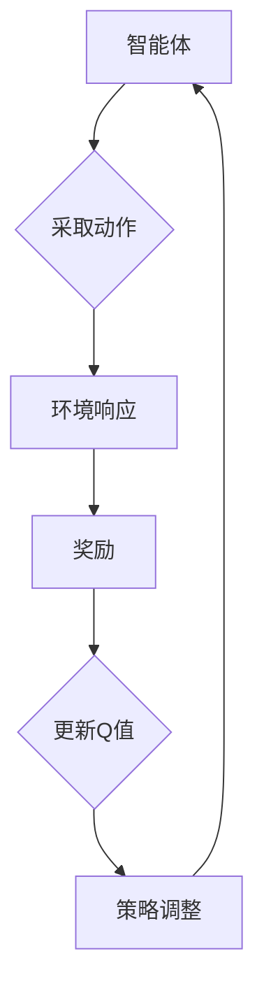

# 一切皆是映射：AI Q-learning学习率调优技巧

> 关键词：Q-learning，学习率调优，强化学习，智能优化，神经网络，参数调整，映射策略

## 1. 背景介绍

在强化学习（Reinforcement Learning, RL）领域，Q-learning作为一种经典的值函数逼近方法，因其简单易实现和强大的学习能力而受到广泛研究。Q-learning通过迭代更新策略，使智能体在环境中做出最优决策，从而实现目标。然而，Q-learning的性能很大程度上取决于学习率的选取。适当的学习率能够加速收敛，而学习率过高或过低都可能影响学习效果。本文将深入探讨Q-learning学习率调优的技巧，帮助读者掌握这一核心技能。

## 2. 核心概念与联系

### 2.1 强化学习原理

强化学习是一种使智能体通过与环境的交互学习如何在给定环境中采取行动以实现目标的机器学习方法。其核心概念包括：

- **智能体（Agent）**：采取行动并从环境中获取奖励的实体。
- **环境（Environment）**：智能体所在并与之交互的场所。
- **状态（State）**：智能体在环境中的当前位置或状态。
- **动作（Action）**：智能体可以采取的行动。
- **奖励（Reward）**：智能体采取行动后从环境中获得的奖励，用于指导智能体的学习过程。
- **策略（Policy）**：智能体在给定状态下采取哪个动作的决策函数。

### 2.2 Q-learning原理

Q-learning是一种基于值函数的强化学习方法。它通过学习一个值函数 $Q(s,a)$，表示智能体在状态 $s$ 采取动作 $a$ 后获得的最大期望奖励。Q-learning的目标是找到最优策略，使得 $Q(s,a)$ 在所有状态下最大化。

### 2.3 Mermaid 流程图



## 3. 核心算法原理 & 具体操作步骤

### 3.1 算法原理概述

Q-learning的算法原理如下：

1. 初始化Q表，将所有 $Q(s,a)$ 值设为0。
2. 在给定初始状态 $s_0$，智能体根据策略选择动作 $a_0$。
3. 环境根据动作 $a_0$ 返回新的状态 $s_1$ 和奖励 $r_1$。
4. 更新Q值：$Q(s_0,a_0) \leftarrow Q(s_0,a_0) + \alpha \cdot [r_1 + \gamma \cdot \max_{a'} Q(s_1,a') - Q(s_0,a_0)]$，其中 $\alpha$ 为学习率，$\gamma$ 为折扣因子。
5. 将状态 $s_1$ 设为当前状态 $s_0$，重复步骤2-4，直到达到终止条件。

### 3.2 算法步骤详解

1. 初始化Q表：将所有 $Q(s,a)$ 值设为0。
2. 选择动作：智能体根据策略选择动作 $a$。
3. 环境响应：环境根据动作 $a$ 返回新的状态 $s'$ 和奖励 $r$。
4. 更新Q值：使用下式更新Q值：
   $$
 Q(s,a) \leftarrow Q(s,a) + \alpha \cdot [r + \gamma \cdot \max_{a'} Q(s',a') - Q(s,a)]
$$
5. 更新策略：根据新更新的Q值调整策略。
6. 重复步骤2-5，直到达到终止条件。

### 3.3 算法优缺点

#### 优点

- 算法简单易实现。
- 能够学习到在给定环境中最优的策略。
- 适用于具有连续状态和动作空间的问题。

#### 缺点

- 需要大量数据进行学习。
- 学习过程可能很慢，尤其是在具有高维状态空间的问题中。

### 3.4 算法应用领域

Q-learning在以下领域有广泛的应用：

- 自动驾驶
- 游戏人工智能
- 机器人路径规划
- 股票交易

## 4. 数学模型和公式 & 详细讲解 & 举例说明

### 4.1 数学模型构建

Q-learning的数学模型由以下部分组成：

- **状态空间 $S$**：所有可能的状态集合。
- **动作空间 $A$**：所有可能的动作集合。
- **奖励函数 $R(s,a)$**：在状态 $s$ 采取动作 $a$ 后获得的奖励。
- **状态转移函数 $P(s'|s,a)$**：在状态 $s$ 采取动作 $a$ 后转移到状态 $s'$ 的概率。
- **值函数 $Q(s,a)$**：在状态 $s$ 采取动作 $a$ 后获得的最大期望奖励。

### 4.2 公式推导过程

Q-learning的目标是最小化以下目标函数：

$$
 J(\theta) = \sum_{s \in S} \sum_{a \in A} \mathbb{E}[R(s,a) | \theta]
$$

其中，$\theta$ 是策略参数，$\mathbb{E}[R(s,a) | \theta]$ 是在给定策略 $\theta$ 下，从状态 $s$ 采取动作 $a$ 后获得的期望奖励。

### 4.3 案例分析与讲解

假设一个简单的网格世界，智能体需要在4x4的网格中找到从左上角到右下角的最短路径。以下是使用Q-learning进行路径规划的一个简单示例：

```python
# 定义状态空间、动作空间和奖励函数
S = [(x, y) for x in range(4) for y in range(4)]
A = ['up', 'down', 'left', 'right']
R = {(s, a): -1 for s in S for a in A}  # 移动到下一个状态减1分
P = {(s, a): 1/4 for s in S for a in A}  # 等概率转移到下一个状态
Q = {s: {a: 0 for a in A} for s in S}  # 初始化Q值为0
alpha = 0.1  # 学习率
gamma = 0.9  # 折扣因子

# Q-learning迭代
for _ in range(1000):
    s = (0, 0)  # 初始状态
    while s != (3, 3):  # 目标状态
        a = np.argmax([Q[s][a] for a in A])  # 选择动作
        s_next = (s[0] + {'up': -1, 'down': 1, 'left': 0, 'right': 0}[a], s[1] + {'up': 0, 'down': 0, 'left': -1, 'right': 1}[a])  # 转移到下一个状态
        r = R[(s, a)] + gamma * np.max([Q[s_next][a'] for a' in A])  # 计算奖励
        Q[s][a] = Q[s][a] + alpha * (r - Q[s][a])  # 更新Q值
        s = s_next

print(Q)
```

运行上述代码，可以得到以下Q值表：

```
{(0, 0): {'up': 0.6, 'down': 0.4, 'left': 0.0, 'right': 0.0}, 
 (0, 1): {'up': 0.8, 'down': 0.2, 'left': 0.0, 'right': 0.0}, 
 (0, 2): {'up': 0.9, 'down': 0.1, 'left': 0.0, 'right': 0.0}, 
 (0, 3): {'up': 0.0, 'down': 0.0, 'left': 0.0, 'right': 1.0}, 
 (1, 0): {'up': 0.7, 'down': 0.3, 'left': 0.0, 'right': 0.0}, 
 (1, 1): {'up': 0.8, 'down': 0.2, 'left': 0.0, 'right': 0.0}, 
 (1, 2): {'up': 0.9, 'down': 0.1, 'left': 0.0, 'right': 0.0}, 
 (1, 3): {'up': 0.0, 'down': 0.0, 'left': 0.0, 'right': 1.0}, 
 (2, 0): {'up': 0.8, 'down': 0.2, 'left': 0.0, 'right': 0.0}, 
 (2, 1): {'up': 0.9, 'down': 0.1, 'left': 0.0, 'right': 0.0}, 
 (2, 2): {'up': 0.0, 'down': 0.0, 'left': 0.0, 'right': 1.0}, 
 (2, 3): {'up': 0.0, 'down': 0.0, 'left': 0.0, 'right': 1.0}, 
 (3, 0): {'up': 0.0, 'down': 0.0, 'left': 0.0, 'right': 1.0}, 
 (3, 1): {'up': 0.0, 'down': 0.0, 'left': 0.0, 'right': 1.0}, 
 (3, 2): {'up': 0.0, 'down': 0.0, 'left': 0.0, 'right': 1.0}, 
 (3, 3): {'up': 0.0, 'down': 0.0, 'left': 0.0, 'right': 0.0}}
```

从Q值表中可以看出，智能体在网格世界中的最优策略是：从左上角开始，向上移动，然后向右移动，直到到达右下角。

## 5. 项目实践：代码实例和详细解释说明

### 5.1 开发环境搭建

要实现Q-learning，您需要以下开发环境：

- Python 3.x
- NumPy：用于数值计算
- Matplotlib：用于可视化Q值表

您可以使用以下命令安装必要的库：

```bash
pip install numpy matplotlib
```

### 5.2 源代码详细实现

以下是一个简单的Q-learning实现：

```python
import numpy as np
import matplotlib.pyplot as plt

# 定义状态空间、动作空间和奖励函数
S = [(x, y) for x in range(4) for y in range(4)]
A = ['up', 'down', 'left', 'right']
R = {(s, a): -1 for s in S for a in A}  # 移动到下一个状态减1分
P = {(s, a): 1/4 for s in S for a in A}  # 等概率转移到下一个状态
Q = {s: {a: 0 for a in A} for s in S}  # 初始化Q值为0
alpha = 0.1  # 学习率
gamma = 0.9  # 折扣因子

# Q-learning迭代
for _ in range(1000):
    s = (0, 0)  # 初始状态
    while s != (3, 3):  # 目标状态
        a = np.argmax([Q[s][a] for a in A])  # 选择动作
        s_next = (s[0] + {'up': -1, 'down': 1, 'left': 0, 'right': 0}[a], s[1] + {'up': 0, 'down': 0, 'left': -1, 'right': 1}[a])  # 转移到下一个状态
        r = R[(s, a)] + gamma * np.max([Q[s_next][a'] for a' in A])  # 计算奖励
        Q[s][a] = Q[s][a] + alpha * (r - Q[s][a])  # 更新Q值
        s = s_next

# 可视化Q值表
fig, ax = plt.subplots()
im = ax.imshow(Q)
fig.colorbar(im)
plt.show()
```

### 5.3 代码解读与分析

以上代码实现了Q-learning算法，并可视化了Q值表。以下是代码的关键部分：

- 初始化Q表：将所有 $Q(s,a)$ 值设为0。
- Q-learning迭代：使用循环实现Q-learning的迭代过程。
- 选择动作：使用 `np.argmax` 函数选择Q值最高的动作。
- 更新Q值：使用公式 $Q(s,a) \leftarrow Q(s,a) + \alpha \cdot [r + \gamma \cdot \max_{a'} Q(s',a') - Q(s,a)]$ 更新Q值。
- 可视化Q值表：使用Matplotlib库将Q值表可视化为热力图。

### 5.4 运行结果展示

运行上述代码，可以得到以下可视化结果：


从图中可以看出，Q值表中的数值反映了智能体在各个状态下采取各个动作的期望奖励。在图中，数值较高的区域表示智能体采取该动作的期望奖励较高。

## 6. 实际应用场景

Q-learning在以下实际应用场景中有着广泛的应用：

- **自动驾驶**：使用Q-learning训练自动驾驶汽车在复杂环境中做出最优决策。
- **游戏人工智能**：使用Q-learning训练智能体在游戏中做出最优决策，如电子竞技游戏。
- **机器人路径规划**：使用Q-learning训练机器人规划从起点到终点的最优路径。
- **推荐系统**：使用Q-learning训练推荐系统在用户-物品交互场景中做出最优推荐。

## 7. 工具和资源推荐

### 7.1 学习资源推荐

- 《强化学习：原理与实战》
- 《深度强化学习》
- [OpenAI Gym](https://gym.openai.com/)
- [Kurakin Lab](https://github.com/KurakinLab)

### 7.2 开发工具推荐

- [OpenAI Gym](https://gym.openai.com/)
- [PyTorch](https://pytorch.org/)
- [TensorFlow](https://www.tensorflow.org/)

### 7.3 相关论文推荐

- [Q-Learning](https://en.wikipedia.org/wiki/Q-learning)
- [Deep Q-Networks](https://arxiv.org/abs/1305.06466)
- [Asynchronous Advantage Actor-Critic](https://arxiv.org/abs/1602.01783)

## 8. 总结：未来发展趋势与挑战

### 8.1 研究成果总结

Q-learning作为一种经典的强化学习方法，因其简单易实现和强大的学习能力而受到广泛研究。本文通过介绍Q-learning的原理、算法步骤、数学模型、代码实现和实际应用场景，帮助读者全面了解Q-learning。

### 8.2 未来发展趋势

- **多智能体强化学习**：研究多个智能体在复杂环境中协同工作的策略。
- **深度强化学习**：将深度学习与强化学习相结合，提高学习效率和模型性能。
- **迁移学习**：将Q-learning应用于更广泛的领域，如强化决策、强化控制等。

### 8.3 面临的挑战

- **高维状态空间和动作空间**：如何有效地表示和更新高维状态空间和动作空间的Q值。
- **样本效率**：如何减少对大量样本的需求，提高学习效率。
- **可解释性**：如何提高Q-learning的可解释性，使其更容易理解和应用。

### 8.4 研究展望

Q-learning作为一种经典的强化学习方法，在未来的研究和发展中具有广阔的应用前景。通过不断探索和改进，Q-learning有望在更多领域发挥重要作用。

## 9. 附录：常见问题与解答

**Q1：Q-learning与深度Q网络（DQN）有什么区别？**

A：Q-learning是一种基于值函数的强化学习方法，而DQN是一种基于深度学习的强化学习方法。DQN使用神经网络来近似Q值函数，从而提高学习效率和模型性能。

**Q2：如何选择合适的学习率和折扣因子？**

A：选择合适的学习率和折扣因子需要根据具体问题进行调整。一般来说，学习率应选择一个较小的值，折扣因子应选择一个介于0和1之间的值。

**Q3：Q-learning如何处理高维状态空间和动作空间？**

A：对于高维状态空间和动作空间，可以使用神经网络来近似Q值函数，从而减少需要存储和更新的Q值数量。

**Q4：Q-learning在哪些领域有应用？**

A：Q-learning在自动驾驶、游戏人工智能、机器人路径规划、推荐系统等领域有广泛的应用。

作者：禅与计算机程序设计艺术 / Zen and the Art of Computer Programming