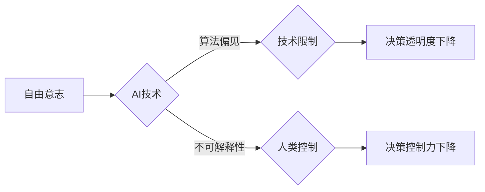

# 人生而自由，却无往不在枷锁之中

> 关键词：自由意志，人工智能，技术伦理，算法偏见，人类控制，技术限制，伦理困境

## 1. 背景介绍

在技术飞速发展的今天，人工智能（AI）已经渗透到我们生活的方方面面，从简单的智能家居到复杂的自动驾驶系统，AI正在重塑我们的世界。然而，随着AI技术的发展，一个深刻的哲学问题也随之浮现：人类是否真的自由，又是否真的无往不在枷锁之中？

### 1.1 问题的提出

自由意志是人类哲学中的一个核心概念，指的是个体在做出决策时不受外部强加的限制，拥有自我决定的能力。然而，随着AI技术的发展，人类的自由意志似乎受到了前所未有的挑战。一方面，AI系统的自动化和智能化使得许多决策过程变得不再需要人类的主观判断；另一方面，AI系统的算法偏见和不可解释性也使得人类对于自身决策的透明度和控制力下降。

### 1.2 研究意义

探讨AI时代人类自由意志的困境，不仅是一个哲学问题，也是一个技术伦理问题。它关系到AI技术的健康发展，以及人类社会的未来走向。通过对这一问题的深入分析，我们能够更好地理解AI技术对人类生活的影响，为构建一个更加公正、合理的AI社会提供参考。

### 1.3 本文结构

本文将围绕“人生而自由，却无往不在枷锁之中”这一主题展开讨论。首先，我们将介绍自由意志的相关概念和AI技术对自由意志的挑战；其次，我们将分析AI算法的偏见和不可解释性；接着，我们将探讨技术限制和人类控制对自由意志的影响；最后，我们将总结未来发展趋势和面临的挑战。

## 2. 核心概念与联系

### 2.1 自由意志

自由意志是指个体在不受外部强制的情况下，能够根据自己的意愿做出选择的能力。它是人类主观能动性的体现，也是人类文明进步的重要动力。

### 2.2 人工智能

人工智能是指由人创造的、能够模拟人类智能行为的系统。它包括机器学习、深度学习、自然语言处理等多个领域。

### 2.3 算法偏见

算法偏见是指AI算法在训练过程中学习到的偏见，导致AI系统在决策时对某些群体产生不公平对待。

### 2.4 不可解释性

不可解释性是指AI模型在做出决策时缺乏透明度和可理解性，使得人类难以理解其决策过程。

### 2.5 Mermaid 流程图

以下是基于上述概念的Mermaid流程图：



## 3. 核心算法原理 & 具体操作步骤

### 3.1 算法原理概述

AI算法的原理是通过学习大量数据，找到数据中的规律和模式，从而做出预测和决策。

### 3.2 算法步骤详解

1. 数据收集：收集大量的数据，包括输入数据和标签数据。
2. 数据预处理：对收集到的数据进行清洗、转换和归一化等操作。
3. 模型选择：根据任务需求选择合适的模型。
4. 模型训练：使用训练数据对模型进行训练，调整模型参数。
5. 模型评估：使用验证数据评估模型的性能。
6. 模型部署：将训练好的模型部署到实际应用中。

### 3.3 算法优缺点

**优点**：

- 高效：AI算法能够快速处理大量数据，比人类更快地做出决策。
- 准确：AI算法在处理复杂问题时，往往比人类更加准确。

**缺点**：

- 算法偏见：AI算法可能学习到数据中的偏见，导致不公平对待。
- 不可解释性：AI算法的决策过程缺乏透明度和可理解性，难以解释其决策依据。

### 3.4 算法应用领域

AI算法在各个领域都有广泛的应用，包括：

- 医疗诊断
- 金融风控
- 交通安全
- 智能家居
- 智能客服

## 4. 数学模型和公式 & 详细讲解 & 举例说明

### 4.1 数学模型构建

AI算法的数学模型通常是基于概率论和统计学原理构建的。以下是一些常见的数学模型：

- 线性回归
- 逻辑回归
- 决策树
- 支持向量机
- 深度神经网络

### 4.2 公式推导过程

以逻辑回归为例，其目标函数为：

$$
\min_{\theta} \frac{1}{m} \sum_{i=1}^{m} (-y^{(i)} \log(\hat{y}^{(i)}) - (1-y^{(i)}) \log(1-\hat{y}^{(i)}))
$$

其中，$y^{(i)}$ 为真实标签，$\hat{y}^{(i)}$ 为预测标签，$\theta$ 为模型参数。

### 4.3 案例分析与讲解

以医疗诊断为例，假设我们使用逻辑回归模型来预测患者是否患有某种疾病。我们可以收集患者的年龄、性别、血压、心率等数据作为输入特征，将疾病标签作为输出。通过训练模型，我们可以得到一组参数 $\theta$，使得模型能够根据输入特征预测患者的疾病状态。

## 5. 项目实践：代码实例和详细解释说明

### 5.1 开发环境搭建

由于篇幅限制，此处不进行详细的环境搭建说明。通常，我们使用Python编程语言和相关的库（如Scikit-learn、TensorFlow、PyTorch等）进行AI模型的开发。

### 5.2 源代码详细实现

以下是一个简单的逻辑回归模型实现：

```python
import numpy as np
from sklearn.linear_model import LogisticRegression

# 创建逻辑回归模型
model = LogisticRegression()

# 训练模型
model.fit(X_train, y_train)

# 预测
y_pred = model.predict(X_test)

# 评估模型
score = model.score(X_test, y_test)
```

### 5.3 代码解读与分析

上述代码使用了Scikit-learn库中的逻辑回归模型。首先，我们创建了一个逻辑回归模型实例。然后，使用训练数据对模型进行训练。接着，使用测试数据对模型进行预测，并评估模型的性能。

### 5.4 运行结果展示

假设我们在某个数据集上训练和评估模型，最终得到的准确率为90%。这表明我们的模型在预测患者疾病状态方面具有较好的性能。

## 6. 实际应用场景

AI技术在各个领域都有广泛的应用，以下是一些典型的应用场景：

- **医疗诊断**：AI模型可以用于辅助医生进行疾病诊断，提高诊断的准确性和效率。
- **金融风控**：AI模型可以用于评估贷款风险，帮助金融机构进行风险控制。
- **交通安全**：AI技术可以用于自动驾驶汽车，提高交通安全和效率。
- **智能家居**：AI技术可以用于智能家居系统，提高居住的舒适性和便利性。
- **智能客服**：AI模型可以用于智能客服系统，提供24小时在线服务。

## 7. 工具和资源推荐

### 7.1 学习资源推荐

- 《人工智能：一种现代的方法》
- 《深度学习》
- 《Python机器学习》
- Coursera上的机器学习课程

### 7.2 开发工具推荐

- Python编程语言
- Scikit-learn库
- TensorFlow库
- PyTorch库

### 7.3 相关论文推荐

- "Playing for Data: Attention is All You Need" (Vaswani et al., 2017)
- "BERT: Pre-training of Deep Bidirectional Transformers for Language Understanding" (Devlin et al., 2018)
- "Generative Adversarial Nets" (Goodfellow et al., 2014)

## 8. 总结：未来发展趋势与挑战

### 8.1 研究成果总结

本文探讨了AI时代人类自由意志的困境，分析了AI技术对自由意志的挑战，以及技术限制和人类控制对自由意志的影响。通过对AI算法原理、数学模型和实际应用场景的分析，我们更好地理解了AI技术对人类生活的影响。

### 8.2 未来发展趋势

随着AI技术的不断发展，未来可能会有以下趋势：

- AI技术将更加智能化、自动化，进一步减少人类的工作量。
- AI技术的应用范围将更加广泛，渗透到人类生活的方方面面。
- 人类将更加依赖AI技术，对AI的信任度将进一步提高。

### 8.3 面临的挑战

尽管AI技术发展迅速，但仍然面临着以下挑战：

- 算法偏见和不可解释性：AI算法可能学习到数据中的偏见，导致不公平对待。
- 技术限制：AI技术可能无法完全替代人类，人类仍然需要发挥主观能动性。
- 伦理道德问题：AI技术的发展引发了伦理道德问题，需要社会共同努力解决。

### 8.4 研究展望

为了应对AI技术带来的挑战，未来的研究方向包括：

- 开发更加公平、公正的AI算法，减少算法偏见。
- 提高AI模型的透明度和可解释性，让人类更好地理解AI的决策过程。
- 建立健全的AI伦理规范，确保AI技术的健康发展。

## 9. 附录：常见问题与解答

**Q1：什么是自由意志？**

A：自由意志是指个体在不受外部强制的情况下，能够根据自己的意愿做出选择的能力。

**Q2：AI技术对自由意志有哪些挑战？**

A：AI技术对自由意志的挑战主要体现在以下几个方面：

- AI系统的自动化和智能化使得许多决策过程变得不再需要人类的主观判断。
- AI系统的算法偏见和不可解释性使得人类对于自身决策的透明度和控制力下降。
- 技术限制和人类控制使得人类无法完全掌控自己的命运。

**Q3：如何应对AI技术对自由意志的挑战？**

A：为了应对AI技术对自由意志的挑战，我们可以采取以下措施：

- 提高AI技术的透明度和可解释性，让人类更好地理解AI的决策过程。
- 建立健全的AI伦理规范，确保AI技术的健康发展。
- 加强对AI技术的监管，防止其被滥用。

**Q4：AI技术的发展会对人类社会产生哪些影响？**

A：AI技术的发展将对人类社会产生以下影响：

- 提高生产效率和生活质量。
- 改变人类的工作方式和生活习惯。
- 引发伦理道德和社会安全问题。

**Q5：如何确保AI技术的健康发展？**

A：为了确保AI技术的健康发展，我们可以采取以下措施：

- 建立健全的AI伦理规范，确保AI技术的应用符合伦理道德。
- 加强对AI技术的监管，防止其被滥用。
- 加强AI技术的教育和培训，提高公众的AI素养。

作者：禅与计算机程序设计艺术 / Zen and the Art of Computer Programming