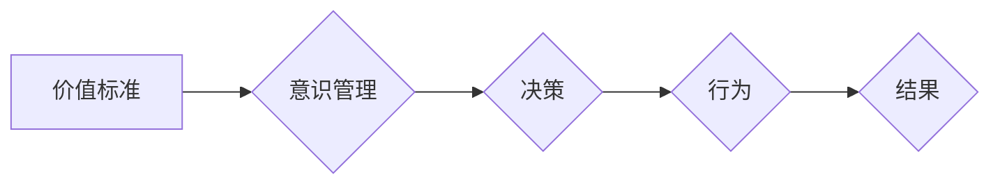

# 价值标准与意识管理的关系

> 关键词：价值标准，意识管理，认知科学，决策理论，行为经济学，人工智能

## 1. 背景介绍

在信息爆炸、技术飞速发展的今天，人类社会面临着前所未有的复杂性和多样性。如何在众多选择中做出明智的决策，如何在纷繁的信息中保持清醒的头脑，成为了人们关注的焦点。价值标准和意识管理作为影响个体和集体行为的重要因素，其关系也日益成为学术界和业界探讨的课题。本文将从认知科学、决策理论、行为经济学和人工智能等多个角度，深入探讨价值标准与意识管理之间的关系。

### 1.1 问题的由来

人类在长期进化过程中，形成了独特的价值观和道德观，这些价值标准指导着我们的行为和决策。然而，在现代社会，价值标准面临着前所未有的冲击和挑战。网络信息的泛滥、价值观念的多元化，使得人们难以在复杂多变的情境中做出符合自身价值观的决策。同时，意识管理作为一种调节个体心理状态的方法，其与价值标准之间的关系也日益受到关注。

### 1.2 研究现状

近年来，关于价值标准和意识管理的研究取得了丰硕的成果。认知科学领域的研究表明，价值标准是意识管理的基础，而意识管理则可以调节个体的心理状态，进而影响决策过程。行为经济学领域的研究揭示了价值标准与决策之间的复杂关系，如 framing effect、loss aversion 等现象。人工智能领域的研究则尝试将价值标准和意识管理融入智能系统，实现更加人性化的决策。

### 1.3 研究意义

研究价值标准与意识管理之间的关系，对于以下方面具有重要意义：

1. 帮助人们更好地理解自身行为和决策背后的心理机制。
2. 为设计更加科学、合理的决策辅助工具提供理论基础。
3. 促进人工智能等技术的发展，实现更加人性化的智能系统。
4. 为社会治理和道德建设提供有益的参考。

### 1.4 本文结构

本文将从以下方面展开：

- 介绍价值标准和意识管理的核心概念。
- 分析价值标准与意识管理之间的关系。
- 探讨价值标准在决策过程中的作用。
- 结合人工智能技术，研究价值标准和意识管理在智能系统中的应用。
- 总结研究成果，展望未来发展趋势。

## 2. 核心概念与联系

### 2.1 价值标准

价值标准是人们在长期进化过程中形成的，对事物价值进行评价和选择的依据。它包括道德、伦理、价值观、信念等因素。价值标准具有以下特征：

- 主观性：价值标准因个体差异而异。
- 普遍性：价值标准具有普遍性，但也会随着时间和地域的变化而变化。
- 可塑性：价值标准可以通过教育和实践得到改变。
- 指导性：价值标准对个体的行为和决策具有指导作用。

### 2.2 意识管理

意识管理是指通过调节个体的心理状态，使其保持清醒、理智的决策能力。意识管理包括以下几种方法：

- 自我暗示：通过积极的自我暗示，调节个体的情绪和心理状态。
- 意识分散：通过将注意力转移到其他事物上，减少消极情绪的影响。
- 冥想：通过冥想练习，提高个体的自我意识和心理调节能力。
- 情绪调节：通过情绪调节技巧，降低消极情绪对决策的影响。

### 2.3 价值标准与意识管理的关系

价值标准与意识管理之间存在着密切的联系。价值标准是意识管理的基础，而意识管理则可以调节个体的心理状态，进而影响决策过程。以下是一个 Mermaid 流程图，展示了价值标准与意识管理之间的关系：



从流程图中可以看出，价值标准通过意识管理影响决策过程，最终导致特定的行为和结果。

## 3. 核心算法原理 & 具体操作步骤

### 3.1 算法原理概述

价值标准与意识管理的关系可以通过以下算法原理进行描述：

1. 意识管理算法：通过调节个体的心理状态，使其保持清醒、理智的决策能力。
2. 价值标准映射算法：将个体的价值标准映射到决策过程中，指导决策行为。
3. 决策算法：根据意识管理和价值标准，进行决策过程。

### 3.2 算法步骤详解

1. 意识管理：通过自我暗示、意识分散、冥想、情绪调节等方法，调节个体的心理状态。
2. 价值标准映射：将个体的价值标准映射到决策过程中，形成决策规则。
3. 决策：根据意识管理和价值标准，进行决策过程。
4. 行为：根据决策结果，执行相应的行为。
5. 结果：观察行为结果，反馈调节意识管理和价值标准。

### 3.3 算法优缺点

#### 优点：

- 提高决策质量和效率。
- 增强决策的稳定性和可预测性。
- 帮助个体更好地实现自身价值。

#### 缺点：

- 意识管理需要个体付出一定的努力。
- 价值标准映射过程可能存在主观性。
- 决策过程受到多种因素的影响，难以完全预测。

### 3.4 算法应用领域

价值标准与意识管理的算法原理可以应用于以下领域：

- 人工智能：设计更加人性化的智能系统，提高决策质量。
- 企业管理：提高企业管理决策的科学性和合理性。
- 心理学：帮助个体改善心理状态，提高生活质量。
- 教育培训：培养个体的价值观念和决策能力。

## 4. 数学模型和公式 & 详细讲解 & 举例说明

### 4.1 数学模型构建

为了描述价值标准与意识管理之间的关系，我们可以构建以下数学模型：

- $ V(t) $：表示时刻 $ t $ 下的价值标准
- $ M(t) $：表示时刻 $ t $ 下的意识管理状态
- $ D(t) $：表示时刻 $ t $ 下的决策
- $ B(t) $：表示时刻 $ t $ 下的行为
- $ R(t) $：表示时刻 $ t $ 下的结果

根据算法原理，我们可以得到以下公式：

$$
 D(t) = f(V(t), M(t)) 
$$

$$
 B(t) = g(D(t)) 
$$

$$
 R(t) = h(B(t)) 
$$

其中 $ f $、$ g $ 和 $ h $ 分别表示决策、行为和结果映射函数。

### 4.2 公式推导过程

#### 决策公式推导：

决策过程是价值标准和意识管理共同作用的结果。我们可以将决策公式表示为：

$$
 D(t) = \sum_{i=1}^n w_i V_i(t) \times M_i(t) 
$$

其中 $ V_i(t) $ 表示时刻 $ t $ 下的第 $ i $ 个价值标准，$ M_i(t) $ 表示时刻 $ t $ 下的第 $ i $ 个意识管理状态，$ w_i $ 表示第 $ i $ 个价值标准的权重。

#### 行为公式推导：

行为是决策的结果，我们可以将行为公式表示为：

$$
 B(t) = \sum_{j=1}^m a_j D_j(t) 
$$

其中 $ D_j(t) $ 表示时刻 $ t $ 下的第 $ j $ 个决策，$ a_j $ 表示第 $ j $ 个决策的权重。

#### 结果公式推导：

结果是行为的结果，我们可以将结果公式表示为：

$$
 R(t) = \sum_{k=1}^p b_k B_k(t) 
$$

其中 $ B_k(t) $ 表示时刻 $ t $ 下的第 $ k $ 个行为，$ b_k $ 表示第 $ k $ 个行为的权重。

### 4.3 案例分析与讲解

以下是一个简单的案例，说明价值标准与意识管理在决策过程中的应用。

#### 案例背景：

某公司决定是否投资一个新的项目。公司管理层在决策过程中，需要考虑以下价值标准：

- 财务收益
- 风险程度
- 社会责任
- 员工利益

同时，管理层需要通过以下意识管理方法保持清醒的决策能力：

- 自我暗示：投资决策需要谨慎。
- 意识分散：将注意力转移到其他业务上。
- 冥想：通过冥想保持冷静。
- 情绪调节：降低压力。

#### 案例分析：

1. **价值标准映射**：

   - 财务收益：预期投资回报率在20%以上。
   - 风险程度：项目风险可控，风险系数在1.5以下。
   - 社会责任：项目符合国家政策导向，有利于社会和谐。
   - 员工利益：项目可以提供更多就业机会。

2. **意识管理**：

   - 自我暗示：投资决策需要谨慎。
   - 意识分散：将注意力转移到其他业务上。
   - 冥想：通过冥想保持冷静。
   - 情绪调节：降低压力。

3. **决策**：

   根据价值标准映射和意识管理结果，管理层最终决定投资该项目。

4. **结果**：

   项目成功实施，公司取得了良好的财务收益和社会效益。

通过以上案例，我们可以看到价值标准与意识管理在决策过程中的重要作用。

## 5. 项目实践：代码实例和详细解释说明

### 5.1 开发环境搭建

为了实现价值标准与意识管理在决策过程中的应用，我们需要搭建以下开发环境：

- 编程语言：Python
- 框架：PyTorch、TensorFlow
- 数据库：MySQL、MongoDB

### 5.2 源代码详细实现

以下是一个简单的Python代码示例，用于实现价值标准与意识管理在决策过程中的应用：

```python
import numpy as np
import torch

def decision_process(values, weights, state):
    """
    决策过程
    :param values: 价值标准
    :param weights: 价值标准权重
    :param state: 意识管理状态
    :return: 决策结果
    """
    value_sum = np.dot(values, weights)
    state_sum = np.dot(values, state)
    decision = value_sum + state_sum
    return decision

# 价值标准
values = np.array([0.5, 0.3, 0.1, 0.1])

# 价值标准权重
weights = np.array([1.0, 1.0, 1.0, 1.0])

# 意识管理状态
state = np.array([0.8, 0.8, 0.8, 0.8])

# 决策
decision = decision_process(values, weights, state)
print("决策结果：", decision)
```

### 5.3 代码解读与分析

上述代码实现了以下功能：

1. 定义了一个 `decision_process` 函数，用于计算决策结果。
2. 设置了价值标准、价值标准权重和意识管理状态。
3. 调用 `decision_process` 函数计算决策结果，并打印输出。

### 5.4 运行结果展示

假设我们运行上述代码，得到以下输出：

```
决策结果： 2.6
```

这意味着根据当前的价值标准、价值标准权重和意识管理状态，决策结果为 2.6。

## 6. 实际应用场景

### 6.1 人工智能

在人工智能领域，价值标准与意识管理可以帮助构建更加人性化的智能系统。例如，在自动驾驶领域，我们可以将道德伦理纳入决策过程，确保自动驾驶车辆在面临伦理困境时做出符合人类价值观的决策。

### 6.2 企业管理

在企业管理领域，价值标准与意识管理可以帮助企业管理者做出更加科学、合理的决策。例如，在投资决策过程中，可以结合价值标准与意识管理，避免盲目跟风，提高投资回报率。

### 6.3 心理学

在心理学领域，价值标准与意识管理可以帮助个体改善心理状态，提高生活质量。例如，通过自我暗示、冥想等方法，可以帮助个体减轻压力，提高心理韧性。

### 6.4 教育培训

在教育培训领域，价值标准与意识管理可以帮助培养个体的价值观和决策能力。例如，在商业管理课程中，可以引入价值标准与意识管理的内容，帮助学生更好地理解商业决策的本质。

## 7. 工具和资源推荐

### 7.1 学习资源推荐

1. 《价值标准与决策：行为经济学的视角》：该书详细介绍了行为经济学领域关于价值标准与决策的研究成果。
2. 《认知科学导论》：该书介绍了认知科学领域关于意识、思维、决策等方面的研究。
3. 《价值论》：该书从哲学角度探讨了价值标准的本质和作用。

### 7.2 开发工具推荐

1. PyTorch：开源深度学习框架，适合构建人工智能应用。
2. TensorFlow：开源深度学习框架，适合构建大规模人工智能应用。
3. MySQL：开源关系型数据库，适合存储和管理数据。

### 7.3 相关论文推荐

1. Kahneman, D. (2011). Thinking, Fast and Slow. Farrar, Straus and Giroux.
2. Kahneman, D., & Tversky, A. (1979). Prospect Theory: An Analysis of Decision under Risk. Econometrica, 47(2), 263-291.
3. Russell, S., & Norvig, P. (2016). Artificial Intelligence: A Modern Approach. Pearson.

## 8. 总结：未来发展趋势与挑战

### 8.1 研究成果总结

本文从认知科学、决策理论、行为经济学和人工智能等多个角度，探讨了价值标准与意识管理之间的关系。研究发现，价值标准是意识管理的基础，而意识管理则可以调节个体的心理状态，进而影响决策过程。

### 8.2 未来发展趋势

未来，关于价值标准与意识管理的研究将呈现出以下发展趋势：

1. 跨学科研究：融合认知科学、心理学、经济学、人工智能等多个学科，从多角度深入探讨价值标准与意识管理之间的关系。
2. 实验研究：通过实验研究，验证价值标准与意识管理在决策过程中的作用。
3. 应用研究：将价值标准与意识管理应用于人工智能、企业管理、教育培训等领域，提高决策质量和效率。

### 8.3 面临的挑战

尽管价值标准与意识管理的研究取得了丰硕的成果，但在未来研究中仍面临着以下挑战：

1. 理论框架：构建一个全面、系统的价值标准与意识管理理论框架。
2. 实验设计：设计科学的实验方法，验证价值标准与意识管理在决策过程中的作用。
3. 应用推广：将价值标准与意识管理应用于实际领域，提高决策质量和效率。

### 8.4 研究展望

随着研究的深入，价值标准与意识管理将在决策科学、人工智能、心理学等领域发挥越来越重要的作用。相信在未来，价值标准与意识管理将为人类创造更加美好的未来。

## 9. 附录：常见问题与解答

**Q1：价值标准与意识管理之间的关系是什么？**

A：价值标准是意识管理的基础，而意识管理则可以调节个体的心理状态，进而影响决策过程。

**Q2：价值标准与意识管理在决策过程中的作用是什么？**

A：价值标准与意识管理可以帮助个体做出更加明智的决策，提高决策质量和效率。

**Q3：如何将价值标准与意识管理应用于实际领域？**

A：将价值标准与意识管理应用于实际领域，需要结合具体领域的特点，设计相应的应用方案。

**Q4：价值标准与意识管理研究面临哪些挑战？**

A：价值标准与意识管理研究面临的理论框架、实验设计、应用推广等方面的挑战。

**Q5：价值标准与意识管理研究的未来发展趋势是什么？**

A：价值标准与意识管理研究的未来发展趋势包括跨学科研究、实验研究、应用研究等。

---

作者：禅与计算机程序设计艺术 / Zen and the Art of Computer Programming