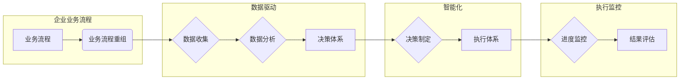

> - 企业数字化转型
> - 业务流程重组
> - 决策体系
> - 执行体系
> - 智能化
> - 数据驱动
> - 技术选型

# 企业业务数字化和智能化建设方案：业务流程重组，重建公司的决策体系和执行体系

## 1. 背景介绍

在当今数字化时代，企业面临着前所未有的机遇和挑战。数字化转型已成为企业提升竞争力、实现可持续发展的关键。企业业务数字化和智能化建设，不仅仅是技术升级，更是对企业组织架构、管理方式、决策体系和执行体系的全面革新。

### 1.1 数字化转型的必要性

1. **提高效率**：数字化技术可以自动化繁琐的流程，减少人为错误，提高工作效率。
2. **增强竞争力**：数字化企业能够更好地响应市场变化，快速创新，提升竞争力。
3. **优化决策**：通过数据分析，企业可以更科学地制定决策，降低风险。
4. **提升客户体验**：数字化服务可以提高客户满意度，增强客户黏性。

### 1.2 数字化转型的挑战

1. **组织文化变革**：数字化转型需要改变传统的组织文化和管理模式。
2. **技术复杂性**：数字化技术涉及众多领域，需要企业具备相应的技术能力。
3. **数据安全与隐私**：数据安全和隐私保护是数字化转型面临的重要挑战。

## 2. 核心概念与联系

### 2.1 核心概念

#### 业务流程重组（BPR）

业务流程重组是指对企业的业务流程进行根本性的再思考和再设计，以提高组织运作效率。

#### 决策体系

决策体系是企业制定和执行决策的框架和流程，包括数据收集、分析、决策制定和执行监控。

#### 执行体系

执行体系是企业将决策转化为实际行动的机制，包括任务分配、进度监控、结果评估等。

### 2.2 架构流程图



## 3. 核心算法原理 & 具体操作步骤

### 3.1 算法原理概述

企业业务数字化和智能化建设方案的核心是利用先进的信息技术，包括大数据、人工智能、云计算等，对业务流程进行重构，优化决策体系，提升执行效率。

### 3.2 算法步骤详解

#### 3.2.1 业务流程重组

1. **流程分析**：识别现有业务流程中的瓶颈和问题。
2. **流程设计**：基于业务目标和需求，设计新的业务流程。
3. **流程优化**：通过自动化、智能化手段优化流程，提高效率。

#### 3.2.2 决策体系

1. **数据收集**：收集业务数据，包括内部数据和外部分析数据。
2. **数据分析**：对收集到的数据进行分析，提取有价值的信息。
3. **决策制定**：基于分析结果，制定科学合理的决策。
4. **执行监控**：对决策执行过程进行监控，确保决策有效执行。

#### 3.2.3 执行体系

1. **任务分配**：将任务分配给相关人员。
2. **进度监控**：监控任务进度，确保按计划完成。
3. **结果评估**：评估任务结果，为后续决策提供依据。

### 3.3 算法优缺点

#### 优点

1. **提高效率**：自动化流程，减少人工操作，提高工作效率。
2. **降低成本**：优化资源配置，降低运营成本。
3. **提升决策质量**：基于数据分析，提高决策的科学性和准确性。
4. **增强竞争力**：提升企业竞争力，适应市场变化。

#### 缺点

1. **技术复杂性**：需要投入大量技术和人力。
2. **数据安全风险**：数据收集、存储、传输和使用过程中存在安全风险。
3. **组织变革困难**：需要改变传统的组织文化和管理模式。

### 3.4 算法应用领域

企业业务数字化和智能化建设方案可以应用于各个行业，如制造业、金融业、零售业、服务业等。

## 4. 数学模型和公式 & 详细讲解 & 举例说明

### 4.1 数学模型构建

企业业务数字化和智能化建设方案中的数学模型主要包括以下几类：

1. **决策树**：用于分类和回归任务，可以用于客户细分、风险评估等。
2. **支持向量机**：用于分类和回归任务，可以用于文本分类、情感分析等。
3. **神经网络**：用于复杂的分类和回归任务，可以用于图像识别、语音识别等。

### 4.2 公式推导过程

以决策树为例，其基本公式如下：

$$
P(y|x) = \prod_{i=1}^{n} P(y|x_i)
$$

其中 $P(y|x)$ 表示在给定特征 $x$ 的条件下，目标变量 $y$ 的概率。

### 4.3 案例分析与讲解

假设某公司需要对客户进行细分，以便进行精准营销。公司收集了客户的年龄、收入、消费习惯等数据，并使用决策树算法进行分类。

1. **数据预处理**：对数据进行清洗、归一化等处理。
2. **特征选择**：选择与目标变量相关的特征。
3. **训练模型**：使用训练数据训练决策树模型。
4. **模型评估**：使用测试数据评估模型性能。

最终，模型将客户分为不同的群体，公司可以根据不同群体的特征进行差异化营销。

## 5. 项目实践：代码实例和详细解释说明

### 5.1 开发环境搭建

使用Python和Scikit-learn库进行决策树模型的开发。

### 5.2 源代码详细实现

```python
from sklearn.datasets import load_iris
from sklearn.model_selection import train_test_split
from sklearn.tree import DecisionTreeClassifier
from sklearn.metrics import accuracy_score

# 加载数据
iris = load_iris()
X, y = iris.data, iris.target

# 划分训练集和测试集
X_train, X_test, y_train, y_test = train_test_split(X, y, test_size=0.2)

# 训练模型
model = DecisionTreeClassifier()
model.fit(X_train, y_train)

# 预测结果
y_pred = model.predict(X_test)

# 评估模型
accuracy = accuracy_score(y_test, y_pred)
print(f"Accuracy: {accuracy:.2f}")
```

### 5.3 代码解读与分析

上述代码展示了使用决策树模型进行分类的完整过程。

1. **加载数据**：使用Scikit-learn库加载Iris数据集。
2. **划分训练集和测试集**：将数据集划分为训练集和测试集，用于模型训练和评估。
3. **训练模型**：使用训练数据训练决策树模型。
4. **预测结果**：使用训练好的模型对测试数据进行预测。
5. **评估模型**：计算模型的准确率。

## 6. 实际应用场景

### 6.1 制造业

在制造业中，企业可以通过数字化技术优化生产流程，提高生产效率，降低生产成本。例如，使用工业互联网平台实现生产设备的远程监控和维护，使用机器视觉技术进行产品质检等。

### 6.2 金融业

在金融业中，企业可以通过数字化技术提升风险管理能力，提高客户服务水平。例如，使用大数据分析技术进行风险评估，使用人工智能技术进行欺诈检测等。

### 6.3 零售业

在零售业中，企业可以通过数字化技术实现精准营销，提升客户满意度。例如，使用客户关系管理系统进行客户管理，使用推荐系统进行商品推荐等。

### 6.4 服务业

在服务业中，企业可以通过数字化技术提升服务质量和效率。例如，使用在线客服系统提高客户服务效率，使用智能排班系统优化人力资源配置等。

## 7. 工具和资源推荐

### 7.1 学习资源推荐

1. 《数字化时代的企业管理》
2. 《大数据时代》
3. 《人工智能：一种现代的方法》

### 7.2 开发工具推荐

1. Python
2. Java
3. C#

### 7.3 相关论文推荐

1. 《基于数据驱动的企业数字化转型》
2. 《人工智能与数字化转型》
3. 《企业数字化转型与商业模式创新》

## 8. 总结：未来发展趋势与挑战

### 8.1 研究成果总结

企业业务数字化和智能化建设方案是企业实现数字化转型的重要手段。通过业务流程重组、重建决策体系和执行体系，企业可以提升效率、降低成本、优化决策，增强竞争力。

### 8.2 未来发展趋势

1. **智能化**：利用人工智能技术，实现业务流程的自动化、智能化。
2. **数据驱动**：基于数据分析，实现决策的科学化、精准化。
3. **云化**：将数字化应用部署在云端，实现弹性扩展和资源共享。

### 8.3 面临的挑战

1. **技术挑战**：数字化技术更新迭代快，企业需要持续学习和适应。
2. **人才挑战**：数字化人才短缺，企业需要培养和引进专业人才。
3. **安全挑战**：数据安全和隐私保护是数字化面临的重要挑战。

### 8.4 研究展望

未来，企业业务数字化和智能化建设将继续深入发展，为企业在数字化时代取得成功提供有力支撑。

## 9. 附录：常见问题与解答

**Q1：企业数字化转型的关键是什么？**

A：企业数字化转型的关键是顶层设计，明确转型目标、制定转型策略、优化组织架构，并持续推动转型落地。

**Q2：如何评估企业数字化转型的成果？**

A：可以关注以下指标：
1. 效率提升：如生产效率、运营效率等。
2. 成本降低：如运营成本、人力成本等。
3. 增值创造：如新产品、新服务、新市场等。

**Q3：如何培养数字化人才？**

A：可以通过以下途径培养数字化人才：
1. 内部培训：组织内部培训，提升员工数字化素养。
2. 招聘引进：引进具备数字化技能的人才。
3. 产学研合作：与高校、科研机构合作，培养复合型人才。

**Q4：企业数字化转型需要投入多少资金？**

A：企业数字化转型的资金投入因企业规模、行业特点、转型目标等因素而异。一般来说，数字化转型需要投入的资金包括硬件设备、软件系统、人才培训等。

**Q5：企业数字化转型是否需要改变现有的组织架构？**

A：是的，企业数字化转型需要与组织架构变革相结合，优化组织架构，提高组织灵活性，以适应数字化时代的业务需求。

---

作者：禅与计算机程序设计艺术 / Zen and the Art of Computer Programming