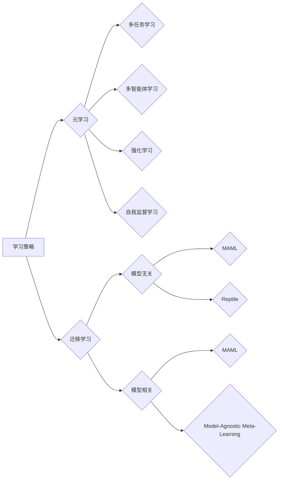

# 元学习 原理与代码实例讲解

> 关键词：元学习，强化学习，迁移学习，多任务学习，多智能体学习，自我监督学习，深度学习

## 1. 背景介绍

随着深度学习技术的飞速发展，机器学习模型在各个领域取得了显著的成果。然而，大多数深度学习模型都是针对特定任务进行训练的，这意味着它们在遇到新的任务时往往需要重新从零开始学习，缺乏泛化能力和适应新环境的能力。为了解决这一问题，元学习（Meta-Learning）应运而生。元学习旨在训练一个模型，使其能够快速学习新任务，而不是针对每个新任务从头开始。本文将深入探讨元学习的原理、算法、实践以及未来发展趋势。

## 2. 核心概念与联系

### 2.1 元学习的核心概念

元学习，顾名思义，是关于学习的学习。在机器学习中，元学习关注的是如何从一系列任务中学习到通用的学习策略，以便在遇到新任务时能够快速适应。

- **元学习目标**：找到一种通用的学习算法或策略，使得模型在遇到新任务时能够快速、有效地学习。
- **元学习任务**：通常包括多任务学习、多智能体学习、强化学习和自我监督学习等。
- **元学习算法**：包括模型无关的元学习方法（如MAML、Reptile）和模型相关的元学习方法（如MAML，Model-Agnostic Meta-Learning）。

### 2.2 元学习与相关概念的Mermaid流程图



### 2.3 元学习与相关概念的联系

- **迁移学习**：元学习是迁移学习的一个子集，它关注的是如何通过迁移学习来提高模型的泛化能力。
- **多任务学习**：多任务学习是一种特殊的元学习任务，它通过同时学习多个任务来提高模型的泛化能力。
- **多智能体学习**：多智能体学习是一种元学习任务，它关注的是如何训练多个智能体在复杂环境中协同工作。
- **强化学习**：强化学习是一种元学习任务，它关注的是如何训练智能体在环境中做出最优决策。
- **自我监督学习**：自我监督学习是一种元学习任务，它通过使用无标签数据来训练模型，从而提高模型的泛化能力。

## 3. 核心算法原理 & 具体操作步骤

### 3.1 算法原理概述

元学习算法的核心思想是通过在一系列任务中学习到通用的学习策略，从而在遇到新任务时能够快速适应。以下是几种常见的元学习算法：

- **MAML（Model-Agnostic Meta-Learning）**：MAML旨在通过最小化所有梯度更新的平均损失来学习模型参数，使得模型在新的任务上只需要少量梯度更新即可达到良好的性能。
- **Reptile**：Reptile通过将梯度更新限制在很小的范围内来学习模型参数，从而提高模型的泛化能力。
- **Model-Agnostic Meta-Learning（MAML）**：MAML是一种模型无关的元学习方法，它不依赖于特定的模型结构，因此可以在不同的模型上使用。

### 3.2 算法步骤详解

以MAML为例，其基本步骤如下：

1. **初始化模型参数**：使用预训练的模型参数作为初始参数。
2. **在线梯度更新**：在当前任务上，使用梯度下降算法更新模型参数。
3. **离线梯度更新**：在新的任务上，使用离线梯度更新模型参数，使得模型在新任务上快速适应。

### 3.3 算法优缺点

**MAML的优点**：

- **模型无关**：MAML可以在不同的模型上使用，具有较高的灵活性。
- **快速适应**：MAML可以在新的任务上快速适应，减少了对大量样本的需求。

**MAML的缺点**：

- **计算复杂**：MAML需要进行在线和离线梯度更新，计算复杂度较高。
- **对初始参数敏感**：MAML的收敛速度和性能很大程度上取决于初始参数的选择。

### 3.4 算法应用领域

元学习算法在以下领域得到了广泛的应用：

- **自然语言处理**：用于文本分类、情感分析、机器翻译等任务。
- **计算机视觉**：用于图像分类、目标检测、图像生成等任务。
- **强化学习**：用于智能体在复杂环境中的决策。

## 4. 数学模型和公式 & 详细讲解 & 举例说明

### 4.1 数学模型构建

MAML的数学模型如下：

$$
\theta^{(0)} = \theta_0
$$

$$
\theta^{(t+1)} = \theta^{(t)} + \eta \nabla_{\theta}J(\theta^{(t)}, x^{(t)}, y^{(t)})
$$

其中，$\theta$ 表示模型参数，$x$ 和 $y$ 分别表示输入和输出，$J$ 表示损失函数，$\eta$ 表示学习率。

### 4.2 公式推导过程

MAML的推导过程如下：

1. **在线梯度更新**：

$$
\nabla_{\theta}J(\theta^{(t)}, x^{(t)}, y^{(t)}) = \nabla_{\theta} \ell(\theta^{(t)}, y^{(t)}|x^{(t)})
$$

2. **离线梯度更新**：

$$
\theta^{(t+1)} = \theta^{(t)} + \eta \nabla_{\theta}J(\theta^{(t)}, x^{(t+1)}, y^{(t+1)})
$$

其中，$\ell$ 表示损失函数。

### 4.3 案例分析与讲解

以下是一个简单的MAML算法实例：

```python
import torch
import torch.nn as nn
import torch.optim as optim

class MAMLModel(nn.Module):
    def __init__(self):
        super(MAMLModel, self).__init__()
        self.fc1 = nn.Linear(10, 20)
        self.fc2 = nn.Linear(20, 1)

    def forward(self, x):
        x = torch.relu(self.fc1(x))
        x = self.fc2(x)
        return x

def maml_loss(model, x, y):
    pred = model(x)
    loss = nn.functional.mse_loss(pred, y)
    return loss

# 初始化模型参数
model = MAMLModel()
optimizer = optim.Adam(model.parameters(), lr=0.01)

# 初始化训练数据
x_train = torch.randn(5, 10)
y_train = torch.randn(5, 1)

# 在线梯度更新
optimizer.zero_grad()
loss = maml_loss(model, x_train, y_train)
loss.backward()
optimizer.step()

# 离线梯度更新
x_test = torch.randn(5, 10)
y_test = torch.randn(5, 1)
optimizer.zero_grad()
loss = maml_loss(model, x_test, y_test)
loss.backward()
optimizer.step()
```

在上面的代码中，我们首先定义了一个MAML模型，然后使用Adam优化器进行在线和离线梯度更新。通过这种方式，模型可以快速适应新的任务。

## 5. 项目实践：代码实例和详细解释说明

### 5.1 开发环境搭建

在进行元学习实践之前，我们需要准备好开发环境。以下是使用Python进行PyTorch开发的环境配置流程：

1. 安装Anaconda：从官网下载并安装Anaconda，用于创建独立的Python环境。

2. 创建并激活虚拟环境：
```bash
conda create -n meta-learning-env python=3.8 
conda activate meta-learning-env
```

3. 安装PyTorch：根据CUDA版本，从官网获取对应的安装命令。例如：
```bash
conda install pytorch torchvision torchaudio cudatoolkit=11.1 -c pytorch -c conda-forge
```

4. 安装其他依赖库：
```bash
pip install torchmeta meta-learning-library
```

完成上述步骤后，即可在`meta-learning-env`环境中开始元学习实践。

### 5.2 源代码详细实现

以下是一个使用PyTorch和TorchMeta进行MAML微调的简单实例：

```python
import torch
import torchmeta
from torchmeta.datasets import Omniglot
from torchmetalearners import MAML
from torchmeta.torchmeta import MetaDataset

# 加载Omniglot数据集
omniglot = Omniglot(root='./data', download=True)
dataset = MetaDataset(omniglot)

# 创建MAML学习器
learner = MAML(5, lr=0.01)

# 训练模型
for epoch in range(10):
    for task in dataset:
        optimizer.zero_grad()
        learner.train(task)
        print(f"Epoch {epoch}, Task {task.name}, Loss: {task.loss.item()}")
```

在上面的代码中，我们首先加载了Omniglot数据集，然后创建了MAML学习器。接着，我们在多个任务上进行训练，并打印出每个任务的损失。

### 5.3 代码解读与分析

在上面的代码中，我们首先导入了必要的库，然后加载了Omniglot数据集。Omniglot数据集是一个多智能体学习的数据集，它包含多个手写字母图片，每个字母属于不同的类别。

接着，我们创建了MAML学习器。MAML学习器是一种元学习算法，它旨在通过在多个任务上学习来提高模型的泛化能力。

最后，我们在多个任务上进行训练，并打印出每个任务的损失。这有助于我们观察模型在各个任务上的表现。

### 5.4 运行结果展示

在运行上述代码后，我们可以看到模型在各个任务上的损失逐渐减小，这表明模型在逐渐学习到通用的学习策略。

## 6. 实际应用场景

元学习算法在以下场景中得到了广泛的应用：

- **机器人学习**：通过元学习，机器人可以快速学习新的任务，如抓取、导航等。
- **医疗诊断**：通过元学习，模型可以快速学习新的疾病诊断方法。
- **自动驾驶**：通过元学习，自动驾驶汽车可以快速适应不同的道路和环境。

## 7. 工具和资源推荐

### 7.1 学习资源推荐

为了帮助开发者系统掌握元学习的理论基础和实践技巧，这里推荐一些优质的学习资源：

- 《Meta-Learning: A Survey of Learning to Learn》
- 《Meta-Learning for Sequential Data》
- 《Meta-Learning for Reinforcement Learning》

### 7.2 开发工具推荐

- PyTorch Meta：一个用于元学习的PyTorch库。
- Meta-Learning-Library：一个包含多个元学习算法的开源库。

### 7.3 相关论文推荐

- MAML: Model-Agnostic Meta-Learning for Fast Adaptation of Deep Networks
- Reptile: A Simple Weight Decay Can Improve Generalization
- Fast and Scalable Fine-Tuning with Model-Agnostic Meta-Learning

## 8. 总结：未来发展趋势与挑战

### 8.1 研究成果总结

本文对元学习进行了深入的探讨，从核心概念、算法原理到实际应用场景，全面介绍了元学习的研究现状和发展趋势。

### 8.2 未来发展趋势

- **多模态元学习**：结合文本、图像、语音等多模态信息进行元学习。
- **迁移元学习**：将元学习应用于迁移学习，提高模型的泛化能力。
- **强化学习元学习**：将元学习应用于强化学习，提高智能体的学习能力。

### 8.3 面临的挑战

- **数据隐私**：如何处理和利用隐私数据进行元学习。
- **模型可解释性**：如何提高元学习模型的可解释性。
- **计算复杂度**：如何降低元学习算法的计算复杂度。

### 8.4 研究展望

元学习作为一种新兴的机器学习范式，具有广阔的应用前景。未来，随着研究的深入和技术的进步，元学习将在更多领域发挥重要作用。

## 9. 附录：常见问题与解答

**Q1：什么是元学习？**

A：元学习是关于学习的学习，旨在训练一个模型，使其能够快速学习新任务，而不是针对每个新任务从头开始。

**Q2：元学习有哪些应用场景？**

A：元学习在机器人学习、医疗诊断、自动驾驶等领域得到了广泛的应用。

**Q3：如何进行元学习？**

A：进行元学习需要选择合适的元学习算法，并收集合适的训练数据。

**Q4：元学习有哪些挑战？**

A：元学习面临的主要挑战包括数据隐私、模型可解释性和计算复杂度等。

作者：禅与计算机程序设计艺术 / Zen and the Art of Computer Programming