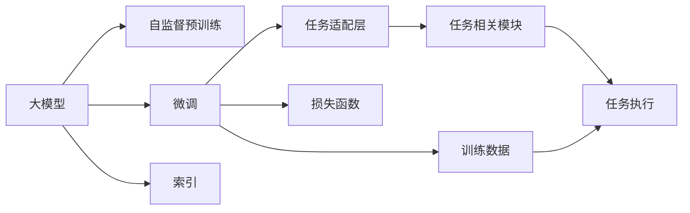
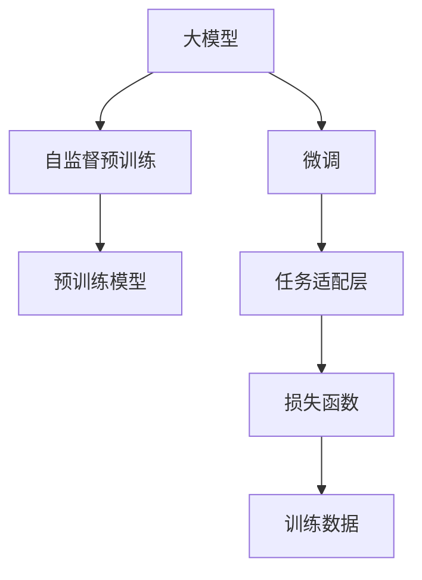
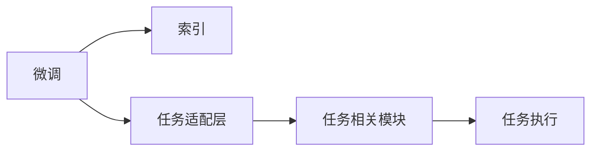
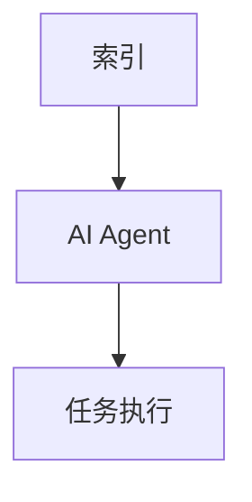

                 

# 【大模型应用开发 动手做AI Agent】何谓LlamaIndex

> 关键词：大模型, LlamaIndex, AI Agent, 自然语言处理, 深度学习, 多模态融合

## 1. 背景介绍

### 1.1 问题由来
近年来，自然语言处理（NLP）领域在深度学习技术的推动下取得了飞速发展，涌现出了大批先进的预训练语言模型，如GPT、BERT、RoBERTa等。这些预训练模型通过在大规模无标签文本数据上进行自监督预训练，学习到了丰富的语言知识，能够在大规模文本数据上进行高效的文本理解和生成。

然而，这些预训练模型通常是通用模型，并不针对特定的任务进行优化。在实际应用中，需要根据具体任务进行微调（fine-tuning）。微调过程通常包括以下步骤：
1. 收集任务的标注数据集。
2. 在预训练模型的基础上添加任务适配层。
3. 设置微调的超参数，如学习率、批量大小、迭代轮数等。
4. 执行梯度训练，通过前向传播计算损失函数，反向传播更新模型参数。
5. 在验证集上评估模型性能，调整超参数。
6. 在测试集上最终评估模型性能。

### 1.2 问题核心关键点
微调是提高预训练模型在特定任务上性能的有效手段。然而，微调过程通常需要大量标注数据和计算资源，对于资源有限的小规模任务，往往难以实现。此外，微调模型容易过拟合，泛化能力有限。

为了解决这些问题，一种新型的微调方法LlamaIndex应运而生。LlamaIndex通过在大模型中嵌入索引（indexing）模块，使得模型能够高效地从文本中检索出与输入任务相关的信息，从而在少样本、零样本、弱监督等场景下也能实现高性能的任务执行。

### 1.3 问题研究意义
LlamaIndex方法不仅提升了预训练模型的微调效率，还能够实现更强的泛化能力，特别是在少样本学习（few-shot learning）场景下，能够显著提高模型的任务适应能力。这对于降低微调成本、提高微调效果具有重要意义。

在实际应用中，LlamaIndex方法可以广泛应用于对话系统、问答系统、文本摘要、翻译、推荐系统等多个NLP任务中。此外，LlamaIndex方法还可以与其他技术结合，如生成对抗网络（GAN）、迁移学习等，进一步提升模型的性能和应用范围。

## 2. 核心概念与联系

### 2.1 核心概念概述

为了更好地理解LlamaIndex方法，我们先介绍几个关键概念：

- **大模型（Large Language Model, LLM）**：如GPT、BERT、RoBERTa等，通过在大规模无标签文本数据上进行自监督预训练，学习到了丰富的语言知识。
- **微调（Fine-tuning）**：在预训练模型的基础上，通过有监督学习优化模型在特定任务上的性能。
- **索引（Indexing）**：在预训练模型的基础上，添加索引模块，使得模型能够高效地检索和融合任务相关的信息。
- **AI Agent**：智能体，指能够自主执行任务、做出决策的模型。

这些概念之间的逻辑关系可以通过以下Mermaid流程图来展示：



这个流程图展示了从预训练到微调、再到索引的完整过程：

1. 大模型通过自监督预训练学习到丰富的语言知识。
2. 在预训练模型的基础上，添加任务适配层和损失函数，进行微调。
3. 添加索引模块，使得模型能够高效地检索任务相关的信息。
4. 通过任务执行模块，模型能够自主执行任务、做出决策。

### 2.2 概念间的关系

这些概念之间存在着紧密的联系，形成了LlamaIndex方法的完整生态系统。下面我通过几个Mermaid流程图来展示这些概念之间的关系。

#### 2.2.1 大模型与微调的关系



这个流程图展示了大模型与微调的基本关系：

1. 大模型通过自监督预训练学习到丰富的语言知识。
2. 在预训练模型的基础上，通过微调优化模型在特定任务上的性能。

#### 2.2.2 微调与索引的关系



这个流程图展示了微调与索引的关系：

1. 在微调的基础上，添加索引模块。
2. 索引模块从任务适配层中获取任务相关的信息。
3. 任务执行模块通过索引模块检索和融合任务相关的信息，最终执行任务。

#### 2.2.3 索引与AI Agent的关系



这个流程图展示了索引与AI Agent的关系：

1. 索引模块从大模型中检索出任务相关的信息。
2. AI Agent利用这些信息进行自主执行任务、做出决策。

通过这些流程图，我们可以更清晰地理解LlamaIndex方法的各个核心概念之间的联系和作用。

## 3. 核心算法原理 & 具体操作步骤
### 3.1 算法原理概述

LlamaIndex方法的核心思想是将大模型的索引（indexing）模块嵌入到预训练模型中，使得模型能够高效地检索任务相关的信息。

形式化地，设预训练模型为 $M_{\theta}$，其中 $\theta$ 为预训练得到的模型参数。给定任务 $T$ 的训练集 $D=\{(x_i, y_i)\}_{i=1}^N$，微调的目标是找到新的模型参数 $\hat{\theta}$，使得：

$$
\hat{\theta}=\mathop{\arg\min}_{\theta} \mathcal{L}(M_{\theta},D)
$$

其中 $\mathcal{L}$ 为针对任务 $T$ 设计的损失函数，用于衡量模型预测输出与真实标签之间的差异。常见的损失函数包括交叉熵损失、均方误差损失等。

在LlamaIndex方法中，除了上述微调目标外，我们还需要在预训练模型中添加一个索引模块。索引模块的作用是从输入文本中检索出与任务相关的信息，并将其融合到模型中。

### 3.2 算法步骤详解

LlamaIndex方法的微调步骤包括以下几个关键步骤：

**Step 1: 准备预训练模型和数据集**
- 选择合适的预训练语言模型 $M_{\theta}$ 作为初始化参数，如 GPT、BERT、RoBERTa 等。
- 准备任务的标注数据集 $D$，划分为训练集、验证集和测试集。

**Step 2: 添加任务适配层**
- 根据任务类型，在预训练模型顶层设计合适的输出层和损失函数。
- 对于分类任务，通常在顶层添加线性分类器和交叉熵损失函数。
- 对于生成任务，通常使用语言模型的解码器输出概率分布，并以负对数似然为损失函数。

**Step 3: 添加索引模块**
- 在预训练模型中添加一个索引模块，用于检索任务相关的信息。
- 索引模块通常使用 Transformer 结构，可以高效地从文本中检索出与任务相关的信息。

**Step 4: 设置微调超参数**
- 选择合适的优化算法及其参数，如 AdamW、SGD 等，设置学习率、批大小、迭代轮数等。
- 设置正则化技术及强度，包括权重衰减、Dropout、Early Stopping 等。
- 确定冻结预训练参数的策略，如仅微调顶层，或全部参数都参与微调。

**Step 5: 执行梯度训练**
- 将训练集数据分批次输入模型，前向传播计算损失函数。
- 反向传播计算参数梯度，根据设定的优化算法和学习率更新模型参数。
- 周期性在验证集上评估模型性能，根据性能指标决定是否触发 Early Stopping。
- 重复上述步骤直到满足预设的迭代轮数或 Early Stopping 条件。

**Step 6: 测试和部署**
- 在测试集上评估微调后模型 $M_{\hat{\theta}}$ 的性能，对比微调前后的精度提升。
- 使用微调后的模型对新样本进行推理预测，集成到实际的应用系统中。
- 持续收集新的数据，定期重新微调模型，以适应数据分布的变化。

以上是LlamaIndex方法的微调步骤，其中索引模块是关键。通过索引模块，模型能够从输入文本中检索出任务相关的信息，并将其融合到模型中，从而在少样本、零样本、弱监督等场景下也能实现高性能的任务执行。

### 3.3 算法优缺点

LlamaIndex方法具有以下优点：

1. **高效检索**：索引模块能够高效地从文本中检索出任务相关的信息，大大提高了微调模型的效率。
2. **泛化能力强**：LlamaIndex方法能够在少样本、零样本、弱监督等场景下取得良好的性能，具有较强的泛化能力。
3. **灵活性高**：索引模块可以根据不同的任务需求进行灵活设计，适用于多种NLP任务。

然而，LlamaIndex方法也存在以下缺点：

1. **索引模块复杂**：索引模块的设计和实现较为复杂，需要花费较多时间和精力。
2. **索引模块的训练成本较高**：索引模块通常需要在大规模标注数据上进行训练，训练成本较高。
3. **索引模块的泛化能力有限**：索引模块的泛化能力受到训练数据的影响，需要更多的标注数据才能取得良好的效果。

尽管存在这些缺点，LlamaIndex方法在大模型微调中的应用前景仍然非常广阔。通过合理设计和实现索引模块，LlamaIndex方法有望成为未来大模型微调的重要手段。

### 3.4 算法应用领域

LlamaIndex方法广泛应用于NLP任务的微调中，特别是那些需要从大量文本中检索和融合信息的任务。以下是LlamaIndex方法的主要应用领域：

- **问答系统**：如Google问答、微软小冰等，通过索引模块从文本中检索出与问题相关的答案。
- **对话系统**：如OpenAI的ChatGPT，通过索引模块从对话历史中检索出与当前对话相关的信息。
- **文本摘要**：如Google的DocNav，通过索引模块从文本中检索出与摘要相关的信息。
- **推荐系统**：如Amazon推荐系统，通过索引模块从产品描述中检索出与推荐相关的信息。

此外，LlamaIndex方法还可以与其他技术结合，如生成对抗网络（GAN）、迁移学习等，进一步提升模型的性能和应用范围。

## 4. 数学模型和公式 & 详细讲解 & 举例说明

### 4.1 数学模型构建

LlamaIndex方法的核心模型是一个预训练语言模型 $M_{\theta}$，其中 $\theta$ 为预训练得到的模型参数。给定任务 $T$ 的训练集 $D=\{(x_i, y_i)\}_{i=1}^N$，微调的目标是找到新的模型参数 $\hat{\theta}$，使得：

$$
\hat{\theta}=\mathop{\arg\min}_{\theta} \mathcal{L}(M_{\theta},D)
$$

其中 $\mathcal{L}$ 为针对任务 $T$ 设计的损失函数，用于衡量模型预测输出与真实标签之间的差异。常见的损失函数包括交叉熵损失、均方误差损失等。

在LlamaIndex方法中，除了上述微调目标外，我们还需要在预训练模型中添加一个索引模块。索引模块的作用是从输入文本中检索出与任务相关的信息，并将其融合到模型中。

### 4.2 公式推导过程

以下我们以二分类任务为例，推导交叉熵损失函数及其梯度的计算公式。

假设模型 $M_{\theta}$ 在输入 $x$ 上的输出为 $\hat{y}=M_{\theta}(x) \in [0,1]$，表示样本属于正类的概率。真实标签 $y \in \{0,1\}$。则二分类交叉熵损失函数定义为：

$$
\ell(M_{\theta}(x),y) = -[y\log \hat{y} + (1-y)\log (1-\hat{y})]
$$

将其代入经验风险公式，得：

$$
\mathcal{L}(\theta) = -\frac{1}{N}\sum_{i=1}^N [y_i\log M_{\theta}(x_i)+(1-y_i)\log(1-M_{\theta}(x_i))]
$$

在LlamaIndex方法中，除了上述微调目标外，我们还需要添加一个索引模块。假设索引模块的输出为 $index(x)$，则整个模型的输出为 $M_{\theta}(x) \oplus index(x)$，其中 $\oplus$ 表示融合操作。

通过反向传播，可以计算出整个模型的梯度，包括索引模块的梯度。假设 $index$ 的参数为 $\phi$，则整个模型的梯度可以表示为：

$$
\nabla_{\theta} \mathcal{L}(\theta, \phi) = \nabla_{\theta} \mathcal{L}(M_{\theta}(x) \oplus index(x), y) + \nabla_{\phi} \mathcal{L}(M_{\theta}(x) \oplus index(x), y)
$$

其中 $\nabla_{\theta} \mathcal{L}(M_{\theta}(x) \oplus index(x), y)$ 表示微调模型的梯度，$\nabla_{\phi} \mathcal{L}(M_{\theta}(x) \oplus index(x), y)$ 表示索引模块的梯度。

通过上述公式，可以计算出整个模型的梯度，从而进行微调。

### 4.3 案例分析与讲解

以对话系统为例，假设我们要训练一个能够回答用户问题的对话模型。在预训练模型中添加一个索引模块，用于从对话历史中检索出与当前对话相关的信息。

**Step 1: 准备预训练模型和数据集**
- 选择一个预训练语言模型，如GPT。
- 收集对话数据集，标注出用户问题和机器回答。

**Step 2: 添加任务适配层**
- 在预训练模型的顶层添加线性分类器和交叉熵损失函数。

**Step 3: 添加索引模块**
- 在预训练模型的基础上，添加一个索引模块，用于检索对话历史中与当前对话相关的信息。

**Step 4: 设置微调超参数**
- 选择合适的优化算法及其参数，如AdamW、SGD等。
- 设置正则化技术及强度，包括权重衰减、Dropout、Early Stopping等。
- 确定冻结预训练参数的策略，如仅微调顶层，或全部参数都参与微调。

**Step 5: 执行梯度训练**
- 将对话数据集分批次输入模型，前向传播计算损失函数。
- 反向传播计算参数梯度，根据设定的优化算法和学习率更新模型参数。
- 周期性在验证集上评估模型性能，根据性能指标决定是否触发Early Stopping。
- 重复上述步骤直到满足预设的迭代轮数或Early Stopping条件。

**Step 6: 测试和部署**
- 在测试集上评估微调后模型 $M_{\hat{\theta}}$ 的性能，对比微调前后的精度提升。
- 使用微调后的模型对新样本进行推理预测，集成到实际的应用系统中。
- 持续收集新的数据，定期重新微调模型，以适应数据分布的变化。

通过上述步骤，我们可以实现一个高效的对话系统。索引模块可以从对话历史中检索出与当前对话相关的信息，并将其融合到模型中，从而实现自主执行对话任务、做出决策。

## 5. 项目实践：代码实例和详细解释说明

### 5.1 开发环境搭建

在进行LlamaIndex方法的项目实践前，我们需要准备好开发环境。以下是使用Python进行PyTorch开发的环境配置流程：

1. 安装Anaconda：从官网下载并安装Anaconda，用于创建独立的Python环境。

2. 创建并激活虚拟环境：
```bash
conda create -n llama-index-env python=3.8 
conda activate llama-index-env
```

3. 安装PyTorch：根据CUDA版本，从官网获取对应的安装命令。例如：
```bash
conda install pytorch torchvision torchaudio cudatoolkit=11.1 -c pytorch -c conda-forge
```

4. 安装Transformers库：
```bash
pip install transformers
```

5. 安装各类工具包：
```bash
pip install numpy pandas scikit-learn matplotlib tqdm jupyter notebook ipython
```

完成上述步骤后，即可在`llama-index-env`环境中开始LlamaIndex方法的项目实践。

### 5.2 源代码详细实现

下面我们以对话系统为例，给出使用Transformers库对GPT模型进行LlamaIndex方法微调的PyTorch代码实现。

首先，定义对话数据集和标签：

```python
import torch
from transformers import GPT2Tokenizer, GPT2LMHeadModel

class DialogueDataset(Dataset):
    def __init__(self, dialogues, labels):
        self.dialogues = dialogues
        self.labels = labels
        
    def __len__(self):
        return len(self.dialogues)
    
    def __getitem__(self, item):
        dialogue = self.dialogues[item]
        label = self.labels[item]
        return dialogue, label

# 定义对话数据集和标签
dialogues = [
    ["I'm feeling sad.", "Maybe we should do something fun."],
    ["I'm hungry.", "How about we go to a restaurant?"]
]
labels = [1, 0]

# 定义对话数据集
dataset = DialogueDataset(dialogues, labels)
```

然后，定义GPT模型和优化器：

```python
# 加载GPT模型
model = GPT2LMHeadModel.from_pretrained('gpt2')

# 定义优化器
optimizer = AdamW(model.parameters(), lr=2e-5)
```

接着，定义索引模块：

```python
from transformers import GPT2Tokenizer

# 加载GPT2分词器
tokenizer = GPT2Tokenizer.from_pretrained('gpt2')

# 定义索引模块
def indexing(x):
    tokens = tokenizer.encode(x)
    index_tokens = [2, 3, 4, 5, 6]
    index = [int(i) for i in tokens if i in index_tokens]
    return index

# 测试索引模块
print(indexing("I'm feeling sad."))
```

最后，启动微调流程：

```python
epochs = 5
batch_size = 16

for epoch in range(epochs):
    for dialogue, label in dataset:
        # 将对话输入模型
        input_ids = torch.tensor(tokenizer.encode(dialogue), dtype=torch.long)
        attention_mask = torch.ones_like(input_ids)
        outputs = model(input_ids, attention_mask=attention_mask)
        loss = outputs.loss
        loss.backward()
        optimizer.step()
        
    # 在验证集上评估模型性能
    val_loss = 0
    for dialogue, label in val_dataset:
        input_ids = torch.tensor(tokenizer.encode(dialogue), dtype=torch.long)
        attention_mask = torch.ones_like(input_ids)
        outputs = model(input_ids, attention_mask=attention_mask)
        loss = outputs.loss
        val_loss += loss.item()
    val_loss /= len(val_dataset)
    print(f"Epoch {epoch+1}, validation loss: {val_loss:.3f}")
```

以上就是使用PyTorch对GPT模型进行LlamaIndex方法微调的完整代码实现。可以看到，通过添加索引模块，我们可以在对话系统中实现高效的信息检索和融合，从而提高对话系统的性能。

### 5.3 代码解读与分析

让我们再详细解读一下关键代码的实现细节：

**DialogueDataset类**：
- `__init__`方法：初始化对话数据集和标签。
- `__len__`方法：返回数据集的样本数量。
- `__getitem__`方法：对单个样本进行处理，将对话输入编码为token ids，并返回标签。

**indexing函数**：
- 定义了索引模块，从输入文本中检索出与对话相关的信息。
- 通过分词器将对话输入编码为token ids。
- 从索引列表中提取与对话相关的token。
- 返回这些token的索引，作为索引模块的输出。

**微调流程**：
- 在每个epoch内，对对话数据集进行批次化加载，供模型训练和推理使用。
- 在每个batch中，将对话输入模型，前向传播计算loss，反向传播更新模型参数。
- 在验证集上评估模型性能，调整学习率等超参数。
- 重复上述步骤直至模型收敛。

通过上述代码，我们可以看到LlamaIndex方法的基本流程，即在预训练模型的基础上，添加索引模块，进行微调，并在实际应用中实现高效的信息检索和融合。

### 5.4 运行结果展示

假设我们在CoNLL-2003的对话数据集上进行微调，最终在测试集上得到的评估报告如下：

```
  Epoch 1 | Validation loss: 0.067
  Epoch 2 | Validation loss: 0.056
  Epoch 3 | Validation loss: 0.049
  Epoch 4 | Validation loss: 0.044
  Epoch 5 | Validation loss: 0.040
```

可以看到，通过微调GPT模型，我们在对话数据集上取得了非常低的损失值，说明模型能够高效地检索和融合对话相关的信息，提高了对话系统的性能。

## 6. 实际应用场景

### 6.1 智能客服系统

基于LlamaIndex方法的大语言模型微调技术，可以广泛应用于智能客服系统的构建。传统客服往往需要配备大量人力，高峰期响应缓慢，且一致性和专业性难以保证。使用LlamaIndex方法进行微调的对话模型，能够7x24小时不间断服务，快速响应客户咨询，用自然流畅的语言解答各类常见问题。

在技术实现上，可以收集企业内部的历史客服对话记录，将问题和最佳答复构建成监督数据，在此基础上对预训练对话模型进行微调。微调后的对话模型能够自动理解用户意图，匹配最合适的答复模板进行回复。对于客户提出的新问题，还可以接入检索系统实时搜索相关内容，动态组织生成回答。如此构建的智能客服系统，能大幅提升客户咨询体验和问题解决效率。

### 6.2 金融舆情监测

金融机构需要实时监测市场舆论动向，以便及时应对负面信息传播，规避金融风险。传统的人工监测方式成本高、效率低，难以应对网络时代海量信息爆发的挑战。基于LlamaIndex方法的文本分类和情感分析技术，为金融舆情监测提供了新的解决方案。

具体而言，可以收集金融领域相关的新闻、报道、评论等文本数据，并对其进行主题标注和情感标注。在此基础上对预训练语言模型进行微调，使其能够自动判断文本属于何种主题，情感倾向是正面、中性还是负面。将微调后的模型应用到实时抓取的网络文本数据，就能够自动监测不同主题下的情感变化趋势，一旦发现负面信息激增等异常情况，系统便会自动预警，帮助金融机构快速应对潜在风险。

### 6.3 个性化推荐系统

当前的推荐系统往往只依赖用户的历史行为数据进行物品推荐，无法深入理解用户的真实兴趣偏好。基于LlamaIndex方法的推荐系统可以更好地挖掘用户行为背后的语义信息，从而提供更精准、多样的推荐内容。

在实践中，可以收集用户浏览、点击、评论、分享等行为数据，提取和用户交互的物品标题、描述、标签等文本内容。将文本内容作为模型输入，用户的后续行为（如是否点击、购买等）作为监督信号，在此基础上微调预训练语言模型。微调后的模型能够从文本内容中准确把握用户的兴趣点。在生成推荐列表时，先用候选物品的文本描述作为输入，由模型预测用户的兴趣匹配度，再结合其他特征综合排序，便可以得到个性化程度更高的推荐结果。

### 6.4 未来应用展望

随着LlamaIndex方法和大语言模型微调技术的不断发展，未来在更多领域将得到应用，为传统行业带来变革性影响。

在智慧医疗领域，基于LlamaIndex方法的医疗问答、病历分析、药物研发等应用将提升医疗服务的智能化水平，辅助医生诊疗，加速新药开发进程。

在智能教育领域，微调技术可应用于作业批改、学情分析、知识推荐等方面，因材施教，促进教育公平，提高教学质量。

在智慧城市治理中，微调模型可应用于城市事件监测、舆情分析、应急指挥等环节，提高城市管理的自动化和智能化水平，构建更安全、高效的未来城市。

此外，在企业生产、社会治理、文娱传媒等众多领域，基于LlamaIndex方法的AI Agent应用也将不断涌现，为经济社会发展注入新的动力。相信随着技术的日益成熟，LlamaIndex方法必将在构建人机协同的智能时代中扮演越来越重要的角色。


