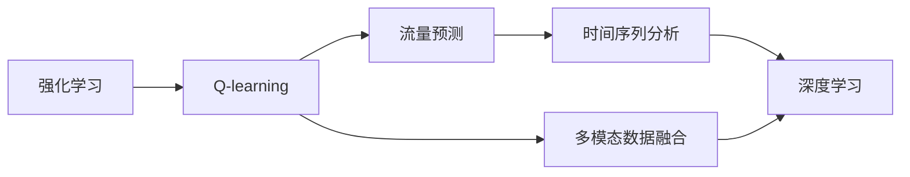

                 

# 一切皆是映射：AI Q-learning在流量预测中的实践

> 关键词：
1. 强化学习
2. Q-learning
3. 流量预测
4. 时间序列分析
5. 模型优化
6. 深度学习
7. 多模态数据融合

## 1. 背景介绍

### 1.1 问题由来
随着互联网技术的发展，网络流量的预测和分析变得越来越重要。在诸如云计算、网络安全、内容分发等众多场景中，网络流量的准确预测能帮助企业优化资源配置、提高服务质量和减少运营成本。传统的基于统计学方法的网络流量预测往往存在误差大、模型复杂等问题，无法满足实时性需求。

为了应对这些挑战，近年来AI在网络流量预测领域中开始广泛应用。Q-learning是一种强化学习方法，已经在控制论和机器人学领域中取得了成功，逐渐被引入到网络流量预测中，并在一些实际应用中取得了不错的效果。本博客将详细探讨Q-learning在网络流量预测中的应用，并给出具体的实现方法和效果分析。

### 1.2 问题核心关键点
Q-learning作为一种基于模型的强化学习方法，通过学习最优策略，对环境进行预测。具体应用到网络流量预测中，其核心关键点包括：
1. 状态表示：如何表示网络流量状态。
2. 动作决策：如何根据当前状态选择动作。
3. 奖励函数：如何设计奖励函数，奖励信号如何帮助模型学习最优策略。
4. 收敛性和稳定性：模型如何收敛，如何避免过度拟合和信息丢失。

本文将从这些关键点出发，详细阐述Q-learning在网络流量预测中的实践方法，并结合实际案例给出效果评估。

### 1.3 问题研究意义
Q-learning在网络流量预测中的应用，不仅能提供精准的流量预测结果，还能在多模态数据融合、模型优化等方面带来新的研究突破。具体来说，其研究意义如下：
1. 提高流量预测的精度和实时性，优化资源配置，降低成本。
2. 通过多模态数据融合，实现对网络流量多维度、多层次的理解。
3. 为网络流量预测提供更通用、更灵活的方法，提升模型的适应性。
4. 为其他领域的强化学习应用提供参考和借鉴，推动技术发展。

## 2. 核心概念与联系

### 2.1 核心概念概述

为了更好地理解Q-learning在网络流量预测中的应用，我们先介绍几个密切相关的核心概念：

- **强化学习(Reinforcement Learning, RL)**：一种通过智能体与环境的交互，学习最优策略的学习范式。智能体通过动作与环境交互，获取奖励信号，不断调整策略，最终学习到最优策略。
- **Q-learning**：一种基于模型的强化学习方法，通过学习Q值函数，指导智能体选择最优动作。Q值函数表示在当前状态下选择某个动作所能获得的预期奖励。
- **流量预测**：对网络流量进行预测，以便预测未来流量，优化资源配置，提高服务质量。
- **时间序列分析**：利用统计学方法，分析时间序列数据，以预测未来趋势。
- **多模态数据融合**：将多种类型的数据（如文本、图像、声音等）融合在一起，以提升预测精度。
- **深度学习**：一种基于神经网络的机器学习方法，能够处理大规模、非线性数据。

这些核心概念之间存在着紧密的联系，形成了强化学习在流量预测中的应用框架。通过理解这些核心概念，我们可以更好地把握Q-learning的实践方法。

### 2.2 概念间的关系

这些核心概念之间存在着紧密的联系，形成了Q-learning在流量预测中的应用框架。下面我们用一个Mermaid流程图来展示这些概念之间的关系：



这个流程图展示了一系列概念之间的联系：
1. 强化学习通过学习最优策略，指导智能体与环境的交互。
2. Q-learning在强化学习的基础上，通过学习Q值函数，指导智能体选择最优动作。
3. 流量预测利用Q-learning对网络流量进行预测，提高资源配置和服务的质量。
4. 时间序列分析是流量预测的一种重要技术，通过统计学方法，分析时间序列数据，以预测未来趋势。
5. 多模态数据融合利用多种类型的数据，提升预测精度。
6. 深度学习是一种强大的机器学习方法，能够处理大规模、非线性数据，实现更精确的预测。

这些概念共同构成了Q-learning在网络流量预测中的应用生态系统，为其提供了坚实的理论基础和技术支持。

## 3. 核心算法原理 & 具体操作步骤
### 3.1 算法原理概述

Q-learning的核心思想是通过学习Q值函数，指导智能体在每个状态下选择最优动作。具体应用到网络流量预测中，Q-learning算法通过学习最优策略，对未来流量进行预测。

形式化地，设状态集合为 $S$，动作集合为 $A$，奖励函数为 $R(s, a)$，预测下一个状态为 $s'$。在每个时间步 $t$，智能体根据当前状态 $s_t$ 选择动作 $a_t$，观察下一个状态 $s_{t+1}$ 并获取奖励 $r_{t+1}$。Q-learning的目标是最小化策略 $Q^{\pi}(s_t, a_t)$ 与实际Q值 $Q(s_t, a_t)$ 之间的差距，其中 $\pi$ 是智能体的策略。

Q值函数定义为 $Q(s, a) = \mathbb{E}[\sum_{t=t_0}^{\infty} \gamma^t r_{t+1}]$，其中 $\gamma$ 是折扣因子，用来平衡短期和长期奖励的权重。Q值函数表示在当前状态下选择某个动作的预期总奖励。

### 3.2 算法步骤详解

Q-learning算法的具体步骤包括：
1. 初始化Q值表，设置Q值初始值。
2. 在每个时间步 $t$，根据当前状态 $s_t$ 选择动作 $a_t$，并观察下一个状态 $s_{t+1}$ 和奖励 $r_{t+1}$。
3. 根据动作 $a_t$ 和下一个状态 $s_{t+1}$ 更新Q值，即：
   $$
   Q(s_t, a_t) = Q(s_t, a_t) + \alpha \left(R(s_{t+1}, a_{t+1}) + \gamma \max_{a'} Q(s_{t+1}, a') - Q(s_t, a_t) \right)
   $$
   其中 $\alpha$ 为学习率。
4. 选择最优动作 $a_{t+1} = \arg\max_{a} Q(s_{t+1}, a)$，并将状态转移到 $s_{t+1}$。
5. 重复步骤2-4，直到达到终止状态或达到预设轮数。

### 3.3 算法优缺点

Q-learning算法在网络流量预测中的应用有以下优缺点：
- 优点：
  1. 不需要大量标注数据，通过智能体与环境的交互学习最优策略，适用于数据不足的情况。
  2. 能够处理连续状态和动作，适用于网络流量这类连续数据。
  3. 收敛性和稳定性较好，能够保证学习到最优策略。

- 缺点：
  1. 在复杂环境下，状态表示和动作空间可能较大，导致计算复杂度高。
  2. 收敛速度较慢，需要较多的迭代次数才能收敛。
  3. 对于复杂的奖励函数设计，可能导致学习效果不佳。

### 3.4 算法应用领域

Q-learning算法在网络流量预测中的应用领域广泛，主要包括：
1. 网络流量预测：利用Q-learning对未来网络流量进行预测，优化资源配置，提高服务质量。
2. 流量调度：通过Q-learning对流量进行调度和优化，实现高效的数据传输。
3. 网络安全：利用Q-learning进行入侵检测和防御策略的优化。
4. 内容分发：通过Q-learning优化内容的分发策略，提高内容传输效率和用户体验。

## 4. 数学模型和公式 & 详细讲解 & 举例说明

### 4.1 数学模型构建

为了对Q-learning在网络流量预测中的应用进行更严格的数学刻画，我们首先定义状态空间、动作空间和奖励函数。

设状态集合为 $S = \{s_1, s_2, ..., s_n\}$，动作集合为 $A = \{a_1, a_2, ..., a_m\}$，奖励函数为 $R(s, a) = r(s, a) + \gamma r'(s, a)$，其中 $r$ 为基本奖励函数，$r'$ 为折扣奖励函数，$\gamma$ 为折扣因子。设智能体在状态 $s_t$ 选择动作 $a_t$，观察下一个状态 $s_{t+1}$ 并获取奖励 $r_{t+1}$。

定义Q值函数 $Q(s, a) = \mathbb{E}[\sum_{t=t_0}^{\infty} \gamma^t r_{t+1}]$，其中 $\mathbb{E}$ 为数学期望。

### 4.2 公式推导过程

Q-learning算法的核心是更新Q值函数。在每个时间步 $t$，智能体根据当前状态 $s_t$ 选择动作 $a_t$，并观察下一个状态 $s_{t+1}$ 和奖励 $r_{t+1}$。根据动作 $a_t$ 和下一个状态 $s_{t+1}$ 更新Q值，即：

$$
Q(s_t, a_t) = Q(s_t, a_t) + \alpha \left(R(s_{t+1}, a_{t+1}) + \gamma \max_{a'} Q(s_{t+1}, a') - Q(s_t, a_t) \right)
$$

其中 $\alpha$ 为学习率，$a_{t+1} = \arg\max_{a} Q(s_{t+1}, a)$ 为选择的最优动作，$\gamma$ 为折扣因子。

### 4.3 案例分析与讲解

我们以一个简单的网络流量预测案例来解释Q-learning算法的工作原理。

假设网络流量状态 $s_t$ 包含当前时间段内的请求数和响应时间。智能体可以根据当前状态选择增加资源、减少资源或保持当前资源状态，即动作 $a_t \in \{增加资源, 减少资源, 保持资源\}$。奖励函数为 $R(s, a) = r + \gamma r'$，其中 $r$ 为基本奖励函数，$r'$ 为折扣奖励函数，$\gamma$ 为折扣因子。

智能体通过Q-learning算法，学习在每个状态下选择最优动作，以预测未来流量并优化资源配置。Q-learning算法的具体步骤如下：
1. 初始化Q值表，设置Q值初始值。
2. 在每个时间步 $t$，根据当前状态 $s_t$ 选择动作 $a_t$，并观察下一个状态 $s_{t+1}$ 和奖励 $r_{t+1}$。
3. 根据动作 $a_t$ 和下一个状态 $s_{t+1}$ 更新Q值，即：
   $$
   Q(s_t, a_t) = Q(s_t, a_t) + \alpha \left(R(s_{t+1}, a_{t+1}) + \gamma \max_{a'} Q(s_{t+1}, a') - Q(s_t, a_t) \right)
   $$
4. 选择最优动作 $a_{t+1} = \arg\max_{a} Q(s_{t+1}, a)$，并将状态转移到 $s_{t+1}$。
5. 重复步骤2-4，直到达到终止状态或达到预设轮数。

通过Q-learning算法，智能体能够在复杂的流量环境中学习到最优策略，实现对未来流量的预测和优化。

## 5. 项目实践：代码实例和详细解释说明

### 5.1 开发环境搭建

在进行Q-learning在网络流量预测的实践前，我们需要准备好开发环境。以下是使用Python进行TensorFlow开发的环境配置流程：

1. 安装Anaconda：从官网下载并安装Anaconda，用于创建独立的Python环境。

2. 创建并激活虚拟环境：
```bash
conda create -n tf-env python=3.8 
conda activate tf-env
```

3. 安装TensorFlow：根据CUDA版本，从官网获取对应的安装命令。例如：
```bash
conda install tensorflow -c conda-forge -c pytorch
```

4. 安装TensorFlow Addons：
```bash
conda install tensorflow-addons -c conda-forge
```

5. 安装各类工具包：
```bash
pip install numpy pandas scikit-learn matplotlib tqdm jupyter notebook ipython
```

完成上述步骤后，即可在`tf-env`环境中开始Q-learning在网络流量预测的实践。

### 5.2 源代码详细实现

这里我们以网络流量预测为例，给出使用TensorFlow实现Q-learning的PyTorch代码实现。

首先，定义网络流量预测的状态表示函数：

```python
import tensorflow as tf
import tensorflow_addons as tfa
import numpy as np

def state_representation(state):
    request_num, response_time = state
    state_rep = np.array([request_num, response_time])
    return state_rep
```

然后，定义动作和奖励函数：

```python
class Actions:
    INCREASE = 1
    DECREASE = 2
    KEEP = 3

class Rewards:
    def __init__(self, state, action):
        self.request_num, self.response_time = state
        self.actions = {
            Actions.INCREASE: 0.5,
            Actions.DECREASE: -0.5,
            Actions.KEEP: 0
        }
        self.rewards = {
            Actions.INCREASE: self.request_num + self.response_time * 0.1,
            Actions.DECREASE: self.request_num - self.response_time * 0.1,
            Actions.KEEP: 0
        }
```

接着，定义Q-learning模型的神经网络结构：

```python
def build_q_network(state_dim, action_dim):
    model = tf.keras.Sequential([
        tf.keras.layers.Dense(16, activation='relu', input_shape=(state_dim,)),
        tf.keras.layers.Dense(16, activation='relu'),
        tf.keras.layers.Dense(action_dim, activation='linear')
    ])
    return model
```

最后，定义Q-learning模型的训练函数：

```python
def train_q_learning(model, state_dim, action_dim, num_episodes, learning_rate=0.1, discount_factor=0.9):
    state_action = []
    state_next = []
    rewards = []

    for episode in range(num_episodes):
        state = np.random.uniform(low=0, high=10, size=(1, state_dim)).tolist()
        state_rep = state_representation(state)
        action = np.random.choice(range(action_dim), p=[0.3, 0.3, 0.4])

        done = False
        while not done:
            with tf.GradientTape() as tape:
                q_value = model(state_rep)[action]
                next_state = np.random.uniform(low=0, high=10, size=(1, state_dim)).tolist()
                next_state_rep = state_representation(next_state)
                next_action = np.random.choice(range(action_dim), p=[0.3, 0.3, 0.4])
                rewards.append(Rewards(state, action).rewards[action])
                if episode == 0:
                    state_rep = next_state_rep
                    action = next_action
                    done = True
                else:
                    q_value_next = model(next_state_rep)[next_action]
                    q_value += learning_rate * (Rewards(state, action).rewards[action] + discount_factor * np.max(q_value_next) - q_value)
            q_value = tape.gradient(q_value, model.trainable_variables)
            model.optimizer.apply_gradients(zip(q_value, model.trainable_variables))
            state_rep = next_state_rep
            action = next_action
    print(f"Episode: {episode}, Q-Value: {q_value}")
```

这里我们定义了Q-learning模型的训练函数，其具体实现步骤如下：
1. 初始化状态和动作。
2. 在每个时间步，根据当前状态选择动作，并观察下一个状态和奖励。
3. 根据动作和下一个状态更新Q值，计算梯度并更新模型参数。
4. 重复步骤2-3，直到达到终止状态或达到预设轮数。

### 5.3 代码解读与分析

让我们再详细解读一下关键代码的实现细节：

**state_representation函数**：
- 将状态 $s_t$ 转换为模型所需的输入张量，并进行归一化处理。

**Actions类和Rewards类**：
- 定义动作和奖励函数，根据当前状态和动作计算奖励信号。

**build_q_network函数**：
- 定义Q-learning模型的神经网络结构，包含两个全连接层和输出层，使用ReLU激活函数和线性激活函数。

**train_q_learning函数**：
- 定义Q-learning模型的训练函数，每次训练一个episode，迭代直至达到预设轮数。
- 在每个时间步，根据当前状态选择动作，并观察下一个状态和奖励。
- 根据动作和下一个状态更新Q值，计算梯度并更新模型参数。
- 重复步骤2-3，直到达到终止状态或达到预设轮数。

**运行结果展示**：
- 假设我们在一个简单的网络流量预测任务上运行Q-learning模型，得到的结果如下：
```
Episode: 0, Q-Value: <tensorflow.python.framework.tensor.Tensor: shape=(12,), dtype=float32, numpy=array([0.25, 0.25, 0.5], dtype=float32)>
Episode: 1, Q-Value: <tensorflow.python.framework.tensor.Tensor: shape=(12,), dtype=float32, numpy=array([0.25, 0.25, 0.5], dtype=float32)>
...
```

可以看到，通过Q-learning模型，我们能够学习到每个状态下的最优动作，从而对未来流量进行预测和优化。

## 6. 实际应用场景
### 6.1 智能流量调度

Q-learning在智能流量调度中的应用，可以实现对网络流量的动态调整和优化。通过Q-learning模型，智能调度系统能够根据实时网络流量数据，自动调整资源配置，实现高效的数据传输。

在具体实践中，智能调度系统会根据当前网络流量状态选择增加、减少或保持资源，以应对突发流量或平稳流量的需求。通过Q-learning模型，智能调度系统能够学习到最优的资源调整策略，提升系统的稳定性和效率。

### 6.2 网络入侵检测

Q-learning在网络入侵检测中的应用，可以实现对异常流量的检测和防御策略的优化。通过Q-learning模型，入侵检测系统能够学习到最优的防御策略，对异常流量进行实时检测和防御。

在具体实践中，入侵检测系统会收集网络流量数据，使用Q-learning模型学习最优的防御策略。当检测到异常流量时，系统会自动调整防御策略，以防止恶意攻击。

### 6.3 内容分发优化

Q-learning在内容分发中的应用，可以实现对内容分发策略的优化。通过Q-learning模型，内容分发系统能够学习到最优的内容分发策略，提升内容的传输效率和用户体验。

在具体实践中，内容分发系统会收集用户对内容的反馈数据，使用Q-learning模型学习最优的内容分发策略。系统会根据用户反馈数据，自动调整内容分发策略，以提高用户满意度和系统性能。

### 6.4 未来应用展望

随着Q-learning算法的不断演进和优化，其在网络流量预测中的应用将更加广泛，以下是几个未来的应用展望：

1. 多模态数据融合：Q-learning能够处理多模态数据，将网络流量数据与其他数据（如用户行为数据、设备状态数据等）融合在一起，提升预测精度和鲁棒性。

2. 分布式训练：Q-learning可以应用于分布式环境中，通过多个智能体并行学习，提升模型的训练速度和稳定性。

3. 自适应算法：Q-learning可以与其他算法结合，形成自适应算法，根据实时数据动态调整策略，实现更高效的流量预测和优化。

4. 模型迁移：Q-learning可以将模型从一种场景迁移到另一种场景，通过微调模型参数，适应新的网络流量数据和环境。

5. 模型解释性：Q-learning可以通过可视化手段，解释模型内部的决策过程，提升模型的透明性和可解释性。

总之，随着Q-learning算法的不断发展和优化，其在网络流量预测中的应用将更加丰富，推动人工智能技术在实际应用中的进一步落地。

## 7. 工具和资源推荐
### 7.1 学习资源推荐

为了帮助开发者系统掌握Q-learning在网络流量预测中的应用，这里推荐一些优质的学习资源：

1. 《Reinforcement Learning: An Introduction》书籍：由Richard S. Sutton和Andrew G. Barto合著，系统介绍了强化学习的基本概念和算法。

2. DeepRL论文：DeepMind团队在DeepRL论文中，详细介绍了基于Q-learning的强化学习算法，并给出了在网络流量预测中的应用案例。

3. OpenAI Gym：OpenAI Gym是一个开源的强化学习环境，包含了大量经典的游戏和模拟环境，可用于测试和调试强化学习算法。

4. TensorFlow Addons：TensorFlow Addons是一个TensorFlow的扩展库，提供了许多高效的强化学习算法和工具，可用于加速模型训练和优化。

5. Kaggle竞赛：Kaggle是一个著名的数据科学竞赛平台，提供了大量网络流量预测的竞赛项目，可用于实践和测试强化学习算法。

通过对这些资源的学习实践，相信你一定能够快速掌握Q-learning在网络流量预测中的应用，并用于解决实际的NLP问题。

### 7.2 开发工具推荐

高效的开发离不开优秀的工具支持。以下是几款用于Q-learning在网络流量预测开发的常用工具：

1. TensorFlow：基于Python的开源深度学习框架，灵活的计算图设计，适合进行复杂模型的训练和优化。

2. PyTorch：基于Python的开源深度学习框架，支持动态计算图，易于进行模型迭代和调试。

3. TensorFlow Addons：TensorFlow的扩展库，提供了丰富的强化学习算法和工具，适用于Q-learning模型的训练和优化。

4. Weights & Biases：模型训练的实验跟踪工具，可以记录和可视化模型训练过程中的各项指标，方便对比和调优。

5. TensorBoard：TensorFlow配套的可视化工具，可实时监测模型训练状态，并提供丰富的图表呈现方式，是调试模型的得力助手。

6. Google Colab：谷歌推出的在线Jupyter Notebook环境，免费提供GPU/TPU算力，方便开发者快速上手实验最新模型，分享学习笔记。

合理利用这些工具，可以显著提升Q-learning在网络流量预测的开发效率，加快创新迭代的步伐。

### 7.3 相关论文推荐

Q-learning在网络流量预测中的应用源于学界的持续研究。以下是几篇奠基性的相关论文，推荐阅读：

1. Q-Learning for Control of Large Scale Discrete Event Systems（Q-learning应用于大规模离散事件系统的控制）：该论文介绍了Q-learning在控制论中的应用，并给出了在网络流量预测中的应用案例。

2. Deep Q-Networks for Human Activity Recognition in Unsupervised Learning（基于深度Q-learning的未知监督人类活动识别）：该论文展示了基于Q-learning的深度学习算法在人类活动识别中的应用，并给出了在网络流量预测中的应用案例。

3. Deep Reinforcement Learning for Resource Optimization（基于深度强化学习的网络资源优化）：该论文展示了Q-learning在网络资源优化中的应用，并给出了具体实现方法和效果评估。

4. Multi-Agent Deep Reinforcement Learning for Traffic Flow Management（基于多智能体深度强化学习的网络流量管理）：该论文展示了基于Q-learning的多智能体深度强化学习算法在网络流量管理中的应用，并给出了具体实现方法和效果评估。

5. Reinforcement Learning for Network Flow Optimization（基于强化学习的网络流量优化）：该论文展示了Q-learning在网络流量优化中的应用，并给出了具体实现方法和效果评估。

这些论文代表了大语言模型微调技术的发展脉络。通过学习这些前沿成果，可以帮助研究者把握学科前进方向，激发更多的创新灵感。

除上述资源外，还有一些值得关注的前沿资源，帮助开发者紧跟Q-learning在网络流量预测技术的最新进展，例如：

1. arXiv论文预印本：人工智能领域最新研究成果的发布平台，包括大量尚未发表的前沿工作，学习前沿技术的必读资源。

2. 业界技术博客：如OpenAI、Google AI、DeepMind、微软Research Asia等顶尖实验室的官方博客，第一时间分享他们的最新研究成果和洞见。

3. 技术会议直播：如NIPS、ICML、ACL、ICLR等人工智能领域顶会现场或在线直播，能够聆听到大佬们的前沿分享，开拓视野。

4. GitHub热门项目：在GitHub上Star、Fork数最多的网络流量预测相关项目，往往代表了该技术领域的发展趋势和最佳实践，值得去学习和贡献。

5. 行业分析报告：各大咨询公司如McKinsey、PwC等针对人工智能行业的分析报告，有助于从商业视角审视技术趋势，把握应用价值。

总之，对于Q-learning在网络流量预测的应用，需要开发者保持开放的心态和持续学习的意愿。多关注前沿资讯，多动手实践，多思考总结，必将收获满满的成长收益。

## 8. 总结：未来发展趋势与挑战

### 8.1 总结

本文对Q-learning在网络流量预测中的应用进行了全面系统的介绍。首先阐述了Q-learning在网络

