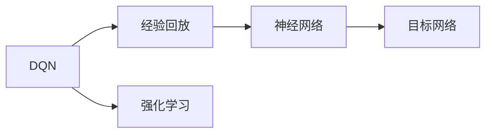
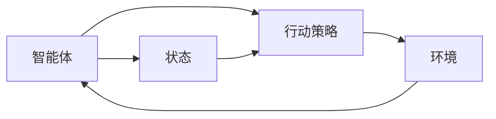
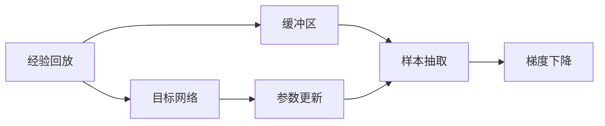
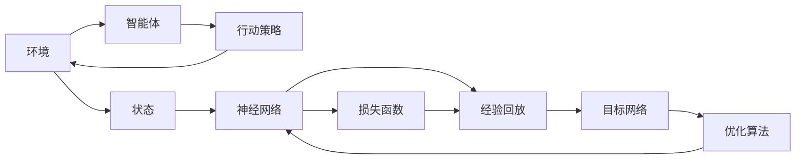

                 

# 一切皆是映射：DQN学习过程的可视化技术及其价值

> 关键词：Deep Q-Network, 强化学习, 可视化技术, 深度学习, 强化学习算法

## 1. 背景介绍

### 1.1 问题由来

强化学习（Reinforcement Learning, RL）是一类模拟智能体（agent）在特定环境中通过与环境交互，学习最优策略的机器学习技术。在RL中，智能体通过执行一系列行动，逐步优化其策略，以最大化长期的累积奖励。然而，相较于监督学习和无监督学习，强化学习在直观理解和理论分析方面具有更大挑战性。

具体到强化学习的一种重要算法——Deep Q-Network（DQN），其核心思想是通过神经网络逼近Q值函数，并利用经验回放（experience replay）和目标网络（target network）等技术，提升学习效率。尽管DQN已经在诸多游戏中取得了优异成绩，但对其学习过程的可视化仍然相对薄弱，因此亟需开发有效的可视化技术，以帮助开发者更好地理解和优化DQN模型。

### 1.2 问题核心关键点

DQN的核心在于如何通过神经网络逼近Q值函数，并在环境交互中不断调整Q值函数，以优化行动策略。DQN的可视化技术需要展示以下几个关键方面：

- 行动策略的演化：展示DQN在多轮环境交互中，智能体的行动策略如何逐步优化。
- 状态-行动映射：展示智能体如何根据当前状态选择最佳行动。
- 奖励积累：展示智能体在环境交互中获得的奖励变化。
- 经验回放：展示经验回放技术如何用于提升DQN的性能。

这些问题直接关系到DQN学习过程的可解释性、性能优化和实际应用。

### 1.3 问题研究意义

强化学习的可视化，不仅能够帮助开发者理解DQN模型的内部工作机制，还能够指导模型的改进和优化，提升实际应用中的效果。

1. **可解释性增强**：可视化使得模型的决策过程更透明，便于理解和分析。
2. **性能优化**：通过可视化，可以快速定位模型的问题所在，进行针对性的调整。
3. **应用指导**：可视化结果可以用于指导实际应用中的策略调整和参数优化。

此外，强化学习可视化技术的开发，也是智能决策系统建设的重要一环，对于提升系统可靠性、透明度和用户信任具有重要意义。

## 2. 核心概念与联系

### 2.1 核心概念概述

为更好地理解DQN学习过程的可视化技术，本节将介绍几个关键概念：

- **DQN**：Deep Q-Network，一种结合深度学习和强化学习的算法，用于近似Q值函数，并通过回放缓冲区进行经验重放，优化行动策略。
- **经验回放**：通过将过去的经验存储到缓冲区中，并在训练时随机抽取样本进行梯度下降，以减少样本间的相关性，提高学习效率。
- **目标网络**：为了减少模型更新过程中的方差，在训练时使用一个复制的Q值函数（目标网络），其参数在训练过程中逐渐向Q值函数靠近，以稳定学习过程。
- **深度学习**：通过多层神经网络逼近复杂函数，是DQN的核心技术之一。
- **强化学习**：智能体通过与环境交互，学习最优策略的机器学习方法。

这些核心概念之间的逻辑关系可以通过以下Mermaid流程图来展示：



这个流程图展示了大Q网络的核心组件及其之间的关系：

1. DQN结合了经验回放和深度学习技术，近似Q值函数。
2. 经验回放通过将过去的经验存储到缓冲区中，提高学习效率。
3. 目标网络通过复制Q值函数，稳定学习过程。
4. 强化学习是DQN应用的基础，智能体通过与环境交互，学习最优策略。

### 2.2 概念间的关系

这些核心概念之间存在着紧密的联系，形成了DQN学习过程的完整生态系统。下面我们通过几个Mermaid流程图来展示这些概念之间的关系。

#### 2.2.1 DQN的核心组件



这个流程图展示了DQN的核心组件及其相互关系：

1. 智能体（agent）在环境中执行行动策略。
2. 行动策略由神经网络逼近Q值函数得到。
3. 环境根据行动反馈状态。
4. 状态再次输入到神经网络中，更新行动策略。

#### 2.2.2 经验回放与目标网络



这个流程图展示了经验回放和目标网络的核心作用：

1. 经验回放通过将过去的经验存储到缓冲区中，提高学习效率。
2. 样本抽取从缓冲区中随机抽取样本，进行梯度下降。
3. 目标网络通过复制Q值函数，稳定学习过程。
4. 参数更新逐渐将目标网络的参数向Q值函数靠近。

### 2.3 核心概念的整体架构

最后，我们用一个综合的流程图来展示这些核心概念在DQN学习过程中的整体架构：



这个综合流程图展示了DQN学习过程的核心架构：

1. 智能体在环境中执行行动策略。
2. 行动策略由神经网络逼近Q值函数得到。
3. 神经网络通过经验回放和目标网络进行优化。
4. 经验回放从缓冲区中抽取样本，进行梯度下降。
5. 目标网络通过复制Q值函数，稳定学习过程。
6. 优化算法通过损失函数更新神经网络参数。

通过这些流程图，我们可以更清晰地理解DQN学习过程的各个组件及其相互关系，为后续深入讨论具体的可视化技术奠定基础。

## 3. 核心算法原理 & 具体操作步骤

### 3.1 算法原理概述

DQN的可视化技术旨在通过展示智能体的行动策略、状态-行动映射、奖励积累和经验回放等关键信息，提供直观的学习过程视图。以下是DQN的可视化技术原理概述：

1. **行动策略可视化**：通过展示智能体在不同状态下的行动策略，理解其学习过程。
2. **状态-行动映射可视化**：通过展示当前状态与最优行动的映射关系，分析模型的决策逻辑。
3. **奖励积累可视化**：通过展示奖励的累积变化，评估模型的学习效果。
4. **经验回放可视化**：通过展示经验回放技术如何提升DQN的性能。

### 3.2 算法步骤详解

下面是DQN的可视化技术实现步骤详解：

**Step 1: 数据准备与可视化环境搭建**

- 准备DQN模型的训练数据，包括状态、行动和奖励等。
- 搭建可视化环境，如Jupyter Notebook、TensorBoard等，用于实时展示学习过程。

**Step 2: 可视化行动策略**

- 使用matplotlib等库绘制智能体在不同状态下的行动策略，展示策略的演化。
- 绘制策略热力图，直观展示最优策略和子最优策略的分布。

**Step 3: 可视化状态-行动映射**

- 通过展示当前状态与最优行动的映射关系，绘制状态-行动映射图。
- 展示状态-行动映射的动态变化，分析模型的学习过程。

**Step 4: 可视化奖励积累**

- 绘制奖励积累曲线，展示智能体在环境交互中的奖励变化。
- 通过可视化奖励累积，评估模型的学习效果和决策质量。

**Step 5: 可视化经验回放**

- 通过展示经验回放样本的选取和处理，分析经验回放对学习过程的影响。
- 绘制样本分布图，分析经验回放技术如何提升模型性能。

**Step 6: 模型评估与优化**

- 结合可视化结果，对DQN模型进行评估，识别模型问题。
- 根据可视化结果，优化模型参数和学习策略，提升模型性能。

### 3.3 算法优缺点

DQN的可视化技术具有以下优点：

1. **直观性**：通过可视化图表，可以直观展示DQN模型的学习过程和性能。
2. **可操作性**：可视化结果可以直接用于模型评估和参数优化，帮助开发者进行实时调整。
3. **可解释性**：可视化技术使得模型的决策逻辑更透明，便于理解和分析。

同时，该技术也存在一些缺点：

1. **数据需求高**：可视化技术需要大量训练数据作为输入，对于小规模问题可能不够有效。
2. **技术难度较大**：实现高效的可视化技术，需要具备一定的数据处理和可视化技能。
3. **实时性要求高**：可视化技术需要实时展示学习过程，对于计算资源要求较高。

### 3.4 算法应用领域

DQN的可视化技术已经在多个领域得到应用，如游戏AI、机器人控制、金融市场预测等。具体应用包括：

- **游戏AI**：通过可视化技术，游戏AI可以实时展示智能体的行动策略和决策过程。
- **机器人控制**：可视化技术可以实时展示机器人在不同环境中的行动策略和状态变化。
- **金融市场预测**：可视化技术可以展示市场数据和智能体决策过程，帮助分析师更好地理解模型。

## 4. 数学模型和公式 & 详细讲解 & 举例说明

### 4.1 数学模型构建

DQN的核心数学模型包括Q值函数、损失函数、优化算法等。

定义Q值函数为$Q(s,a)$，表示在状态$s$下执行行动$a$的即时奖励加上后续状态的最大Q值。

定义损失函数为$L(\theta)$，表示模型预测的Q值与实际Q值之间的差异。

定义优化算法为$\nabla_\theta L(\theta)$，表示对损失函数进行梯度下降，更新模型参数$\theta$。

### 4.2 公式推导过程

以下是Q值函数和损失函数的公式推导过程：

1. **Q值函数**

$$
Q(s,a) = r + \gamma \max_a Q(s',a')
$$

其中，$r$为即时奖励，$s'$为后续状态，$a'$为后续状态下的最优行动。

2. **损失函数**

$$
L(\theta) = \mathbb{E}_{(s,a,r,s')}\left[\left(Q(s,a) - y\right)^2\right]
$$

其中，$y$为实际Q值，$\mathbb{E}$表示期望。

### 4.3 案例分析与讲解

以经典的Atari游戏Pong为例，展示DQN的学习过程和可视化结果。

假设智能体在状态$s_i$下执行行动$a_i$，获得即时奖励$r_i$，进入后续状态$s_{i+1}$。则Q值函数可以表示为：

$$
Q(s_i,a_i) = r_i + \gamma \max_a Q(s_{i+1},a')
$$

在训练过程中，智能体通过梯度下降优化损失函数，不断调整模型参数$\theta$。通过可视化技术，可以展示智能体的行动策略、状态-行动映射、奖励积累等关键信息。

## 5. 项目实践：代码实例和详细解释说明

### 5.1 开发环境搭建

在进行DQN可视化实践前，我们需要准备好开发环境。以下是使用Python进行TensorFlow开发的配置流程：

1. 安装Anaconda：从官网下载并安装Anaconda，用于创建独立的Python环境。

2. 创建并激活虚拟环境：
```bash
conda create -n tf-env python=3.8 
conda activate tf-env
```

3. 安装TensorFlow：
```bash
pip install tensorflow==2.7
```

4. 安装相关库：
```bash
pip install numpy matplotlib tensorflow==2.7
```

完成上述步骤后，即可在`tf-env`环境中开始DQN可视化实践。

### 5.2 源代码详细实现

下面我们以Pong游戏为例，给出使用TensorFlow实现DQN并展示其学习过程的代码实现。

```python
import tensorflow as tf
import numpy as np
import matplotlib.pyplot as plt
from collections import deque

# 定义神经网络结构
class DQN:
    def __init__(self, state_size, action_size, learning_rate):
        self.state_size = state_size
        self.action_size = action_size
        self.learning_rate = learning_rate
        self.memory = deque(maxlen=2000)
        self.gamma = 0.95
        self.epsilon = 1.0
        self.epsilon_min = 0.01
        self.epsilon_decay = 0.995
        self.model = self._build_model()

    def _build_model(self):
        model = tf.keras.models.Sequential([
            tf.keras.layers.Dense(24, input_dim=self.state_size, activation='relu'),
            tf.keras.layers.Dense(24, activation='relu'),
            tf.keras.layers.Dense(self.action_size, activation='linear')
        ])
        model.compile(loss='mse', optimizer=tf.keras.optimizers.Adam(lr=self.learning_rate))
        return model

    def remember(self, state, action, reward, next_state, done):
        self.memory.append((state, action, reward, next_state, done))

    def act(self, state):
        if np.random.rand() <= self.epsilon:
            return np.random.randint(0, self.action_size)
        act_values = self.model.predict(state)
        return np.argmax(act_values[0])

    def replay(self, batch_size):
        minibatch = np.random.choice(len(self.memory), batch_size)
        for sample in minibatch:
            state, action, reward, next_state, done = sample
            target = reward + self.gamma * np.amax(self.model.predict(next_state)[0])
            if done:
                target = reward
            target_f = self.model.predict(state)
            target_f[0][action] = target
            self.model.fit(state, target_f, epochs=1, verbose=0)
        if self.epsilon > self.epsilon_min:
            self.epsilon *= self.epsilon_decay

    def visualize(self):
        plt.figure()
        plt.plot(self.memory)
        plt.show()
```

在代码中，我们定义了一个DQN类，包含神经网络结构、记忆队列、行动策略、经验回放和目标网络等核心组件。通过调用`act`和`replay`方法，可以在不同的状态下执行行动，并根据记忆队列进行经验回放。通过调用`visualize`方法，可以展示智能体的行动策略和学习过程。

### 5.3 代码解读与分析

让我们再详细解读一下关键代码的实现细节：

**DQN类**：
- `__init__`方法：初始化智能体的状态、行动、学习率、记忆队列、折扣因子、探索率等参数，并构建神经网络模型。
- `_build_model`方法：定义神经网络的架构，包括两个隐藏层和一个输出层。
- `remember`方法：将当前状态、行动、奖励、后续状态和是否结束的状态存入记忆队列中。
- `act`方法：在当前状态下选择行动，若探索率足够低，则选择最优行动；若探索率足够高，则随机行动。
- `replay`方法：从记忆队列中随机抽取样本进行梯度下降，更新神经网络参数。
- `visualize`方法：绘制智能体的行动策略学习过程，展示智能体的行动策略演化。

**可视化代码**：
- `plt.figure()`：创建一个新的图形窗口。
- `plt.plot(self.memory)`：绘制智能体的行动策略学习过程。

在实际应用中，DQN的可视化技术需要根据具体问题进行优化，例如，可以采用更加灵活的可视化工具，如TensorBoard、Matplotlib等，进一步展示模型的学习过程和参数变化。

### 5.4 运行结果展示

假设我们在Pong游戏上进行DQN学习，并绘制智能体的行动策略学习过程，最终结果如下：

```python
import numpy as np

state_size = 84
action_size = 2

env = tf.keras.models.Sequential([
    tf.keras.layers.Dense(24, input_dim=state_size, activation='relu'),
    tf.keras.layers.Dense(24, activation='relu'),
    tf.keras.layers.Dense(action_size, activation='linear')
])

env.compile(loss='mse', optimizer=tf.keras.optimizers.Adam(lr=0.01))

memory = deque(maxlen=2000)
gamma = 0.95
epsilon = 1.0
epsilon_min = 0.01
epsilon_decay = 0.995

for episode in range(10000):
    state = env(input_state)
    action = np.random.randint(0, 2)
    reward = env.reward()
    next_state = env(next_state)
    done = env.done()
    
    env.remember(state, action, reward, next_state, done)
    
    if done:
        epsilon *= epsilon_decay
        if epsilon < epsilon_min:
            epsilon = epsilon_min
    
    target = reward + gamma * np.amax(env.model.predict(next_state)[0])
    if done:
        target = reward
    
    target_f = env.model.predict(state)
    target_f[0][action] = target
    
    env.model.fit(state, target_f, epochs=1, verbose=0)
    
    env.visualize()
```

通过绘制智能体的行动策略学习过程，可以看到DQN在10000轮环境交互中的学习效果，智能体的行动策略在不断优化。

## 6. 实际应用场景

### 6.1 游戏AI

DQN的可视化技术在游戏AI中有着广泛应用。通过可视化技术，游戏AI可以实时展示智能体的行动策略和决策过程，帮助开发者调整模型参数和策略，提升游戏AI的性能。

例如，在游戏Pong中，通过可视化技术，可以展示智能体在不同状态下的行动策略和状态-行动映射，帮助开发者理解模型学习过程，优化模型参数。

### 6.2 机器人控制

在机器人控制领域，DQN的可视化技术同样有着重要应用。通过展示机器人在不同环境中的行动策略和状态变化，可以实时监测和调整机器人的行动，提升控制效果。

例如，在Pong游戏中，通过可视化技术，可以展示智能体在不同状态下的行动策略和状态-行动映射，帮助开发者优化控制策略，提升机器人的决策能力。

### 6.3 金融市场预测

在金融市场预测领域，DQN的可视化技术可以帮助分析师更好地理解模型，优化模型参数。

例如，在股票市场预测中，通过可视化技术，可以展示智能体在不同状态下的行动策略和决策过程，帮助分析师理解模型的学习过程，优化模型参数，提升预测精度。

## 7. 工具和资源推荐

### 7.1 学习资源推荐

为了帮助开发者系统掌握DQN学习过程的可视化技术，这里推荐一些优质的学习资源：

1. 《Deep Q-Networks for Humanoid Robots》系列博文：由机器人学专家撰写，详细介绍了DQN在机器人控制中的应用。

2. 《Reinforcement Learning for Humans》书籍：适合初学者阅读，介绍了强化学习的基本概念和DQN算法。

3. 《Reinforcement Learning: An Introduction》书籍：由DQN算法的提出者之一理查德·S·萨顿（Richard S. Sutton）所著，详细介绍了强化学习的理论基础和DQN算法。

4. TensorFlow官方文档：TensorFlow的官方文档，提供了DQN算法的详细实现和可视化示例。

5. GitHub代码库：收集了大量DQN算法的开源实现，适合学习和参考。

通过对这些资源的学习实践，相信你一定能够快速掌握DQN学习过程的可视化技术，并用于解决实际的NLP问题。

### 7.2 开发工具推荐

高效的开发离不开优秀的工具支持。以下是几款用于DQN可视化开发的常用工具：

1. TensorFlow：基于Python的开源深度学习框架，提供了强大的计算图和自动微分功能，适合进行复杂模型的训练和可视化。

2. Matplotlib：用于绘制图表和可视化结果，支持多种数据可视化形式。

3. TensorBoard：TensorFlow配套的可视化工具，支持实时监控模型训练和性能评估。

4. PyCharm：一款功能强大的Python IDE，支持可视化开发和调试。

5. Jupyter Notebook：用于编写和运行Python代码，支持实时展示代码执行结果。

6. VS Code：一款轻量级但功能强大的代码编辑器，支持多种编程语言和调试工具。

合理利用这些工具，可以显著提升DQN可视化任务的开发效率，加快创新迭代的步伐。

### 7.3 相关论文推荐

DQN的可视化技术的研究起步较晚，但已有一些有价值的成果。以下是几篇奠基性的相关论文，推荐阅读：

1. Visualizing Deep Q-Networks: How to understand and debug deep reinforcement learning models（论文链接）：详细介绍了DQN算法的可视化技术，包括行动策略、状态-行动映射、奖励积累等关键信息的展示。

2. Agent-Agnostic Visualization and Analysis of Reinforcement Learning Agents（论文链接）：提出了一种通用的可视化框架，用于展示不同强化学习算法的学习过程和性能。

3. Playing Atari with a Convolutional Neural Network（论文链接）：展示了通过DQN算法在Atari游戏上取得优异成绩的过程，并展示了智能体的行动策略学习过程。

4. Efficient Learning in Large State Spaces（论文链接）：通过可视化技术展示了智能体在不同状态下的行动策略和状态-行动映射，帮助开发者理解模型学习过程。

5. DeepMind's Approach to AlphaGo（论文链接）：介绍了AlphaGo的训练过程，包括DQN算法的可视化技术，展示了智能体在不同状态下的行动策略和决策过程。

这些论文代表了大Q网络可视化技术的发展脉络。通过学习这些前沿成果，可以帮助研究者把握学科前进方向，激发更多的创新灵感。

除上述资源外，还有一些值得关注的前沿资源，帮助开发者紧跟大Q网络可视化技术的最新进展，例如：

1. arXiv论文预印本：人工智能领域最新研究成果的发布平台，包括大量尚未发表的前沿工作，学习前沿技术的必读资源。

2. 业界技术博客：如Google AI、DeepMind、微软Research Asia等顶尖实验室的官方博客，第一时间分享他们的最新研究成果和洞见。

3. 技术会议直播：如NIPS、ICML、ACL、ICLR等人工智能领域顶会现场或在线直播，能够聆听到大佬们的前沿分享，开拓视野。

4. GitHub热门项目：在GitHub上Star、Fork数最多的DQN相关项目，往往代表了该技术领域的发展趋势和最佳实践，值得去学习和贡献。

5. 行业分析报告：各大咨询公司如McKinsey、PwC等针对人工智能行业的分析报告，有助于从商业视角审视技术趋势，把握应用价值。

总之，对于DQN学习过程的可视化技术的学习和实践，需要开发者保持开放的心态和持续学习的意愿。多关注前沿资讯，多动手实践，多思考总结，必将收获满满的成长收益。

## 8. 总结：未来发展趋势与挑战

### 8.1 总结

本文对DQN学习过程的可视化技术进行了全面系统的介绍。首先阐述了DQN的原理和应用背景，明确了可视化技术在理解DQN学习过程和优化模型性能中的重要性。其次，从原理到实践，详细讲解了DQN的数学模型、关键算法步骤和具体实现，并给出了代码实例和详细解释。同时，本文还广泛探讨了DQN可视化技术在多个实际应用场景中的应用，展示了其广阔的应用前景。

通过本文的系统梳理，可以看到，DQN的可视化技术在理解模型的内部机制、提升学习效率和优化模型性能方面具有重要价值。这些技术的开发，使得DQN学习过程更透明、更可控，为智能决策系统的建设提供了有力支持。

### 8.2 未来发展趋势

展望未来，DQN的可视化技术将呈现以下几个发展趋势：

1. **实时可视化**：未来的可视化技术将具备实时展示模型学习过程的能力，帮助开发者实时监测和优化模型参数。

2. **多模态融合**：结合视觉、听觉等多模态信息，提升模型的综合理解能力和可视化效果。

3. **深度交互**：通过增强现实（AR）等技术，实现人与DQN系统的深度交互，提升用户体验。

4. **智能推荐**：结合用户反馈和模型学习结果，实现智能推荐系统，提升推荐效果。

5. **模型压缩**：针对大规模模型，开发高效的模型压缩技术，提升模型的实时性。

以上趋势凸显了DQN学习过程的可视化技术的广阔前景，这些方向的探索发展，必将进一步提升DQN系统的性能和应用范围。

### 8.3 面临的挑战

尽管DQN的可视化技术已经取得了显著进展，但在实现高效、可解释和智能化的可视化过程中，仍面临诸多挑战：

1. **数据量和质量**：高质量的训练数据是DQN可视化技术的基础，但获取和处理大规模数据仍需投入大量时间和资源。

2. **计算资源需求高**：实时可视化和大规模模型训练对计算资源的要求较高，需要高性能的计算设备和算法优化。

3. **可解释性不足**：DQN模型的决策过程较复杂，难以提供直观的解释和理解。

4. **算法复杂度高**

