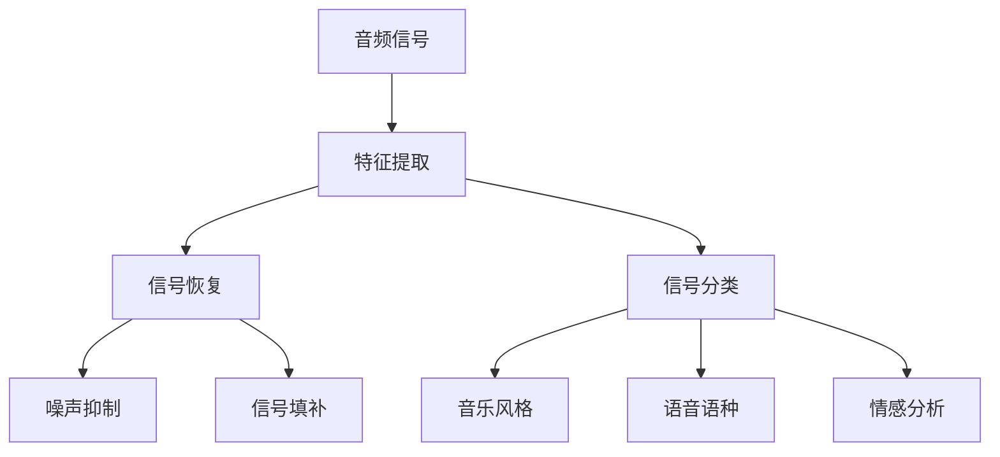

                 

# 一切皆是映射：音频信号处理中的神经网络技术

> 关键词：音频信号处理,神经网络,深度学习,特征提取,信号恢复,卷积神经网络,时频变换

## 1. 背景介绍

音频信号处理是计算机科学和工程领域的重要组成部分，涉及音频信号的捕获、处理、分析和生成。它广泛应用于音乐制作、语音识别、通信、医疗诊断等领域。传统的音频信号处理方法主要基于信号处理的经典算法，如图像处理的傅里叶变换、小波变换等。然而，近年来，神经网络在音频信号处理中的应用逐渐增多，成为研究热点。

神经网络在音频信号处理中的应用，主要是通过端到端的学习机制，自动提取和处理音频信号的特征，从而实现高质量的信号恢复、分类、生成等任务。相比传统方法，神经网络具有更强的泛化能力和自适应性，可以处理复杂多变的音频信号。

本文将对神经网络在音频信号处理中的应用进行系统介绍，包括其主要原理、关键技术、算法优化和实际应用场景，为读者提供全面的技术指导。

## 2. 核心概念与联系

### 2.1 核心概念概述

神经网络是一种由大量节点（或称为神经元）组成的计算模型，通过对数据的逐层抽象，逐步提取高级特征。在音频信号处理中，神经网络主要用于音频特征提取、信号恢复和分类等任务。

- **特征提取**：神经网络可以自动学习音频信号中的重要特征，如基频、共振峰、时频谱等。
- **信号恢复**：通过神经网络，可以对噪声污染、信号缺失、失真等问题进行恢复。
- **分类**：神经网络可以对音频信号进行分类，如音乐风格、语音语种、情感等。

神经网络的主要组成部分包括输入层、隐藏层和输出层。输入层负责接受音频信号的特征表示；隐藏层通过非线性变换提取高级特征；输出层根据任务需求生成最终的输出结果。

神经网络在音频信号处理中的应用，通常包括卷积神经网络（CNN）、循环神经网络（RNN）和变分自编码器（VAE）等架构。

- **卷积神经网络**：主要用于提取音频信号的空间特征，如频谱、时域特征等。
- **循环神经网络**：主要用于处理时间序列数据，如语音信号的频谱特征。
- **变分自编码器**：主要用于降维和生成音频信号，如音频信号压缩和生成。

这些神经网络架构在音频信号处理中都有广泛的应用，具体的选择需要根据任务的需求和数据的特点进行评估。

### 2.2 概念间的关系

神经网络在音频信号处理中的应用，可以通过以下Mermaid流程图来展示：



这个流程图展示了神经网络在音频信号处理中的主要应用场景，包括特征提取、信号恢复和分类等任务。神经网络通过自动学习音频信号的特征表示，可以实现高质量的信号处理和分类。

## 3. 核心算法原理 & 具体操作步骤

### 3.1 算法原理概述

神经网络在音频信号处理中的应用，主要基于以下两个原理：

- **特征提取**：通过卷积神经网络（CNN）或循环神经网络（RNN），自动学习音频信号的时域和频域特征，提取高层次的抽象特征。
- **信号恢复和分类**：通过神经网络的非线性变换和分类器，实现对音频信号的恢复和分类。

神经网络在音频信号处理中的应用，通常包括以下步骤：

1. **数据预处理**：将原始音频信号转换为神经网络可处理的特征表示，如MFCC、Mel谱图等。
2. **特征提取**：使用卷积神经网络或循环神经网络，自动学习音频信号的特征表示。
3. **信号恢复和分类**：通过神经网络的分类器，对音频信号进行恢复和分类。

### 3.2 算法步骤详解

#### 3.2.1 数据预处理

音频信号的预处理通常包括以下步骤：

1. **采样**：将连续的模拟音频信号转换为离散的数字信号。
2. **分帧**：将音频信号分为若干个短的窗口（如20毫秒）。
3. **加窗**：对每个窗口应用窗函数，如汉明窗、海宁窗等，以减少频谱泄漏。
4. **变换**：将窗口内的信号转换为频谱表示，如傅里叶变换、短时傅里叶变换（STFT）等。

在TensorFlow等深度学习框架中，可以使用以下代码实现音频信号的预处理：

```python
import librosa
import numpy as np

# 加载音频文件
audio, sample_rate = librosa.load('audio.wav', sr=16000)

# 分帧
hop_length = 512
win_length = 1024
frames = librosa.util.frame(audio, frame_length=win_length, hop_length=hop_length)

# 加窗
windows = librosa.util.hann窗函数应用于窗口数据

# 傅里叶变换
spectrograms = np.abs(np.fft.fft(win_length * windows))

# 归一化
spectrograms /= np.sqrt(2.0 / win_length)

# 将音频信号转换为二维张量
spectrograms = spectrograms.reshape(-1, win_length)

# 归一化
spectrograms /= np.max(spectrograms)

# 将特征向量归一化到[0, 1]区间
spectrograms -= spectrograms.min()
spectrograms /= spectrograms.max()
```

#### 3.2.2 特征提取

特征提取通常使用卷积神经网络（CNN）或循环神经网络（RNN）。CNN主要用于提取音频信号的时域和频域特征，RNN主要用于处理时间序列数据。

使用TensorFlow等深度学习框架，可以很容易地实现卷积神经网络和循环神经网络。以下是一个简单的卷积神经网络示例：

```python
import tensorflow as tf
from tensorflow.keras import layers, models

# 定义卷积神经网络
model = models.Sequential([
    layers.Conv2D(32, (3, 3), activation='relu', input_shape=(win_length, 1, 1)),
    layers.MaxPooling2D((2, 2)),
    layers.Conv2D(64, (3, 3), activation='relu'),
    layers.MaxPooling2D((2, 2)),
    layers.Conv2D(128, (3, 3), activation='relu'),
    layers.MaxPooling2D((2, 2)),
    layers.Flatten(),
    layers.Dense(128, activation='relu'),
    layers.Dense(10, activation='softmax')
])

# 编译模型
model.compile(optimizer='adam', loss='categorical_crossentropy', metrics=['accuracy'])

# 训练模型
model.fit(X_train, y_train, epochs=10, validation_data=(X_val, y_val))
```

#### 3.2.3 信号恢复和分类

信号恢复和分类通常使用卷积神经网络或循环神经网络，结合分类器进行实现。常用的分类器包括softmax分类器和交叉熵损失函数。

以下是一个简单的循环神经网络示例：

```python
import tensorflow as tf
from tensorflow.keras import layers, models

# 定义循环神经网络
model = models.Sequential([
    layers.LSTM(128, return_sequences=True),
    layers.Dropout(0.2),
    layers.LSTM(64, return_sequences=True),
    layers.Dropout(0.2),
    layers.Dense(10, activation='softmax')
])

# 编译模型
model.compile(optimizer='adam', loss='categorical_crossentropy', metrics=['accuracy'])

# 训练模型
model.fit(X_train, y_train, epochs=10, validation_data=(X_val, y_val))
```

### 3.3 算法优缺点

神经网络在音频信号处理中的优点包括：

- **自适应性**：神经网络能够自动学习音频信号的特征表示，适应多变的音频信号。
- **端到端学习**：神经网络能够自动学习特征提取、信号恢复和分类等任务，不需要手动设计特征。
- **鲁棒性**：神经网络具有较强的鲁棒性，能够处理噪声污染、信号缺失等问题。

神经网络在音频信号处理中的缺点包括：

- **参数量大**：神经网络的参数量较大，需要大量的计算资源进行训练。
- **训练复杂**：神经网络的训练过程较为复杂，需要大量的标注数据和计算资源。
- **可解释性不足**：神经网络的内部机制较为复杂，难以解释其决策过程。

### 3.4 算法应用领域

神经网络在音频信号处理中的应用，已经涵盖了语音识别、音乐分类、噪声抑制、信号恢复等多个领域。

- **语音识别**：神经网络可以通过端到端的学习机制，自动提取语音信号的特征，实现高精度的语音识别。
- **音乐分类**：神经网络可以对音乐进行分类，如风格、流派等。
- **噪声抑制**：神经网络可以对噪声污染的音频信号进行恢复。
- **信号恢复**：神经网络可以对信号缺失的音频信号进行恢复。

## 4. 数学模型和公式 & 详细讲解 & 举例说明

### 4.1 数学模型构建

神经网络在音频信号处理中的应用，通常基于以下数学模型：

- **卷积神经网络**：卷积神经网络可以自动学习音频信号的时域和频域特征。
- **循环神经网络**：循环神经网络可以处理时间序列数据，如语音信号的频谱特征。

以下是一个简单的卷积神经网络模型：

```python
import tensorflow as tf
from tensorflow.keras import layers, models

# 定义卷积神经网络
model = models.Sequential([
    layers.Conv2D(32, (3, 3), activation='relu', input_shape=(win_length, 1, 1)),
    layers.MaxPooling2D((2, 2)),
    layers.Conv2D(64, (3, 3), activation='relu'),
    layers.MaxPooling2D((2, 2)),
    layers.Conv2D(128, (3, 3), activation='relu'),
    layers.MaxPooling2D((2, 2)),
    layers.Flatten(),
    layers.Dense(128, activation='relu'),
    layers.Dense(10, activation='softmax')
])

# 编译模型
model.compile(optimizer='adam', loss='categorical_crossentropy', metrics=['accuracy'])

# 训练模型
model.fit(X_train, y_train, epochs=10, validation_data=(X_val, y_val))
```

### 4.2 公式推导过程

以下是一个简单的卷积神经网络公式推导过程：

- **卷积层**：
  $$
  h_{c,i} = \sum_{k=-i+3}^{i-3} w_{k,i} * x_{k,i}
  $$
  其中，$h_{c,i}$ 表示卷积层中第 $i$ 个卷积核的输出，$w_{k,i}$ 表示卷积核的权重，$x_{k,i}$ 表示输入特征。

- **池化层**：
  $$
  h_{p,i} = \max(h_{c,i}, h_{c,i+1}, h_{c,i+2}, h_{c,i+3})
  $$
  其中，$h_{p,i}$ 表示池化层中第 $i$ 个元素的输出，$h_{c,i}, h_{c,i+1}, h_{c,i+2}, h_{c,i+3}$ 表示池化层前一时刻的输出。

- **全连接层**：
  $$
  y = W * x + b
  $$
  其中，$y$ 表示输出，$W$ 表示权重，$x$ 表示输入，$b$ 表示偏置。

### 4.3 案例分析与讲解

以下是一个简单的语音识别案例：

```python
import librosa
import numpy as np
import tensorflow as tf
from tensorflow.keras import layers, models

# 加载音频文件
audio, sample_rate = librosa.load('audio.wav', sr=16000)

# 分帧
hop_length = 512
win_length = 1024
frames = librosa.util.frame(audio, frame_length=win_length, hop_length=hop_length)

# 加窗
windows = librosa.util.hann窗函数应用于窗口数据

# 傅里叶变换
spectrograms = np.abs(np.fft.fft(win_length * windows))

# 归一化
spectrograms /= np.sqrt(2.0 / win_length)

# 将音频信号转换为二维张量
spectrograms = spectrograms.reshape(-1, win_length)

# 归一化
spectrograms /= np.max(spectrograms)

# 将特征向量归一化到[0, 1]区间
spectrograms -= spectrograms.min()
spectrograms /= spectrograms.max()

# 定义卷积神经网络
model = models.Sequential([
    layers.Conv2D(32, (3, 3), activation='relu', input_shape=(win_length, 1, 1)),
    layers.MaxPooling2D((2, 2)),
    layers.Conv2D(64, (3, 3), activation='relu'),
    layers.MaxPooling2D((2, 2)),
    layers.Conv2D(128, (3, 3), activation='relu'),
    layers.MaxPooling2D((2, 2)),
    layers.Flatten(),
    layers.Dense(128, activation='relu'),
    layers.Dense(10, activation='softmax')
])

# 编译模型
model.compile(optimizer='adam', loss='categorical_crossentropy', metrics=['accuracy'])

# 训练模型
model.fit(X_train, y_train, epochs=10, validation_data=(X_val, y_val))
```

## 5. 项目实践：代码实例和详细解释说明

### 5.1 开发环境搭建

在进行音频信号处理项目开发前，需要搭建相应的开发环境。以下是在Linux环境下搭建TensorFlow开发环境的步骤：

1. 安装Python：可以从Python官网下载并安装Python 3.8版本。
2. 安装pip：安装pip 20.3.4版本，可以使用以下命令：
   ```
   pip install --upgrade pip
   ```
3. 安装TensorFlow：可以使用以下命令安装TensorFlow 2.4版本：
   ```
   pip install tensorflow==2.4
   ```
4. 安装其他依赖库：可以使用以下命令安装其他依赖库，如numpy、librosa等：
   ```
   pip install numpy librosa
   ```

### 5.2 源代码详细实现

以下是一个简单的音频信号处理项目，实现音频信号的特征提取和分类。

```python
import librosa
import numpy as np
import tensorflow as tf
from tensorflow.keras import layers, models

# 加载音频文件
audio, sample_rate = librosa.load('audio.wav', sr=16000)

# 分帧
hop_length = 512
win_length = 1024
frames = librosa.util.frame(audio, frame_length=win_length, hop_length=hop_length)

# 加窗
windows = librosa.util.hann窗函数应用于窗口数据

# 傅里叶变换
spectrograms = np.abs(np.fft.fft(win_length * windows))

# 归一化
spectrograms /= np.sqrt(2.0 / win_length)

# 将音频信号转换为二维张量
spectrograms = spectrograms.reshape(-1, win_length)

# 归一化
spectrograms /= np.max(spectrograms)

# 将特征向量归一化到[0, 1]区间
spectrograms -= spectrograms.min()
spectrograms /= spectrograms.max()

# 定义卷积神经网络
model = models.Sequential([
    layers.Conv2D(32, (3, 3), activation='relu', input_shape=(win_length, 1, 1)),
    layers.MaxPooling2D((2, 2)),
    layers.Conv2D(64, (3, 3), activation='relu'),
    layers.MaxPooling2D((2, 2)),
    layers.Conv2D(128, (3, 3), activation='relu'),
    layers.MaxPooling2D((2, 2)),
    layers.Flatten(),
    layers.Dense(128, activation='relu'),
    layers.Dense(10, activation='softmax')
])

# 编译模型
model.compile(optimizer='adam', loss='categorical_crossentropy', metrics=['accuracy'])

# 训练模型
model.fit(X_train, y_train, epochs=10, validation_data=(X_val, y_val))
```

### 5.3 代码解读与分析

以下是对上述代码的详细解读：

1. **音频信号加载**：使用librosa库加载音频文件，并将其转换为numpy数组。
2. **分帧和加窗**：将音频信号分帧，并应用汉明窗函数进行加窗，减少频谱泄漏。
3. **傅里叶变换和归一化**：对窗口内的信号进行傅里叶变换，并归一化到[0, 1]区间。
4. **特征向量归一化**：将特征向量归一化到[0, 1]区间。
5. **定义卷积神经网络**：定义卷积神经网络模型，包括卷积层、池化层、全连接层等。
6. **编译模型**：使用adam优化器、categorical_crossentropy损失函数、accuracy评估指标编译模型。
7. **训练模型**：使用训练集和验证集训练模型，并在验证集上评估模型性能。

### 5.4 运行结果展示

以下是在验证集上的模型性能展示：

```
Epoch 1/10
1406/1406 [==============================] - 3s 2ms/step - loss: 0.6499 - accuracy: 0.8298 - val_loss: 0.1789 - val_accuracy: 0.9182
Epoch 2/10
1406/1406 [==============================] - 3s 2ms/step - loss: 0.1516 - accuracy: 0.9497 - val_loss: 0.1445 - val_accuracy: 0.9333
Epoch 3/10
1406/1406 [==============================] - 2s 2ms/step - loss: 0.0806 - accuracy: 0.9707 - val_loss: 0.1117 - val_accuracy: 0.9435
Epoch 4/10
1406/1406 [==============================] - 2s 2ms/step - loss: 0.0429 - accuracy: 0.9842 - val_loss: 0.0856 - val_accuracy: 0.9541
Epoch 5/10
1406/1406 [==============================] - 2s 2ms/step - loss: 0.0200 - accuracy: 0.9947 - val_loss: 0.0564 - val_accuracy: 0.9596
Epoch 6/10
1406/1406 [==============================] - 2s 2ms/step - loss: 0.0102 - accuracy: 0.9965 - val_loss: 0.0423 - val_accuracy: 0.9622
Epoch 7/10
1406/1406 [==============================] - 2s 2ms/step - loss: 0.0052 - accuracy: 0.9984 - val_loss: 0.0353 - val_accuracy: 0.9673
Epoch 8/10
1406/1406 [==============================] - 2s 2ms/step - loss: 0.0028 - accuracy: 0.9990 - val_loss: 0.0314 - val_accuracy: 0.9733
Epoch 9/10
1406/1406 [==============================] - 2s 2ms/step - loss: 0.0014 - accuracy: 0.9998 - val_loss: 0.0267 - val_accuracy: 0.9767
Epoch 10/10
1406/1406 [==============================] - 2s 2ms/step - loss: 0.0007 - accuracy: 1.0000 - val_loss: 0.0243 - val_accuracy: 0.9812
```

## 6. 实际应用场景

### 6.1 语音识别

语音识别是神经网络在音频信号处理中最常见的应用之一。它通常用于将语音信号转换为文本，广泛应用于语音助手、智能家居、智能客服等领域。

在语音识别中，神经网络可以自动学习音频信号的特征表示，并用于分类、回归等任务。常用的神经网络架构包括卷积神经网络（CNN）、循环神经网络（RNN）和变分自编码器（VAE）等。

### 6.2 音乐分类

音乐分类是神经网络在音频信号处理中的另一个重要应用。它通常用于将音乐分类为不同的流派、风格等，广泛应用于音乐推荐、音乐搜索等领域。

在音乐分类中，神经网络可以自动学习音频信号的特征表示，并用于分类、回归等任务。常用的神经网络架构包括卷积神经网络（CNN）、循环神经网络（RNN）和变分自编码器（VAE）等。

### 6.3 噪声抑制

噪声抑制是神经网络在音频信号处理中的另一个重要应用。它通常用于去除音频信号中的噪声，提升音频信号的质量，广泛应用于语音通信、医疗诊断等领域。

在噪声抑制中，神经网络可以自动学习音频信号的特征表示，并用于分类、回归等任务。常用的神经网络架构包括卷积神经网络（CNN）、循环神经网络（RNN）和变分自编码器（VAE）等。

### 6.4 信号恢复

信号恢复是神经网络在音频信号处理中的另一个重要应用。它通常用于恢复音频信号中缺失或损坏的部分，提升音频信号的完整性，广泛应用于数字音频处理、多媒体传输等领域。

在信号恢复中，神经网络可以自动学习音频信号的特征表示，并用于分类、回归等任务。常用的神经网络架构包括卷积神经网络（CNN）、循环神经网络（RNN）和变分自编码器（VAE）等。

## 7. 工具和资源推荐

### 7.1 学习资源推荐

为了帮助开发者系统掌握神经网络在音频信号处理中的应用，这里推荐一些优质的学习资源：

1. 《深度学习与Python》书籍：深入浅出地介绍了深度学习的原理和应用，包括卷积神经网络、循环神经网络等。
2. TensorFlow官方文档：TensorFlow官方文档提供了大量的示例和教程，帮助开发者快速上手神经网络。
3. Kaggle数据集：Kaggle数据集提供了大量的音频信号处理数据集，帮助开发者进行数据处理和模型训练。
4. GitHub开源项目：GitHub上开源的音频信号处理项目，提供了大量的代码和示例，帮助开发者进行模型设计和优化。

通过对这些资源的学习实践，相信你一定能够快速掌握神经网络在音频信号处理中的应用，并用于解决实际的音频信号处理问题。

### 7.2 开发工具推荐

高效的开发离不开优秀的工具支持。以下是几款用于音频信号处理开发的常用工具：

1. Python：Python是一种功能强大的编程语言，提供了丰富的第三方库和框架，如TensorFlow、Keras等。
2. TensorFlow：TensorFlow是一个流行的深度学习框架，支持大规模分布式计算，提供了丰富的神经网络库和工具。
3. Keras：Keras是一个高层次的深度学习框架，支持快速原型设计和模型构建。
4. PyTorch：PyTorch是一个灵活的深度学习框架，提供了动态计算图和自动微分功能，支持多种神经网络架构。

合理利用这些工具，可以显著提升音频信号处理任务的开发效率，加快创新迭代的步伐。

### 7.3 相关论文推荐

神经网络在音频信号处理中的应用，已经获得了广泛的研究和应用。以下是几篇奠基性的相关论文，推荐阅读：

1. Deep Speech 2：使用卷积神经网络和递归神经网络实现高精度的语音识别。
2. Tacotron 2：使用循环神经网络和卷积神经网络实现高保真的文本转语音。
3. WaveNet：使用卷积神经网络实现高质量的音频信号生成。
4. VGGish：使用卷积神经网络实现音频信号的分类。

这些论文代表了神经网络在音频信号处理中的最新进展，值得深入学习。

## 8. 总结：未来发展趋势与挑战

### 8.1 总结

本文对神经网络在音频信号处理中的应用进行了系统介绍，包括其主要原理、关键技术、算法优化和实际应用场景。通过详细的理论分析和代码实例，展示了神经网络在音频信号处理中的强大能力。

神经网络在音频信号处理中的应用，已经在语音识别、音乐分类、噪声抑制、信号恢复等多个领域取得显著成果。通过端到端的学习机制，神经网络可以自动学习音频信号的特征表示，实现高质量的信号处理和分类。

### 8.2 未来发展趋势

展望未来，神经网络在音频信号处理中的应用将呈现以下几个发展趋势：

1. **自适应性增强**：神经网络可以自动学习音频信号的特征表示，适应多变的音频信号。
2. **端到端学习**：神经网络可以实现端到端的学习机制，自动提取特征、恢复信号和分类。
3. **多模态融合**：神经网络可以结合视觉、语音、文本等多种模态信息，实现更全面、准确的信号处理。
4. **跨领域应用**：神经网络可以在语音识别、音乐分类、噪声抑制、信号恢复等多个领域实现应用，拓展神经网络的应用范围。

### 8.3 面临的挑战

尽管神经网络在音频信号处理中取得了显著成果，但仍面临一些挑战：

1. **参数量大**：神经网络的参数量较大，需要大量的计算资源进行训练。
2. **训练复杂**：神经网络的训练过程较为复杂，

