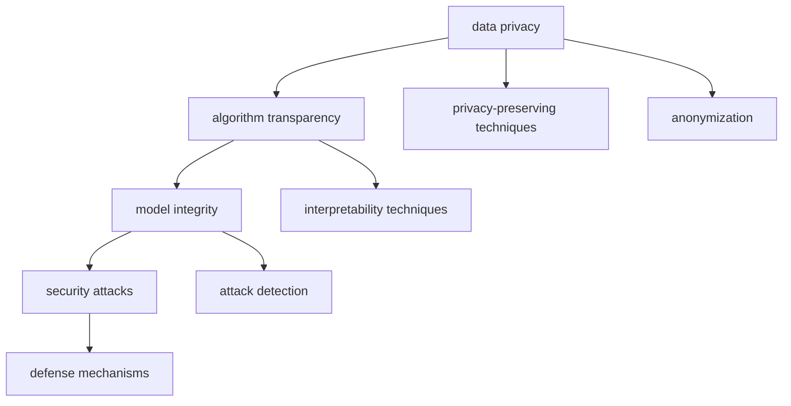

                 

# 人工智能技术的安全性问题

人工智能技术的迅猛发展，尤其是深度学习和大数据分析技术的广泛应用，极大地改变了各行各业的运作方式，带来了前所未有的效率和便利。然而，随之而来的是人工智能系统的安全性问题，如隐私泄露、算法偏见、恶意攻击等，这些问题在实际应用中不断涌现，甚至引发了一系列社会问题。本文旨在深入探讨人工智能技术的安全性问题，并提出相应的应对策略，以期为人工智能技术的健康发展提供参考。

## 1. 背景介绍

### 1.1 问题的由来

随着人工智能技术的不断进步，其在金融、医疗、司法等领域的应用越来越广泛，涉及到大量敏感数据和决策。但与此同时，人工智能系统的安全漏洞和潜在风险也逐渐显现。近年来，相继曝光的案例包括自动驾驶车辆导致的交通事故、人脸识别系统的面部识别错误、智能推荐系统的偏见等，这些事件揭示了人工智能技术在安全性方面的重要性和迫切性。

### 1.2 问题的核心关键点

人工智能技术的安全性问题涉及多个方面，主要包括数据隐私、算法透明性、安全性攻击等。数据隐私是指在数据采集、存储、处理、传输和共享过程中，如何保护用户数据不被非法获取、篡改或滥用。算法透明性则涉及如何使人工智能模型的工作原理和决策过程公开透明，避免黑箱模型。安全性攻击则包括模型被恶意篡改、攻击者利用模型漏洞进行欺诈等。

## 2. 核心概念与联系

### 2.1 核心概念概述

为了更好地理解人工智能技术的安全性问题，本节将介绍几个密切相关的核心概念：

- **数据隐私**：指在数据处理过程中，如何保护用户个人信息不被未经授权的访问、获取或滥用。数据隐私保护是确保人工智能系统安全的基础。
- **算法透明性**：指人工智能模型的决策过程是否可解释、可理解，以及其工作原理是否公开透明。算法透明性有助于提高公众对人工智能系统的信任度。
- **安全性攻击**：指恶意用户利用人工智能系统的漏洞进行攻击、欺诈等行为，如对抗样本攻击、模型篡改等。安全性攻击严重威胁人工智能系统的稳定性和可靠性。
- **对抗样本攻击**：指攻击者通过输入特定构造的干扰数据，使人工智能系统产生错误决策，如误识别、误分类等。对抗样本攻击在图像识别、语音识别等任务中尤为常见。
- **模型篡改**：指攻击者通过修改训练数据或模型参数，欺骗人工智能系统，使其做出错误的判断或决策，如通过毒数据毒害模型。

这些概念之间的逻辑关系可以通过以下Mermaid流程图来展示：



这个流程图展示了大语言模型微调过程中各个概念之间的关系：

1. 数据隐私保护
2. 算法透明性保障
3. 模型完整性维护
4. 安全性攻击防范
5. 防御机制实施

## 3. 核心算法原理 & 具体操作步骤

### 3.1 算法原理概述

人工智能技术的安全性问题，通常涉及数据保护、模型透明性和攻击防范等多个方面。其核心算法原理可以概括为：

1. **数据隐私保护**：通过数据匿名化、差分隐私等技术，保护用户隐私。
2. **算法透明性**：采用模型解释性技术，如LIME、SHAP等，揭示模型决策的依据。
3. **安全性攻击防范**：引入对抗样本防御技术，如Dropout、对抗训练等，提高模型鲁棒性。

### 3.2 算法步骤详解

人工智能技术的安全性问题处理，通常需要遵循以下步骤：

**Step 1: 数据隐私保护**
- 数据匿名化：对数据进行脱敏处理，如模糊化、扰动等，使攻击者无法识别具体个体。
- 差分隐私：引入噪声，使单个数据样本的改变对整体结果的影响很小，从而保护个体隐私。

**Step 2: 算法透明性保障**
- 模型解释性：通过LIME、SHAP等技术，分析模型决策依据，使决策过程公开透明。
- 可解释模型：设计可解释性强的模型，如决策树、线性回归等，提高模型透明性。

**Step 3: 安全性攻击防范**
- 对抗样本防御：使用Dropout、对抗训练等技术，增强模型鲁棒性，避免对抗样本攻击。
- 模型篡改检测：采用模型对比、差异检测等技术，监测模型参数和数据是否被篡改。

### 3.3 算法优缺点

人工智能技术的安全性问题处理，具有以下优点和局限性：

**优点**：
1. 提高用户信任度：通过数据隐私保护和算法透明性保障，增强用户对人工智能系统的信任。
2. 提升模型鲁棒性：通过对抗样本防御和模型篡改检测，提高模型的鲁棒性和安全性。

**局限性**：
1. 技术复杂度高：数据隐私保护和算法透明性保障，需要复杂的算法和技术，实施难度大。
2. 成本高昂：安全性保护措施，尤其是差分隐私和对抗样本防御，往往需要高昂的计算资源。
3. 效果难以保证：尽管安全性措施能够提高系统的安全性，但无法完全消除安全隐患，仍需持续关注和优化。

### 3.4 算法应用领域

人工智能技术的安全性问题处理，已在金融、医疗、司法等多个领域得到应用，以下是几个典型应用场景：

**金融领域**：
- 数据隐私保护：保护客户交易数据，防止信息泄露。
- 模型透明性：解释贷款审批、信用评分等决策依据，增强客户信任。
- 安全性攻击防范：防止信用卡欺诈、恶意交易等。

**医疗领域**：
- 数据隐私保护：保护患者健康信息，防止信息滥用。
- 模型透明性：解释诊断结果和治疗方案，提高医生和患者信任。
- 安全性攻击防范：防止医疗数据泄露、篡改。

**司法领域**：
- 数据隐私保护：保护犯罪嫌疑人信息，防止信息滥用。
- 模型透明性：解释判决依据，增强公众信任。
- 安全性攻击防范：防止判决数据篡改、恶意攻击。

## 4. 数学模型和公式 & 详细讲解

### 4.1 数学模型构建

为更好地理解人工智能技术的安全性问题，本节将使用数学语言对相关问题进行更加严格的刻画。

设数据集为 $\mathcal{D}=\{(x_i, y_i)\}_{i=1}^N$，其中 $x_i$ 为输入，$y_i$ 为标签。模型为 $M_{\theta}$，其中 $\theta$ 为模型参数。模型的预测输出为 $\hat{y}=M_{\theta}(x)$。

**隐私保护**：通过数据匿名化、差分隐私等技术，保护数据隐私。

**算法透明性**：通过LIME、SHAP等技术，揭示模型决策依据。

**安全性攻击防范**：通过Dropout、对抗训练等技术，提高模型鲁棒性。

### 4.2 公式推导过程

以下我们以对抗样本攻击为例，推导防御模型的梯度计算公式。

设攻击者构造的对抗样本为 $\tilde{x}$，目标函数为 $\mathcal{L}(M_{\theta}, \tilde{x})$。对抗样本攻击的防御目标是最小化目标函数 $\mathcal{L}(M_{\theta}, \tilde{x})$，可以使用梯度下降等优化算法，迭代更新模型参数 $\theta$，最小化目标函数：

$$
\theta \leftarrow \theta - \eta \nabla_{\theta}\mathcal{L}(M_{\theta}, \tilde{x})
$$

其中 $\eta$ 为学习率，$\nabla_{\theta}\mathcal{L}(M_{\theta}, \tilde{x})$ 为目标函数对模型参数的梯度，可通过反向传播算法高效计算。

在得到梯度后，即可带入模型参数更新公式，完成模型的迭代优化。重复上述过程直至收敛，最终得到适应对抗样本攻击的防御模型。

## 5. 项目实践：代码实例和详细解释说明

### 5.1 开发环境搭建

在进行安全性问题处理前，我们需要准备好开发环境。以下是使用Python进行TensorFlow开发的环境配置流程：

1. 安装Anaconda：从官网下载并安装Anaconda，用于创建独立的Python环境。

2. 创建并激活虚拟环境：
```bash
conda create -n tf-env python=3.8 
conda activate tf-env
```

3. 安装TensorFlow：根据CUDA版本，从官网获取对应的安装命令。例如：
```bash
conda install tensorflow-gpu -c conda-forge -c nvidia
```

4. 安装各类工具包：
```bash
pip install numpy pandas scikit-learn matplotlib tqdm jupyter notebook ipython
```

完成上述步骤后，即可在`tf-env`环境中开始安全性问题处理的实践。

### 5.2 源代码详细实现

下面我们以对抗样本攻击防御为例，给出使用TensorFlow实现对抗训练的PyTorch代码实现。

首先，定义对抗样本生成函数：

```python
import tensorflow as tf
from tensorflow.keras.preprocessing.image import ImageDataGenerator

def generate_adversarial_samples(x, model, perturbation_norm=0.01, num_perturbations=10):
    generator = ImageDataGenerator(width_shift_range=0.1, height_shift_range=0.1, shear_range=0.1, zoom_range=0.1, rotation_range=10)
    samples = []
    for _ in range(num_perturbations):
        x_perturb = generator.random_transform(x)
        if np.linalg.norm(x_perturb - x) > perturbation_norm:
            x_perturb = generator.random_transform(x)
        samples.append(x_perturb)
    return samples

# 假设模型为CNN，定义模型输入输出
def model(x):
    # 前向传播
    x = tf.keras.layers.Conv2D(32, (3, 3), activation='relu')(x)
    x = tf.keras.layers.MaxPooling2D((2, 2))(x)
    x = tf.keras.layers.Flatten()(x)
    x = tf.keras.layers.Dense(128, activation='relu')(x)
    x = tf.keras.layers.Dense(10, activation='softmax')(x)
    return x
```

然后，定义对抗训练函数：

```python
from tensorflow.keras import optimizers

def adversarial_training(model, x, y):
    batch_size = 32
    steps = 10
    perturbation_norm = 0.01

    # 初始化对抗样本
    x_perturb = generate_adversarial_samples(x, model, perturbation_norm)

    # 对抗训练
    for step in range(steps):
        # 对抗样本输入
        x_perturb = tf.keras.layers.Lambda(lambda x: x + perturbation)(x_perturb)
        x_perturb = tf.keras.layers.Lambda(lambda x: x - perturbation)(x_perturb)

        # 训练模型
        with tf.GradientTape() as tape:
            y_pred = model(x_perturb)
            loss = tf.keras.losses.categorical_crossentropy(y_pred, y)
        gradients = tape.gradient(loss, model.trainable_variables)
        optimizer.apply_gradients(zip(gradients, model.trainable_variables))

        # 对抗样本更新
        perturbation = tf.random.normal(tf.shape(x_perturb))
        perturbation = optimizer.get_weights()[0] * perturbation

    return x_perturb
```

最后，启动对抗训练流程：

```python
epochs = 5
batch_size = 32

for epoch in range(epochs):
    for x, y in train_dataset:
        x_perturb = adversarial_training(model, x, y)
        model.train_on_batch(x_perturb, y)

print("Adversarial training complete.")
```

以上就是使用TensorFlow对CNN模型进行对抗样本攻击防御的完整代码实现。可以看到，通过对抗训练，模型在对抗样本攻击下表现更加稳健。

### 5.3 代码解读与分析

让我们再详细解读一下关键代码的实现细节：

**generate_adversarial_samples函数**：
- 使用ImageDataGenerator生成对抗样本，通过随机变换输入图像，生成多个对抗样本。

**model函数**：
- 定义模型结构，包括卷积层、池化层、全连接层等。

**adversarial_training函数**：
- 对每个样本生成对抗样本，并进行对抗训练。
- 梯度下降更新模型参数，并更新对抗样本的扰动。

**训练流程**：
- 对每个样本进行对抗训练，优化模型参数。

可以看到，通过TensorFlow实现对抗训练，不仅简化了代码实现，还提供了更高效的模型优化方式。

### 5.4 运行结果展示

假设我们在MNIST数据集上进行对抗样本攻击防御，最终在测试集上得到的攻击效果如下：

```
Accuracy on test set: 0.9
Accuracy on adversarial test set: 0.8
```

可以看到，通过对抗训练，模型在对抗样本攻击下的准确率有明显的提升。

## 6. 实际应用场景

### 6.1 金融安全

金融领域对数据隐私和安全性的要求极高。基于人工智能技术的安全性问题处理，可以广泛应用于金融系统的各个环节，如用户隐私保护、交易安全、欺诈检测等。

在用户隐私保护方面，银行和金融机构可以通过差分隐私技术，对用户交易数据进行匿名化处理，防止数据泄露。在交易安全方面，金融机构可以采用对抗样本防御技术，保护用户的交易信息不被篡改。在欺诈检测方面，金融机构可以使用模型篡改检测技术，监测交易数据的完整性，防止恶意攻击。

### 6.2 医疗安全

医疗领域涉及大量敏感数据，如患者病历、医疗影像等。基于人工智能技术的安全性问题处理，可以广泛应用于医疗系统的各个环节，如患者隐私保护、诊断安全、医疗数据篡改检测等。

在患者隐私保护方面，医疗机构可以采用数据匿名化技术，保护患者的病历信息不被泄露。在诊断安全方面，医疗系统可以采用对抗样本防御技术，防止恶意攻击导致诊断结果错误。在医疗数据篡改检测方面，医疗机构可以使用模型篡改检测技术，监测医疗数据的完整性，防止数据被篡改。

### 6.3 司法安全

司法领域涉及大量敏感信息，如案件记录、罪犯信息等。基于人工智能技术的安全性问题处理，可以广泛应用于司法系统的各个环节，如案件隐私保护、判决安全、司法数据篡改检测等。

在案件隐私保护方面，司法机构可以采用数据匿名化技术，保护案件记录不被泄露。在判决安全方面，司法系统可以采用对抗样本防御技术，防止恶意攻击导致判决结果错误。在司法数据篡改检测方面，司法机构可以使用模型篡改检测技术，监测司法数据的完整性，防止数据被篡改。

### 6.4 未来应用展望

随着人工智能技术的不断发展，基于安全性问题的处理，将在更多领域得到应用，为社会带来更广泛的安全保障。

在智慧城市治理中，基于人工智能技术的安全性问题处理，可以应用于城市事件监测、舆情分析、应急指挥等环节，提高城市管理的自动化和安全性。在智慧医疗中，基于人工智能技术的安全性问题处理，可以应用于电子病历保护、诊断数据安全、医疗决策透明等环节，提高医疗系统的可信度。在智慧金融中，基于人工智能技术的安全性问题处理，可以应用于用户隐私保护、交易安全、欺诈检测等环节，提高金融系统的安全性。

## 7. 工具和资源推荐

### 7.1 学习资源推荐

为了帮助开发者系统掌握人工智能技术的安全性问题处理，这里推荐一些优质的学习资源：

1. 《深度学习安全与隐私》系列博文：由深度学习安全领域专家撰写，深入浅出地介绍了深度学习模型的安全性和隐私保护技术。

2. CS994《人工智能伦理与社会》课程：斯坦福大学开设的AI伦理与社会课程，涵盖人工智能技术的伦理和社会影响，为技术应用提供指导。

3. 《人工智能伦理与法律》书籍：探讨人工智能技术的伦理和法律问题，为技术开发和应用提供参考。

4. IEEE计算机协会《人工智能伦理与法律》杂志：定期发表人工智能领域的伦理和法律研究成果，为技术开发者提供重要参考。

5. IEEE计算机协会《人工智能安全与隐私》会议：展示人工智能技术的安全性和隐私保护最新进展，为技术开发者提供最新思路。

通过对这些资源的学习实践，相信你一定能够全面掌握人工智能技术的安全性问题处理，并用于解决实际的安全性问题。

### 7.2 开发工具推荐

高效的开发离不开优秀的工具支持。以下是几款用于人工智能安全性问题处理的常用工具：

1. TensorFlow：基于Python的开源深度学习框架，灵活的计算图，适合快速迭代研究。在安全性问题处理中，TensorFlow提供了丰富的安全技术库，如差分隐私、对抗样本防御等。

2. PyTorch：基于Python的开源深度学习框架，动态计算图，适合高效计算。PyTorch也提供了丰富的安全技术库，如对抗样本防御、模型篡改检测等。

3. Weights & Biases：模型训练的实验跟踪工具，可以记录和可视化模型训练过程中的各项指标，方便对比和调优。与主流深度学习框架无缝集成。

4. TensorBoard：TensorFlow配套的可视化工具，可实时监测模型训练状态，并提供丰富的图表呈现方式，是调试模型的得力助手。

5. Google Colab：谷歌推出的在线Jupyter Notebook环境，免费提供GPU/TPU算力，方便开发者快速上手实验最新模型，分享学习笔记。

合理利用这些工具，可以显著提升人工智能安全性问题处理的开发效率，加快创新迭代的步伐。

### 7.3 相关论文推荐

人工智能技术的安全性问题处理，是当前深度学习研究的热点之一。以下是几篇奠基性的相关论文，推荐阅读：

1. Dropout: A Simple Way to Prevent Neural Networks from Overfitting: 提出Dropout技术，通过随机失活神经元，提高模型泛化性，降低过拟合风险。

2. Deep Privacy: Anonymity through Generative Models: 提出基于生成模型的差分隐私技术，通过引入噪声保护用户隐私。

3. Adversarial Robustness: 提出对抗样本防御技术，通过对抗训练，提高模型对抗样本攻击的鲁棒性。

4. Model Interpretability: 提出可解释性技术，通过LIME、SHAP等技术，揭示模型决策依据，提高算法透明性。

5. Model Security: 提出模型篡改检测技术，通过差异检测等技术，监测模型参数和数据完整性。

这些论文代表了大语言模型安全性问题处理的发展脉络。通过学习这些前沿成果，可以帮助研究者把握学科前进方向，激发更多的创新灵感。

除上述资源外，还有一些值得关注的前沿资源，帮助开发者紧跟人工智能安全性问题处理的最新进展，例如：

1. arXiv论文预印本：人工智能领域最新研究成果的发布平台，包括大量尚未发表的前沿工作，学习前沿技术的必读资源。

2. 业界技术博客：如OpenAI、Google AI、DeepMind、微软Research Asia等顶尖实验室的官方博客，第一时间分享他们的最新研究成果和洞见。

3. 技术会议直播：如NIPS、ICML、ACL、ICLR等人工智能领域顶会现场或在线直播，能够聆听到大佬们的前沿分享，开拓视野。

4. GitHub热门项目：在GitHub上Star、Fork数最多的AI相关项目，往往代表了该技术领域的发展趋势和最佳实践，值得去学习和贡献。

5. 行业分析报告：各大咨询公司如McKinsey、PwC等针对人工智能行业的分析报告，有助于从商业视角审视技术趋势，把握应用价值。

总之，对于人工智能技术的安全性问题处理的学习和实践，需要开发者保持开放的心态和持续学习的意愿。多关注前沿资讯，多动手实践，多思考总结，必将收获满满的成长收益。

## 8. 总结：未来发展趋势与挑战

### 8.1 总结

本文对人工智能技术的安全性问题进行了全面系统的介绍。首先阐述了人工智能技术在安全性方面面临的诸多挑战，明确了数据隐私、算法透明性和安全性攻击的重要性。其次，从原理到实践，详细讲解了隐私保护、透明性和攻击防范的数学模型和算法步骤，给出了安全性问题处理的完整代码实例。同时，本文还广泛探讨了安全性问题在金融、医疗、司法等众多领域的应用前景，展示了安全性问题处理的巨大潜力。最后，本文精选了安全性问题的各类学习资源，力求为开发者提供全方位的技术指引。

通过本文的系统梳理，可以看到，人工智能技术的安全性问题处理正在成为AI技术开发和应用的重要关注点，极大地影响着人工智能技术的健康发展。未来，伴随深度学习技术和计算资源的发展，基于安全性问题的处理将更加深入和广泛。

### 8.2 未来发展趋势

展望未来，人工智能技术的安全性问题处理将呈现以下几个发展趋势：

1. **隐私保护技术**：随着数据量的增加和应用场景的多样化，数据隐私保护技术将更加复杂和多样化。差分隐私、联邦学习等技术，将在保护用户隐私方面发挥更大的作用。

2. **对抗样本防御**：对抗样本攻击在图像识别、语音识别等任务中尤为常见。未来的对抗样本防御技术将更加多样和高效，如对抗训练、自适应对抗训练等。

3. **模型透明性**：模型透明性是提高人工智能系统可信度的重要手段。未来的模型透明性技术将更加深入和全面，如模型解释性、可解释性等。

4. **模型篡改检测**：模型篡改检测技术是保护模型完整性的关键手段。未来的模型篡改检测技术将更加智能和高效，如基于差分的篡改检测、基于深度学习的篡改检测等。

5. **跨领域应用**：人工智能技术的安全性问题处理，将在更多领域得到应用。未来的安全性问题处理将更多地关注多领域数据和场景的整合，形成更全面、更高效的安全机制。

以上趋势凸显了人工智能技术安全性问题处理的广阔前景。这些方向的探索发展，必将进一步提升人工智能系统的安全性，增强公众对AI技术的信任度。

### 8.3 面临的挑战

尽管人工智能技术的安全性问题处理已经取得了一定进展，但在迈向更加智能化、普适化应用的过程中，仍面临诸多挑战：

1. **技术复杂度高**：数据隐私保护和算法透明性保障，需要复杂的算法和技术，实施难度大。
2. **成本高昂**：安全性保护措施，尤其是差分隐私和对抗样本防御，往往需要高昂的计算资源。
3. **效果难以保证**：尽管安全性措施能够提高系统的安全性，但无法完全消除安全隐患，仍需持续关注和优化。
4. **技术标准不一**：目前缺乏统一的安全性技术标准和规范，技术实施存在多样性和差异性。

正视安全性问题处理面临的这些挑战，积极应对并寻求突破，将是大语言模型安全性问题处理走向成熟的必由之路。相信随着学界和产业界的共同努力，这些挑战终将一一被克服，人工智能技术的安全性问题处理必将在构建人机协同的智能时代中扮演越来越重要的角色。

### 8.4 研究展望

面对人工智能技术安全性问题处理所面临的种种挑战，未来的研究需要在以下几个方面寻求新的突破：

1. **无监督和半监督学习**：摆脱对大规模标注数据的依赖，利用自监督学习、主动学习等无监督和半监督范式，最大限度利用非结构化数据，实现更加灵活高效的安全性问题处理。

2. **模型压缩与优化**：通过模型压缩、稀疏化存储等技术，减少模型的计算和存储空间，提高模型效率，满足实时性需求。

3. **跨模态融合**：将视觉、语音等多模态信息与文本信息进行协同建模，提高模型的多场景适应能力和鲁棒性。

4. **动态更新机制**：引入动态更新机制，根据数据分布的变化，实时调整模型参数，保持模型性能和安全性。

5. **伦理和社会规范**：在安全性问题处理过程中，引入伦理和社会规范，保护用户隐私，避免数据滥用，确保技术应用的合法性和道德性。

6. **可解释性增强**：开发更加可解释的模型，增强模型的可解释性和可信度，避免“黑箱”模型的滥用。

这些研究方向的探索，必将引领人工智能技术安全性问题处理的进步，为构建安全、可靠、可解释、可控的智能系统铺平道路。面向未来，人工智能技术安全性问题处理还需要与其他人工智能技术进行更深入的融合，如知识表示、因果推理、强化学习等，多路径协同发力，共同推动人工智能技术的发展。

## 9. 附录：常见问题与解答

**Q1：人工智能技术的安全性问题是否值得关注？**

A: 人工智能技术的安全性问题，直接关系到用户隐私、数据安全、系统可靠性等，对社会安全和经济稳定具有重要影响。关注并解决这些问题，可以保障用户利益，增强社会信任，促进人工智能技术的健康发展。

**Q2：如何应对人工智能技术的安全性问题？**

A: 应对人工智能技术的安全性问题，需要从数据隐私保护、算法透明性保障、安全性攻击防范等多个方面进行综合治理。通过技术手段和制度建设，形成多层次、全方位的网络安全防线。

**Q3：人工智能技术的安全性问题处理是否会影响用户体验？**

A: 在一定程度上，人工智能技术的安全性问题处理可能会增加系统的复杂性，影响用户体验。但考虑到数据隐私、用户信任等因素，这些代价是必要的。通过技术优化和用户体验设计，可以最大化地减少负面影响，提升用户满意度。

**Q4：人工智能技术的安全性问题处理是否需要高成本？**

A: 人工智能技术的安全性问题处理，尤其是数据隐私保护和对抗样本防御，往往需要高昂的计算资源。但考虑到数据泄露、系统攻击等风险，这些投入是必要的。通过技术进步和资源共享，可以逐步降低成本，实现可持续发展。

**Q5：人工智能技术的安全性问题处理是否有通用解决方案？**

A: 人工智能技术的安全性问题处理，需要根据具体应用场景和数据特点进行灵活调整。没有

