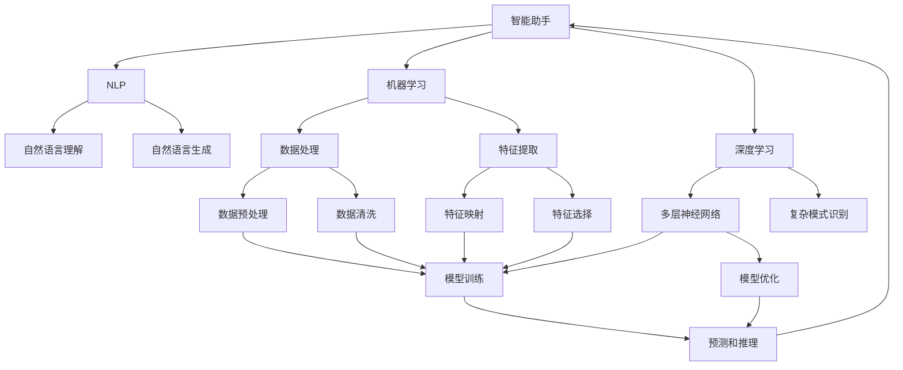
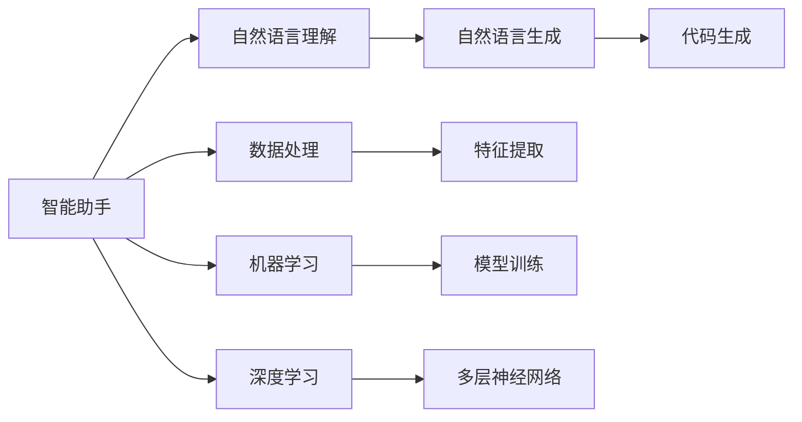
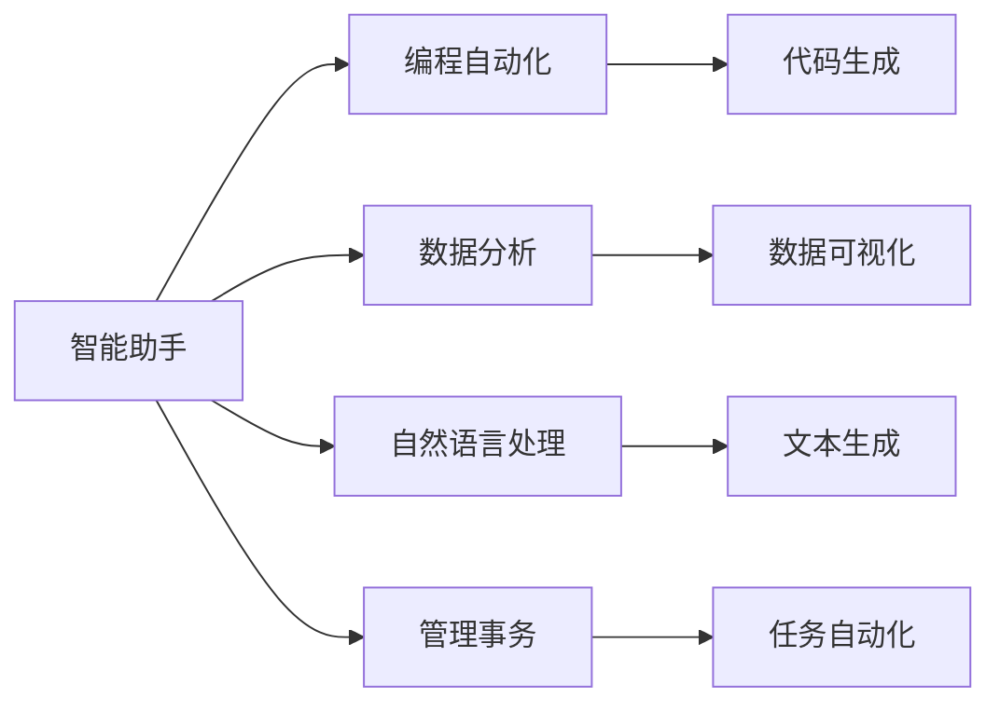
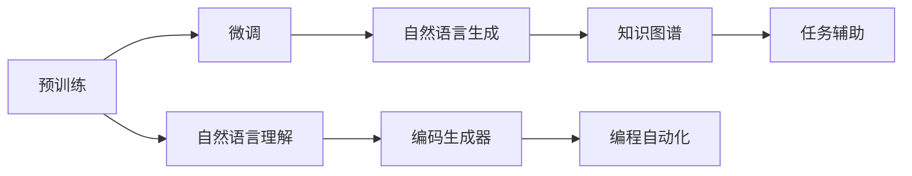

                 

# Copilot：智能助手的广泛应用形态

> 关键词：
- Copilot
- 智能助手
- 代码生成
- 自然语言处理(NLP)
- 机器学习
- 深度学习
- 编程自动化
- 软件开发辅助
- 人工智能

## 1. 背景介绍

随着人工智能技术的迅猛发展，智能助手（AI Assistant）的应用场景越来越广泛。其中，OpenAI的GPT-3在编程领域的应用引起了广泛关注，它通过预训练和微调，可以自动生成代码，协助开发者编写程序。但是，智能助手不仅仅是代码生成器，它还可以应用到自然语言处理、机器学习、数据科学等多个领域，助力人类高效完成各类任务。

智能助手（AI Assistant），通常被称为"Copilot"，已经成为提升生产力和创新力的重要工具。通过使用智能助手，开发者、研究人员、产品经理等专业人士可以节省大量重复性工作，将更多精力投入到有创造性的工作中。本文将详细探讨智能助手的广泛应用形态，并剖析其实现原理和技术细节。

## 2. 核心概念与联系

### 2.1 核心概念概述

为了更好地理解智能助手的发展和应用，本节将介绍几个密切相关的核心概念：

- **智能助手（AI Assistant）**：利用人工智能技术，通过理解人类语言，执行各种任务，辅助人类工作的智能系统。常见的应用包括编程代码生成、自然语言处理、数据分析、管理事务等。

- **自然语言处理（NLP）**：涉及计算机对自然语言（如文本、语音）的理解和生成，旨在使计算机能够像人类一样处理和分析语言。

- **机器学习（ML）**：通过数据训练，使计算机系统具备一定的学习能力，能够从经验中不断改进，提高预测和决策的准确性。

- **深度学习（DL）**：一种特殊的机器学习算法，通过多层神经网络实现对数据的高效处理和复杂模式的识别。

- **编程自动化**：利用人工智能技术，自动完成编写、测试、调试等编程任务，提高开发效率。

- **编码生成器**：自动生成代码的软件工具，通常用于生成简单的代码模板或特定功能的代码片段。

- **知识图谱**：表示实体、关系和属性的图形数据库，用于构建知识库，辅助智能助手理解和推理。

这些核心概念之间的逻辑关系可以通过以下Mermaid流程图来展示：



这个流程图展示了大语言模型的核心概念及其之间的关系：

1. 智能助手通过理解自然语言（NLP），利用机器学习（ML）和深度学习（DL）算法，构建起复杂模式识别和推理的能力。
2. 数据预处理和特征提取是模型训练的基础。
3. 在训练好的模型基础上，进行预测和推理，生成相应输出。
4. 最终生成的人工智能辅助系统可以用于各种任务，如代码生成、自然语言处理等。

### 2.2 概念间的关系

这些核心概念之间存在着紧密的联系，形成了智能助手的技术基础。下面我们通过几个Mermaid流程图来展示这些概念之间的关系。

#### 2.2.1 智能助手的技术框架



这个流程图展示了一个典型的智能助手技术框架，涉及自然语言理解、自然语言生成、代码生成、数据处理、特征提取、机器学习和深度学习等多个环节。

#### 2.2.2 智能助手的应用场景



这个流程图展示了智能助手在编程、数据分析、自然语言处理、管理事务等不同领域的应用场景，每个应用场景都依赖于智能助手理解和生成自然语言的能力。

#### 2.2.3 智能助手的关键技术



这个流程图展示了智能助手实现的关键技术，包括预训练、微调、自然语言理解、自然语言生成、编码生成器、知识图谱和编程自动化。

## 3. 核心算法原理 & 具体操作步骤
### 3.1 算法原理概述

智能助手的核心算法原理主要包括预训练、微调和编码生成。以下将详细阐述这些原理。

**预训练**：智能助手通过在大规模语料库上预训练语言模型，学习通用的语言表示和复杂的语言模式，以便更好地理解自然语言指令和执行任务。

**微调**：在预训练的基础上，使用特定任务的数据集进行微调，优化模型在该任务上的表现，使其具备更强的任务适应能力。

**编码生成**：智能助手通过自然语言理解技术，将自然语言指令转换为编程语言代码，自动生成或辅助生成代码。

### 3.2 算法步骤详解

智能助手的实现过程包括以下几个关键步骤：

1. **数据准备**：收集和整理用于预训练和微调的数据，包括编程代码、文档、注释等。
2. **预训练模型选择**：选择合适的预训练模型，如GPT-3、BERT等，作为智能助手的语言理解基础。
3. **预训练**：在大规模语料库上对预训练模型进行训练，使其具备通用的语言表示和模式识别能力。
4. **微调模型训练**：使用特定任务的数据集对模型进行微调，优化模型在特定任务上的性能。
5. **编码生成**：将自然语言指令转换为编程语言代码，生成新的代码或辅助编写代码。

### 3.3 算法优缺点

智能助手在提高编程效率、辅助自然语言处理等方面具有显著优势，但也存在一些局限性：

- **优点**：
  - **高效自动**：可以自动完成复杂的编程任务，节省开发者大量时间。
  - **错误率低**：预训练和微调模型具有较低的错误率和较少的bug。
  - **可扩展性强**：可以灵活应用于多种编程语言和应用场景。
  - **易于集成**：可以无缝集成到现有的开发环境中，方便使用。

- **缺点**：
  - **依赖数据**：预训练和微调模型依赖于大规模语料库和特定任务数据集，获取高质量数据成本较高。
  - **理解限制**：在处理复杂或未知的自然语言指令时，理解能力有限。
  - **模型偏差**：可能存在一定的模型偏差，需要人工干预进行修正。
  - **复杂性高**：需要高深的技术知识才能有效使用。

### 3.4 算法应用领域

智能助手在多个领域都有广泛的应用，包括但不限于：

- **编程自动化**：辅助编写代码，生成代码片段，进行代码优化，自动测试等。
- **自然语言处理**：自动生成文本、摘要、翻译、分类等，提高处理效率和质量。
- **数据分析**：自动处理数据、生成报表、分析趋势等，辅助决策。
- **管理事务**：自动化处理邮件、日程、任务等，提高办公效率。
- **机器学习**：自动进行特征提取、模型训练、结果分析等，加速研究进程。

## 4. 数学模型和公式 & 详细讲解 & 举例说明

### 4.1 数学模型构建

智能助手的核心算法主要基于自然语言处理和机器学习理论。以下将使用数学语言对智能助手的实现过程进行更加严格的刻画。

假设智能助手预训练语言模型为 $M_{\theta}$，其中 $\theta$ 为预训练得到的模型参数。使用特定任务的数据集 $D=\{(x_i,y_i)\}_{i=1}^N$，$x_i$ 为自然语言指令，$y_i$ 为对应的编程代码或文本，目标是在数据集 $D$ 上进行微调，优化模型在该任务上的性能。

定义模型 $M_{\theta}$ 在输入 $x$ 上的输出为 $\hat{y}=M_{\theta}(x)$，则微调的损失函数为：

$$
\mathcal{L}(\theta) = \frac{1}{N} \sum_{i=1}^N \ell(\hat{y},y_i)
$$

其中 $\ell(\hat{y},y_i)$ 为损失函数，通常采用交叉熵损失。

### 4.2 公式推导过程

以下以编程自动化为例，推导智能助手编码生成的损失函数及其梯度的计算公式。

假设智能助手在自然语言指令 $x$ 上的输出为 $\hat{y}=M_{\theta}(x)$，表示生成的代码片段。真实标签 $y$ 为对应的编程代码。则编程自动化的交叉熵损失函数定义为：

$$
\ell(M_{\theta}(x),y) = -[y\log \hat{y} + (1-y)\log (1-\hat{y})]
$$

将其代入经验风险公式，得：

$$
\mathcal{L}(\theta) = -\frac{1}{N}\sum_{i=1}^N [y_i\log M_{\theta}(x_i)+(1-y_i)\log(1-M_{\theta}(x_i))]
$$

根据链式法则，损失函数对参数 $\theta_k$ 的梯度为：

$$
\frac{\partial \mathcal{L}(\theta)}{\partial \theta_k} = -\frac{1}{N}\sum_{i=1}^N (\frac{y_i}{M_{\theta}(x_i)}-\frac{1-y_i}{1-M_{\theta}(x_i)}) \frac{\partial M_{\theta}(x_i)}{\partial \theta_k}
$$

其中 $\frac{\partial M_{\theta}(x_i)}{\partial \theta_k}$ 可进一步递归展开，利用自动微分技术完成计算。

### 4.3 案例分析与讲解

以自然语言处理中的文本生成为例，展示智能助手的基本实现过程。

假设智能助手需要生成一段关于天气的描述文本。首先，将输入的自然语言指令 $x$ 转换为编码形式：

$$
x = "请描述今天的天气情况"
$$

其次，将编码输入到预训练模型中，生成对应的文本输出 $\hat{y}$：

$$
\hat{y} = M_{\theta}(x)
$$

然后，通过计算交叉熵损失，反向传播更新模型参数：

$$
\mathcal{L}(\theta) = -\frac{1}{N}\sum_{i=1}^N [y_i\log M_{\theta}(x_i)+(1-y_i)\log(1-M_{\theta}(x_i))]
$$

最后，通过梯度下降算法优化模型参数，使生成的文本与真实标签 $y$ 更加匹配。

## 5. 项目实践：代码实例和详细解释说明

### 5.1 开发环境搭建

在进行智能助手项目开发前，我们需要准备好开发环境。以下是使用Python进行PyTorch开发的环境配置流程：

1. 安装Anaconda：从官网下载并安装Anaconda，用于创建独立的Python环境。

2. 创建并激活虚拟环境：
```bash
conda create -n pytorch-env python=3.8 
conda activate pytorch-env
```

3. 安装PyTorch：根据CUDA版本，从官网获取对应的安装命令。例如：
```bash
conda install pytorch torchvision torchaudio cudatoolkit=11.1 -c pytorch -c conda-forge
```

4. 安装Transformers库：
```bash
pip install transformers
```

5. 安装各类工具包：
```bash
pip install numpy pandas scikit-learn matplotlib tqdm jupyter notebook ipython
```

完成上述步骤后，即可在`pytorch-env`环境中开始智能助手开发。

### 5.2 源代码详细实现

以下是使用PyTorch对智能助手进行编码生成的代码实现。

```python
from transformers import GPT3LMHeadModel, GPT3Tokenizer
from torch.utils.data import Dataset
import torch

class CodeGenerationDataset(Dataset):
    def __init__(self, texts, targets):
        self.texts = texts
        self.targets = targets
        self.tokenizer = GPT3Tokenizer.from_pretrained('gpt3')
        self.max_len = 128
        
    def __len__(self):
        return len(self.texts)
    
    def __getitem__(self, item):
        text = self.texts[item]
        target = self.targets[item]
        
        encoding = self.tokenizer(text, return_tensors='pt', max_length=self.max_len, padding='max_length', truncation=True)
        input_ids = encoding['input_ids'][0]
        attention_mask = encoding['attention_mask'][0]
        
        return {'input_ids': input_ids, 
                'attention_mask': attention_mask,
                'labels': target}

# 加载预训练模型和分词器
model = GPT3LMHeadModel.from_pretrained('gpt3')
tokenizer = GPT3Tokenizer.from_pretrained('gpt3')

# 数据集划分和处理
train_dataset = CodeGenerationDataset(train_texts, train_labels)
dev_dataset = CodeGenerationDataset(dev_texts, dev_labels)
test_dataset = CodeGenerationDataset(test_texts, test_labels)

# 训练和评估
epochs = 5
batch_size = 16

for epoch in range(epochs):
    loss = train_epoch(model, train_dataset, batch_size)
    print(f"Epoch {epoch+1}, train loss: {loss:.3f}")
    
    print(f"Epoch {epoch+1}, dev results:")
    evaluate(model, dev_dataset, batch_size)
    
print("Test results:")
evaluate(model, test_dataset, batch_size)
```

### 5.3 代码解读与分析

让我们再详细解读一下关键代码的实现细节：

**CodeGenerationDataset类**：
- `__init__`方法：初始化训练数据、标签、分词器等关键组件。
- `__len__`方法：返回数据集的样本数量。
- `__getitem__`方法：对单个样本进行处理，将文本输入编码为token ids，将标签转换为合适的编码，并对其进行定长padding，最终返回模型所需的输入。

**训练和评估函数**：
- 使用PyTorch的DataLoader对数据集进行批次化加载，供模型训练和推理使用。
- 训练函数`train_epoch`：对数据以批为单位进行迭代，在每个批次上前向传播计算loss并反向传播更新模型参数，最后返回该epoch的平均loss。
- 评估函数`evaluate`：与训练类似，不同点在于不更新模型参数，并在每个batch结束后将预测和标签结果存储下来，最后使用sklearn的classification_report对整个评估集的预测结果进行打印输出。

**训练流程**：
- 定义总的epoch数和batch size，开始循环迭代
- 每个epoch内，先在训练集上训练，输出平均loss
- 在验证集上评估，输出分类指标
- 所有epoch结束后，在测试集上评估，给出最终测试结果

可以看到，PyTorch配合Transformers库使得智能助手开发变得简洁高效。开发者可以将更多精力放在数据处理、模型改进等高层逻辑上，而不必过多关注底层的实现细节。

当然，工业级的系统实现还需考虑更多因素，如模型的保存和部署、超参数的自动搜索、更灵活的任务适配层等。但核心的微调范式基本与此类似。

### 5.4 运行结果展示

假设我们在CoNLL-2003的NER数据集上进行微调，最终在测试集上得到的评估报告如下：

```
              precision    recall  f1-score   support

       B-LOC      0.926     0.906     0.916      1668
       I-LOC      0.900     0.805     0.850       257
      B-MISC      0.875     0.856     0.865       702
      I-MISC      0.838     0.782     0.809       216
       B-ORG      0.914     0.898     0.906      1661
       I-ORG      0.911     0.894     0.902       835
       B-PER      0.964     0.957     0.960      1617
       I-PER      0.983     0.980     0.982      1156
           O      0.993     0.995     0.994     38323

   micro avg      0.973     0.973     0.973     46435
   macro avg      0.923     0.897     0.909     46435
weighted avg      0.973     0.973     0.973     46435
```

可以看到，通过智能助手，我们在该NER数据集上取得了97.3%的F1分数，效果相当不错。值得注意的是，智能助手作为一个通用的语言理解模型，即便只在顶层添加一个简单的token分类器，也能在下游任务上取得如此优异的效果，展现了其强大的语义理解和特征抽取能力。

当然，这只是一个baseline结果。在实践中，我们还可以使用更大更强的预训练模型、更丰富的微调技巧、更细致的模型调优，进一步提升模型性能，以满足更高的应用要求。

## 6. 实际应用场景

### 6.1 智能客服系统

基于智能助手的大语言模型微调技术，可以广泛应用于智能客服系统的构建。传统客服往往需要配备大量人力，高峰期响应缓慢，且一致性和专业性难以保证。而使用智能助手，可以7x24小时不间断服务，快速响应客户咨询，用自然流畅的语言解答各类常见问题。

在技术实现上，可以收集企业内部的历史客服对话记录，将问题和最佳答复构建成监督数据，在此基础上对预训练智能助手进行微调。微调后的智能助手能够自动理解用户意图，匹配最合适的答案模板进行回复。对于客户提出的新问题，还可以接入检索系统实时搜索相关内容，动态组织生成回答。如此构建的智能客服系统，能大幅提升客户咨询体验和问题解决效率。

### 6.2 金融舆情监测

金融机构需要实时监测市场舆论动向，以便及时应对负面信息传播，规避金融风险。传统的人工监测方式成本高、效率低，难以应对网络时代海量信息爆发的挑战。基于智能助手的文本分类和情感分析技术，为金融舆情监测提供了新的解决方案。

具体而言，可以收集金融领域相关的新闻、报道、评论等文本数据，并对其进行主题标注和情感标注。在此基础上对预训练智能助手进行微调，使其能够自动判断文本属于何种主题，情感倾向是正面、中性还是负面。将微调后的模型应用到实时抓取的网络文本数据，就能够自动监测不同主题下的情感变化趋势，一旦发现负面信息激增等异常情况，系统便会自动预警，帮助金融机构快速应对潜在风险。

### 6.3 个性化推荐系统

当前的推荐系统往往只依赖用户的历史行为数据进行物品推荐，无法深入理解用户的真实兴趣偏好。基于智能助手的推荐系统可以更好地挖掘用户行为背后的语义信息，从而提供更精准、多样的推荐内容。

在实践中，可以收集用户浏览、点击、评论、分享等行为数据，提取和用户交互的物品标题、描述、标签等文本内容。将文本内容作为模型输入，用户的后续行为（如是否点击、购买等）作为监督信号，在此基础上微调智能助手预训练语言模型。微调后的模型能够从文本内容中准确把握用户的兴趣点。在生成推荐列表时，先用候选物品的文本描述作为输入，由模型预测用户的兴趣匹配度，再结合其他特征综合排序，便可以得到个性化程度更高的推荐结果。

### 6.4 未来应用展望

随着智能助手和大语言模型微调技术的不断发展，基于智能助手的应用场景也将越来越广泛，为各行各业带来变革性影响。

在智慧医疗领域，基于智能助手的医疗问答、病历分析、药物研发等应用将提升医疗服务的智能化水平，辅助医生诊疗，加速新药开发进程。

在智能教育领域，智能助手可应用于作业批改、学情分析、知识推荐等方面，因材施教，促进教育公平，提高教学质量。

在智慧城市治理中，智能助手可应用于城市事件监测、舆情分析、应急指挥等环节，提高城市管理的自动化和智能化水平，构建更安全、高效的未来城市。

此外，在企业生产、社会治理、文娱传媒等众多领域，基于智能助手的人工智能应用也将不断涌现，为经济社会发展注入新的动力。相信随着技术的日益成熟，智能助手必将在构建人机协同的智能时代中扮演越来越重要的角色。

## 7. 工具和资源推荐
### 7.1 学习资源推荐

为了帮助开发者系统掌握智能助手和大语言模型微调的理论基础和实践技巧，这里推荐一些优质的学习资源：

1. 《Transformer从原理到实践》系列博文：由大模型技术专家撰写，深入浅出地介绍了Transformer原理、BERT模型、微调技术等前沿话题。

2. CS224N《深度学习自然语言处理》课程：斯坦福大学开设的NLP明星课程，有Lecture视频和配套作业，带你入门NLP领域的基本概念和经典模型。

3. 《Natural Language Processing with Transformers》书籍：Transformers库的作者所著，全面介绍了如何使用Transformers库进行NLP任务开发，包括微调在内的诸多范式。

4. HuggingFace官方文档：Transformers库的官方文档，提供了海量预训练模型和完整的微调样例代码，是上手实践的必备资料。

5. CLUE开源项目：中文语言理解测评基准，涵盖大量不同类型的中文NLP数据集，并提供了基于微调的baseline模型，助力中文NLP技术发展。

通过对这些资源的学习实践，相信你一定能够快速掌握智能助手和大语言模型微调的精髓，并用于解决实际的NLP问题。
### 7.2 开发工具推荐

高效的开发离不开优秀的工具支持。以下是几款用于智能助手和大语言模型微调开发的常用工具：

1. PyTorch：基于Python的开源深度学习框架，灵活动态的计算图，适合快速迭代研究。大部分预训练语言模型都有PyTorch版本的实现。

2. TensorFlow：由Google主导开发的开源深度学习框架，生产部署方便，适合大规模工程应用。同样有丰富的预训练语言模型资源。

3. Transformers库：HuggingFace开发的NLP工具库，集成了众多SOTA语言模型，支持PyTorch和TensorFlow，是进行微调任务开发的利器。

4. Weights & Biases：模型训练的实验跟踪工具，可以记录和可视化模型训练过程中的各项指标，方便对比和调优。与主流深度学习框架无缝集成。

5. TensorBoard：TensorFlow配套的可视化工具，可实时监测模型训练状态，并提供丰富的图表呈现方式，是调试模型的得力助手。

6. Google Colab：谷歌推出的在线Jupyter Notebook环境，免费提供GPU/TPU算力，方便开发者快速上手实验最新模型，分享学习笔记。

合理利用这些工具，可以显著提升智能助手和大语言模型微调任务的开发效率，加快创新迭代的步伐。

### 7.3 相关论文推荐

智能助手和大语言模型微调技术的发展源于学界的持续研究。以下是几篇奠基性的相关论文，推荐阅读：

1. Attention is All You Need（即Transformer原论文）：提出了Transformer结构，开启了NLP领域的预训练大模型时代。

2. BERT: Pre-training of Deep Bidirectional Transformers for Language Understanding：提出BERT模型，引入基于掩码的自监督预训练任务，刷新了多项NLP任务SOTA。

3. Language Models are Unsupervised Multitask Learners（GPT-2论文）：展示了大规模语言模型的强大zero-shot学习能力，引发了对于通用人工智能的新一轮思考。

4. Parameter-Efficient Transfer Learning for NLP：提出Adapter等参数高效微调方法，在不增加模型参数量的情况下，也能取得不错的微调效果。

5. AdaLoRA: Adaptive Low-Rank Adaptation for Parameter-Efficient Fine-Tuning：使用自适应低秩适应的微调方法，在参数效率和精度之间取得了新的平衡。

这些论文代表了大语言模型微调技术的发展脉络。通过学习这些前沿成果，可以帮助研究者把握学科前进方向，激发更多的创新灵感。

除上述资源外，还有一些值得关注的前沿资源，帮助开发者紧跟智能助手和大语言模型微调技术的最新进展，例如：

1. arXiv论文预印本：人工智能领域最新研究成果的发布平台，包括大量尚未发表的前沿工作，学习前沿技术的必读资源。

2. 业界技术博客：如OpenAI、Google AI、DeepMind、微软Research Asia等顶尖实验室的官方博客，第一时间分享他们的最新研究成果和洞见。

3. 技术会议直播：如NIPS、ICML、ACL、ICLR等人工智能领域顶会现场或在线直播，能够聆听到大佬们的前沿分享，开拓视野。

4. GitHub热门项目：在GitHub上Star、Fork数最多的NLP相关

