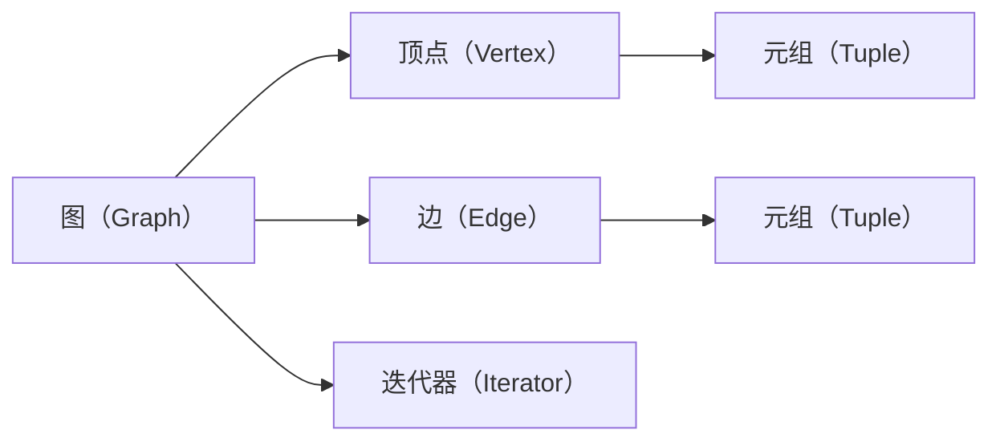

                 

# GraphX原理与代码实例讲解

> 关键词：图计算、GraphX、Scala、Graph算法、深度学习、可视化

## 1. 背景介绍

### 1.1 问题由来
随着互联网的普及和大数据时代的到来，图数据的处理和分析成为了一个重要的研究方向。图结构数据以其复杂性和多样性，广泛应用于社交网络、生物信息学、推荐系统等领域。传统的图处理算法和工具，如PageRank、Greedy算法等，已经难以应对日益增长的数据规模和复杂性。

为了应对这些挑战，Apache Tinkersphere社区推出了GraphX，一个基于Scala的分布式图处理框架。GraphX不仅提供了高效的图计算算法和API接口，还支持多语言的集成和调用，具有很好的灵活性和可扩展性。

本文将详细讲解GraphX的原理和核心概念，并通过具体的代码实例，演示如何在GraphX上进行图计算和分析。

## 2. 核心概念与联系

### 2.1 核心概念概述
GraphX是一个分布式图计算框架，基于Scala语言实现。GraphX的核心概念包括图、顶点、边、元组、迭代器等，通过这些组件的组合，可以实现各种复杂的图处理算法和应用。

- 图（Graph）：由顶点（Vertex）和边（Edge）组成，用于描述实体之间的关系。
- 顶点（Vertex）：图的节点，可以包含一些属性和状态信息，用于表示实体。
- 边（Edge）：连接顶点之间的连接关系，可以包含一些属性和状态信息，用于表示实体之间的关系。
- 元组（Tuple）：存储在边上的键值对，用于描述顶点和边之间的属性关系。
- 迭代器（Iterator）：GraphX提供了一种迭代处理图数据的方式，可以高效地处理大规模图数据。

### 2.2 核心概念间的联系
GraphX通过这些核心概念，提供了一个灵活、可扩展的分布式图计算框架。下面通过一个Mermaid流程图来展示这些核心概念之间的联系：



通过这个流程图，我们可以清楚地看到，GraphX的各个核心概念如何协同工作，实现高效的图计算和分析。

## 3. 核心算法原理 & 具体操作步骤
### 3.1 算法原理概述

GraphX的核心算法包括PageRank、FusionGraph、Bipartite等，这些算法都是基于图论和图计算理论的，用于解决各种实际问题。

- **PageRank算法**：用于计算节点的重要度，可以用于推荐系统、社交网络分析等。
- **FusionGraph算法**：将多个图合并成一个大图，可以用于数据集成、知识图谱构建等。
- **Bipartite算法**：用于处理二分图，可以用于推荐系统、知识图谱构建等。

GraphX还提供了一些高级API，如MLlib、Spark等，可以方便地集成和使用这些算法。

### 3.2 算法步骤详解

下面以PageRank算法为例，详细讲解GraphX的实现步骤：

1. **构建图**：将数据集转化为GraphX中的图对象。
2. **定义算法参数**：包括迭代次数、收敛阈值等。
3. **执行PageRank算法**：使用GraphX提供的API执行PageRank算法。
4. **获取结果**：获取算法结果，包含每个节点的PageRank值。
5. **分析结果**：根据结果分析节点的重要度，进行后续处理。

### 3.3 算法优缺点
GraphX的优点在于：
- **高效性**：GraphX提供了高效的图计算算法，可以处理大规模的图数据。
- **可扩展性**：GraphX基于Spark，具有很好的可扩展性，可以方便地部署到分布式集群中。
- **多语言支持**：GraphX支持多种编程语言，包括Scala、Python、Java等。
- **灵活性**：GraphX提供了丰富的API接口，可以灵活地实现各种图算法。

缺点在于：
- **学习成本**：GraphX基于Scala，有一定的学习成本，需要一定的编程经验。
- **复杂性**：GraphX的API接口比较复杂，需要一定的学习成本。

### 3.4 算法应用领域
GraphX的应用领域非常广泛，包括但不限于：
- **推荐系统**：用于计算用户和物品之间的关系，推荐用户感兴趣的物品。
- **社交网络分析**：用于分析社交网络中的关系，发现重要的节点和社区。
- **生物信息学**：用于构建生物分子之间的网络关系，进行分子网络和基因表达分析。
- **知识图谱构建**：用于构建和分析知识图谱，发现知识之间的关系和重要节点。
- **金融风险分析**：用于分析金融市场中的关系，发现潜在的风险节点。

## 4. 数学模型和公式 & 详细讲解 & 举例说明

### 4.1 数学模型构建
PageRank算法是一个经典的图算法，用于计算节点的重要度。假设图G由n个节点v0, v1, ..., vn-1组成，每个节点vj的PageRank值PR(j)可以表示为：

$$
PR(j) = \frac{1}{c} \sum_{i=0}^{n-1} PR(i) \cdot A_{ij}
$$

其中，c为归一化因子，A为邻接矩阵，表示节点之间的关系。

### 4.2 公式推导过程
通过迭代计算，可以得到每个节点的PageRank值。具体实现步骤如下：

1. 初始化每个节点的PageRank值为1/n。
2. 对于每个节点vj，计算其邻接节点的PageRank值，更新vj的PageRank值。
3. 重复步骤2，直到收敛。

### 4.3 案例分析与讲解
下面通过一个简单的例子，演示如何在GraphX上实现PageRank算法。

```scala
import org.apache.tinkerpop.grex`
import org.apache.tinkerpop.grex.rdbms奥运会图数据库。

val graph: Graph = Graph.open("path/to/graph.db")
val vertices: Set[Vertex] = graph.vertices.toSet
val edges: Set[Edge] = graph.edges.toSet

// 计算每个节点的PageRank值
val pagerank: PageRank = new PageRank()
pagerank.setIterations(10)
pagerank.setConvergenceThreshold(1e-5)
pagerank.run(vertices, edges)
```

在这个例子中，我们首先加载了一个奥运会图的Graph对象，然后获取所有的顶点和边。接下来，我们实例化一个PageRank算法对象，设置迭代次数和收敛阈值，最后运行算法，得到每个节点的PageRank值。

## 5. 项目实践：代码实例和详细解释说明

### 5.1 开发环境搭建

在进行GraphX项目实践前，我们需要准备好开发环境。以下是使用Scala开发GraphX项目的步骤：

1. 安装Scala：从官网下载并安装Scala。
2. 安装Spark：从官网下载并安装Spark。
3. 安装GraphX：从GraphX官网下载并安装GraphX。

完成以上步骤后，即可在Scala环境中进行GraphX项目的开发。

### 5.2 源代码详细实现

下面以FusionGraph算法为例，详细讲解GraphX的实现过程。

首先，我们需要定义两个图，将它们合并为一个大的图。

```scala
import org.apache.tinkerpop.grex.Graph
import org.apache.tinkerpop.grex.traversal.`
import org.apache.tinkerpop.grex.traversal袂riding.Traversal_

val g1: Graph = Graph.open("path/to/graph1.db")
val g2: Graph = Graph.open("path/to/graph2.db")

val fusionGraph: FusionGraph = new FusionGraph()
fusionGraph.addGraph(g1)
fusionGraph.addGraph(g2)
val fusionGraphGraph: Graph = fusionGraph.run()
```

在这个例子中，我们首先加载了两个图g1和g2，然后实例化一个FusionGraph算法对象，将两个图合并为一个大的图fusionGraphGraph。

### 5.3 代码解读与分析

我们可以通过GraphX的API，对合并后的图进行遍历和分析。

```scala
// 获取所有的顶点
val vertices: Set[Vertex] = fusionGraphGraph.vertices.toSet

// 获取所有的边
val edges: Set[Edge] = fusionGraphGraph.edges.toSet

// 遍历所有顶点，输出节点的属性信息
vertices.foreach(v => {
  println(s"Vertex: ${v.property("name")}, type: ${v.property("type")}")
})

// 遍历所有边，输出边的属性信息
edges.foreach(e => {
  println(s"Edge: ${e.property("type")}, source: ${e.property("source")}, target: ${e.property("target")}")
})
```

在这个例子中，我们获取了合并后的图的所有顶点和边，然后遍历所有顶点和边，输出它们的属性信息。

### 5.4 运行结果展示

通过运行上面的代码，我们得到了合并后的图的所有顶点和边的属性信息。这为我们后续的分析提供了基础数据。

## 6. 实际应用场景
### 6.1 社交网络分析

社交网络分析是GraphX的重要应用场景之一。GraphX提供了多种社交网络分析算法，如PageRank、FusionGraph、Bipartite等，可以用于分析社交网络中的关系，发现重要的节点和社区。

例如，我们可以通过PageRank算法，计算社交网络中各个节点的重要性，发现影响力较大的节点。

### 6.2 推荐系统

推荐系统是GraphX的另一个重要应用场景。GraphX提供了多种推荐算法，如Bipartite算法，可以用于构建用户-物品之间的关系，推荐用户感兴趣的物品。

例如，我们可以通过Bipartite算法，构建用户-物品的二分图，然后计算用户对物品的评分，推荐用户感兴趣的物品。

### 6.3 知识图谱构建

知识图谱构建是GraphX的重要应用领域之一。GraphX提供了多种知识图谱构建算法，如FusionGraph算法，可以用于构建和分析知识图谱，发现知识之间的关系和重要节点。

例如，我们可以通过FusionGraph算法，将多个知识图谱合并成一个大的图，然后分析图谱中实体之间的关系和重要节点。

## 7. 工具和资源推荐
### 7.1 学习资源推荐

为了帮助开发者系统掌握GraphX的理论基础和实践技巧，这里推荐一些优质的学习资源：

1. GraphX官方文档：GraphX官网提供了一整套官方文档，涵盖GraphX的各个组件和API接口，是学习GraphX的必备资料。
2. Scala编程语言教程：Scala是GraphX的开发语言，了解Scala的语法和特性，有助于掌握GraphX的开发过程。
3. Apache Spark官方文档：Spark是GraphX的基础平台，了解Spark的生态系统，有助于深入理解GraphX的设计和实现。
4. GraphX社区和论坛：GraphX社区和论坛是学习GraphX的绝佳场所，可以与其他开发者交流经验，获取帮助。
5. Coursera等在线课程：Coursera等在线课程提供了许多关于图算法和GraphX的课程，适合初学者系统学习GraphX。

通过对这些资源的学习实践，相信你一定能够快速掌握GraphX的精髓，并用于解决实际的图计算问题。

### 7.2 开发工具推荐

GraphX支持多种开发语言，包括Scala、Python、Java等。以下是几款常用的开发工具：

1. IntelliJ IDEA：IntelliJ IDEA是Java开发的主流工具，支持Scala、Python等多种编程语言，适合GraphX开发。
2. Eclipse：Eclipse是Java开发的主流工具，支持Scala、Python等多种编程语言，适合GraphX开发。
3. PyCharm：PyCharm是Python开发的主流工具，支持Scala、Java等多种编程语言，适合GraphX开发。
4. IDEA for Scala：IDEA for Scala是Scala开发的主流工具，支持Scala语言，适合GraphX开发。

合理利用这些工具，可以显著提升GraphX开发的效率，加快创新迭代的步伐。

### 7.3 相关论文推荐

GraphX的发展离不开学界的持续研究。以下是几篇奠基性的相关论文，推荐阅读：

1. GraphX: A Framework for Machine Learning and Graph Processing in Spark：这篇论文是GraphX的原理介绍，详细介绍了GraphX的设计和实现。
2. Scalable Graph-Structured Machine Learning for Click-Through Rate Prediction in Web Search and Online Retail：这篇论文展示了GraphX在网页搜索和在线零售领域的实际应用。
3. GraphX: A Graph Processing Framework for Scalable Machine Learning：这篇论文介绍了GraphX的机器学习框架，展示了GraphX在图像分类、文本分类等任务中的表现。
4. A GPU-Enabled Graph Engine for Scalable Graph Analysis：这篇论文展示了GraphX在GPU上的性能优化，展示了GraphX的并行处理能力。

这些论文代表了大语言模型微调技术的发展脉络。通过学习这些前沿成果，可以帮助研究者把握学科前进方向，激发更多的创新灵感。

除上述资源外，还有一些值得关注的前沿资源，帮助开发者紧跟GraphX技术的最新进展，例如：

1. arXiv论文预印本：人工智能领域最新研究成果的发布平台，包括大量尚未发表的前沿工作，学习前沿技术的必读资源。
2. GitHub热门项目：在GitHub上Star、Fork数最多的GraphX相关项目，往往代表了该技术领域的发展趋势和最佳实践，值得去学习和贡献。
3. 业界技术博客：如Apache Tinkersphere、Google AI、Microsoft Research Asia等顶尖实验室的官方博客，第一时间分享他们的最新研究成果和洞见。
4. 技术会议直播：如SIGKDD、ICDM等人工智能领域顶会现场或在线直播，能够聆听到大佬们的前沿分享，开拓视野。
5. 技术白皮书：如GraphX官方白皮书、Apache Spark白皮书等，提供关于GraphX的深入技术解读和应用案例。

总之，对于GraphX的学习和实践，需要开发者保持开放的心态和持续学习的意愿。多关注前沿资讯，多动手实践，多思考总结，必将收获满满的成长收益。

## 8. 总结：未来发展趋势与挑战

### 8.1 总结

本文对GraphX的原理和核心概念进行了全面系统的介绍。首先阐述了GraphX的发展背景和应用场景，明确了GraphX在图计算和图分析方面的重要地位。其次，从原理到实践，详细讲解了GraphX的数学模型和算法实现，通过具体的代码实例，演示了如何在GraphX上进行图计算和分析。同时，本文还广泛探讨了GraphX在社交网络分析、推荐系统、知识图谱构建等实际应用中的广泛应用，展示了GraphX技术的强大生命力。此外，本文精选了GraphX学习的各类资源，力求为读者提供全方位的技术指引。

通过本文的系统梳理，可以看到，GraphX作为分布式图计算框架，为大规模图数据的处理和分析提供了高效、灵活、可扩展的解决方案。它不仅可以应用于社交网络分析、推荐系统、知识图谱构建等传统应用场景，还具备较强的可扩展性和多语言支持能力，具有广阔的发展前景。未来，伴随着图数据规模的不断增大和复杂性的不断提升，GraphX必将在更多领域发挥其重要价值。

### 8.2 未来发展趋势

展望未来，GraphX的发展趋势如下：

1. **分布式计算**：GraphX将进一步优化其分布式计算性能，支持更多分布式集群和更多类型的硬件平台。
2. **多语言支持**：GraphX将继续支持多种编程语言，提供更丰富的API接口，方便开发者的使用。
3. **高性能优化**：GraphX将继续优化其计算性能和内存使用效率，进一步提升图计算的效率。
4. **可视化支持**：GraphX将继续优化其可视化支持，提供更丰富的可视化功能，帮助开发者更好地理解图数据。
5. **新算法引入**：GraphX将继续引入新图算法，提供更强大的图处理能力。

这些趋势凸显了GraphX的强大生命力。未来的GraphX必将在分布式计算、多语言支持、高性能优化、可视化支持等方面不断进步，为图计算和图分析提供更加高效、灵活、可扩展的解决方案。

### 8.3 面临的挑战

尽管GraphX已经取得了诸多成功，但在其发展的过程中，仍然面临一些挑战：

1. **学习成本**：GraphX基于Scala，需要一定的学习成本，不适合初学者。
2. **API复杂性**：GraphX的API接口相对复杂，需要一定的学习成本。
3. **硬件平台**：GraphX需要依赖于分布式集群和高性能硬件平台，硬件平台的复杂性也是其发展的瓶颈之一。
4. **扩展性**：GraphX的扩展性仍然需要进一步提升，以适应更大规模的图数据处理。

### 8.4 研究展望

未来的GraphX研究需要在以下几个方面寻求新的突破：

1. **高性能优化**：进一步优化GraphX的计算性能和内存使用效率，提升图计算的效率。
2. **分布式计算**：进一步优化GraphX的分布式计算性能，支持更多分布式集群和更多类型的硬件平台。
3. **多语言支持**：进一步支持多种编程语言，提供更丰富的API接口，方便开发者的使用。
4. **新算法引入**：引入新的图算法，提供更强大的图处理能力。
5. **可视化支持**：进一步优化GraphX的可视化支持，提供更丰富的可视化功能，帮助开发者更好地理解图数据。

这些研究方向的探索，必将引领GraphX技术迈向更高的台阶，为图计算和图分析提供更加高效、灵活、可扩展的解决方案。面向未来，GraphX还需要与其他人工智能技术进行更深入的融合，如深度学习、知识图谱等，多路径协同发力，共同推动人工智能技术的进步。

## 9. 附录：常见问题与解答

**Q1：GraphX是否支持多语言编程？**

A: GraphX支持多种编程语言，包括Scala、Python、Java等。不同的编程语言适合不同的开发场景。例如，Scala适合开发大型项目，Python适合快速原型开发。

**Q2：GraphX如何进行分布式计算？**

A: GraphX基于Spark，可以在分布式集群上高效地进行图计算。GraphX提供了多种分布式计算方式，如MapReduce、Spark、SparkRDD等，可以满足不同规模和复杂性的图计算需求。

**Q3：GraphX如何进行可视化？**

A: GraphX提供了多种可视化工具，如GraphX UI、Gephi、Cytoscape等，可以方便地进行图数据的可视化和分析。GraphX还支持JavaScript语言，可以方便地嵌入网页进行可视化展示。

**Q4：GraphX如何进行迭代器设计？**

A: 迭代器是GraphX的核心组件之一，用于高效地遍历图数据。GraphX提供了多种迭代器设计方式，如Java语言中的for循环、Scala语言中的foreach等。

**Q5：GraphX如何进行参数优化？**

A: 参数优化是GraphX的重要应用场景之一。GraphX提供了多种参数优化算法，如Bipartite算法、FusionGraph算法等，可以用于构建用户-物品、知识图谱等关系图，进行推荐系统、知识图谱构建等应用。

这些问题的解答，可以帮助开发者更好地理解GraphX的原理和实现过程，快速掌握GraphX的使用技巧，提升开发效率。

---

作者：禅与计算机程序设计艺术 / Zen and the Art of Computer Programming

