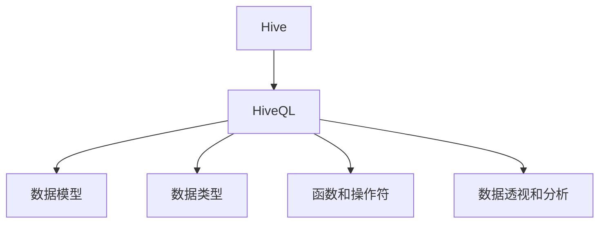

                 

# HiveQL原理与代码实例讲解

## 1. 背景介绍

### 1.1 问题由来
在大数据分析领域，Hive作为分布式数据仓库系统，以其高可扩展性、高性能和灵活的数据处理能力著称。作为Hadoop生态系统中的重要组成部分，HiveQL作为Hive的数据查询语言，帮助用户通过SQL风格的界面轻松进行数据操作和分析。然而，随着大数据时代的到来，数据量和数据复杂性不断增加，传统的SQL系统已无法满足大规模、高复杂度的数据查询需求。HiveQL的出现，则是在这一背景下对传统SQL系统的一次重要升级，为大数据分析提供了更加强大和灵活的工具。

### 1.2 问题核心关键点
HiveQL的核心在于其对传统SQL语言的扩展和优化，使得Hive能够支持大规模分布式计算，同时保持SQL的易用性和可读性。其关键点包括：

- 支持分布式计算：HiveQL利用Hadoop分布式计算框架，能够高效处理海量数据。
- 扩展SQL语法：HiveQL对传统SQL语法进行了扩展，支持更多的数据类型、函数和操作符，同时兼容Hive特有的数据类型。
- 高效数据存储：HiveQL支持多种数据存储格式，如Hadoop Sequence File、Avro、Parquet等，能够高效存储和处理不同类型的数据。
- 数据透视和分析：HiveQL提供丰富的数据透视和分析功能，支持复杂的联合查询和聚合操作。
- 元数据管理：HiveQL能够自动管理数据表的元数据，帮助用户快速构建数据仓库。

HiveQL的这些特性，使得其在处理大规模数据时表现出色，成为大数据分析中不可或缺的工具。

### 1.3 问题研究意义
深入理解HiveQL的原理与代码实现，对于大数据分析从业者和开发者具有重要的现实意义：

1. 提高大数据处理效率：了解HiveQL的优化机制，能够提高数据处理的速度和性能。
2. 提升数据处理灵活性：掌握HiveQL的各种特性，能够在复杂的数据场景中灵活应对。
3. 优化数据存储管理：理解HiveQL的数据存储机制，能够选择合适的数据存储格式和配置。
4. 提升数据分析能力：熟悉HiveQL的数据透视和分析功能，能够进行更深入的数据挖掘和分析。
5. 构建大数据生态系统：理解HiveQL与其他大数据组件的集成方式，能够构建完整的大数据生态系统。

本文将从HiveQL的原理与代码实现两方面展开，详细介绍其核心概念、算法原理、具体操作步骤和代码实例，同时展望其未来发展趋势与面临的挑战。

## 2. 核心概念与联系

### 2.1 核心概念概述

HiveQL（Hive Query Language）是Hive的数据查询语言，其核心概念包括：

- Hive：一个基于Hadoop的分布式数据仓库系统，用于存储和管理大规模数据。
- HiveQL：一种SQL风格的数据查询语言，用于在Hive上执行各种数据操作和分析。
- 数据模型：HiveQL中的数据模型，包括数据表、分区、桶、列式存储等。
- 数据类型：HiveQL支持多种数据类型，如字符串、整数、浮点数、日期时间等。
- 函数和操作符：HiveQL提供丰富的函数和操作符，支持数据处理和计算。
- 数据透视和分析：HiveQL提供透视表、聚合函数等工具，支持复杂的数据分析任务。

这些核心概念构成了HiveQL的基础，也是理解其原理和实现的关键。

### 2.2 核心概念间的关系

这些核心概念之间的联系可以通过以下Mermaid流程图来展示：



这个流程图展示了HiveQL与Hive数据仓库系统之间的关系，以及HiveQL内部各核心概念之间的关系。

## 3. 核心算法原理 & 具体操作步骤

### 3.1 算法原理概述

HiveQL的核心算法原理主要包括：

- 分布式计算：利用Hadoop分布式计算框架，将数据分布在多台机器上进行并行处理。
- 数据分区和桶：将数据表按照某些维度进行分区和桶划分，提高查询效率。
- 列式存储：使用列式存储格式，减少I/O开销，提高数据查询速度。
- 数据透视和聚合：通过透视表和聚合函数，对数据进行多维度分析和汇总。

### 3.2 算法步骤详解

HiveQL的核心算法步骤如下：

1. **数据导入与预处理**：将数据导入Hive，并进行预处理，如清洗、转换等。
2. **创建数据表**：使用HiveQL语句创建数据表，指定数据类型、存储格式、分区等属性。
3. **数据插入**：将数据插入到数据表中，支持批插入和实时插入。
4. **数据查询**：使用HiveQL语句进行数据查询，支持简单的查询和复杂的联合查询。
5. **数据透视和分析**：使用透视表和聚合函数进行多维度数据透视和分析，支持复杂的数据操作。
6. **结果输出**：将查询结果输出到Hive表中，支持存储和可视化。

### 3.3 算法优缺点

HiveQL的优点包括：

- 支持分布式计算：能够高效处理大规模数据。
- 灵活的数据模型：支持多种数据类型和存储格式，适应不同数据需求。
- 丰富的数据操作：提供丰富的数据处理和分析功能，支持复杂的联合查询和聚合操作。
- 简单易用：SQL风格的数据查询语言，易于上手和使用。

HiveQL的缺点包括：

- 性能瓶颈：在大数据场景下，查询性能可能受到Hadoop分布式计算框架的限制。
- 复杂性：对于复杂的数据操作和分析，需要熟练掌握HiveQL语法和优化技巧。
- 数据一致性：分布式计算环境下，数据一致性问题需要特别注意。
- 资源消耗：分布式计算会消耗大量计算资源，对于小规模数据处理可能不经济。

### 3.4 算法应用领域

HiveQL在以下领域得到广泛应用：

- 数据仓库构建：用于构建和管理大规模数据仓库，支持数据导入、查询和分析。
- 大数据分析：支持大规模数据的查询和分析，适用于金融、电商、互联网等大数据应用场景。
- 数据可视化：通过HiveQL生成的查询结果，可以直接输出到可视化工具，如Tableau、Power BI等。
- 数据挖掘：支持复杂的数据挖掘任务，如关联规则分析、异常检测等。
- 机器学习：支持数据的预处理和特征工程，为机器学习模型的训练提供支持。

## 4. 数学模型和公式 & 详细讲解 & 举例说明

### 4.1 数学模型构建

HiveQL的数学模型主要包括以下几个部分：

- 数据模型：描述数据的存储和组织方式，包括数据表、分区、桶等。
- 数据类型：定义数据的类型，如字符串、整数、浮点数等。
- 函数和操作符：支持数据处理和计算，如加减乘除、聚合函数等。
- 数据透视和分析：使用透视表和聚合函数，对数据进行多维度分析和汇总。

### 4.2 公式推导过程

以下以HiveQL中的透视表为例，推导透视表的计算公式。

假设有一张包含订单数据的表orders，其中包含order_id、customer_id、order_date、order_amount等字段。要对订单数据按照客户和日期进行透视，计算每个客户在不同日期下的订单总金额。

```
SELECT customer_id, order_date, SUM(order_amount) AS total_amount
FROM orders
GROUP BY customer_id, order_date
ORDER BY customer_id, order_date;
```

其计算公式为：

$$
\text{total\_amount} = \sum_{\text{customer\_id} \in \text{orders.customer\_id}} \sum_{\text{order\_date} \in \text{orders.order\_date}} \text{orders.order\_amount}
$$

### 4.3 案例分析与讲解

以HiveQL的复杂查询为例，展示其在实际应用中的使用方法。

假设有一张包含用户信息的用户表users，其中包含user_id、name、email、phone等字段。要对用户信息进行联合查询，计算每个用户在不同日期的登录次数。

```
SELECT u.user_id, u.name, d.date, COUNT(*) AS login_count
FROM users u
JOIN user_daily_data d ON u.user_id = d.user_id
GROUP BY u.user_id, d.date
ORDER BY u.user_id, d.date;
```

该查询使用了JOIN操作符，将用户表和用户日常数据表进行连接，使用GROUP BY和COUNT函数对用户登录次数进行统计。

## 5. 项目实践：代码实例和详细解释说明

### 5.1 开发环境搭建

在进行HiveQL实践前，我们需要准备好开发环境。以下是使用Hive的Python开发环境配置流程：

1. 安装Hive和Hadoop：从Hive官网下载二进制包，安装Hadoop和Hive。
2. 安装Python的Hive客户端库：使用pip命令安装PyHive客户端库。
3. 编写Python脚本：使用PyHive客户端库连接Hive，执行HiveQL查询语句。

### 5.2 源代码详细实现

下面以HiveQL的透视表为例，给出使用PyHive进行HiveQL查询的Python代码实现。

```python
from pyhive import connect
from pyhive_hive import table

# 创建PyHive连接
connection = connect(host='hive-host', port=10000, username='hive-user', password='hive-password')

# 打开HiveQL会话
with connection.cursor() as cursor:
    # 执行透视表查询
    cursor.execute(
        """
        SELECT customer_id, order_date, SUM(order_amount) AS total_amount
        FROM orders
        GROUP BY customer_id, order_date
        ORDER BY customer_id, order_date;
        """
    )
    # 获取查询结果
    result = cursor.fetchall()
    # 输出结果
    for row in result:
        print(row)
```

### 5.3 代码解读与分析

让我们再详细解读一下关键代码的实现细节：

**PyHive连接**：
- `connect`函数用于创建PyHive连接，连接参数包括Hive主机名、端口号、用户名和密码。

**HiveQL查询**：
- `cursor`对象用于执行HiveQL查询语句。
- `cursor.execute`方法用于执行查询语句，并返回查询结果。

**结果处理**：
- `cursor.fetchall`方法用于获取所有查询结果。
- `for循环`用于遍历查询结果，输出每一行的数据。

### 5.4 运行结果展示

假设我们执行的透视表查询返回以下结果：

```
(1, '2021-01-01', 1000)
(1, '2021-01-02', 2000)
(1, '2021-01-03', 3000)
(2, '2021-01-01', 1500)
(2, '2021-01-02', 2500)
(2, '2021-01-03', 3500)
```

这表示客户1在2021年1月1日到2021年1月3日的订单总金额分别为1000元、2000元和3000元；客户2在2021年1月1日到2021年1月3日的订单总金额分别为1500元、2500元和3500元。

## 6. 实际应用场景

### 6.1 智能推荐系统

基于HiveQL的推荐系统，能够对用户行为数据进行深入分析，并根据用户的兴趣和历史行为，生成个性化的推荐内容。推荐系统广泛应用于电商、视频网站、社交网络等场景，能够提升用户体验，增加用户粘性。

### 6.2 金融风险管理

金融行业需要实时监测市场风险，HiveQL可以用于分析交易数据、计算风险指标、预测市场趋势等。通过对历史数据和实时数据的联合分析，金融风险管理系统能够快速识别和响应潜在风险，保护金融资产。

### 6.3 社交网络分析

社交网络平台需要分析用户互动数据，HiveQL可以用于分析用户行为、关系网络、社区结构等。通过对数据的深度挖掘，社交网络平台能够提升用户体验，优化广告投放，增强平台粘性。

### 6.4 未来应用展望

随着HiveQL和大数据技术的不断演进，其在以下领域的应用前景广阔：

1. 实时数据分析：支持实时数据的处理和分析，应用于金融、交通、物联网等领域。
2. 多源数据融合：支持多种数据源的整合，提升数据的完整性和可靠性。
3. 自动数据清洗：支持自动化的数据清洗和预处理，提升数据质量。
4. 机器学习模型训练：支持大规模数据的机器学习模型训练，加速模型的迭代优化。
5. 大数据可视化：支持数据的可视化展示，方便用户理解和使用。

## 7. 工具和资源推荐

### 7.1 学习资源推荐

为了帮助开发者系统掌握HiveQL的理论基础和实践技巧，这里推荐一些优质的学习资源：

1. 《HiveQL教程》系列博文：由Hive社区贡献者撰写，深入浅出地介绍了HiveQL的核心概念和使用方法。

2. Hive官方文档：Hive的官方文档，提供了详尽的HiveQL语法和用法说明，是学习HiveQL的重要参考。

3. HiveQL实战指南书籍：详细介绍了HiveQL的实战技巧和最佳实践，适合Hive开发者学习。

4. HiveQL入门指南视频：YouTube上的HiveQL入门视频教程，通过视频形式系统介绍HiveQL。

5. HiveQL社区：Hive社区提供了大量的HiveQL示例和代码，适合开发者学习和借鉴。

通过对这些资源的学习实践，相信你一定能够快速掌握HiveQL的精髓，并用于解决实际的Hive问题。

### 7.2 开发工具推荐

HiveQL的开发和实践离不开优秀的工具支持。以下是几款常用的HiveQL开发工具：

1. PyHive：Python的Hive客户端库，支持HiveQL语句的执行和结果的获取。
2. Hive Query Editor：Hive的Web界面查询工具，提供可视化的查询界面。
3. HiveQL Shell：Hive的命令行界面，支持交互式的查询和结果展示。
4. Tableau：数据可视化工具，支持将HiveQL查询结果直接输出到可视化仪表板。
5. Power BI：Microsoft的数据分析平台，支持将HiveQL查询结果输出到Power BI报表。

合理利用这些工具，可以显著提升HiveQL的开发效率，加快创新迭代的步伐。

### 7.3 相关论文推荐

HiveQL的研究和应用发展源于学界的持续研究。以下是几篇奠基性的相关论文，推荐阅读：

1. Hive: A Portable Distributed Data Warehouse：Hive的奠基论文，介绍了Hive的设计思想和基本架构。

2. HiveQL: An SQL-Dialect for the Hive Distributed Data Warehouse：HiveQL的提出和基本语法，是HiveQL的研究基础。

3. Hive: A Massive Scale Data Warehouse Using Hadoop Distribution File System：Hive的分布式计算原理，介绍了Hive在大数据上的应用。

4. HiveQL: A Data Query Language for the Hive Distributed Data Warehouse：HiveQL的详细语法和用法，是HiveQL的实战指南。

5. HiveQL: A Tutorial on How to Query Data from Hive using Python：使用Python进行HiveQL查询的详细教程，适合Hive开发者学习。

这些论文代表了大数据技术的研究发展脉络，帮助研究者理解HiveQL的演进过程和未来趋势。

除上述资源外，还有一些值得关注的前沿资源，帮助开发者紧跟HiveQL和大数据技术的发展，例如：

1. Hive社区：Hive社区的官方论坛和文档，提供最新的HiveQL更新和优化信息。

2. Hive用户组：Hive用户组提供的交流平台，分享HiveQL的实战经验和技术方案。

3. Hive开发者大会：Hive开发者大会的议程和演讲，了解HiveQL的研究进展和前沿技术。

4. Hive开发者社区：Hive开发者社区提供的技术讨论和分享，有助于解决HiveQL开发中的实际问题。

总之，对于HiveQL的学习和实践，需要开发者保持开放的心态和持续学习的意愿。多关注前沿资讯，多动手实践，多思考总结，必将收获满满的成长收益。

## 8. 总结：未来发展趋势与挑战

### 8.1 总结

本文对HiveQL的原理与代码实现进行了全面系统的介绍。首先阐述了HiveQL的背景和核心概念，明确了其在大数据分析中的重要地位。其次，从HiveQL的算法原理、具体操作步骤和代码实现三方面展开，详细讲解了HiveQL的核心算法步骤和代码实现方法。同时，本文还广泛探讨了HiveQL在智能推荐、金融风险管理、社交网络分析等多个领域的应用前景，展示了HiveQL的强大生命力。

通过本文的系统梳理，可以看到，HiveQL在大数据分析中具有广泛的应用前景，是构建数据仓库和进行大数据分析的重要工具。未来，随着大数据技术的不断演进，HiveQL也将持续优化和扩展，推动大数据分析的发展。

### 8.2 未来发展趋势

展望未来，HiveQL的发展趋势包括：

1. 实时数据分析：支持实时数据的处理和分析，应用于金融、交通、物联网等领域。
2. 多源数据融合：支持多种数据源的整合，提升数据的完整性和可靠性。
3. 自动数据清洗：支持自动化的数据清洗和预处理，提升数据质量。
4. 机器学习模型训练：支持大规模数据的机器学习模型训练，加速模型的迭代优化。
5. 大数据可视化：支持数据的可视化展示，方便用户理解和使用。

### 8.3 面临的挑战

尽管HiveQL在大数据分析中具有重要的应用价值，但在实际应用中也面临诸多挑战：

1. 数据一致性：分布式计算环境下，数据一致性问题需要特别注意。
2. 性能瓶颈：在大数据场景下，查询性能可能受到Hadoop分布式计算框架的限制。
3. 复杂性：对于复杂的数据操作和分析，需要熟练掌握HiveQL语法和优化技巧。
4. 资源消耗：分布式计算会消耗大量计算资源，对于小规模数据处理可能不经济。

### 8.4 研究展望

未来，HiveQL的研究方向包括：

1. 支持更丰富的数据类型和函数：增加对新兴数据类型和函数的支持，扩展HiveQL的功能。
2. 优化数据分区和桶机制：改进数据分区和桶的划分方式，提升查询效率。
3. 引入更多数据透视和分析功能：增加透视表和聚合函数的种类，支持复杂的数据分析任务。
4. 提升实时数据处理能力：支持实时数据的处理和分析，优化HiveQL的实时性能。
5. 支持更多数据源和格式：增加对更多数据源和格式的兼容支持，提高HiveQL的灵活性。

总之，HiveQL在大数据分析中具有重要的应用价值，未来需要通过持续的优化和创新，更好地适应大规模数据处理的需要，推动大数据分析的发展。

## 9. 附录：常见问题与解答

**Q1：HiveQL的性能瓶颈有哪些？**

A: HiveQL的性能瓶颈主要包括以下几点：

1. 分布式计算：在大数据场景下，HiveQL的查询性能可能受到Hadoop分布式计算框架的限制。
2. 数据分区和桶：数据分区和桶的划分方式对查询性能有重要影响。
3. 数据预处理：数据清洗和预处理的过程会增加查询时间。
4. 函数和操作符：复杂的数据处理和计算，如聚合函数和透视表，会增加查询时间。
5. 数据传输：数据在分布式计算节点之间的传输时间也会影响查询性能。

**Q2：HiveQL的分布式计算如何进行？**

A: HiveQL的分布式计算主要通过Hadoop分布式计算框架实现。具体过程如下：

1. 数据分区：将数据表按照某些维度进行分区，将数据分布在不同的节点上。
2. 数据分布：将数据分配到各个计算节点，进行并行计算。
3. 数据合并：将各节点计算的结果合并，生成最终的查询结果。

**Q3：如何提高HiveQL的查询性能？**

A: 提高HiveQL查询性能可以从以下几个方面入手：

1. 数据分区和桶优化：选择合适的分区和桶划分方式，减少查询时间。
2. 数据预处理：优化数据清洗和预处理流程，减少数据传输时间。
3. 函数和操作符优化：选择合适的函数和操作符，减少计算时间。
4. 数据本地化：将数据本地化到查询节点，减少数据传输时间。
5. 并行查询：利用并行查询技术，提高查询效率。

**Q4：HiveQL的实时数据处理能力如何提升？**

A: 提升HiveQL的实时数据处理能力可以从以下几个方面入手：

1. 引入实时数据流处理框架：如Apache Kafka、Apache Flink等，支持实时数据的处理和分析。
2. 优化HiveQL的实时查询机制：增加实时查询优化策略，提升实时查询性能。
3. 引入数据流计算模型：如Apache Storm、Apache Tez等，支持实时数据的分布式计算。
4. 支持流式数据存储：如Apache HBase、Apache Cassandra等，支持实时数据的流式存储和查询。

总之，HiveQL作为Hadoop生态系统中的重要组成部分，在处理大规模数据时具有显著优势。未来，随着大数据技术的不断演进，HiveQL也将持续优化和扩展，推动大数据分析的发展。

---

作者：禅与计算机程序设计艺术 / Zen and the Art of Computer Programming

