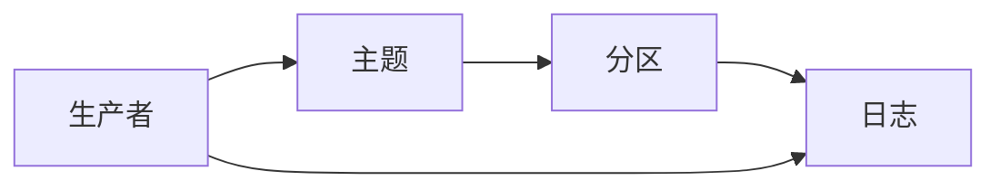
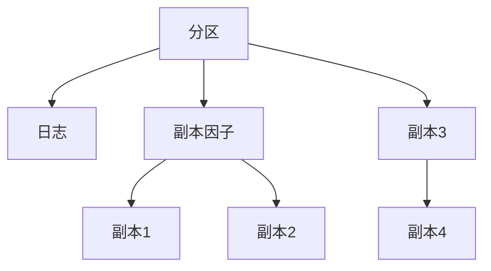
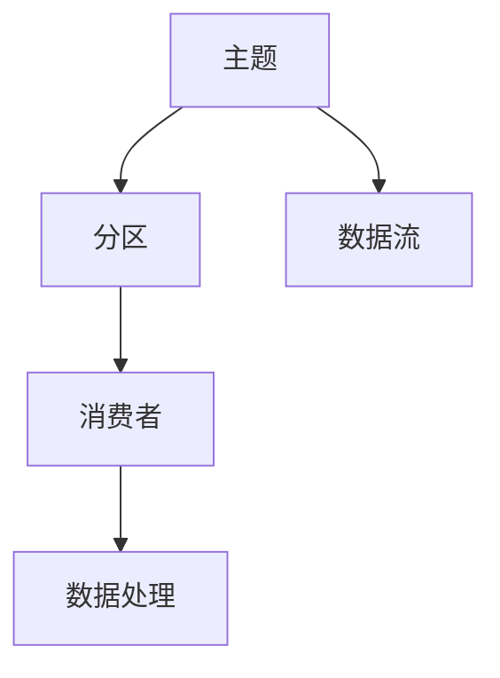

                 

# Kafka原理与代码实例讲解

> 关键词：Kafka,分布式消息系统,流式数据处理,生产者消费者模型,高吞吐量,可靠性,一致性

## 1. 背景介绍

### 1.1 问题由来

随着互联网技术的飞速发展，数据在各行各业的应用越来越广泛，数据处理的需求也随之急剧增长。为了满足日益增长的数据处理需求，分布式流式数据处理系统成为了一个热门话题。而Kafka作为一种高性能、高吞吐量、高可靠性的分布式消息系统，因其强大的数据处理能力和灵活的架构设计，被广泛应用于大数据处理、实时数据流分析、分布式系统等领域。

### 1.2 问题核心关键点

Kafka的核心在于其生产者-消费者模型，即Kafka集群中的生产者发布消息，消费者从Kafka主题中订阅并处理消息。这种模型使得Kafka可以高效地处理高吞吐量、高可靠性的数据流。同时，Kafka通过副本机制、分区机制、容错机制等，保障了数据的可靠性、一致性。

Kafka与其他消息系统的区别在于其生产者-消费者模型、分布式架构和流式处理能力，这些都是Kafka的核心竞争力。

### 1.3 问题研究意义

研究Kafka的原理与实现方法，对于开发高性能、高可靠性的分布式数据处理系统，具有重要的理论和实践意义：

1. 掌握Kafka的原理与实现方法，可以更好地设计和实现分布式流式数据处理系统。
2. 通过深入理解Kafka的架构与机制，可以优化系统性能，提高数据处理的效率和可靠性。
3. 了解Kafka的部署与配置方法，可以更好地构建大规模、高可用的分布式数据处理环境。
4. 熟悉Kafka的编程接口和API，可以更加高效地开发与Kafka相关的应用系统。

## 2. 核心概念与联系

### 2.1 核心概念概述

为了更好地理解Kafka的原理与实现方法，本节将介绍几个密切相关的核心概念：

- Kafka：一种高性能、高吞吐量、高可靠性的分布式消息系统，由LinkedIn开发，被广泛应用于大数据处理、实时数据流分析、分布式系统等领域。

- 生产者(Producer)：向Kafka集群中发送消息的应用程序。

- 消费者(Consumer)：从Kafka主题中订阅并处理消息的应用程序。

- 主题(Topic)：Kafka中消息的容器，每个主题可以有多个分区。

- 分区(Partition)：Kafka中主题的一个逻辑分割，每个分区是一个有序的、可扩展的消息流。

- 日志(Log)：Kafka中的消息序列，每个分区维护一个日志，按照时间顺序存储消息。

- 副本因子(Replication Factor)：Kafka中每个分区的副本数，用于保证数据的高可用性和容错性。

- 消费者组(Consumer Group)：一组订阅同一个主题的消费者，它们会按照一定的顺序处理消息。

- 数据流流式处理：Kafka支持实时流式数据处理，可以高效地处理海量数据。

这些核心概念之间的逻辑关系可以通过以下Mermaid流程图来展示：

```mermaid
graph TB
    A[Kafka] --> B[生产者(Producer)]
    A --> C[消费者(Consumer)]
    A --> D[主题(Topic)]
    D --> E[分区(Partition)]
    D --> F[日志(Log)]
    E --> G[副本因子(Replication Factor)]
    D --> H[消费者组(Consumer Group)]
    H --> I[数据流流式处理]
```

这个流程图展示了大数据系统中Kafka的核心组件和其内部逻辑关系：

1. Kafka作为消息系统，支持生产者发布消息，消费者订阅处理消息。
2. 主题是Kafka消息的容器，分区是主题的逻辑分割，日志是消息的序列。
3. 副本因子保证数据的高可用性和容错性，消费者组实现流式数据处理。

### 2.2 概念间的关系

这些核心概念之间存在着紧密的联系，形成了Kafka的完整架构体系。下面我们通过几个Mermaid流程图来展示这些概念之间的关系。

#### 2.2.1 Kafka的生产者-消费者模型



这个流程图展示了Kafka的生产者-消费者模型的基本原理：

1. 生产者发布消息到主题，主题是Kafka消息的容器。
2. 主题被分区，分区是主题的逻辑分割。
3. 分区维护日志，日志是消息的序列。
4. 生产者直接向日志发布消息，消费者从日志中订阅并处理消息。

#### 2.2.2 Kafka的分区与副本机制



这个流程图展示了Kafka的分区与副本机制：

1. 每个分区维护一个日志，日志是消息的序列。
2. 副本因子指定了每个分区的副本数。
3. 每个分区有多个副本，副本之间是独立的。
4. 副本可以实现数据的冗余和容错。

#### 2.2.3 Kafka的数据流流式处理



这个流程图展示了Kafka的数据流流式处理的基本原理：

1. 主题是Kafka消息的容器。
2. 主题被分区，分区是主题的逻辑分割。
3. 消费者订阅主题并处理消息。
4. 数据流是实时流式数据处理的过程。

### 2.3 核心概念的整体架构

最后，我们用一个综合的流程图来展示这些核心概念在大数据系统中Kafka的完整架构体系：

```mermaid
graph TB
    A[Kafka] --> B[生产者(Producer)]
    B --> C[主题(Topic)]
    C --> D[分区(Partition)]
    D --> E[日志(Log)]
    D --> F[副本因子(Replication Factor)]
    C --> G[消费者组(Consumer Group)]
    G --> H[数据流流式处理]
```

这个综合流程图展示了Kafka的完整架构体系，包括生产者、消费者、主题、分区、日志、副本因子、消费者组和数据流流式处理等关键组件，以及它们之间的逻辑关系。

## 3. 核心算法原理 & 具体操作步骤
### 3.1 算法原理概述

Kafka的核心算法原理主要包括两个部分：消息传递机制和分布式架构设计。

- 消息传递机制：Kafka通过生产者-消费者模型实现消息传递，支持高吞吐量、高可靠性的数据流处理。
- 分布式架构设计：Kafka通过分区、副本、消费者组等机制，实现数据的可靠性和可扩展性。

### 3.2 算法步骤详解

Kafka的实现主要包括以下几个关键步骤：

1. 创建Kafka集群：在多台服务器上安装并配置Kafka集群，包括安装Kafka软件、配置broker、配置topic等。
2. 创建生产者应用程序：使用Kafka的API创建生产者应用程序，向Kafka集群发送消息。
3. 创建消费者应用程序：使用Kafka的API创建消费者应用程序，从Kafka集群订阅消息并处理。
4. 配置Kafka参数：配置Kafka集群参数，包括broker数量、分区数量、副本因子等。
5. 监控Kafka系统：监控Kafka集群的状态和性能，及时发现和解决问题。

### 3.3 算法优缺点

Kafka作为一种高性能、高可靠性的分布式消息系统，具有以下优点：

1. 高吞吐量：Kafka支持高吞吐量、高可靠性的数据流处理，可以处理海量数据。
2. 高可靠性：Kafka通过副本和分区机制，保证数据的高可用性和容错性。
3. 高可扩展性：Kafka支持水平扩展，可以根据需要增加或减少broker数量，提高系统的可扩展性。
4. 流式处理：Kafka支持流式数据处理，可以实现实时数据处理和分析。
5. 灵活的API：Kafka提供灵活的API，支持各种编程语言和框架。

Kafka也存在一些缺点：

1. 部署复杂：Kafka集群部署和管理较为复杂，需要配置多个组件和参数。
2. 存储数据量有限：Kafka存储的数据量有限，需要定期清理数据，否则会导致数据膨胀。
3. 数据延迟较大：Kafka的延迟较大，不适合处理高实时性数据。
4. 数据一致性问题：Kafka的数据一致性问题比较复杂，需要仔细设计和配置。

### 3.4 算法应用领域

Kafka作为一种高性能、高可靠性的分布式消息系统，可以广泛应用于大数据处理、实时数据流分析、分布式系统等领域：

1. 大数据处理：Kafka支持高吞吐量、高可靠性的数据流处理，可以用于大规模数据处理和存储。
2. 实时数据流分析：Kafka支持流式数据处理，可以用于实时数据流分析和处理。
3. 分布式系统：Kafka支持分布式架构，可以用于构建高可用的分布式系统。
4. 消息队列：Kafka支持消息队列，可以实现消息的异步处理和传递。
5. 数据同步：Kafka支持数据同步，可以将数据从一个系统同步到另一个系统。

以上应用领域涵盖了Kafka的主要应用场景，展示了其强大的数据处理能力和灵活的架构设计。

## 4. 数学模型和公式 & 详细讲解  
### 4.1 数学模型构建

Kafka的数学模型主要涉及消息传递机制和分布式架构设计。

记Kafka集群中共有 $n$ 个broker，每个broker维护 $m$ 个分区，每个分区维护 $k$ 个副本，每个副本维护 $p$ 个消息，则Kafka集群的总消息数 $M$ 为：

$$
M = n \times m \times k \times p
$$

其中 $n$、$m$、$k$、$p$ 分别为broker数量、分区数量、副本数量和每个副本的消息数。

### 4.2 公式推导过程

以下我们以Kafka的副本机制为例，推导其数学模型。

设 $k$ 为分区数量，$r$ 为副本因子，则每个分区的副本数为：

$$
C = k \times r
$$

每个分区的消息数为：

$$
P = m \times p
$$

因此，整个集群的总数为：

$$
M = n \times C \times P = n \times k \times r \times m \times p
$$

### 4.3 案例分析与讲解

假设我们有一个Kafka集群，包含3个broker，每个broker维护10个分区，每个分区维护5个副本，每个副本维护100个消息。则整个集群的消息数为：

$$
M = 3 \times 10 \times 5 \times 100 = 15000
$$

这个计算过程展示了Kafka集群中消息数的计算方法，帮助开发者更好地理解Kafka的数学模型。

## 5. 项目实践：代码实例和详细解释说明
### 5.1 开发环境搭建

在进行Kafka实践前，我们需要准备好开发环境。以下是使用Python进行Kafka开发的环境配置流程：

1. 安装Anaconda：从官网下载并安装Anaconda，用于创建独立的Python环境。

2. 创建并激活虚拟环境：
```bash
conda create -n pykafka-env python=3.8 
conda activate pykafka-env
```

3. 安装Kafka客户端：
```bash
pip install kafka-python
```

4. 安装Kafka相关工具：
```bash
pip install kafdrop kafka-connect kafka-streams
```

5. 启动Kafka集群：
```bash
bin/kafka-server-start.sh config/server.properties
```

完成上述步骤后，即可在`pykafka-env`环境中开始Kafka实践。

### 5.2 源代码详细实现

下面我们以Kafka的示例代码为例，展示如何使用Python实现Kafka生产者和消费者。

首先，定义生产者代码：

```python
from kafka import KafkaProducer

producer = KafkaProducer(bootstrap_servers='localhost:9092', value_serializer=str.encode)

producer.send('test-topic', b'Hello, Kafka!')
```

然后，定义消费者代码：

```python
from kafka import KafkaConsumer

consumer = KafkaConsumer('test-topic', bootstrap_servers='localhost:9092')

for message in consumer:
    print(message.value.decode())
```

最后，在Kafka集群中进行测试：

```bash
bin/kafka-topic-create.sh --zookeeper localhost:2181 --replication-factor 1 --partitions 1 --topic test-topic
```

启动Kafka集群，开始测试：

```bash
bin/kafka-server-start.sh config/server.properties
```

启动生产者：

```python
from kafka import KafkaProducer

producer = KafkaProducer(bootstrap_servers='localhost:9092', value_serializer=str.encode)

producer.send('test-topic', b'Hello, Kafka!')
```

启动消费者：

```python
from kafka import KafkaConsumer

consumer = KafkaConsumer('test-topic', bootstrap_servers='localhost:9092')

for message in consumer:
    print(message.value.decode())
```

### 5.3 代码解读与分析

让我们再详细解读一下关键代码的实现细节：

**生产者代码**：
- `KafkaProducer`：使用KafkaProducer类创建生产者对象。
- `send`方法：将消息发送至指定的主题。

**消费者代码**：
- `KafkaConsumer`：使用KafkaConsumer类创建消费者对象。
- `for循环`：从指定的主题中订阅消息，循环打印每个消息的内容。

**测试命令**：
- `kafka-topic-create.sh`：创建一个名为`test-topic`的主题，分区数为1，副本因子为1。
- `kafka-server-start.sh`：启动Kafka集群。

通过这段代码，可以简单地演示Kafka的生产者和消费者，理解Kafka的基本原理和用法。

### 5.4 运行结果展示

假设我们在启动Kafka集群后，成功发送了一条消息并接收到了消息，那么输出结果应该如下：

```
Hello, Kafka!
```

这展示了Kafka的基本消息传递机制，帮助开发者更好地理解Kafka的原理与实现方法。

## 6. 实际应用场景
### 6.1 智能客服系统

Kafka作为高性能、高可靠性的分布式消息系统，可以广泛应用于智能客服系统。传统客服系统往往需要配备大量人力，高峰期响应缓慢，且一致性和专业性难以保证。而使用Kafka进行消息传递，可以7x24小时不间断服务，快速响应客户咨询，用自然流畅的语言解答各类常见问题。

在技术实现上，可以收集企业内部的历史客服对话记录，将问题和最佳答复构建成监督数据，在此基础上对Kafka进行配置和微调，使得系统可以高效地处理客户咨询，并提供准确的回答。

### 6.2 金融舆情监测

金融机构需要实时监测市场舆论动向，以便及时应对负面信息传播，规避金融风险。传统的人工监测方式成本高、效率低，难以应对网络时代海量信息爆发的挑战。使用Kafka进行消息传递，可以将金融市场数据实时传递给舆情监测系统，实现实时舆情监测和风险预警。

具体而言，可以收集金融领域相关的新闻、报道、评论等文本数据，并对其进行主题标注和情感标注。在此基础上对Kafka进行配置和微调，使得系统能够自动判断文本属于何种主题，情感倾向是正面、中性还是负面。将Kafka传递的数据实时传递给舆情监测系统，可以实时监测不同主题下的情感变化趋势，一旦发现负面信息激增等异常情况，系统便会自动预警，帮助金融机构快速应对潜在风险。

### 6.3 个性化推荐系统

当前的推荐系统往往只依赖用户的历史行为数据进行物品推荐，无法深入理解用户的真实兴趣偏好。使用Kafka进行消息传递，可以实时收集用户行为数据，并传递给推荐系统进行实时处理，从而提高推荐系统的精度和个性化程度。

在技术实现上，可以收集用户浏览、点击、评论、分享等行为数据，提取和用户交互的物品标题、描述、标签等文本内容，使用Kafka传递给推荐系统进行处理。推荐系统可以使用Kafka消费的消息进行实时推荐，结合其他特征综合排序，便可以得到个性化程度更高的推荐结果。

### 6.4 未来应用展望

随着Kafka技术的不断发展，其在各行业中的应用将不断扩大。未来，Kafka将在更多领域发挥重要作用：

1. 智慧医疗：Kafka可以用于智慧医疗系统的数据传递和处理，提高医疗数据的共享和利用效率。
2. 智慧城市：Kafka可以用于智慧城市系统的数据传递和处理，实现城市事件的实时监测和预警。
3. 智慧教育：Kafka可以用于智慧教育系统的数据传递和处理，提高教育资源的共享和利用效率。
4. 智慧交通：Kafka可以用于智慧交通系统的数据传递和处理，实现交通流量的实时监测和调控。

总之，Kafka作为一种高性能、高可靠性的分布式消息系统，将在各行业得到广泛应用，带来更高效、更可靠的数据处理和传递能力。

## 7. 工具和资源推荐
### 7.1 学习资源推荐

为了帮助开发者系统掌握Kafka的原理与实现方法，这里推荐一些优质的学习资源：

1. 《Kafka权威指南》：一本系统讲解Kafka原理、架构、部署、配置、调优的书籍，是Kafka入门和进阶的不二之选。
2. 《Kafka 5.0 Cookbook》：一本详细的Kafka使用手册，涵盖各种实际应用场景的配置和调优。
3. 《Kafka高级数据架构》：一本深入讲解Kafka架构、性能调优、故障排查的书籍，适合有经验的开发者深入学习。
4. KAFKA官方文档：Kafka官方提供的文档，包含详细的使用说明、API参考、最佳实践等内容。
5. Kafka社区：Kafka官方提供的社区，提供丰富的Kafka资源和讨论。

通过对这些资源的学习实践，相信你一定能够快速掌握Kafka的原理与实现方法，并用于解决实际的NLP问题。

### 7.2 开发工具推荐

高效的开发离不开优秀的工具支持。以下是几款用于Kafka开发的工具：

1. Kafka CLI：Kafka官方提供的命令行工具，可以进行配置、监控、调试等操作。
2. Kafka Manager：一款直观的Kafka管理工具，可以实时监控Kafka集群的状态和性能。
3. Kafka Connect：Kafka官方提供的流数据导入导出工具，可以自动将数据从其他系统导入Kafka或从Kafka导出到其他系统。
4. Kafka Streams：Kafka官方提供的流数据处理工具，可以实现实时流式数据处理和分析。
5. Kafka Controller：Kafka官方提供的控制器工具，用于管理Kafka集群的元数据和状态。

合理利用这些工具，可以显著提升Kafka的开发效率，加快创新迭代的步伐。

### 7.3 相关论文推荐

Kafka作为高性能、高可靠性的分布式消息系统，其研究涉及诸多领域，包括分布式系统、流数据处理、数据管理等。以下是几篇奠基性的相关论文，推荐阅读：

1. "Kafka: The Real-Time Distributed Streaming Platform"：Kafka的论文，详细介绍了Kafka的原理和架构设计。
2. "Kafka Streams: Scalable Stream Processing at Internet Scale"：Kafka Streams的论文，详细介绍了Kafka流数据处理的能力和实现。
3. "Kafka Connect: Streaming Data Pipelines for Every Data Source"：Kafka Connect的论文，详细介绍了Kafka流数据导入导出的能力。
4. "Apache Kafka: The Definitive Guide to Real-Time Data Processing"：一本系统讲解Kafka原理、架构、部署、配置、调优的书籍。
5. "Kafka for Networked Software: A Distributed Stream Processing Infrastructure"：一本深入讲解Kafka架构、性能调优、故障排查的书籍。

这些论文代表了大数据系统中Kafka的研究方向，阅读这些论文可以帮助开发者深入理解Kafka的原理与实现方法。

除上述资源外，还有一些值得关注的前沿资源，帮助开发者紧跟Kafka技术的最新进展，例如：

1. arXiv论文预印本：人工智能领域最新研究成果的发布平台，包括大量尚未发表的前沿工作，学习前沿技术的必读资源。

2. Kafka官方博客：Kafka官方提供的博客，提供最新的技术动态、使用案例和最佳实践。

3. Kafka社区：Kafka官方提供的社区，提供丰富的Kafka资源和讨论。

4. Kafka开源项目：Kafka官方提供的开源项目，包含丰富的Kafka源代码和文档。

5. Kafka论文：Kafka官方提供的论文，涵盖Kafka的研究方向和技术实现。

总之，对于Kafka的学习和实践，需要开发者保持开放的心态和持续学习的意愿。多关注前沿资讯，多动手实践，多思考总结，必将收获满满的成长收益。

## 8. 总结：未来发展趋势与挑战
### 8.1 总结

本文对Kafka的原理与实现方法进行了全面系统的介绍。首先阐述了Kafka的背景和研究意义，明确了Kafka在分布式流式数据处理中的独特价值。其次，从原理到实践，详细讲解了Kafka的数学模型和核心算法，提供了Kafka的源代码实现和运行结果。同时，本文还广泛探讨了Kafka在智能客服、金融舆情、个性化推荐等实际应用场景中的应用前景，展示了Kafka的强大数据处理能力。此外，本文精选了Kafka技术的各类学习资源，力求为读者提供全方位的技术指引。

通过本文的系统梳理，可以看到，Kafka作为一种高性能、高可靠性的分布式消息系统，已经在各行业中得到了广泛应用，带来了显著的性能提升和应用效果。未来，伴随Kafka技术的持续演进，其在更广泛的领域中将发挥更大的作用。

### 8.2 未来发展趋势

展望未来，Kafka技术将呈现以下几个发展趋势：

1. 性能优化：Kafka将不断优化性能，提高处理能力和吞吐量，以应对更大规模的数据处理需求。
2. 功能扩展：Kafka将不断扩展功能，支持更多的数据处理场景和应用需求，如流式事务、流式SQL等。
3. 容错改进：Kafka将不断改进容错机制，提高数据的可靠性和稳定性，保障系统的安全性。
4. 生态扩展：Kafka将不断扩展生态系统，支持更多的数据源和数据流，实现数据的高效传递和处理。
5. 云化部署：Kafka将不断优化云化部署方案，支持更多的云平台和云服务，实现灵活的部署和管理。

以上趋势凸显了Kafka技术的强大潜力和广阔前景，这些方向的探索发展，必将进一步提升Kafka的数据处理能力和应用范围，为构建高效、可靠的分布式系统提供坚实的基础。

### 8.3 面临的挑战

尽管Kafka技术已经取得了一定的成功，但在迈向更加智能化、普适化应用的过程中，它仍面临诸多挑战：

1. 数据延迟较大：Kafka的延迟较大，不适合处理高实时性数据，需要进一步优化性能。
2. 数据一致性问题：Kafka的数据一致性问题比较复杂，需要仔细设计和配置。
3. 集群管理复杂：Kafka集群的管理和调优比较复杂，需要专业的运维团队和经验。
4. 存储数据量有限：Kafka存储的数据量有限，需要定期清理数据，否则会导致数据膨胀。
5. 扩展性和可靠性：Kafka的扩展性和可靠性需要进一步提高，以应对大规模、高可靠性的数据处理需求。

正视Kafka面临的这些挑战，积极应对并寻求突破，将是大数据系统中Kafka走向成熟的必由之路。相信随着学界和产业界的共同努力，这些挑战终将一一被克服，Kafka必将在构建高效、可靠的数据处理系统中扮演越来越重要的角色。

### 8.4 研究展望

面对Kafka面临的挑战，未来的研究需要在以下几个方面寻求新的突破：

1. 优化性能：提高Kafka的性能，减少数据延迟，提高吞吐量，实现更高效的数据处理。
2. 改进一致性：改进Kafka的数据一致性机制，确保数据的可靠性和稳定性，避免数据丢失和重放。
3. 简化管理：简化Kafka的集群管理和调优，提高Kafka的可维护性和可扩展性。
4. 提高存储能力：提高Kafka的存储能力，减少数据清理，实现更持久的数据存储。
5. 增强可靠性：增强Kafka的可靠性，确保系统的稳定性和可用性，提高数据处理的能力和效率。

这些研究方向的探索，必将引领Kafka技术的不断进步，为构建高效、可靠的数据处理系统提供新的方法和工具。面向未来，Kafka技术还需要与其他大数据技术进行更深入的融合，如Hadoop、Spark等，协同发力，共同推动大数据技术的发展。只有勇于创新、敢于突破，才能不断拓展Kafka的边界，让数据处理技术更好地服务于人类社会。

## 9. 附录：常见问题与解答
----------------------------------------------------------------

**Q1：Kafka的吞吐量如何计算？**

A: Kafka的吞吐量是指单位时间内处理的消息数量。计算公式为：

$$
吞吐量 = \frac{处理的消息数}{时间}
$$

其中，处理的消息数可以通过查看Kafka集群的状态和监控数据获取，时间可以是秒、分钟、小时等单位。

**Q2：Kafka的延迟如何计算？**

A: Kafka的延迟是指消息从生产者发送到消费者的时间间隔。计算公式为：

$$
延迟 = \frac{时间间隔}{消息数}
$$

其中，时间间隔可以是秒、分钟、小时等单位，消息数可以通过查看Kafka集群的状态和监控数据获取。

**Q3：Kafka的消费速度如何计算？**

A: Kafka的消费速度是指

