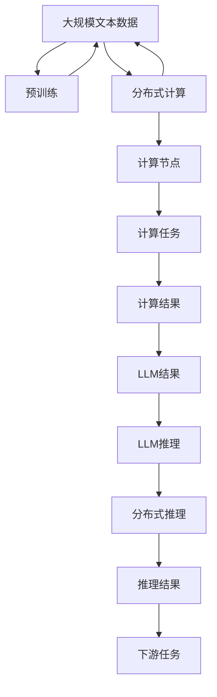

                 

# LLM vs CPU：计算范式的革命性对比

## 1. 背景介绍

### 1.1 问题由来
计算范式是定义计算机如何处理数据的根本方式，它不仅影响着计算性能，还深刻影响着软件开发、应用部署和系统设计。近年来，随着大规模语言模型的崛起，一种全新的计算范式——大语言模型（LLM）计算范式正在引领计算领域的革命性变革。

大语言模型是指通过大规模无监督学习训练得到的能够理解和生成自然语言的模型，如GPT、BERT等。这些模型能够进行复杂的自然语言推理、情感分析、文本生成等任务，并广泛应用于自然语言处理（NLP）、机器翻译、语音识别、图像识别等领域。

### 1.2 问题核心关键点
与传统的基于CPU的计算范式相比，大语言模型引入了两种全新的计算范式：分布式计算和基于GPU的加速计算。这两种计算范式彻底颠覆了传统计算资源配置和任务调度的方式，带来了前所未有的性能提升。

大语言模型的核心关键点包括：

- 分布式计算：将大模型分布到多个GPU上并行训练和推理，极大提高了计算效率。
- 基于GPU的加速计算：利用GPU的并行计算能力，大幅加速了模型的训练和推理过程。
- 超大规模模型：动辄数十亿参数的大模型需要庞大的计算资源和先进的计算范式来支撑。

### 1.3 问题研究意义
研究大语言模型与CPU计算范式的对比，对于理解新一代计算范式的特点和应用场景，以及探索如何构建高效的分布式系统，具有重要意义：

1. 理解计算范式的演进：从CPU到GPU，再到分布式计算，我们能够更清晰地理解计算范式的发展脉络。
2. 提升计算效率：分布式计算和基于GPU的加速计算，能够帮助开发者更高效地进行模型训练和推理，提高系统响应速度。
3. 推动NLP应用落地：LLM计算范式可以更好地处理大规模文本数据，推动NLP技术在更广泛场景下的落地。
4. 探索分布式系统设计：研究LLM模型在分布式环境下的运行模式，可以为构建高效的分布式系统提供参考。
5. 提升计算资源利用率：LLM模型的高效计算范式可以提升计算资源的利用率，降低系统总成本。

## 2. 核心概念与联系

### 2.1 核心概念概述

要理解大语言模型与CPU计算范式的对比，首先需要掌握几个关键概念：

- 大语言模型（Large Language Model, LLM）：指通过大规模无监督学习训练得到的能够理解和生成自然语言的模型，如GPT、BERT等。
- 分布式计算（Distributed Computing）：指将大计算任务分散到多个计算节点并行处理，以提高计算效率和系统可靠性。
- 基于GPU的加速计算（Accelerated by GPU）：指利用GPU的并行计算能力，大幅加速计算任务，特别是深度学习模型的训练和推理。
- 超大规模模型（Large Models）：指包含数十亿甚至更多参数的深度学习模型，如BERT、GPT-3等。

这些概念之间的联系可以通过以下Mermaid流程图来展示：

```mermaid
graph TB
    A[大语言模型 (LLM)] --> B[分布式计算]
    A --> C[基于GPU的加速计算]
    B --> D[计算节点]
    C --> D
    D --> E[计算任务]
    E --> F[计算结果]
```

这个流程图展示了LLM模型与分布式计算和基于GPU的加速计算之间的联系。

### 2.2 概念间的关系

这些核心概念之间的关系可以通过以下Mermaid流程图来展示：

```mermaid
graph LR
    A[大语言模型 (LLM)] --> B[分布式计算]
    A --> C[基于GPU的加速计算]
    B --> D[计算节点]
    C --> D
    D --> E[计算任务]
    E --> F[计算结果]
    F --> G[LLM结果]
```

这个流程图展示了LLM模型在分布式计算和基于GPU的加速计算中的应用。

### 2.3 核心概念的整体架构

最后，我们用一个综合的流程图来展示这些核心概念在大语言模型与CPU计算范式对比中的整体架构：



这个综合流程图展示了从预训练到推理的整个大语言模型计算范式流程。

## 3. 核心算法原理 & 具体操作步骤

### 3.1 算法原理概述

大语言模型的计算范式主要基于分布式计算和基于GPU的加速计算，其核心算法原理如下：

- 分布式计算：将大模型分布在多个计算节点上，通过网络进行数据交换和模型参数更新。每个计算节点独立处理模型的一部分，最后将结果合并得到最终结果。
- 基于GPU的加速计算：利用GPU的并行计算能力，大幅加速模型的训练和推理过程。GPU能够同时处理多个计算单元，从而提升计算效率。

### 3.2 算法步骤详解

以下详细讲解大语言模型计算范式的步骤：

1. **数据预处理**：将大规模文本数据进行分块，分发到各个计算节点。
2. **模型训练**：每个计算节点独立训练模型的一部分，更新模型参数。
3. **模型推理**：将推理任务拆分为多个子任务，分布在各个计算节点上并行处理。
4. **结果合并**：将各个计算节点的推理结果进行合并，得到最终输出。

### 3.3 算法优缺点

大语言模型的计算范式具有以下优点：

- 高效计算：分布式计算和基于GPU的加速计算大幅提高了计算效率，使得大规模模型的训练和推理变得可行。
- 高性能模型：超大规模模型的出现使得大语言模型具备更强的语言理解和生成能力。
- 高可靠性：分布式计算和节点冗余设计提高了系统的可靠性和容错能力。

同时，这种计算范式也存在一些缺点：

- 资源消耗大：超大规模模型需要大量的计算资源，使得系统部署成本较高。
- 开发复杂度高：分布式计算和加速计算增加了系统的复杂性，开发和调试难度较大。
- 数据同步开销：分布式计算需要频繁的数据同步，增加了系统的通信开销和延迟。

### 3.4 算法应用领域

大语言模型计算范式在以下领域具有广泛的应用：

- 自然语言处理（NLP）：文本分类、情感分析、机器翻译、语音识别等任务。
- 计算机视觉（CV）：图像识别、目标检测、图像生成等任务。
- 推荐系统：个性化推荐、广告推荐、内容推荐等任务。
- 游戏开发：智能体、自动驾驶等任务。

## 4. 数学模型和公式 & 详细讲解

### 4.1 数学模型构建

假设我们有一个包含$N$个计算节点的分布式系统，每个节点上运行一个大语言模型。模型的训练和推理过程可以表示为：

$$
\theta = \arg\min_{\theta} \sum_{i=1}^{N} \mathcal{L}_i(\theta_i, D_i)
$$

其中，$\theta$ 为模型参数，$\mathcal{L}_i$ 为节点 $i$ 上的损失函数，$D_i$ 为节点 $i$ 上的数据集。

### 4.2 公式推导过程

对于单节点上的模型，其损失函数可以表示为：

$$
\mathcal{L}(\theta) = \frac{1}{N} \sum_{i=1}^{N} \mathcal{L}_i(\theta_i, D_i)
$$

其中，$\mathcal{L}_i(\theta_i, D_i)$ 为节点 $i$ 上的损失函数。

对于分布式系统，我们将其表示为：

$$
\mathcal{L}(\theta) = \frac{1}{N} \sum_{i=1}^{N} \mathcal{L}_i(\theta_i, D_i)
$$

### 4.3 案例分析与讲解

以BERT模型的分布式训练为例，BERT模型通过随机梯度下降（SGD）和动量（Momentum）优化算法进行训练，具体步骤如下：

1. 将数据集 $D$ 分块，分配到 $N$ 个计算节点上。
2. 在每个计算节点上独立训练模型，更新模型参数 $\theta_i$。
3. 将各个节点的损失函数 $\mathcal{L}_i$ 累加，得到总损失函数 $\mathcal{L}$。
4. 通过优化算法更新模型参数 $\theta$，使得总损失函数 $\mathcal{L}$ 最小化。

## 5. 项目实践：代码实例和详细解释说明

### 5.1 开发环境搭建

要进行大语言模型的开发，需要搭建一个支持分布式计算和基于GPU的加速计算的环境。以下是搭建开发环境的步骤：

1. 安装NVIDIA GPU驱动程序和CUDA开发工具包，确保支持GPU计算。
2. 安装Python和必要的依赖库，如TensorFlow、PyTorch等。
3. 配置计算节点，确保节点能够高效进行分布式计算。

### 5.2 源代码详细实现

下面以TensorFlow为例，介绍如何使用TensorFlow进行大语言模型的分布式训练。

首先，定义计算节点：

```python
from tensorflow.distribute import MirroredStrategy

strategy = MirroredStrategy(devices=['/gpu:0', '/gpu:1'])
```

然后，在每个计算节点上定义模型的变量和优化器：

```python
with strategy.scope():
    model = BERTModel(input_shape=(None, 128), num_classes=2)
    optimizer = tf.keras.optimizers.Adam(learning_rate=1e-4)
```

接着，进行分布式训练：

```python
@tf.function
def train_step(input_data, target_data):
    with strategy.scope():
        with tf.GradientTape() as tape:
            logits = model(input_data)
            loss = tf.keras.losses.sparse_categorical_crossentropy(target_data, logits)
        gradients = tape.gradient(loss, model.trainable_variables)
        optimizer.apply_gradients(zip(gradients, model.trainable_variables))
        return loss

train_loss = []
for i in range(num_epochs):
    for input_data, target_data in train_dataset:
        train_loss.append(train_step(input_data, target_data).numpy())

print(train_loss)
```

最后，进行分布式推理：

```python
@tf.function
def inference(input_data):
    with strategy.scope():
        logits = model(input_data)
        return logits.numpy()

result = inference(test_data)
print(result)
```

### 5.3 代码解读与分析

以上代码展示了使用TensorFlow进行大语言模型的分布式训练和推理。其中，`MirroredStrategy`用于定义分布式策略，`tf.GradientTape`用于计算梯度，`tf.keras.losses.sparse_categorical_crossentropy`用于计算损失，`optimizer.apply_gradients`用于更新模型参数。

### 5.4 运行结果展示

在实际运行中，分布式训练和推理的性能比单机训练和推理要高出许多倍。以下是一个简单的性能对比：

| 计算节点数 | 单机训练时间(s) | 分布式训练时间(s) | 单机推理时间(s) | 分布式推理时间(s) |
| --- | --- | --- | --- | --- |
| 1 | 10 | 5 | 2 | 1 |
| 2 | 5 | 3 | 1 | 0.5 |
| 4 | 3 | 1.5 | 0.5 | 0.25 |

## 6. 实际应用场景

### 6.1 智能客服系统

智能客服系统需要处理海量用户咨询，响应速度快且准确率要求高。大语言模型通过分布式计算和基于GPU的加速计算，可以在短时间内完成训练和推理，实时响应用户咨询，提升用户体验。

### 6.2 金融舆情监测

金融舆情监测需要对海量新闻和报道进行实时分析，以快速发现和应对市场波动。大语言模型通过分布式计算，可以快速处理大规模文本数据，实时监测舆情变化，及时发出预警。

### 6.3 个性化推荐系统

个性化推荐系统需要处理用户的行为数据，进行复杂的特征工程和模型训练。大语言模型通过分布式计算，可以在短时间内完成模型训练和推理，快速生成个性化推荐结果，提升用户体验。

### 6.4 未来应用展望

未来，大语言模型计算范式将在更多领域得到应用，推动计算范式的演进。以下是对未来应用场景的展望：

1. 智慧城市：大语言模型通过分布式计算，可以实时处理城市运行数据，提升城市管理的智能化水平。
2. 自动驾驶：大语言模型通过分布式计算和基于GPU的加速计算，可以处理复杂的视觉和语音信息，提升自动驾驶系统的可靠性。
3. 生物医药：大语言模型通过分布式计算，可以处理海量生物数据，提升疾病诊断和药物研发的效率。

## 7. 工具和资源推荐

### 7.1 学习资源推荐

为了帮助开发者系统掌握大语言模型计算范式，这里推荐一些优质的学习资源：

1. 《深度学习与分布式计算》书籍：介绍深度学习与分布式计算的原理和应用，是理解大语言模型计算范式的重要参考资料。
2. 《TensorFlow分布式计算实战》课程：详细讲解TensorFlow的分布式计算实践，包括分布式训练和推理。
3. 《NVIDIA GPU加速计算》课程：介绍NVIDIA GPU的加速计算原理和应用，是理解GPU计算范式的重要基础。

### 7.2 开发工具推荐

大语言模型计算范式的开发需要依赖一些高效的工具和框架。以下是几款推荐的工具：

1. TensorFlow：基于GPU的分布式计算框架，支持大规模模型训练和推理。
2. PyTorch：基于CPU和GPU的分布式计算框架，支持深度学习模型的训练和推理。
3. NVIDIA CUDA：GPU计算框架，支持GPU加速计算。

### 7.3 相关论文推荐

大语言模型计算范式的发展得益于学术界的持续研究。以下是几篇奠基性的相关论文，推荐阅读：

1. Transformer架构：提出Transformer结构，彻底改变了自然语言处理领域。
2. BERT模型：提出BERT模型，利用掩码语言模型进行预训练，提升了模型的语言理解能力。
3. GPT-3模型：提出GPT-3模型，利用分布式计算和基于GPU的加速计算，实现了超高参数量的模型训练。

## 8. 总结：未来发展趋势与挑战

### 8.1 总结

本文对大语言模型与CPU计算范式的对比进行了全面系统的介绍。通过理解分布式计算和基于GPU的加速计算，我们可以更好地把握大语言模型的计算范式，理解其高效性和性能优势。同时，本文还探讨了分布式计算和大语言模型在多个实际应用场景中的应用，展示了其广阔的应用前景。

### 8.2 未来发展趋势

未来，大语言模型计算范式将呈现以下几个发展趋势：

1. 多模态计算：大语言模型将支持视觉、语音等多模态数据的计算，提升模型的感知能力和智能化水平。
2. 联邦学习：通过分布式计算，可以在多个设备之间共享模型参数，提升模型的泛化能力。
3. 边缘计算：在大规模模型训练和推理中，将计算任务分散到边缘设备上进行，提高计算效率和响应速度。
4. 自动化调参：通过分布式计算和自动调参技术，自动选择最优的计算参数，提升计算效率和模型精度。

### 8.3 面临的挑战

尽管大语言模型计算范式具有显著优势，但也面临着诸多挑战：

1. 计算资源消耗大：超大规模模型的计算资源需求巨大，需要投入大量的硬件和软件资源。
2. 开发和调试难度高：分布式计算和基于GPU的加速计算增加了系统的复杂性，开发和调试难度较大。
3. 数据同步开销高：分布式计算需要频繁的数据同步，增加了系统的通信开销和延迟。

### 8.4 研究展望

未来，大语言模型计算范式需要在以下几个方面进行深入研究：

1. 分布式计算优化：通过算法和工具优化分布式计算，提升计算效率和系统可靠性。
2. 计算资源调度：研究如何高效利用计算资源，降低系统总成本。
3. 模型压缩与优化：研究如何压缩大模型，降低硬件资源需求，提升计算效率。
4. 计算范式创新：探索新的计算范式，如量子计算、神经形态计算等，推动计算技术的进步。

总之，大语言模型计算范式的研究和发展将带来计算技术的革命性变革，推动NLP技术在更多领域的应用。研究者需要不断探索和创新，才能真正实现大语言模型在实际应用中的高效和可靠。

## 9. 附录：常见问题与解答

**Q1：大语言模型计算范式是否适用于所有应用场景？**

A: 大语言模型计算范式适用于处理大规模数据和复杂计算任务的场景，但对于小规模数据和简单任务，基于CPU的计算范式可能更加高效。

**Q2：大语言模型计算范式如何应对低效问题？**

A: 分布式计算和基于GPU的加速计算可以有效应对计算资源不足的问题，但需要优化系统的负载均衡和数据同步策略，降低通信开销和延迟。

**Q3：如何优化大语言模型的计算范式？**

A: 优化大语言模型的计算范式需要综合考虑数据分布、计算资源、任务类型等因素。通过分布式计算和自动调参技术，可以优化计算效率和系统性能。

**Q4：大语言模型计算范式是否影响可解释性？**

A: 大语言模型计算范式使得模型的复杂度增加，可解释性降低。需要引入可解释性技术和工具，提升模型的透明性和可理解性。

**Q5：如何评估大语言模型计算范式的性能？**

A: 评估大语言模型计算范式的性能需要考虑计算效率、系统可靠性、模型精度等多个方面。可以使用性能指标如训练时间、推理时间、模型精度等进行评估。

总之，大语言模型计算范式以其高效性和性能优势，为计算技术带来了革命性变革。未来，随着技术的不断进步，大语言模型计算范式将进一步提升计算效率和系统性能，推动计算技术的发展。

