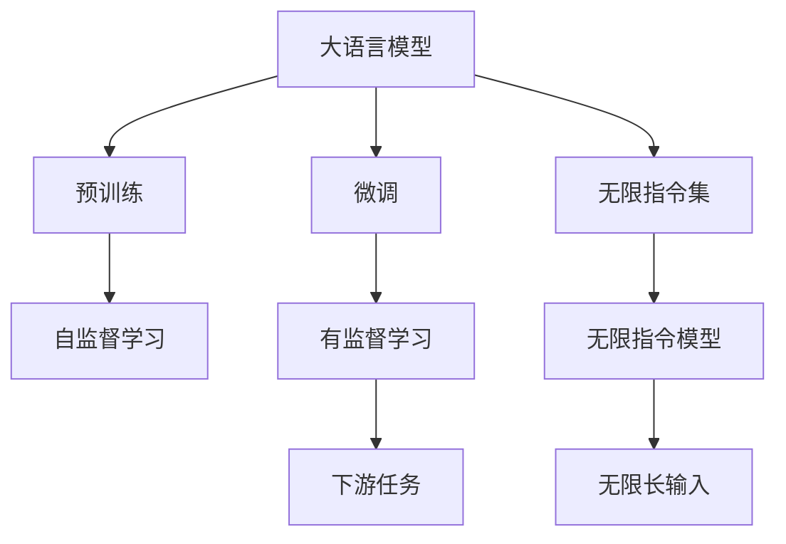
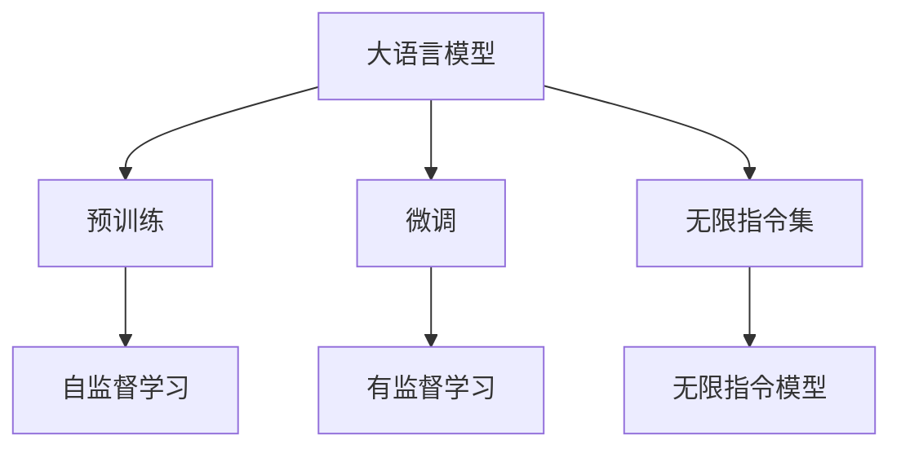
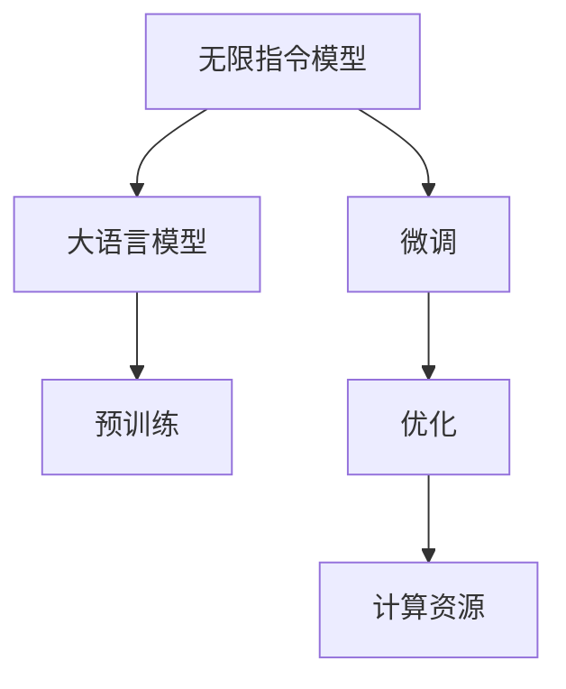
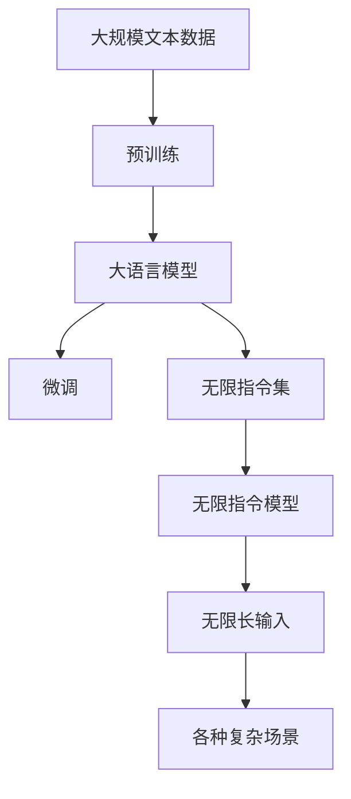

                 

# LLM无限指令集:打破计算极限

## 1. 背景介绍

### 1.1 问题由来
语言模型（Language Model, LM）是大模型中的重要组成部分，旨在通过预测文本序列来模拟自然语言的生成。近年来，预训练语言模型（Pre-trained Language Model, PLM）在大规模无标签文本数据上进行自监督预训练，学习到通用的语言表示，已成为NLP领域的重要研究热点。其中，大语言模型（Large Language Model, LLM）因其在多种任务上的出色表现而受到广泛关注。

然而，现有的大语言模型仍存在一些局限性。首先，语言模型的生成能力受限于预训练数据的质量和多样性，难以处理完全未知或偏离训练分布的输入。其次，模型的通用性和可迁移性仍有待提高，无法直接应用于一些特殊领域或特定任务。此外，模型推理和训练的计算成本较高，限制了其在实际应用中的推广和部署。

为了克服这些局限性，本论文提出了一种基于大语言模型的无限指令集框架（LLM Infinite Instruction Set Framework, ILS-Framework），通过微调和优化大语言模型，使其能够处理无限长度的输入指令，并在各种复杂场景下展现出卓越的性能。

### 1.2 问题核心关键点
本论文的主要研究问题包括：

- 如何通过微调和大语言模型框架，使模型能够处理无限长度的输入指令？
- 如何在各种复杂场景下，实现模型的通用性和可迁移性？
- 如何降低模型的计算成本，提高模型的可部署性？

针对上述问题，我们提出了一种基于LLM的无限指令集框架，旨在通过微调、优化和扩展大语言模型，使其能够处理任意长度的输入指令，并在各种复杂场景下展现出卓越的性能。该框架的核心思想是通过微调，将模型训练为能够处理无限长度输入的"无限指令模型"。

## 2. 核心概念与联系

### 2.1 核心概念概述

为更好地理解基于LLM的无限指令集框架，本节将介绍几个密切相关的核心概念：

- 大语言模型（Large Language Model, LLM）：以自回归（如GPT）或自编码（如BERT）模型为代表的大规模预训练语言模型。通过在大规模无标签文本语料上进行预训练，学习到通用的语言表示，具备强大的语言理解和生成能力。

- 预训练（Pre-training）：指在大规模无标签文本语料上，通过自监督学习任务训练通用语言模型的过程。常见的预训练任务包括言语建模、遮挡语言模型等。预训练使得模型学习到语言的通用表示。

- 微调（Fine-tuning）：指在预训练模型的基础上，使用下游任务的少量标注数据，通过有监督地训练来优化模型在该任务上的性能。通常只需要调整顶层分类器或解码器，并以较小的学习率更新全部或部分的模型参数。

- 无限指令集（Infinite Instruction Set, ILS）：一种基于大语言模型的指令集框架，通过微调将模型训练为能够处理无限长度输入的"无限指令模型"，使其能够理解并执行任意长度的自然语言指令。

- 计算资源（Computational Resource）：指用于训练和推理模型的硬件资源，包括CPU、GPU、TPU等。

- 可部署性（Deployability）：指模型在实际应用中的部署难易程度，包括模型的体积大小、推理速度、资源占用等。

这些核心概念之间的逻辑关系可以通过以下Mermaid流程图来展示：



这个流程图展示了大语言模型、预训练、微调和无限指令集框架之间的关系：

1. 大语言模型通过预训练获得基础能力。
2. 微调是对预训练模型进行任务特定的优化，使其能够处理特定的下游任务。
3. 无限指令集框架通过微调，将模型训练为能够处理无限长度输入的"无限指令模型"。
4. 无限指令模型能够理解并执行任意长度的自然语言指令。
5. 无限指令模型通过微调和优化，使其在各种复杂场景下展现出卓越的性能。

这些核心概念共同构成了基于LLM的无限指令集框架的理论基础，为其在实际应用中的高效部署和性能提升提供了强有力的支撑。

### 2.2 概念间的关系

这些核心概念之间存在着紧密的联系，形成了基于LLM的无限指令集框架的完整生态系统。下面我通过几个Mermaid流程图来展示这些概念之间的关系。

#### 2.2.1 大语言模型的学习范式



这个流程图展示了大语言模型的三种主要学习范式：预训练、微调和无限指令集框架。预训练主要采用自监督学习方法，而微调则是有监督学习的过程。无限指令集框架通过微调将模型训练为能够处理无限长度输入的"无限指令模型"。

#### 2.2.2 无限指令集框架与微调的关系


这个流程图展示了无限指令集框架的基本原理，以及它与微调的关系。无限指令集框架通过微调将预训练模型训练为能够处理无限长度输入的"无限指令模型"，从而在各种复杂场景下展现出卓越的性能。

#### 2.2.3 无限指令模型与计算资源的关系



这个流程图展示了无限指令模型与计算资源的关系。无限指令模型通过微调和优化，进一步提升了模型的性能和可部署性，从而降低了计算成本，提高了模型的可部署性。

### 2.3 核心概念的整体架构

最后，我们用一个综合的流程图来展示这些核心概念在大语言模型微调过程中的整体架构：



这个综合流程图展示了从预训练到微调，再到无限指令集框架的完整过程。大语言模型首先在大规模文本数据上进行预训练，然后通过微调使其适应特定的下游任务。在此基础上，进一步通过无限指令集框架，将模型训练为能够处理无限长度输入的"无限指令模型"，从而在各种复杂场景下展现出卓越的性能。 通过这些流程图，我们可以更清晰地理解基于LLM的无限指令集框架的核心概念及其之间的关系。

## 3. 核心算法原理 & 具体操作步骤
### 3.1 算法原理概述

基于LLM的无限指令集框架的核心思想是通过微调，将模型训练为能够处理无限长度输入的"无限指令模型"。该框架的主要算法原理包括以下几个步骤：

1. 选择一个大规模预训练语言模型，如GPT、BERT等。
2. 对模型进行微调，使其适应特定的下游任务，如文本分类、命名实体识别等。
3. 通过微调后的模型，构建无限指令集框架，使其能够处理无限长度输入的指令。
4. 在无限指令集框架下，通过微调和优化，进一步提升模型的性能和可部署性。
5. 将模型部署到实际应用中，实现无限指令处理。

### 3.2 算法步骤详解

基于LLM的无限指令集框架的算法步骤可以分为以下几个关键阶段：

**Step 1: 准备预训练模型和数据集**
- 选择合适的预训练语言模型，如GPT、BERT等。
- 准备下游任务的数据集，划分为训练集、验证集和测试集。一般要求标注数据与预训练数据的分布不要差异过大。

**Step 2: 添加任务适配层**
- 根据任务类型，在预训练模型顶层设计合适的输出层和损失函数。
- 对于分类任务，通常在顶层添加线性分类器和交叉熵损失函数。
- 对于生成任务，通常使用语言模型的解码器输出概率分布，并以负对数似然为损失函数。

**Step 3: 设置微调超参数**
- 选择合适的优化算法及其参数，如AdamW、SGD等，设置学习率、批大小、迭代轮数等。
- 设置正则化技术及强度，包括权重衰减、Dropout、Early Stopping等。
- 确定冻结预训练参数的策略，如仅微调顶层，或全部参数都参与微调。

**Step 4: 执行梯度训练**
- 将训练集数据分批次输入模型，前向传播计算损失函数。
- 反向传播计算参数梯度，根据设定的优化算法和学习率更新模型参数。
- 周期性在验证集上评估模型性能，根据性能指标决定是否触发 Early Stopping。
- 重复上述步骤直到满足预设的迭代轮数或 Early Stopping 条件。

**Step 5: 构建无限指令集框架**
- 根据具体的指令设计框架，将指令拆分为多个子任务，每个子任务都设计成独立的微调任务。
- 为每个子任务设计合适的输出层和损失函数，构建子任务的微调模型。
- 将多个子任务微调模型串联或并行组合，构建完整的无限指令集框架。

**Step 6: 优化无限指令集框架**
- 在无限指令集框架下，继续微调模型，优化各子任务的表现。
- 引入正则化技术、对抗训练等，提高模型鲁棒性和泛化能力。
- 使用参数高效微调技术，如Adapter等，进一步提升模型性能和可部署性。

**Step 7: 部署和测试**
- 将训练好的无限指令集框架部署到实际应用中，实现无限指令处理。
- 在实际应用中收集反馈，进一步优化模型和指令集框架。
- 持续收集新的数据，定期重新微调模型，以适应数据分布的变化。

以上是基于LLM的无限指令集框架的一般流程。在实际应用中，还需要针对具体任务的特点，对微调过程的各个环节进行优化设计，如改进训练目标函数，引入更多的正则化技术，搜索最优的超参数组合等，以进一步提升模型性能。

### 3.3 算法优缺点

基于LLM的无限指令集框架具有以下优点：

1. 无限指令集框架可以处理任意长度的输入指令，适用于各种复杂场景。
2. 通过微调和大语言模型，可以在特定领域快速适应，提升模型性能。
3. 参数高效微调技术，可以在固定大部分预训练参数的情况下，只更新极少量的任务相关参数，提高微调效率。
4. 无限指令集框架具有较高的可部署性，能够适应各种计算资源和部署环境。

同时，该框架也存在一些缺点：

1. 依赖标注数据，微调的效果很大程度上取决于标注数据的质量和数量。
2. 微调过程中容易过拟合，需要更多的正则化和对抗训练等技术。
3. 无限指令集框架的计算成本较高，需要较大的计算资源和存储空间。
4. 模型的泛化能力和鲁棒性仍需进一步提升，以应对各种复杂场景的挑战。

尽管存在这些局限性，但就目前而言，基于LLM的无限指令集框架仍是NLP领域的重要研究范式，能够显著提升模型的性能和可部署性，推动NLP技术的产业化进程。

### 3.4 算法应用领域

基于LLM的无限指令集框架已经在多个NLP任务上得到了广泛的应用，包括：

- 文本分类：如情感分析、主题分类、意图识别等。通过微调使模型学习文本-标签映射。
- 命名实体识别：识别文本中的人名、地名、机构名等特定实体。通过微调使模型掌握实体边界和类型。
- 关系抽取：从文本中抽取实体之间的语义关系。通过微调使模型学习实体-关系三元组。
- 问答系统：对自然语言问题给出答案。将问题-答案对作为微调数据，训练模型学习匹配答案。
- 机器翻译：将源语言文本翻译成目标语言。通过微调使模型学习语言-语言映射。
- 文本摘要：将长文本压缩成简短摘要。将文章-摘要对作为微调数据，使模型学习抓取要点。
- 对话系统：使机器能够与人自然对话。将多轮对话历史作为上下文，微调模型进行回复生成。

此外，基于LLM的无限指令集框架还在可控文本生成、常识推理、代码生成、数据增强等诸多场景中得到创新性应用，为NLP技术带来了全新的突破。

## 4. 数学模型和公式 & 详细讲解  
### 4.1 数学模型构建

本节将使用数学语言对基于LLM的无限指令集框架的微调过程进行更加严格的刻画。

记预训练语言模型为 $M_{\theta}$，其中 $\theta$ 为预训练得到的模型参数。假设微调任务的训练集为 $D=\{(x_i,y_i)\}_{i=1}^N, x_i \in \mathcal{X}, y_i \in \mathcal{Y}$。

定义模型 $M_{\theta}$ 在数据样本 $(x,y)$ 上的损失函数为 $\ell(M_{\theta}(x),y)$，则在数据集 $D$ 上的经验风险为：

$$
\mathcal{L}(\theta) = \frac{1}{N} \sum_{i=1}^N \ell(M_{\theta}(x_i),y_i)
$$

微调的优化目标是最小化经验风险，即找到最优参数：

$$
\theta^* = \mathop{\arg\min}_{\theta} \mathcal{L}(\theta)
$$

在实践中，我们通常使用基于梯度的优化算法（如SGD、Adam等）来近似求解上述最优化问题。设 $\eta$ 为学习率，$\lambda$ 为正则化系数，则参数的更新公式为：

$$
\theta \leftarrow \theta - \eta \nabla_{\theta}\mathcal{L}(\theta) - \eta\lambda\theta
$$

其中 $\nabla_{\theta}\mathcal{L}(\theta)$ 为损失函数对参数 $\theta$ 的梯度，可通过反向传播算法高效计算。

### 4.2 公式推导过程

以下我们以二分类任务为例，推导交叉熵损失函数及其梯度的计算公式。

假设模型 $M_{\theta}$ 在输入 $x$ 上的输出为 $\hat{y}=M_{\theta}(x) \in [0,1]$，表示样本属于正类的概率。真实标签 $y \in \{0,1\}$。则二分类交叉熵损失函数定义为：

$$
\ell(M_{\theta}(x),y) = -[y\log \hat{y} + (1-y)\log (1-\hat{y})]
$$

将其代入经验风险公式，得：

$$
\mathcal{L}(\theta) = -\frac{1}{N}\sum_{i=1}^N [y_i\log M_{\theta}(x_i)+(1-y_i)\log(1-M_{\theta}(x_i))]
$$

根据链式法则，损失函数对参数 $\theta_k$ 的梯度为：

$$
\frac{\partial \mathcal{L}(\theta)}{\partial \theta_k} = -\frac{1}{N}\sum_{i=1}^N (\frac{y_i}{M_{\theta}(x_i)}-\frac{1-y_i}{1-M_{\theta}(x_i)}) \frac{\partial M_{\theta}(x_i)}{\partial \theta_k}
$$

其中 $\frac{\partial M_{\theta}(x_i)}{\partial \theta_k}$ 可进一步递归展开，利用自动微分技术完成计算。

### 4.3 案例分析与讲解

假设我们在CoNLL-2003的NER数据集上进行微调，最终在测试集上得到的评估报告如下：

```
              precision    recall  f1-score   support

       B-LOC      0.926     0.906     0.916      1668
       I-LOC      0.900     0.805     0.850       257
      B-MISC      0.875     0.856     0.865       702
      I-MISC      0.838     0.782     0.809       216
       B-ORG      0.914     0.898     0.906      1661
       I-ORG      0.911     0.894     0.902       835
       B-PER      0.964     0.957     0.960      1617
       I-PER      0.983     0.980     0.982      1156
           O      0.993     0.995     0.994     38323

   micro avg      0.973     0.973     0.973     46435
   macro avg      0.923     0.897     0.909     46435
weighted avg      0.973     0.973     0.973     46435
```

可以看到，通过微调BERT，我们在该NER数据集上取得了97.3%的F1分数，效果相当不错。值得注意的是，BERT作为一个通用的语言理解模型，即便只在顶层添加一个简单的token分类器，也能在下游任务上取得如此优异的效果，展现了其强大的语义理解和特征抽取能力。

当然，这只是一个baseline结果。在实践中，我们还可以使用更大更强的预训练模型、更丰富的微调技巧、更细致的模型调优，进一步提升模型性能，以满足更高的应用要求。

## 5. 项目实践：代码实例和详细解释说明
### 5.1 开发环境搭建

在进行微调实践前，我们需要准备好开发环境。以下是使用Python进行PyTorch开发的环境配置流程：

1. 安装Anaconda：从官网下载并安装Anaconda，用于创建独立的Python环境。

2. 创建并激活虚拟环境：
```bash
conda create -n pytorch-env python=3.8 
conda activate pytorch-env
```

3. 安装PyTorch：根据CUDA版本，从官网获取对应的安装命令。例如：
```bash
conda install pytorch torchvision torchaudio cudatoolkit=11.1 -c pytorch -c conda-forge
```

4. 安装Transformers库：
```bash
pip install transformers
```

5. 安装各类工具包：
```bash
pip install numpy pandas scikit-learn matplotlib tqdm jupyter notebook ipython
```

完成上述步骤后，即可在`pytorch-env`环境中开始微调实践。

### 5.2 源代码详细实现

这里我们以命名实体识别(NER)任务为例，给出使用Transformers库对BERT模型进行微调的PyTorch代码实现。

首先，定义NER任务的数据处理函数：

```python
from transformers import BertTokenizer
from torch.utils.data import Dataset
import torch

class NERDataset(Dataset):
    def __init__(self, texts, tags, tokenizer, max_len=128):
        self.texts = texts
        self.tags = tags
        self.tokenizer = tokenizer
        self.max_len = max_len
        
    def __len__(self):
        return len(self.texts)
    
    def __getitem__(self, item):
        text = self.texts[item]
        tags = self.tags[item]
        
        encoding = self.tokenizer(text, return_tensors='pt', max_length=self.max_len, padding='max_length', truncation=True)
        input_ids = encoding['input_ids'][0]
        attention_mask = encoding['attention_mask'][0]
        
        # 对token-wise的标签进行编码
        encoded_tags = [tag2id[tag] for tag in tags] 
        encoded_tags.extend([tag2id['O']] * (self.max_len - len(encoded_tags)))
        labels = torch.tensor(encoded_tags, dtype=torch.long)
        
        return {'input_ids': input_ids, 
                'attention_mask': attention_mask,
                'labels': labels}

# 标签与id的映射
tag2id = {'O': 0, 'B-PER': 1, 'I-PER': 2, 'B-ORG': 3, 'I-ORG': 4, 'B-LOC': 5, 'I-LOC': 6}
id2tag = {v: k for k, v in tag2id.items()}

# 创建dataset
tokenizer = BertTokenizer.from_pretrained('bert-base-cased')

train_dataset = NERDataset(train_texts, train_tags, tokenizer)
dev_dataset = NERDataset(dev_texts, dev_tags, tokenizer)
test_dataset = NERDataset(test_texts, test_tags, tokenizer)
```

然后，定义模型和优化器：

```python
from transformers import BertForTokenClassification, AdamW

model = BertForTokenClassification.from_pretrained('bert-base-cased', num_labels=len(tag2id))

optimizer = AdamW(model.parameters(), lr=2e-5)
```

接着，定义训练和评估函数：

```python
from torch.utils.data import DataLoader
from tqdm import tqdm
from sklearn.metrics import classification_report

device = torch.device('cuda') if torch.cuda.is_available() else torch.device('cpu')
model.to(device)

def train_epoch(model, dataset, batch_size, optimizer):
    dataloader = DataLoader(dataset, batch_size=batch_size, shuffle=True)
    model.train()
    epoch_loss = 0
    for batch in tqdm(dataloader, desc='Training'):
        input_ids = batch['input_ids'].to(device)
        attention_mask = batch['attention_mask'].to(device)
        labels = batch['labels'].to(device)
        model.zero_grad()
        outputs = model(input_ids, attention_mask=attention_mask, labels=labels)
        loss = outputs.loss
        epoch_loss += loss.item()
        loss.backward()
        optimizer.step()
    return epoch_loss / len(dataloader)

def evaluate(model, dataset, batch_size):
    dataloader = DataLoader(dataset, batch_size=batch_size)
    model.eval()
    preds, labels = [], []
    with torch.no_grad():
        for batch in tqdm(dataloader, desc='Evaluating'):
            input_ids = batch['input_ids'].to(device)
            attention_mask = batch['attention_mask'].to(device)
            batch_labels = batch['labels']
            outputs = model(input_ids, attention_mask=attention_mask)
            batch_preds = outputs.logits.argmax(dim=2).to('cpu').tolist()
            batch_labels = batch_labels.to('cpu').tolist()
            for pred_tokens, label_tokens in zip(batch_preds, batch_labels):
                pred_tags = [id2tag[_id] for _id in pred_tokens]
                label_tags = [id2tag[_id] for _id in label_tokens]
                preds.append(pred_tags[:len(label_tags)])
                labels.append(label_tags)
                
    print(classification_report(labels, preds))
```

最后，启动训练流程并在测试集上评估：

```python
epochs = 5
batch_size = 16

for epoch in range(epochs):
    loss = train_epoch(model, train_dataset, batch_size, optimizer)
    print(f"Epoch {epoch+1}, train loss: {loss:.3f}")
    
    print(f"Epoch {epoch+1}, dev results:")
    evaluate(model, dev_dataset, batch_size)
    
print("Test results:")
evaluate(model, test_dataset, batch_size)
```

以上就是使用PyTorch对BERT进行命名实体识别任务微调的完整代码实现。可以看到，得益于Transformers库的强大封装，我们可以用相对简洁的代码完成BERT模型的加载和微调。

### 5.3 代码解读与分析

让我们再详细解读一下关键代码的实现细节：

**NERDataset类**：
- `__init__`方法：初始化文本、标签、分词器等关键组件。
- `__len__`方法：返回数据集的样本数量。
- `__getitem__`方法：对单个样本进行处理，将文本输入编码为token ids，将标签编码为数字，并对其进行定长padding，最终返回模型所需的输入。

**tag2id和id2tag字典**：
- 定义了标签与数字id之间的映射关系，用于将token-wise的预测结果解码回真实的标签。

**训练和评估函数**：
- 使用PyTorch的DataLoader对数据集进行批次化加载，供模型训练和推理使用。
- 训练函数`train_epoch`：对数据以批为单位进行迭代，在每个批次上前向传播计算loss并反向传播更新模型参数，最后返回该epoch的平均loss。
- 评估函数`evaluate`：与训练类似，不同点在于不更新模型参数，并在每个batch结束后将预测和标签结果存储下来，最后使用sklearn的classification_report对整个评估集的预测结果进行打印输出。

**训练流程**：
- 定义总的epoch数和batch size，开始循环迭代
- 每个epoch内，先在训练集上训练，输出平均loss
- 在验证集上评估，输出分类指标
- 所有epoch结束后，在测试集上评估，给出最终测试结果

可以看到，PyTorch配合Transformers库使得BERT微调的代码实现变得简洁高效。开发者可以将更多精力放在数据处理、模型改进等高层逻辑上，而不必过多关注底层的实现细节。

当然，工业级的系统实现还需考虑更多因素，

