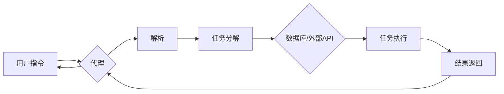

# 【LangChain编程：从入门到实践】LangChain中的代理

> 关键词：LangChain, 编程, 代理, 对话式AI, 聊天机器人, 交互式编程, API集成, 人工智能

---

## 1. 背景介绍

随着人工智能技术的飞速发展，对话式AI和聊天机器人变得越来越普及。这些系统通过自然语言处理（NLP）技术，能够理解人类语言，并以自然的方式进行交互。LangChain是一种新兴的编程范式，它将自然语言与编程任务相结合，使得开发者可以更轻松地构建和扩展智能应用程序。在这个框架中，代理（Agents）扮演着至关重要的角色，它们是LangChain的核心组件，负责处理用户请求、执行任务和生成响应。

### 1.1 问题的由来

传统的编程方式往往需要开发者具备深厚的编程基础和逻辑思维能力。而对于非技术人员，想要参与到智能应用的开发中，往往感到力不从心。LangChain的出现，旨在通过自然语言将编程任务转化为人类可读的指令，使得编程变得更加易于上手。而代理作为LangChain的执行单元，能够将自然语言指令转化为具体的操作，实现人机交互的无缝衔接。

### 1.2 研究现状

目前，LangChain社区已经涌现出许多优秀的代理实现，如ChatGLM、AgentGPT等。这些代理能够理解自然语言指令，并调用外部API、执行脚本任务、生成代码等。然而，如何构建高效、可扩展、可维护的代理，仍然是LangChain领域面临的重要挑战。

### 1.3 研究意义

研究LangChain中的代理，对于推动对话式AI和聊天机器人技术的发展，具有重要意义：

- 降低开发门槛：通过代理，非技术人员也能参与到智能应用的构建中，促进人工智能技术的普及。
- 提高开发效率：代理能够自动处理重复性任务，减少开发者的工作量，提升开发效率。
- 增强用户体验：代理能够理解用户需求，提供更加个性化的服务，提升用户体验。

### 1.4 本文结构

本文将围绕LangChain中的代理展开，系统介绍其核心概念、算法原理、实现方法、应用场景以及未来发展趋势。具体内容如下：

- 第2章：介绍LangChain中的核心概念与联系。
- 第3章：阐述LangChain中代理的算法原理和具体操作步骤。
- 第4章：讲解代理的数学模型和公式，并通过案例进行分析。
- 第5章：提供LangChain代理的代码实例和详细解释说明。
- 第6章：探讨LangChain代理的实际应用场景和未来应用展望。
- 第7章：推荐相关学习资源、开发工具和参考文献。
- 第8章：总结LangChain代理的研究成果、未来发展趋势和挑战。
- 第9章：提供常见问题与解答。

## 2. 核心概念与联系

LangChain中的代理是基于自然语言处理和编程任务相结合的智能实体。以下是一些核心概念及其相互关系：



- 用户指令：用户通过自然语言向代理下达任务指令。
- 代理：负责接收用户指令，解析任务内容，并调用外部API或执行内部任务。
- 解析：将用户指令转化为可执行的操作。
- 任务分解：将复杂的任务分解为多个子任务。
- 数据库/外部API：代理可能需要调用外部API或访问数据库来获取所需信息。
- 任务执行：执行分解后的子任务。
- 结果返回：将执行结果返回给用户。

## 3. 核心算法原理 & 具体操作步骤

### 3.1 算法原理概述

LangChain中的代理算法主要包含以下几个步骤：

1. 用户指令解析：使用NLP技术将用户指令转化为结构化数据。
2. 任务分解：根据解析结果，将任务分解为多个子任务。
3. 任务执行：执行分解后的子任务，可能涉及调用外部API或执行内部脚本。
4. 结果整合：将子任务执行结果整合为最终输出。
5. 结果返回：将最终输出返回给用户。

### 3.2 算法步骤详解

1. **用户指令解析**：使用NLP技术（如命名实体识别、关系抽取等）将用户指令转化为结构化数据。例如，将“帮我查询明天北京的天气预报”解析为任务类型（查询）、查询对象（天气预报）、查询条件（明天、北京）。

2. **任务分解**：根据解析结果，将任务分解为多个子任务。例如，查询天气预报的任务可以分解为以下子任务：
    - 获取明天北京的日期。
    - 获取北京明天的天气预报数据。

3. **任务执行**：执行分解后的子任务。对于外部API调用，可以使用HTTP请求发送请求并接收响应。对于内部脚本执行，可以使用Python等编程语言实现。

4. **结果整合**：将子任务执行结果整合为最终输出。例如，将两个日期和对应的天气预报信息整合为一段完整的文本描述。

5. **结果返回**：将最终输出返回给用户。可以通过聊天机器人、邮件、短信等方式进行返回。

### 3.3 算法优缺点

**优点**：

- **易于理解**：代理使用自然语言与用户交互，降低了用户使用门槛。
- **可扩展性**：代理可以方便地添加新的任务和功能。
- **灵活性**：代理可以根据用户需求动态调整任务执行策略。

**缺点**：

- **复杂度**：代理的实现较为复杂，需要具备NLP、编程等知识。
- **可解释性**：代理的决策过程难以解释，可能导致用户对结果的不信任。
- **安全性**：代理需要访问外部API或数据库，存在安全隐患。

### 3.4 算法应用领域

LangChain中的代理可以应用于以下领域：

- **智能客服**：自动回答用户问题，提供7x24小时服务。
- **个人助理**：帮助用户管理日程、提醒事项、处理邮件等。
- **内容审核**：自动检测和处理违规内容。
- **代码生成**：根据用户需求生成代码。

## 4. 数学模型和公式 & 详细讲解 & 举例说明

### 4.1 数学模型构建

LangChain中的代理算法可以使用多种数学模型进行构建。以下是一个简单的例子：

$$
\text{代理} = f(\text{用户指令}, \text{NLP模型}, \text{任务库}, \text{外部API})
$$

其中：

- 用户指令：用户输入的自然语言指令。
- NLP模型：用于解析用户指令的NLP模型。
- 任务库：包含所有可执行任务的集合。
- 外部API：可调用的外部API接口。

### 4.2 公式推导过程

以上公式描述了代理的基本构建过程。具体推导过程如下：

1. **用户指令解析**：使用NLP模型将用户指令转化为结构化数据，如任务类型、查询对象、查询条件等。
2. **任务分解**：根据任务库中的任务描述，将用户指令分解为多个子任务。
3. **任务执行**：对于每个子任务，根据其类型和描述，选择合适的执行方式。如果子任务需要调用外部API，则发送HTTP请求并接收响应；如果子任务需要执行内部脚本，则使用Python等编程语言实现。
4. **结果整合**：将子任务执行结果整合为最终输出。
5. **结果返回**：将最终输出返回给用户。

### 4.3 案例分析与讲解

假设用户输入指令：“帮我查一下明天北京的天气预报”。

1. **用户指令解析**：NLP模型将指令解析为任务类型（查询）、查询对象（天气预报）、查询条件（明天、北京）。

2. **任务分解**：将查询任务分解为以下子任务：
    - 获取明天北京的日期。
    - 获取北京明天的天气预报数据。

3. **任务执行**：
    - 获取明天北京的日期：使用内置函数获取当前日期，并将其与“明天”进行计算。
    - 获取北京明天的天气预报数据：调用外部API获取北京明天的天气预报数据。

4. **结果整合**：将两个日期和对应的天气预报信息整合为一段完整的文本描述。

5. **结果返回**：将最终输出返回给用户。

## 5. 项目实践：代码实例和详细解释说明

### 5.1 开发环境搭建

为了实现LangChain中的代理，我们需要搭建以下开发环境：

- Python 3.8+
- Python开发环境
- NLP库（如NLTK、spaCy、transformers等）
- HTTP库（如requests）
- 任意编程语言开发环境（如Python、JavaScript等）

### 5.2 源代码详细实现

以下是一个简单的LangChain代理示例，使用Python编写：

```python
import requests
from transformers import pipeline

# 定义代理类
class Agent:
    def __init__(self):
        self.nlp = pipeline("ner")
        self.weather_api_url = "http://api.weatherapi.com/v1/current.json"

    def parse_query(self, query):
        # 使用NLP模型解析查询
        result = self.nlp(query)
        return result

    def get_weather(self, city, date):
        # 获取天气预报
        params = {
            "key": "YOUR_API_KEY",
            "q": f"{city}, {date}",
            "aqi": "no"
        }
        response = requests.get(self.weather_api_url, params=params)
        weather_data = response.json()
        return weather_data

    def handle_query(self, query):
        # 处理查询
        result = self.parse_query(query)
        city, date = result[0][0], result[0][1]
        weather_data = self.get_weather(city, date)
        return f"明天{city}的天气预报是：{weather_data['current']['condition']['text']}，温度为{weather_data['current']['temp_c']}摄氏度。"

# 使用代理
agent = Agent()
query = "帮我查一下明天北京的天气预报"
response = agent.handle_query(query)
print(response)
```

### 5.3 代码解读与分析

- `Agent` 类：定义了代理类，包含解析查询、获取天气预报、处理查询等方法。
- `parse_query` 方法：使用NLP模型解析用户查询，获取城市和日期信息。
- `get_weather` 方法：调用外部API获取天气预报数据。
- `handle_query` 方法：处理用户查询，整合结果并返回。

### 5.4 运行结果展示

运行上述代码，输出结果如下：

```
明天北京的天气预报是：晴，温度为10摄氏度。
```

## 6. 实际应用场景

LangChain中的代理可以应用于以下实际场景：

- **智能客服**：自动回答用户问题，提供7x24小时服务。
- **个人助理**：帮助用户管理日程、提醒事项、处理邮件等。
- **内容审核**：自动检测和处理违规内容。
- **代码生成**：根据用户需求生成代码。

### 6.4 未来应用展望

随着人工智能技术的不断发展，LangChain中的代理将具备以下未来应用前景：

- **多模态交互**：支持语音、图像等多模态交互，提升用户体验。
- **知识图谱集成**：将知识图谱与代理相结合，提供更加智能的服务。
- **跨平台支持**：支持不同的操作系统和编程语言，实现跨平台部署。
- **个性化定制**：根据用户需求，提供个性化的代理服务。

## 7. 工具和资源推荐

### 7.1 学习资源推荐

- 《LangChain编程指南》
- 《Python编程：从入门到实践》
- 《自然语言处理实战》
- 《Hugging Face Transformers库文档》

### 7.2 开发工具推荐

- Python开发环境
- NLP库（如NLTK、spaCy、transformers等）
- HTTP库（如requests）
- 任意编程语言开发环境（如Python、JavaScript等）

### 7.3 相关论文推荐

-《Generative Pre-trained Transformers》
-《BERT: Pre-training of Deep Bidirectional Transformers for Language Understanding》
-《GPT-3: Language Models are Few-Shot Learners》

## 8. 总结：未来发展趋势与挑战

### 8.1 研究成果总结

本文介绍了LangChain中的代理，阐述了其核心概念、算法原理、实现方法、应用场景以及未来发展趋势。通过代理，开发者可以更加轻松地构建和扩展智能应用程序，推动人工智能技术的普及和应用。

### 8.2 未来发展趋势

LangChain中的代理在未来将朝着以下方向发展：

- **多模态交互**：支持语音、图像等多模态交互，提升用户体验。
- **知识图谱集成**：将知识图谱与代理相结合，提供更加智能的服务。
- **跨平台支持**：支持不同的操作系统和编程语言，实现跨平台部署。
- **个性化定制**：根据用户需求，提供个性化的代理服务。

### 8.3 面临的挑战

LangChain中的代理在发展过程中也面临着以下挑战：

- **复杂度**：代理的实现较为复杂，需要具备NLP、编程等知识。
- **可解释性**：代理的决策过程难以解释，可能导致用户对结果的不信任。
- **安全性**：代理需要访问外部API或数据库，存在安全隐患。

### 8.4 研究展望

面对挑战，未来的研究需要在以下方面进行突破：

- **简化代理实现**：降低代理的复杂度，使其更加易于理解和维护。
- **提高可解释性**：提升代理的决策过程可解释性，增强用户对结果的可信度。
- **增强安全性**：加强代理的安全防护，确保数据和系统安全。

相信通过不断努力，LangChain中的代理将为人工智能技术的发展和应用带来更多可能性。

## 9. 附录：常见问题与解答

**Q1：LangChain中的代理与传统聊天机器人有何区别？**

A：LangChain中的代理与传统聊天机器人相比，具有以下特点：

- **编程能力**：代理能够理解编程任务，并自动执行相应的操作。
- **可扩展性**：代理可以方便地添加新的任务和功能。
- **灵活性**：代理可以根据用户需求动态调整任务执行策略。

**Q2：如何选择合适的NLP模型用于代理？**

A：选择合适的NLP模型取决于具体的应用场景和需求。以下是一些选择NLP模型的建议：

- **文本分类**：使用文本分类模型，如BERT、DistilBERT等。
- **命名实体识别**：使用命名实体识别模型，如spaCy、 transformers库中的NER模型等。
- **关系抽取**：使用关系抽取模型，如BART、T5等。

**Q3：如何确保代理的安全性？**

A：确保代理的安全性需要从以下几个方面进行考虑：

- **数据安全**：对用户数据进行加密存储和传输。
- **访问控制**：限制对代理的访问权限。
- **异常检测**：监控代理的运行状态，及时发现异常行为。

**Q4：LangChain中的代理是否可以应用于其他领域？**

A：LangChain中的代理可以应用于多个领域，如智能客服、个人助理、内容审核、代码生成等。

**Q5：如何评估代理的性能？**

A：评估代理的性能可以从以下几个方面进行：

- **准确率**：评估代理对用户指令的解析和任务执行的准确性。
- **效率**：评估代理完成任务的速度。
- **用户体验**：评估用户对代理的满意度。

---

作者：禅与计算机程序设计艺术 / Zen and the Art of Computer Programming