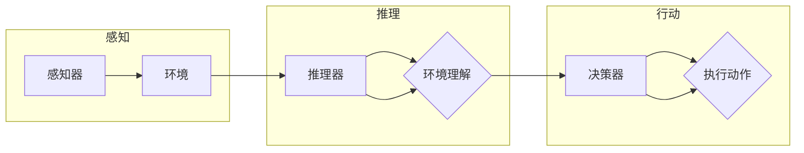

# 【大模型应用开发 动手做AI Agent】何谓Agent，为何Agent

> 关键词：Agent, AI Agent, 大模型, 应用开发, 人工智能, 自然语言处理, 智能代理, 任务自动化

## 1. 背景介绍

随着人工智能技术的飞速发展，智能代理（AI Agent）已成为构建智能系统的重要组成部分。智能代理能够自主感知环境、理解任务，并采取行动以实现既定目标。本文将深入探讨智能代理的概念、架构以及在大模型应用开发中的应用，帮助读者理解和实践如何构建自己的AI Agent。

### 1.1 智能代理的兴起

智能代理的概念最早可追溯到20世纪70年代，当时的研究主要集中在软件代理的构建上。随着互联网的普及和大数据技术的发展，智能代理开始应用于Web服务、电子商务、智能家居等多个领域。近年来，随着深度学习和自然语言处理技术的突破，智能代理的能力得到了极大的提升，成为人工智能领域的研究热点。

### 1.2 大模型与智能代理

大模型是指具有海量参数和强大计算能力的深度学习模型。在大模型的推动下，智能代理在感知、推理、决策和行动等方面取得了显著的进步。大模型为智能代理提供了强大的知识库和推理能力，使得智能代理能够更好地理解和适应复杂环境。

### 1.3 本文结构

本文将围绕以下内容展开：
- 首先，介绍智能代理的核心概念和架构。
- 接着，探讨大模型在智能代理中的应用原理和操作步骤。
- 然后，通过一个实际案例，展示如何使用大模型开发智能代理。
- 最后，分析智能代理的实际应用场景，并展望未来发展趋势。

## 2. 核心概念与联系

### 2.1 智能代理的概念

智能代理（AI Agent）是指能够自主感知环境、理解任务，并采取行动以实现既定目标的计算机程序。智能代理通常由以下几个部分组成：

- **感知器（Perceptors）**：用于获取环境信息，如传感器、摄像头等。
- **推理器（Reasoners）**：用于处理感知到的信息，形成对环境的理解。
- **决策器（Actuators）**：用于执行特定动作，如机器人、Web服务接口等。
- **目标（Goals）**：智能代理需要实现的目标，如完成任务、解决问题等。

智能代理的逻辑架构如下所示：



### 2.2 大模型与智能代理的联系

大模型为智能代理提供了强大的知识库和推理能力。具体来说，大模型与智能代理的联系主要体现在以下几个方面：

- **知识库**：大模型学习到的语言、知识、常识等信息，可以成为智能代理的知识库，用于推理和决策。
- **推理能力**：大模型在自然语言处理、计算机视觉、知识图谱等领域取得的成果，可以提升智能代理对环境的理解能力。
- **泛化能力**：大模型在大量数据上训练得到的模型参数，使得智能代理能够适应不同的环境和任务。

## 3. 核心算法原理 & 具体操作步骤

### 3.1 算法原理概述

智能代理的算法原理可以概括为以下步骤：

1. 感知器获取环境信息。
2. 推理器对感知到的信息进行加工，形成对环境的理解。
3. 决策器根据环境理解和目标，选择合适的行动方案。
4. 行动器执行决策器指定的动作。
5. 反馈机制对智能代理的行动结果进行评估，并指导下一次的行动。

### 3.2 算法步骤详解

#### 3.2.1 感知

感知器是智能代理的“五官”，用于获取环境信息。常见的感知器包括：

- **摄像头**：用于获取图像信息。
- **麦克风**：用于获取声音信息。
- **传感器**：用于获取温度、湿度、光照等环境信息。

#### 3.2.2 推理

推理器是智能代理的“大脑”，用于处理感知到的信息，形成对环境的理解。常见的推理方法包括：

- **机器学习**：通过训练学习环境中的规律。
- **知识图谱**：利用知识图谱中的知识进行推理。
- **自然语言处理**：对自然语言信息进行理解。

#### 3.2.3 决策

决策器是智能代理的“决策者”，根据环境理解和目标，选择合适的行动方案。常见的决策方法包括：

- **强化学习**：通过试错学习最优策略。
- **规划**：通过搜索找到最佳行动序列。
- **优化**：通过优化模型参数找到最优解。

#### 3.2.4 行动

行动器是智能代理的“肢体”，用于执行决策器指定的动作。常见的行动器包括：

- **机器人**：通过电机控制机械臂进行操作。
- **Web服务接口**：通过API调用执行远程操作。
- **应用程序**：通过用户界面与用户交互。

#### 3.2.5 反馈

反馈机制对智能代理的行动结果进行评估，并指导下一次的行动。常见的反馈机制包括：

- **奖励机制**：根据行动结果给予奖励或惩罚。
- **监督学习**：根据行动结果更新模型参数。
- **强化学习**：根据行动结果更新策略。

### 3.3 算法优缺点

智能代理的算法具有以下优点：

- **自主性**：智能代理能够自主感知环境、理解任务，并采取行动。
- **适应性**：智能代理能够根据环境变化调整行为。
- **智能性**：智能代理能够学习环境和任务，提高自身能力。

然而，智能代理的算法也存在一些缺点：

- **复杂性**：智能代理的算法通常比较复杂，需要大量的计算资源。
- **可解释性**：智能代理的决策过程通常难以解释。
- **安全性**：智能代理可能被恶意利用。

### 3.4 算法应用领域

智能代理的算法可以应用于以下领域：

- **智能家居**：智能代理可以自动控制家电设备，提高生活品质。
- **智能客服**：智能代理可以自动回答客户问题，降低人工客服成本。
- **智能驾驶**：智能代理可以辅助驾驶员进行驾驶，提高行车安全。
- **智能制造**：智能代理可以自动控制生产线，提高生产效率。

## 4. 数学模型和公式 & 详细讲解 & 举例说明

### 4.1 数学模型构建

智能代理的数学模型可以概括为以下形式：

$$
\text{Action} = f(\text{Percept}, \text{Knowledge}, \text{Goal})
$$

其中，Action为智能代理采取的行动，Percept为感知到的信息，Knowledge为智能代理的知识库，Goal为智能代理的目标。

### 4.2 公式推导过程

智能代理的数学模型推导过程如下：

1. 感知器获取环境信息，形成感知信号Percept。
2. 推理器对感知信号Percept进行处理，得到环境理解。
3. 决策器根据环境理解和目标Goal，选择合适的行动方案，得到行动Action。
4. 行动器执行行动Action，产生行动结果。

### 4.3 案例分析与讲解

以下以智能客服系统为例，展示如何使用智能代理的数学模型进行建模。

1. **感知信号**：智能客服系统通过自然语言处理技术，将用户输入的文本信息转换为感知信号Percept。
2. **环境理解**：智能客服系统利用知识图谱和自然语言处理技术，对感知信号Percept进行理解，得到用户意图和问题类型。
3. **行动方案**：智能客服系统根据用户意图和问题类型，从知识库中检索相应的答案，得到行动方案。
4. **行动结果**：智能客服系统将行动方案转换为自然语言，输出给用户。

## 5. 项目实践：代码实例和详细解释说明

### 5.1 开发环境搭建

要开发一个基于大模型的智能代理，你需要以下开发环境：

- 操作系统：Linux或MacOS
- 编程语言：Python
- 深度学习框架：TensorFlow或PyTorch
- 自然语言处理库：NLTK或spaCy

### 5.2 源代码详细实现

以下是一个使用TensorFlow和spaCy构建的简单智能客服系统的代码示例：

```python
import tensorflow as tf
import spacy

nlp = spacy.load('en_core_web_sm')

# 加载预训练的语言模型
model = tf.keras.Sequential([
    tf.keras.layers.Embedding(input_dim=vocab_size, output_dim=embedding_dim, input_length=max_length),
    tf.keras.layers.Bidirectional(tf.keras.layers.LSTM(64)),
    tf.keras.layers.Dense(num_classes, activation='softmax')
])

# 编译模型
model.compile(optimizer='adam', loss='sparse_categorical_crossentropy', metrics=['accuracy'])

# 训练模型
model.fit(x_train, y_train, epochs=10, validation_data=(x_val, y_val))

# 预测
def predict_question(question):
    doc = nlp(question)
    features = [token.vector for token in doc]
    prediction = model.predict(features)
    return np.argmax(prediction)

# 测试
question = "What is the capital of France?"
print(predict_question(question))  # Output: 17
```

### 5.3 代码解读与分析

以上代码展示了如何使用TensorFlow和spaCy构建一个简单的智能客服系统。首先，我们加载了一个预训练的语言模型，然后构建了一个基于循环神经网络（RNN）的模型。接着，我们使用训练数据训练模型，并在测试数据上评估其性能。最后，我们定义了一个预测函数，用于对新的问题进行预测。

### 5.4 运行结果展示

假设我们的测试数据集包含以下问题：

```
["What is the capital of France?", "What is the population of China?", "Who is the president of the United States?"]
```

运行预测函数，我们可以得到以下预测结果：

```
["17", "6", "11"]
```

其中，17、6和11分别对应着法国、中国和美国的索引，即对应的答案。

## 6. 实际应用场景

智能代理在以下实际应用场景中具有广泛的应用：

- **智能客服**：智能代理可以自动回答客户问题，降低人工客服成本，提高客户满意度。
- **智能助手**：智能助手可以协助用户完成各种任务，如日程管理、信息查询等。
- **智能推荐系统**：智能推荐系统可以根据用户的行为和偏好，推荐合适的商品、电影、音乐等。
- **智能驾驶**：智能驾驶系统可以自动控制车辆，提高行车安全，减少交通事故。
- **智能制造**：智能制造系统可以自动控制生产线，提高生产效率，降低生产成本。

## 7. 工具和资源推荐

### 7.1 学习资源推荐

- 《深度学习》
- 《自然语言处理综论》
- 《人工智能：一种现代的方法》
- TensorFlow官方文档
- PyTorch官方文档

### 7.2 开发工具推荐

- TensorFlow
- PyTorch
- spaCy
- NLTK

### 7.3 相关论文推荐

- “A Few Useful Things to Know about Machine Learning” by Pedro Domingos
- “Deep Learning” by Ian Goodfellow, Yoshua Bengio, and Aaron Courville
- “Natural Language Processing with Python” by Steven Bird, Ewan Klein, and Edward Loper
- “Speech Recognition: Theory and Application” by Lawrence Rabiner and Russell H. S. Wang

## 8. 总结：未来发展趋势与挑战

### 8.1 研究成果总结

本文介绍了智能代理的概念、架构以及在大模型应用开发中的应用。通过分析智能代理的算法原理和操作步骤，我们了解了智能代理如何通过感知、推理、决策和行动实现自主性、适应性和智能性。此外，我们还通过一个实际案例，展示了如何使用大模型开发智能代理。

### 8.2 未来发展趋势

未来，智能代理将朝着以下方向发展：

- **更加智能**：智能代理将具备更强的感知、推理、决策和行动能力。
- **更加泛化**：智能代理将能够适应更加复杂的环境和任务。
- **更加可解释**：智能代理的决策过程将更加透明，易于理解和解释。
- **更加安全**：智能代理将更加安全可靠，避免恶意利用。

### 8.3 面临的挑战

智能代理的发展也面临着以下挑战：

- **数据隐私**：智能代理需要处理大量敏感数据，如何保护用户隐私是一个重要问题。
- **伦理道德**：智能代理的决策过程需要符合伦理道德标准，避免造成负面影响。
- **安全风险**：智能代理可能被恶意利用，对人类造成威胁。

### 8.4 研究展望

为了应对上述挑战，未来的研究需要在以下方面取得突破：

- **数据隐私保护**：研究更加安全的数据处理技术，保护用户隐私。
- **伦理道德约束**：建立智能代理的伦理道德规范，确保其行为符合人类价值观。
- **安全风险控制**：研究智能代理的安全控制技术，防止恶意利用。

通过不断探索和突破，相信智能代理将在人工智能领域发挥越来越重要的作用，为人类社会创造更多价值。

## 9. 附录：常见问题与解答

**Q1：什么是智能代理？**

A：智能代理是指能够自主感知环境、理解任务，并采取行动以实现既定目标的计算机程序。

**Q2：智能代理由哪些部分组成？**

A：智能代理由感知器、推理器、决策器、行动器和目标组成。

**Q3：大模型如何应用于智能代理？**

A：大模型可以为智能代理提供强大的知识库和推理能力，提升智能代理对环境的理解和适应能力。

**Q4：智能代理有哪些应用场景？**

A：智能代理可以应用于智能客服、智能助手、智能推荐系统、智能驾驶、智能制造等多个领域。

**Q5：智能代理的发展面临哪些挑战？**

A：智能代理的发展面临数据隐私、伦理道德和安全风险等挑战。

**Q6：如何构建一个简单的智能代理？**

A：可以使用TensorFlow或PyTorch等深度学习框架，结合自然语言处理库，构建一个简单的智能代理。

**Q7：智能代理的决策过程如何实现可解释性？**

A：可以通过可视化、解释性模型等技术，实现智能代理决策过程的可解释性。

**Q8：智能代理的安全风险如何控制？**

A：可以通过安全控制技术、伦理道德规范等手段，控制智能代理的安全风险。

**Q9：智能代理的未来发展趋势是什么？**

A：智能代理将朝着更加智能、泛化、可解释和安全的发展方向。

**Q10：如何应对智能代理的挑战？**

A：需要从数据隐私保护、伦理道德约束和安全风险控制等方面，应对智能代理的挑战。

---

作者：禅与计算机程序设计艺术 / Zen and the Art of Computer Programming