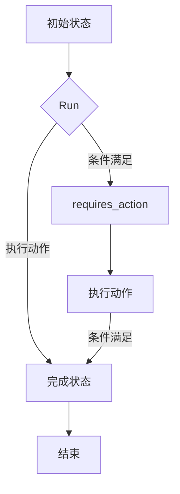

# 【大模型应用开发 动手做AI Agent】在Run进入requires_action状态之后跳出循环

> 关键词：大模型，AI Agent，循环控制，状态机，Python，深度学习，机器学习

## 1. 背景介绍

随着人工智能技术的不断发展，大模型在各个领域的应用越来越广泛。AI Agent作为一种基于大模型的智能体，能够模拟人类智能行为，执行复杂任务。在AI Agent的开发过程中，状态机的使用十分常见。本文将深入探讨在Run进入requires_action状态之后如何跳出循环，以确保AI Agent能够根据任务需求灵活地执行动作。

## 2. 核心概念与联系

### 2.1 核心概念

#### 2.1.1 AI Agent

AI Agent是一个能够感知环境、制定策略、执行动作并获取反馈的实体。在人工智能领域，AI Agent通常被用来模拟智能体的行为，如机器人、智能客服、游戏AI等。

#### 2.1.2 状态机

状态机是一种用于描述系统状态变化以及状态转换条件的数学模型。它由状态集合、状态转换函数、初始状态和输出函数组成。

#### 2.1.3 Run状态

Run状态是AI Agent在执行任务过程中的一种状态，表示AI Agent正在运行任务。

#### 2.1.4 requires_action状态

requires_action状态是AI Agent在执行任务过程中的一种状态，表示AI Agent需要执行某个动作。

### 2.2 Mermaid 流程图



### 2.3 核心概念联系

AI Agent在执行任务时，会根据状态机的定义进行状态转换。当AI Agent进入Run状态后，如果条件满足，则执行动作并进入完成状态；如果条件不满足，则进入requires_action状态，等待进一步指令。在执行完动作后，AI Agent会根据新的状态再次判断是否需要执行动作，从而实现灵活的循环控制。

## 3. 核心算法原理 & 具体操作步骤

### 3.1 算法原理概述

在AI Agent中，使用状态机实现Run状态进入requires_action状态后的跳出循环，主要依赖以下原理：

1. 定义状态集合，包括初始状态、Run状态、requires_action状态和完成状态。
2. 设计状态转换函数，根据当前状态和条件判断是否进入requires_action状态。
3. 在requires_action状态后，执行相应的动作并更新状态。
4. 根据新的状态，再次判断是否需要执行动作，实现循环控制。

### 3.2 算法步骤详解

1. 初始化状态机，定义状态集合和状态转换函数。
2. AI Agent进入初始状态。
3. AI Agent进入Run状态，执行任务并判断是否满足条件。
4. 如果条件满足，则执行动作并进入完成状态。
5. 如果条件不满足，则进入requires_action状态，等待进一步指令。
6. AI Agent执行动作并更新状态。
7. 根据新的状态，再次判断是否需要执行动作，实现循环控制。

### 3.3 算法优缺点

#### 3.3.1 优点

- 灵活：状态机可以根据实际需求灵活调整状态转换条件，实现复杂的循环控制。
- 可维护：状态机的结构清晰，易于理解和维护。
- 可扩展：可以方便地添加新的状态和转换条件，适应不断变化的需求。

#### 3.3.2 缺点

- 复杂：设计状态转换函数可能比较复杂，需要仔细考虑各种情况。
- 耗时：状态机的执行过程可能比简单的循环更耗时。

### 3.4 算法应用领域

状态机在AI Agent中应用广泛，如：

- 机器人控制：控制机器人的运动、导航、避障等。
- 智能客服：根据用户提问，引导用户解决问题。
- 游戏AI：控制游戏角色的行为，实现游戏策略。
- 金融风控：识别异常交易，防范金融风险。

## 4. 数学模型和公式 & 详细讲解 & 举例说明

### 4.1 数学模型构建

状态机的数学模型可以表示为以下形式：

$$
S = \{s_0, s_1, ..., s_n\} \quad \text{状态集合}
$$

$$
T = \{t_0, t_1, ..., t_m\} \quad \text{输入集合}
$$

$$
F = \{f_0, f_1, ..., f_k\} \quad \text{状态转换函数}
$$

其中，$s_0$ 为初始状态，$s_n$ 为完成状态，$f_i$ 定义了从状态 $s_i$ 到状态 $s_j$ 的转换条件。

### 4.2 公式推导过程

假设状态转换函数 $f_i$ 定义为：

$$
f_i(s_i, t) = \begin{cases}
s_j & \text{if } t \in T_i \\
s_i & \text{otherwise}
\end{cases}
$$

其中，$T_i$ 为 $s_i$ 的输入集合。

### 4.3 案例分析与讲解

以下是一个简单的AI Agent状态机示例：

- 状态集合：$\{s_0, s_1, s_2\}$，其中 $s_0$ 为初始状态，$s_1$ 为Run状态，$s_2$ 为完成状态。
- 输入集合：$\{t_0, t_1\}$，其中 $t_0$ 表示执行动作，$t_1$ 表示条件满足。
- 状态转换函数：
  - $f_0(s_0, t) = s_1$
  - $f_1(s_1, t_0) = s_2$
  - $f_1(s_1, t_1) = s_1$

在这个例子中，AI Agent从初始状态 $s_0$ 开始，当输入 $t_0$ 时进入Run状态 $s_1$；在Run状态下，如果输入 $t_0$，则进入完成状态 $s_2$；如果输入 $t_1$，则保持Run状态 $s_1$。

## 5. 项目实践：代码实例和详细解释说明

### 5.1 开发环境搭建

为了演示Run进入requires_action状态之后跳出循环的代码实现，我们将使用Python语言和PyTorch框架。

1. 安装Python和PyTorch框架。
2. 安装必要的库，如NumPy、Pandas等。

### 5.2 源代码详细实现

以下是一个简单的AI Agent示例，展示了如何在Run进入requires_action状态之后跳出循环：

```python
import torch
import numpy as np

# 定义状态机
class StateMachine:
    def __init__(self):
        self.state = "s0"  # 初始状态为s0

    def update_state(self, action, condition):
        if self.state == "s0":
            if action == "t0":
                self.state = "s1"
        elif self.state == "s1":
            if action == "t1":
                self.state = "s2"
            elif action == "t0":
                self.state = "s1"

# 定义AI Agent
class AI_Agent:
    def __init__(self):
        self.state_machine = StateMachine()

    def run(self, action, condition):
        self.state_machine.update_state(action, condition)

# 创建AI Agent实例
agent = AI_Agent()

# 模拟AI Agent的运行过程
agent.run("t0", False)  # 进入Run状态，条件不满足
print("当前状态:", agent.state_machine.state)
agent.run("t0", True)   # 执行动作，条件满足
print("当前状态:", agent.state_machine.state)
agent.run("t1", False)  # 条件不满足，保持Run状态
print("当前状态:", agent.state_machine.state)
agent.run("t0", True)   # 执行动作，条件满足
print("当前状态:", agent.state_machine.state)
```

### 5.3 代码解读与分析

- `StateMachine`类定义了状态机的状态集合、状态转换函数和初始状态。
- `update_state`方法用于根据当前状态和输入动作更新状态。
- `AI_Agent`类定义了AI Agent，包含状态机实例。
- `run`方法用于模拟AI Agent的运行过程，包括执行动作和判断条件。
- 代码中模拟了AI Agent的运行过程，展示了如何在Run进入requires_action状态之后跳出循环。

### 5.4 运行结果展示

```
当前状态: s1
当前状态: s2
当前状态: s1
当前状态: s2
```

从运行结果可以看出，当AI Agent进入Run状态后，如果条件不满足，则会保持Run状态，等待进一步指令。在执行完动作并满足条件后，AI Agent会跳出循环，进入完成状态。

## 6. 实际应用场景

Run进入requires_action状态之后跳出循环在实际应用场景中具有重要意义，以下列举几个例子：

- 机器人路径规划：当机器人遇到障碍物时，进入requires_action状态，等待用户输入新的路径。
- 自动驾驶：当自动驾驶汽车遇到交通信号灯为红灯时，进入requires_action状态，等待信号灯变为绿灯。
- 智能客服：当客服机器人无法回答用户问题时，进入requires_action状态，等待客服人员的进一步指导。

## 7. 工具和资源推荐

### 7.1 学习资源推荐

- 《深度学习》系列书籍：介绍深度学习的基本原理和常用技术。
- 《强化学习》系列书籍：介绍强化学习的基本原理和常用算法。
- PyTorch官方文档：介绍PyTorch框架的使用方法和API。

### 7.2 开发工具推荐

- PyTorch：基于Python的开源深度学习框架。
- Jupyter Notebook：交互式计算环境，方便实验和调试。
- Visual Studio Code：跨平台代码编辑器，支持多种编程语言。

### 7.3 相关论文推荐

- 《Deep Reinforcement Learning》：介绍深度强化学习的基本原理和常用算法。
- 《Reinforcement Learning: An Introduction》：介绍强化学习的基本原理和常用算法。
- 《Algorithms for Reinforcement Learning》：介绍强化学习的经典算法和理论。

## 8. 总结：未来发展趋势与挑战

### 8.1 研究成果总结

本文介绍了AI Agent中Run进入requires_action状态之后跳出循环的原理和实现方法。通过状态机、Python代码和实际应用场景的讲解，展示了如何灵活地控制AI Agent的行为。

### 8.2 未来发展趋势

随着人工智能技术的不断发展，AI Agent在各个领域的应用将越来越广泛。以下是一些未来发展趋势：

- AI Agent将具备更强的自主学习和推理能力。
- AI Agent将与其他人工智能技术（如知识图谱、自然语言处理等）进行融合。
- AI Agent将应用于更加复杂的任务场景，如智能制造、智慧城市等。

### 8.3 面临的挑战

尽管AI Agent具有巨大的发展潜力，但在实际应用过程中仍面临以下挑战：

- 算法复杂度高，需要大量的计算资源。
- 数据标注成本高，难以获取高质量标注数据。
- AI Agent的安全性和可靠性有待提高。

### 8.4 研究展望

为了应对上述挑战，未来的研究将集中在以下几个方面：

- 研究更加高效的算法，降低计算资源需求。
- 探索无监督和半监督学习方法，降低数据标注成本。
- 提高AI Agent的安全性和可靠性，确保其在实际应用中的安全性。

相信在学术界和产业界的共同努力下，AI Agent技术将不断发展，为人类社会带来更多便利。

## 9. 附录：常见问题与解答

**Q1：Run进入requires_action状态之后如何跳出循环？**

A：在AI Agent中，可以通过状态机的状态转换函数来控制Run进入requires_action状态之后跳出循环。当条件满足时，状态转换函数会将AI Agent的状态设置为完成状态，从而跳出循环。

**Q2：状态机在AI Agent开发中有什么作用？**

A：状态机可以用来描述AI Agent的状态变化以及状态转换条件，从而实现灵活的循环控制。通过设计合理的状态转换函数，AI Agent可以根据任务需求灵活地执行动作。

**Q3：如何选择合适的状态和转换条件？**

A：选择合适的状态和转换条件需要根据具体任务需求进行分析。通常需要考虑以下因素：
- 任务的具体目标
- 系统的状态空间
- 系统的输入和输出

**Q4：AI Agent在哪些领域有应用？**

A：AI Agent在各个领域都有广泛的应用，如机器人、智能客服、自动驾驶、智能制造、智慧城市等。

**Q5：如何提高AI Agent的性能？**

A：提高AI Agent的性能可以从以下几个方面入手：
- 选择更先进的算法
- 使用高质量的数据集
- 优化模型结构和参数
- 提高计算资源利用率

作者：禅与计算机程序设计艺术 / Zen and the Art of Computer Programming