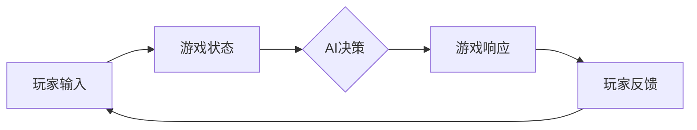

> 关键词：人工智能，游戏开发，AI映射，机器学习，强化学习，自然语言处理，游戏引擎，游戏设计

# 一切皆是映射：AI在游戏开发中的应用

在数字娱乐的广阔天地中，游戏开发者们一直在寻求创新，以提供更加丰富、互动和沉浸式的体验。随着人工智能（AI）技术的飞速发展，它已经逐渐成为游戏开发中不可或缺的一部分。AI不仅能够模拟复杂的行为模式，还能够学习玩家的行为，从而创造更加智能和适应性强的游戏环境。本文将深入探讨AI在游戏开发中的应用，以及它如何通过映射的原理来改变游戏设计和发展。

## 1. 背景介绍

### 1.1 游戏开发与AI的融合

随着计算能力的提升和算法的进步，AI开始被广泛应用于游戏开发中。从简单的NPC（非玩家角色）行为到复杂的游戏AI，AI技术正在改变游戏的创作和体验方式。游戏开发者可以利用AI来创造更加动态和真实的世界，以及更加智能的对手和伙伴。

### 1.2 AI映射的概念

在游戏开发中，AI映射是指将现实世界的行为模式、决策过程或玩家行为转换为游戏内的机制和算法。这种映射使得游戏中的AI能够模拟现实世界中的复杂性和智能性。

### 1.3 研究意义

探讨AI在游戏开发中的应用，有助于：
- 提升游戏体验，使游戏更加智能化和互动性。
- 开发新的游戏类型和玩法。
- 推动游戏技术的创新和发展。

## 2. 核心概念与联系

### 2.1 AI映射原理



在这个流程图中，玩家输入（A）触发游戏状态（B），AI根据游戏状态（C）做出决策，游戏响应（D）生成，玩家根据游戏响应（E）提供反馈，形成一个闭环。

### 2.2 核心概念

- **机器学习**：通过数据训练模型，使AI能够从经验中学习。
- **强化学习**：一种无监督学习方法，通过奖励和惩罚机制训练AI。
- **自然语言处理（NLP）**：使AI能够理解和生成自然语言。
- **游戏引擎**：提供游戏开发的基础工具和框架。
- **游戏设计**：设计游戏规则、故事情节和玩家体验。

## 3. 核心算法原理 & 具体操作步骤

### 3.1 算法原理概述

AI在游戏开发中的应用主要通过以下几种算法：

- **决策树**：用于NPC的行为决策。
- **神经网络**：用于复杂的学习和模式识别。
- **遗传算法**：用于生成和优化游戏内容。
- **蒙特卡洛树搜索**：用于复杂的游戏策略和决策。

### 3.2 算法步骤详解

#### 3.2.1 决策树

决策树通过一系列规则来决定NPC的行为。步骤如下：

1. 收集NPC行为数据。
2. 构建决策树模型。
3. 根据玩家输入，决策树做出决策。
4. NPC根据决策执行相应行为。

#### 3.2.2 神经网络

神经网络通过多层感知器来学习玩家行为。步骤如下：

1. 收集玩家行为数据。
2. 构建神经网络模型。
3. 训练模型以预测玩家行为。
4. 根据预测结果调整NPC行为。

#### 3.2.3 遗传算法

遗传算法通过模拟自然选择的过程来优化游戏内容。步骤如下：

1. 定义游戏内容参数。
2. 初始化种群。
3. 通过选择、交叉和变异操作产生新种群。
4. 评估种群质量。
5. 重复步骤3-4，直到满足终止条件。

#### 3.2.4 蒙特卡洛树搜索

蒙特卡洛树搜索用于复杂游戏策略的决策。步骤如下：

1. 定义游戏状态和动作空间。
2. 递归搜索树节点。
3. 计算每个动作的期望值。
4. 选择期望值最高的动作。

### 3.3 算法优缺点

#### 3.3.1 决策树

优点：简单易懂，易于实现。

缺点：可扩展性差，难以处理复杂决策。

#### 3.3.2 神经网络

优点：能够处理复杂决策，泛化能力强。

缺点：需要大量数据训练，难以解释。

#### 3.3.3 遗传算法

优点：能够找到最优解，适用于优化问题。

缺点：收敛速度慢，需要大量计算资源。

#### 3.3.4 蒙特卡洛树搜索

优点：能够处理复杂决策，速度快。

缺点：需要大量的模拟和计算资源。

### 3.4 算法应用领域

这些算法可以应用于以下游戏开发领域：

- NPC行为设计
- 游戏平衡性调整
- 游戏内容生成
- 游戏玩法设计
- 游戏场景模拟

## 4. 数学模型和公式 & 详细讲解 & 举例说明

### 4.1 数学模型构建

AI在游戏开发中的数学模型通常涉及以下内容：

- **状态空间**：游戏中的所有可能状态。
- **动作空间**：所有可能的动作集合。
- **奖励函数**：定义每个状态和动作的奖励或惩罚。
- **价值函数**：定义每个状态的预期价值。

### 4.2 公式推导过程

假设有一个简单的游戏，玩家可以向上、下、左、右移动，每个方向都有一定的得分。我们可以用以下公式来描述：

$$
V(s) = \sum_{a \in A} \gamma \max_{s' \in S} Q(s,a)
$$

其中，$V(s)$ 是状态 $s$ 的价值，$A$ 是动作集合，$S$ 是状态集合，$\gamma$ 是折扣因子，$Q(s,a)$ 是从状态 $s$ 执行动作 $a$ 到达下一个状态 $s'$ 的期望回报。

### 4.3 案例分析与讲解

以下是一个简单的强化学习案例，使用Q-learning算法来训练一个AI玩贪吃蛇游戏。

```python
import numpy as np

# 初始化Q表
Q = np.zeros([状态数, 动作数])

# 定义学习参数
alpha = 0.1  # 学习率
gamma = 0.6  # 折扣因子

# 初始化环境
# ...

# 迭代学习
for episode in range(总迭代次数):
    # 初始化状态
    state = 初始状态
    done = False
    while not done:
        # 选择动作
        action = 选择动作(state, Q)
        # 执行动作，获取新状态和奖励
        next_state, reward, done = 环境执行动作(state, action)
        # 更新Q值
        Q[state, action] = Q[state, action] + alpha * (reward + gamma * max(Q[next_state, :]) - Q[state, action])
        state = next_state
```

在这个案例中，Q-learning算法通过不断尝试不同的动作，并学习从每个动作中获得的最大预期回报，来优化其行为策略。

## 5. 项目实践：代码实例和详细解释说明

### 5.1 开发环境搭建

为了进行AI在游戏开发中的实践，你需要以下环境：

- Python编程语言
- 游戏开发引擎（如Unity、Unreal Engine）
- 机器学习库（如TensorFlow、PyTorch）

### 5.2 源代码详细实现

以下是一个简单的AI玩家使用Q-learning算法在pygame环境中玩Pong游戏的代码示例：

```python
import pygame
import random
import numpy as np

# 初始化pygame
pygame.init()

# 游戏设置
SCREEN_WIDTH = 800
SCREEN_HEIGHT = 600
BALL_RADIUS = 20
PADDLE_WIDTH = 10
PADDLE_HEIGHT = 100

# 创建屏幕
screen = pygame.display.set_mode((SCREEN_WIDTH, SCREEN_HEIGHT))
pygame.display.set_caption('Pong with AI')

# 初始化球和拍子
ball = pygame.Rect(SCREEN_WIDTH/2 - BALL_RADIUS, SCREEN_HEIGHT/2 - BALL_RADIUS, BALL_RADIUS*2, BALL_RADIUS*2)
paddle = pygame.Rect(SCREEN_WIDTH/2 - PADDLE_WIDTH/2, SCREEN_HEIGHT - PADDLE_HEIGHT, PADDLE_WIDTH, PADDLE_HEIGHT)

# 初始化Q表
Q = np.zeros([int(SCREEN_HEIGHT/BALL_RADIUS), int(SCREEN_WIDTH/BALL_RADIUS), 4])

# 学习参数
alpha = 0.1
gamma = 0.6

# 游戏主循环
clock = pygame.time.Clock()
running = True
while running:
    for event in pygame.event.get():
        if event.type == pygame.QUIT:
            running = False
    
    # AI控制
    # ...

    # 更新球和拍子位置
    # ...

    # 更新Q表
    # ...

    # 绘制游戏界面
    screen.fill((0, 0, 0))
    pygame.draw.rect(screen, (255, 255, 255), ball)
    pygame.draw.rect(screen, (255, 255, 255), paddle)
    pygame.display.flip()
    
    clock.tick(60)

pygame.quit()
```

### 5.3 代码解读与分析

在这个代码示例中，我们使用pygame库创建了一个简单的Pong游戏环境，并使用Q-learning算法训练一个AI玩家。AI玩家的目标是使用一个拍子来拦截一个球，避免球进入自己的区域。

### 5.4 运行结果展示

运行上述代码后，你将看到一个简单的Pong游戏界面，其中包含一个球和一个AI玩家控制的拍子。AI玩家通过学习来控制拍子的移动，以拦截球。

## 6. 实际应用场景

### 6.1 NPC行为设计

AI可以用于设计NPC的行为，使其更加智能和多样化。例如，NPC可以根据玩家的行为和游戏环境做出相应的反应，如追逐、躲避、合作等。

### 6.2 游戏平衡性调整

AI可以用于评估游戏的平衡性，并通过调整游戏参数来优化游戏体验。

### 6.3 游戏内容生成

AI可以用于生成游戏内容，如关卡设计、角色创建、故事情节等。

### 6.4 游戏玩法设计

AI可以用于设计新的游戏玩法，如策略游戏、角色扮演游戏、冒险游戏等。

### 6.5 游戏场景模拟

AI可以用于模拟游戏场景，如天气变化、交通流量等，以增加游戏的真实感。

## 7. 工具和资源推荐

### 7.1 学习资源推荐

- 《深度学习：周志华》
- 《强化学习：原理与实战》
- 《机器学习实战》

### 7.2 开发工具推荐

- Unity
- Unreal Engine
- Pygame

### 7.3 相关论文推荐

- Deep Reinforcement Learning for Games
- Playing Atari with Deep Reinforcement Learning
- Neural Turing Machines

## 8. 总结：未来发展趋势与挑战

### 8.1 研究成果总结

AI在游戏开发中的应用已经取得了显著的成果，包括NPC行为设计、游戏平衡性调整、游戏内容生成、游戏玩法设计和游戏场景模拟等。

### 8.2 未来发展趋势

- AI将更加深入地融入游戏设计，实现更加智能和个性化的游戏体验。
- AI将用于创建更加复杂和多样化的游戏内容。
- AI将与其他技术（如虚拟现实、增强现实）结合，创造更加沉浸式的游戏世界。

### 8.3 面临的挑战

- AI模型需要大量的训练数据，获取这些数据可能成本高昂。
- AI模型的训练和推理需要大量的计算资源。
- AI模型的可解释性不足，难以理解其决策过程。

### 8.4 研究展望

未来，AI在游戏开发中的应用将更加广泛和深入。研究者们将致力于解决上述挑战，同时探索新的AI技术，以创造更加精彩和沉浸式的游戏体验。

## 9. 附录：常见问题与解答

**Q1：AI在游戏开发中的具体应用有哪些？**

A：AI在游戏开发中的应用非常广泛，包括NPC行为设计、游戏平衡性调整、游戏内容生成、游戏玩法设计和游戏场景模拟等。

**Q2：AI如何影响游戏设计？**

A：AI可以用于设计更加智能和个性化的游戏体验，创造更加复杂和多样化的游戏内容，以及推动游戏技术的创新和发展。

**Q3：AI在游戏开发中面临哪些挑战？**

A：AI在游戏开发中面临的挑战包括数据获取、计算资源、可解释性等。

**Q4：AI技术将如何改变游戏行业？**

A：AI技术将使游戏更加智能、个性化和沉浸式，推动游戏行业的创新和发展。

作者：禅与计算机程序设计艺术 / Zen and the Art of Computer Programming