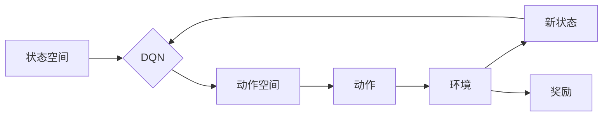

> Q-Learning, Deep Q-Network, DQN, 强化学习, 可视化, 算法原理, 应用领域, 案例分析

# 一切皆是映射：DQN学习过程的可视化技术及其价值

### 引言

强化学习（Reinforcement Learning，RL）作为一种重要的机器学习方法，在游戏、机器人、自动驾驶等领域取得了显著的成果。其中，深度Q网络（Deep Q-Network，DQN）因其强大的学习能力和灵活性，成为强化学习领域的研究热点。然而，DQN的学习过程复杂，参数众多，理解其内部机制对于实际应用至关重要。本文将深入探讨DQN学习过程的可视化技术，揭示其内在原理，并分析其在实际应用中的价值。

## 1. 背景介绍

### 1.1 强化学习概述

强化学习是一种使智能体在未知环境中通过试错学习最优策略的机器学习方法。智能体通过与环境交互，根据当前状态和采取的动作，获得奖励，并不断调整策略以最大化长期累积奖励。

### 1.2 DQN简介

DQN是一种基于深度学习的强化学习算法，由DeepMind提出。它将Q值函数与深度神经网络结合，通过学习状态-动作值函数（Q函数）来预测最优动作。

## 2. 核心概念与联系

### 2.1 DQN架构的Mermaid流程图



### 2.2 关键概念

- **状态空间（State Space）**：智能体所处的环境状态集合，通常用S表示。
- **动作空间（Action Space）**：智能体可以采取的动作集合，通常用A表示。
- **Q函数（Q-Function）**：映射状态-动作到预期未来奖励的函数，Q(s, a)。
- **策略（Policy）**：决定在给定状态下采取哪个动作的决策规则。
- **价值函数（Value Function）**：评估状态的价值，V(s) = E[G(s, a)]。
- **奖励（Reward）**：智能体在环境中采取动作后获得的即时奖励。

## 3. 核心算法原理 & 具体操作步骤

### 3.1 算法原理概述

DQN通过学习Q函数来指导智能体的行动。在训练过程中，智能体不断与环境交互，通过Q学习算法更新Q函数的值，最终找到最优策略。

### 3.2 算法步骤详解

1. **初始化Q网络**：使用随机权重初始化Q网络，并设置经验回放池存储过去的状态-动作-奖励-新状态序列。
2. **探索与利用**：智能体在状态s下，根据ε-greedy策略选择动作a，即以概率ε进行随机探索，以1-ε的概率选择Q值最大的动作。
3. **执行动作**：智能体执行动作a，并获得奖励r和新的状态s'。
4. **存储经验**：将（s, a, r, s'）存储到经验回放池中。
5. **经验回放**：从经验回放池中随机抽取一批经验，以减少方差，提高样本效率。
6. **更新Q网络**：使用目标网络来评估新状态的Q值，并使用以下公式更新当前Q网络的值：
   $$
 Q(s, a) \leftarrow Q(s, a) + \alpha [r + \gamma \max_{a'} Q(s', a') - Q(s, a)]
 $$
   其中，α为学习率，γ为折扣因子。
7. **重复步骤2-6**，直至达到训练目标。

### 3.3 算法优缺点

**优点**：

- **强大学习能力**：DQN能够通过深度神经网络学习复杂的Q函数，适应性强。
- **无需先验知识**：DQN不需要对环境进行建模，适用于复杂环境。
- **可扩展性**：DQN可以应用于各种强化学习任务。

**缺点**：

- **训练不稳定**：DQN的训练过程可能不稳定，需要仔细调整超参数。
- **样本效率低**：DQN需要大量样本才能收敛。

### 3.4 算法应用领域

DQN在以下领域取得了显著的应用成果：

- **电子游戏**：DQN在多个电子游戏中取得了超人类的表现，如Atari 2600游戏。
- **机器人控制**：DQN被应用于机器人控制，实现自动行走、抓取等任务。
- **自动驾驶**：DQN被应用于自动驾驶，实现车辆控制和安全驾驶。

## 4. 数学模型和公式 & 详细讲解 & 举例说明

### 4.1 数学模型构建

DQN的数学模型主要包括Q网络、经验回放池和目标网络。

- **Q网络**：
  $$
 Q(s, a; \theta) = f_\theta(s, a) = \sum_{k=0}^K w_k f_k(s, a)
 $$
  其中，$f_k(s, a)$为深度神经网络，$w_k$为权重。

- **经验回放池**：
  $$
 R^t = \{ (s_t, a_t, r_t, s_{t+1}) \}_{t=0}^T
 $$
  其中，$R^t$为经验回放池，包含历史状态-动作-奖励-新状态序列。

- **目标网络**：
  $$
 Q(s', a; \theta) = f_\theta'(s', a) = \sum_{k=0}^K w_k' f_k'(s', a)
 $$
  其中，$f_k'(s', a)$为另一个深度神经网络，$w_k'$为权重。

### 4.2 公式推导过程

DQN的更新公式如下：

$$
 Q(s, a) \leftarrow Q(s, a) + \alpha [r + \gamma \max_{a'} Q(s', a') - Q(s, a)]
 $$

其中，$\alpha$为学习率，$\gamma$为折扣因子。

### 4.3 案例分析与讲解

以Atari 2600游戏《Pong》为例，说明DQN的学习过程。

1. **初始化**：初始化Q网络和目标网络，设置经验回放池。
2. **探索与利用**：智能体在初始状态下，以随机概率选择动作。
3. **执行动作**：智能体根据选择的动作，控制游戏中的Pong球。
4. **存储经验**：将（当前状态、动作、奖励、新状态）存储到经验回放池中。
5. **经验回放**：从经验回放池中抽取一批经验。
6. **更新Q网络**：使用目标网络的预测值更新当前Q网络的值。

通过不断的学习和调整，DQN最终能够学会控制Pong球，实现游戏胜利。

## 5. 项目实践：代码实例和详细解释说明

### 5.1 开发环境搭建

1. 安装Python和PyTorch。
2. 下载DQN的PyTorch实现代码。

### 5.2 源代码详细实现

以下为DQN的PyTorch实现代码示例：

```python
# 导入必要的库
import torch
import torch.nn as nn
import torch.optim as optim
from collections import deque

# DQN类
class DQN(nn.Module):
    def __init__(self, input_dim, output_dim):
        super(DQN, self).__init__()
        self.fc1 = nn.Linear(input_dim, 64)
        self.fc2 = nn.Linear(64, 64)
        self.fc3 = nn.Linear(64, output_dim)

    def forward(self, x):
        x = torch.relu(self.fc1(x))
        x = torch.relu(self.fc2(x))
        x = self.fc3(x)
        return x

# DQN训练函数
def train_dqn(dqn, optimizer, criterion, device, train_loader, gamma):
    dqn.train()
    total_loss = 0
    for batch_idx, (data, target) in enumerate(train_loader):
        data, target = data.to(device), target.to(device)
        optimizer.zero_grad()
        output = dqn(data)
        loss = criterion(output, target)
        loss.backward()
        optimizer.step()
        total_loss += loss.item()
    return total_loss / len(train_loader)

# 主函数
def main():
    # ...（初始化参数和加载数据等）

    # 训练DQN
    for epoch in range(epochs):
        loss = train_dqn(dqn, optimizer, criterion, device, train_loader, gamma)
        print(f"Epoch {epoch+1}, loss: {loss:.4f}")

if __name__ == '__main__':
    main()
```

### 5.3 代码解读与分析

以上代码实现了DQN的核心功能，包括：

- 定义DQN网络结构。
- 实现训练函数，包括前向传播、反向传播和优化。
- 主函数，负责初始化参数、加载数据、训练DQN等。

### 5.4 运行结果展示

运行代码后，会在终端输出每个epoch的损失值，表示DQN训练过程中的性能表现。

## 6. 实际应用场景

### 6.1 游戏领域

DQN在游戏领域取得了显著的应用成果，例如：

- **Atari 2600游戏**：DQN在多个Atari 2600游戏中取得了超人类的表现，如Pong、Qbert、Space Invaders等。
- **电子竞技**：DQN可以用于训练电子竞技选手，例如《星际争霸》。

### 6.2 机器人控制

DQN可以应用于机器人控制，例如：

- **自动行走**：使用DQN训练机器人自动行走，避免障碍物。
- **抓取**：使用DQN训练机器人抓取不同形状的物体。

### 6.3 自动驾驶

DQN可以应用于自动驾驶，例如：

- **车辆控制**：使用DQN控制车辆的行驶方向、速度等。
- **交通信号灯识别**：使用DQN识别交通信号灯，实现安全驾驶。

## 7. 工具和资源推荐

### 7.1 学习资源推荐

- 《Reinforcement Learning: An Introduction》
- 《Deep Reinforcement Learning with Python》
- 《Deep Learning for Reinforcement Learning》

### 7.2 开发工具推荐

- PyTorch
- OpenAI Gym
- Stable Baselines

### 7.3 相关论文推荐

- **《Deep Q-Networks》**：DQN的原论文，介绍了DQN的基本原理和实现方法。
- **《Playing Atari with Deep Reinforcement Learning》**：展示了DQN在Atari游戏中的应用。
- **《Human-level control through deep reinforcement learning》**：介绍了DeepMind开发的AlphaGo，展示了强化学习的强大能力。

## 8. 总结：未来发展趋势与挑战

### 8.1 研究成果总结

本文介绍了DQN学习过程的可视化技术，包括核心概念、算法原理、具体操作步骤、数学模型、项目实践和实际应用场景。DQN作为一种基于深度学习的强化学习算法，在游戏、机器人、自动驾驶等领域取得了显著的成果。

### 8.2 未来发展趋势

- **模型结构优化**：探索更有效的网络结构，提高DQN的学习能力和泛化能力。
- **算法改进**：研究更有效的训练策略，提高DQN的训练效率和稳定性。
- **多智能体强化学习**：研究多智能体协同学习，实现更复杂的任务。

### 8.3 面临的挑战

- **训练效率**：提高DQN的训练效率，减少训练时间。
- **样本效率**：提高DQN的样本效率，减少对样本数量的依赖。
- **可解释性**：提高DQN的可解释性，理解其决策过程。

### 8.4 研究展望

DQN作为强化学习领域的重要算法，未来将在更多领域得到应用。随着研究的不断深入，DQN将取得更大的突破，为人工智能的发展做出更大的贡献。

## 9. 附录：常见问题与解答

**Q1：DQN的Q值是什么意思？**

A：DQN的Q值表示在给定状态下采取某个动作的预期未来奖励。Q值越高，表示该动作越优。

**Q2：DQN为什么使用ε-greedy策略？**

A：ε-greedy策略在探索和利用之间取得平衡。当ε较小时，智能体倾向于选择Q值最大的动作；当ε较大时，智能体倾向于随机探索，以发现更多可能的最优动作。

**Q3：DQN如何解决样本效率低的问题？**

A：DQN可以通过经验回放池来提高样本效率。经验回放池存储了历史经验，可以重复利用，减少对新鲜样本的需求。

**Q4：DQN在哪些领域取得了显著的应用成果？**

A：DQN在游戏、机器人、自动驾驶等领域取得了显著的成果。

**Q5：DQN的未来发展方向是什么？**

A：DQN的未来发展方向包括模型结构优化、算法改进和多智能体强化学习等。

作者：禅与计算机程序设计艺术 / Zen and the Art of Computer Programming