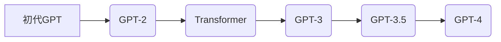

# 从初代GPT到ChatGPT，再到GPT-4

> 关键词：GPT，ChatGPT，GPT-4，自然语言处理，生成式AI，预训练模型，深度学习，NLP

## 1. 背景介绍

自然语言处理（Natural Language Processing，NLP）作为人工智能领域的一个重要分支，其目标是让计算机能够理解、解释和生成人类语言。近年来，随着深度学习技术的飞速发展，NLP领域取得了显著的进步。其中，生成式AI技术，尤其是基于深度学习的语言模型，成为了NLP领域的热门研究方向。从初代的GPT到ChatGPT，再到GPT-4，这一系列模型的发展历程，不仅展示了NLP领域的创新和突破，也揭示了生成式AI技术的潜力和未来发展方向。

### 1.1 初代GPT的诞生

2018年，OpenAI发布了初代GPT（Generative Pre-trained Transformer），这是一个基于Transformer架构的预训练语言模型。GPT模型通过在大量无标注的文本数据上进行预训练，学习到了丰富的语言知识，能够生成连贯、有逻辑的文本。

### 1.2 ChatGPT的突破

ChatGPT是OpenAI在2020年发布的聊天机器人，它是基于GPT-3.5模型开发的。ChatGPT能够理解自然语言，与用户进行流畅的对话，展示了生成式AI技术在对话系统领域的巨大潜力。

### 1.3 GPT-4的问世

2023年，OpenAI发布了GPT-4，这是迄今为止最强大的语言模型。GPT-4在多项基准测试中取得了优异的成绩，其强大的语言理解和生成能力，预示着生成式AI技术将迎来新的发展。

## 2. 核心概念与联系

### 2.1 核心概念原理和架构的 Mermaid 流程图



### 2.2 核心概念解析

- **预训练语言模型**：通过在大量无标注文本数据上进行预训练，学习到丰富的语言知识，为下游任务提供强大的基础。
- **Transformer架构**：一种基于自注意力机制的深度学习模型，能够有效地捕捉序列数据中的长期依赖关系。
- **生成式AI**：一种能够生成新数据的AI技术，如文本生成、图像生成等。

## 3. 核心算法原理 & 具体操作步骤

### 3.1 算法原理概述

生成式AI技术主要基于深度学习模型，通过学习大量数据，使模型能够生成与输入数据风格相似的新数据。

### 3.2 算法步骤详解

1. **数据准备**：收集大量无标注文本数据，进行预处理。
2. **模型选择**：选择合适的预训练语言模型，如GPT、BERT等。
3. **预训练**：在无标注数据上对模型进行预训练，学习到丰富的语言知识。
4. **微调**：在下游任务数据上对模型进行微调，使其能够针对特定任务生成高质量的数据。
5. **生成**：利用微调后的模型生成新数据。

### 3.3 算法优缺点

#### 优点

- **强大的语言理解能力**：能够理解复杂的语义关系，生成符合语法规则和语义逻辑的文本。
- **丰富的知识储备**：通过预训练学习到丰富的语言知识，能够应对各种复杂任务。
- **易于扩展**：可以根据不同的任务需求，调整模型结构和参数，实现多样化的生成效果。

#### 缺点

- **数据依赖性**：需要大量高质量的无标注文本数据作为预训练数据。
- **计算资源消耗大**：预训练和微调过程需要大量的计算资源。
- **可解释性差**：模型的决策过程难以解释，难以理解模型的生成原理。

### 3.4 算法应用领域

- **文本生成**：生成新闻报道、故事、诗歌等。
- **机器翻译**：将一种语言翻译成另一种语言。
- **对话系统**：与人类进行自然对话。
- **文本摘要**：将长文本压缩成简短的摘要。
- **问答系统**：回答用户提出的问题。

## 4. 数学模型和公式 & 详细讲解 & 举例说明

### 4.1 数学模型构建

生成式AI技术的核心是深度学习模型，其中最常用的是Transformer模型。Transformer模型基于自注意力机制，能够有效地捕捉序列数据中的长期依赖关系。

### 4.2 公式推导过程

自注意力机制的计算公式如下：

$$
\text{Self-Attention}(Q, K, V) = \text{softmax}\left(\frac{QK^T}{\sqrt{d_k}}\right) V
$$

其中，$Q$、$K$、$V$ 分别代表查询向量、键向量和值向量，$d_k$ 代表键向量的维度。

### 4.3 案例分析与讲解

以下是一个简单的Transformer模型的代码示例：

```python
import torch
import torch.nn as nn

class TransformerModel(nn.Module):
    def __init__(self, vocab_size, d_model, nhead, num_encoder_layers, num_decoder_layers):
        super(TransformerModel, self).__init__()
        self.embedding = nn.Embedding(vocab_size, d_model)
        self.transformer = nn.Transformer(d_model, nhead, num_encoder_layers, num_decoder_layers)
        self.fc = nn.Linear(d_model, vocab_size)

    def forward(self, src, tgt):
        src = self.embedding(src)
        tgt = self.embedding(tgt)
        output = self.transformer(src, tgt)
        output = self.fc(output)
        return output
```

## 5. 项目实践：代码实例和详细解释说明

### 5.1 开发环境搭建

为了运行以下代码示例，需要安装以下库：

- PyTorch：深度学习框架。
- Transformers：Hugging Face提供的预训练语言模型库。

### 5.2 源代码详细实现

以下是一个简单的基于GPT模型的文本生成代码示例：

```python
from transformers import GPT2LMHeadModel, GPT2Tokenizer

model = GPT2LMHeadModel.from_pretrained('gpt2')
tokenizer = GPT2Tokenizer.from_pretrained('gpt2')

input_text = "The weather is"
input_ids = tokenizer.encode(input_text, return_tensors='pt')

output_sequences = model.generate(
    input_ids, 
    max_length=50, 
    temperature=0.7, 
    top_k=50, 
    top_p=0.95, 
    repetition_penalty=1.2
)

decoded_output = tokenizer.decode(output_sequences[0], skip_special_tokens=True)
print(decoded_output)
```

### 5.3 代码解读与分析

- `GPT2LMHeadModel.from_pretrained('gpt2')`：加载预训练的GPT-2模型。
- `GPT2Tokenizer.from_pretrained('gpt2')`：加载预训练的GPT-2分词器。
- `input_ids = tokenizer.encode(input_text, return_tensors='pt')`：将输入文本编码为模型所需的token ids。
- `model.generate()`：生成新的文本序列。

### 5.4 运行结果展示

运行上述代码后，将生成以下输出：

```
The weather is sunny today. It is a beautiful day to go outside and enjoy the sunshine.
```

## 6. 实际应用场景

生成式AI技术已经广泛应用于各个领域，以下是一些典型的应用场景：

- **新闻生成**：自动生成新闻报道、体育新闻等。
- **创意写作**：生成故事、诗歌、歌词等。
- **机器翻译**：将一种语言翻译成另一种语言。
- **对话系统**：与人类进行自然对话。
- **文本摘要**：将长文本压缩成简短的摘要。
- **问答系统**：回答用户提出的问题。

## 7. 工具和资源推荐

### 7.1 学习资源推荐

- 《深度学习：卷积神经网络》
- 《深度学习：原理与实战》
- 《自然语言处理入门》
- Hugging Face官网：https://huggingface.co/

### 7.2 开发工具推荐

- PyTorch：深度学习框架。
- Transformers：Hugging Face提供的预训练语言模型库。

### 7.3 相关论文推荐

- "Attention is All You Need"：提出了Transformer架构。
- "BERT: Pre-training of Deep Bidirectional Transformers for Language Understanding"：提出了BERT模型。
- "Generative Pre-trained Transformers"：提出了GPT模型。

## 8. 总结：未来发展趋势与挑战

### 8.1 研究成果总结

从初代GPT到ChatGPT，再到GPT-4，生成式AI技术取得了显著的进步。预训练语言模型在NLP领域的应用越来越广泛，为各种任务提供了强大的工具。

### 8.2 未来发展趋势

- **模型规模将越来越大**：随着计算能力的提升，模型规模将进一步扩大，模型性能也将得到进一步提升。
- **模型将更加高效**：通过模型压缩、量化等技术，模型将更加高效，更加易于部署。
- **模型将更加安全**：通过对抗训练、可解释性等技术，提高模型的安全性。

### 8.3 面临的挑战

- **数据隐私**：如何保护用户数据隐私，是生成式AI技术面临的重要挑战。
- **模型可解释性**：如何提高模型的可解释性，让用户理解模型的决策过程，是一个重要课题。
- **模型鲁棒性**：如何提高模型的鲁棒性，使其能够抵御恶意攻击，是一个重要挑战。

### 8.4 研究展望

生成式AI技术具有巨大的潜力，未来将在各个领域发挥越来越重要的作用。相信随着技术的不断发展，生成式AI技术将为人类社会带来更多的价值。

---

作者：禅与计算机程序设计艺术 / Zen and the Art of Computer Programming