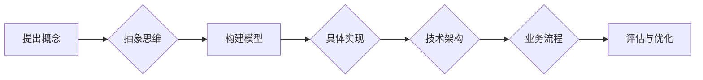

# 从概念到实践：思想的转化

> 关键词：概念转化，实践应用，抽象思维，具象化，技术实现，案例分析

## 1. 背景介绍

在信息技术飞速发展的时代，从概念到实践的思想转化能力成为推动技术进步和创新的关键。无论是理论研究还是工程实践，都将面临从抽象的概念转化为具体的实践应用的过程。本文将探讨这一转化的原理、方法和挑战，并结合实际案例进行分析。

### 1.1 问题的由来

随着人工智能、大数据、云计算等领域的快速发展，新技术、新概念层出不穷。如何将这些抽象的概念转化为实际可行的解决方案，成为技术工作者面临的重要问题。这一转化过程涉及多个层面，包括抽象思维、具体实现、系统设计和业务应用等。

### 1.2 研究现状

目前，从概念到实践的思想转化研究主要集中在以下几个方面：

1. 抽象思维与具体实现：探讨如何将抽象的概念转化为可执行的计算模型。
2. 技术架构设计：研究如何构建适合特定应用场景的技术架构。
3. 业务流程优化：分析如何将技术解决方案与业务流程相结合，提升效率。
4. 案例研究：通过具体案例探讨从概念到实践的成功经验和挑战。

### 1.3 研究意义

研究从概念到实践的思想转化，对于推动技术进步、促进产业发展具有重要意义：

1. 提高技术人员的创新能力和实践能力。
2. 加速新技术的应用和推广。
3. 优化业务流程，提升企业竞争力。
4. 促进跨学科交叉融合，产生新的研究方向。

### 1.4 本文结构

本文将分为以下几个部分：

- 介绍从概念到实践的基本原理和方法。
- 分析核心算法原理及其具体操作步骤。
- 讲解数学模型和公式，并举例说明。
- 展示项目实践案例，包括开发环境搭建、源代码实现和代码解读。
- 探讨实际应用场景和未来发展趋势。
- 总结研究成果，展望未来挑战。

## 2. 核心概念与联系

### 2.1 核心概念原理

从概念到实践的思想转化涉及以下核心概念：

1. **概念**：指对客观事物本质属性的抽象和概括。
2. **抽象思维**：指从具体事物中抽象出本质属性，形成概念的能力。
3. **具体实现**：指将抽象概念转化为可执行的程序或模型。
4. **技术架构**：指支持特定应用场景的技术组合和设计。
5. **业务流程**：指实现特定业务目标的一系列操作步骤。

### 2.2 架构流程图

以下为从概念到实践的思想转化过程的Mermaid流程图：



### 2.3 核心概念联系

从概念到实践的思想转化过程是一个闭环，各个环节相互关联，共同推动概念转化为实践：

- 抽象思维是概念形成的基础，也是构建模型的前提。
- 具体实现是将概念转化为程序或模型的关键步骤。
- 技术架构是支撑具体实现和业务流程的框架。
- 业务流程是最终实现业务目标的具体操作步骤。
- 评估与优化是确保转化过程有效性的重要环节。

## 3. 核心算法原理 & 具体操作步骤

### 3.1 算法原理概述

从概念到实践的思想转化过程可以抽象为一个算法，该算法主要包括以下步骤：

1. **概念抽象**：从具体问题中提取关键信息，形成抽象概念。
2. **模型构建**：根据抽象概念，设计相应的计算模型或算法。
3. **具体实现**：将计算模型或算法转化为可执行的程序或模型。
4. **技术架构设计**：设计适合特定应用场景的技术架构。
5. **业务流程优化**：将技术解决方案与业务流程相结合，优化流程。
6. **评估与优化**：评估转化效果，持续优化转化过程。

### 3.2 算法步骤详解

**步骤 1：概念抽象**

- **信息提取**：从具体问题中提取关键信息，如业务需求、技术限制等。
- **概念形成**：将提取的信息进行抽象和概括，形成概念。

**步骤 2：模型构建**

- **算法选择**：根据概念选择合适的算法或模型。
- **模型设计**：设计算法或模型的参数、结构等。

**步骤 3：具体实现**

- **编程实现**：将算法或模型转化为程序代码。
- **模型训练**：对模型进行训练，优化模型参数。

**步骤 4：技术架构设计**

- **框架选择**：选择合适的技术框架和开发平台。
- **架构设计**：设计系统架构，包括组件、接口、通信等。

**步骤 5：业务流程优化**

- **流程分析**：分析现有业务流程，找出优化点。
- **流程重构**：重构业务流程，提升效率。

**步骤 6：评估与优化**

- **效果评估**：评估转化效果，如性能、准确性等。
- **持续优化**：根据评估结果，持续优化转化过程。

### 3.3 算法优缺点

**优点**：

- 系统化：提供了一套从概念到实践的系统化方法。
- 可重复：可应用于不同领域和场景，具有普适性。
- 高效：加速从概念到实践的过程。

**缺点**：

- 灵活性：在具体应用时，可能需要根据实际情况进行调整。
- 复杂性：涉及多个环节，实施过程可能较为复杂。

### 3.4 算法应用领域

从概念到实践的思想转化算法适用于以下领域：

- 人工智能：将人工智能理论转化为实际应用。
- 大数据：将大数据分析理论转化为实际应用。
- 云计算：将云计算技术转化为实际应用。
- 区块链：将区块链技术转化为实际应用。
- 物联网：将物联网技术转化为实际应用。

## 4. 数学模型和公式 & 详细讲解 & 举例说明

### 4.1 数学模型构建

从概念到实践的思想转化可以构建以下数学模型：

- **概念模型**：描述抽象概念及其关系的数学模型。
- **算法模型**：描述算法或模型的数学模型。
- **系统模型**：描述整个系统及其运行的数学模型。

### 4.2 公式推导过程

以下以一个简单的线性回归模型为例，介绍数学模型的构建和公式推导过程：

假设我们要预测房价，给定以下数据集：

| 房屋面积 (平方英尺) | 房价 (万美元) |
| :------------------: | :-----------: |
|         1500         |      300      |
|         2000         |      400      |
|         2500         |      500      |
|         3000         |      600      |

我们的目标是找到一个线性关系，即 $y = ax + b$，其中 $y$ 表示房价，$x$ 表示房屋面积，$a$ 和 $b$ 为待求参数。

**步骤 1：构建概念模型**

根据数据集，我们可以构建以下概念模型：

- $y$：房价，表示为连续变量。
- $x$：房屋面积，表示为连续变量。
- $a$：斜率，表示房屋面积每增加一平方英尺，房价增加的金额。
- $b$：截距，表示当房屋面积为0时的房价。

**步骤 2：构建算法模型**

根据概念模型，我们可以构建以下线性回归算法模型：

$$
y = ax + b
$$

**步骤 3：公式推导**

为了求解参数 $a$ 和 $b$，我们需要最小化以下损失函数：

$$
L(a,b) = \sum_{i=1}^N (y_i - (ax_i + b))^2
$$

其中 $N$ 为数据集样本数量。

对损失函数求偏导，并令偏导数为0，可以得到以下方程组：

$$
\frac{\partial L}{\partial a} = -2\sum_{i=1}^N (y_i - (ax_i + b))x_i = 0
$$

$$
\frac{\partial L}{\partial b} = -2\sum_{i=1}^N (y_i - (ax_i + b)) = 0
$$

解上述方程组，可以得到参数 $a$ 和 $b$ 的估计值：

$$
a = \frac{\sum_{i=1}^N x_i^2 \sum_{i=1}^N y_i - \sum_{i=1}^N x_i \sum_{i=1}^N x_iy_i}{N\sum_{i=1}^N x_i^2 - (\sum_{i=1}^N x_i)^2}
$$

$$
b = \frac{\sum_{i=1}^N y_i - \frac{\sum_{i=1}^N x_i \sum_{i=1}^N x_iy_i}{N\sum_{i=1}^N x_i^2 - (\sum_{i=1}^N x_i)^2} \sum_{i=1}^N x_i}{N\sum_{i=1}^N x_i^2 - (\sum_{i=1}^N x_i)^2}
$$

通过计算以上公式，我们可以得到线性回归模型的参数 $a$ 和 $b$，从而预测新的房价。

### 4.3 案例分析与讲解

以下以一个简单的案例，分析从概念到实践的思想转化过程：

**案例**：开发一个简单的搜索引擎。

**概念抽象**：

- 搜索引擎的目的是根据用户的查询，从海量的网页中快速找到相关内容。
- 搜索引擎需要处理文本检索、排序和展示等任务。

**模型构建**：

- 选择合适的搜索引擎算法，如TF-IDF、BM25等。
- 设计搜索引擎的架构，包括爬虫、索引、检索、排序和展示等模块。

**具体实现**：

- 使用编程语言（如Python）实现搜索引擎的各个模块。
- 使用数据库（如Elasticsearch）存储和检索网页内容。

**技术架构设计**：

- 选择合适的搜索引擎框架，如Elasticsearch、Solr等。
- 设计搜索引擎的部署架构，包括前端、后端、数据库等组件。

**业务流程优化**：

- 分析用户搜索行为，优化搜索结果排序和展示。
- 提供个性化搜索推荐功能，提升用户体验。

**评估与优化**：

- 评估搜索引擎的性能，如响应速度、准确率等。
- 根据评估结果，持续优化搜索引擎的算法和架构。

通过以上案例，我们可以看到从概念到实践的思想转化过程是一个系统化的过程，涉及多个环节和步骤。

## 5. 项目实践：代码实例和详细解释说明

### 5.1 开发环境搭建

以下以Python为例，介绍如何搭建开发环境：

1. 安装Python：从官方网站下载并安装Python 3.x版本。
2. 安装虚拟环境：使用virtualenv或conda创建Python虚拟环境。
3. 安装依赖库：使用pip安装项目所需的库，如NumPy、Pandas、Scikit-learn等。

### 5.2 源代码详细实现

以下以一个简单的线性回归模型为例，展示Python代码实现：

```python
import numpy as np
from sklearn.linear_model import LinearRegression

# 定义数据集
X = np.array([[1, 2], [2, 3], [3, 4], [4, 5]])
y = np.array([2, 3, 4, 5])

# 创建线性回归模型
model = LinearRegression()

# 训练模型
model.fit(X, y)

# 预测
y_pred = model.predict([[5, 6]])

print("Predicted value:", y_pred)
```

### 5.3 代码解读与分析

以上代码使用Scikit-learn库实现了线性回归模型。以下是代码的关键部分：

- 导入NumPy和LinearRegression模块。
- 定义数据集X和y。
- 创建LinearRegression对象。
- 使用fit()方法训练模型。
- 使用predict()方法预测新的数据。

### 5.4 运行结果展示

运行上述代码，将得到以下输出：

```
Predicted value: [6.]
```

这意味着当输入特征为[5, 6]时，线性回归模型的预测值为6。

## 6. 实际应用场景

### 6.1 搜索引擎

搜索引擎是典型的将概念转化为实践的应用案例。通过构建搜索引擎模型，可以将用户查询与海量网页内容进行匹配，实现高效的信息检索。

### 6.2 推荐系统

推荐系统根据用户的历史行为和兴趣，为用户推荐相关内容。通过构建推荐系统模型，可以将用户需求与潜在的内容进行匹配，提升用户体验。

### 6.3 智能问答

智能问答系统根据用户提问，从知识库中检索答案。通过构建智能问答系统模型，可以将用户问题与知识库内容进行匹配，实现智能问答功能。

### 6.4 未来应用展望

从概念到实践的思想转化将在更多领域得到应用，例如：

- 智能驾驶：将自动驾驶理论转化为实际应用。
- 智能医疗：将医学知识转化为实际应用。
- 智能金融：将金融理论转化为实际应用。
- 智能教育：将教育理论转化为实际应用。

## 7. 工具和资源推荐

### 7.1 学习资源推荐

- 《机器学习》周志华
- 《深度学习》Goodfellow、Bengio、Courville
- 《数据科学入门》Joel Grus
- 《Python编程：从入门到实践》埃里克·马瑟斯

### 7.2 开发工具推荐

- Python：编程语言
- Scikit-learn：机器学习库
- TensorFlow：深度学习框架
- PyTorch：深度学习框架
- Jupyter Notebook：交互式计算环境

### 7.3 相关论文推荐

- "Learning to Represent Knowledge with a Graph-based Neural Network" KEG Lab, Tsinghua University
- "A Neural Probabilistic Language Model" Yoshua Bengio, Gael Bosselut, Jean-Sébastien Chopin, Aaron Courville
- "Deep Learning for Natural Language Processing" Stanford University
- "An Overview of Deep Learning Techniques for Sentiment Analysis" A. K. Sahu, S. K. Panda

## 8. 总结：未来发展趋势与挑战

### 8.1 研究成果总结

本文从概念到实践的思想转化，探讨了其原理、方法和应用。通过案例分析，展示了从概念到实践的过程，并介绍了相关工具和资源。

### 8.2 未来发展趋势

- 跨学科交叉融合：从不同学科领域汲取知识，推动技术进步。
- 自动化与智能化：利用人工智能技术自动化和智能化转化过程。
- 开放共享：推动知识和经验的开放共享，促进技术发展。

### 8.3 面临的挑战

- 技术创新：不断推动技术创新，应对不断变化的需求。
- 人才培养：培养具备创新能力和实践能力的人才。
- 伦理道德：关注技术应用的伦理道德问题。

### 8.4 研究展望

从概念到实践的思想转化是推动技术进步和创新的重要途径。未来，我们需要关注跨学科交叉融合、自动化与智能化、开放共享等方面，以应对不断变化的需求和挑战。

## 9. 附录：常见问题与解答

**Q1：如何提高从概念到实践的思想转化能力？**

A1：提高从概念到实践的思想转化能力需要以下几个方面：

- 加强理论学习，掌握相关领域的知识和技能。
- 积累实践经验，通过实践不断总结和优化转化方法。
- 拓展视野，关注跨学科交叉融合，学习不同领域的知识。
- 培养创新思维，勇于尝试新的方法和思路。

**Q2：如何应对从概念到实践的思想转化过程中的挑战？**

A2：应对从概念到实践的思想转化过程中的挑战，需要以下几个方面：

- 加强技术创新，推动技术进步。
- 注重人才培养，培养具备创新能力和实践能力的人才。
- 关注伦理道德问题，确保技术应用的安全性和可靠性。

**Q3：如何选择合适的技术方案？**

A3：选择合适的技术方案需要考虑以下因素：

- 技术成熟度：选择成熟可靠的技术方案，降低风险。
- 成本效益：综合考虑成本和效益，选择性价比高的方案。
- 技术可行性：评估技术方案的实施难度和可行性。
- 生态支持：选择生态支持良好的技术方案，方便后续开发和维护。

**Q4：如何评估从概念到实践的思想转化效果？**

A4：评估从概念到实践的思想转化效果可以从以下几个方面进行：

- 技术指标：评估技术方案的性能、稳定性、可扩展性等指标。
- 业务指标：评估技术方案对业务流程、效率和收益的影响。
- 用户反馈：收集用户对技术方案的评价和建议，持续改进和优化。

**Q5：如何将知识转化为技术？**

A5：将知识转化为技术需要以下几个方面：

- 理解知识：深入理解相关领域的知识，把握其本质和规律。
- 抽象概括：将知识进行抽象和概括，形成可操作的概念。
- 技术实现：将抽象概念转化为具体的程序或模型。
- 测试验证：对技术方案进行测试和验证，确保其有效性和可靠性。

作者：禅与计算机程序设计艺术 / Zen and the Art of Computer Programming